# CognitiveOS：面向自主智能体与具身智能的认知—物理操作系统
## ——以可验证治理与上下文工程承载持续认知
- **版本**：0.8 Draft
- **上一版本**：0.7 Draft（见附录 D）
- **状态**：总体架构白皮书
- **发布日期**：2026-07-19
- **语言**：中文
- **文档性质**：Informative Architecture Whitepaper
- **适用对象**：Agent 平台、自治系统、机器人、边缘智能与异构计算架构师
- **配套资产**：本仓库的 [规范套件](./specs/) 与 [符合性资产](./conformance/) 分别承载实际存在的规范和测试材料；新增 [RFC-0001](./RFC-0001-cognitiveos-governance-context-access.md) 是 v0.2 Draft normative companion；仓库已登记治理对象族（[governed-object-contract](./docs/standards/governed-object-contract.md)）、管理会话、性能报告等机器 schema 与 REQ/错误码/声明式向量条目，但这些资产不等于实现
> 本文解释 CognitiveOS 的问题边界、总体结构、关键抽象与演进方向。
> 本文不直接定义一致性义务。
> 规范性对象、状态机、线协议、错误码与测试要求由规范套件给出。

> **阅读提示**：本文的“架构机制”描述可验证边界与责任划分，不代表某一实现已经具备这些能力；实现状态、适用 Profile、降级项和测试证据必须以其机器可读 manifest 为准。

### 架构契约与规范优先级

CognitiveOS 的架构契约由同一系统的四个正交视图组成：**双内核**隔离开放式慢认知与硬实时安全仲裁；**三平面**分离体验、控制、执行与数据责任；**七层**给出从宿主/物理世界到 Agent/应用的责任分解；**Context Engineering** 是贯穿三平面和七层的横切服务，而不是第四 authority 平面。任何实现都不能用其中一个视图替代另一个视图的责任。

权威层级按具体对象和动作判定：目标状态域 authority 对写入与仲裁负责，Task acceptance authority 对完成负责，实时安全内核对最终物理执行器仲裁负责；模型、检索结果、远端 `completed`、工具 receipt、Conversation 参与关系和 ContextView 均不自动获得这些 authority。

规范优先级为：实现 manifest 固定 digest 的适用机器 schema 与 normative companion 要求 > 被固定版本的 RFC/Core/Profile 文本 > 本说明性白皮书 > 实现建议与示例。冲突时采用不扩大权限、数据范围、风险、预算或完成声明的解释。本文中的大写 **MUST/MUST NOT/SHOULD/MAY** 仅在明确引用 REQ-ID 或规范资产时表达规范义务；其余架构不变量是设计约束，建议和部署示例均为 informative。
---

## 版本导读

v0.8 在 v0.7 的可安装 Agent 基线上，新增以用户意图为端到端验收主线的双通道 Agent Shell、任务/进程监督、事件驱动 watch 与人机协作协议，并系统修复章节、状态与机器资产漂移。

v0.7 在 v0.6 的统一治理模型上补齐从“治理型白皮书”到“可安装成熟 Agent 的操作系统”之间的产品与协议层：Agent package/installation、受治理记忆、认知资源发现、Operation Catalog、可选 Semantic Mediation Service（SMS）与 Cognitive Resource Broker（CRB）。C0—C3 表达适配可观察性，不替代 R0—R3 风险分级；SMS/CRB 均位于微内核外且不拥有 authority。

本文所称“五状态域”准确指五个执行生命周期状态机；authority 管理的 World、Conversation、Policy、Membership、Knowledge 等状态域仍是开放集合，不受“五个”限制。本版同时约束以下容易误用的倾向：

1. **上下文重要，但不是新的 authority**：`ContextView` 是派生工作视图，不与 World State、事件提交历史或 TaskContract 争夺权威性。
2. **CVM 是实现模型，不是假装存在硬件页表**：page fault、pin、working set 等术语只有在能映射为明确对象、错误、预算与审计行为时才有工程意义。
3. **治理机制与优化策略分离**：授权、版本固定、硬预算和损失声明属于机制；检索器、排序器、摘要器和所谓“认知经济学”目标属于可替换策略或待验证假设。
4. **不扩张规范承诺**：本文仍是说明性白皮书，不虚构 schema、REQ-ID、错误码或测试向量。升级后的 [RFC-0001](./RFC-0001-cognitiveos-governance-context-access.md) 是 v0.2 Draft normative companion；已提交的机器资产边界以其正文和规范索引为准。
5. **隔离不等于授权**：Tenant 是数据与策略隔离域，不是权限等级；同租户、管理员或基础设施控制权均不自动获得正文读取权。
6. **对话是资源作用域**：Conversation 与 AuthenticationSession、RuntimeSession 分离；并发对话默认使用独立 AgentExecution，认知缓存和 working memory 不得串用。
7. **Intelligent Shell 不持有常驻特权**：管理操作使用强认证建立的短期 `PrivilegedManagementSession`；session 只给出管理权限上界，每个写操作仍需结构化 proposal、确定性门禁、必要的独立批准与 Effect 对账。

---

<a id="toc"></a>
## 目录

- [版本导读](#版本导读) · [0. 执行摘要](#0-执行摘要)
- [1. 文档定位与规范地图](#1-文档定位与规范地图)
- [2. 第一性原理：稀缺资源下的约束优化](#2-第一性原理稀缺资源下的约束优化)
- [3. 严格 OS 判据与系统边界](#3-严格-os-判据与系统边界)
- [4. 总体架构](#4-总体架构双内核三平面七层与横切上下文服务)
- [5. Agent Packaging、Installation 与 Compatibility](#5-agent-packaginginstallation-与-compatibility)
- [6. 持久认知进程模型](#6-持久认知进程模型)
- [7. 认知微内核](#7-认知微内核)
- [8. 世界状态、事件与 authority](#8-世界状态事件与-authority)
- [9. Context Engineering](#9-context-engineeringcontext-virtual-memory-与-resolution)
- [10. Harness 与 Loop Engineering](#10-harness-与-loop-engineering)
- [11. AKP：Agent Kernel Protocol](#11-akpagent-kernel-protocol)
- [12. OperationDescriptor、Capability 与 Agent Shell](#capability-protocol)
- [13. 慢认知、技能与硬实时回路](#13-慢认知技能与硬实时回路)
- [14. ResourceGraph、数据驻留与异构计算](#14-resourcegraph数据驻留与异构计算)
- [15. 多 Agent 架构](#15-多-agent-架构)
- [16. 故障模型、分布式一致性与恢复](#16-故障模型分布式一致性与恢复)
- [17. 纵深安全](#17-纵深安全)
- [18. 持续学习与系统演进](#18-持续学习与系统演进)
- [19. 可观测性、评估与符合性](#19-可观测性评估与符合性)
- [20. 参考部署形态](#20-参考部署形态)
- [21. 路线图](#21-路线图) · [22. 开放研究问题](#22-开放研究问题)
- [23. 架构决策摘要](#23-架构决策摘要) · [24. 结论](#24-结论)
- [附录 A：核心术语](#附录-a核心术语) · [附录 B：规范套件导航](#附录-b规范套件导航) · [附录 C：参考资料与证据等级](#附录-c参考资料与证据等级) · [附录 D：版本说明](#附录-d版本说明)

### 读者路线图

不同读者可按下列入口顺序快速定位关心的章节；后续章节按交叉引用回溯即可。

| 读者角色 | 推荐起点 | 第一目标 | 第二目标 |
|---|---|---|---|
| 平台/系统架构师 | §0、§2、§3 | 弄清 CognitiveOS 之所以称为 OS 的判据与边界 | §4（双内核/三平面/七层）、§23（架构决策摘要） |
| 实现者 / 内核开发者 | §6、§7、§8、§11 | 拿到对象/状态/授权/Effect 的最小骨架与 AKP 协议面 | §6（持久认知进程）、§16（恢复顺序）、对应 Profile 章节 |
| 安全 / 审计负责人 | §17、§9.7、§19.7 | 看清威胁模型、八道防线与 Readiness Case 模板 | §12（授权）、§16.1（故障模型保证边界）、`threats` 锚点附近 |
| 具身 / 异构 / 边缘部署负责人 | §13、§14、§20.3、§20.5 | 在三时间尺度、ResourceGraph 与风险分级中找到本部署基线 | §20.4（资源受限设备裁剪）、Embodied/Heterogeneous companion、§19.5 符合性层级 |
| 多 Agent / 分布式协作负责人 | §15、§16、§10.5 | 看清委派契约、分区与分布式一致性策略 | §20.2（企业多租户）、Distributed companion |
| 持续学习 / 上线负责人 | §18、§19.7 | 拿到受控发布流水线与 Readiness Case | Learning companion、§18.6（可回滚演进） |

---


## 0. 执行摘要

CognitiveOS 面向的不是“更长的模型调用”，而是一类新的系统负载：它以目标为入口，在不完全观察下跨会话持续运行，混合概率推理与确定性程序，并可能改变数字或物理世界。

传统宿主 OS 管理 CPU、内存、设备与进程；Agent Runtime 组织模型和工具调用；工作流引擎编排已知步骤。它们通常不共同回答：谁对当前状态有最终解释权；跨重启执行如何保持身份；一次活动应看见哪些信息；语义提议如何获得授权并形成可验证改变；外部结果未知时如何避免重复伤害；慢认知如何服从硬实时安全边界。

CognitiveOS 的核心命题是：

> **在注意力、时间、证据、授权、风险、数据驻留与物理资源受限的条件下，把开放式语义推理约束为可验证、可恢复、可审计的控制循环。**

其五个支柱是：

| 支柱 | 核心抽象 | 主要治理问题 |
|---|---|---|
| 持久认知进程 | `AgentExecution`、Conversation、Checkpoint | 主体、对话与执行连续性 |
| 状态与 authority | StateSnapshot、事件提交历史、CAS | 哪个事实可读、谁能写入 |
| Context Engineering | ContextRequest、ContextView、CVM | 有限注意力下应装入什么、丢失了什么 |
| 授权与 Effect | Capability、Intent、Reconcile、Verifier | 提议如何成为受控改变 |
| 资源与双内核 | ResourceGraph、技能回路、实时安全内核 | 异构效率与物理安全 |

本文最重要的语义区分是：

> **事件日志权威记录 CognitiveOS 已提交改变的因果历史；当前 World State 由相应状态域的 authority 仲裁；ContextView 是针对一次 Activity 派生的、受权限与预算约束的工作投影。三者不可互相替代。**

Context Engineering 因而不是 Prompt Engineering 的新名称。它治理选择、授权、版本、压缩、渲染、缓存、信息损失和注意力成本；但它不创造事实、不授予权限，也不替代状态事务。其所有读写都处于统一治理链：`TenantContext → ActorChain → Conversation/Task → ActivityContext → ResourceScope → ContextView/Effect`。Tenant 只建立隔离边界；Principal 才是授权主体；AgentExecution 是绑定 initiating/effective/workload 主体及委派链的逻辑执行身份；Conversation 是交互资源作用域。共同 tenant、管理员角色或平台运维权均不隐含正文读取权。

---
## 1. 文档定位与规范地图
### CognitiveOS 标识迁移

当前机器标识使用 `cognitiveos.*`，profile manifest 根属性使用 `cognitiveos_conformance`。旧 `agentos.*` ID 与 `agentos_conformance` 仅可由显式启用、记录版本与审计映射的 legacy adapter 或旧 schema 接受；同一对象、消息、manifest 或协商 epoch 内不得静默混用新旧命名。无法无损映射时返回 `PROTOCOL_MAPPING_INCOMPLETE`。

### 1.1 白皮书而非单体 RFC
本文是总体架构白皮书。 它描述设计理由、概念关系、参考分解和工程取舍。 它有意避免在主文档中复制全部字段、状态迁移和符合性条款。
大写规范词若在被链接的规范中出现，应依 RFC 2119 与 RFC 8174 解释。 本文中的“必须”“应当”“可以”主要表达架构判断，不独立构成符合性要求。
### 1.2 规范套件索引
规范性细节按主题分布：

- [Core 规范索引](./specs/core/README.md)：对象、状态、上下文、事件、授权、副作用、恢复与基础错误语义；
- [Agent Compatibility](./specs/agent-compatibility/README.md)、[Governed Memory](./specs/governed-memory/README.md)、[Cognitive Discovery](./specs/cognitive-discovery/README.md)、[Operation Catalog](./specs/operation-catalog/README.md) 与 [Semantic Mediation](./specs/semantic-mediation/README.md)：分别规范安装适配、记忆生命周期、增量发现、工具目录和 SMS/CRB；
- [RFC-0001](./RFC-0001-cognitiveos-governance-context-access.md)：v0.2 Draft normative companion，定义治理域、对话、认知数据准入、执行上下文与受治理知识编译；治理对象机器 schema 已由 [governed-object-contract](./docs/standards/governed-object-contract.md) 登记，知识对象仍为伪 schema；
- [AKP 规范](./specs/akp/README.md)：Agent Kernel Protocol 的对象交互、会话、协商与传输映射；
- [分布式 Profile](./specs/distributed/README.md)：租约、epoch、fencing、分区、复制与跨域 authority；
- [具身 Profile](./specs/embodied/README.md)：安全域、技能包络、实时回路、急停和设备语义；
- [异构计算 Profile](./specs/heterogeneous/README.md)：ResourceGraph、放置、数据驻留、CIM 与编译栈；
- [持续学习 Profile](./specs/learning/README.md)：候选、评估、发布、回滚和生产隔离；
- [符合性索引](./conformance/README.md)：测试层级、profile manifest、互操作与证据格式。

白皮书与规范发生歧义时，以被实现声明固定版本和摘要的规范文本为准。 外部协议符合性不能替代 CognitiveOS 自身的符合性要求。
本文档在相关章节起点以隐式 HTML 锚点（`<a id="..."/>`）固定 `state-protocol`、`context-resolution-protocol`、`context-engineering`、`context-virtualization-profile`、`capability-protocol`、`core-effect-protocol`、`resources`、`threats`、`core-digital-profile`、`distributed-profile`、`embodied-safety-profile`、`controlled-learning-profile` 等 slug，与 [specs/registry/requirements.yaml](./specs/registry/requirements.yaml) 的 `owner_spec` 字段逐一对齐；下表"规范性落点"列同时给出主题锚点便于检索。

| 评审问题 | 本文主入口 | 规范性落点 |
|---|---|---|
| 什么是受管执行，如何恢复？ | 第 6、10、16 节 | Core |
| 谁能读、写、提交和验收？ | 第 6.2、8、12、17 节 | Core、RFC-0001、Distributed |
| 多租户、对话与认知数据如何隔离？ | 第 6.2、6.4、9、18、20.2 节 | RFC-0001 v0.2 Draft |
| 语义提议如何变成可验证改变？ | 第 4.6、10、12 节 | Core、AKP |
| 上下文如何在安全与预算下装入？ | 第 9 节 | Core |
| 如何跨进程、节点和外部协议互操作？ | 第 11、15、16 节 | AKP、Distributed |
| 如何进入物理执行和异构硬件？ | 第 13、14 节 | Embodied、Heterogeneous |
| 如何学习、上线并证明系统状态？ | 第 18、19 节 | Learning、Conformance |

Profile 状态字段由 [specs/schemas/profile-manifest.schema.json](./specs/schemas/profile-manifest.schema.json) 定义为 `implemented`、`planned`、`experimental` 或 `unsupported`；下列"本文锚点/章节"应在规范发生矛盾时以被实现固定的 companion 文本为准。

| Profile 名 | Companion spec | Companion 版本/状态 | 本文档主章节 | 关键 REQ-ID | 典型风险等级 |
|---|---|---|---|---|---|
| `core_digital` | [specs/core/README.md](./specs/core/README.md) | v0.2 Draft / Companion | §6、§7、§8、§9、§10、§12、§20.1 | `REQ-PROFILE-CORE-001`、`REQ-CHARTER-*`、`REQ-OBJ-*`、`REQ-STATE-*`、`REQ-CTX-*`、`REQ-EFF-*`、`REQ-RUN-*` | R0—R2 |
| `context_virtualization` | [specs/core/README.md](./specs/core/README.md) | v0.2 Draft / Companion | §9（`context-virtualization-profile`、`context-engineering`） | `REQ-CTX-001`–`REQ-CTX-011` | R0—R2 |
| `harnessed_autonomous_execution` | [specs/core/README.md](./specs/core/README.md) | v0.2 Draft / Companion | §6、§10、§19.2 | `REQ-RUN-001`–`REQ-RUN-009`、`REQ-PROFILE-HARNESS-001/002` | R1—R3 |
| `intelligent_management_shell` | [Core](./specs/core/README.md) + [RFC-0001](./RFC-0001-cognitiveos-governance-context-access.md) | v0.2 Draft / Companion | §12.8—§12.10、§20.1—§20.2 | `REQ-MGMT-SESSION-001`–`003`、`REQ-MGMT-GATE-001`、`REQ-MGMT-APPROVAL-001`、`REQ-MGMT-AUTHZ-001`、`REQ-MGMT-TRUST-001`、`REQ-MGMT-EFFECT-001`、`REQ-MGMT-IDEM-001`、`REQ-MGMT-RECOVERY-001`、`REQ-MGMT-FALLBACK-001`、`REQ-MGMT-SESSION-LIFECYCLE-001` | R0—R3（按操作风险适用） |
| `agent_compatibility` | [spec](./specs/agent-compatibility/README.md) | v0.1 Draft / Companion | §5 | `REQ-AGENT-*` | C0—C3 与 R0—R3 正交 |
| `governed_memory` | [spec](./specs/governed-memory/README.md) | v0.1 Draft / Companion | §9、§18 | `REQ-MEM-*` | R0—R3 |
| `cognitive_discovery` | [spec](./specs/cognitive-discovery/README.md) | v0.1 Draft / Companion | §9.9 | `REQ-DISC-*` | R0—R3 |
| `operation_catalog` | [spec](./specs/operation-catalog/README.md) | v0.1 Draft / Companion | §12.7 | `REQ-CAT-*` | R0—R3 |
| `semantic_mediation` | [spec](./specs/semantic-mediation/README.md) | v0.1 Draft / Companion | §10.2 | `REQ-SEM-*`、`REQ-CRB-*` | soft signal；R0—R3 |
| `akp`（协议面） | [specs/akp/README.md](./specs/akp/README.md) | v0.2 Draft / Companion | §11 | `REQ-AKP-ENV-*`、`REQ-AKP-RES-*`、`REQ-GW-*` | 全部 Profile |
| `distributed` | [specs/distributed/README.md](./specs/distributed/README.md) | v0.2 Draft / Companion | §15、§16（`distributed-profile`） | `REQ-PROFILE-DIST-001`、`REQ-DIST-*`、`REQ-CAP-003` | R1—R3 |
| `embodied_safety` | [specs/embodied/README.md](./specs/embodied/README.md) | v0.2 Draft / Companion | §13、§16.1、§20.3、§20.5（`embodied-safety-profile`） | `REQ-PROFILE-EMB-001`、`REQ-EMB-*`、`REQ-EFF-007` | R3 |
| `heterogeneous_cim` | [specs/heterogeneous/README.md](./specs/heterogeneous/README.md) | v0.2 Draft / Companion | §14（`resources`）、§20.3 | `REQ-PROFILE-HET-001`、`REQ-HET-*` | R2—R3（含硬件认证） |
| `controlled_learning` | [specs/learning/README.md](./specs/learning/README.md) | v0.2 Draft / Companion | §18、§19.7（`controlled-learning-profile`） | `REQ-PROFILE-LEARN-001`、`REQ-LEARN-*` | R1—R3（生产改写） |

白皮书与任一 companion 发生歧义时，以被实现声明固定版本和摘要的规范文本为准（与上文 §1.2 一致）。

### 1.3 适用范围
CognitiveOS 可用于：
长时运行的软件工程 Agent；企业流程和知识工作 Agent；多 Agent 协作平台；机器人、无人系统与智能设备；边缘—云协同自治系统；GPU、NPU、FPGA、CIM 等异构智能计算平台。
它不要求使用 LLM。 确定性控制器、符号规划器、感知模型和人工活动都可成为受管 Activity。
### 1.4 明确非目标
CognitiveOS 不替代：
宿主 OS 的进程隔离、虚拟内存、驱动和设备保护；数据库的事务、索引和持久化实现；消息系统的传输与复制机制；Kubernetes 等基础设施编排；MCP、A2A 等外部互操作协议；行业功能安全、隐私和合规认证；模型、规划器、检索器或技能算法本身。
CognitiveOS 也不声称给出通用智能的实现理论。 它关注的是智能活动如何成为可治理、可恢复、可组合的系统负载。

### 1.5 保证边界与架构假设
CognitiveOS 的价值在于将不确定活动置于明确的控制边界，而不是承诺模型、工具或物理世界永远正确。 任何部署在声明能力时都应将下列条件写入其 Profile manifest：

| 范畴 | CognitiveOS 可提供的机制 | 部署仍须证明或接受的边界 |
|---|---|---|
| 语义正确性 | 固定输入、候选隔离、验证与证据闭合 | 模型或 verifier 仍可能误判；不能由架构名称推出任务正确性 |
| 外部效果 | Intent、幂等键、对账、补偿与隔离 | 不可查询、不可幂等、不可补偿的执行器只能受限使用，不能承诺 exactly-once |
| 分布式一致性 | authority、lease、epoch、fencing、冲突保留 | 一致性只在声明的状态域、故障假设和时钟边界内成立 |
| 安全与隐私 | capability、信息流门禁、审计与独立安全域 | 需结合身份根、密钥、沙箱、数据政策和人工流程；合规认证另行取得 |
| 具身安全 | 双内核、技能契约、watchdog 与安全态 | 不替代 hazard analysis、实时证明、设备认证或行业功能安全标准 |
| 可用性与性能 | 预算、降级、恢复和可观测性 | RPO、RTO、SLO、吞吐、时延、能效和成本均为部署/Profile 声明 |

本文假设至少存在一个可认证的 authority 根、持久化的提交历史或等价机制、可执行本地门禁的可信执行路径，以及在高风险场景中独立于普通认知回路的停止/隔离路径。 缺少这些前提的系统可以复用 CognitiveOS 的对象模型，但不应宣称具备相应的治理或安全保证。
---
## 2. 第一性原理：稀缺资源下的约束优化
### 2.1 基本问题：受约束的部分可观测控制
自主智能体可抽象为一个部分可观测、开放世界的序列决策系统。观察可能缺失、延迟、冲突或带有敌意；动作可能昂贵、不可逆或结果未知；用于判断的注意力、验证带宽和时间窗口都有限。

因此，CognitiveOS 的目标不是无条件最大化任务成功率，而是在硬约束内选择行动、获取信息或安全停止。说明性目标可写为：

```text
maximize   E[U(outcome)] + λI·InformationGain + λR·Recoverability
           - λC·Cost - λL·Latency - λE·Energy - λD·MaintenanceDebt
subject to SafetyEnvelope, Authorization, Deadline, Residency,
           Consistency, Verification and ResourceBudget
```

Context quality 影响效用与风险，但不宜直接写成可与安全交换的奖励项。required 证据、授权、数据驻留、安全包络和硬预算是不可被更高模型分数“买断”的约束；相关性、压缩率、缓存命中与信息价值密度则是约束内的策略目标。

### 2.2 真正稀缺的资源

| 稀缺资源 | 典型失效 | CognitiveOS 机制 |
|---|---|---|
| 注意力与可信上下文 | 关键约束被稀释、过期或被注入内容覆盖 | ContextRequest/View、required/forbidden、工作集、损失声明 |
| 决策时间 | 错过机会窗口、无界循环 | deadline、预算、抢占、等待/升级/隔离出口 |
| 计算、Token 与费用 | 配额耗尽、成本攻击 | 计量、准入、预留与回收 |
| 数据移动与驻留 | 延迟、能耗、越域 | ResourceGraph、egress 与 placement 门禁 |
| 物理能量与误差余量 | 热失控、近似误差越界 | 资源包络、校准、确定性 fallback |
| 风险与授权窗口 | 旧能力继续写入、不可逆试错 | capability、lease、epoch、fencing |
| 验证带宽 | 自证完成、审批拥塞 | 独立 verifier、证据闭合、人工 gate |
| 协调与组织信任 | 冲突传播、不可归因操作 | 委派契约、审计、Readiness Case |

这些资源不是都能用同一货币精确折算。“认知经济学”在本文中只表示可观测的成本核算与策略优化，不假设存在统一注意力市场，也不把组织信任简化为单一数值余额。

### 2.3 七个系统不变量
由上述约束可导出七个不变量：
1. **权威不变量**：观察、建议、授权、执行和验收必须可区分；
2. **因果不变量**：受治理改变必须可回溯到前态、主体、目的、授权、证据和后态；
3. **证据不变量**：完成由验收证据建立，不由模型自述或工具回执建立；
4. **有界不变量**：每个循环都有预算、等待、升级、停止或隔离出口；
5. **恢复不变量**：恢复依赖持久对象和对账，不依赖丢失的模型隐藏态；
6. **语义隔离不变量**：概率组件提出候选，确定性机制执行安全门禁；上下文中的数据、描述和指令文本不得隐式获得 authority 或 capability；
7. **认知资源中介不变量**：跨 Activity、Conversation、Principal、ResourceScope 或持久化边界的 memory、knowledge、context、catalog 与语义派生访问必须经过受治理标准服务面。Runtime 可保留 Activity 内私有短暂状态，但不得以私有长期 memory、catalog、cache 或 tool session 绕过身份、授权、版本、预算、驻留、Effect 与恢复机制。
### 2.4 从不变量到操作系统机制
这些不变量要求长期存在的公共机制：
稳定身份与生命周期；authority 和版本化状态；受保护的上下文地址空间；调度、预算与抢占；授权、撤销和委派；副作用事务与恢复；事件、审计和因果追踪；设备与异构资源抽象；隔离、故障处理和安全仲裁。
这正是 CognitiveOS 被称为“操作系统”的第一性依据。

不变量与机制之间不是松散对应，而是有可验证的边界关系。 下图把七个不变量映射到承载它们的机制簇，并标出每个机制的确定性强制执行点。

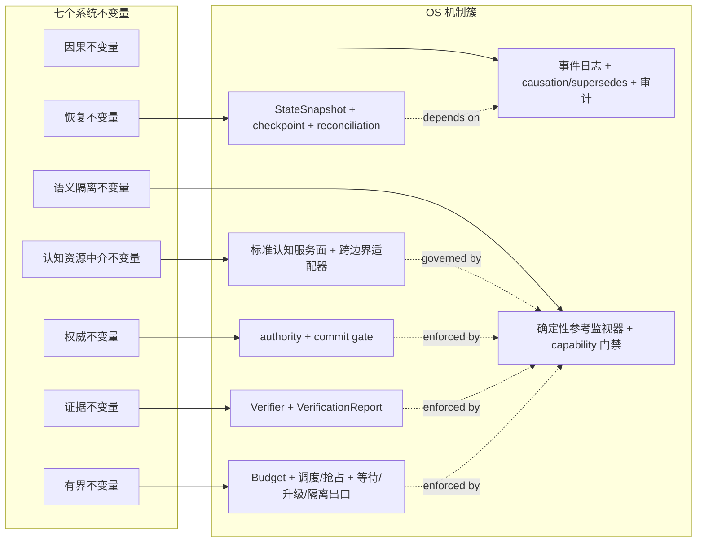

不变量、机制与其确定性强制执行点之间的对照关系如下表所示；策略层（模型、规划、检索、排序、placement 目标等）可在不变量约束内演进，但不允许下放这些机制本身。

| 不变量 | 承载机制 | 确定性强制执行点 | 内核外可演进策略 |
|---|---|---|---|
| 权威 | authority 注册、版本、fencing、commit gate | 目标状态域 commit gate、CAS 失败返回 `STATE_CONFLICT` | 选择 consensus 协议、仲裁组规模、人工审批阈值 |
| 因果 | 事件日志、`causation`/`supersedes`、审计链 | 追加式事件、不可变 Event、提交历史 digest | 日志后端、partition 选择、保留窗口 |
| 证据 | Verifier、VerificationReport、EpisodePackage | 后置条件 verifier 对固定后态绑定；`VERIFY_FAILED` 不能改写为 `COMMITTED` | grader/verifier 模型、人工审批路径、阈值 |
| 有界 | AttentionBudget、调度、抢占、等待/升级/隔离出口 | hard 预算在准入与消耗点由确定性机制执行 | 调度算法（EDF、Rate Monotonic 等）、优先级权重 |
| 恢复 | StateSnapshot、checkpoint、reconciliation | 旧 epoch fence、`RECONCILIATION_REQUIRED`/`QUARANTINED` 强制出口 | checkpoint 频率、快照压缩策略 |
| 语义隔离 | 确定性参考监视器、Context Resolution 与 capability 门禁 | schema/digest 校验、required/forbidden、读取授权、capability 适用性判定与 fail-closed | 模型选择、检索、排序、摘要与渲染策略 |
| 认知资源中介 | Governed Memory、Cognitive Discovery、Operation Catalog 与 adapters | 跨治理边界调用、scope 收窄、版本固定、缓存失效与审计 | 数据库、向量引擎、模型、检索算法与执行框架 |

---
## 3. 严格 OS 判据与系统边界
### 3.1 严格 OS 判据
一个系统只有同时满足以下判据，才有充分理由被称为 Agent OS，而不只是 Agent 框架：
1. **虚拟化**：把有限认知、上下文和异构资源抽象为稳定接口；
2. **保护**：隔离主体、状态域、敏感数据和副作用权限；
3. **并发**：调度多个持久执行、活动和实时回路；
4. **持久性**：在进程、模型会话和节点失效后恢复逻辑身份；
5. **资源治理**：计量并约束时间、Token、费用、数据、能量和风险；
6. **设备中介**：通过受描述、受授权的操作访问数字或物理设备；
7. **故障语义**：定义取消、超时、重复、未知结果、补偿和隔离；
8. **公共系统调用面**：为上层 Agent 提供稳定的机制接口；
9. **可观察一致性**：实现可以不同，但外部可测试语义稳定；
10. **安全参考监视器**：关键边界不可由普通语义活动绕过。
仅提供 Prompt 模板、工具路由、记忆检索或多 Agent 对话，不满足这些判据。 仅把已有框架重命名为 kernel，也不满足这些判据。
### 3.2 与宿主 OS 的边界
宿主 OS 管理：
CPU 线程与进程；页表和物理内存；文件、socket 与设备驱动；用户、内核权限和硬件保护；系统时钟、中断和本地调度。
CognitiveOS 复用这些能力，不复制它们。 它在宿主 OS 之上管理更高层的认知对象和治理语义。
`AgentExecution` 不必对应常驻进程。 一个持久执行可以先后映射到多个进程、容器、节点、模型和人工参与者。 宿主 PID 只是瞬时执行载体，不是认知进程身份。
### 3.3 与 Agent Runtime 的边界
Agent Runtime 通常负责：
调用模型；渲染消息；调用工具；保存会话；实现某种规划或反思循环。
CognitiveOS 则负责：
哪个状态可作为当前权威状态；上下文如何按目的、权限和预算解析；哪个主体可执行哪种跨边界操作；副作用怎样持久化、对账、验证和提交；长期执行怎样 checkpoint、迁移和恢复；多种 Runtime 怎样共享一致治理语义。
Runtime 是可替换的策略与执行提供者。 它可以嵌入 CognitiveOS，也可以通过 AKP 远程接入。 它不因持有 Prompt 或模型连接而获得状态 authority。
### 3.4 与工作流、数据库和消息系统的边界
工作流引擎适合确定性编排和等待。 数据库适合事务与查询。 事件日志适合追加历史和消费游标。 消息系统适合投递与背压。
CognitiveOS 不重新发明这些基础设施。 它规定这些设施共同承载的认知对象、授权边界和恢复语义。
### 3.5 与 MCP、A2A 的边界
MCP 和 A2A 是互操作协议，不是本地安全内核。
endpoint 宣称支持某个工具，不等于调用者被授权；Agent Card 宣称某项 skill，不等于结果真实；远端 Task 显示 completed，不等于本地验收通过；OAuth scope 或协议 feature，不自动成为本地 AuthorizationCapability；外部 artifact 必须作为不可信输入，经本地 schema、数据和验收门禁处理。
---
## 4. 总体架构：双内核、三平面、七层与横切上下文服务
### 4.1 架构总览
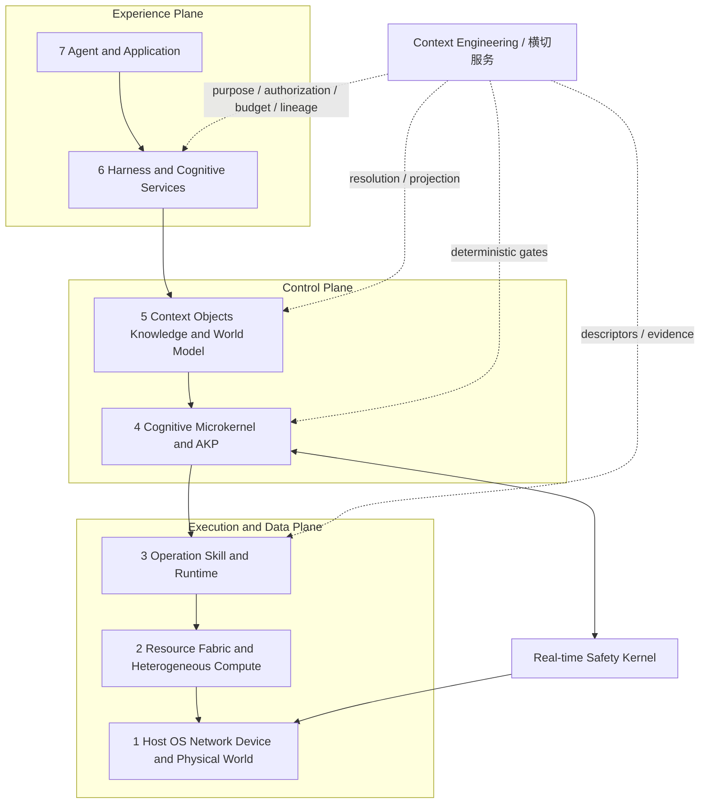

三平面是 governance view，七层是责任分解，双内核是时间与安全隔离结构，Context Engineering 是横切服务。后者不构成“第四 authority 平面”，以免与控制平面的身份、策略、状态提交和授权责任重叠。

### 4.2 双内核
- **认知微内核**处理持久执行、对象身份、状态、上下文门禁、授权、事件、Effect、预算和恢复。
- **实时安全内核**处理硬实时控制、安全包络、watchdog、急停和最终执行器仲裁。

认知微内核允许概率性策略参与候选生成，但 Context Resolution 中的读取授权、required/forbidden、硬预算、版本固定和输出校验属于可信机制。检索、排序、摘要与渲染算法留在内核外。实时安全内核不得依赖动态模型调用或远端 Context Resolution。

### 4.3 三平面
**体验平面**表达目标、TaskContract、进度、证据与人工介入。
**控制平面**维护 authority、身份、策略、状态、授权、调度、预算和 Context Resolution 的确定性门禁。
**执行与数据平面**实施模型推理、工具/技能、对象存取、数据移动和设备控制。

平面可以同进程，也可以跨边缘与云分布。Context Engineering 贯穿三者，但不能绕过每个平面的本地重新授权与信息流政策。

### 4.4 七层
1. **宿主、网络、设备与物理世界**：提供隔离、存储、传感器和执行器；观察携带时间、校准与来源。
2. **资源织构与异构计算**：用 ResourceGraph 表达容量、路径、驻留、信任、上下文传输与验证成本。
3. **操作、技能与运行时**：承载模型、工具、技能、Agent Runtime adapter、MCP/A2A adapter 与 sandbox；文件、网络、秘密、子进程和设备访问在此被拦截，OperationDescriptor 声明输入输出、状态读取范围、效果和资源包络。
4. **认知微内核与 AKP**：提供身份、状态、事件、上下文门禁、授权、Effect、预算、checkpoint 与审计。
5. **上下文、状态、知识、记忆与目录**：提供 Governed Memory Service、Knowledge Service、Cognitive Resource Namespace、Operation Catalog、索引、投影和冲突集；执行候选发现与派生视图，但不自行获得 authority。
6. **Harness 与认知服务**：承载 Agent Compatibility Runtime、可选 SMS、CRB、context delta manager、information-gap detector、operation matcher 与 verifier selection；构造候选并驱动有界 Loop，确定性准入仍由第 4 层执行。
7. **Agent 与应用**：表达领域目标和交互；可声明 context 需求，但不能直接指定越权数据或扩大预算。

### 4.5 跨层原则
上层表达意图，下层实施受约束机制；数据向上成为观察，控制向下成为受授权操作；每次跨 authority 都重新认证和授权；每个关键决定都能关联版本、预算和证据；任何层都不能把 feature 声明提升为权限；安全域可拒绝来自任何上层的操作。

### 4.6 受治理改变的参考主链路
下图不是唯一部署拓扑，而是一次跨边界、可恢复改变的最小因果关系。进入主链前，系统先固定 TenantContext、ActorChain、ConversationBinding、TaskContract 与 ResourceScope；每个读取和 Effect 沿链携带这些绑定及 Membership/Policy/Revocation 版本。它刻意把“模型给出建议”“执行器收到请求”“任务被接受”分成三个不同事实；任一事实都不能隐式替代另一个。

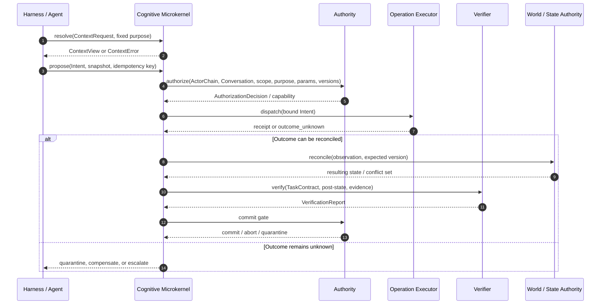

这条链路允许把 `K`、`A`、`X`、`V` 和 `W` 部署在同一进程或多个信任域，但不允许省略其责任。 对纯局部、短暂且无受治理影响的计算，`Intent`、授权或提交可被裁剪；一旦跨越持久化、authority、敏感数据或外部效果边界，完整链路重新适用。

### 4.7 唯一责任矩阵与最小可用闭环

| 组件 | 唯一必要责任 | 明确不拥有 | Core/可选 |
|---|---|---|---|
| 认知微内核 | 身份、authority、状态机、授权、硬预算、Effect、恢复与审计门禁 | 语义规划、排序、业务验收标准 | Core |
| 实时安全内核 | 硬实时包络、watchdog、safe state、最终执行器仲裁 | 开放式任务规划 | R3 Profile |
| Harness | 固定契约并驱动有界 Loop、checkpoint、handoff | 状态 authority、capability 签发 | Core |
| Agent Shell | 将人类表达编译为候选、预览并监督执行 | authority、全局 memory、commit | Core 参考客户端；自然语言可降级 |
| Context/Memory/Knowledge/Catalog | 受治理发现、派生、版本与生命周期 | 读取授权的隐式放宽、任务完成 | 按能力 Profile |
| SMS/CRB | 候选解释、匹配、排序、预算内资源建议 | hard gate、事实、授权、验收 | 可选 Profile |
| Runtime/Operation | 模型计算、工具与技能执行 | 用户意图解释权、最终提交 | Core adapter 或原生 |

最小可用 CognitiveOS 闭环是：意图固定、TaskContract、持久执行身份、状态/事件、Context 门禁、Operation/Capability、Intent/Effect、验证/验收、watch 与恢复。多 Agent、SMS/CRB、CIM、受控学习和具身安全不是所有部署的 Core 前提；只有声明相应 Profile 时才进入符合性边界。

**信任域部署变体**：在单进程嵌入式部署（§20.1）中，`K`、`A`、`X`、`V`、`W` 可压缩为同一进程内的本地组件调用，但五个责任必须保留为可区分接口，不能融合为单一函数。 在分布式部署（§20.2、§20.3）中，`A` 与 `W` 可以分别置于共识组与设备本地，`X` 可以位于远端执行器，`V` 可以位于独立 verifier 域，五者通过 AKP（§11）与 fencing 完成 hop-by-hop 重新认证与授权。 无论压缩或拆分，§20.4 的资源受限设备裁剪原则同样适用：可裁剪的是组件实例化深度，不是责任边界。
---
## 5. Agent Packaging、Installation 与 Compatibility
### 5.1 Package 与安装事务
`AgentPackageManifest` 固定 package ID、publisher/version、artifact digest/signature/provenance、CognitiveOS/AKP 版本、workload principal、Runtime、memory、tool/egress、secret、sandbox、checkpoint/recovery 与 retention 声明。Manifest 是待验证声明，不是 capability，也不证明 adapter 不可绕过。

安装遵循 `Verify → Static Analysis → Adapter Selection → Sandbox Construction → Compatibility/Negative Tests → Profile Admission → Capability Ceiling → Installation Commit`。提交产生版本化 `AgentInstallation`，记录 package/adapter/sandbox digest、兼容报告、降级项、测试证据、允许的 Profile、capability 上限和回滚点。安装 capability 与任务运行 capability 分离；升级创建新 installation 版本，卸载不得删除未决 Effect、审计或受 retention/legal-hold 约束的对象。

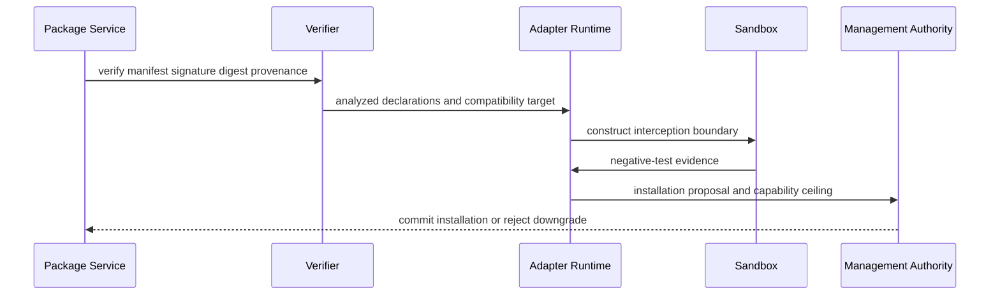

### 5.2 C0—C3 兼容性 Profile
兼容等级描述 OS 能观察和中介哪些边界，不是线性安全认证：

| Profile | 可观察与适配能力 | 典型限制 |
|---|---|---|
| C0 Contained Legacy | 未修改 Agent 在沙箱内运行；跨边界输出视为不可信候选 | 默认限 R0；无可靠 context 隔离或 checkpoint 声明 |
| C1 Governed I/O | identity、Conversation、memory/knowledge、tool、filesystem/network/secret 全部经 adapter | 可进入受限 R1；Loop 与恢复仍可能不透明 |
| C2 Lifecycle-aware | 加入 TaskContract、ActivityContext、delta/fault、cancel、checkpoint、pending Effect、`OUTCOME_UNKNOWN` 与 candidate completion | 长时运行基线；R2 仍需独立 verifier/approval |
| C3 Native | 原生使用 AKP、Context、Catalog、Capability、Intent/Effect、Checkpoint 与 ResourceReservation | 不自动获得任何更高风险权限 |

C0—C3 与 R0—R3 正交。Compatibility Report 应逐项声明 interception、checkpoint、hidden remote state、Conversation isolation、effect recovery 和 negative-test 证据；缺一项只能缩小声明，不能用较高标签补足。

### 5.3 Adapter 接口与不可绕过性
标准 `AgentAdapter` 接口族包括 Identity、Memory、Tool、Completion、Checkpoint 与 Sandbox adapter。`memory.add/update` 映射到 candidate/admission/invalidation；`tool.list/call` 映射到 catalog discover/describe/bind 与 Intent/Effect；Agent 的 done/success 只映射 `Task.CANDIDATE_COMPLETE`。Checkpoint 保存行动级事实、未决 Effect、剩余预算和恢复条件，而非只有 transcript 或不可迁移模型 session。

安装符合性必须验证：未声明网络、宿主 secret、其他 Conversation cache、未登记 MCP connection 和 tool proxy 绕过被拒；撤销 capability 与旧 epoch 写入失效；timeout 不换新幂等键；Conversation 切换隔离 KV/working memory；恢复先对账未决 Effect；输出中的伪 capability 与 completed 文本无效。

---
## 6. 持久认知进程模型
### 6.1 AgentExecution：逻辑进程身份
`AgentExecution` 是 CognitiveOS 中最接近传统 OS 进程的抽象。 它是跨重启、模型切换、调度片、节点迁移和人机交接仍保持稳定的逻辑执行身份。
它包含或引用：
不可变的 TenantContext；initiating/effective/workload 与可选 device principal；ActorChain 和 Delegation；可选 ConversationBinding 或显式 non-conversational ResourceScope、当前 Task/Episode；Membership/Policy/Revocation 版本；预算、优先级与 deadline；capability 与 fencing epoch；Continuation 与 Checkpoint；已消费事件高水位；未决 Effect；固定的策略、schema 和环境版本；终止、等待、迁移和隔离状态。
AgentExecution 不保存必须公开的模型思维链。可恢复性来自行动级事实、对象引用和控制状态。模型隐藏态可以作为不保证可移植的缓存，但不能成为唯一恢复依据。AgentExecution 的 tenant 在其生命周期内不可变；切换 tenant 必须创建新执行，或终止当前执行并从经授权的 Checkpoint 恢复到新的 AgentExecution，不能只替换 TenantContext/binding。后台执行可以没有 Conversation，但每个 Activity 必须绑定一个 Conversation，或显式绑定 `non_conversational` ResourceScope；禁止隐式继承“最近对话”。
### 6.2 统一治理上下文
CognitiveOS 把身份、隔离、对话和执行绑定为一条不可省略的治理链，而不把 `tenant_id` 或 session cookie 当成授权结论：

- **Tenant** 是数据、策略、密钥、配额与审计的隔离域，不是权限等级。共同 Tenant 不隐含相互读取权；tenant/platform 管理员不自动获得对象正文读取权。
- **GovernanceDomainContext = TenantContext | PlatformContext**。`scope_domain` 必须显式为 `tenant` 或 `platform`：TenantContext 固定 tenant、Membership、policy、revocation、地域与 trust-domain 版本；PlatformContext 由独立 platform governance authority 建立，不能读取 tenant 正文。版本变化要求重验。
- **Principal** 是授权主体，分 Human、Workload、Device。**Membership** 只描述 Principal 与 Tenant 的有期限关系；角色只是 RBAC 候选权限的来源。
- **EffectiveSubject** 是当前判定承受权限边界的主体。**ActorChain** 按顺序保存 initiating principal、effective subject、workload principal、可选 device principal 与 **Delegation** 链；每级委派只能衰减。
- **Conversation** 是由有角色、关系版本和有效期的 **Participant** 构成的交互资源作用域；**ConversationBinding** 固定 Conversation/version、参与关系版本、history scope 与 working scope；**ResourceScope** 规定对象可见、可派生、可保留与可晋升的边界；**ShareGrant** 是跨主体或跨 tenant 的显式共享对象。
- **AgentExecutionBinding** 把逻辑执行身份绑定到 GovernanceDomainContext、initiating/effective/workload 主体、ActorChain、可选 ConversationBinding 或显式 non-conversational scope、治理版本、capability 与 fencing epoch。**ExecutionContext** 是 execution 级固定治理包；**ActivityContext** 是每次 Activity 的更窄绑定，二者都不得扩大上层绑定。

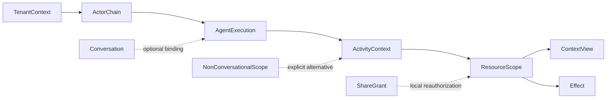

完整规范语义见 [RFC-0001](./RFC-0001-cognitiveos-governance-context-access.md)。它是 v0.2 Draft normative companion；上述治理对象族的机器 schema 已由 [governed-object-contract](./docs/standards/governed-object-contract.md) 登记为 v0.1 Draft，知识对象仍为伪 schema；已登记的规范与声明式测试资产不表示实现。

### 6.3 五个执行生命周期状态机
旧式 Agent 实现常把“任务正在运行”塞进一个枚举。 这会混淆身份、业务进度、控制循环、外部效果和验收事实。 CognitiveOS 明确分离五个正交的**执行生命周期状态机**。它们不是 authority-managed state domain 的闭合集合；World、Conversation、Membership、Policy、Knowledge、Memory 与安全状态等治理域仍可扩展。下列文本图是 [specs/transitions/](./specs/transitions/) 中已登记迁移表的投影；完整的 guard、reason code 与证据要求以对应 `*.transitions.json` 及 [state-domains.yaml](./specs/registry/state-domains.yaml) 为准。
#### AgentExecution State
回答逻辑执行主体是否可被调度：
```text
CREATED -> ADMITTED -> RUNNABLE <-> WAITING
RUNNABLE -> CHECKPOINTED -> RECOVERING -> RUNNABLE
RUNNABLE -> SUSPENDED | TERMINATED | QUARANTINED
SUSPENDED -> ADMITTED
QUARANTINED -> RECOVERING
CREATED | ADMITTED | WAITING | CHECKPOINTED
  | RECOVERING | SUSPENDED | QUARANTINED -> TERMINATED
```
它不表示任务已经完成，也不表示某个副作用成功。`SUSPENDED` 只能经重新准入回到可调度路径；`QUARANTINED` 只能在未决 Effect 对账并重新授权后进入 `RECOVERING`，不能直接变回 `RUNNABLE`。
#### Task State
回答业务目标的生命周期：
```text
DRAFT -> READY -> ACTIVE <-> BLOCKED
ACTIVE -> CANDIDATE_COMPLETE -> COMPLETED
CANDIDATE_COMPLETE -> ACTIVE | BLOCKED
READY -> CANCELLED
ACTIVE | BLOCKED | CANDIDATE_COMPLETE -> FAILED | CANCELLED | ESCALATED
```
只有 acceptance authority 在 verifier 对固定后态给出通过证据后，才可以把 `CANDIDATE_COMPLETE` 推进为 `COMPLETED`。
#### Loop State
回答当前控制循环处于哪个阶段：
```text
START -> OBSERVE
OBSERVE -> RESOLVE
RESOLVE -> ORIENT | WAIT | ESCALATE
ORIENT -> DECIDE -> ACT
ACT -> OBSERVE | VERIFY
VERIFY -> CONTINUE | STOP | DIAGNOSE
CONTINUE -> OBSERVE
DIAGNOSE -> RESOLVE | WAIT | ESCALATE | QUARANTINE
WAIT -> RESOLVE
QUARANTINE -> RECONCILE
RECONCILE -> RESOLVE | ESCALATE
ESCALATE -> END
STOP -> END
```
Loop 可以停止而 Task 仍处于 BLOCKED。 Task 也可以被外部 authority 接受，而某个旧 Loop 已经终止。

下图补齐文本中易被漏画的等待、升级与隔离出口，并显式区分每条出口的去向：`WAIT` 在等待依赖时由外部事件解除；`ESCALATE` 进入人工或上层 authority；`QUARANTINE` 不允许通过 `Continue` 状态静默回跳到 `Resolve`，必须经过显式恢复或人工对账才能重新进入 `Observe`。

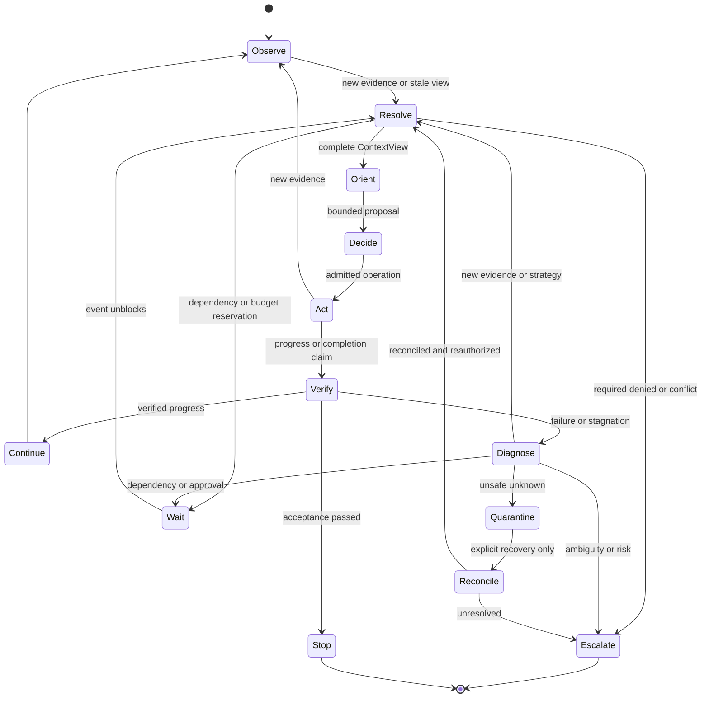

本状态机与 §10.4 使用同一命名：`Resolve`、`Diagnose`、`Wait`、`Escalate`、`Quarantine` 均是显式控制点。Loop 门禁不支持 `Quarantine → Observe/Resolve` 直接回跳；必须先经 `Reconcile` 对账并重新授权，否则会把未知结果带入下一轮。
#### Effect State
回答单次受治理副作用的真实执行与对账状态：
```text
PROPOSED -> AUTHORIZED | DENIED
AUTHORIZED -> EXECUTING
EXECUTING -> EXECUTED | NOT_EXECUTED | OUTCOME_UNKNOWN
EXECUTED -> RECONCILED
OUTCOME_UNKNOWN -> RECONCILED
RECONCILED -> VERIFIED | VERIFY_FAILED | NOT_EXECUTED
                | COMPENSATING | QUARANTINED
VERIFIED -> COMMITTED | ABORTED
VERIFY_FAILED -> ABORTED | COMPENSATING | QUARANTINED
COMPENSATING -> ABORTED | QUARANTINED
```
`dispatch` 是触发 `AUTHORIZED -> EXECUTING` 的事件/动作，不是持久状态。`OUTCOME_UNKNOWN` 不是失败，也不是成功；它只能通过查询/对账进入 `RECONCILED`，并由对账结果确认 `executed`、`not_executed` 或 `still_unknown` 三种事实之一：确认已执行进入验证；确认未执行以 `NOT_EXECUTED` 关闭；仍然未知时只能使用同一幂等键安全重试、进入独立授权的补偿（`COMPENSATING`）或隔离（`QUARANTINED`）。它不得直接进入 `COMMITTED`、静默成功或以新幂等键盲重试。
#### Verification State
回答针对固定目标和固定后态的证据判定：
```text
NOT_REQUESTED -> PENDING -> EVIDENCE_READY
PENDING -> EXPIRED
EVIDENCE_READY -> PASSED | FAILED | INCONCLUSIVE | EXPIRED
PASSED -> EXPIRED
```
Verification 可独立过期。 例如世界状态变化后，曾经 PASSED 的报告可能不再适用于新版本。`PASSED` 因而不是终态：固定后态变化、证据失效或 verifier 版本吊销都会使其迁移到 `EXPIRED`，过期报告不能再支持 Task 完成或 Effect 提交。

五个执行生命周期状态机不是同级枚举，而是各自负责一类问题，并通过带原因的事件和确定性门禁协作。 下图示意五域之间的协作边，并显式标出三类容易被旧式单一状态机抹平的关系：Loop 停止不等于 Task 完成；Effect 已执行不等于已提交；Verifier `PASSED` 仍可能被新世界状态版本过期。

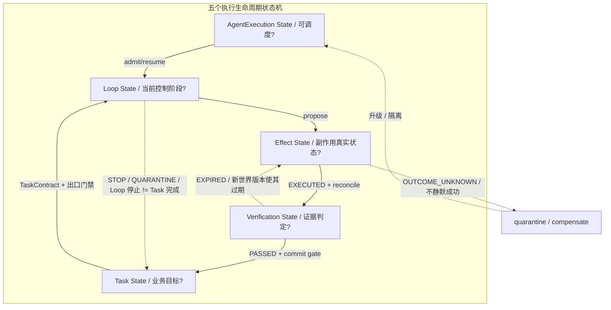

门禁边以原因事件表达，而不是共享模糊枚举。 任一域的状态推进都不能被另一个域的局部事实隐式完成。
### 6.4 Conversation 模型
`Conversation` 是由 `Participant` 围绕连续交互形成的持久资源作用域；`Turn` 是其中有序的输入、输出或系统事件。它必须与两种短期状态分离：`AuthenticationSession` 只证明登录认证，`RuntimeSession` 只承载模型、连接、工具或进程状态；二者都不能替代 Conversation 的参与关系和历史授权。

关系为 `Conversation → Task → Episode → Activity`：一个 Conversation 可产生多个 Task；Task 可跨 Episode；Episode 包含有界 Activity。跨 Conversation 的 Task 必须在每次 Activity 选择主 `ConversationBinding`，其他对话内容只以经授权对象引用进入。后台 AgentExecution 可以不绑定 Conversation，但它的每个 Activity 必须显式选择 ConversationBinding，或选择 `kind=non_conversational` 的 ResourceScope；不得从用户、RuntimeSession 或先前 Activity 隐式继承“最近对话”。

同一 tenant 可并发多个 Conversation，也可切换、暂停和恢复。默认每个并发 Conversation 使用独立 AgentExecution。Conversation 切换不改变 AgentExecution 的 tenant；跨 tenant 必须新建执行，或终止并恢复为新 AgentExecution。ContextView、KV cache、working memory、工具 session、临时索引与未决 Effect 禁止串用。若复用 AgentExecution，只能在 Activity 边界执行：通用 Checkpoint → 未决 Effect 对账 → 清空或隔离 working set/KV → 重验 ActorChain、Membership、Policy、Revocation → 为目标 Conversation 重新解析 Context → 安装新 binding 与 epoch。历史可见性按当前逐对象策略重验；“曾经看过”不构成永久权限。

### 6.5 为什么必须分离
五域分离消除以下错误：
模型 Loop 退出被误认为 Task 完成；HTTP 200 被误认为 Effect 已提交；工具回执被误认为验收通过；Task 取消后仍有旧执行者写入；验证器不可判定却把执行标为成功；恢复程序看见单个 `RUNNING` 无法判断该做什么。
状态域之间通过带原因的事件和门禁协作，而不是共享模糊枚举。
### 6.6 Episode、Activity 与 Continuation
`Episode` 是有界的因果、预算和审计范围。 一个 Task 可以跨多个 Episode。 一个 AgentExecution 也可以依次服务多个 Task，但应保留清晰关联。
`Activity` 是一次确定性或非确定性工作单元：
确定性 workflow 决策；LLM 或其他模型推理；工具调用；人工审批；verifier；传感器查询；编译与放置。
`Checkpoint` 是通用恢复封装，可携带版本、完整性、事件高水位、未决 Effect 与一种或多种 payload。`LoopCheckpoint` 是其中保存 Loop 行动级事实的 payload。`Continuation` 是恢复成功后可执行的后续体及其前置条件引用，而不是 Checkpoint 的同义词；三者均不得把模型隐藏态作为唯一恢复依据。
### 6.7 调度与抢占
认知调度同时面对异质资源和不同时间尺度。 可考虑：
优先级和租户公平；deadline 与松弛度；风险级别；上下文装入成本；模型冷启动和数据驻留；verifier 与人工审批容量；取消后的远端残余成本；checkpoint 与迁移成本。
具体频率、时间片、EDF、Rate Monotonic 或其他算法只是部署策略参考。 除非特定 Profile 明确规定，本文不把任何频率、周期或 EDF 选择设为通用 MUST。

### 6.8 所有权与故障域
持久身份不等于所有组件共享一个故障域。 一个可恢复的 `AgentExecution` 至少跨越执行、权威、操作、资源和人机协作五类故障域；恢复时必须逐域重新建立事实，而不是把某个进程内 `RUNNING` 标志当作全局真相。

| 故障域 | 典型失效 | 可信恢复依据 | 不可安全推断的结论 |
|---|---|---|---|
| Execution | 进程崩溃、节点迁移、模型会话丢失 | checkpoint、事件高水位、新 epoch | 远端 Activity 或 Effect 已停止 |
| Authority | 选主、租约或策略变更 | authority epoch、fencing、审计决策 | 旧 capability 仍可提交 |
| Operation | 超时、断连、重复投递、部分执行 | 幂等键、执行器查询、receipt、对账 | receipt、HTTP 2xx 或超时等于成功/失败 |
| Resource | 配额耗尽、硬件离线、校准漂移 | reservation、健康证据、ResourceGraph 版本 | 可无成本重试，或可在任意节点恢复 |
| Human / external world | 审批撤回、人工操作、世界变化 | 新观察、签署决策、world authority 仲裁 | 旧快照仍适用于当前世界 |

这个划分还解释了为什么恢复顺序必须先 fence、再重放提交历史、再对账未决 Effect，最后才恢复认知 Loop：只有这样，策略层不会在旧执行者或未知世界状态上继续产生新的写入。

### 6.9 用户意图链与贯彻不变量
`UserIntentRecord` 保存用户原始表达、输入引用、主体、Conversation、时间与 digest；`IntentInterpretation` 是可替换语义组件产生的结构化候选，列出目标、约束、禁止事项、假设、歧义、缺口和置信依据。原始记录不可被摘要或后续解释覆盖。

规范因果链为：
```text
UserIntentRecord -> IntentInterpretation -> TaskContract
                 -> Plan/ActionProposal -> Intent/Effect
                 -> VerificationReport -> AcceptanceDecision
```

意图 authority 属于有权表达/修正目标的用户或其明确委托，解释器没有该 authority。存在影响目标、范围、风险、费用、数据出域或不可逆效果的歧义时必须澄清；低风险默认值也必须进入预览。用户修正产生新版本并 `supersedes` 旧解释/契约；已经分派的旧版本先取消、fence 或收敛到明确安全点，不得靠改写 Prompt 伪装成同一次执行。子任务、委派和 ContextRequest 只能收窄父意图；Task 完成必须由 acceptance authority 对固定意图、TaskContract 与后态证据共同判定。
---
## 7. 认知微内核
机制与策略的分离是 CognitiveOS 治理基线之一（详见 §23 决策九）。 微内核只承载无法安全下放的机制，模型、规划器与检索等策略可在内核外快速演进，但只能通过受治理接口影响状态和世界。 下图集中表示这一划分。

```mermaid
flowchart LR
  subgraph K[微内核机制 - 确定性 / 不可下放]
    K1[身份与生命周期]
    K2[authority 与 fencing]
    K3[CAS 与状态迁移]
    K4[事件提交与因果]
    K5[Context Resolution 门禁]
    K6[capability 校验/衰减/撤销]
    K7[Intent/Effect 状态机]
    K8[hard 预算执行]
    K9[checkpoint 与恢复]
    K10[审计与证明引用]
  end
  subgraph P[内核外策略 - 可演进 / 概率性]
    P1[模型选择与采样]
    P2[规划/反思/分解]
    P3[语义检索与排序]
    P4[摘要与记忆提取]
    P5[多 Agent 拓扑]
    P6[技能内部算法]
    P7[placement 优化目标]
    P8[学习与策略更新]
  end
  P -- propose / candidate --> K
  K -- gated syscall 暴露 --> P
  K -. 策略不可放宽机制边界 .-> P
```

### 7.1 最小可信计算基
认知微内核不是大而全的“智能内核”。 它应尽量小，只包含无法安全下放给不可信策略组件的机制。
核心机制包括：
TenantContext 与 tenant 不可变校验；Human/Workload/Device Principal、EffectiveSubject、ActorChain/Delegation 和 AgentExecution 身份；Membership/Policy/Revocation 版本检查；Conversation 或 non-conversational ResourceScope 绑定；authority 注册、版本与 fencing；状态快照、CAS 和冲突检测；事件提交与因果关联；Context Resolution 门禁；capability 校验、衰减和撤销；Intent/Effect 状态机；预算计量、准入、取消和隔离；checkpoint、恢复、审计和证明引用。
### 7.2 内核外策略
下列能力通常位于内核外：
模型选择与采样；规划、反思和分解；语义检索和排序；摘要与记忆提取；多 Agent 拓扑；技能内部算法；placement 优化目标；学习和策略更新。
它们可以快速演进，但只能通过受治理接口影响状态和世界。 当策略变体或部署跨越 trust domain 时，每个 hop 都必须本地重新认证和重新授权；上游 feature、远端 completed 或上游认证结果都不替代本地许可（与 §12.4 及各 companion 的 fencing/重新授权要求一致）。
### 7.3 认知系统调用
说明性的系统调用族包括：
```text
execution.create / admit / checkpoint / suspend / resume / terminate
state.snapshot / compare_exchange / propose / reconcile
context.resolve / pin / fault / release
operation.describe / bind / invoke
capability.request / attenuate / revoke / inspect
effect.prepare / execute / reconcile / verify / commit / abort
event.append / subscribe / acknowledge
task.create / update / candidate_complete / complete
resource.reserve / account / release
knowledge.ingest / query / lint / invalidate / recompile / publish
```
系统调用不要求 syscall 指令或单机 ABI。 在嵌入式部署中它们可以是函数调用。 在分布式部署中它们可以通过 AKP 传输。
### 7.4 确定性边界
以下决定应由确定性机制完成：
schema 和 digest 校验；capability 是否适用；lease、epoch 和 fencing；CAS 与状态迁移合法性；硬预算扣减；幂等键和重复检测；safety envelope；最终 commit gate。
模型可以辅助解释或生成候选。 模型说“已授权”“已完成”或“这是安全的”，不会改变门禁结果。
### 7.5 对象最小语义
所有跨边界或持久化的受治理对象应具有：
稳定 ID 与类型；schema version；object version；tenant 与 ResourceScope；owner 与 authority；policy 与 purpose；sensitivity 与 compartment；retention；provenance 与 lineage；valid time；content digest；生命周期。KnowledgeObject、MemoryObject、ContextItem/View、缓存、embedding、索引和其他派生数据都适用。
局部变量、纯函数中间值和不可观察栈值无需对象化。 “受治理的一切皆对象”不等于“计算中的一切皆对象”。
---
<a id="state-protocol"></a>
## 8. 世界状态、事件与 authority
### 8.1 世界不是日志的同义词
CognitiveOS 区分三种事实：
1. **外部世界事实**：设备、数据库、组织或现实环境当前是什么；
2. **CognitiveOS 提交事实**：系统内部已经认可并提交过什么；
3. **观察证据**：传感器、工具、用户或远端 Agent 报告了什么。
事件日志权威地记录第二类事实。 World State authority 仲裁第一类事实在系统中的当前投影。 第三类事实是带来源和有效期的证据输入。
### 8.2 权威语义
每个状态域声明一个写入 authority，或声明一个明确的仲裁/共识协议。
World State 由 world authority 仲裁；Task State 由 task authority 仲裁；AgentExecution State 由 execution authority 仲裁；Conversation State 由 conversation authority 仲裁；AuthenticationSession 与 RuntimeSession 各由其本地 authority 仲裁；安全状态由 safety authority 仲裁。开放的 authority-managed state domains 与 §6.3 的五个执行生命周期状态机不是同一分类。
Authority 可以是本地服务、共识组、设备控制器或依法授权的人类流程。 它不是字符串标签，而是可认证、可审计的决策边界。
### 8.3 事件日志的权威范围
CognitiveOS 内部所有已提交的受治理改变进入追加式提交历史。 日志中的事件不可原地修改。 纠正通过新事件以及 `causation`、`supersedes` 或补偿关系表达。
事件日志是以下问题的权威答案：
哪个主体在何时提交了什么；基于哪个前态、Intent 和授权；对应哪个 Effect 与 Verification；产生哪个状态版本；后续哪次提交纠正或补偿了它。
事件日志不是以下问题的唯一答案：
外部物理对象此刻真实位置；远端系统是否在日志之外发生变化；传感器是否漂移；某项知识是否仍有效。
这些问题必须由声明的 authority、freshness 和证据策略仲裁。
### 8.4 状态投影与快照
`StateSnapshot` 是某状态域在固定版本上的不可变读视图。 投影器可从已验证快照与有序提交事件恢复内部状态。
投影应记录：
base version；event high watermark；projection version；object references；digest；valid time 与 freshness；未解决冲突。
事件日志保证提交历史的因果完整性。 状态快照提供高效的当前读取和并发控制。
### 8.5 冲突与时间
CognitiveOS 至少区分：
event time：外部事件声称发生的时间；ingest time：系统接收时间；commit time：CognitiveOS 提交时间；valid time：内容适用于世界的时间区间；deadline：动作或证据仍有价值的期限。
语义冲突不应被静默 last-write-wins 抹平。 系统可以保留 conflict set，由 authority、确定性 merge、共识或人工审批解决。
### 8.6 一致性模型
并非所有读取都需要强一致。 选择取决于操作风险：
只读推荐可接受带 staleness 的缓存；Task 更新通常需要 optimistic concurrency；资金、权限和设备写入需要线性化 authority 或等价 fencing；事件消费者可以 at-least-once，但必须幂等；多副本知识检索可最终一致，但必须暴露版本和来源。
一般跨系统副作用不存在无条件 exactly-once。 事务 outbox、幂等执行器和去重只能在声明的故障假设下提供效果等价一次。
---
<a id="context-resolution-protocol"></a><a id="context-engineering"></a><a id="context-virtualization-profile"></a>
## 9. Context Engineering：Context Virtual Memory 与 Resolution
### 9.1 定位与保证边界
模型窗口不是长期记忆、可信状态库或权限边界，而是昂贵、易受位置与干扰影响的工作集。Context Engineering 管理从受治理对象到 Activity 工作视图的全过程：发现、选择、授权、固定版本、变换、渲染、失效与审计。

它能保证的是选择与转换过程可追踪、硬边界可执行、缺失与损失可见；它不能保证来源事实为真、模型必然正确理解、压缩无损，或 ContextView 自动获得 World State authority。

CVM 是这一机制的**虚拟化实现模型**。它不声称模型具备随机访问内存，也不要求实现模拟地址或真实页表。实现只需提供等价的工作集、固定版本、缺页/失效、预算和审计语义。

### 9.2 分区与控制/数据隔离
说明性的 ContextPack 分区为：

| 分区 | 内容 | 关键规则 |
|---|---|---|
| control | TaskContract、策略引用、预算、验收门禁 | 固定版本、不可被数据覆盖 |
| authoritative state | StateSnapshot、未决 Effect、authority 元数据 | 只读投影；写入仍走状态协议 |
| evidence | 带来源、valid time 与冲突关系的观察 | 不因被装入就成为事实 |
| working | 假设、已验证决定、LoopCheckpoint | 私有或 copy-on-write |
| untrusted input | 用户、网页、工具、远端 Agent 内容 | 默认数据语义，禁止提升为控制 |
| catalog/artifact | OperationDescriptor、memory、代码、文档等 | 描述与引用都不是授权 |

“物理隔离”不是所有部署都能承诺的实现性质；可测试要求是结构化分区、明确 label、渲染边界与下游 Effect 门禁。

### 9.3 ContextRequest 与九阶段解析
最小操作是：
```text
resolve(ContextRequest) -> ContextView | ContextError
```

`ContextRequest` 至少声明 purpose、perspective、TenantContext、ActorChain、ConversationBinding、ResourceScope、Principal/Task/Episode/Activity、Membership/Policy/Revocation 版本、required、forbidden、freshness、版本条件、sensitivity/egress、Token/字节/时间/费用预算、target profile 和 partial policy。`required` 缺失时默认失败；priority 不得覆盖 forbidden、授权或硬预算。

```text
discover -> filter -> authorize -> rank -> budget
         -> transform -> verify -> render -> audit
```

1. `discover` 只发现候选；ANN、全文、图查询或外部 ranker 之前必须先做 tenant/scope/compartment/purpose 过滤。若索引本身含敏感元数据、词项、标题、向量或存在性，发现阶段也要受策略保护。
2. `filter` 执行类型、版本、valid time、freshness、forbidden 与去重。
3. `authorize` 在正文解密、读取或暴露给 ranker、transformer 或外部 target 前，按当前 ActorChain、Conversation、purpose、对象策略和撤销版本逐对象重验读取与出域。
4. `rank` 先保留 required 与确定性优先级，再运行可选语义排序；排序不证明真实性或权限。
5. `budget` 分配 Token、字节、时间、费用与 attention slots；硬预算不足时不得静默裁掉 required。
6. `transform` 执行切片、规范化、脱敏或压缩，并记录算法与输入版本。
7. `verify` 校验 required、schema、digest、敏感度继承、冲突与 loss envelope。
8. `render` 按 target profile 形成结构化输入；渲染策略不能扩大数据 audience。
9. `audit` 记录选择、拒绝 reason code、成本、版本和谱系；拒绝记录不得泄露未授权正文。

### 9.4 ContextView 契约
`ContextView` 是绑定一次 Activity 的短期、非权威工作视图，至少包含：loaded/rejected 项、pinned versions、complete 标志、cost、freshness/expiry、lineage、冲突与 loss declaration。每个 loaded item 固定对象版本、digest、representation 和成本。

ContextView 的可复用条件是以下绑定均未变化：tenant、ActorChain、Conversation、ResourceScope、principal、purpose、audience、target profile、Membership/Policy/Revocation 版本、策略/renderer 版本、对象版本与 freshness。任何一项变化都触发重新校验或重新解析；缓存命中不能跳过授权。敏感缓存键至少绑定 tenant、ActorChain、Conversation、ResourceScope、purpose、Policy/Membership/Revocation 版本、对象与 transform 版本；KV cache、prompt cache、embedding/index 结果、摘要和工具缓存均适用。

### 9.5 Working set、fault 与生命周期
实现可提供 `pin`、snapshot、copy-on-write、evict、prefetch、compress 和 stale fault。访问未装入或已失效对象时，fault handler 依次检查引用、版本、授权、freshness、剩余预算和 partial policy，返回结构化结果：

```text
LOADED | CONTEXT_DENIED | REQUIRED_MISSING | STALE
BUDGET_EXHAUSTED | CONFLICT_UNRESOLVED | TARGET_INCOMPATIBLE
```

这些是 Context Resolution 的操作结果与 Activity 状态，不新增第六个执行生命周期状态机。这些名称也只是语义类别：已登记机器错误码以 [specs/registry/errors.yaml](./specs/registry/errors.yaml) 为准（如 `CONTEXT_AUTH_DENIED`、`CONTEXT_INCOMPLETE`、`CONTEXT_BUDGET_EXCEEDED`），其余为待登记类别。需要恢复时，通用 Checkpoint 的 LoopCheckpoint payload 保存 ContextView 引用、解析参数与失效条件，而不是假定整个渲染文本可永久复用。

### 9.6 信息损失与质量门禁
摘要、裁剪、脱敏和格式转换可能有损。loss declaration 至少记录：源引用、transform 版本、被省略类别、适用范围、保留的冲突与未知项、敏感度继承和是否可回取原文。

质量不能压缩为一个可跨任务比较的“真值分数”。实现应分别报告：
- **完整性**：required 项与关键约束是否齐全；
- **时效与一致性**：过期、冲突和版本漂移是否显式；
- **纯净性与稳定性**：无关内容、排序和位置变化是否影响不应变化的决定；
- **安全与隐私**：控制/数据隔离、读取授权和 egress 是否通过；
- **经济性**：不同预算下的成功、延迟、费用、fault 与拒绝率；
- **可审计性**：选择、拒绝和变换能否追溯。

只有可确定验证的维度可作为硬门禁。模型估计的 relevance 或 quality 只能参与排序、告警或降级策略，不能独立授权高风险动作。

### 9.7 注意力预算与调度
AttentionBudget 应区分：
- **hard limits**：Token、字节、时间、费用、外部调用和 egress，由确定性机制扣减；
- **reservations**：为验证、错误处理和安全退出预留的不可挪用额度；
- **soft signals**：缓存命中、上下文切换、fault 成本、压缩损失与估计价值密度，用于策略优化。

所谓 quality debt 只应作为带证据的风险记录，例如“required 原文因获准 partial 而未装入”，不应作为来源不明的浮点余额。预算耗尽必须导向拒绝、降级、等待、升级或停止之一。

### 9.8 与 Loop、恢复和验证的耦合
- `OBSERVE` 获取带 freshness 的证据；`ORIENT/DECIDE` 固定控制项、StateSnapshot 与冲突集。
- `ACT` 使用本地绑定的 OperationDescriptor 和独立 capability 门禁，不能从上下文文本推导权限。
- `VERIFY` 使用固定 TaskContract 与后态证据；高风险任务应与 proposer 隔离 verifier 的 principal、数据来源或权限，而不只是复制一份相同 ContextView。
- 恢复时重新验证 authority/epoch、未决 Effect、授权、对象版本与 ContextView 失效条件，然后才恢复 Loop。

### 9.9 Cognitive Resource Namespace 与多轮解析
`CognitiveResourceManifest` 是按 ActivityContext 过滤的逻辑入口清单，可暴露 context/memory/knowledge/state/operation/verifier 类别、可展开引用、查询能力、预算摘要和 discovery policy version。它不是文件系统目录：discover 与 read 分离，获得引用不等于读取正文，知道 Operation 名称不等于可调用；拒绝响应不得泄露隐藏对象存在性。

模型或 Agent 只可产生 `ContextRequestCandidate`。确定性 `ContextRequestAdmission` 依次 normalize、绑定 ActivityContext、收窄 ResourceScope、应用 TaskContract required/forbidden、预算/egress/freshness 上限并记录 candidate、admitted request、修改理由和 policy version，不得静默改写后冒充原意。

初始解析后可使用：
```text
resolve_delta(prior_view_ref, InformationGap, added_required,
              removed_items, expansion_refs, freshness, remaining_budget)
  -> ContextViewDelta | ContextError
```
`InformationGap` 绑定待决 claim/decision、缺失类型、所需 authority/evidence/freshness、deadline、缺失风险和 prior attempts。展开仅分为 `content_expand`、`relation_expand`、`authority_refresh`。Delta 固定 base view，列出新增/删除/替换、冲突与 loss 变化、累计成本、complete 变化和下一轮 expandable refs；不得扩大原 ActivityContext、purpose、scope、egress 或 hard budget。

`ResolutionAttempt` 记录 query fingerprint、candidate digest、信息增益、冲突/缺口变化、成本、延迟和拒绝原因。连续无新对象、重复摘要、缺口不缩小、预算/deadline 不足或 required source 不可访问时，停止盲目查询并进入 `WAIT | ESCALATE | ACCEPT_AUTHORIZED_PARTIAL | STOP`；partial 仅在 TaskContract 预先允许时成立。

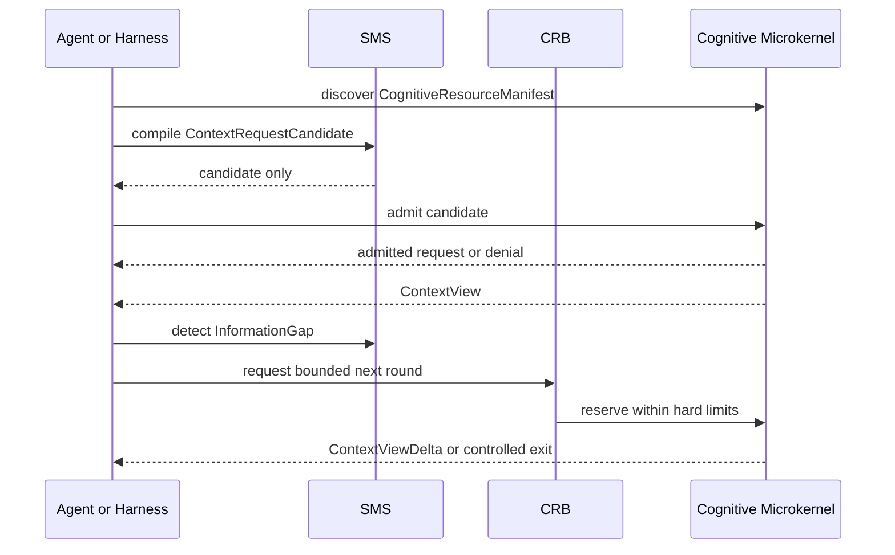

### 9.10 最小符合性负例
一个声明 Context Engineering 能力的实现至少应证明：required 超预算时 fail closed；未授权正文不会泄漏到 ranker/renderer；缓存不绕过撤销；压缩保留 loss declaration；过期或冲突不被静默覆盖；注入文本不能修改 control 或扩大 capability。具体测试资产以仓库中实际存在并由实现声明固定的 conformance 文件为准；本文不据此虚构新的多租户或对话测试向量。

[REQ-PROFILE-CVM-001] 声明 `context_virtualization` Profile 的实现 **MUST** 覆盖 `REQ-CTX-001`–`REQ-CTX-011` 的全部适用要求，并提供本节所列负例（required fail-closed、授权先于正文、缓存不绕过撤销、注入隔离）的测试证据。

---
## 10. Harness 与 Loop Engineering
### 10.1 Harness 的系统角色
Harness 是模型、运行时、环境与 CognitiveOS 机制之间的运行基质，不是新的 authority。它固定 TaskContract 与环境 manifest，构造 ContextRequest，驱动有界 Loop，管理工作集、checkpoint、handoff、failure attribution、verifier 和 Episode evidence。

Context lifecycle 的策略责任位于 Harness：何时预取、何时重新解析、如何在允许 partial 时降级、如何为验证保留预算。读取授权、硬预算、required/forbidden、版本固定和输出校验仍由微内核门禁执行。

Agent 的可交付能力是以下组合的函数：
```text
model × harness × environment × task distribution × governance
```
单独比较模型分数无法可靠归因系统改进。

### 10.2 Semantic Mediation Service 与 Cognitive Resource Broker
SMS 是微内核外、可替换且非 authority 的认知系统服务。它可编译 `ContextRequestCandidate`、规划查询、在已过滤授权候选中 rerank、匹配 Operation、产生 transform/loss candidate 和 `InformationGap`。输出统一为 proposal/candidate/ranking，不能签发 capability、扩大 scope、解除 forbidden、修改 TaskContract、声明事实、提交 Effect 或完成 Task。

SMS 后端可组合规则、类型系统、本体、BM25、图查询、embedding/ANN、cross-encoder、小模型与通用 LLM。能力等级为 `unsupported | basic | vector | model_assisted | llm_mediated`，不自动提高风险权限。每次调用固定 provider/model/version、template/planner digest、sampling、输入 digest、ActivityContext、egress、预算、schema、timeout/fallback；输出经 schema、引用存在性与授权重验、敏感度继承和预算核算。

CRB 在既有硬边界内决定是否允许下一轮解析、选择 resolver/provider、预留 token/time/cost/verifier、允许的 egress 与 fallback，输出 `CognitiveAllocationDecision` 的 `admitted | denied | wait | degrade | escalate`。capability、residency、deadline、risk ceiling、hard limit、fencing、取消与回收由确定性机制执行；CRB 不是新 authority，也不能把 SMS 软信号变成权限。

降级链可为 `Primary LLM → local model → embedding/reranker → BM25/type → static catalog → WAIT/ESCALATE`。降级不得扩大数据、权限、预算或风险，不得裁掉 required；模型不可用不同于无相关资源，匹配不确定也不得默认选择首项。

### 10.3 TaskContract
TaskContract 是 Loop 的外部版本化契约，而不是冗长 Prompt。它声明目标、范围与禁止事项、可变更状态域、验收条件、风险/人审门禁、预算与 deadline、停滞策略、等待条件，以及完成、失败、升级和隔离出口。检索内容、模型输出或远端 artifact 不能自行修改它。

### 10.4 受控 Loop 与上下文转换
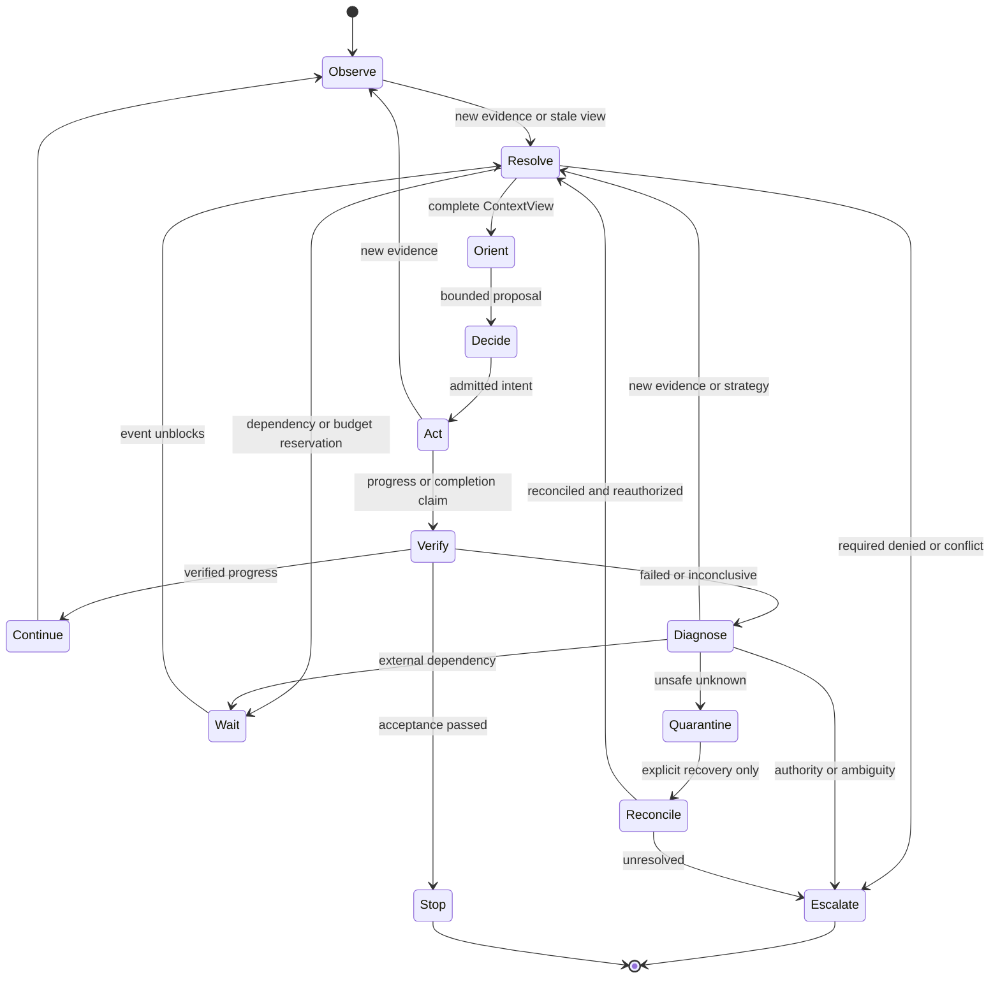

每条转换都应固定输入与输出契约：`Resolve→Orient` 要求 required 完整或明确获准 partial；`Decide→Act` 要求前态、Intent、OperationDescriptor 与 capability 绑定；`Act→Verify` 先对账 unknown outcome；`Verify→Stop` 只由验收 authority 基于固定后态推进。`ContextError` 是预期控制结果，不应被吞成空上下文。

ReAct、planner-executor、多 Agent 或确定性 workflow 都可实现该闭环；CognitiveOS 不固化 Prompt 模式。
### 10.5 可验证进展
进展应定义为相对 TaskContract 的可观察差异：
后置条件更接近满足；明确前置条件已经建立；不确定性被证据缩小；阻塞依赖被解除；风险或待处理 Effect 被解决。
以下内容本身不构成进展：
更长 transcript；模型自评“取得进展”；重复相同计划；相同工具回执；在没有新证据时重复失败动作。
### 10.6 FailureAttribution
失败至少可暂分为：
task：契约矛盾或不可满足；environment：依赖、版本或外部系统问题；context：缺失、过期、冲突或干扰；operation：工具 schema、执行器或设备错误；loop：停滞、错误重试或出口设计错误；verifier：判据缺失、不可判定或失效；authorization：权限、租约或参数不符；resource：预算、容量或 deadline 耗尽；model：语义提议质量不足；unattributed：证据不足，暂不可归因。
归因是带版本的判断，不是永恒事实。 新的证据可修正归因，但应保留历史。
### 10.7 LoopCheckpoint 与 Handoff
`LoopCheckpoint` 作为通用 `Checkpoint` 的 payload，保存行动级控制事实：
TaskContract 引用；当前迭代和阶段；observation 与 ContextView；已尝试 Operation/Effect；progress evidence；failure fingerprint；剩余预算；未决 approval 和 Effect；下一个 gate；continuation conditions。
Handoff 是面向另一执行者的受控视图。 它不是 transcript 摘要。 接收者必须重新检查 authority、版本、capability 和 freshness。
### 10.8 Verification 与 EpisodePackage
VerificationReport 绑定：
固定 TaskContract 版本；固定后态；verifier 版本；evidence refs；pass、fail、inconclusive 或 expired；适用范围和限制。
高风险任务不能只依赖 LLM-as-judge。 LLM judge 可以筛选候选或提供解释，但最终 gate 应包含确定性、外部或人工权威证据。
EpisodePackage 是受敏感度治理的运行证据包。 它可包含契约、环境 manifest、上下文引用、操作、Effect、验证、资源、人工介入和最终 outcome。 它不要求默认保存秘密、完整 Prompt 或模型思维链。
---
## 11. AKP：Agent Kernel Protocol
### 11.1 定位
AKP 是 CognitiveOS 内核语义的协议面。 它允许 Agent、Harness、Runtime、资源管理器和网关以一致方式访问认知微内核。
AKP 与外部工具协议互补：
MCP 描述模型上下文与工具互操作；A2A 描述 Agent 间消息、任务和 artifact 互操作；AKP 描述 CognitiveOS 内部的身份、状态、上下文、授权、Effect 和恢复语义。
外部协议可由网关映射到 AKP。 映射不完整时应显式失败，而不是猜测语义。
### 11.2 核心对象族
AKP 传递引用或封装以下对象：
基础 AKP 对象族包括 AgentExecution、Episode、Task、TaskContract；StateSnapshot、StateProposal、ConflictSet；ContextRequest、ContextView、ContextReference；OperationDescriptor、InvocationBinding；AuthorizationCapability、AuthorizationDecision；Intent、Effect、Receipt、VerificationReport；Event、Checkpoint、ResourceReservation；Principal、AuthorityDescriptor、PolicyRef。

[RFC-0001](./RFC-0001-cognitiveos-governance-context-access.md) v0.2 Draft 规范扩展传递或引用 TenantContext、Membership、ActorChain、Conversation、Turn、ResourceScope、ShareGrant、AdmissionDecision、ExecutionContext 与 ActivityContext。这些治理对象自身的机器 schema 已由 [governed-object-contract](./docs/standards/governed-object-contract.md) 登记；但这是 normative companion 草案的协议语义扩展，不表示对应的 AKP machine schema、扩展号或 wire 编码已经登记。
### 11.3 Envelope 与协商
跨边界 envelope 通常需要：
protocol 与 schema version；message identity；source、destination、TenantContext、ActorChain、ConversationBinding、AgentExecution/ActivityContext 和 purpose；correlation、causation 和 trace；deadline 与 cancellation；content digest 和签名/证明；sensitivity 与 residency；payload 或不可变引用；ack、delivery 和 backpressure 语义。
版本协商必须在解释 payload 前完成。 未知 critical 扩展应 fail closed。

下表把 AKP 交互模式与 [Core 规范 §12](./specs/core/README.md) 的最小传输无关操作一一对应，便于阅读与映射实现。 该表是说明性映射，不引入新规范性要求。

| AKP 交互模式 | 对应 Core Operation | 典型场景 | unknown-outcome / 失败处理 |
|---|---|---|---|
| `request/response` | `GetObject`、`ResolveContext`、`ReadState` | 快照读取、上下文解析、授权查询 | 错误通过 `error` envelope 返回；`STATE_STALE`/`CONTEXT_*` fail-closed |
| `command/result` | `Authorize`、`ExecuteIntent`、`CommitEffect` | 受管 Intent→Authorize→Execute→Reconcile→Verify→Commit | `EFFECT_DENIED`、`OUTCOME_UNKNOWN`、`VERIFY_FAILED` 进入对账或隔离 |
| `append/subscribe` | `AppendEvent`、`SubscribeEvents` | 提交事件、消费游标 | 重放按高水位 / `REPLAY_DIVERGED`，章节归 §16.5 与 §16.6 |
| `stream` | `ExecuteIntent`(streaming)、`ObservePlacement` | 模型/传感器增量、长操作 partial | partial 默认为候选片段，不自动提升为 committed state |
| `lease` | `Checkpoint`/`Resume`(执行权)、`ReservePlacement`(资源) | 资源执行权与 capability 续/撤 | lease 过期 / 旧 epoch 由 fencing token 拒绝 |
| `checkpoint/resume` | `Checkpoint`、`Resume` | AgentExecution 持久迁移 | 恢复时重验 ActorChain、Conversation、权限、freshness 与 fencing（现有 AKP companion 另有 continuation 要求） |
| `negotiate/bind` | `operation.describe / bind`、`SubmitPlacement` | OperationDescriptor 协商、placement 绑定 | schema/digest 漂移触发重新协商与重新授权 |

任何模式映射跨传输时都必须保留版本、错误、取消、幂等、流式与 unknown-outcome 语义（与 `REQ-CORE-OPS-002`、`REQ-AKP-RES-001` 一致）。上表“失败处理”列中的错误名为语义类别；机器登记码以 [specs/registry/errors.yaml](./specs/registry/errors.yaml) 为准（对照关系见 Core §13）。

### 11.4 交互模式
AKP 支持：
request/response：快照、解析和授权查询；command/result：受管操作和 Effect；append/subscribe：提交事件和消费；stream：模型、传感器和长操作的增量结果；lease：资源、执行权和 capability；checkpoint/resume：持久执行迁移；negotiate/bind：Operation 与资源绑定。
流式 partial 是证据片段，不自动成为提交事实。 取消是请求，不保证远端已经停止。
### 11.5 传输无关性
AKP 可映射到：
进程内调用；Unix socket 或 named pipe；HTTP/gRPC；QUIC；消息队列；共享内存 ring；实时域 mailbox。
传输不同不能改变对象身份、授权和 Effect 状态机语义。 详细线协议见 [AKP 规范](./specs/akp/README.md)。
---
<a id="capability-protocol"></a><a id="core-effect-protocol"></a>
## 12. OperationDescriptor、AuthorizationCapability 与 Agent Shell
### 12.1 两个经常混淆的概念
`OperationDescriptor` 是语义操作描述。 它回答：
这个端点或技能能做什么；输入、输出和错误 schema 是什么；可能读取或改变哪些状态；效果类别、幂等和补偿特性是什么；需要哪些资源和时限；哪些 verifier 可检查结果。
`AuthorizationCapability` 是授权对象。 它回答：
哪个主体；为何种 purpose；对哪个 audience 和资源；可执行哪些 action；参数范围多大；在什么时间、epoch 和委派深度内；是否已经撤销。
Descriptor 是能力描述。 Capability 是权力凭证。 描述存在不等于允许调用。
### 12.2 OperationDescriptor
一个 Descriptor 可描述：
semantic name 与稳定版本；input/output/error schema digest；preconditions 与 postconditions；effect class；idempotency support；query/reconcile support；compensation descriptor；data classes 与 egress；resource envelope；determinism 和 reproducibility；realtime class；implementation endpoints；attestation 和 verifier refs。
Descriptor 变化应形成新版本或新 digest。 运行中 schema 漂移需要重新绑定和审批。
### 12.3 AuthorizationCapability
授权采用 RBAC + ABAC + ReBAC + 短期可衰减 Capability。默认拒绝、显式 deny 优先；RBAC 角色只产生候选动作，ABAC 约束主体/资源/环境属性，ReBAC 约束 owner/participant/delegator/share 关系。最终许可不得超过 `用户委派 ∩ 工作负载权限 ∩ TaskContract ∩ 资源策略 ∩ 适用 capability`。Capability 应遵循最小权限和单调衰减：
子 capability 不扩大 audience；不扩大 purpose；不增加 action；不放宽资源和参数范围；不延长 lease；不提高数据敏感等级；不增加预算；不恢复已用完的 delegation depth。
Capability 可绑定：
TenantContext 与 tenant；ActorChain digest 及 initiating/effective/workload/device 主体；可选 ConversationBinding 或 non-conversational ResourceScope；Membership/Policy/Revocation 版本；OperationDescriptor digest；目标 StateSnapshot version；purpose、audience、参数 digest 或范围；fencing token；lease/expiry；risk approval 与 human decision ref。任一主体、tenant、Conversation/scope、purpose 或版本变化都要求重新判定。
自然语言批准可以触发 authority 签发 capability。 自然语言本身不是 capability。
### 12.4 哪些边界需要授权
以下操作必须经过授权决策：
跨 authority 或 ResourceScope 的读取或写入；Conversation 历史与参与关系访问；创建、修改或删除持久化对象；产生外部可观察副作用；访问或传输跨敏感数据边界的内容；跨租户、跨主体或跨信任域委派；跨 tenant 仅允许 ShareGrant 或联邦目标域本地重授权，远端 capability 不直接复用；改变 TaskContract、策略、verifier 或安全配置；获取受限资源、设备控制或高风险预算。
以下纯局部操作通常不强制 capability：
进程内纯函数；当前 Activity 私有且短暂的中间值；不出敏感边界的局部格式转换；不影响受治理状态的可丢弃计算。
局部操作仍可能受沙箱、CPU、内存或信息流策略限制。 “不强制 capability”不等于“不受任何约束”。
### 12.5 Intent 与 Effect 协议
跨 authority、持久化或外部副作用遵循：
```text
Intent -> Authorize -> Execute -> Reconcile -> Verify -> Commit/Abort
```
Intent 固定：
OperationDescriptor；参数和目标；expected state version；capability refs；effect class；deadline；idempotency key；预期后置条件；补偿策略。
Receipt 证明执行器报告了某个结果。 它不是 Task 完成证明。
执行超时或断连后，结果可能未知。 系统应查询执行器、以稳定幂等键重试、独立授权补偿，或进入 quarantine。 盲目重试可能重复付款、删除或物理动作。
### 12.6 Emergency Safety
为避免迫近伤害，实时安全域可执行预授权 emergency action。 该路径应：
限于预配置安全包络；只减少风险，不扩大任务权限；不依赖 LLM 或远端网络；由最终执行器仲裁；在恢复后补充事件和审计。

### 12.7 Operation Catalog Service
Catalog 以 `OperationSummary` 和完整 `OperationDescriptor` 两级提供发现。Summary 只含 semantic name、简述、I/O 类型摘要、effect/risk/data/realtime class、approval hint、descriptor version/digest 与 availability；候选入选后才加载完整 schema、pre/postcondition、idempotency、query/reconcile、compensation、endpoint、verifier、resource/egress/attestation。

`catalog.discover` 的顺序是 tenant/ResourceScope 与 discover visibility → effect/risk → I/O type → precondition → residency/deadline/resource → 规则/本体 → 已授权候选内语义排序 → 消歧 → descriptor bind。LLM 不得恢复前序过滤掉的 Operation。发现结果不是 capability；binding 固定 catalog snapshot、descriptor digest、endpoint/health 和参数类型，漂移触发重新发现、绑定和授权。

`OperationMatchReport` 保留 top-k、匹配依据、schema/effect/risk 差异、缺失前置条件、审批、不确定项及 dry-run/read-only 替代。高风险或 effect class 不同的相似候选不能按 top-1 自动执行。Descriptor 应声明 validate-only、dry-run、plan、cost estimate、precondition explain 和 reconcile 能力；系统优先用低风险证据后再申请真实 Effect capability。

语义意图、matcher 候选、planner 选择和 authority 允许的绑定 Intent 是四个不同事实。

### 12.8 Intelligent Shell 的短期特权管理会话
管理交互面明确分为三个入口，三者共享相同 authority、session、Effect 与审计语义：

1. **Management API**：传输无关的规范管理面，是所有管理客户端的共同机制入口；
2. **确定性 Admin CLI/Console**：强认证、不依赖模型或 domain Agent 的管理与应急入口，在 Shell 不可用或被禁用时仍可建立受限 session、检查、停止、撤销和对账；
3. **Intelligent Shell**：可选的自然语言管理客户端；启用该能力的部署可将其作为默认人机管理入口，但不能以它替代 Management API 或确定性 Admin CLI/Console。

Intelligent Shell 不是永久 root Agent，也不是新的 authority。用户先通过强认证，由独立 management session authority 签发短期 `PrivilegedManagementSession`；该对象固定 Human Principal、作为 workload principal 的 Shell、ActorChain、AuthenticationContext、ActivityContext、management domain、action/resource scope、risk ceiling、policy/revocation 版本、idle timeout 与 absolute expiry。它不能作为可转让 bearer token，重新连接、远程/sidecar 使用、continuation 恢复、信任域跨越或绑定变化都要重新认证并在目标边界本地重验。

Session 只建立管理授权的上界，不直接批准某次改变。自然语言命令先形成 `ManagementActionProposal`，固定目标、参数 digest、expected versions、稳定 idempotency key、风险、绑定与期限；策略要求 step-up 或 R2/R3 独立批准时，再由受信 authority 对固定 challenge/proposal 签发 `ManagementApprovalDecision`。每个写操作仍依次经过 session validity、绑定、scope、risk、policy/revocation、step-up、approval、expected-version 与幂等门禁，并遵循 `Intent → Authorize → Execute → Reconcile/Verify → Commit/Abort`。Shell 或模型不能自签、自批、扩大 session、接触 root signing key、覆盖实时安全域，或把 timeout/断连后的 `OUTCOME_UNKNOWN` 解释为成功。

Session 同时受 idle timeout 和 absolute timeout 约束，并可被即时撤销或显式关闭。失效后必须拒绝新操作；已经持久化的 Intent/Effect 不因 Shell 退出而消失，只能继续对账、验证、提交、补偿或隔离。privileged context、challenge、step-up material、签名输入与管理缓存必须同普通 Conversation、working memory、KV/prompt cache 和知识/记忆准入隔离。管理权也不自动授予 tenant 正文读取权；break-glass 正文访问仍走独立、限时、可审计授权。模型不可用时，强认证的确定性 CLI/Console emergency path 使用同一门禁和审计语义，不依赖 domain Agent 建立常驻后门。

### 12.9 Agent Shell 双通道与统一命名空间
Agent Shell 同时提供普通**任务通道**与特权**管理通道**。任务通道使用 AuthenticationSession、ConversationBinding、用户 delegation 与 TaskContract，管理 OS/Agent package、安装、配置或跨租户控制时才建立独立 PrivilegedManagementSession。两者可共享自然语言 parser、资源发现和展示组件，但 credential、ContextView、KV/prompt cache、proposal、approval 和审计必须隔离；普通 Conversation 不能通过措辞切换为管理通道。

统一命名空间至少覆盖 `os://`、`agent-package://`、`installation://`、`execution://`、`task://`、`episode://`、`activity://`、`conversation://`、`operation://`、`resource://`、`context://`、`memory://`、`effect://`、`approval://` 与 `audit://`。名称、别名和自然语言指代只形成 `TargetSelector` 候选；写操作必须解析为唯一、固定版本的强引用。“停掉它”等存在多目标或目标漂移的命令返回 `SHELL_TARGET_AMBIGUOUS` 或重新预览，不允许猜测。

Shell 操作族包括：
- 只读：`discover/list/inspect/status/explain/logs/history/diff/preview`；
- 生命周期：`install/upgrade/remove/start/spawn/attach/pause/resume/checkpoint/migrate/cancel/stop/terminate`；
- 治理与恢复：`approve/deny/revoke/retry/reconcile/compensate/quarantine/release`；
- 协作：`delegate/handoff/watch/wait/subscribe`。

`kill` 不是通用“保证停止”语义：对本地 Runtime 可终止载体，但对 AgentExecution、远端工具和物理 Effect 必须分别表达 `cancel requested`、`writer fenced`、`runtime terminated`、`effect reconciled` 和 `safe state reached`。`undo` 仅在 Descriptor 声明可补偿且新补偿 Effect 获得独立授权时可用。

### 12.10 自然语言命令协议与用户可见承诺
自然语言和确定性 CLI 都编译到结构化 `ShellActionProposal`。执行前 `ShellCommandPreview` 必须向用户显示：系统理解的目标与版本、将改变的对象、关键假设/歧义/缺口、权限与审批、预算/deadline、风险/数据出域、验证方式、取消与补偿边界。只读且低风险操作可按策略自动提交；R1+ 写入、任何歧义目标、权限/安全/成本扩大均需匹配策略的显式确认或独立批准。

提交后立即返回稳定 command、Task、AgentExecution 和可能的 Intent/Effect 引用，而不是保持终端连接作为身份。前台/后台只改变等待和展示，不改变生命周期：Shell 退出不取消；重新 attach 只恢复观察权；取消请求不证明远端停止；PrivilegedManagementSession 不随 attach、reconnect 或 continuation 恢复。

监督采用事件订阅而非无界轮询。`WatchSubscription` 固定 selector、可见字段、事件类型、快照版本、cursor/high-watermark、去重窗口、预算、expiry 与背压策略；重连先读取授权快照再从已确认 cursor 消费增量。用户视图必须区分 `queued/runnable/waiting/blocked/cancel_pending/outcome_unknown/quarantined/candidate_complete/completed`，并给出 reason、等待主体/事件、下一 gate、剩余预算/deadline 和安全退出状态。日志与模型文本只提供解释；状态来自对应 authority 的投影。

### 12.11 用户业务流与数据流
一次长任务的标准旅程如下：
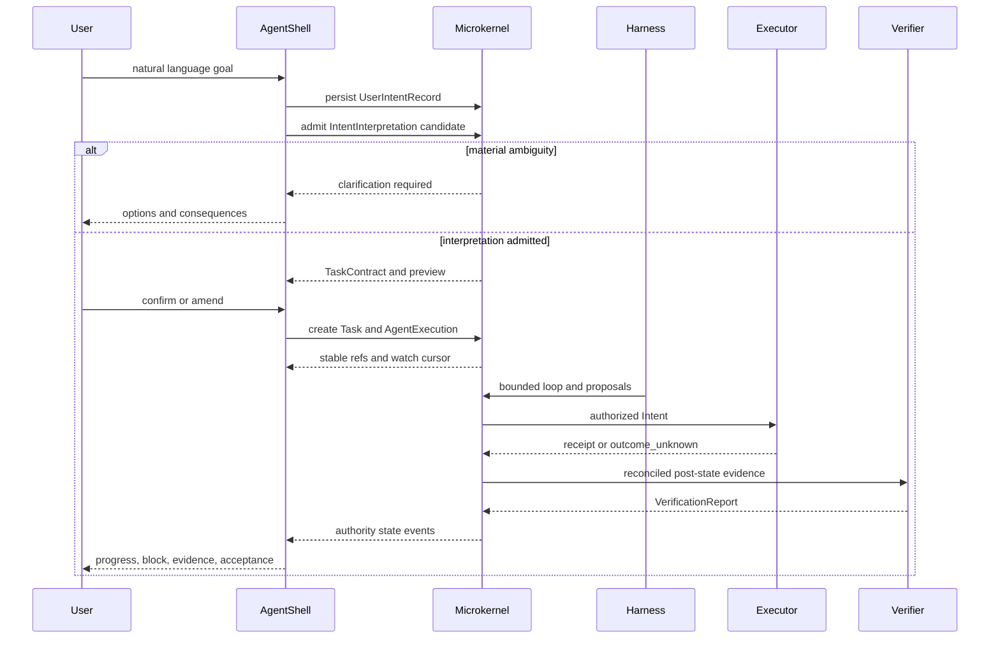

关键流转规则：用户输入先作为受治理、默认不可信的数据保存；解释候选不覆盖原文；TaskContract 只由意图 authority 接受；每个 Activity 重新解析 ContextView；每个写操作使用 expected version、capability 和稳定幂等键；Effect 未对账不得完成；用户修正创建 superseding contract 并使旧 proposal/capability 失效；最终结果同时保留最小审计证据和按权限可导出的 EpisodePackage。

典型异常旅程必须可收敛：安装/升级经管理 proposal 与回滚点；运行中改目标先暂停新分派并处理旧 Effect；Shell 断连后凭新认证 attach 到稳定引用；cancel 过晚显示 `cancel_pending/too_late/outcome_unknown`；跨 Conversation/tenant 输入仅经授权引用或 ShareGrant；崩溃恢复遵循 fence、重放、对账、重授权、重解析再恢复。

#### 业务、控制与数据流检查表

| 用户旅程 | 权威对象流 | 数据与权限边界 | 失败/恢复出口 |
|---|---|---|---|
| 登录并开始对话 | AuthenticationSession → ConversationBinding → ActivityContext | 认证不等于历史读取；逐对象重验 | 关系陈旧则重新认证/绑定 |
| 创建长任务 | UserIntentRecord → Interpretation → TaskContract → Task/Execution | 原文为数据，解释为 candidate，契约由 intent authority 接受 | 澄清、拒绝、等待或缩小范围 |
| 安装/升级 Agent | Package → Installation proposal → Effect → committed Installation | package 声明不是 capability；管理通道独立 | rollback point、unknown outcome 对账 |
| 运行中修改目标 | superseding interpretation/contract → new epoch | 旧 Context/capability/proposal 失效 | fence 新 dispatch；旧 Effect 对账/补偿/隔离 |
| 高风险审批 | preview/proposal → challenge → independent approval | 批准绑定 digest/版本/期限，不能自批 | deny、step-up、expiry、重新预览 |
| 监督与断线重连 | StateSnapshot → WatchSubscription → ordered events | cursor 与可见字段按当前权限绑定 | stale cursor 获取新快照；缺口 fail closed |
| 取消/停止 | cancellation request → runtime/fence/effect observations | “请求”“载体停止”“世界收敛”分离 | pending、too late、unknown、safe state |
| 最终验收 | reconciled post-state → VerificationReport → AcceptanceDecision | receipt/Agent completed 不是验收 | fail、inconclusive、expired、重新取证 |

数据从用户到执行器只沿显式对象引用流动：原始输入保留 provenance/sensitivity；解释和计划继承 scope；Context Resolution 在正文进入模型前授权；Intent 固定参数 digest；Operation 只接收最小必要投影；receipt/observation 作为 evidence 返回；authority commit 形成事件；Shell 仅解析其被授权的状态投影。任何隐式 transcript、全局缓存、URI、PID 或模型隐藏态都不是跨阶段数据总线。

#### 事件驱动监督与用户承诺
权威状态变化写入提交历史；安全审计记录主体与决策；可丢遥测承载性能/调试；`ShellStatusView` 从前两者及授权的当前快照派生。watch 的 snapshot-plus-delta 算法为：授权并固定 snapshot/high-watermark → 从下一 cursor 消费 → 按 event id 去重并验证连续性 → 持久 ack → 在权限/版本变化时重新取 snapshot。背压只能有界阻塞、合并非权威进度、溢写或断开并要求重连，不能丢失 governed event 后继续宣称连续。

每个非终态必须回答五个用户问题：现在处于哪个 authority 状态；为何没有推进；正在等待哪个事件/主体；剩余预算和 deadline；用户可安全执行哪些动作。`completed` 只在验收决定提交后显示；`candidate_complete` 必须显示仍待验证；`outcome_unknown` 必须显示禁止盲重试及对账责任。
---
## 13. 慢认知、技能与硬实时回路
### 13.1 三时间尺度
具身 CognitiveOS 典型地包含三个时间尺度：
**慢认知回路**：
任务理解、世界建模、规划和协商；延迟从数十毫秒到分钟甚至更长；可使用远端模型和复杂 Context Resolution；输出为目标、候选计划或有界 setpoint。
**技能回路**：
导航、抓取、视觉伺服、工艺步骤等预验证技能；运行于边缘控制器；具有明确入口、退出、资源和安全包络；向认知层报告结构化进度与异常。
**硬实时回路**：
稳定控制、碰撞保护、力矩/速度限制、急停；由实时安全内核和设备控制器执行；不依赖网络、模型或垃圾回收；对最坏情况执行时间和失效模式作领域证明。

三类回路的上下文机制不同：慢认知可动态解析多源 ContextView；技能回路宜使用固定 schema、预取或预编译视图；硬实时回路只消费预加载、版本固定且经过认证的参数与安全包络，不在控制周期内调用动态 Context Resolution。“硬实时”不等于零延迟或零信息损失，而是最坏情况时延、抖动、输入语义和失效响应可分析、可证明。

三回路通过版本化 setpoint、constraint 与 observation 在层级边界交换信息，认知层只能产出有界 setpoint，最终执行权属于硬实时安全域。越靠近物理执行器，自由度越小、确定性越强、authority 越独立。

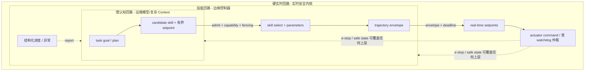

图中的约束传递方向不可逆：上层只能给出更窄的约束，不能放宽安全包络；下层可以在不询问上层的情况下进入 safe state。
### 13.2 命令层级
认知层不应直接输出未经约束的执行器波形。 推荐层级为：
```text
Task Goal
  -> Skill Selection
    -> Skill Parameters / Trajectory Envelope
      -> Real-time Setpoints
        -> Actuator Command
```
每一层缩小自由度并增加可验证约束。 越靠近物理执行器，语义越确定、周期越短、authority 越独立。
### 13.3 Skill Contract
技能契约可包括：
前置状态与环境假设；参数范围；安全包络；所需传感器和执行器；资源和驻留要求；可中断点；进度事件；成功、失败和未知退出；验证和恢复方法；实现与认证版本。
技能描述仍不是授权。 调用时需根据设备、Task、参数和当前世界版本进行本地授权。 具身语境下应用 §17.3 的通用防御，并补充具身特例：从执行器、传感器和远端 fleet 返回的内容同样视为不可信输入，必须经本地 schema、数据门禁与验收处理后再进入认知或控制层（详见 §17.3）。
### 13.4 Watchdog 与最终仲裁
实时安全域应能独立检测：
心跳丢失；控制周期超限；传感器不一致；setpoint 越界；热、电、力矩或速度超限；旧 epoch 控制器；紧急停止请求。
安全域可以钳制、降级、进入安全态或断开执行器。 普通认知 Activity 不能覆盖该决定。
### 13.5 时间参数的规范边界
文献和实现常使用 1 kHz、100 Hz、10 Hz 或 EDF 等示例。 这些值高度依赖设备、动力学、认证目标和硬件。
因此：
频率仅作为架构说明或 profile 示例；EDF、固定优先级和时间触发调度都是可选策略；通用 Core 不规定统一周期；具身 Profile 应要求实现声明并证明自己的 deadline、jitter、WCET 和失效响应；不能把某个实验平台的数字外推为通用 MUST。
---
<a id="resources"></a>
## 14. ResourceGraph、数据驻留与异构计算
### 14.1 从资源列表到 ResourceGraph
异构系统的成本往往由数据移动而非算术决定。 简单的“可用 GPU 列表”无法表达拓扑、信任、热约束和驻留。
ResourceGraph 将资源和路径表示为图：
**节点**可包括：
CPU、GPU、NPU、DSP、FPGA、CIM array；DRAM、HBM、SRAM、持久存储；模型服务、数据库和 verifier；边缘节点、云区域和机器人控制器；传感器和执行器；trust domain 与 data zone。
**边**可描述：
带宽、延迟和抖动；能耗和费用；加密与 attestation；数据允许方向；可用性和拥塞；DMA、网络或设备总线；格式转换和精度损失。
### 14.2 资源契约
资源节点可声明：
支持的操作和数据类型；容量、并发和队列；内存层次；精度和数值格式；热、功率和耐久包络；calibration version；安全等级和可信启动；数据驻留标签；可抢占、checkpoint 和迁移能力；故障与 fallback。
ResourceGraph 是版本化事实投影。 调度前应验证其 freshness。
### 14.3 数据驻留优先
放置决策应同时考虑计算和数据：
数据是否允许离开设备、区域或租户；模型权重是否可移动；中间激活和 KV cache 的敏感度；传输能耗是否超过计算节省；verifier 是否必须在 authority 附近运行；设备断网后是否需要本地继续；物理控制 deadline 是否允许远端路径。
“最近的加速器”不是“最合适的加速器”。
### 14.4 CIM 的特殊约束
Compute-in-Memory 可降低某些数据移动成本，但引入：
器件变异；温度和老化漂移；写入耐久；ADC/DAC 开销；有限精度和饱和；calibration 依赖；工作负载特定映射成本。
论文芯片上的吞吐或能效不能直接外推到完整 Agent 系统。 系统级收益必须包含编译、校准、数据转换、fallback 和传输成本。
### 14.5 CIM 误差调度
CIM placement 不只是容量调度，也是误差预算调度。 说明性的误差包络可分解为：
```text
E_total = E_quantization + E_device + E_conversion
        + E_mapping + E_drift + E_accumulation
```
调度器根据 OperationDescriptor 和任务风险匹配：
可接受误差；calibration freshness；当前温度和健康状态；数据分布漂移；是否需要数字校验；fallback 资源；结果对最终决策的敏感度。
近似结果可以用于候选生成、排序或感知前处理。 未经相应证明，不应承载授权判定、审计完整性或最终安全仲裁。

`E_total` 由 placement 调度器按上述匹配项消费：调度器把候选 placement 的 `E_total` 与 OperationDescriptor 声明的可接受误差比较，把"近似可接受"的任务分配到 CIM 路径、把"近似不可接受"或属高风险决策路径的任务路由到确定性 fallback 资源。 一旦某类结果要承载授权判定、审计完整性或最终安全仲裁，必须走确定性或经认证的 fallback 路径，并由运行时按本节与 §13.5 的时间边界与 [Heterogeneous 规范](./specs/heterogeneous/README.md) 的 `REQ-HET-ERR-001`/`REQ-PROFILE-HET-001` 校验误差与驻留、保留从原 decision 到新 decision 的谱系（`REQ-HET-FB-001`）。 近似结果不得被外推至未声明的更高决策用途。
### 14.6 编译栈
异构 CognitiveOS 的编译路径可分为：
1. **语义 IR**：Task/Operation、前后置条件、数据类别和可验证性；
2. **认知图 IR**：模型、工具、检索、控制流和 verifier 依赖；
3. **张量/技能 IR**：算子、精度、状态和实时约束；
4. **放置 IR**：ResourceGraph 节点、路径、驻留和 trust domain；
5. **设备 IR**：GPU kernel、NPU graph、FPGA bitstream、CIM mapping 或实时 task；
6. **执行 manifest**：固定编译器、模型、校准、资源、fallback 和 digest。
编译不是一次性离线动作。 运行时可基于资源变化重新放置，但必须保持语义约束、版本和审计。
### 14.7 Heterogeneous Intelligence Fabric
HIF 是说明性资源服务层。 它可统一本地、边缘和远端模型：
能力发现；预算与数据策略；路由、hedging 和 ensemble；取消与费用计量；reducer 和证据谱系；模型、adapter 和量化版本固定。
多数票不能创造事实、权限或安全证明。 HIF 是 provider fabric，不是 authority。
---
## 15. 多 Agent 架构
### 15.1 多 Agent 何时有价值
多 Agent 适合：
天然可分解且可并行的任务；需要不同权限或数据隔离的角色；需要独立 proposer/verifier 的高风险决策；跨组织 authority 的协作；不同设备和地点上的自治单元；专业模型或技能组合。
它不自动优于单 Agent。 协调、上下文复制、冲突和错误传播可能超过并行收益。 应建立单 Agent 或确定性 workflow 基线。
### 15.2 委派契约
委派应创建明确对象，而不是只发送自然语言：
子任务范围；输入对象与版本；允许输出和提交边界；capability 衰减；子预算和 deadline；数据可见性；verifier；回报、取消和升级协议。
子 Agent 不能扩大父级未授予的权限、预算或数据 audience。
### 15.3 共享状态与消息
Agent 间消息默认是声明或证据，不是共享状态 authority。
协作模式包括：
共享权威 Task State；每 Agent 私有 working state；追加式协作事件；黑板式对象空间；actor/mailbox；A2A gateway；leader、quorum 或仲裁 authority。
消息重复、乱序和迟到是正常情况。 消费者应使用 identity、causation、高水位和幂等处理。
### 15.4 协调模式
可选模式包括：
manager-worker；market/auction；planner-executor-verifier；peer consensus；blackboard；swarm；人机混合团队。
这些是策略，不是 Core 结构。 固定三层认知不应成为通用要求。
### 15.5 独立验证与职责分离
“让另一个 Agent 检查”只有在真正独立时才增加证据价值。 独立性可能要求：
不同 principal 或 authority；不同数据来源；独立 verifier；不共享同一错误摘要；权限上无法自批自验；固定并公开冲突解决规则。
多个同模型副本一致，不等于事实正确。
### 15.6 跨组织联邦
跨组织协作需要：
身份联邦和目标域本地重新授权；跨 tenant 只通过 ShareGrant 或等价的本地受限授权，远端 allow/capability 不直接复用；artifact provenance 与签名；数据用途和保留约束；capability 不可直接跨域复用；责任边界和 dispute evidence；协议版本与 schema pin；不可无损映射时的显式拒绝。
---
## 16. 故障模型、分布式一致性与恢复
本节先声明故障与保证边界，再按对象/操作选择一致性、按 authority domain 应对分区，最后在 §16.6 给出恢复顺序。前述小节不是恢复步骤；只有 §16.6 的顺序构成恢复流程，并与 §4.6 主链路对齐。
### 16.1 故障模型与保证边界
Core 的恢复语义主要覆盖崩溃、遗漏、重复、乱序、延迟、网络分区、陈旧执行者和外部结果未知等故障。 实现还必须明确其是否、以及在什么边界内，处理恶意节点、伪造证据、密钥泄露、拜占庭 authority 或物理传感器欺骗；这些不是仅靠重放日志即可解决的问题。

| 事件 | 默认系统反应 | 可以恢复的事实 | 必须保留为未知或冲突的事实 |
|---|---|---|---|
| 进程/节点崩溃 | 提升 epoch，加载快照与提交历史 | 已提交状态、已确认游标、固定契约 | 未确认的远端执行是否生效 |
| 网络分区 | fence 旧写者，按状态域选择只读、暂停或局部安全动作 | 本地域的已提交事实 | 另一侧当前世界状态和未送达写入 |
| 消息重复/乱序 | 幂等消费、序列/因果检查、延迟 ack | 同一已提交变更的效果等价 | 不同 idempotency key 的两个真实动作 |
| authority 或策略漂移 | 重新认证、重验 capability 与绑定版本 | 新 authority 的明确决定 | 旧授权在新 epoch 下仍有效 |
| 外部执行器失联 | 查询、稳定键重试、补偿或隔离 | 可验证的执行器状态与证据 | 不可查询且无幂等保障的真实副作用 |
| 恶意或被攻陷组件 | 认证、签名/attestation、吊销、隔离、人工处置 | 仍可验证的独立证据链 | 被攻陷主体此前未被独立验证的全部断言 |

“可恢复”仅指系统能基于保存的证据重新建立一个受治理状态，不等于外部世界会自动回到故障前。 对拜占庭容错、跨区域灾备、密钥轮换、可信时间、设备证明和物理安全的强度，部署必须通过适用 Profile 和安全 case 单独声明。

### 16.2 一致性是按对象和操作选择的
CognitiveOS 不承诺全局单一一致性模型。 每个状态域和操作声明：
authority；consistency level；conflict policy；freshness；partition behavior；clock assumptions；recovery strategy。
### 16.3 Lease、Epoch 与 Fencing
分布式执行者通过 lease 获得暂时执行权。 每次 authority 迁移或重新选主推进 epoch。 写操作携带 fencing token。
即使旧执行者仍在运行，资源端也应拒绝旧 token。 仅依赖心跳停止不足以防止网络分区后的双写。
### 16.4 分区策略
分区期间可选择：
停止受治理写入；允许只读陈旧视图并标注；在独立 authority 域继续局部操作；执行预授权安全动作；缓存 Intent，恢复后重新授权；进入隔离或人工控制。
高风险外部副作用不应在失去 authority 或过期 lease 后继续提交。
### 16.5 事件投递与背压
可靠提交事件通常采用 at-least-once。 消费者需要去重并在状态持久化后 ack。
背压策略可为：
有界阻塞；拒绝新工作；溢写到持久存储；降低非关键遥测；触发调度降级。
受治理事件不可无标记丢弃。 遥测丢失不应影响权威状态和 Effect 正确性。
### 16.6 恢复顺序
典型恢复流程：
1. 进入 recovery barrier，暂停该 authority 域的新 governed 写入；
2. 验证 execution identity、推进 epoch，并在所有提交端安装新 fencing token；
3. fence 旧 writer，并确认旧 epoch 不能再提交；
4. 验证 snapshot，重放**已提交**历史至声明 high watermark；digest 分歧立即停止；
5. reconcile 全部未决 Intent/Effect，无法判定者进入 quarantine；
6. 重验 GovernanceDomainContext、ActorChain、Membership/Policy/Revocation、ConversationBinding、capability、freshness、budget 与 TaskContract；
7. 按 ActivityContext、ConversationBinding/ResourceScope 解析新 ContextView，隔离 KV cache 与 working set；
8. 仅在上述门禁全部通过后从 checkpoint 恢复 Loop。
不得通过重新调用所有非确定性 Activity 来“重放”。 已提交结果应被消费；未知结果应对账。
下列时序图与 §4.6 主链路对齐，把上述八步显式化为可验证阶段，并标出无法判定操作的隔离出口。

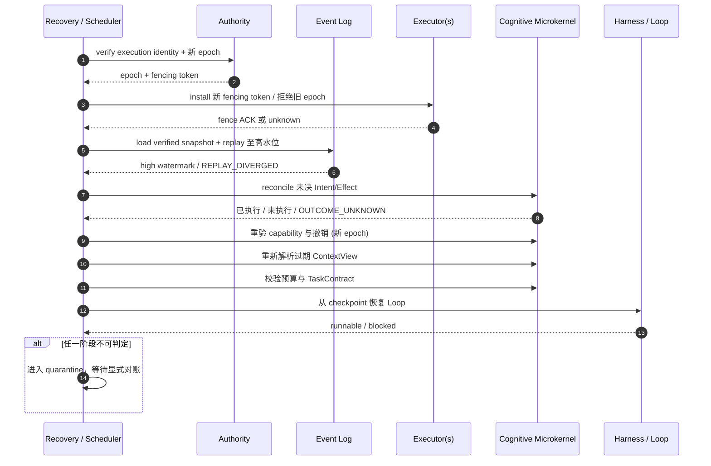
恢复的正确性依赖恢复顺序；策略层在新 epoch 完成 fence、重放与对账之前不得产生新的 governed 写入。
### 16.7 灾难恢复
灾难恢复还需关注：
authority 元数据和密钥恢复；日志完整性；跨区域数据驻留；snapshot 与日志截断点；未决外部副作用；设备当前真实状态；模型和策略版本可获得性；恢复演练和证据。
RPO/RTO 是部署声明，不是白皮书统一常数。
---
<a id="threats"></a>
## 17. 纵深安全
### 17.1 威胁模型
CognitiveOS 面对的威胁包括：
提示注入和控制/数据混淆；confused deputy；capability 或 privileged management session 泄露、扩权和撤销延迟；Shell/模型自批管理动作；同租户横向越权、管理员正文滥读、跨 Conversation cache/working-memory 污染、跨租户和跨 authority 访问；工具描述或 schema 投毒；状态回滚和事件伪造；副作用重放与 unknown outcome；记忆和学习数据投毒；verifier 与 TaskContract 篡改；资源耗尽和成本攻击；数据出域与证据包泄露；多 Agent 冒充与串谋；模型供应链和远端 endpoint 漂移；具身执行失控。
### 17.2 八道防线
#### 身份与启动信任
认证 Human、Workload、Device Principal 和 authority，分别保留 initiating、effective、workload 及可选 device 主体，不允许 workload 冒充 human。每次门禁固定 TenantContext、ActorChain、Conversation 或 non-conversational ResourceScope，并校验 Membership/Policy/Revocation 版本与 tenant 不可变性。关键节点可使用可信启动、attestation 和密钥代理。模型不应直接持有根密钥。
#### 对象与 schema 完整性
使用版本、规范化 digest、签名和 critical extension 规则。 未知安全关键字段 fail closed。
#### Context 信息流隔离
区分 control、authority state、evidence 和 untrusted input。 在敏感正文到达外部语义组件之前授权和脱敏。
#### 最小权限 capability
绑定 TenantContext、ActorChain、Conversation、subject、audience、purpose、ResourceScope、action、参数、lease、Membership/Policy/Revocation 版本和 epoch。 逐跳重新认证和本地授权。
#### 沙箱与执行隔离
限制文件、网络、进程、设备和秘密访问。 OperationDescriptor 声明并由运行时实施效果边界。
#### Effect 门禁与验证
先持久 Intent，再授权、执行、对账、验证和提交。 未知结果隔离，补偿独立授权。
#### 审计与不可抵赖证据
提交历史具备顺序完整性、保留、敏感度控制和导出审计。 普通 Agent 不能修改或删除权威 audit。
#### 独立安全域
硬实时安全、急停和最终执行器仲裁独立于认知路径和网络。
### 17.3 Prompt Injection 的正确边界
提示注入本质上是数据被错误解释为控制。 防御不应只依赖“更强系统提示”。
本节防御与 §12.1 的"描述≠权限"边界共同构成同一立场：外部或不可信内容中的 capability 文本、工具描述、Agent Card skill、feature 名等只能被当作数据，不能被当作授权；规范语义见 §12.1、§3.5 与各 companion 的网关要求。
系统需要：
1. 每个 ContextItem 携带 provenance、trust、sensitivity 与 valid-time 标签；
2. control、authoritative state、evidence、working 与 untrusted input 结构化分区；
3. 未授权正文在进入外部 ranker、transformer 或模型前被拒绝或脱敏；
4. 不可信内容默认按数据解释，工具调用、策略修改和 capability 请求必须形成结构化候选；
5. 最小上下文、egress、retention 与派生敏感度策略共同限制泄露面；
6. 高风险验证通过独立 principal、独立证据源或不可自批自验的权限实现职责分离。

结构化 schema 能缩小解释空间，但不能把任意自由文本“消毒”为可信控制；同样，control 与 data 即使在同一模型窗口中渲染，也必须依靠确定性 Effect 门禁阻止越权。
即使模型受到注入，确定性参考监视器仍应阻止越权副作用。
知识编译还必须防御持久投毒：ingest 内容在隔离区解析，生成文本不具控制权，自生成/循环引用不算独立佐证；发布 gate 检查来源许可、claim 依赖和跨 scope 派生；source 删除或撤销沿 claim 图传播，并使旧 ContextView/cache 失效。
### 17.4 审计闭合
每个已提交受治理 Effect 应能追溯：
```text
initiating / effective / workload principal + ActorChain
 -> TenantContext / Conversation / ResourceScope
 -> Task / TaskContract / Episode / ActivityContext
 -> StateSnapshot / ContextView
 -> proposal / Intent
 -> authorization decision
 -> executor receipt
 -> reconciliation / verification
 -> commit Event
 -> resulting state version
```
审计不等于默认保存所有内容。 秘密和原始 Prompt 可以仅保存受控引用、digest 或脱敏证据。
### 17.5 隐私与数据治理
数据策略应覆盖：
purpose limitation；最小披露；residency 与 egress；retention 与 deletion；derived data 和摘要敏感度继承；模型 provider 的训练/保留假设；EpisodePackage 导出；跨组织责任和用户权利。
KnowledgeObject、MemoryObject、ContextItem、ContextView、缓存、embedding、索引和所有派生数据统一继承 tenant、scope、owner、policy、purpose、sensitivity、compartment、retention 与 lineage。摘要不会自动降低敏感级别。URI 和对象引用也不能当作 bearer authorization。
---
## 18. 持续学习与系统演进
### 18.1 在线执行不等于在线改写生产
生产 Episode 可以产生学习候选：
新记忆；新技能；新 Context 策略；新 planner 或 verifier；模型 adapter；ResourceGraph 放置策略；异常和失败案例。
它们不应直接修改生产 authority、策略或安全门禁。
### 18.2 受控发布流水线
```text
Observe -> Candidate -> Curate -> Evaluate -> Simulate
        -> Shadow -> Canary -> Release -> Monitor
                                  |          |
                                  +-> Rollback
```
每一阶段保存：
来源 Episode 和数据授权；训练/转换版本；离线评估；安全和公平性检查；兼容性与迁移计划；审批和责任主体；发布 digest；回滚条件和 artifact。
### 18.3 受治理知识编译器与 LLM Wiki

LLM Wiki 在 CognitiveOS 中是一种**受治理知识编译器**，不是 Markdown 文件格式要求、普通 RAG 管线或“模型写完即发布”的百科。Karpathy 的 LLM Wiki 构想提供了可维护知识制品的工程动机；本架构把它收紧为可审计管线：

```text
Evidence -> ClaimCandidate -> KnowledgeCandidate -> AdmissionDecision
         -> Published KnowledgeObject -> ContextView
```

`Evidence` 是带来源、许可、时间、digest 与 scope 的输入；`ClaimCandidate` 是可单独验证的原子主张；`KnowledgeCandidate` 按主题组织主张但仍非事实；`AdmissionDecision` 由目标 scope 的 authority 作出；`Published KnowledgeObject` 是版本化、可撤销的发布制品；`ContextView` 只在当前 purpose/主体/预算下解析其适用投影。源材料不等于 world truth，发布状态也不表示永真。

每条 claim 保存 claim-level provenance、证据片段和依赖边 `supports`、`contradicts`、`supersedes`、`derived_from`。源更新、撤回、删除、许可变化、可信度下降或上游 claim 失效必须沿依赖图传播 invalidation，形成受影响集合并触发有界 recompile；不能只重建文档而留下旧 embedding、摘要、缓存或索引。`KnowledgeCompilationProfile` 固定分段、抽取、规范化、去重、冲突、引用、验证、渲染、模型/provider/sampling、策略和安全版本，使编译可归因和可重复。

命名操作为：`Ingest(evidence, profile)` 建立隔离候选和谱系；`Query(request)` 在对象级授权、freshness 与 conflict policy 后返回 claim；`Lint(candidate, profile)` 执行四层检查：deterministic lint（schema、digest、引用闭合）、policy lint（scope、purpose、许可、retention）、semantic lint（主张-证据蕴含、矛盾、时效）、security lint（注入、恶意链接、隐写、秘密、跨域与持久投毒）。语义模型只能提出 lint 发现，最终 admission/publish gate 由确定性策略和 authority 控制。

维护 loop 必须有时间、成本、变更数和递归深度上界：discover changes → invalidate dependencies → recompile candidates → lint → review/admit → publish atomically → refresh indexes/caches → audit；超界时保持旧的最后已知安全版本并标 stale，或 quarantine，不得无限自修。源删除遵循 retention、legal hold 和 purpose：允许删除正文时保留最小 tombstone、digest、删除原因与受影响派生关系；legal hold 阻止物理删除但不自动允许继续查询。

持久投毒防御覆盖 ingestion sandbox、内容/控制分区、来源信誉、签名与 MIME 检查、解压/递归上限、跨源独立证据、敏感派生继承、发布职责分离和发布后异常监控。生成内容、模型摘要、同一模型的改写或引用链循环**不能相互构成独立 corroboration**。架构明确拒绝四种假设：raw source = world truth；把该管线简化为无治理 RAG；允许模型直接发布；假定维护成本接近零。

知识评估至少报告 claim precision/recall（对固定标注集）、citation coverage、unsupported-claim rate、contradiction detection rate、stale-claim exposure rate、invalidation propagation latency、recompile success/failure、deletion closure、poison admission/escape rate、query authorization denial correctness，以及每 accepted claim 的时间/费用/能量。所有分母、窗口与置信区间遵循 §19.4 的 BenchmarkManifest。

### 18.4 技能学习
学习到的技能进入具身或数字执行前，应完成：
契约提取；参数边界；仿真和反例；资源与时限分析；安全包络验证；版本化封装；shadow/canary；fallback 和停用。
开放式模型策略不能自动获得实时或设备 authority。
### 18.5 防止反馈回路污染
自生成数据和自我评价容易产生确认偏差。 控制措施包括：
保留独立真实数据；区分模型生成与外部证据；固定 grader/verifier 版本；监控分布漂移；防止训练数据跨租户污染；对成功样本和失败样本都做归因；避免以线上参与度代替真实任务效用。
### 18.6 可回滚演进
模型、策略、schema、投影器和编译器升级都可能改变行为。 生产发布应固定完整依赖图，并支持：
版本分支；状态迁移；双读或 shadow；checkpoint 兼容性；历史重放隔离；回滚和数据恢复。
历史 workflow 重放不应悄然采用新逻辑。
---
## 19. 可观测性、评估与符合性
### 19.1 三类记录
CognitiveOS 区分：
- **权威提交历史**：影响正确性与恢复，不能依赖可丢遥测；
- **安全审计**：证明谁在何种权限下做了什么；
- **可观测遥测**：trace、metric、profile 和调试日志，可采样或降级。
OpenTelemetry 可用于导出遥测。 权威提交和审计仍由 CognitiveOS 管理。
### 19.2 评估单位
评估对象是：
```text
model + harness + environment + task distribution
+ policy + verifier + resource budget
```
报告应固定或记录：
TaskContract 和环境版本；模型、采样和 provider；Context 与 Loop 策略；Operation/工具版本；grader/verifier；预算和人工介入；最终世界状态和证据。
否则，结果差异不能被可靠归因给单一模型。
### 19.3 评估维度
**Outcome**：后态是否满足验收？
**Context**：关键约束是否被装入，冲突、过期和注入是否被正确处理？
**Loop**：是否有证据地推进，失败时是否有界恢复或停止？
**Harness**：改进来自模型还是运行支持，维护成本如何？
**Governance**：越权、出域、unknown outcome 和伪完成是否被拒绝或隔离？
**Embodied safety**：deadline、包络、故障和急停是否有独立证据？
**Heterogeneous efficiency**：端到端延迟、能量、数据移动、误差和 fallback，而非仅峰值算力。
<a id="performance-contract"></a>
### 19.4 可复现实验与性能契约

每份性能声明都由 `BenchmarkManifest` 固定输入：workload 与 TaskContract 分布；warm/cold cache 与模型启动状态；模型、provider、revision、sampling/seed；CPU/GPU/NPU/内存/存储/网络、节点拓扑和并发；数据集、版本、split 与许可；fault profile；R0—R3 risk class；样本量、重复次数、置信区间方法；baseline 与逐项 ablation；机制延迟与模型/工具/网络延迟的分离计量。报告必须声明 profile/SLO、测量时钟、窗口、缺失/取消样本处理和单位。机器格式见 [performance-report schema](./specs/schemas/performance-report.schema.json)。

统一统计约定：对延迟样本 `x` 以毫秒报告 p50/p95/p99；比例指标为 `100 * numerator / denominator %`，同时报告两者计数和 Wilson/bootstrap 95% CI；吞吐为窗口内完成数/墙钟秒；费用为货币/Task 与货币/accepted claim；能量为 J/Task、J/accepted claim 或 J/inference，并说明测量边界。滑动窗口必须给出起止时间/持续时长，不能删除 timeout、拒绝、unknown outcome 或 quarantine 样本。

- **Context**：required-set recall = loaded required / authorized required；context precision = relevant loaded / loaded；stale exposure = stale items presented / items presented；conflict preservation = surfaced conflicts / known conflicts；injection escape = policy-violating injected items reaching control interpretation / injected trials；resolution latency 与 token/byte/cost 分布。
- **Memory/Discovery**：authorized required recall、authoritative-source recall、false no-result、duplicate/irrelevant-token、wrong-scope exposure、first-view sufficiency、resolution rounds、marginal information gain、stagnation、gap closure、summary support、loss completeness、cross-Conversation contamination 与 revocation-cache bypass。
- **Catalog/Semantic**：correct-operation top-1/top-k、schema-compatible rate、prohibited exposure、effect-class confusion、false no-tool、dry-run disagreement、post-selection auth rejection、fallback correctness、unsupported reference 与 semantic latency/cost。
- **Execution/Loop**：verified task completion = COMPLETED / admitted tasks；candidate rejection = rejected CANDIDATE_COMPLETE / candidate claims；iterations、tool calls、wall/compute time、no-progress rate = no-progress iterations / iterations；human intervention、cancel-pending 与 deadline miss rates。
- **Effects**：authorization denial correctness；duplicate external effect = duplicate realized effects / governed intents；unknown-outcome rate = OUTCOME_UNKNOWN / executing effects；reconciliation latency；verification failure、compensation、quarantine 和 committed rates，均以 eligible Effect 为分母。
- **Recovery/Distributed**：RTO 从 barrier 建立到可安全 RUNNABLE；RPO 为缺失 committed events 数/时间；fencing rejection = rejected stale writes / attempted stale writes；replay divergence、partition write denial、pending-effect closure；恢复延迟 p50/p95/p99。
- **Embodied/Heterogeneous**：control deadline miss、safety-envelope violation、watchdog/safe-state latency；端到端 sensor-to-effect latency；J/verified action、bytes moved/action、accelerator utilization；CIM calibration error、fallback rate 与 fallback latency。
- **Security/Knowledge**：unauthorized disclosure = leaked protected objects / adversarial access trials；revocation propagation latency；poison admission/escape；claim/citation、contradiction、staleness、invalidation、recompile、deletion closure 指标按 §18.3 定义。

本节的三条规范义务与 [specs/registry/requirements.yaml](./specs/registry/requirements.yaml) 登记条目对应：

- [REQ-PERF-001] 性能声明 **MUST** 由符合 [performance-report schema](./specs/schemas/performance-report.schema.json) 的可复现报告支撑，并固定本节 BenchmarkManifest 所列全部输入（负载、环境、模型、数据、fault profile、risk class、统计方法与基线）。
- [REQ-PERF-002] 实现可以发布面向特定 profile 的 dashboard 或多目标 Pareto 前沿，但 **MUST NOT** 用一个“通用综合分”掩盖安全失败、拒绝路径、p95/p99 尾延迟、risk-class 分层或 unknown outcome。
- [REQ-PERF-003] 比例、延迟、吞吐、费用与能量指标 **MUST** 按上文统一统计约定给出分子/分母计数、窗口与置信区间，且 **MUST NOT** 删除 timeout、拒绝、unknown outcome 或 quarantine 样本。

跨报告比较只有在 manifest 兼容，或明确列出差异和 ablation 时才有意义。

### 19.5 符合性层级
规范套件可按以下层级测试：
1. wire/schema；
2. Tenant/ActorChain/Conversation/ResourceScope 绑定；
3. 对象与状态机；
4. authorization 与信息流；
5. Effect、幂等和 crash recovery；
6. Context 质量与安全负例；
7. Harness、Loop 与 Verification；
8. distributed partition 与 fencing；
9. embodied safety 与异构 profile。
本节九级是按主题的宏观分层；[符合性索引](./conformance/README.md) 将其细化为 15 个累积测试层（在上述主题外单列知识编译、性能契约、管理会话、Agent 安装、受治理记忆、认知发现、Operation 目录、语义中介与意图/Shell 层），测试资产以后者的层编号为准。实现应发布机器可读 profile manifest，区分 implemented、experimental、planned 和 unsupported。 详细要求见 [符合性索引](./conformance/README.md)。
### 19.6 外部协议测试边界
通过 MCP 测试只说明 MCP 互操作。 通过 A2A TCK 只说明 A2A 互操作。 通过宿主 OS 或容器安全测试也不自动证明 CognitiveOS 的 Context、Capability、Effect 和 Verification 正确。

### 19.7 上线就绪证据（Readiness Case）
把一个原型接入生产，不应只回答“能否完成演示任务”，还应形成与风险等级相称的可审计 readiness case。 该证据包至少要能回答：

1. **范围**：哪些 Task、状态域、Operation、数据类别、地域和设备在本次声明内，哪些明确不在；
2. **身份与隔离**：TenantContext、Membership、Human/Workload/Device Principal、EffectiveSubject、ActorChain、Conversation/ResourceScope 及管理员正文隔离如何证明；
3. **权威**：每个受管状态与验收点的 authority、委派链、租约和人工升级路径是什么；
4. **效果**：哪些 Operation 可能产生不可逆效果，其幂等、查询、补偿和 `OUTCOME_UNKNOWN` 策略是什么；
5. **安全**：威胁模型、信任根、隔离边界、capability 撤销、密钥与出域策略是否已经验证；
6. **恢复**：故障模型、RPO/RTO、checkpoint、fencing、对账和灾难恢复演练有哪些证据；
7. **验证**：TaskContract、独立 verifier、人工 gate、拒绝/隔离路径和已知盲区分别是什么；
8. **运行**：预算、容量、告警、审计保留、人工值守和停止开关如何工作；
9. **变更**：模型、策略、schema、工具、固件与校准的发布/回滚边界是否固定；
10. **安装与适配**：package provenance、adapter/sandbox digest、C0—C3 feature matrix、不可绕过性和 rollback evidence 是否固定；
11. **认知服务**：Memory admission、discovery delta、catalog binding、SMS fallback 与 CRB hard-bound 是否有负例证据。

Readiness Case 还应包含同租户横向越权、管理员正文拒绝、跨 Conversation 污染、撤销后缓存失效、检索前过滤、跨 scope 晋升和 ShareGrant 本地重授权的负例证据。建议将上述结论与 [profile manifest schema](./specs/schemas/profile-manifest.schema.json)、适用规范版本、测试向量和已记录 degradation 一并发布。 不具备某项证据并不必然禁止低风险实验，但必须缩小 capability、数据范围和效果类别，且不得把实验状态包装成生产保证。
---
<a id="core-digital-profile"></a><a id="distributed-profile"></a><a id="embodied-safety-profile"></a><a id="controlled-learning-profile"></a>
## 20. 参考部署形态
### 20.1 单节点数字 Agent
最小部署可在一个进程中实现：
认知微内核库；本地对象存储和事件日志；单个 Harness；模型与工具 adapter；受限沙箱；verifier。
即使单进程，也应保持对象和状态域的逻辑边界。

启动就绪度应区分：`MANAGEMENT_READY` 表示 authority、审计、Management API 与确定性 Admin CLI/Console 已可用于受限管理，即使尚未启动任何 domain Agent、模型或 Intelligent Shell；`USER_READY` 表示普通任务通道、身份、Conversation、意图固定、Task/Execution 创建与 watch 已可用；`OPERATIONAL` 表示适用的 domain Agent、Harness、模型/工具、verifier 与自治执行门禁已满足其声明的运行条件。无 domain Agent 的 `MANAGEMENT_READY` 或仅可提交/监督任务的 `USER_READY` 是有效、可维护的启动模式，不是失败的 `OPERATIONAL`；模型或 Shell 不可用时，管理面仍须可用于检查状态、停止执行、撤销 capability 和对账未决 Effect。
### 20.2 企业多租户平台
典型组件包括：
identity 与 policy authority；分布式 State/Context Runtime；AgentExecution scheduler；MCP/A2A gateway；HIF；数据驻留区域；审计与评估平台；人工审批和事故响应。
租户边界不应只依赖 Prompt 或逻辑标签。每个请求固定 TenantContext 与 ActorChain；存储、索引、密钥、队列、审计和缓存按 tenant/scope 隔离。管理员控制平面与正文数据平面分权；Intelligent Shell 只通过短期 PrivilegedManagementSession 操作，逐操作形成 proposal/gate/audit，R2/R3 使用独立批准；break-glass 读取独立授权、限时、双人或等价审批并通知审计。并发 Conversation 默认独立 AgentExecution；跨 tenant 共享使用 ShareGrant 并在目标域本地重授权。部署必须验证 ANN/全文检索前置过滤、逐对象正文重验，以及缓存键包含 tenant、ActorChain、Conversation、purpose 与 Policy/Membership/Revocation 版本。
### 20.3 边缘—云机器人
云端承担：
大模型和全局知识；长期计划和学习；fleet 级调度与分析。
边缘承担：
当前 World State；技能和局部规划；断网自治；设备 capability 和 Effect。
实时控制器承担：
硬实时回路；safety envelope；watchdog 和急停；最终执行器仲裁。
### 20.4 资源受限设备
微型部署可以裁剪：
不使用 LLM；只保留少量固定 Operation；使用本地 append log 和静态 capability；Context Resolution 退化为确定性选择；通过上级 CognitiveOS 进行离线管理。
裁剪不能模糊已声明的安全和 authority 边界。

### 20.5 风险分级与最小部署基线
部署拓扑应由影响范围和故障可逆性驱动，而不是由模型大小或 Agent 数量驱动。 以下分级是架构规划工具，不是法律或行业认证分级：

| 等级 | 典型场景 | 可接受的效果边界 | 最小治理基线 |
|---|---|---|---|
| R0：受限观察 | 私有资料检索、离线分析、模拟 | 无外部写入；结果仅为候选 | Tenant/Principal/ActorChain、Conversation 或 non-conversational ResourceScope 隔离；数据分类、检索前 tenant/scope 过滤、逐对象正文重验、Context 分区、required/forbidden、缓存绑定、预算与显式免责声明 |
| R1：可逆数字动作 | 创建草稿、测试环境变更、可撤销工单 | 可查询、可撤销或可人工确认的写入 | R0 加版本固定、loss declaration、TaskContract、capability、Intent/Effect、checkpoint、验证与人工升级 |
| R2：高影响数字动作 | 生产变更、资金/权限建议、跨组织协作 | 不可逆或高价值效果，必须有明确 authority | R1 加独立 verifier/ContextView、冲突保留、强 fencing、双人/多方审批、对账、灾备与安全负例测试 |
| R3：具身或安全关键动作 | 机器人、无人系统、工业设备、医疗辅助 | 可能造成人身、设备或环境伤害的效果 | R2 加具身 Profile、独立安全域、watchdog、safe state、时限证据与 hazard analysis；硬实时周期内禁用动态 Context Resolution |

同一系统可在不同 Task 或 Operation 上声明不同等级，但 capability 必须阻止 R0/R1 路径绕过 R2/R3 的门禁。 风险升级时，应重新绑定 TaskContract、authority、预算、验证器和可用 Operation，而不能仅更换更强的 Prompt。
---
## 21. 路线图
### Phase 0：对象与治理基线
稳定现有治理语义并登记 AgentPackageManifest、MemoryObject、OperationSummary 与 CognitiveResourceManifest；建立 schema/requirement/error/vector 的可追踪边界。
### Phase 1：最小可安装系统
交付 AgentInstallation、C0/C1、sandbox、Identity/Memory/Tool adapters、静态 Catalog、确定性 Context Resolution、legacy Agent 参考适配器与不可绕过负例。
### Phase 2：认知发现与受治理记忆
交付 InformationGap、ContextViewDelta、目录/正文分离、累计预算、停滞检测，以及 MemoryCandidate/admission/promotion/conflict/invalidation/delete。
### Phase 3：Semantic Mediation
交付可插拔 embedding/reranker/LLM、Context Need Compiler、Operation Matcher、确定性外壳、无 LLM fallback 和分层质量评估。
### Phase 4：生命周期与恢复适配
交付 C2、checkpoint、pending Effect、unknown outcome、Conversation 切换和恢复负例；C3 保持为原生集成目标。
### Phase 5：分布式与多 Agent
交付跨节点 catalog、语义服务数据驻留、跨组织 discovery/ShareGrant、本地重授权及多 Agent context delegation。
### Phase 6：具身与异构
SMS 只参与慢认知；技能回路使用固定 Descriptor；硬实时回路不调用动态语义服务；Catalog 明确 realtime class，并完成 ResourceGraph/CIM fallback 与安全证明。
### Phase 7：持续学习
交付受控知识/记忆/策略/模型发布、独立评估、shadow/canary、派生删除与自动回滚。
### 路线图原则
先安装与不可绕过，再做多轮发现，最后增加语义优化；每阶段先定义可测试语义，再优化实现。Compatibility 不替代风险与安全 Profile；模型和 Shell 不得成为确定性管理、恢复或停止路径的依赖。
---
## 22. 开放研究问题
1. 如何量化 ContextView 的信息损失而不依赖模型自评？
2. semantic query 怎样兼顾版本固定、隐私、相关性和可解释性？
3. World authority 在不可直接观测环境中如何表达置信与冲突？
4. 不可查询、不可幂等且不可补偿的执行器如何限制 unknown outcome？
5. 多 Agent 独立性怎样被度量，而不是通过角色名称假定？
6. 哪些 progress signal 能跨任务识别真实推进与“看起来很忙”？
7. 如何在不保存思维链和秘密的前提下支持充分事故归因？
8. 具身系统怎样在行业认证中映射 CognitiveOS 双内核边界？
9. CIM 误差、热和老化如何进入在线 placement 并保持可验证？
10. 持续学习候选何时可以安全晋升为生产策略或技能？
11. 跨组织 capability 和责任证明怎样互操作而不泄露本地域权力？
12. 如何量化 Harness 维护熵和长期治理成本？
13. 如何证明 ANN/全文索引在候选发现前没有泄露 tenant、scope 或 compartment 存在性？
14. ShareGrant 撤销与依法保留派生物之间如何形成跨域证明？
15. Conversation 切换时 KV cache 清理、Effect 对账与可恢复性能如何共同优化？
16. ActorChain 的跨组织证明如何兼顾可审计性与组织关系最小披露？
17. 如何在 source 删除、legal hold 与不可逆模型训练之间证明派生清理边界？
18. 如何校准 semantic lint 而不让同一模型生成并自证 claim？
---
## 23. 架构决策摘要
### 决策一：CognitiveOS 是治理型操作系统
它以虚拟化、保护、并发、持久性、资源管理、设备中介和故障语义满足严格 OS 判据。 它不以“包含 LLM”作为 OS 依据。
### 决策二：LLM 是协处理器
LLM 提供语义候选，不拥有 authority、授权、提交或最终安全仲裁。
### 决策三：五个执行生命周期状态机正交分离
AgentExecution、Task、Loop、Effect 和 Verification 五个执行生命周期状态机分离演进；authority 管理的状态域是开放集合。 任何单一 `RUNNING/DONE` 状态都不足以描述系统。
### 决策四：上下文是受约束的派生工作视图
ContextView 根据 purpose、权限、预算、新鲜度和 target 动态解析。它不是长期事实库、World State authority 或 capability；CVM 是可替换的虚拟化实现模型。
### 决策五：日志权威与世界权威分工
事件日志权威记录 CognitiveOS 内部提交因果历史。 当前 World State 由声明的 world authority 仲裁。
### 决策六：授权覆盖真实治理边界
跨 authority、持久化、外部副作用和敏感数据边界需要授权。 纯局部、短暂、无受治理影响的操作不强制 capability。
### 决策七：描述不等于权限
OperationDescriptor、MCP feature、Agent Card skill 只说明能力。 AuthorizationCapability 才表达本地授权；完整定义与边界见 §12.1（OperationDescriptor 与 AuthorizationCapability）及 §17.3（prompt injection 中的数据/控制分离）。
### 决策八：双内核隔离时间与安全
慢认知和技能输出不能覆盖实时安全内核的最终执行器仲裁。
### 决策九：机制与策略分离
版本、权限、状态机、预算硬边界和审计属于机制。 排序、模型、拓扑、频率、EDF、重试和 placement 目标属于策略或 Profile。
### 决策十：学习经受控发布
在线 Episode 产生候选，不直接改写生产策略、模型、verifier 或安全配置。
### 决策十一：信息损失显式化
摘要、裁剪、脱敏和格式转换必须保留来源、版本、敏感度派生与 loss declaration；质量估计不能替代 required 门禁。
### 决策十二：上下文是横切服务而非第四 authority 平面
Context Engineering 贯穿体验、控制和执行平面；其策略可演进，但授权、硬预算、版本固定和校验不能下放给概率组件。
### 决策十三：Tenant 隔离不等于授权
Tenant 是数据与策略隔离域，不是权限等级；同租户、管理员或平台控制权均不自动产生正文读取权。
### 决策十四：ActorChain 与 Conversation 进入执行身份
AgentExecution 固定 initiating/effective/workload 主体、委派链、版本和 Conversation；并发 Conversation 默认独立执行，复用必须 checkpoint、对账、隔离、重授权和重解析。
### 决策十五：认知数据统一准入与派生治理
Knowledge、Memory、Context、缓存、embedding 和索引共享 tenant/scope/purpose/sensitivity/retention/lineage 约束；跨 scope 晋升产生新决定、新版本与审计。
### 决策十六：LLM Wiki 是受治理知识编译器
知识经 Evidence→ClaimCandidate→KnowledgeCandidate→AdmissionDecision→Published KnowledgeObject→ContextView 流水线发布；Markdown、RAG 或模型输出都不是 authority，依赖失效与删除必须传播并重编译。
### 决策十七：性能声明可复现且不可掩盖尾部风险
BenchmarkManifest 固定环境、负载、模型、数据、fault、risk 与统计方法；安全失败和 p95/p99 不得被通用综合分隐藏。
### 决策十八：Intelligent Shell 使用短期特权管理会话
Shell 是 Management API 客户端，不是 authority 或永久 root Agent。短期 session 固定主体、绑定、scope、风险、版本与双重超时；每个管理写操作仍需结构化 proposal、适用批准、Effect 门禁和逐操作审计，确定性 CLI/Console fallback 保持同一约束。
### 决策十九：认知资源跨边界必须中介
OS 统一对象语义、治理元数据、系统调用和可观察行为，不统一数据库、向量引擎、模型或工具框架；Runtime 私有短暂状态一旦跨治理边界即回到标准服务面。
### 决策二十：兼容性与风险正交
C0—C3 描述 adapter 可见性与生命周期集成，R0—R3 描述影响与治理基线；二者不能相互替代。
### 决策二十一：SMS 与 CRB 位于微内核外
SMS 生成候选，CRB 在硬边界内协调资源；两者都不拥有 authority。微内核继续确定性执行身份、授权、预算、驻留、状态机、fencing 与提交。
### 决策二十二：Shell 是双通道参考客户端
Shell 提供普通任务通道和短期特权管理通道，可调用 SMS、Core 与 Management API，但不承载全局 memory、catalog、调度、capability authority 或 commit；无 Shell、无模型时确定性管理面仍可运行。
### 决策二十三：用户意图是端到端验收根
原始意图与解释候选分离；解释、契约、提案和委派只能经 authority 接受或收窄，完成必须回指固定意图、契约和后态证据。
### 决策二十四：Shell 观察与执行解耦
命令返回稳定对象引用并通过有界 watch 监督；终端断连、attach、取消、Runtime 终止、Effect 收敛和 Task 完成是不同事实。
---
## 24. 结论
自主 Agent 和具身智能把计算系统从“调用函数”推向“在不确定世界中持续承担目标”。 这不仅需要更强模型，也需要新的系统软件边界。
CognitiveOS 的核心价值是把认知活动纳入可验证的操作系统机制：
用持久认知进程承载连续性；用 authority 和版本化状态处理现实冲突；用 Context Engineering 在权限、预算和损失约束下管理有限注意力；用 Harness 和 Loop 将开放式推理变成有界控制；用 capability 与 Effect 协议治理真实改变；用双内核连接慢认知和物理安全；用 ResourceGraph 与编译栈利用异构计算；用事件、证据和恢复建立可审计因果链；用受控发布实现持续学习而不破坏生产边界。
这样的 CognitiveOS 不承诺消除不确定性。 它使不确定性被标注、约束、隔离和恢复。 这正是自主智能从演示走向长期运行基础设施所需要的系统能力。
---
## 附录 A：核心术语
- **UserIntentRecord**：保存用户原始表达、主体、Conversation、输入引用与 digest 的不可覆盖意图记录。
- **IntentInterpretation**：对 UserIntentRecord 的版本化结构化候选，显式列出目标、约束、假设、歧义和缺口。
- **ShellActionProposal**：普通任务或特权管理命令的结构化、可预览动作提案。
- **WatchSubscription**：绑定授权、selector、cursor、高水位、预算与背压的事件监督对象。
- **Activity**：一次确定性或非确定性工作单元。
- **GovernanceDomainContext**：TenantContext 与 PlatformContext 的判别联合。
- **PlatformContext**：由独立 platform authority 建立、不能隐含 tenant 正文读取权的治理上下文。
- **scope_domain**：显式区分 `tenant` 与 `platform` 对象的字段。
- **Participant**：以明确关系、版本和有效期参与 Conversation 的主体。
- **ConversationBinding**：固定 Conversation、参与关系及 history/working scope 的绑定。
- **AgentExecutionBinding**：execution identity 与治理上下文、ActorChain、Conversation/scope、版本及 fencing 的固定绑定。
- **ExecutionContext**：AgentExecution 级的固定治理包。
- **ActivityContext**：单次 Activity 的更窄 purpose、scope、ContextView、capability 与 budget 绑定。
- **KnowledgeCompilationProfile**：固定 claim 抽取、lint、冲突、发布与渲染依赖的版本化编译配置。
- **KnowledgeClaim**：具有 claim-level provenance、scope、时效和依赖边的原子知识主张。
- **BenchmarkManifest**：固定性能实验负载、环境、模型、数据、故障、统计和基线的可复现清单。

- **AgentPackageManifest**：第三方 Agent artifact、Runtime、I/O、恢复与安全声明的签名清单；不是 capability。
- **AgentInstallation**：经验证、适配、沙箱和测试后提交的版本化安装记录。
- **CognitiveResourceManifest**：按 ActivityContext 过滤的可发现资源类别与入口，不授予 read/call。
- **InformationGap**：绑定具体 claim/decision、所需 authority/evidence 与关闭条件的结构化信息缺口。
- **ContextViewDelta**：相对固定 base view 的增量上下文结果，不得扩大原 scope。
- **OperationSummary**：用于低成本发现的 Operation 摘要，不是 Descriptor 或 capability。
- **SMS**：Semantic Mediation Service，微内核外的候选编译、排序、匹配与缺口分析服务。
- **CRB**：Cognitive Resource Broker，在既有硬约束内协调认知资源预留与降级的非 authority 服务。
- **AgentExecution**：绑定 TenantContext、ActorChain、Conversation 与治理版本，跨进程、运行时会话和节点延续的逻辑执行身份。
- **ActorChain**：initiating、effective、workload 与可选 device principal 及其委派的有序链。
- **AdmissionDecision**：认知对象进入目标 scope 或生命周期阶段的准入决定。
- **AKP**：Agent Kernel Protocol，CognitiveOS 内核对象与机制的协议面。
- **Authority**：对对象或状态域拥有最终写入或仲裁权的主体或协议。
- **AuthorizationCapability**：可验证、可衰减、可撤销的本地授权对象。
- **CIM**：Compute-in-Memory，在存储阵列附近或内部执行计算。
- **AuthenticationSession**：认证协议产生的短期登录状态，不是 Conversation。
- **Conversation**：由 Participant 和 Turn 构成的持久交互资源作用域。
- **Delegation**：有范围、有期限、可撤销且单调衰减的权力传递。
- **EffectiveSubject**：当前授权判定承受权限边界的主体。
- **Membership**：Principal 与 Tenant 的有版本、有期限关系，不直接授予正文读取。
- **ResourceScope**：对象可见、派生、保留和晋升的治理边界。
- **RuntimeSession**：模型、工具、连接或进程的短期运行状态。
- **ShareGrant**：源 authority 对跨主体或跨 tenant 访问的显式受限授权对象。
- **Tenant**：数据与策略隔离域，不是权限等级。
- **TenantContext**：固定 tenant、Membership/Policy/Revocation 版本与信任域的判定上下文。
- **Turn**：Conversation 中有序的输入、输出或系统事件。
- **PrivilegedManagementSession**：由 management session authority 签发并绑定 Human/ActorChain/ActivityContext、scope、风险、版本与双重超时的短期管理授权上界。
- **ManagementActionProposal**：把自然语言管理意图固定为目标、参数、版本、幂等键、风险与期限的结构化提案。
- **ManagementApprovalDecision**：authority 针对固定 proposal challenge 签发的可验证批准、拒绝或追加认证决定。
- **AttentionBudget**：对上下文与认知活动的硬资源上限、预留和软调度信号。
- **Context Engineering**：治理上下文发现、授权、选择、变换、渲染、生命周期、损失与成本的机制和策略集合。
- **ContextRequest**：按目的、视角、预算、权限和新鲜度请求上下文的对象。
- **ContextView**：Context Resolution 生成的短期、固定版本工作视图。
- **CVM**：Context Virtual Memory，上下文地址空间与工作集的可选虚拟化模型，不要求模拟真实页表。
- **ContextLossDeclaration**：描述有损变换来源、版本、省略、适用范围和敏感度继承的记录。
- **Effect**：Intent 的执行、回执、对账、验证和提交记录。
- **Episode**：有界因果、预算和审计范围。
- **Harness**：连接模型、环境、运行时和 CognitiveOS 机制的运行基质。
- **Intent**：在执行前持久化的受治理副作用提案。
- **Checkpoint**：通用恢复封装，可承载 LoopCheckpoint 等 payload。
- **LoopCheckpoint**：Checkpoint 中保存 Loop 行动级事实的 payload。
- **Continuation**：恢复后可执行的后续体及前置条件引用。
- **OperationDescriptor**：操作接口、语义、效果、资源和验证特征的描述。
- **Principal**：可认证、授权和审计的主体。
- **ResourceGraph**：资源、数据路径、驻留、信任和约束的版本化图。
- **StateSnapshot**：某状态域固定版本的不可变读视图。
- **TaskContract**：目标、约束、验收、预算、等待和出口的版本化契约。
- **VerificationReport**：对固定后态与验收条件的证据判定。
- **World State**：由声明 world authority 仲裁的当前世界投影。
---
## 附录 B：规范套件导航
| 主题 | 规范入口 | 版本 | 状态 | 主文档关系 |
|---|---|---|---|---|
| Core 对象与机制 | [Core](./specs/core/README.md) | v0.2 Draft | Companion Specification | 规范化第 6—12 节的核心语义 |
| 多租户、对话与认知准入 | [RFC-0001](./RFC-0001-cognitiveos-governance-context-access.md) | v0.2 Draft | Normative Companion RFC | 规范化治理上下文、Conversation、知识编译与访问；治理对象机器 schema 已由 [governed-object-contract](./docs/standards/governed-object-contract.md) 登记，知识对象仍为伪 schema |
| Agent 安装与适配 | [Agent Compatibility](./specs/agent-compatibility/README.md) | v0.1 Draft | Companion Specification | 规范化第 5 节 |
| 受治理记忆 | [Governed Memory](./specs/governed-memory/README.md) | v0.1 Draft | Companion Specification | 规范化记忆准入与生命周期 |
| 认知发现 | [Cognitive Discovery](./specs/cognitive-discovery/README.md) | v0.1 Draft | Companion Specification | 规范化 manifest、gap 与 delta |
| Operation 目录 | [Operation Catalog](./specs/operation-catalog/README.md) | v0.1 Draft | Companion Specification | 规范化 discover/match/bind |
| 语义中介与资源代理 | [Semantic Mediation](./specs/semantic-mediation/README.md) | v0.1 Draft | Companion Specification | 规范化 SMS/CRB soft-signal 边界 |
| 内核协议 | [AKP](./specs/akp/README.md) | v0.2 Draft | Companion Specification | 规范化第 11 节 |
| 分布式系统 | [Distributed](./specs/distributed/README.md) | v0.2 Draft | Companion Specification | 规范化第 15—16 节的分布式部分 |
| 具身与安全 | [Embodied](./specs/embodied/README.md) | v0.2 Draft | Companion Specification | 规范化第 13 节 |
| 异构与 CIM | [Heterogeneous](./specs/heterogeneous/README.md) | v0.2 Draft | Companion Specification | 规范化第 14 节 |
| 持续学习 | [Learning](./specs/learning/README.md) | v0.2 Draft | Companion Specification | 规范化第 18 节 |
| 测试与声明 | [Conformance](./conformance/README.md) | — | Conformance Assets | 规范化第 19 节的符合性要求 |

白皮书与规范歧义时，以被实现固定版本和摘要的规范文本为准（与 §1.2 末段一致）。 Companion 版本与状态字段独立漂移；调用者应以 [profile-manifest](./specs/schemas/profile-manifest.schema.json) 中实际声明的 `spec.version`、`requirement_set_digest` 与 `schema_bundle_digest` 为权威。 全部机器 schema 位于 [specs/schemas/](./specs/schemas/)；治理对象族的登记清单见 [governed-object-contract](./docs/standards/governed-object-contract.md)，其余 schema 由各 companion README 的“机器 schema”标注与 [requirements.yaml](./specs/registry/requirements.yaml) 的 `owner_spec` 字段索引。
---
## 附录 C：参考资料与证据等级
### C.1 证据等级
`[STD]`：已发布标准或官方稳定规范；`[PEER]`：同行评审研究；`[PRE]`：预印本，结论仍待更广验证；`[IND]`：厂商或开源项目工程经验；`[HYP]`：本文提出、尚待系统实验验证的架构假设。
预印本、厂商经验和单一硬件论文不构成普遍性能保证。 任何数字都应在其任务、模型、设备、软件栈和实验条件内解读。
### C.2 标准与协议
1. `[STD]` IETF, **RFC 2119 — Key words for use in RFCs to Indicate Requirement Levels**：https://www.rfc-editor.org/rfc/rfc2119
2. `[STD]` IETF, **RFC 8174 — Ambiguity of Uppercase vs Lowercase in RFC 2119 Key Words**：https://www.rfc-editor.org/rfc/rfc8174
3. `[STD]` Model Context Protocol, **Specification 2025-11-25**：https://modelcontextprotocol.io/specification/2025-11-25/
4. `[STD]` A2A Protocol, **Specification v1.0.0**：https://a2a-protocol.org/v1.0.0/specification/
5. `[STD]` OpenTelemetry, **Semantic Conventions**（语义约定仍在演进）：https://opentelemetry.io/docs/specs/semconv/
6. `[STD]` NIST, **AI Risk Management Framework 1.0**：https://www.nist.gov/itl/ai-risk-management-framework
### C.3 Agent、上下文与 Harness
7. `[PRE]` Mei et al., **AIOS: LLM Agent Operating System**, arXiv:2403.16971：https://arxiv.org/abs/2403.16971
8. `[PEER]` Yao et al., **ReAct: Synergizing Reasoning and Acting in Language Models**, ICLR 2023：https://arxiv.org/abs/2210.03629
9. `[PRE]` Shinn et al., **Reflexion: Language Agents with Verbal Reinforcement Learning**, arXiv:2303.11366：https://arxiv.org/abs/2303.11366
10. `[PEER]` Liu et al., **Lost in the Middle: How Language Models Use Long Contexts**, TACL 2024：https://aclanthology.org/2024.tacl-1.9/
11. `[PRE]` **AI Harness Engineering: A Runtime Substrate for Foundation-Model Software Agents**, arXiv:2605.13357：https://arxiv.org/abs/2605.13357
12. `[PRE]` Zhang et al., **Agentic Context Engineering: Evolving Contexts for Self-Improving Language Models**, arXiv:2510.04618：https://arxiv.org/abs/2510.04618
13. `[PRE]` Li et al., **Haystack Engineering: Context Engineering for Heterogeneous and Agentic Long-Context Evaluation**, arXiv:2510.07414：https://arxiv.org/abs/2510.07414
14. `[IND]` Anthropic, **Effective harnesses for long-running agents**：https://www.anthropic.com/engineering/effective-harnesses-for-long-running-agents
15. `[IND]` Anthropic, **Harness design for long-running application development**：https://www.anthropic.com/engineering/harness-design-long-running-apps
16. `[IND]` Anthropic, **Demystifying evals for AI agents**：https://www.anthropic.com/engineering/demystifying-evals-for-ai-agents
17. `[IND]` OpenAI, **PaperBench: Evaluating AI’s Ability to Replicate AI Research**：https://openai.com/index/paperbench/
18. `[IND]` Andrej Karpathy, **LLM Wiki gist**（§18.3 构想的一手来源）：https://gist.github.com/karpathy/442a6bf555914893e9891c11519de94f
19. `[IND]` Wiki.js, **Documentation and ecosystem reference**：https://js.wiki/
### C.4 多 Agent 与异构计算
20. `[PEER]` Cemri et al., **Why Do Multi-Agent LLM Systems Fail?**, NeurIPS 2025 / arXiv:2503.13657：https://arxiv.org/abs/2503.13657
21. `[PEER]` Khwa et al., **A mixed-precision memristor and SRAM compute-in-memory AI processor**, Nature 639 (2025)：https://doi.org/10.1038/s41586-025-08639-2
22. `[IND]` IBM, **Agent Communication Protocol project / A2A migration context**：https://github.com/i-am-bee/acp
### C.5 阅读原则
标准用于定义互操作和治理基线；同行评审研究用于支持已观察现象；预印本用于提出候选机制；厂商经验用于理解工程模式；架构选择最终需要在目标任务和部署上验证。
---
## 附录 D：版本说明
### 0.8 Draft
新增用户意图贯彻不变量、Agent Shell 普通任务/特权管理双通道、统一命名空间、自然语言 proposal/preview、事件驱动 watch、用户旅程与数据流；修正章节引用、状态与机器资产漂移。

同版本后续修订：统一 REQ-KNOW-001–009 在 RFC-0001、Learning companion、registry 与向量间的编号与归属；将 §6.3 状态机文本图对齐已登记 transitions 表（含 `OUTCOME_UNKNOWN` 经 `RECONCILED` 分流、Verification `PASSED -> EXPIRED` 等边）；补齐 REQ-PERF-001–003 与 REQ-PROFILE-CVM-001 的正文定义；更新治理对象机器 schema 登记状态（governed-object-contract v0.1 Draft）；补充错误文本名与 errors.yaml 机器码的边界与别名对照；修复 §13.1 图边语法与 §12 标题/目录一致性。

### 0.7 Draft
补齐 Agent package/installation、C0—C3 compatibility、Governed Memory、Cognitive Discovery、Operation Catalog、SMS/CRB 与多轮 Context Delta；新增五个模块化 Profile 和机器规范资产。保持 LLM/CRB 在微内核外、Shell 为客户端，并将兼容性与 R0—R3 风险分级正交化。

### 0.6 Draft
迁移至 CognitiveOS 命名；建立架构契约与规范优先级；统一治理上下文、Task/Effect 状态和安全优先恢复顺序；加入受治理 LLM Wiki 知识编译器、可复现性能契约及对应机器资产；明确 Intelligent Shell 使用短期 PrivilegedManagementSession、逐操作管理门禁与确定性 fallback。旧 `agentos.*` 标识只允许经显式 legacy adapter/旧 schema 迁移，不能与 `cognitiveos.*` 静默混用。

### 0.5 Draft
建立 Tenant、Principal、Membership、EffectiveSubject、ActorChain、Delegation、Conversation、ResourceScope、ShareGrant 与 AgentExecution 的统一治理模型；扩展混合授权、认知数据准入、检索/缓存隔离、企业多租户部署、Readiness Case、路线图、开放问题、架构决策与术语。统一五个执行生命周期状态机和 Loop 命名，闭合 Effect 状态，澄清 Checkpoint/LoopCheckpoint/Continuation，并修复交叉引用与规范资产边界。当时新增的 RFC-0001 为 v0.1 Draft normative companion；该历史说明不表示实现或机器符合性资产。

### 0.4 Draft
在 v0.3 治理架构上系统化 Context Engineering：明确其保证边界、横切服务定位、ContextRequest/View 契约、九阶段解析、工作集与 fault、损失声明、硬预算/软信号区分、Loop 与恢复耦合和最小符合性负例。同时纠正了把 Context State 升格为第六顶层状态域、把 Context Plane 当作第四 authority 平面、用单一 quality score 作安全门禁、声称硬实时“零延迟/零损失”以及引用不存在规范文件/REQ-ID 等过度设计。本文不新增规范性 REQ-ID。

### 0.3 Draft
保持 0.2 的核心语义不变，并进行面向架构评审与生产落地的增量重构：明确文档保证边界、前提与非保证项；以决策导航表替代单一密集索引；补充从 Context Resolution 到验证提交/隔离的受治理改变主链路；将 AgentExecution 的所有权与故障域显式分离；在分布式章节前置故障模型、未知事实和拜占庭边界；新增 Readiness Case 与 R0—R3 风险分级，使 Profile、测试证据、上线范围和安全强度可以对应审查。 本次更新不新增规范性要求，所有具体 MUST 仍以相应 Companion Specification 为准。

本版本同时进行了面向可读性与一致性体验的增补：增加全文目录与读者路线图；新增 12 个隐式 HTML 锚点（`state-protocol`/`context-resolution-protocol`/`context-engineering`/`context-virtualization-profile`/`capability-protocol`/`core-effect-protocol`/`resources`/`threats`/`core-digital-profile`/`distributed-profile`/`embodied-safety-profile`/`controlled-learning-profile`），与 `specs/registry/requirements.yaml` 的 `owner_spec` 字段逐一对齐；以集中表格与图示补全不变量—机制映射、五域状态协作、机制/策略分离、三时间尺度、恢复顺序；新增 Profile 总表（含 Companion 版本与 REQ-ID）；将"描述≠权限"与 prompt-injection 议题收敛到单一信源并在具身章节回引；附录 B 标注 Companion 版本与状态。 全过程未新增任何规范性 REQ-ID。

### 0.2 Draft
将文档定位从单体 Core RFC 调整为中文总体架构白皮书；建立严格 OS 判据及宿主 OS、Agent Runtime 和外部协议边界；完整定义双内核、三平面和七层参考架构；强化持久认知进程及五个分离状态域；整合认知微内核、CVM、Harness、Loop 和 AKP；明确 OperationDescriptor 与 AuthorizationCapability 的差异；明确日志提交历史与 World State authority 的分工；扩展具身、异构/CIM、多 Agent、安全和持续学习架构；将规范性细节下沉到规范套件和符合性索引；所有频率、EDF 和性能数字保持为 Profile 或部署参考。
