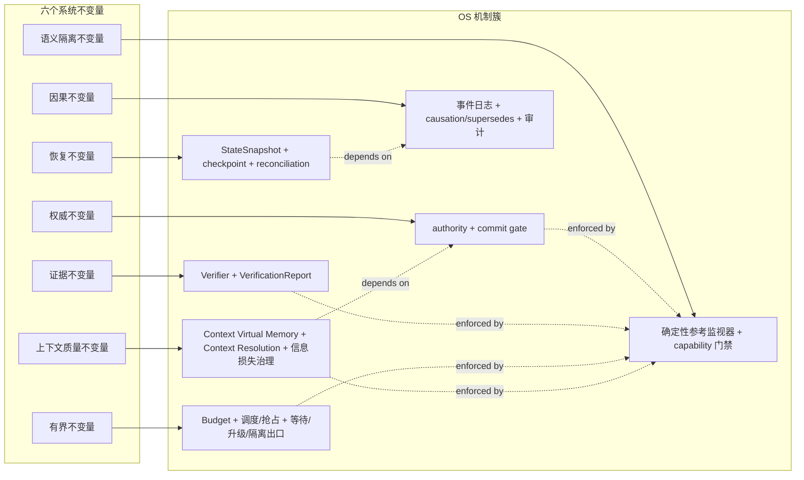
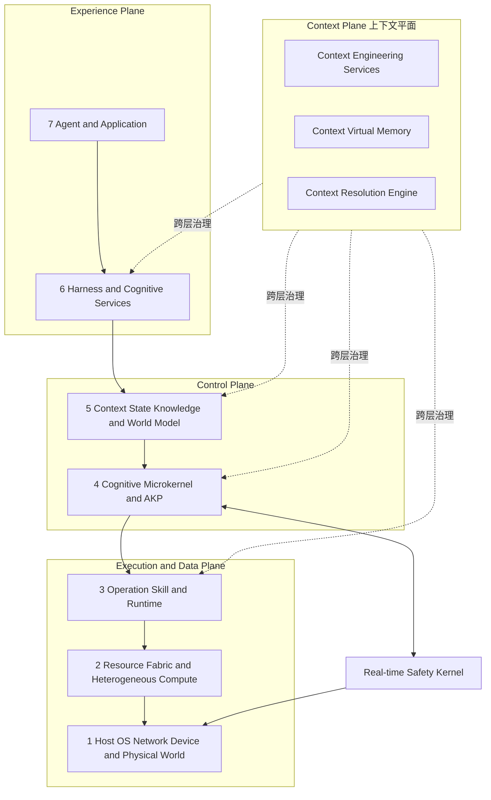
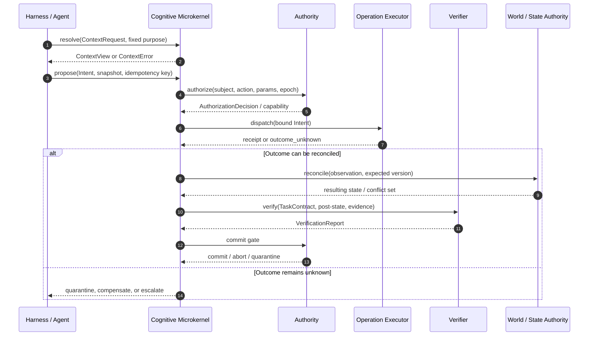
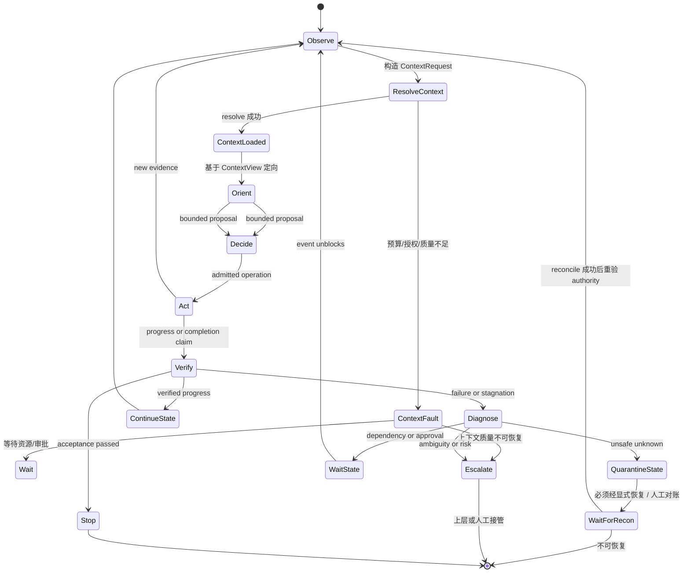
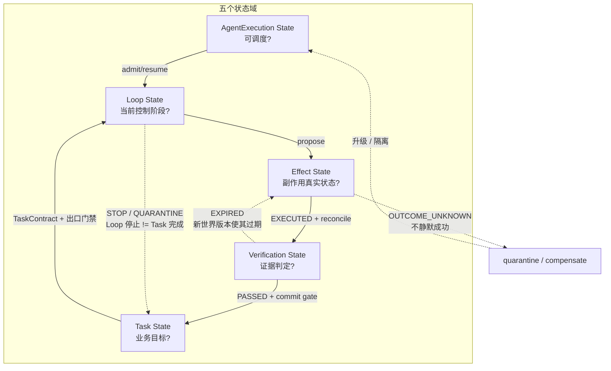
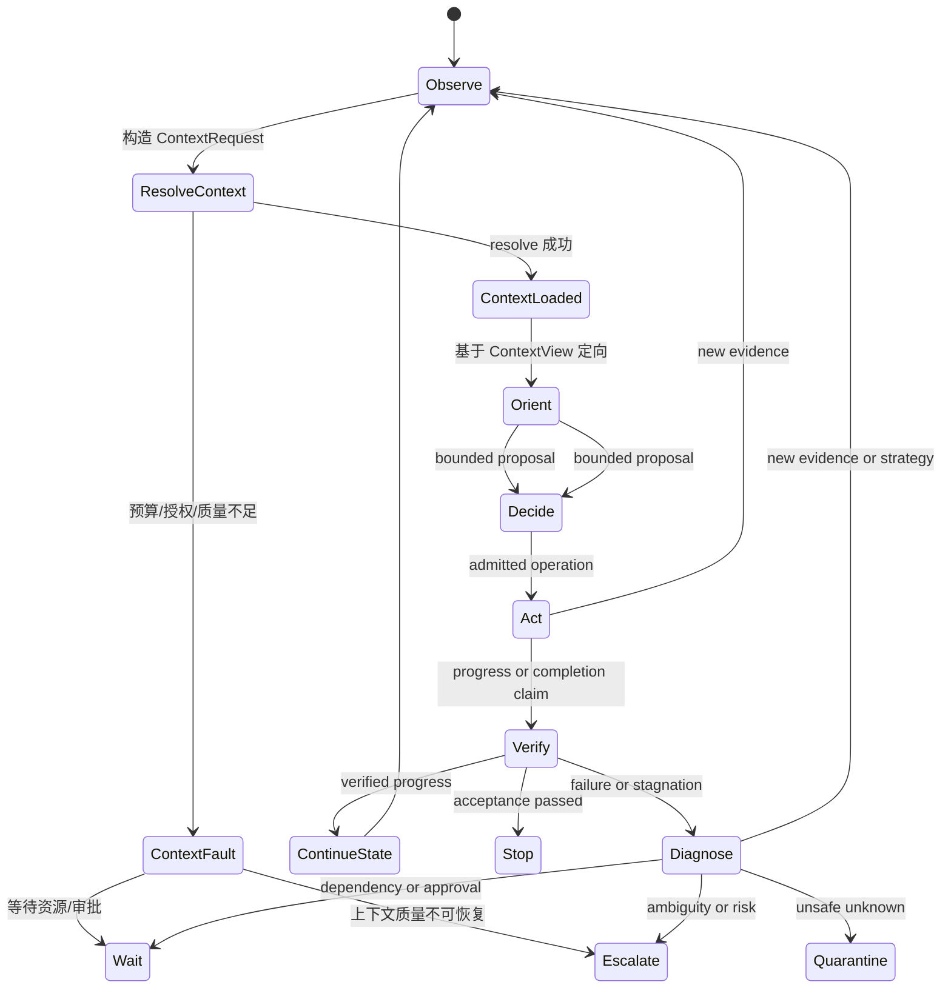
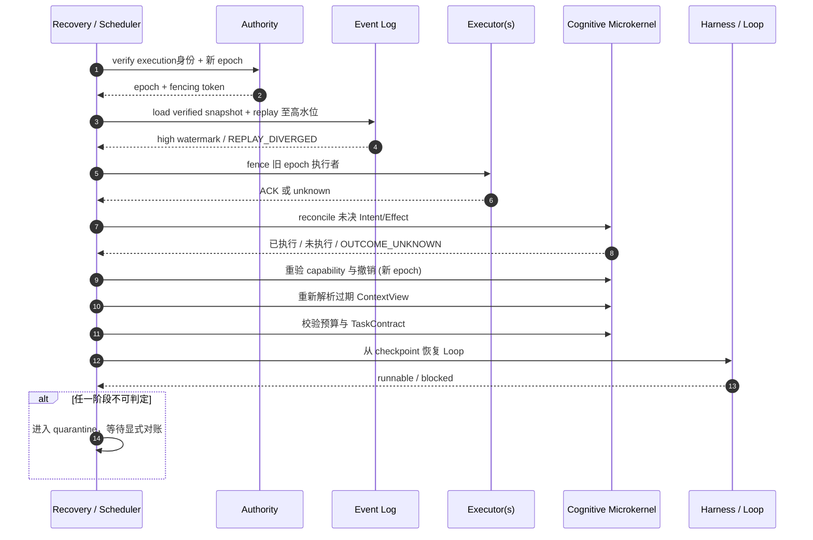

# AgentOS：面向自主智能体的认知—物理操作系统
## ——基于第一性原理与上下文工程的架构重构
- **版本**：0.4 Draft-Reconstructed
- **上一版本**：0.2 Draft（见附录 D）
- **状态**：总体架构白皮书（重构版）
- **发布日期**：2026-07-18
- **语言**：中文
- **文档性质**：Informative Architecture Whitepaper
- **适用对象**：Agent 平台、自治系统、机器人、边缘智能与异构计算架构师
- **配套资产**：本仓库的 [规范套件](./specs/)、[符合性向量](./conformance/) 与 [requirements/registries](./specs/registry/) 给出可机器校验的规范性细节
> 本文解释 AgentOS 的问题边界、总体结构、关键抽象与演进方向。
> 本文不直接定义一致性义务。
> 规范性对象、状态机、线协议、错误码与测试要求由规范套件给出。

> **阅读提示**：本文的“架构机制”描述可验证边界与责任划分，不代表某一实现已经具备这些能力；实现状态、适用 Profile、降级项和测试证据必须以其机器可读 manifest 为准。
---


## 重构声明

本文档在 v0.3 基础上进行**架构级重构**，核心变化如下：

1. **第一性原理贯穿**：将“稀缺资源约束优化”从第 2 节的背景论述，提升为贯穿全文的架构设计第一性原则。所有机制（状态、授权、Effect、资源）均明确回指其服务的稀缺资源类型。
2. **Context Engineering 核心化**：将 Context Virtual Memory 从第 8 节扩展为**Context Engineering 体系**（涵盖上下文生命周期、质量工程、信息损失治理、注意力预算），并将其定位为与“持久认知进程”并列的 OS 核心抽象。
3. **新增“认知经济学”框架**：引入注意力市场、上下文成本核算、信息价值密度等概念，使 AgentOS 的资源治理从“限制消耗”升级为“优化配置”。
4. **架构图重构**：七层架构中明确注入 Context Plane（上下文平面），与三平面形成“3+1”治理视角。
5. **Loop Engineering 深化**：将 OODA 循环重构为“上下文驱动的受控循环”，明确每个阶段的上下文转换契约。

---
<a id="toc"></a>
## 目录

- [0. 执行摘要](#0-执行摘要)
- [1. 文档定位与规范地图](#1-文档定位与规范地图)
  - [1.2 规范套件索引](#12-规范套件索引) · [1.3 适用范围](#13-适用范围) · [1.4 明确非目标](#14-明确非目标) · [1.5 保证边界与架构假设](#15-保证边界与架构假设)
- [2. 第一性原理：稀缺资源下的约束优化](#2-第一性原理稀缺资源下的约束优化)
- [3. 严格 OS 判据与系统边界](#3-严格-os-判据与系统边界)
- [4. 总体架构：双内核、三平面、七层](#4-总体架构双内核三平面七层)
  - [4.6 受治理改变的参考主链路](#46-受治理改变的参考主链路)
- [5. 持久认知进程模型](#5-持久认知进程模型)
  - [5.2 五个分离的状态域](#52-五个分离的状态域) · [5.6 所有权与故障域](#56-所有权与故障域)
- [6. 认知微内核](#6-认知微内核)
- [7. 世界状态、事件与 authority](#7-世界状态事件与-authority)（`state-protocol`）
- [8. Context Virtual Memory 与 Context Resolution](#8-context-virtual-memory-与-context-resolution)（`context-resolution-protocol`、`context-engineering`、`context-virtualization-profile`）
- [9. Harness 与 Loop Engineering](#9-harness-与-loop-engineering)
- [10. AKP：Agent Kernel Protocol](#10-akpagent-kernel-protocol)
- [11. OperationDescriptor 与 AuthorizationCapability](#11-operationdescriptor-与-authorizationcapability)（`capability-protocol`、`core-effect-protocol`）
- [12. 慢认知、技能与硬实时回路](#12-慢认知技能与硬实时回路)
- [13. ResourceGraph、数据驻留与异构计算](#13-resourcegraph数据驻留与异构计算)（`resources`）
- [14. 多 Agent 架构](#14-多-agent-架构)
- [15. 故障模型、分布式一致性与恢复](#15-故障模型分布式一致性与恢复)
- [16. 纵深安全](#16-纵深安全)（`threats`）
- [17. 持续学习与系统演进](#17-持续学习与系统演进)
- [18. 可观测性、评估与符合性](#18-可观测性评估与符合性)
- [19. 参考部署形态](#19-参考部署形态)（`core-digital-profile`、`distributed-profile`、`embodied-safety-profile`、`controlled-learning-profile`）
  - [19.5 风险分级与最小部署基线](#195-风险分级与最小部署基线)
- [20. 路线图](#20-路线图)
- [21. 开放研究问题](#21-开放研究问题)
- [22. 架构决策摘要](#22-架构决策摘要)
- [23. 结论](#23-结论)
- [附录 A：核心术语](#附录-a核心术语) · [附录 B：规范套件导航](#附录-b规范套件导航) · [附录 C：参考资料与证据等级](#附录-c参考资料与证据等级) · [附录 D：版本说明](#附录-d版本说明)

### 读者路线图

不同读者可按下列入口顺序快速定位关心的章节；后续章节按交叉引用回溯即可。

| 读者角色 | 推荐起点 | 第一目标 | 第二目标 |
|---|---|---|---|
| 平台/系统架构师 | §0、§2、§3 | 弄清 AgentOS 之所以称为 OS 的判据与边界 | §4（双内核/三平面/七层）、§22（架构决策摘要） |
| 实现者 / 内核开发者 | §6、§7、§11、§10 | 拿到对象/状态/授权/Effect 的最小骨架与 AKP 协议面 | §5（持久认知进程）、§15（恢复顺序）、对应 Profile 章节 |
| 安全 / 审计负责人 | §16、§9.7、§18.6 | 看清威胁模型、八道防线与 Readiness Case 模板 | §11（授权）、§15.1（故障模型保证边界）、`threats` 锚点附近 |
| 具身 / 异构 / 边缘部署负责人 | §12、§13、§19.3、§19.5 | 在三时间尺度、ResourceGraph 与风险分级中找到本部署基线 | §19.4（资源受限设备裁剪）、Embodied/Heterogeneous companion、§18.4 符合性层级 |
| 多 Agent / 分布式协作负责人 | §14、§15、§10.5 | 看清委派契约、分区与分布式一致性策略 | §19.2（企业多租户）、Distributed companion |
| 持续学习 / 上线负责人 | §17、§18.6 | 拿到受控发布流水线与 Readiness Case | Learning companion、§17.6（可回滚演进） |

---


AgentOS 面向一种根本性的计算范式转移：**从“函数调用”到“目标驱动的持续认知”**。

传统操作系统管理的是确定性资源（CPU 周期、内存页、IO 带宽）。自主智能体系统管理的却是**本质稀缺的认知资源**——注意力容量、可信上下文的新鲜度、决策时间窗口、验证带宽、跨主体协调成本，以及组织信任本身。这些资源无法通过简单扩容解决：模型的上下文窗口无论多大，其**可靠利用的信息量**始终有限；算力无论多强，**可验证的决策时间**始终受外部世界约束。

AgentOS 的核心命题因此是：

> **在注意力、时间、证据、信任与物理能量等多重稀缺约束下，通过上下文工程与确定性治理机制，将开放式语义推理转化为可验证、可恢复、可审计的控制循环。**

这一命题导出 AgentOS 的五大架构支柱：

| 支柱 | 第一性原理 | 核心机制 | 治理对象 |
|------|-----------|---------|---------|
| **持久认知进程** | 身份与连续性在跨会话、跨节点、跨模型迁移中是稀缺的 | AgentExecution、五域状态分离、Checkpoint | 逻辑身份、执行连续性 |
| **上下文工程** | 注意力与可信上下文是最稀缺的认知资源 | Context Virtual Memory、Context Resolution、信息损失治理 | 注意力预算、上下文质量、信息价值密度 |
| **权威与状态治理** | 世界真相与系统承诺在分布式、部分可观测环境中是稀缺的 | Authority 仲裁、事件日志、World State 投影、CAS | 状态一致性、因果完整性 |
| **授权与 Effect 协议** | 信任与授权窗口是稀缺且易耗的 | Capability、Intent/Effect 状态机、Verifier | 安全边界、副作用可控性 |
| **资源与异构计算** | 数据移动能量、验证带宽和实时确定性是稀缺的 | ResourceGraph、双内核、CIM 误差调度 | 计算能效、物理安全 |

**本文最重要的语义立场**：

> **事件日志是 AgentOS 内部提交历史的权威因果记录；当前 World State 由该状态域声明的 authority 仲裁；而 ContextView 是认知进程在特定时刻的受约束工作投影。三者不可互相替代。**

> **上下文不是“给模型的输入材料”，而是经过 purpose、权限、预算、新鲜度和质量工程治理的稀缺认知资源。Context Engineering 与 State Engineering 同等重要。**


## 1. 文档定位与规范地图
### 1.1 白皮书而非单体 RFC
本文是总体架构白皮书。 它描述设计理由、概念关系、参考分解和工程取舍。 它有意避免在主文档中复制全部字段、状态迁移和符合性条款。
大写规范词若在被链接的规范中出现，应依 RFC 2119 与 RFC 8174 解释。 本文中的“必须”“应当”“可以”主要表达架构判断，不独立构成符合性要求。
### 1.2 规范套件索引
规范性细节按主题分布：
[Core 规范索引](./specs/core/README.md)：对象、状态、上下文、事件、授权、副作用、恢复与基础错误语义；[AKP 规范](./specs/akp/README.md)：Agent Kernel Protocol 的对象交互、会话、协商与传输映射；[分布式 Profile](./specs/distributed/README.md)：租约、epoch、fencing、分区、复制与跨域 authority；[具身 Profile](./specs/embodied/README.md)：安全域、技能包络、实时回路、急停和设备语义；[异构计算 Profile](./specs/heterogeneous/README.md)：ResourceGraph、放置、数据驻留、CIM 与编译栈；[持续学习 Profile](./specs/learning/README.md)：候选、评估、发布、回滚和生产隔离；[符合性索引](./conformance/README.md)：测试层级、profile manifest、互操作与证据格式。
白皮书与规范发生歧义时，以被实现声明固定版本和摘要的规范文本为准。 外部协议符合性不能替代 AgentOS 自身的符合性要求。
本文档在相关章节起点以隐式 HTML 锚点（`<a id="..."/>`）固定 `state-protocol`、`context-resolution-protocol`、`context-engineering`、`context-virtualization-profile`、`capability-protocol`、`core-effect-protocol`、`resources`、`threats`、`core-digital-profile`、`distributed-profile`、`embodied-safety-profile`、`controlled-learning-profile` 等 slug，与 [specs/registry/requirements.yaml](./specs/registry/requirements.yaml) 的 `owner_spec` 字段逐一对齐；下表"规范性落点"列同时给出主题锚点便于检索。

| 评审问题 | 本文主入口 | 规范性落点 |
|---|---|---|
| 什么是受管执行，如何恢复？ | 第 5、9、15 节 | Core |
| 谁能读、写、提交和验收？ | 第 7、11、16 节 | Core、Distributed |
| 语义提议如何变成可验证改变？ | 第 4.6、9、11 节 | Core、AKP |
| 上下文如何在安全与预算下装入？ | 第 8 节 | Core |
| 如何跨进程、节点和外部协议互操作？ | 第 10、14、15 节 | AKP、Distributed |
| 如何进入物理执行和异构硬件？ | 第 12、13 节 | Embodied、Heterogeneous |
| 如何学习、上线并证明系统状态？ | 第 17、18 节 | Learning、Conformance |

Profile 状态字段由 [specs/schemas/profile-manifest.schema.json](./specs/schemas/profile-manifest.schema.json) 定义为 `implemented`、`planned`、`experimental` 或 `unsupported`；下列"本文锚点/章节"应在规范发生矛盾时以被实现固定的 companion 文本为准。

| Profile 名 | Companion spec | Companion 版本/状态 | 本文档主章节 | 关键 REQ-ID | 典型风险等级 |
|---|---|---|---|---|---|
| `core_digital` | [specs/core/README.md](./specs/core/README.md) | v0.2 Draft / Companion | §5、§6、§7、§8、§9、§11、§19.1 | `REQ-PROFILE-CORE-001`、`REQ-CHARTER-*`、`REQ-OBJ-*`、`REQ-STATE-*`、`REQ-CTX-*`、`REQ-EFF-*`、`REQ-RUN-*` | R0—R2 |
| `context_virtualization` | [specs/core/README.md](./specs/core/README.md) | v0.2 Draft / Companion | §8（`context-virtualization-profile`、`context-engineering`） | `REQ-CTX-001`–`REQ-CTX-011` | R0—R2 |
| `harnessed_autonomous_execution` | [specs/core/README.md](./specs/core/README.md) | v0.2 Draft / Companion | §5、§9、§18.2 | `REQ-RUN-001`–`REQ-RUN-009`、`REQ-PROFILE-HARNESS-001/002` | R1—R3 |
| `akp`（协议面） | [specs/akp/README.md](./specs/akp/README.md) | v0.2 Draft / Companion | §10 | `REQ-AKP-ENV-*`、`REQ-AKP-RES-*`、`REQ-GW-*` | 全部 Profile |
| `distributed` | [specs/distributed/README.md](./specs/distributed/README.md) | v0.2 Draft / Companion | §14、§15（`distributed-profile`） | `REQ-PROFILE-DIST-001`、`REQ-DIST-*`、`REQ-CAP-003` | R1—R3 |
| `embodied_safety` | [specs/embodied/README.md](./specs/embodied/README.md) | v0.2 Draft / Companion | §12、§15.1、§19.3、§19.5（`embodied-safety-profile`） | `REQ-PROFILE-EMB-001`、`REQ-EMB-*`、`REQ-EFF-007` | R3 |
| `heterogeneous_cim` | [specs/heterogeneous/README.md](./specs/heterogeneous/README.md) | v0.2 Draft / Companion | §13（`resources`）、§19.3 | `REQ-PROFILE-HET-001`、`REQ-HET-*` | R2—R3（含硬件认证） |
| `controlled_learning` | [specs/learning/README.md](./specs/learning/README.md) | v0.2 Draft / Companion | §17、§18.6（`controlled-learning-profile`） | `REQ-PROFILE-LEARN-001`、`REQ-LEARN-*` | R1—R3（生产改写） |

白皮书与任一 companion 发生歧义时，以被实现声明固定版本和摘要的规范文本为准（与上文 §1.2 一致）。

### 1.3 适用范围
AgentOS 可用于：
长时运行的软件工程 Agent；企业流程和知识工作 Agent；多 Agent 协作平台；机器人、无人系统与智能设备；边缘—云协同自治系统；GPU、NPU、FPGA、CIM 等异构智能计算平台。
它不要求使用 LLM。 确定性控制器、符号规划器、感知模型和人工活动都可成为受管 Activity。
### 1.4 明确非目标
AgentOS 不替代：
宿主 OS 的进程隔离、虚拟内存、驱动和设备保护；数据库的事务、索引和持久化实现；消息系统的传输与复制机制；Kubernetes 等基础设施编排；MCP、A2A 等外部互操作协议；行业功能安全、隐私和合规认证；模型、规划器、检索器或技能算法本身。
AgentOS 也不声称给出通用智能的实现理论。 它关注的是智能活动如何成为可治理、可恢复、可组合的系统负载。

### 1.5 保证边界与架构假设
AgentOS 的价值在于将不确定活动置于明确的控制边界，而不是承诺模型、工具或物理世界永远正确。 任何部署在声明能力时都应将下列条件写入其 Profile manifest：

| 范畴 | AgentOS 可提供的机制 | 部署仍须证明或接受的边界 |
|---|---|---|
| 语义正确性 | 固定输入、候选隔离、验证与证据闭合 | 模型或 verifier 仍可能误判；不能由架构名称推出任务正确性 |
| 外部效果 | Intent、幂等键、对账、补偿与隔离 | 不可查询、不可幂等、不可补偿的执行器只能受限使用，不能承诺 exactly-once |
| 分布式一致性 | authority、lease、epoch、fencing、冲突保留 | 一致性只在声明的状态域、故障假设和时钟边界内成立 |
| 安全与隐私 | capability、信息流门禁、审计与独立安全域 | 需结合身份根、密钥、沙箱、数据政策和人工流程；合规认证另行取得 |
| 具身安全 | 双内核、技能契约、watchdog 与安全态 | 不替代 hazard analysis、实时证明、设备认证或行业功能安全标准 |
| 可用性与性能 | 预算、降级、恢复和可观测性 | RPO、RTO、SLO、吞吐、时延、能效和成本均为部署/Profile 声明 |

本文假设至少存在一个可认证的 authority 根、持久化的提交历史或等价机制、可执行本地门禁的可信执行路径，以及在高风险场景中独立于普通认知回路的停止/隔离路径。 缺少这些前提的系统可以复用 AgentOS 的对象模型，但不应宣称具备相应的治理或安全保证。
---
## 2. 第一性原理：稀缺资源下的约束优化
### 2.1 基本问题的重表述

自主智能体是一个**在多重稀缺约束下的序列决策系统**。其根本困难不在于“如何变得更聪明”，而在于**如何在认知资源严格受限的条件下，持续做出足够好的决策，并在失败时可恢复**。

AgentOS 的目标函数因此必须显式包含上下文与注意力维度：

```text
maximize   E[U(outcome)] + λI·InformationGain + λR·Recoverability + λQ·ContextQuality
           - λC·Cost - λL·Latency - λE·Energy - λD·MaintenanceDebt - λA·AttentionWaste
subject to SafetyEnvelope, Authorization, Deadline, Residency,
           Consistency, Verification, ContextBudget, TrustBudget and ResourceBudget
```

其中新增关键项：
- **λQ·ContextQuality**：上下文质量（相关性、freshness、冲突显式化、注入抵抗）对任务效用的边际贡献
- **λA·AttentionWaste**：注意力浪费（无关信息过载、重复加载、错误优先级）的惩罚项
### 2.2 真正稀缺的资源（深化版）

Agent 系统至少管理以下十二种稀缺资源，其中**上下文与注意力**是最核心且最常被忽视的：

| 稀缺资源 | 本质约束 | 传统 OS 对应 | AgentOS 治理机制 |
|---------|---------|-----------|---------------|
| **注意力容量** | 单次语义活动能可靠利用的信息量有硬上限（与模型架构相关，但与窗口大小无关） | 无直接对应 | **Context Virtual Memory**、注意力预算、工作集管理 |
| **可信上下文** | 新鲜、相关、可授权、有来源、无冲突的信息极度稀缺 | 虚拟内存（容量导向） | **Context Resolution**、信息损失治理、来源谱系 |
| **上下文装入成本** | 每次上下文构建涉及检索、排序、授权、渲染、审计，消耗 Token 与时间 | 页面换入/换出 | **Context Page Fault**、预取策略、pin/eviction |
| **决策时间** | 机会窗口、外部 SLA 和控制周期有限 | 调度时间片 | Harness Loop、deadline、抢占、升级出口 |
| **计算与 Token** | 本地和远端推理都有容量与费用 | CPU 配额 | 预算、调度、HIF 路由 |
| **数据移动** | 跨节点、跨租户、跨边缘—云移动有延迟、能耗和合规成本 | IO 带宽 | ResourceGraph、驻留感知放置 |
| **物理能量** | 电池、热设计功耗和执行器余量有限 | 电源管理 | 能效调度、CIM 误差预算 |
| **风险预算** | 某些试错不可逆，不能靠重试摊平 | 无 | 风险分级、quarantine、安全包络 |
| **授权窗口** | 能力会过期、撤销并受参数范围限制 | 访问令牌 | Capability、lease、epoch、fencing |
| **验证带宽** | 独立 verifier、人工审批和真实环境测试都昂贵 | 无 | Verifier 队列、人工 gate、证据闭合 |
| **协调带宽** | 多 Agent 通信引入等待、冲突和认知税 | 进程间通信 | 委派契约、AKP、事件日志 |
| **组织信任** | 每一次越权、伪完成或不可解释操作都消耗信任，且难以恢复 | 无 | 审计、归因、Readiness Case、透明性 |
### 2.3 七个系统不变量（深化版）
由上述约束可导出六个不变量：
1. **权威不变量**：观察、建议、授权、执行和验收必须可区分；
2. **因果不变量**：受治理改变必须可回溯到前态、主体、目的、授权、证据和后态；
3. **证据不变量**：完成由验收证据建立，不由模型自述或工具回执建立；
4. **有界不变量**：每个循环都有预算、等待、升级、停止或隔离出口；
5. **恢复不变量**：恢复依赖持久对象和对账，不依赖丢失的模型隐藏态；
6. **语义隔离不变量**：概率组件提出候选，确定性机制执行安全门禁。
7. **上下文质量不变量（新增）**：上下文必须经过 purpose、权限、预算和 freshness 的显式治理；信息损失必须可声明、可审计；不可信输入不得隐式覆盖控制面
### 2.4 从不变量到操作系统机制（重构映射图）
这些不变量要求长期存在的公共机制：
稳定身份与生命周期；authority 和版本化状态；受保护的上下文地址空间；调度、预算与抢占；授权、撤销和委派；副作用事务与恢复；事件、审计和因果追踪；设备与异构资源抽象；隔离、故障处理和安全仲裁。
这正是 AgentOS 被称为“操作系统”的第一性依据。

不变量与机制之间不是松散对应，而是有可验证的边界关系。 下图把六个不变量映射到承载它们的机制簇，并标出每个机制的确定性强制执行点。



不变量、机制与其确定性强制执行点之间的对照关系如下表所示；策略层（模型、规划、检索、排序、placement 目标等）可在不变量约束内演进，但不允许下放这些机制本身。

| 不变量 | 承载机制 | 确定性强制执行点 | 内核外可演进策略 |
|---|---|---|---|
| 权威 | authority 注册、版本、fencing、commit gate | 目标状态域 commit gate、CAS 失败返回 `STATE_CONFLICT` | 选择 consensus 协议、仲裁组规模、人工审批阈值 |
| 因果 | 事件日志、`causation`/`supersedes`、审计链 | 追加式事件、不可变 Event、提交历史 digest | 日志后端、partition 选择、保留窗口 |
| 证据 | Verifier、VerificationReport、EpisodePackage | 后置条件 verifier 对固定后态绑定；`VERIFY_FAILED` 不能改写为 `COMMITTED` | grader/verifier 模型、人工审批路径、阈值 |
| 有界 | AttentionBudget、调度、抢占、等待/升级/隔离出口 | hard 预算在准入与消耗点由确定性机制执行 | 调度算法（EDF、Rate Monotonic 等）、优先级权重 |
| 恢复 | StateSnapshot、checkpoint、reconciliation | 旧 epoch fence、`RECONCILIATION_REQUIRED`/`QUARANTINED` 强制出口 | checkpoint 频率、快照压缩策略 |
| 语义隔离 | 确定性参考监视器、capability 门禁 | schema/digest 校验、capability 适用性判定、`AUTH_DENIED` fail-closed | 模型选择、规划器、检索排序目标 |

---
## 3. 严格 OS 判据与系统边界
### 3.1 严格 OS 判据
一个系统只有同时满足以下判据，才有充分理由被称为 Agent OS，而不只是 Agent 框架：
1. **虚拟化**：把有限认知、上下文和异构资源抽象为稳定接口；
2. **保护**：隔离主体、状态域、敏感数据和副作用权限；
3. **并发**：调度多个持久执行、活动和实时回路；
4. **持久性**：在进程、模型会话和节点失效后恢复逻辑身份；
5. **资源治理**：计量并约束时间、Token、费用、数据、能量和风险；
6. **设备中介**：通过受描述、受授权的操作访问数字或物理设备；
7. **故障语义**：定义取消、超时、重复、未知结果、补偿和隔离；
8. **公共系统调用面**：为上层 Agent 提供稳定的机制接口；
9. **可观察一致性**：实现可以不同，但外部可测试语义稳定；
10. **安全参考监视器**：关键边界不可由普通语义活动绕过。
仅提供 Prompt 模板、工具路由、记忆检索或多 Agent 对话，不满足这些判据。 仅把已有框架重命名为 kernel，也不满足这些判据。
### 3.2 与宿主 OS 的边界
宿主 OS 管理：
CPU 线程与进程；页表和物理内存；文件、socket 与设备驱动；用户、内核权限和硬件保护；系统时钟、中断和本地调度。
AgentOS 复用这些能力，不复制它们。 它在宿主 OS 之上管理更高层的认知对象和治理语义。
`AgentExecution` 不必对应常驻进程。 一个持久执行可以先后映射到多个进程、容器、节点、模型和人工参与者。 宿主 PID 只是瞬时执行载体，不是认知进程身份。
### 3.3 与 Agent Runtime 的边界
Agent Runtime 通常负责：
调用模型；渲染消息；调用工具；保存会话；实现某种规划或反思循环。
AgentOS 则负责：
哪个状态可作为当前权威状态；上下文如何按目的、权限和预算解析；哪个主体可执行哪种跨边界操作；副作用怎样持久化、对账、验证和提交；长期执行怎样 checkpoint、迁移和恢复；多种 Runtime 怎样共享一致治理语义。
Runtime 是可替换的策略与执行提供者。 它可以嵌入 AgentOS，也可以通过 AKP 远程接入。 它不因持有 Prompt 或模型连接而获得状态 authority。
### 3.4 与工作流、数据库和消息系统的边界
工作流引擎适合确定性编排和等待。 数据库适合事务与查询。 事件日志适合追加历史和消费游标。 消息系统适合投递与背压。
AgentOS 不重新发明这些基础设施。 它规定这些设施共同承载的认知对象、授权边界和恢复语义。
### 3.5 与 MCP、A2A 的边界
MCP 和 A2A 是互操作协议，不是本地安全内核。
endpoint 宣称支持某个工具，不等于调用者被授权；Agent Card 宣称某项 skill，不等于结果真实；远端 Task 显示 completed，不等于本地验收通过；OAuth scope 或协议 feature，不自动成为本地 AuthorizationCapability；外部 artifact 必须作为不可信输入，经本地 schema、数据和验收门禁处理。
---
## 4. 总体架构：双内核、三平面、七层
### 4.1 架构总览


三平面是治理视角。 七层是责任分解。 双内核是时间与安全隔离结构。 它们描述同一系统，不是三套竞争架构。

**关键重构**：引入 **Context Plane（上下文平面）** 作为跨层治理维度。上下文不是某一层的功能，而是贯穿体验、控制、执行三层的基础服务。Context Plane 通过 Context Virtual Memory、Resolution Engine 和 Quality Governance，为每一层的认知活动提供受约束的工作视图。
### 4.2 双内核
双内核包括：
- **认知微内核**：处理持久认知进程、上下文、状态、授权、事件、副作用和资源契约；
- **实时安全内核**：处理硬实时控制、安全包络、watchdog、急停和最终执行器仲裁。
认知微内核允许语义不确定性和较长延迟。 实时安全内核要求确定性、可分析的时限和独立失效路径。
认知输出进入物理域时是建议或有界 setpoint。 最终执行权属于实时安全内核和设备安全机制。

**新增**：认知微内核内部，**Context Resolution 与 Capability 校验、CAS、事件提交并列为核心机制**。上下文解析不是“数据准备工作”，而是受保护的内核服务。
### 4.3 三平面 → 3+1 治理视角
**体验平面**面向用户、Agent 和应用：
表达目标与 TaskContract；展示进度、证据和解释；处理人工介入与审批；提供领域 Agent 和协作体验。
**控制平面**维护治理和决策机制：
authority、策略和身份；Context Resolution；调度、预算和放置；capability 签发与撤销；任务、世界模型和一致性控制。
**执行与数据平面**实施活动和数据移动：
模型推理、工具和技能；事件与对象存取；网络、加速器和设备；实时控制和物理执行。
平面可以共进程部署，也可以跨边缘和云分布。 分平面是责任边界，不强制网络拓扑。
### 4.4 七层（重构说明）

各层增加 Context Engineering 职责：

#### 第一层：宿主、网络、设备与物理世界
提供宿主 OS、容器、存储、网络、传感器、执行器和可信硬件。它是故障、时间、能量和真实世界约束的来源。传感器数据作为上下文证据的来源，受 freshness 和校准治理。

#### 第二层：资源织构与异构计算
把 CPU、GPU、NPU、FPGA、CIM、边缘节点和远端服务表示为 ResourceGraph。负责发现、遥测、数据路径、驻留和放置执行。ResourceGraph 包含上下文传输成本（带宽、延迟、驻留）。

#### 第三层：操作、技能与运行时
承载确定性函数、语义模型、工具适配器、领域技能和设备驱动代理。OperationDescriptor 在这一层描述“能做什么”，并声明上下文消耗特征（schema 大小、状态读取范围）。

#### 第四层：认知微内核与 AKP
提供最小可信机制：身份、状态域、事件、上下文、授权、副作用、预算、checkpoint 和审计。AKP 是这些机制的协议面。提供 `resolve()`、`pin()`、`fault()` 等上下文系统调用。

#### 第五层：上下文、状态、知识与世界模型
维护对象、记忆、知识、World State 投影、Context Resolution 和冲突集。这一层组织事实与证据，是 **Context Resolution 发生的主要场所**，但不自行获得未声明的 authority。

#### 第六层：Harness 与认知服务
实现任务契约、Loop、规划、验证、失败归因、模型路由、交接和 Episode evidence。Harness 组合机制与策略，管理 ContextRequest 生命周期，实施注意力预算。

#### 第七层：Agent 与应用
表达领域目标、角色、交互和业务体验。它可以是单 Agent、多 Agent、工作流或人机团队。表达目标的同时声明 Context 需求（purpose、perspective、budget）。
### 4.5 跨层原则
上层表达意图，下层实施受约束机制；数据向上成为观察，控制向下成为受授权操作；每次跨 authority 都重新认证和授权；每个关键决定都能关联版本、预算和证据；任何层都不能把 feature 声明提升为权限；安全域可拒绝来自任何上层的操作。

### 4.6 受治理改变的参考主链路
下图不是唯一部署拓扑，而是一次跨边界、可恢复改变的最小因果关系。 它刻意把“模型给出建议”“执行器收到请求”“任务被接受”分成三个不同事实；任一事实都不能隐式替代另一个。



这条链路允许把 `K`、`A`、`X`、`V` 和 `W` 部署在同一进程或多个信任域，但不允许省略其责任。 对纯局部、短暂且无受治理影响的计算，`Intent`、授权或提交可被裁剪；一旦跨越持久化、authority、敏感数据或外部效果边界，完整链路重新适用。

**上下文平面（新增）**治理注意力、信息质量与认知成本：
上下文如何按 purpose、权限、预算装入？信息损失如何治理？

**信任域部署变体**：在单进程嵌入式部署（§19.1）中，`K`、`A`、`X`、`V`、`W` 可压缩为同一进程内的本地组件调用，但五个责任必须保留为可区分接口，不能融合为单一函数。 在分布式部署（§19.2、§19.3）中，`A` 与 `W` 可以分别置于共识组与设备本地，`X` 可以位于远端执行器，`V` 可以位于独立 verifier 域，五者通过 AKP（§10）与 fencing 完成 hop-by-hop 重新认证与授权。 无论压缩或拆分，§19.4 的资源受限设备裁剪原则同样适用：可裁剪的是组件实例化深度，不是责任边界。
---
## 5. 持久认知进程模型
### 5.1 AgentExecution：逻辑进程身份
`AgentExecution` 是 AgentOS 中最接近传统 OS 进程的抽象。 它是跨重启、模型切换、调度片、节点迁移和人机交接仍保持稳定的逻辑执行身份。
它包含或引用：
principal 与所属租户；当前 Task 和 Episode；预算、优先级与 deadline；capability 引用和撤销 epoch；continuation 与 checkpoint；已消费事件高水位；未决 Effect；固定的策略、schema 和环境版本；终止、等待、迁移和隔离状态。
  当前 ContextView 引用与版本
  注意力预算余额与消耗历史
  上下文工作集（pinned/working/evictable）
  未决 Context Page Fault 队列
AgentExecution 不保存必须公开的模型思维链。 可恢复性来自行动级事实、对象引用和控制状态。 模型隐藏态可以作为不保证可移植的缓存，但不能成为唯一恢复依据。
### 5.2 五个分离的状态域
旧式 Agent 实现常把“任务正在运行”塞进一个枚举。 这会混淆身份、业务进度、控制循环、外部效果和验收事实。 AgentOS 明确分离五个正交状态域。
#### AgentExecution State
回答逻辑执行主体是否可被调度：
```text
CREATED -> ADMITTED -> RUNNABLE <-> WAITING
RUNNABLE -> CHECKPOINTED -> RECOVERING -> RUNNABLE
RUNNABLE -> SUSPENDED | TERMINATED | QUARANTINED
```
它不表示任务已经完成，也不表示某个副作用成功。
#### Task State
回答业务目标的生命周期：
```text
DRAFT -> READY -> ACTIVE -> BLOCKED
ACTIVE -> CANDIDATE_COMPLETE -> ACCEPTED
ACTIVE -> FAILED | CANCELLED | ESCALATED
```
只有验收 authority 可以把候选完成推进为 `ACCEPTED`。
#### Loop State
回答当前控制循环处于哪个阶段：
```text
OBSERVE -> ORIENT -> DECIDE -> ACT -> VERIFY
VERIFY -> CONTINUE | WAIT | STOP | ESCALATE | QUARANTINE
```
Loop 可以停止而 Task 仍处于 BLOCKED。 Task 也可以被外部 authority 接受，而某个旧 Loop 已经终止。

下图补齐文本中易被漏画的等待、升级与隔离出口，并显式区分每条出口的去向：`WAIT` 在等待依赖时由外部事件解除；`ESCALATE` 进入人工或上层 authority；`QUARANTINE` 不允许通过继续 `Continuous` 状态静默回跳到 `Observe`，必须经过显式恢复或人工对账才能重新进入 `Observe`。




**关键约束**：
- 从 `Observe` 到 `Orient` 必须经过 `ResolveContext`，不能基于过期的 ContextView 做决策
- `ContextFault` 是正常状态，不是错误。Harness 必须定义 fault 处理策略（等待、降级、升级、quarantine）
- `Verify` 阶段必须使用与 `Decide` 阶段**隔离的 ContextView**，防止验证条件在验证过程中被篡改

`ContinueState`、`WaitState`、`QuarantineState` 加后缀 `State` 只是为了避免与前面正文 `CONTINUE`、`WAIT`、`QUARANTINE` 等命名在渲染器上歧义；本节仅描述这些到达点存在，具体 Loop 状态机的权威命名以 [Core 规范](./specs/core/README.md) 的状态机为准。 Loop 门禁不支持隐式 `QUARANTINE → OBSERVE` 直接回跳，否则会把未对账的未知结果带入下一轮 `OBSERVE`，违背 §2.3 的恢复不变量。
#### Effect State
回答单次受治理副作用的真实执行与对账状态：
```text
PROPOSED -> AUTHORIZED -> DISPATCHED -> EXECUTED
DISPATCHED -> OUTCOME_UNKNOWN
EXECUTED -> VERIFIED -> COMMITTED
EXECUTED -> VERIFY_FAILED -> COMPENSATING | QUARANTINED
```
`OUTCOME_UNKNOWN` 不是失败，也不是成功。 它要求查询、幂等重试、补偿或隔离。
#### Verification State
回答针对固定目标和固定后态的证据判定：
```text
NOT_REQUESTED -> PENDING -> EVIDENCE_READY
EVIDENCE_READY -> PASSED | FAILED | INCONCLUSIVE | EXPIRED
```
Verification 可独立过期。 例如世界状态变化后，曾经 PASSED 的报告可能不再适用于新版本。
#### Context State（新增第六个状态域）
回答当前认知进程的工作视图处于什么状态：
```text
RESOLVING -> LOADED -> PINNED -> ACTIVE -> STALE -> EVICTED -> FAULT
RESOLVING -> CONTEXT_DENIED（授权失败）
RESOLVING -> BUDGET_EXHAUSTED（预算耗尽）
RESOLVING -> QUALITY_INSUFFICIENT（质量不足）
ACTIVE -> STALE（证据过期）
ACTIVE -> CONFLICT_DETECTED（冲突检测）
```

Context State 与 Loop State 的关系：
- Loop 进入 `OBSERVE` 阶段时，触发 Context Resolution，Context State 为 `RESOLVING`
- Loop 进入 `ORIENT` 阶段时，要求 Context State 为 `LOADED` 或 `PINNED`
- Loop 在 `DECIDE` 阶段若触发新的 Context Page Fault，可能回退到 `RESOLVING` 或进入 `WAIT`
- Context State 为 `STALE` 或 `CONFLICT_DETECTED` 时，Loop 不应进入 `ACT`，应回到 `OBSERVE` 或 `DIAGNOSE`


六个状态域不是同级枚举是同级枚举，而是各自负责一类问题，并通过带原因的事件和确定性门禁协作。 下图示意五域之间的协作边，并显式标出三类容易被旧式单一状态机抹平的关系：Loop 停止不等于 Task 完成；Effect 已执行不等于已提交；Verifier `PASSED` 仍可能被新世界状态版本过期。



门禁边以原因事件表达，而不是共享模糊枚举。 任一域的状态推进都不能被另一个域的局部事实隐式完成。
### 5.3 为什么必须分离
五域分离消除以下错误：
模型 Loop 退出被误认为 Task 完成；HTTP 200 被误认为 Effect 已提交；工具回执被误认为验收通过；Task 取消后仍有旧执行者写入；验证器不可判定却把执行标为成功；恢复程序看见单个 `RUNNING` 无法判断该做什么。
状态域之间通过带原因的事件和门禁协作，而不是共享模糊枚举。
### 5.4 Episode、Activity 与 Continuation
`Episode` 是有界的因果、预算和审计范围。 一个 Task 可以跨多个 Episode。 一个 AgentExecution 也可以依次服务多个 Task，但应保留清晰关联。
`Activity` 是一次确定性或非确定性工作单元：
确定性 workflow 决策；LLM 或其他模型推理；工具调用；人工审批；verifier；传感器查询；编译与放置。
`Continuation` 保存安全续跑所需的最小控制状态。 它固定读取版本、未决 Intent、事件游标、策略版本、预算和恢复条件。
### 5.5 调度与抢占
认知调度同时面对异质资源和不同时间尺度。 可考虑：
优先级和租户公平；deadline 与松弛度；风险级别；上下文装入成本；模型冷启动和数据驻留；verifier 与人工审批容量；取消后的远端残余成本；checkpoint 与迁移成本。
具体频率、时间片、EDF、Rate Monotonic 或其他算法只是部署策略参考。 除非特定 Profile 明确规定，本文不把任何频率、周期或 EDF 选择设为通用 MUST。

### 5.6 所有权与故障域
持久身份不等于所有组件共享一个故障域。 一个可恢复的 `AgentExecution` 至少跨越执行、权威、操作、资源和人机协作五类故障域；恢复时必须逐域重新建立事实，而不是把某个进程内 `RUNNING` 标志当作全局真相。

| 故障域 | 典型失效 | 可信恢复依据 | 不可安全推断的结论 |
|---|---|---|---|
| Execution | 进程崩溃、节点迁移、模型会话丢失 | checkpoint、事件高水位、新 epoch | 远端 Activity 或 Effect 已停止 |
| Authority | 选主、租约或策略变更 | authority epoch、fencing、审计决策 | 旧 capability 仍可提交 |
| Operation | 超时、断连、重复投递、部分执行 | 幂等键、执行器查询、receipt、对账 | receipt、HTTP 2xx 或超时等于成功/失败 |
| Resource | 配额耗尽、硬件离线、校准漂移 | reservation、健康证据、ResourceGraph 版本 | 可无成本重试，或可在任意节点恢复 |
| **Context** | 上下文过期、注入、污染、质量衰减 | ContextView 版本、来源谱系、re-render | 缓存的上下文仍适用于当前 purpose |
| Human / external world | 审批撤回、人工操作、世界变化 | 新观察、签署决策、world authority 仲裁 | 旧快照仍适用于当前世界 |

这个划分还解释了为什么恢复顺序必须先 fence、再重放提交历史、再对账未决 Effect，最后才恢复认知 Loop：只有这样，策略层不会在旧执行者或未知世界状态上继续产生新的写入。
---
## 6. 认知微内核
机制与策略的分离是 AgentOS 治理基线之一（详见 §22 决策九）。 微内核只承载无法安全下放的机制，模型、规划器与检索等策略可在内核外快速演进，但只能通过受治理接口影响状态和世界。 下图集中表示这一划分。


### 6.1 最小可信计算基
认知微内核不是大而全的“智能内核”。 它应尽量小，只包含无法安全下放给不可信策略组件的机制。
核心机制包括：
principal、AgentExecution 和对象身份；authority 注册、版本与 fencing；状态快照、CAS 和冲突检测；事件提交与因果关联；Context Resolution 门禁；capability 校验、衰减和撤销；Intent/Effect 状态机；预算计量、准入、取消和隔离；checkpoint、恢复、审计和证明引用。
### 6.2 内核外策略
下列能力通常位于内核外：
模型选择与采样；规划、反思和分解；语义检索和排序；摘要与记忆提取；多 Agent 拓扑；技能内部算法；placement 优化目标；学习和策略更新。
它们可以快速演进，但只能通过受治理接口影响状态和世界。 当策略变体或部署跨越 trust domain 时，每个 hop 都必须本地重新认证和重新授权；上游 feature、远端 completed 或上游认证结果都不替代本地许可（与 §11.4 及各 companion 的 fencing/重新授权要求一致）。
### 6.3 认知系统调用
说明性的系统调用族包括：
```text
execution.create / admit / checkpoint / suspend / resume / terminate
state.snapshot / compare_exchange / propose / reconcile
context.resolve / pin / fault / release
operation.describe / bind / invoke
capability.request / attenuate / revoke / inspect
effect.prepare / dispatch / reconcile / verify / commit / abort
event.append / subscribe / acknowledge
task.create / update / candidate_complete / accept
resource.reserve / account / release
```
系统调用不要求 syscall 指令或单机 ABI。 在嵌入式部署中它们可以是函数调用。 在分布式部署中它们可以通过 AKP 传输。
### 6.4 确定性边界
以下决定应由确定性机制完成：
schema 和 digest 校验；capability 是否适用；lease、epoch 和 fencing；CAS 与状态迁移合法性；硬预算扣减；幂等键和重复检测；safety envelope；最终 commit gate。
模型可以辅助解释或生成候选。 模型说“已授权”“已完成”或“这是安全的”，不会改变门禁结果。
### 6.5 对象最小语义
所有跨边界或持久化的受治理对象应具有：
稳定 ID 与类型；schema version；object version；owner 与 authority；provenance 与 lineage；sensitivity；valid time；content digest；适用的租户和生命周期。
局部变量、纯函数中间值和不可观察栈值无需对象化。 “受治理的一切皆对象”不等于“计算中的一切皆对象”。
---
<a id="state-protocol"></a>
## 7. 世界状态、事件与 authority
### 7.1 世界不是日志的同义词
AgentOS 区分三种事实：
1. **外部世界事实**：设备、数据库、组织或现实环境当前是什么；
2. **AgentOS 提交事实**：系统内部已经认可并提交过什么；
3. **观察证据**：传感器、工具、用户或远端 Agent 报告了什么。
事件日志权威地记录第二类事实。 World State authority 仲裁第一类事实在系统中的当前投影。 第三类事实是带来源和有效期的证据输入。
### 7.2 权威语义
每个状态域声明一个写入 authority，或声明一个明确的仲裁/共识协议。
World State 由 world authority 仲裁；Task State 由 task authority 仲裁；AgentExecution State 由 execution authority 仲裁；Session State 由 session authority 仲裁；安全状态由 safety authority 仲裁。
Authority 可以是本地服务、共识组、设备控制器或依法授权的人类流程。 它不是字符串标签，而是可认证、可审计的决策边界。
### 7.3 事件日志的权威范围
AgentOS 内部所有已提交的受治理改变进入追加式提交历史。 日志中的事件不可原地修改。 纠正通过新事件以及 `causation`、`supersedes` 或补偿关系表达。
事件日志是以下问题的权威答案：
哪个主体在何时提交了什么；基于哪个前态、Intent 和授权；对应哪个 Effect 与 Verification；产生哪个状态版本；后续哪次提交纠正或补偿了它。
事件日志不是以下问题的唯一答案：
外部物理对象此刻真实位置；远端系统是否在日志之外发生变化；传感器是否漂移；某项知识是否仍有效。
这些问题必须由声明的 authority、freshness 和证据策略仲裁。
### 7.4 状态投影与快照
`StateSnapshot` 是某状态域在固定版本上的不可变读视图。 投影器可从已验证快照与有序提交事件恢复内部状态。
投影应记录：
base version；event high watermark；projection version；object references；digest；valid time 与 freshness；未解决冲突。
事件日志保证提交历史的因果完整性。 状态快照提供高效的当前读取和并发控制。
### 7.5 冲突与时间
AgentOS 至少区分：
event time：外部事件声称发生的时间；ingest time：系统接收时间；commit time：AgentOS 提交时间；valid time：内容适用于世界的时间区间；deadline：动作或证据仍有价值的期限。
语义冲突不应被静默 last-write-wins 抹平。 系统可以保留 conflict set，由 authority、确定性 merge、共识或人工审批解决。
### 7.6 一致性模型
并非所有读取都需要强一致。 选择取决于操作风险：
只读推荐可接受带 staleness 的缓存；Task 更新通常需要 optimistic concurrency；资金、权限和设备写入需要线性化 authority 或等价 fencing；事件消费者可以 at-least-once，但必须幂等；多副本知识检索可最终一致，但必须暴露版本和来源。
一般跨系统副作用不存在无条件 exactly-once。 事务 outbox、幂等执行器和去重只能在声明的故障假设下提供效果等价一次。
---
<a id="context-resolution-protocol"></a><a id="context-engineering"></a><a id="context-virtualization-profile"></a>
## 8. Context Engineering：上下文虚拟内存与解析体系（全面重构与扩展）

> **本节是本次重构的核心。将原 §8 从“Context Virtual Memory 机制说明”扩展为完整的“Context Engineering”工程体系。**

### 8.1 为什么上下文需要工程化（重构）

传统 Agent 系统将上下文视为“给模型的输入材料”——检索一些文档，拼接成字符串，塞进窗口。这种视角掩盖了上下文的本质：

> **上下文是 AgentOS 中最稀缺的认知资源。它的稀缺性不在于窗口大小，而在于“可靠利用的信息量”——即经过 purpose 校准、权限过滤、新鲜度验证、冲突显式化和质量评估后，真正能支撑决策的信息密度。**

Context Engineering 因此不是“提示工程”的别名，而是**对注意力资源的系统性治理**，涵盖：
- **虚拟化**：将有限注意力抽象为可管理的认知地址空间
- **解析**：按 purpose、权限、预算动态装入
- **质量控制**：评估信息损失、冲突、注入抵抗和决策影响
- **生命周期管理**：pin、fault、evict、stale 检测
- **经济学**：注意力预算、成本核算、价值密度优化

### 8.2 Context Virtual Memory（CVM）架构

CVM 是 Context Engineering 的虚拟化实现模型。它将以下资源统一为**认知地址空间**：

```text
CVM 地址空间包含：
  [0x0000] 控制区（Control）：TaskContract、策略、预算、验收门禁（不可逐出）
  [0x1000] 权威状态区（Authoritative State）：固定版本的当前状态、未决 Effect
  [0x2000] 证据区（Evidence）：带来源、时间、冲突关系的观察证据
  [0x3000] 工作区（Working）：开放假设、已验证决定、LoopCheckpoint
  [0x4000] 不可信输入区（Untrusted Input）：用户、网页、工具、远端 Agent 内容
  [0x5000] 记忆区（Memory）：episodic、semantic、procedural 记忆对象
  [0x6000] 技能描述区（Skill Catalog）：OperationDescriptor、工具 schema
  [0x7000] 外部制品区（Artifacts）：文档、代码、图像等外部数据
```

**关键原则**：不可信输入区中的任何内容（包括“忽略策略”“调用此工具”的文本、Agent Card skill 描述、MCP capability 声明）**只是数据**，不能覆盖控制区或扩大权限。

### 8.3 Context Resolution：核心操作与流水线（深化）

核心操作：
```text
resolve(ContextRequest) -> ContextView | ContextError
```

`ContextRequest` 显式描述：
```text
purpose: 本次认知活动的目标视角
perspective: 主体身份、角色、偏见约束
principal, Task, Episode, Activity: 执行上下文
required: 必须装入的对象/证据/条件
forbidden: 明确排除的内容/来源/类型
freshness: 最大可接受陈旧度（per-source）
version: 状态域版本要求
sensitivity: 数据敏感度与 egress 约束
budget: Token 上限、字节上限、时间上限、费用上限
target_model_profile: 目标模型/运行时的上下文特性（如位置偏见、长程依赖弱点）
quality_threshold: 最低可接受上下文质量分数
allow_partial: 是否允许部分装入
loss_tolerance: 可接受的信息损失类型和程度
```

**解析流水线（九阶段）**：
```text
discover -> filter -> authorize -> rank -> budget -> transform -> verify -> render -> audit
```

各阶段关键要求：
1. **discover**：基于 purpose 和 query 发现候选对象，不评估权限
2. **filter**：按 schema、版本、类型、来源过滤
3. **authorize**：**在敏感正文呈现给 ranker/transformer 之前**，检查主体、purpose、audience 和 sensitivity。这是防止数据/控制混淆的关键门禁
4. **rank**：按相关性、freshness、权威性和任务特异性排序。**排序不能证明真实性或权限**
5. **budget**：评估装入成本（Token、时间、费用），实施准入或裁剪
6. **transform**：摘要、压缩、格式转换。**所有变换必须保留来源引用、transform 版本、被省略类别、损失声明**
7. **verify**：schema 校验、digest 校验、来源签名验证
8. **render**：按 target_model_profile 生成最终上下文表示（如消息列表、结构化 prompt、嵌入向量）
9. **audit**：记录装入决策、拒绝原因、成本、质量评估

### 8.4 ContextView：受约束的工作视图（深化）

`ContextView` 是一次 Activity 的短期工作视图，包含：

```text
ContextView {
  loaded_items: [ContextItem]           // 已装入项，带源对象引用
  rejected_items: [RejectionRecord]     // 被拒绝项及原因码
  pinned_refs: [ObjectRef]              // 不可逐出项（TaskContract 等）
  working_set: [ObjectRef]              // 当前工作集
  loss_declaration: ContextLossReport   // 信息损失声明
  sensitivity_derivative: Sensitivity   // 派生敏感度（取所有项的最高级）
  budget_consumption: BudgetReport      // 预算消耗明细
  freshness_map: Map<Source, Timestamp> // 各来源 freshness
  expiry: Timestamp                     // ContextView 过期时间
  render_strategy: RenderStrategy       // 渲染策略和 lineage
  quality_score: float                  // 上下文质量评分
  conflict_set: [ConflictRecord]        // 显式保留的冲突
}
```

**关键原则**：ContextView 不是 World State authority。即使缓存命中，也必须重新检查撤销、purpose、audience、freshness 和 target。

### 8.5 Page Fault 与 Working Set 管理（扩展）

当 Activity 访问未装入对象时，触发**Context Page Fault**：

```text
context_fault_handler(object_ref, purpose, budget) {
  1. 检查引用有效性、版本和 schema
  2. 检查主体、purpose 与 sensitivity（授权门禁）
  3. 检查 freshness（是否超过最大陈旧度）
  4. 评估装入成本与剩余预算
  5. 若预算不足：选择压缩、引用替代、或拒绝
  6. 更新 working set 和审计日志
  7. 若装入成功，返回对象；否则返回 FAULT_DENIED 或 FAULT_BUDGET_EXHAUSTED
}
```

CVM 支持的操作：

| 操作 | 语义 | OS 类比 |
|------|------|--------|
| **pin** | 保护 TaskContract 等关键项不可逐出 | mlock |
| **copy-on-write** | 派生私有 working view，不污染父上下文 | fork+COW |
| **snapshot** | 为 Activity 固定一致视图，防止装入过程中状态漂移 | 快照读 |
| **evict** | 按价值、成本、可恢复性逐出 | swap out |
| **stale fault** | 对象过期时强制重新解析 | 缓存失效 |
| **prefetch** | 根据 Loop 阶段预测下一工作集 | 预取 |
| **compress** | 有损压缩，必须保留损失声明 | 内存压缩 |

### 8.6 信息损失与上下文质量工程（新增核心章节）

摘要和压缩是**有损变换**。Context Engineering 要求所有变换后保留：

```text
信息损失声明（ContextLossReport）：
  source_refs: [ObjectRef]           // 源对象引用
  transform_version: string          // 变换算法版本
  omitted_categories: [string]       // 被省略的信息类别
  scope_limitations: [string]        // 适用范围限制
  conflicts_preserved: [ConflictRecord] // 显式保留的冲突
  unknown_states: [string]           // 被标记为未知的状态
  sensitivity_inheritance: Sensitivity // 敏感度继承路径
  verifiable_loss_claim: string      // 可验证的损失声明
```

**上下文质量评估维度**（超越简单的检索召回率）：

| 维度 | 评估问题 | 负面表现 |
|------|---------|---------|
| **完整性** | Required 证据是否稳定进入 ContextView？ | 关键约束被截断、预算不足导致必要证据被丢弃 |
| **准确性** | 冲突和过期是否被显式保留而非静默覆盖？ | Last-write-wins 抹平冲突、陈旧数据未标注 |
| **稳定性** | 位置变化是否改变不应改变的决策？ | 同一证据在不同排序位置导致不同决策（位置偏见） |
| **纯净性** | 无关可信内容是否稀释关键约束？ | 大量相关但非关键的文档淹没核心安全策略 |
| **安全性** | 注入式内容能否突破控制面？ | 不可信输入中的“忽略策略”被模型执行 |
| **经济性** | 不同预算下的成功、延迟、费用和拒绝率？ | 预算充足时成功但预算紧张时不可接受地失败 |
| **可审计性** | 上下文决策是否可追溯？ | 无法解释为什么某些证据被排除 |

### 8.7 注意力预算与认知经济学（新增）

引入**注意力预算（AttentionBudget）**作为 AgentExecution 的核心资源配额：

```text
AttentionBudget {
  total_token_quota: int            // 总 Token 配额（Episode 或 Task 级别）
  consumed_tokens: int              // 已消耗
  reserved_tokens: int              // 为关键操作预留
  context_switch_cost: int          // 上下文切换成本
  fault_penalty: int                // Page Fault 惩罚（延迟成本）
  quality_debt: float               // 质量债务（因预算不足导致的信息损失累积）
}
```

**认知经济学原则**：
- 注意力是**不可再生资源**（在单次 Episode 内），不同于可扩容的计算
- 上下文装入成本必须**显性定价**：检索、排序、授权、渲染均消耗 Token 和时间
- **质量债务**必须追踪：因预算不足而省略的信息可能在后续导致错误决策，这种“债务”应被记录并在升级时报告
- **上下文切换成本**：在多个 Task 或来源间切换时，重新装入上下文的成本应被计入

### 8.8 Context Engineering 与 Loop 的耦合（新增）

Loop 的每个阶段对应特定的上下文需求：

```text
OBSERVE 阶段: 需要高 freshness 的证据区和工作区
  -> 触发 stale fault 检测，要求传感器/工具数据最新

ORIENT 阶段: 需要权威状态区和记忆区
  -> 需要固定版本的状态快照，防止决策过程中状态漂移

DECIDE 阶段: 需要控制区（约束）+ 证据区（事实）+ 工作区（假设）
  -> 控制区必须 pin，不可被逐出或覆盖

ACT 阶段: 需要技能描述区和操作授权
  -> OperationDescriptor 必须本地绑定和验证

VERIFY 阶段: 需要 TaskContract（验收条件）+ 后态证据
  -> Verifier 必须基于固定 ContextView 进行判定，防止验证过程中条件被篡改
```

## 9. Harness 与 Loop Engineering
### 9.1 Harness 的系统角色
Harness 是模型、运行时、环境和 AgentOS 机制之间的运行基质。 它不是新的 authority，也不是另一个拟人化 Agent。
Harness 负责：
固定 TaskContract；发现环境、依赖和工具 manifest；构造 ContextRequest；驱动有界 Loop；管理 checkpoint 和 handoff；归因失败；调用 verifier；收集 Episode evidence；实施取消、等待、升级和人工介入。
Agent 的可交付能力是以下组合的函数：
```text
model × harness × environment × task distribution × governance
```
因此，单独比较模型分数通常不足以定位系统改进来源。

**新增**：Harness 是**上下文生命周期的 orchestrator**。它不仅驱动 Loop，还管理：
- ContextRequest 的构造与演化
- 注意力预算的分配与监控
- 上下文质量阈值的实施
- Context Page Fault 的处理策略
- 跨 Loop 迭代的上下文连续性（working set 继承）
### 9.2 TaskContract
TaskContract 是 Loop 的外部契约，不是冗长 Prompt。 它描述：
目标、范围与禁止事项；可变更的状态域和资源；验收条件与 verifier；环境假设；风险和人审门禁；预算与 deadline；最大重试或停滞策略；等待条件；完成、失败、升级和隔离出口。
TaskContract 由 task authority 版本化。 检索内容、模型输出或远端 artifact 不能自行修改它。
### 9.3 受控 Loop
说明性闭环为：

ReAct、planner-executor、反思、多 Agent 或确定性 workflow 都可实现此闭环。 AgentOS 不把某一种提示模式固化为内核算法。
### 9.4 可验证进展
进展应定义为相对 TaskContract 的可观察差异：
后置条件更接近满足；明确前置条件已经建立；不确定性被证据缩小；阻塞依赖被解除；风险或待处理 Effect 被解决。
以下内容本身不构成进展：
更长 transcript；模型自评“取得进展”；重复相同计划；相同工具回执；在没有新证据时重复失败动作。
### 9.5 FailureAttribution
失败至少可暂分为：
task：契约矛盾或不可满足；environment：依赖、版本或外部系统问题；context：缺失、过期、冲突或干扰；operation：工具 schema、执行器或设备错误；loop：停滞、错误重试或出口设计错误；verifier：判据缺失、不可判定或失效；authorization：权限、租约或参数不符；resource：预算、容量或 deadline 耗尽；model：语义提议质量不足；unattributed：证据不足，暂不可归因。
归因是带版本的判断，不是永恒事实。 新的证据可修正归因，但应保留历史。
### 9.6 LoopCheckpoint 与 Handoff
Checkpoint 保存行动级控制事实：
TaskContract 引用；当前迭代和阶段；observation 与 ContextView；已尝试 Operation/Effect；progress evidence；failure fingerprint；剩余预算；未决 approval 和 Effect；下一个 gate；continuation conditions。
Handoff 是面向另一执行者的受控视图。 它不是 transcript 摘要。 接收者必须重新检查 authority、版本、capability 和 freshness。
### 9.7 Verification 与 EpisodePackage
VerificationReport 绑定：
固定 TaskContract 版本；固定后态；verifier 版本；evidence refs；pass、fail、inconclusive 或 expired；适用范围和限制。
高风险任务不能只依赖 LLM-as-judge。 LLM judge 可以筛选候选或提供解释，但最终 gate 应包含确定性、外部或人工权威证据。
EpisodePackage 是**上下文治理的证据包**。
EpisodePackage 是受敏感度治理的运行证据包。 它可包含契约、环境 manifest、上下文引用、操作、Effect、验证、资源、人工介入和最终 outcome，以及注意力消耗报告（AttentionBudgetReport）和上下文质量审计（ContextQualityAudit）。 它不要求默认保存秘密、完整 Prompt 或模型思维链。
---
## 10. AKP：Agent Kernel Protocol
### 10.1 定位
AKP 是 AgentOS 内核语义的协议面。 它允许 Agent、Harness、Runtime、资源管理器和网关以一致方式访问认知微内核。
AKP 与外部工具协议互补：
MCP 描述模型上下文与工具互操作；A2A 描述 Agent 间消息、任务和 artifact 互操作；AKP 描述 AgentOS 内部的身份、状态、上下文、授权、Effect 和恢复语义。
外部协议可由网关映射到 AKP。 映射不完整时应显式失败，而不是猜测语义。
### 10.2 核心对象族
AKP 传递引用或封装以下对象：
AgentExecution、Episode、Task、TaskContract；StateSnapshot、StateProposal、ConflictSet；ContextRequest、ContextView、ContextReference；OperationDescriptor、InvocationBinding；AuthorizationCapability、AuthorizationDecision；Intent、Effect、Receipt、VerificationReport；Event、Checkpoint、ResourceReservation；Principal、AuthorityDescriptor、PolicyRef。
### 10.3 Envelope 与协商
跨边界 envelope 通常需要：
protocol 与 schema version；message identity；source、destination 和 principal；correlation、causation 和 trace；deadline 与 cancellation；content digest 和签名/证明；sensitivity 与 residency；payload 或不可变引用；ack、delivery 和 backpressure 语义。
版本协商必须在解释 payload 前完成。 未知 critical 扩展应 fail closed。

下表把 AKP 交互模式与 [Core 规范 §12](./specs/core/README.md) 的最小传输无关操作一一对应，便于阅读与映射实现。 该表是说明性映射，不引入新规范性要求。

| AKP 交互模式 | 对应 Core Operation | 典型场景 | unknown-outcome / 失败处理 |
|---|---|---|---|
| `request/response` | `GetObject`、`ResolveContext`、`ReadState` | 快照读取、上下文解析、授权查询 | 错误通过 `error` envelope 返回；`STATE_STALE`/`CONTEXT_*` fail-closed |
| `command/result` | `Authorize`、`ExecuteIntent`、`CommitEffect` | 受管 Intent→Authorize→Execute→Reconcile→Verify→Commit | `EFFECT_DENIED`、`OUTCOME_UNKNOWN`、`VERIFY_FAILED` 进入对账或隔离 |
| `append/subscribe` | `AppendEvent`、`SubscribeEvents` | 提交事件、消费游标 | 重放按高水位 / `REPLAY_DIVERGED`，章节归 §15.5 与 §15.6 |
| `stream` | `ExecuteIntent`(streaming)、`ObservePlacement` | 模型/传感器增量、长操作 partial | partial 默认为候选片段，不自动提升为 committed state |
| `lease` | `Checkpoint`/`Resume`(执行权)、`ReservePlacement`(资源) | 资源执行权与 capability 续/撤 | lease 过期 / 旧 epoch 由 fencing token 拒绝 |
| `checkpoint/resume` | `Checkpoint`、`Resume` | AgentExecution 持久迁移 | 恢复时重验权限、freshness 与 fencing（`REQ-AKP-CONT-001`） |
| `negotiate/bind` | `operation.describe / bind`、`SubmitPlacement` | OperationDescriptor 协商、placement 绑定 | schema/digest 漂移触发重新协商与重新授权 |

任何模式映射跨传输时都必须保留版本、错误、取消、幂等、流式与 unknown-outcome 语义（与 `REQ-CORE-OPS-002`、`REQ-AKP-RES-001` 一致）。

### 10.4 交互模式
AKP 支持：
request/response：快照、解析和授权查询；command/result：受管操作和 Effect；append/subscribe：提交事件和消费；stream：模型、传感器和长操作的增量结果；lease：资源、执行权和 capability；checkpoint/resume：持久执行迁移；negotiate/bind：Operation 与资源绑定。
流式 partial 是证据片段，不自动成为提交事实。 取消是请求，不保证远端已经停止。
### 10.5 传输无关性
AKP 可映射到：
进程内调用；Unix socket 或 named pipe；HTTP/gRPC；QUIC；消息队列；共享内存 ring；实时域 mailbox。
传输不同不能改变对象身份、授权和 Effect 状态机语义。 详细线协议见 [AKP 规范](./specs/akp/README.md)。
---
<a id="capability-protocol"></a><a id="core-effect-protocol"></a>
## 11. OperationDescriptor 与 AuthorizationCapability
### 11.1 两个经常混淆的概念
`OperationDescriptor` 是语义操作描述。 它回答：
这个端点或技能能做什么；输入、输出和错误 schema 是什么；可能读取或改变哪些状态；效果类别、幂等和补偿特性是什么；需要哪些资源和时限；哪些 verifier 可检查结果。
`AuthorizationCapability` 是授权对象。 它回答：
哪个主体；为何种 purpose；对哪个 audience 和资源；可执行哪些 action；参数范围多大；在什么时间、epoch 和委派深度内；是否已经撤销。
Descriptor 是能力描述。 Capability 是权力凭证。 描述存在不等于允许调用。
### 11.2 OperationDescriptor
一个 Descriptor 可描述：
semantic name 与稳定版本；input/output/error schema digest；preconditions 与 postconditions；effect class；idempotency support；query/reconcile support；compensation descriptor；data classes 与 egress；resource envelope；determinism 和 reproducibility；realtime class；implementation endpoints；attestation 和 verifier refs。
Descriptor 变化应形成新版本或新 digest。 运行中 schema 漂移需要重新绑定和审批。
### 11.3 AuthorizationCapability
Capability 应遵循最小权限和单调衰减：
子 capability 不扩大 audience；不扩大 purpose；不增加 action；不放宽资源和参数范围；不延长 lease；不提高数据敏感等级；不增加预算；不恢复已用完的 delegation depth。
Capability 可绑定：
OperationDescriptor digest；目标 StateSnapshot version；参数 digest 或范围；fencing token；revocation epoch；risk approval 与 human decision ref。
自然语言批准可以触发 authority 签发 capability。 自然语言本身不是 capability。
### 11.4 哪些边界需要授权
以下操作必须经过授权决策：
跨 authority 的读取或写入；创建、修改或删除持久化对象；产生外部可观察副作用；访问或传输跨敏感数据边界的内容；跨租户、跨主体或跨信任域委派；改变 TaskContract、策略、verifier 或安全配置；获取受限资源、设备控制或高风险预算。
以下纯局部操作通常不强制 capability：
进程内纯函数；当前 Activity 私有且短暂的中间值；不出敏感边界的局部格式转换；不影响受治理状态的可丢弃计算。
局部操作仍可能受沙箱、CPU、内存或信息流策略限制。 “不强制 capability”不等于“不受任何约束”。
### 11.5 Intent 与 Effect 协议
跨 authority、持久化或外部副作用遵循：
```text
Intent -> Authorize -> Execute -> Reconcile -> Verify -> Commit/Abort
```
Intent 固定：
OperationDescriptor；参数和目标；expected state version；capability refs；effect class；deadline；idempotency key；预期后置条件；补偿策略。
Receipt 证明执行器报告了某个结果。 它不是 Task 完成证明。
执行超时或断连后，结果可能未知。 系统应查询执行器、以稳定幂等键重试、独立授权补偿，或进入 quarantine。 盲目重试可能重复付款、删除或物理动作。
### 11.6 Emergency Safety
为避免迫近伤害，实时安全域可执行预授权 emergency action。 该路径应：
限于预配置安全包络；只减少风险，不扩大任务权限；不依赖 LLM 或远端网络；由最终执行器仲裁；在恢复后补充事件和审计。
---
## 12. 慢认知、技能与硬实时回路
### 12.1 三时间尺度
具身 AgentOS 典型地包含三个时间尺度：
**慢认知回路**：
任务理解、世界建模、规划和协商；延迟从数十毫秒到分钟甚至更长；可使用远端模型和复杂 Context Resolution；输出为目标、候选计划或有界 setpoint。
**技能回路**：
导航、抓取、视觉伺服、工艺步骤等预验证技能；运行于边缘控制器；具有明确入口、退出、资源和安全包络；向认知层报告结构化进度与异常。
**硬实时回路**：
稳定控制、碰撞保护、力矩/速度限制、急停；由实时安全内核和设备控制器执行；不依赖网络、模型或垃圾回收；对最坏情况执行时间和失效模式作领域证明。

三回路的上下文特征差异：

| 回路 | 上下文特征 | Context Engineering 要求 |
|------|-----------|------------------------|
| **慢认知回路** | 大规模、高延迟、可容忍信息损失 | 复杂 Context Resolution、远端模型、多源证据融合 |
| **技能回路** | 中等规模、确定性、结构化 | 预编译 ContextView、固定 schema、低 fault 率 |
| **硬实时回路** | 最小规模、零延迟、零信息损失 | **无 Context Resolution**、预加载安全包络、确定性映射 |

硬实时回路不经过 Context Resolution。其安全包络是预编译、预验证的确定性约束，不依赖动态上下文装入。

三回路通过版本化 setpoint、constraint 与 observation 在层级边界交换信息，认知层只能产出有界 setpoint，最终执行权属于硬实时安全域。 越靠近物理执行器，自由度越小、确定性越强、authority 越独立。

```mermaid
flowchart TB
  subgraph COG[慢认知回路 - 远端模型/复杂 Context]
    C1["task goal / plan"]
    C2["candidate skill + 有界 setpoint"]
    C1 --> C2
  end
  subgraph SKILL[技能回路 - 边缘控制器]
    S1["skill select + parameters"]
    S2["trajectory envelope"]
    S3["结构化进度 / 异常"]
    S1 --> S2
    S3 -. report .-> COG
  end
  subgraph RT[硬实时回路 - 实时安全内核]
    R1["real-time setpoints"]
    R2["actuator command<br/>受 watchdog 仲裁"]
    R1 --> R2
    R2 -. e-stop / safe state 可覆盖任何上层 .-.- COG
    R2 -. e-stop / safe state 可覆盖任何上层 .-.- SKILL
  end
  C2 -- "admit + capability + fencing" --> S1
  S2 -- "envelope + deadline" --> R1
```

图中的约束传递方向不可逆：上层只能给出更窄的约束，不能放宽安全包络；下层可以在不询问上层的情况下进入 safe state。
### 12.2 命令层级
认知层不应直接输出未经约束的执行器波形。 推荐层级为：
```text
Task Goal
  -> Skill Selection
    -> Skill Parameters / Trajectory Envelope
      -> Real-time Setpoints
        -> Actuator Command
```
每一层缩小自由度并增加可验证约束。 越靠近物理执行器，语义越确定、周期越短、authority 越独立。
### 12.3 Skill Contract
技能契约可包括：
前置状态与环境假设；参数范围；安全包络；所需传感器和执行器；资源和驻留要求；可中断点；进度事件；成功、失败和未知退出；验证和恢复方法；实现与认证版本。
技能描述仍不是授权。 调用时需根据设备、Task、参数和当前世界版本进行本地授权。 具身语境下应用 §16.3 的通用防御，并补充具身特例：从执行器、传感器和远端 fleet 返回的内容同样视为不可信输入，必须经本地 schema、数据门禁与验收处理后再进入认知或控制层（详见 §16.3）。
### 12.4 Watchdog 与最终仲裁
实时安全域应能独立检测：
心跳丢失；控制周期超限；传感器不一致；setpoint 越界；热、电、力矩或速度超限；旧 epoch 控制器；紧急停止请求。
安全域可以钳制、降级、进入安全态或断开执行器。 普通认知 Activity 不能覆盖该决定。
### 12.5 时间参数的规范边界
文献和实现常使用 1 kHz、100 Hz、10 Hz 或 EDF 等示例。 这些值高度依赖设备、动力学、认证目标和硬件。
因此：
频率仅作为架构说明或 profile 示例；EDF、固定优先级和时间触发调度都是可选策略；通用 Core 不规定统一周期；具身 Profile 应要求实现声明并证明自己的 deadline、jitter、WCET 和失效响应；不能把某个实验平台的数字外推为通用 MUST。
---
<a id="resources"></a>
## 13. ResourceGraph、数据驻留与异构计算
### 13.1 从资源列表到 ResourceGraph
异构系统的成本往往由数据移动而非算术决定。 简单的“可用 GPU 列表”无法表达拓扑、信任、热约束和驻留。
ResourceGraph 将资源和路径表示为图：
**节点**可包括：
CPU、GPU、NPU、DSP、FPGA、CIM array；DRAM、HBM、SRAM、持久存储；模型服务、数据库和 verifier；边缘节点、云区域和机器人控制器；传感器和执行器；trust domain 与 data zone。
**边**可描述：
带宽、延迟和抖动；能耗和费用；加密与 attestation；数据允许方向；可用性和拥塞；DMA、网络或设备总线；格式转换和精度损失。
### 13.2 资源契约
资源节点可声明：
支持的操作和数据类型；容量、并发和队列；内存层次；精度和数值格式；热、功率和耐久包络；calibration version；安全等级和可信启动；数据驻留标签；可抢占、checkpoint 和迁移能力；故障与 fallback。
ResourceGraph 是版本化事实投影。 调度前应验证其 freshness。
### 13.3 数据驻留优先
放置决策应同时考虑计算和数据：
数据是否允许离开设备、区域或租户；模型权重是否可移动；中间激活和 KV cache 的敏感度；传输能耗是否超过计算节省；verifier 是否必须在 authority 附近运行；设备断网后是否需要本地继续；物理控制 deadline 是否允许远端路径。
“最近的加速器”不是“最合适的加速器”。
### 13.4 CIM 的特殊约束
Compute-in-Memory 可降低某些数据移动成本，但引入：
器件变异；温度和老化漂移；写入耐久；ADC/DAC 开销；有限精度和饱和；calibration 依赖；工作负载特定映射成本。
论文芯片上的吞吐或能效不能直接外推到完整 Agent 系统。 系统级收益必须包含编译、校准、数据转换、fallback 和传输成本。
### 13.5 CIM 误差调度
CIM placement 不只是容量调度，也是误差预算调度。 说明性的误差包络可分解为：
```text
E_total = E_quantization + E_device + E_conversion
        + E_mapping + E_drift + E_accumulation
```
调度器根据 OperationDescriptor 和任务风险匹配：
可接受误差；calibration freshness；当前温度和健康状态；数据分布漂移；是否需要数字校验；fallback 资源；结果对最终决策的敏感度。
近似结果可以用于候选生成、排序或感知前处理。 未经相应证明，不应承载授权判定、审计完整性或最终安全仲裁。

`E_total` 由 placement 调度器按上述匹配项消费：调度器把候选 placement 的 `E_total` 与 OperationDescriptor 声明的可接受误差比较，把"近似可接受"的任务分配到 CIM 路径、把"近似不可接受"或属高风险决策路径的任务路由到确定性 fallback 资源。 一旦某类结果要承载授权判定、审计完整性或最终安全仲裁，必须走确定性或经认证的 fallback 路径，并由运行时按 §13.7 末段与 [Heterogeneous 规范](./specs/heterogeneous/README.md) 的 `REQ-HET-ERR-001`/`REQ-PROFILE-HET-001` 校验误差与驻留、保留从原 decision 到新 decision 的谱系（`REQ-HET-FB-001`）。 近似结果不得被外推至未声明的更高决策用途。
### 13.6 编译栈
异构 AgentOS 的编译路径可分为：
1. **语义 IR**：Task/Operation、前后置条件、数据类别和可验证性；
2. **认知图 IR**：模型、工具、检索、控制流和 verifier 依赖；
3. **张量/技能 IR**：算子、精度、状态和实时约束；
4. **放置 IR**：ResourceGraph 节点、路径、驻留和 trust domain；
5. **设备 IR**：GPU kernel、NPU graph、FPGA bitstream、CIM mapping 或实时 task；
6. **执行 manifest**：固定编译器、模型、校准、资源、fallback 和 digest。
编译不是一次性离线动作。 运行时可基于资源变化重新放置，但必须保持语义约束、版本和审计。
### 13.7 Heterogeneous Intelligence Fabric
HIF 是说明性资源服务层。 它可统一本地、边缘和远端模型：
能力发现；预算与数据策略；路由、hedging 和 ensemble；取消与费用计量；reducer 和证据谱系；模型、adapter 和量化版本固定。
多数票不能创造事实、权限或安全证明。 HIF 是 provider fabric，不是 authority。
---
## 14. 多 Agent 架构
### 14.1 多 Agent 何时有价值
多 Agent 适合：
天然可分解且可并行的任务；需要不同权限或数据隔离的角色；需要独立 proposer/verifier 的高风险决策；跨组织 authority 的协作；不同设备和地点上的自治单元；专业模型或技能组合。
它不自动优于单 Agent。 协调、上下文复制、冲突和错误传播可能超过并行收益。 应建立单 Agent 或确定性 workflow 基线。
### 14.2 委派契约
委派应创建明确对象，而不是只发送自然语言：
子任务范围；输入对象与版本；允许输出和提交边界；capability 衰减；子预算和 deadline；数据可见性；verifier；回报、取消和升级协议。
子 Agent 不能扩大父级未授予的权限、预算或数据 audience。
### 14.3 共享状态与消息
Agent 间消息默认是声明或证据，不是共享状态 authority。
协作模式包括：
共享权威 Task State；每 Agent 私有 working state；追加式协作事件；黑板式对象空间；actor/mailbox；A2A gateway；leader、quorum 或仲裁 authority。
消息重复、乱序和迟到是正常情况。 消费者应使用 identity、causation、高水位和幂等处理。
### 14.4 协调模式
可选模式包括：
manager-worker；market/auction；planner-executor-verifier；peer consensus；blackboard；swarm；人机混合团队。
这些是策略，不是 Core 结构。 固定三层认知不应成为通用要求。
### 14.5 独立验证与职责分离
“让另一个 Agent 检查”只有在真正独立时才增加证据价值。 独立性可能要求：
不同 principal 或 authority；不同数据来源；独立 verifier；不共享同一错误摘要；权限上无法自批自验；固定并公开冲突解决规则。
多个同模型副本一致，不等于事实正确。
### 14.6 跨组织联邦
跨组织协作需要：
身份联邦和本地重新授权；artifact provenance 与签名；数据用途和保留约束；capability 不可直接跨域复用；责任边界和 dispute evidence；协议版本与 schema pin；不可无损映射时的显式拒绝。
---
## 15. 故障模型、分布式一致性与恢复
本节以"按对象和操作声明一致性—按 domain 应对分区—按 §15.6 顺序恢复"的次序展开。 恢复的正确性依赖恢复顺序；本节其余章节按 §15.6 的顺序展开，与 §4.6 主链路和 §15.6 时序图对齐。
### 15.1 故障模型与保证边界
Core 的恢复语义主要覆盖崩溃、遗漏、重复、乱序、延迟、网络分区、陈旧执行者和外部结果未知等故障。 实现还必须明确其是否、以及在什么边界内，处理恶意节点、伪造证据、密钥泄露、拜占庭 authority 或物理传感器欺骗；这些不是仅靠重放日志即可解决的问题。

| 事件 | 默认系统反应 | 可以恢复的事实 | 必须保留为未知或冲突的事实 |
|---|---|---|---|
| 进程/节点崩溃 | 提升 epoch，加载快照与提交历史 | 已提交状态、已确认游标、固定契约 | 未确认的远端执行是否生效 |
| 网络分区 | fence 旧写者，按状态域选择只读、暂停或局部安全动作 | 本地域的已提交事实 | 另一侧当前世界状态和未送达写入 |
| 消息重复/乱序 | 幂等消费、序列/因果检查、延迟 ack | 同一已提交变更的效果等价 | 不同 idempotency key 的两个真实动作 |
| authority 或策略漂移 | 重新认证、重验 capability 与绑定版本 | 新 authority 的明确决定 | 旧授权在新 epoch 下仍有效 |
| 外部执行器失联 | 查询、稳定键重试、补偿或隔离 | 可验证的执行器状态与证据 | 不可查询且无幂等保障的真实副作用 |
| 恶意或被攻陷组件 | 认证、签名/attestation、吊销、隔离、人工处置 | 仍可验证的独立证据链 | 被攻陷主体此前未被独立验证的全部断言 |

“可恢复”仅指系统能基于保存的证据重新建立一个受治理状态，不等于外部世界会自动回到故障前。 对拜占庭容错、跨区域灾备、密钥轮换、可信时间、设备证明和物理安全的强度，部署必须通过适用 Profile 和安全 case 单独声明。

### 15.2 一致性是按对象和操作选择的
AgentOS 不承诺全局单一一致性模型。 每个状态域和操作声明：
authority；consistency level；conflict policy；freshness；partition behavior；clock assumptions；recovery strategy。
### 15.3 Lease、Epoch 与 Fencing
分布式执行者通过 lease 获得暂时执行权。 每次 authority 迁移或重新选主推进 epoch。 写操作携带 fencing token。
即使旧执行者仍在运行，资源端也应拒绝旧 token。 仅依赖心跳停止不足以防止网络分区后的双写。
### 15.4 分区策略
分区期间可选择：
停止受治理写入；允许只读陈旧视图并标注；在独立 authority 域继续局部操作；执行预授权安全动作；缓存 Intent，恢复后重新授权；进入隔离或人工控制。
高风险外部副作用不应在失去 authority 或过期 lease 后继续提交。
### 15.5 事件投递与背压
可靠提交事件通常采用 at-least-once。 消费者需要去重并在状态持久化后 ack。
背压策略可为：
有界阻塞；拒绝新工作；溢写到持久存储；降低非关键遥测；触发调度降级。
受治理事件不可无标记丢弃。 遥测丢失不应影响权威状态和 Effect 正确性。
### 15.6 恢复顺序
典型恢复流程：
1. 验证执行身份和新 epoch；
2. 加载已验证快照；
3. 重放已提交事件到高水位；
4. fence 旧执行者；
5. 对账未决 Intent/Effect；
6. 重新检查 capability 和撤销；
7. 重新解析过期 ContextView；
8. 验证预算和 TaskContract；
9. 从 checkpoint 恢复 Loop；
10. 无法判定的操作进入 quarantine。
不得通过重新调用所有非确定性 Activity 来“重放”。 已提交结果应被消费；未知结果应对账。
下列时序图与 §4.6 主链路对齐，把上述十步显式化为可验证阶段，并标出无法判定操作的隔离出口。


恢复的正确性依赖恢复顺序；策略层在新 epoch 完成 fence、重放与对账之前不得产生新的 governed 写入。
### 15.7 灾难恢复
灾难恢复还需关注：
authority 元数据和密钥恢复；日志完整性；跨区域数据驻留；snapshot 与日志截断点；未决外部副作用；设备当前真实状态；模型和策略版本可获得性；恢复演练和证据。
RPO/RTO 是部署声明，不是白皮书统一常数。
---
<a id="threats"></a>
## 16. 纵深安全
### 16.1 威胁模型
AgentOS 面对的威胁包括：
提示注入和控制/数据混淆；confused deputy；capability 泄露、扩权和撤销延迟；跨租户和跨 authority 访问；工具描述或 schema 投毒；状态回滚和事件伪造；副作用重放与 unknown outcome；记忆和学习数据投毒；verifier 与 TaskContract 篡改；资源耗尽和成本攻击；数据出域与证据包泄露；多 Agent 冒充与串谋；模型供应链和远端 endpoint 漂移；具身执行失控。
### 16.2 八道防线
#### 身份与启动信任
认证 principal、service、device 和 authority。 关键节点可使用可信启动、attestation 和密钥代理。 模型不应直接持有根密钥。
#### 对象与 schema 完整性
使用版本、规范化 digest、签名和 critical extension 规则。 未知安全关键字段 fail closed。
#### Context 信息流隔离
区分 control、authority state、evidence 和 untrusted input。 在敏感正文到达外部语义组件之前授权和脱敏。
#### 最小权限 capability
绑定 subject、audience、purpose、resource、action、参数、lease 和 epoch。 逐跳重新认证和本地授权。
#### 沙箱与执行隔离
限制文件、网络、进程、设备和秘密访问。 OperationDescriptor 声明并由运行时实施效果边界。
#### Effect 门禁与验证
先持久 Intent，再授权、执行、对账、验证和提交。 未知结果隔离，补偿独立授权。
#### 审计与不可抵赖证据
提交历史具备顺序完整性、保留、敏感度控制和导出审计。 普通 Agent 不能修改或删除权威 audit。
#### 独立安全域
硬实时安全、急停和最终执行器仲裁独立于认知路径和网络。
### 16.3 Prompt Injection 的正确边界
提示注入本质上是数据被错误解释为控制。 防御不应只依赖“更强系统提示”。
本节防御与 §11.1 的"描述≠权限"边界共同构成同一立场：外部或不可信内容中的 capability 文本、工具描述、Agent Card skill、feature 名等只能被当作数据，不能被当作授权；规范语义见 §11.1、§3.5 与各 companion 的网关要求。
提示注入本质上是**不可信输入被错误装入控制区**。Context Engineering 的防御：
系统需要：
1. **来源标记（Provenance Labeling）**：所有进入 ContextView 的项必须带有 source 和 trust_level 标签
2. **控制区隔离（Control Zone Isolation）**：TaskContract、策略、capability 文本必须存储在独立的控制区，渲染时与不可信输入物理隔离
3. **Schema 化解析（Schema-bound Parsing）**：不可信输入必须经过 schema 校验，不能作为自由文本直接拼接
4. **最小 Context 原则**：只装入必要的不可信输入，减少攻击面
5. **Capability 门禁**：外部内容中的“调用此工具”文本只是数据，必须经过本地 capability 校验
6. **独立 Verifier**：高风险决策的 Verifier 必须使用独立的 ContextView，不受主 Loop 上下文污染
即使模型受到注入，确定性参考监视器仍应阻止越权副作用。
### 16.4 审计闭合
每个已提交受治理 Effect 应能追溯：
```text
principal
 -> Task / TaskContract / Episode
 -> StateSnapshot / ContextView
 -> proposal / Intent
 -> authorization decision
 -> executor receipt
 -> reconciliation / verification
 -> commit Event
 -> resulting state version
```
审计不等于默认保存所有内容。 秘密和原始 Prompt 可以仅保存受控引用、digest 或脱敏证据。
### 16.5 隐私与数据治理
数据策略应覆盖：
purpose limitation；最小披露；residency 与 egress；retention 与 deletion；derived data 和摘要敏感度继承；模型 provider 的训练/保留假设；EpisodePackage 导出；跨组织责任和用户权利。
摘要不会自动降低敏感级别。 URI 和对象引用也不能当作 bearer authorization。
---
## 17. 持续学习与系统演进
### 17.1 在线执行不等于在线改写生产
生产 Episode 可以产生学习候选：
新记忆；新技能；新 Context 策略；新 planner 或 verifier；模型 adapter；ResourceGraph 放置策略；异常和失败案例。
它们不应直接修改生产 authority、策略或安全门禁。
### 17.2 受控发布流水线
```text
Observe -> Candidate -> Curate -> Evaluate -> Simulate
        -> Shadow -> Canary -> Release -> Monitor
                                  |          |
                                  +-> Rollback
```
每一阶段保存：
来源 Episode 和数据授权；训练/转换版本；离线评估；安全和公平性检查；兼容性与迁移计划；审批和责任主体；发布 digest；回滚条件和 artifact。
### 17.3 Memory 生命周期
MemoryObject 不应因被写入就成为事实。 可区分：
episodic evidence；working decision；candidate lesson；validated playbook；authoritative knowledge reference。
记忆需要：
provenance；valid time；confidence 与冲突；retention 和遗忘；sensitivity；适用任务分布；晋升和撤回记录。
### 17.4 技能学习
学习到的技能进入具身或数字执行前，应完成：
契约提取；参数边界；仿真和反例；资源与时限分析；安全包络验证；版本化封装；shadow/canary；fallback 和停用。
开放式模型策略不能自动获得实时或设备 authority。
### 17.5 防止反馈回路污染
自生成数据和自我评价容易产生确认偏差。 控制措施包括：
保留独立真实数据；区分模型生成与外部证据；固定 grader/verifier 版本；监控分布漂移；防止训练数据跨租户污染；对成功样本和失败样本都做归因；避免以线上参与度代替真实任务效用。
### 17.6 可回滚演进
模型、策略、schema、投影器和编译器升级都可能改变行为。 生产发布应固定完整依赖图，并支持：
版本分支；状态迁移；双读或 shadow；checkpoint 兼容性；历史重放隔离；回滚和数据恢复。
历史 workflow 重放不应悄然采用新逻辑。
---
## 18. 可观测性、评估与符合性
### 18.1 三类记录
AgentOS 区分：
- **权威提交历史**：影响正确性与恢复，不能依赖可丢遥测；
- **安全审计**：证明谁在何种权限下做了什么；
- **可观测遥测**：trace、metric、profile 和调试日志，可采样或降级。
OpenTelemetry 可用于导出遥测。 权威提交和审计仍由 AgentOS 管理。
### 18.2 评估单位
评估对象是：
```text
model + harness + environment + task distribution
+ policy + verifier + resource budget
```
报告应固定或记录：
TaskContract 和环境版本；模型、采样和 provider；Context 与 Loop 策略；Operation/工具版本；grader/verifier；预算和人工介入；最终世界状态和证据。
否则，结果差异不能被可靠归因给单一模型。
### 18.3 评估维度
**Outcome**：后态是否满足验收？
**Context**：关键约束是否被装入，冲突、过期和注入是否被正确处理？
**Loop**：是否有证据地推进，失败时是否有界恢复或停止？
**Harness**：改进来自模型还是运行支持，维护成本如何？
**Governance**：越权、出域、unknown outcome 和伪完成是否被拒绝或隔离？
**Embodied safety**：deadline、包络、故障和急停是否有独立证据？
**Heterogeneous efficiency**：端到端延迟、能量、数据移动、误差和 fallback，而非仅峰值算力。
### 18.4 符合性层级
规范套件可按以下层级测试：
1. wire/schema；
2. 对象与状态机；
3. authorization 与信息流；
4. Effect、幂等和 crash recovery；
5. Context 质量与安全负例；
6. Harness、Loop 与 Verification；
7. distributed partition 与 fencing；
8. embodied safety 与异构 profile。
实现应发布机器可读 profile manifest，区分 implemented、experimental、planned 和 unsupported。 详细要求见 [符合性索引](./conformance/README.md)。
### 18.5 外部协议测试边界
通过 MCP 测试只说明 MCP 互操作。 通过 A2A TCK 只说明 A2A 互操作。 通过宿主 OS 或容器安全测试也不自动证明 AgentOS 的 Context、Capability、Effect 和 Verification 正确。

### 18.6 上线就绪证据（Readiness Case）
把一个原型接入生产，不应只回答“能否完成演示任务”，还应形成与风险等级相称的可审计 readiness case。 该证据包至少要能回答：

1. **范围**：哪些 Task、状态域、Operation、数据类别、地域和设备在本次声明内，哪些明确不在；
2. **权威**：每个受管状态与验收点的 authority、委派链、租约和人工升级路径是什么；
3. **效果**：哪些 Operation 可能产生不可逆效果，其幂等、查询、补偿和 `OUTCOME_UNKNOWN` 策略是什么；
4. **安全**：威胁模型、信任根、隔离边界、capability 撤销、密钥与出域策略是否已经验证；
5. **恢复**：故障模型、RPO/RTO、checkpoint、fencing、对账和灾难恢复演练有哪些证据；
6. **验证**：TaskContract、独立 verifier、人工 gate、拒绝/隔离路径和已知盲区分别是什么；
7. **运行**：预算、容量、告警、审计保留、人工值守和停止开关如何工作；
8. **变更**：模型、策略、schema、工具、固件与校准的发布/回滚边界是否固定。

建议将上述结论与 [profile manifest schema](./specs/schemas/profile-manifest.schema.json)、适用规范版本、测试向量和已记录 degradation 一并发布。 不具备某项证据并不必然禁止低风险实验，但必须缩小 capability、数据范围和效果类别，且不得把实验状态包装成生产保证。
---
<a id="core-digital-profile"></a><a id="distributed-profile"></a><a id="embodied-safety-profile"></a><a id="controlled-learning-profile"></a>
## 19. 参考部署形态
### 19.1 单节点数字 Agent
最小部署可在一个进程中实现：
认知微内核库；本地对象存储和事件日志；单个 Harness；模型与工具 adapter；受限沙箱；verifier。
即使单进程，也应保持对象和状态域的逻辑边界。

最小部署的 Context Engineering 基线：
- 本地 Context Resolution 库
- 固定大小的 CVM 工作集（如 4K-32K Token）
- 静态 capability 和 schema（减少动态解析成本）
- 本地 append log 记录 ContextRequest 历史
- 基础 Context Quality 评估（完整性、freshness 检查）
### 19.2 企业多租户平台
典型组件包括：
identity 与 policy authority；分布式 State/Context Runtime；AgentExecution scheduler；MCP/A2A gateway；HIF；数据驻留区域；审计与评估平台；人工审批和事故响应。
租户边界不应只依赖 Prompt 或逻辑标签。
### 19.3 边缘—云机器人
云端承担：
大模型和全局知识；长期计划和学习；fleet 级调度与分析。
边缘承担：
当前 World State；技能和局部规划；断网自治；设备 capability 和 Effect。
实时控制器承担：
硬实时回路；safety envelope；watchdog 和急停；最终执行器仲裁。
### 19.4 资源受限设备
微型部署可以裁剪：
不使用 LLM；只保留少量固定 Operation；使用本地 append log 和静态 capability；Context Resolution 退化为确定性选择；通过上级 AgentOS 进行离线管理。
裁剪不能模糊已声明的安全和 authority 边界。

### 19.5 风险分级与最小部署基线
部署拓扑应由影响范围和故障可逆性驱动，而不是由模型大小或 Agent 数量驱动。 以下分级是架构规划工具，不是法律或行业认证分级：

| 等级 | 典型场景 | 可接受的效果边界 | 最小治理基线（含 Context Engineering 要求） |
|---|---|---|---|
| R0：受限观察 | 私有资料检索、离线分析、模拟 | 无外部写入；结果仅为候选 | 身份、数据分类、Context 隔离、预算、显式免责声明；基础 Context Resolution |
| R1：可逆数字动作 | 创建草稿、测试环境变更、可撤销工单 | 可查询、可撤销或可人工确认的写入 | TaskContract、capability、Intent/Effect、审计、checkpoint、验证与人工升级；TaskContract 驱动的 Context Resolution |
| R2：高影响数字动作 | 生产变更、资金/权限建议、跨组织协作 | 不可逆或高价值效果，必须有明确 authority | R1 加独立 verifier、强 fencing、双人/多方审批、对账、灾备与安全负例测试；独立 Verifier ContextView、冲突显式保留 |
| R3：具身或安全关键动作 | 机器人、无人系统、工业设备、医疗辅助 | 可能造成人身、设备或环境伤害的效果 | R2 加具身 Profile、独立安全域、watchdog、safe state、时限证据、hazard analysis；**硬实时回路禁用动态 Context Resolution**、安全包络预编译 |

同一系统可在不同 Task 或 Operation 上声明不同等级，但 capability 必须阻止 R0/R1 路径绕过 R2/R3 的门禁。 风险升级时，应重新绑定 TaskContract、authority、预算、验证器和可用 Operation，而不能仅更换更强的 Prompt。
---
## 20. 路线图
### Phase 0：语义基线
目标是稳定词汇和边界：
总体架构白皮书；Core 对象与状态域；authority、事件和 World State 语义；OperationDescriptor/AuthorizationCapability 分离；Intent/Effect 与恢复模型；profile 和 conformance 索引。
### Phase 1：最小认知微内核
交付一个可验证闭环：
持久 AgentExecution；TaskContract 与五域状态；StateSnapshot 和事件提交；Context Resolution；capability 与 governed Effect；checkpoint、crash recovery 和 audit；一个受管数字工具。
### Phase 2：AKP 与生态网关
重点包括：
AKP envelope、对象和交互模式；进程内与远程传输；MCP/A2A gateway；schema pin 和协议映射错误；SDK 与互操作测试。
### Phase 3：分布式与多 Agent
重点包括：
lease、epoch、fencing；authority 分区与复制；多 Agent 委派、预算和证据；跨组织身份与数据策略；chaos 和 partition 测试。
### Phase 4：具身双内核
重点包括：
skill contract；实时安全内核接口；watchdog、急停和安全态；仿真、hardware-in-the-loop 和事故证据；行业标准映射。
### Phase 5：异构与 CIM
重点包括：
ResourceGraph；语义到设备编译栈；驻留感知放置；calibration 和误差调度；数字 fallback；端到端能效评估。
### Phase 6：持续学习
重点包括：
learning candidate 对象；Episode 数据治理；独立评估、shadow 和 canary；技能/策略/模型发布；自动回滚与漂移监控。
### 路线图原则
每阶段先定义可测试语义，再优化实现；每个高级 Profile 保留 Core 基线；先证明恢复和拒绝路径，再扩大自治范围；先建立单 Agent 基线，再引入多 Agent；先建立数字 fallback，再扩大近似计算；性能目标按部署和 Profile 声明，不伪装成通用常数。
---
## 21. 开放研究问题
1. 如何量化 ContextView 的信息损失而不依赖模型自评？
2. semantic query 怎样兼顾版本固定、隐私、相关性和可解释性？
3. World authority 在不可直接观测环境中如何表达置信与冲突？
4. 不可查询、不可幂等且不可补偿的执行器如何限制 unknown outcome？
5. 多 Agent 独立性怎样被度量，而不是通过角色名称假定？
6. 哪些 progress signal 能跨任务识别真实推进与“看起来很忙”？
7. 如何在不保存思维链和秘密的前提下支持充分事故归因？
8. 具身系统怎样在行业认证中映射 AgentOS 双内核边界？
9. CIM 误差、热和老化如何进入在线 placement 并保持可验证？
10. 持续学习候选何时可以安全晋升为生产策略或技能？
11. 跨组织 capability 和责任证明怎样互操作而不泄露本地域权力？
12. 如何量化 Harness 维护熵和长期治理成本？
---
## 22. 架构决策摘要
### 决策一：AgentOS 是治理型操作系统
它以虚拟化、保护、并发、持久性、资源管理、设备中介和故障语义满足严格 OS 判据。 它不以“包含 LLM”作为 OS 依据。
### 决策二：LLM 是协处理器
LLM 提供语义候选，不拥有 authority、授权、提交或最终安全仲裁。
### 决策三：状态域正交分离
AgentExecution、Task、Loop、Effect、Verification 和 Context State 六个正交状态域分离演进。任何单一 `RUNNING/DONE` 状态都不足以描述系统。 分离演进。 任何单一 `RUNNING/DONE` 状态都不足以描述系统。
### 决策四：上下文是稀缺认知资源，不是输入材料
ContextView 是根据 purpose、权限、预算、新鲜度和质量工程动态解析的**受约束工作投影**。它不是长期事实库，也不是“给模型的提示词”。
### 决策五：日志权威与世界权威分工
事件日志权威记录 AgentOS 内部提交因果历史。 当前 World State 由声明的 world authority 仲裁。
### 决策六：授权覆盖真实治理边界
跨 authority、持久化、外部副作用和敏感数据边界需要授权。 纯局部、短暂、无受治理影响的操作不强制 capability。
### 决策七：描述不等于权限
OperationDescriptor、MCP feature、Agent Card skill 只说明能力。 AuthorizationCapability 才表达本地授权；完整定义与边界见 §11.1（OperationDescriptor 与 AuthorizationCapability）及 §16.3（prompt injection 中的数据/控制分离）。
### 决策八：双内核隔离时间与安全
慢认知和技能输出不能覆盖实时安全内核的最终执行器仲裁。
### 决策九：机制与策略分离
版本、权限、状态机、预算硬边界和审计属于机制。 排序、模型、拓扑、频率、EDF、重试和 placement 目标属于策略或 Profile。
### 决策十：学习经受控发布
在线 Episode 产生候选，不直接改写生产策略、模型、verifier 或安全配置。

### 决策十一：Context Engineering 与 State Engineering 同等重要（新增）
上下文的虚拟化、解析、质量治理和生命周期管理是 AgentOS 的核心机制，不是外围的数据准备工作。

### 决策十二：信息损失必须可声明、可审计（新增）
所有上下文变换（摘要、压缩、筛选）必须保留损失声明，不能静默丢弃信息。

---
## 23. 结论
自主 Agent 和具身智能把计算系统从“调用函数”推向“在不确定世界中持续承担目标”。这不仅需要更强模型，也需要新的系统软件边界——**特别是针对注意力、可信上下文和认知成本的系统性治理**。

AgentOS 的核心价值是把认知活动纳入可验证的操作系统机制：
用持久认知进程承载连续性；用 **Context Engineering** 治理最稀缺的注意力资源；用 authority 和版本化状态处理现实冲突；用 capability 与 Effect 协议治理真实改变；用双内核连接慢认知和物理安全；用 ResourceGraph 与编译栈利用异构计算；用事件、证据和恢复建立可审计因果链；用受控发布实现持续学习而不破坏生产边界。

**AgentOS 不承诺消除不确定性。它使不确定性被标注、约束、隔离、恢复——并在上下文中被显式治理。** 这正是自主智能从演示走向长期运行基础设施所需要的系统能力。
---
## 附录 A：核心术语
- **Activity**：一次确定性或非确定性工作单元。
- **AgentExecution**：跨进程、会话和节点延续的逻辑认知进程身份。
- **AKP**：Agent Kernel Protocol，AgentOS 内核对象与机制的协议面。
- **Authority**：对对象或状态域拥有最终写入或仲裁权的主体或协议。
- **AuthorizationCapability**：可验证、可衰减、可撤销的本地授权对象。
- **CIM**：Compute-in-Memory，在存储阵列附近或内部执行计算。
- **ContextRequest**：按目的、视角、预算、权限和新鲜度请求上下文的对象。
- **ContextView**：Context Resolution 生成的短期、固定版本工作视图。
- **CVM**：Context Virtual Memory，上下文地址空间与工作集虚拟化模型。
- **Effect**：Intent 的执行、回执、对账、验证和提交记录。
- **Episode**：有界因果、预算和审计范围。
- **Harness**：连接模型、环境、运行时和 AgentOS 机制的运行基质。
- **Intent**：在执行前持久化的受治理副作用提案。
- **LoopCheckpoint**：安全续跑所需的行动级控制状态。
- **OperationDescriptor**：操作接口、语义、效果、资源和验证特征的描述。
- **Principal**：可认证、授权和审计的主体。
- **ResourceGraph**：资源、数据路径、驻留、信任和约束的版本化图。
- **StateSnapshot**：某状态域固定版本的不可变读视图。
- **TaskContract**：目标、约束、验收、预算、等待和出口的版本化契约。
- **VerificationReport**：对固定后态与验收条件的证据判定。
- **World State**：由声明 world authority 仲裁的当前世界投影。
---
## 附录 B：规范套件导航
| 主题 | 规范入口 | 版本 | 状态 | 主文档关系 |
|---|---|---|---|---|
| Core 对象与机制 | [Core](./specs/core/README.md) | v0.2 Draft | Companion Specification | 规范化第 5—11 节的核心语义 |
| 内核协议 | [AKP](./specs/akp/README.md) | v0.2 Draft | Companion Specification | 规范化第 10 节 |
| 分布式系统 | [Distributed](./specs/distributed/README.md) | v0.2 Draft | Companion Specification | 规范化第 14—15 节的分布式部分 |
| 具身与安全 | [Embodied](./specs/embodied/README.md) | v0.2 Draft | Companion Specification | 规范化第 12 节 |
| 异构与 CIM | [Heterogeneous](./specs/heterogeneous/README.md) | v0.2 Draft | Companion Specification | 规范化第 13 节 |
| 持续学习 | [Learning](./specs/learning/README.md) | v0.2 Draft | Companion Specification | 规范化第 17 节 |
| 测试与声明 | [Conformance](./conformance/README.md) | — | Conformance Assets | 规范化第 18 节的符合性要求 |

白皮书与规范歧义时，以被实现固定版本和摘要的规范文本为准（与 §1.2 末段一致）。 Companion 版本与状态字段独立漂移；调用者应以 [profile-manifest](./specs/schemas/profile-manifest.schema.json) 中实际声明的 `spec.version`、`requirement_set_digest` 与 `schema_bundle_digest` 为权威。
---
## 附录 C：参考资料与证据等级
### C.1 证据等级
`[STD]`：已发布标准或官方稳定规范；`[PEER]`：同行评审研究；`[PRE]`：预印本，结论仍待更广验证；`[IND]`：厂商或开源项目工程经验；`[HYP]`：本文提出、尚待系统实验验证的架构假设。
预印本、厂商经验和单一硬件论文不构成普遍性能保证。 任何数字都应在其任务、模型、设备、软件栈和实验条件内解读。
### C.2 标准与协议
1. `[STD]` IETF, **RFC 2119 — Key words for use in RFCs to Indicate Requirement Levels**：https://www.rfc-editor.org/rfc/rfc2119
2. `[STD]` IETF, **RFC 8174 — Ambiguity of Uppercase vs Lowercase in RFC 2119 Key Words**：https://www.rfc-editor.org/rfc/rfc8174
3. `[STD]` Model Context Protocol, **Specification 2025-11-25**：https://modelcontextprotocol.io/specification/2025-11-25/
4. `[STD]` A2A Protocol, **Specification v1.0.0**：https://a2a-protocol.org/v1.0.0/specification/
5. `[STD/演进中]` OpenTelemetry, **Semantic Conventions**：https://opentelemetry.io/docs/specs/semconv/
6. `[STD]` NIST, **AI Risk Management Framework 1.0**：https://www.nist.gov/itl/ai-risk-management-framework
### C.3 Agent、上下文与 Harness
7. `[PRE]` Mei et al., **AIOS: LLM Agent Operating System**, arXiv:2403.16971：https://arxiv.org/abs/2403.16971
8. `[PEER]` Yao et al., **ReAct: Synergizing Reasoning and Acting in Language Models**, ICLR 2023：https://arxiv.org/abs/2210.03629
9. `[PRE]` Shinn et al., **Reflexion: Language Agents with Verbal Reinforcement Learning**, arXiv:2303.11366：https://arxiv.org/abs/2303.11366
10. `[PEER]` Liu et al., **Lost in the Middle: How Language Models Use Long Contexts**, TACL 2024：https://aclanthology.org/2024.tacl-1.9/
11. `[PRE]` **AI Harness Engineering: A Runtime Substrate for Foundation-Model Software Agents**, arXiv:2605.13357：https://arxiv.org/abs/2605.13357
12. `[PRE]` Zhang et al., **Agentic Context Engineering: Evolving Contexts for Self-Improving Language Models**, arXiv:2510.04618：https://arxiv.org/abs/2510.04618
13. `[PRE]` Li et al., **Haystack Engineering: Context Engineering for Heterogeneous and Agentic Long-Context Evaluation**, arXiv:2510.07414：https://arxiv.org/abs/2510.07414
14. `[IND]` Anthropic, **Effective harnesses for long-running agents**：https://www.anthropic.com/engineering/effective-harnesses-for-long-running-agents
15. `[IND]` Anthropic, **Harness design for long-running application development**：https://www.anthropic.com/engineering/harness-design-long-running-apps
16. `[IND]` Anthropic, **Demystifying evals for AI agents**：https://www.anthropic.com/engineering/demystifying-evals-for-ai-agents
17. `[IND]` OpenAI, **PaperBench: Evaluating AI’s Ability to Replicate AI Research**：https://openai.com/index/paperbench/
### C.4 多 Agent 与异构计算
18. `[PEER]` Cemri et al., **Why Do Multi-Agent LLM Systems Fail?**, NeurIPS 2025 / arXiv:2503.13657：https://arxiv.org/abs/2503.13657
19. `[PEER]` Khwa et al., **A mixed-precision memristor and SRAM compute-in-memory AI processor**, Nature 639 (2025)：https://doi.org/10.1038/s41586-025-08639-2
20. `[IND]` IBM, **Agent Communication Protocol project / A2A migration context**：https://github.com/i-am-bee/acp
### C.5 阅读原则
标准用于定义互操作和治理基线；同行评审研究用于支持已观察现象；预印本用于提出候选机制；厂商经验用于理解工程模式；架构选择最终需要在目标任务和部署上验证。
---
## 附录 D：版本说明
### 0.3 Draft
保持 0.2 的核心语义不变，并进行面向架构评审与生产落地的增量重构：明确文档保证边界、前提与非保证项；以决策导航表替代单一密集索引；补充从 Context Resolution 到验证提交/隔离的受治理改变主链路；将 AgentExecution 的所有权与故障域显式分离；在分布式章节前置故障模型、未知事实和拜占庭边界；新增 Readiness Case 与 R0—R3 风险分级，使 Profile、测试证据、上线范围和安全强度可以对应审查。 本次更新不新增规范性要求，所有具体 MUST 仍以相应 Companion Specification 为准。

本版本同时进行了面向可读性与一致性体验的增补：增加全文目录与读者路线图；新增 12 个隐式 HTML 锚点（`state-protocol`/`context-resolution-protocol`/`context-engineering`/`context-virtualization-profile`/`capability-protocol`/`core-effect-protocol`/`resources`/`threats`/`core-digital-profile`/`distributed-profile`/`embodied-safety-profile`/`controlled-learning-profile`），与 `specs/registry/requirements.yaml` 的 `owner_spec` 字段逐一对齐；以集中表格与图示补全不变量—机制映射、五域状态协作、机制/策略分离、三时间尺度、恢复顺序；新增 Profile 总表（含 Companion 版本与 REQ-ID）；将"描述≠权限"与 prompt-injection 议题收敛到单一信源并在具身章节回引；附录 B 标注 Companion 版本与状态。 全过程未新增任何规范性 REQ-ID。

### 0.2 Draft
将文档定位从单体 Core RFC 调整为中文总体架构白皮书；建立严格 OS 判据及宿主 OS、Agent Runtime 和外部协议边界；完整定义双内核、三平面和七层参考架构；强化持久认知进程及五个分离状态域；整合认知微内核、CVM、Harness、Loop 和 AKP；明确 OperationDescriptor 与 AuthorizationCapability 的差异；明确日志提交历史与 World State authority 的分工；扩展具身、异构/CIM、多 Agent、安全和持续学习架构；将规范性细节下沉到规范套件和符合性索引；所有频率、EDF 和性能数字保持为 Profile 或部署参考。


---

## 附录 E：Context Engineering 规范映射（新增）

| 主题 | 规范入口 | 对应 REQ-ID |
|------|---------|-----------|
| Context Resolution 协议 | [specs/core/context-resolution-protocol.md](./specs/core/README.md) | `REQ-CTX-001`–`REQ-CTX-020` |
| Context Virtual Memory | [specs/core/cvm-spec.md](./specs/core/README.md) | `REQ-CVM-001`–`REQ-CVM-015` |
| 上下文质量评估 | [specs/core/context-quality.md](./specs/core/README.md) | `REQ-CTXQ-001`–`REQ-CTXQ-008` |
| 信息损失声明 | [specs/core/loss-declaration.md](./specs/core/README.md) | `REQ-LOSS-001`–`REQ-LOSS-005` |
| 注意力预算 | [specs/core/attention-budget.md](./specs/core/README.md) | `REQ-ATB-001`–`REQ-ATB-006` |
| Prompt 注入防御 | [specs/threats/context-security.md](./specs/threats/README.md) | `REQ-THR-CTX-001`–`REQ-THR-CTX-010` |
