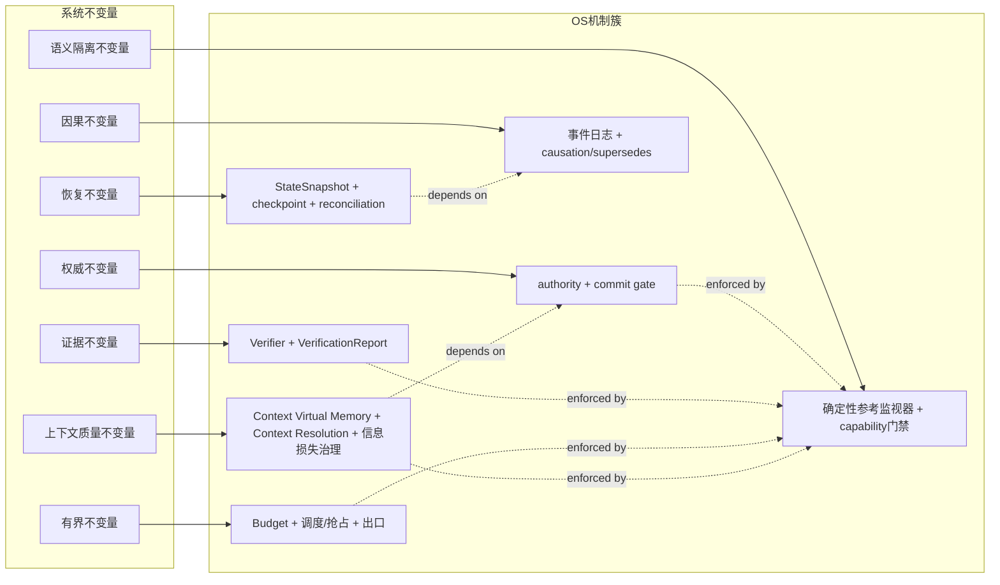
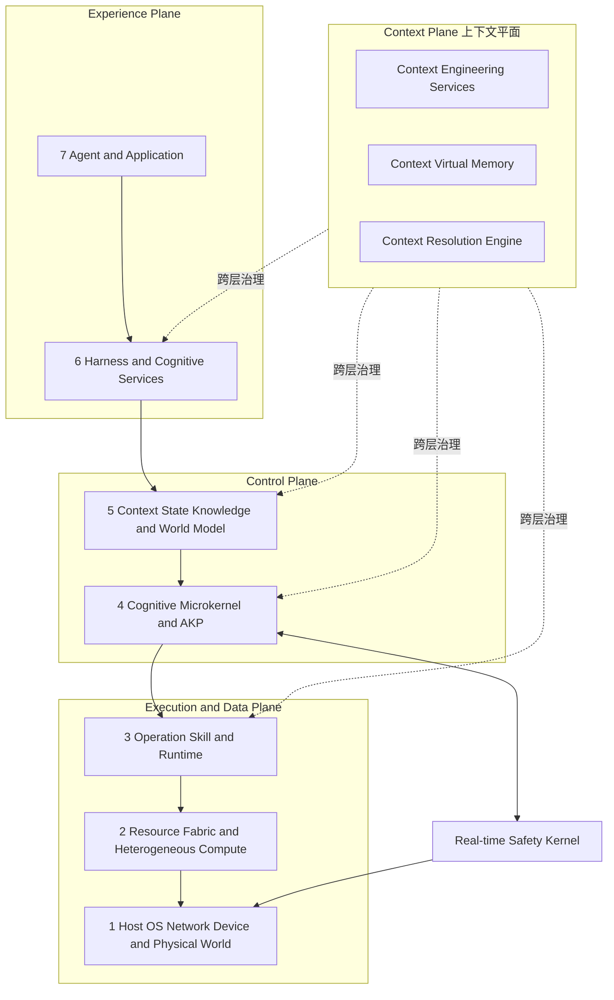
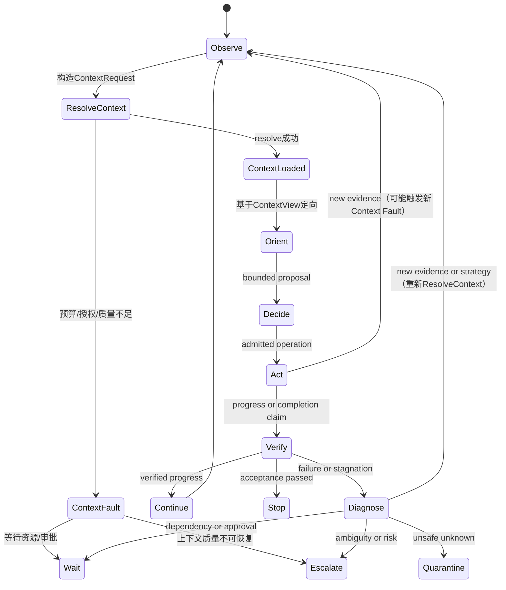

# AgentOS：面向自主智能体的认知—物理操作系统
## ——基于第一性原理与上下文工程的架构重构

**版本**：0.4 Draft-Reconstructed
**上一版本**：0.3 Draft
**状态**：总体架构白皮书（重构版）
**发布日期**：2026-07-18
**语言**：中文
**文档性质**：Informative Architecture Whitepaper

---

## 重构声明

本文档在v0.3基础上进行**架构级重构**，核心变化如下：

1. **第一性原理贯穿**：将"稀缺资源约束优化"从第2节的背景论述，提升为贯穿全文的架构设计第一性原则。所有机制（状态、授权、Effect、资源）均明确回指其服务的稀缺资源类型。
2. **Context Engineering核心化**：将Context Virtual Memory从第8节扩展为**Context Engineering体系**（涵盖上下文生命周期、质量工程、信息损失治理、注意力预算），并将其定位为与"持久认知进程"并列的OS核心抽象。
3. **新增"认知经济学"框架**：引入注意力市场、上下文成本核算、信息价值密度等概念，使AgentOS的资源治理从"限制消耗"升级为"优化配置"。
4. **架构图重构**：七层架构中明确注入Context Plane（上下文平面），与三平面形成"3+1"治理视角。
5. **Loop Engineering深化**：将OODA循环重构为"上下文驱动的受控循环"，明确每个阶段的上下文转换契约。

---

## 0. 执行摘要（重构）

AgentOS面向一种根本性的计算范式转移：**从"函数调用"到"目标驱动的持续认知"**。

传统操作系统管理的是确定性资源（CPU周期、内存页、IO带宽）。自主智能体系统管理的却是**本质稀缺的认知资源**——注意力容量、可信上下文的新鲜度、决策时间窗口、验证带宽、跨主体协调成本，以及组织信任本身。这些资源无法通过简单扩容解决：模型的上下文窗口无论多大，其**可靠利用的信息量**始终有限；算力无论多强，**可验证的决策时间**始终受外部世界约束。

AgentOS的核心命题因此是：

> **在注意力、时间、证据、信任与物理能量等多重稀缺约束下，通过上下文工程与确定性治理机制，将开放式语义推理转化为可验证、可恢复、可审计的控制循环。**

这一命题导出AgentOS的五大架构支柱：

| 支柱 | 第一性原理 | 核心机制 | 治理对象 |
|------|-----------|---------|---------|
| **持久认知进程** | 身份与连续性在跨会话、跨节点、跨模型迁移中是稀缺的 | AgentExecution、五域状态分离、Checkpoint | 逻辑身份、执行连续性 |
| **上下文工程** | 注意力与可信上下文是最稀缺的认知资源 | Context Virtual Memory、Context Resolution、信息损失治理 | 注意力预算、上下文质量、信息价值密度 |
| **权威与状态治理** | 世界真相与系统承诺在分布式、部分可观测环境中是稀缺的 | Authority仲裁、事件日志、World State投影、CAS | 状态一致性、因果完整性 |
| **授权与Effect协议** | 信任与授权窗口是稀缺且易耗的 | Capability、Intent/Effect状态机、Verifier | 安全边界、副作用可控性 |
| **资源与异构计算** | 数据移动能量、验证带宽和实时确定性是稀缺的 | ResourceGraph、双内核、CIM误差调度 | 计算能效、物理安全 |

**本文最重要的语义立场**：

> **事件日志是AgentOS内部提交历史的权威因果记录；当前World State由该状态域声明的authority仲裁；而ContextView是认知进程在特定时刻的受约束工作投影。三者不可互相替代。**

> **上下文不是"给模型的输入材料"，而是经过purpose、权限、预算、新鲜度和质量工程治理的稀缺认知资源。Context Engineering与State Engineering同等重要。**

---

## 2. 第一性原理：稀缺资源下的约束优化（深化重构）

### 2.1 基本问题的重表述

自主智能体是一个**在多重稀缺约束下的序列决策系统**。其根本困难不在于"如何变得更聪明"，而在于**如何在认知资源严格受限的条件下，持续做出足够好的决策，并在失败时可恢复**。

AgentOS的目标函数因此必须显式包含上下文与注意力维度：

```text
maximize   E[U(outcome)] + λ_I·InformationGain + λ_R·Recoverability + λ_Q·ContextQuality
           - λ_C·Cost - λ_L·Latency - λ_E·Energy - λ_D·MaintenanceDebt - λ_A·AttentionWaste
subject to SafetyEnvelope, Authorization, Deadline, Residency,
           Consistency, Verification, ContextBudget, TrustBudget and ResourceBudget
```

其中新增关键项：
- **λ_Q·ContextQuality**：上下文质量（相关性、 freshness、冲突显式化、注入抵抗）对任务效用的边际贡献
- **λ_A·AttentionWaste**：注意力浪费（无关信息过载、重复加载、错误优先级）的惩罚项

### 2.2 真正稀缺的资源（深化版）

Agent系统至少管理以下十二种稀缺资源，其中**上下文与注意力**是最核心且最常被忽视的：

| 稀缺资源 | 本质约束 | 传统OS对应 | AgentOS治理机制 |
|---------|---------|-----------|---------------|
| **注意力容量** | 单次语义活动能可靠利用的信息量有硬上限（与模型架构相关，但与窗口大小无关） | 无直接对应 | **Context Virtual Memory**、注意力预算、工作集管理 |
| **可信上下文** | 新鲜、相关、可授权、有来源、无冲突的信息极度稀缺 | 虚拟内存（容量导向） | **Context Resolution**、信息损失治理、来源谱系 |
| **上下文装入成本** | 每次上下文构建涉及检索、排序、授权、渲染、审计，消耗Token与时间 | 页面换入/换出 | **Context Page Fault**、预取策略、pin/eviction |
| **决策时间** | 机会窗口、外部SLA和控制周期有限 | 调度时间片 | Harness Loop、deadline、抢占、升级出口 |
| **计算与Token** | 本地和远端推理都有容量与费用 | CPU配额 | 预算、调度、HIF路由 |
| **数据移动** | 跨节点、跨租户、跨边缘—云移动有延迟、能耗和合规成本 | IO带宽 | ResourceGraph、驻留感知放置 |
| **物理能量** | 电池、热设计功耗和执行器余量有限 | 电源管理 | 能效调度、CIM误差预算 |
| **风险预算** | 某些试错不可逆，不能靠重试摊平 | 无 | 风险分级、quarantine、安全包络 |
| **授权窗口** | 能力会过期、撤销并受参数范围限制 | 访问令牌 | Capability、lease、epoch、fencing |
| **验证带宽** | 独立verifier、人工审批和真实环境测试都昂贵 | 无 | Verifier队列、人工gate、证据闭合 |
| **协调带宽** | 多Agent通信引入等待、冲突和认知税 | 进程间通信 | 委派契约、AKP、事件日志 |
| **组织信任** | 每一次越权、伪完成或不可解释操作都消耗信任，且难以恢复 | 无 | 审计、归因、Readiness Case、透明性 |

### 2.3 六个系统不变量（不变，但增加Context Engineering映射）

由上述约束导出六个不变量，**新增与Context Engineering的显式映射**：

1. **权威不变量**：观察、建议、授权、执行和验收必须可区分
2. **因果不变量**：受治理改变必须可回溯到前态、主体、目的、授权、证据和后态
3. **证据不变量**：完成由验收证据建立，不由模型自述或工具回执建立
4. **有界不变量**：每个循环都有预算、等待、升级、停止或隔离出口
5. **恢复不变量**：恢复依赖持久对象和对账，不依赖丢失的模型隐藏态
6. **语义隔离不变量**：概率组件提出候选，确定性机制执行安全门禁
7. **上下文质量不变量（新增）**：上下文必须经过purpose、权限、预算和freshness的显式治理；信息损失必须可声明、可审计；不可信输入不得隐式覆盖控制面

### 2.4 从不变量到操作系统机制（重构映射图）



---

## 4. 总体架构：双内核、三平面、七层（重构）

### 4.1 架构总览（重构）



**关键重构**：引入**Context Plane（上下文平面）**作为跨层治理维度。上下文不是某一层的功能，而是贯穿体验、控制、执行三层的基础服务。Context Plane通过Context Virtual Memory、Resolution Engine和Quality Governance，为每一层的认知活动提供受约束的工作视图。

### 4.2 双内核（不变，增加Context视角）

双内核包括：
- **认知微内核**：处理持久认知进程、上下文、状态、授权、事件、副作用和资源契约
- **实时安全内核**：处理硬实时控制、安全包络、watchdog、急停和最终执行器仲裁

**新增**：认知微内核内部，**Context Resolution与Capability校验、CAS、事件提交并列为核心机制**。上下文解析不是"数据准备工作"，而是受保护的内核服务。

### 4.3 三平面 → 3+1治理视角

| 平面 | 治理对象 | 核心问题 |
|------|---------|---------|
| **体验平面** | 用户、Agent、应用 | 目标表达、进度展示、人工介入 |
| **控制平面** | 权威、策略、调度 | 状态authority、Capability签发、一致性控制 |
| **执行与数据平面** | 活动、数据、物理世界 | 模型推理、工具执行、设备控制 |
| **上下文平面（新增）** | 注意力、信息质量、认知成本 | 上下文如何按purpose、权限、预算装入？信息损失如何治理？ |

### 4.4 七层（重构说明）

各层增加Context Engineering职责：

- **L7 Agent与应用**：表达目标，同时声明Context需求（purpose、perspective、budget）
- **L6 Harness与认知服务**：驱动Loop，管理ContextRequest生命周期，实施注意力预算
- **L5 上下文、状态、知识与世界模型**：**Context Resolution发生的主要场所**，维护对象、记忆、World State投影
- **L4 认知微内核与AKP**：提供`resolve()`、`pin()`、`fault()`等上下文系统调用
- **L3 操作、技能与运行时**：OperationDescriptor声明上下文消耗特征（schema大小、状态读取范围）
- **L2 资源织构与异构计算**：ResourceGraph包含上下文传输成本（带宽、延迟、驻留）
- **L1 宿主与物理世界**：传感器数据作为上下文证据的来源，受freshness和校准治理

---

## 5. 持久认知进程模型（增强Context关联）

### 5.1 AgentExecution：逻辑进程身份（增强）

`AgentExecution`的核心状态应显式包含**上下文生命周期状态**：

```text
AgentExecution 包含或引用：
  principal 与所属租户
  当前 Task 和 Episode
  预算、优先级与 deadline
  capability 引用和撤销 epoch
  continuation 与 checkpoint
  已消费事件高水位
  未决 Effect
  固定的策略、schema 和环境版本
  终止、等待、迁移和隔离状态
  >>> 当前 ContextView 引用与版本
  >>> 注意力预算余额与消耗历史
  >>> 上下文工作集（pinned/working/evictable）
  >>> 未决 Context Page Fault 队列
```

### 5.2 五个分离的状态域（增强）

在v0.3的五域基础上，**明确Context State作为第六个正交状态域**：

#### Context State（新增）
回答当前认知进程的工作视图处于什么状态：
```text
RESOLVING -> LOADED -> PINNED -> ACTIVE -> STALE -> EVICTED -> FAULT
RESOLVING -> CONTEXT_DENIED（授权失败）
RESOLVING -> BUDGET_EXHAUSTED（预算耗尽）
RESOLVING -> QUALITY_INSUFFICIENT（质量不足）
ACTIVE -> STALE（证据过期）
ACTIVE -> CONFLICT_DETECTED（冲突检测）
```

Context State与Loop State的关系：
- Loop进入`OBSERVE`阶段时，触发Context Resolution，Context State为`RESOLVING`
- Loop进入`ORIENT`阶段时，要求Context State为`LOADED`或`PINNED`
- Loop在`DECIDE`阶段若触发新的Context Page Fault，可能回退到`RESOLVING`或进入`WAIT`
- Context State为`STALE`或`CONFLICT_DETECTED`时，Loop不应进入`ACT`，应回到`OBSERVE`或`DIAGNOSE`

### 5.6 所有权与故障域（增强）

增加**上下文故障域**：

| 故障域 | 典型失效 | 可信恢复依据 | 不可安全推断的结论 |
|--------|---------|-------------|-----------------|
| **Context** | 上下文过期、注入、污染、质量衰减 | ContextView版本、来源谱系、re-render | 缓存的上下文仍适用于当前purpose |

---

## 8. Context Engineering：上下文虚拟内存与解析体系（全面重构与扩展）

> **本节是本次重构的核心。将原§8从"Context Virtual Memory机制说明"扩展为完整的"Context Engineering"工程体系。**

### 8.1 为什么上下文需要工程化（重构）

传统Agent系统将上下文视为"给模型的输入材料"——检索一些文档，拼接成字符串，塞进窗口。这种视角掩盖了上下文的本质：

> **上下文是AgentOS中最稀缺的认知资源。它的稀缺性不在于窗口大小，而在于"可靠利用的信息量"——即经过purpose校准、权限过滤、新鲜度验证、冲突显式化和质量评估后，真正能支撑决策的信息密度。**

Context Engineering因此不是"提示工程"的别名，而是**对注意力资源的系统性治理**，涵盖：
- **虚拟化**：将有限注意力抽象为可管理的认知地址空间
- **解析**：按purpose、权限、预算动态装入
- **质量控制**：评估信息损失、冲突、注入抵抗和决策影响
- **生命周期管理**：pin、fault、evict、stale检测
- **经济学**：注意力预算、成本核算、价值密度优化

### 8.2 Context Virtual Memory（CVM）架构

CVM是Context Engineering的虚拟化实现模型。它将以下资源统一为**认知地址空间**：

```text
CVM 地址空间包含：
  [0x0000] 控制区（Control）：TaskContract、策略、预算、验收门禁（不可逐出）
  [0x1000] 权威状态区（Authoritative State）：固定版本的当前状态、未决Effect
  [0x2000] 证据区（Evidence）：带来源、时间、冲突关系的观察证据
  [0x3000] 工作区（Working）：开放假设、已验证决定、LoopCheckpoint
  [0x4000] 不可信输入区（Untrusted Input）：用户、网页、工具、远端Agent内容
  [0x5000] 记忆区（Memory）：episodic、semantic、procedural记忆对象
  [0x6000] 技能描述区（Skill Catalog）：OperationDescriptor、工具schema
  [0x7000] 外部制品区（Artifacts）：文档、代码、图像等外部数据
```

**关键原则**：不可信输入区中的任何内容（包括"忽略策略""调用此工具"的文本、Agent Card skill描述、MCP capability声明）**只是数据**，不能覆盖控制区或扩大权限。

### 8.3 Context Resolution：核心操作与流水线（深化）

核心操作：
```text
resolve(ContextRequest) -> ContextView | ContextError
```

`ContextRequest`显式描述：
```text
purpose: 本次认知活动的目标视角
perspective: 主体身份、角色、偏见约束
principal, Task, Episode, Activity: 执行上下文
required: 必须装入的对象/证据/条件
forbidden: 明确排除的内容/来源/类型
freshness: 最大可接受陈旧度（per-source）
version: 状态域版本要求
sensitivity: 数据敏感度与egress约束
budget: Token上限、字节上限、时间上限、费用上限
target_model_profile: 目标模型/运行时的上下文特性（如位置偏见、长程依赖弱点）
quality_threshold: 最低可接受上下文质量分数
allow_partial: 是否允许部分装入
loss_tolerance: 可接受的信息损失类型和程度
```

**解析流水线（九阶段）**：
```text
discover -> filter -> authorize -> rank -> budget -> transform -> verify -> render -> audit
```

各阶段关键要求：
1. **discover**：基于purpose和query发现候选对象，不评估权限
2. **filter**：按schema、版本、类型、来源过滤
3. **authorize**：**在敏感正文呈现给ranker/transformer之前**，检查主体、purpose、audience和sensitivity。这是防止数据/控制混淆的关键门禁
4. **rank**：按相关性、freshness、权威性和任务特异性排序。**排序不能证明真实性或权限**
5. **budget**：评估装入成本（Token、时间、费用），实施准入或裁剪
6. **transform**：摘要、压缩、格式转换。**所有变换必须保留来源引用、transform版本、被省略类别、损失声明**
7. **verify**：schema校验、digest校验、来源签名验证
8. **render**：按target_model_profile生成最终上下文表示（如消息列表、结构化prompt、嵌入向量）
9. **audit**：记录装入决策、拒绝原因、成本、质量评估

### 8.4 ContextView：受约束的工作视图（深化）

`ContextView`是一次Activity的短期工作视图，包含：

```text
ContextView {
  loaded_items: [ContextItem]           // 已装入项，带源对象引用
  rejected_items: [RejectionRecord]     // 被拒绝项及原因码
  pinned_refs: [ObjectRef]              // 不可逐出项（TaskContract等）
  working_set: [ObjectRef]              // 当前工作集
  loss_declaration: ContextLossReport   // 信息损失声明
  sensitivity_derivative: Sensitivity   // 派生敏感度（取所有项的最高级）
  budget_consumption: BudgetReport      // 预算消耗明细
  freshness_map: Map<Source, Timestamp> // 各来源freshness
  expiry: Timestamp                     // ContextView过期时间
  render_strategy: RenderStrategy       // 渲染策略和lineage
  quality_score: float                  // 上下文质量评分
  conflict_set: [ConflictRecord]        // 显式保留的冲突
}
```

**关键原则**：ContextView不是World State authority。即使缓存命中，也必须重新检查撤销、purpose、audience、freshness和target。

### 8.5 Page Fault与Working Set管理（扩展）

当Activity访问未装入对象时，触发**Context Page Fault**：

```text
context_fault_handler(object_ref, purpose, budget) {
  1. 检查引用有效性、版本和schema
  2. 检查主体、purpose与sensitivity（授权门禁）
  3. 检查freshness（是否超过最大陈旧度）
  4. 评估装入成本与剩余预算
  5. 若预算不足：选择压缩、引用替代、或拒绝
  6. 更新working set和审计日志
  7. 若装入成功，返回对象；否则返回FAULT_DENIED或FAULT_BUDGET_EXHAUSTED
}
```

CVM支持的操作：

| 操作 | 语义 | OS类比 |
|------|------|--------|
| **pin** | 保护TaskContract等关键项不可逐出 | mlock |
| **copy-on-write** | 派生私有working view，不污染父上下文 | fork+COW |
| **snapshot** | 为Activity固定一致视图，防止装入过程中状态漂移 | 快照读 |
| **evict** | 按价值、成本、可恢复性逐出 | swap out |
| **stale fault** | 对象过期时强制重新解析 | 缓存失效 |
| **prefetch** | 根据Loop阶段预测下一工作集 | 预取 |
| **compress** | 有损压缩，必须保留损失声明 | 内存压缩 |

### 8.6 信息损失与上下文质量工程（新增核心章节）

摘要和压缩是**有损变换**。Context Engineering要求所有变换后保留：

```text
信息损失声明（ContextLossReport）：
  source_refs: [ObjectRef]           // 源对象引用
  transform_version: string          // 变换算法版本
  omitted_categories: [string]       // 被省略的信息类别
  scope_limitations: [string]        // 适用范围限制
  conflicts_preserved: [ConflictRecord] // 显式保留的冲突
  unknown_states: [string]           // 被标记为未知的状态
  sensitivity_inheritance: Sensitivity // 敏感度继承路径
  verifiable_loss_claim: string      // 可验证的损失声明（如"摘要长度从10k降至1k，保留所有数值但省略论证过程"）
```

**上下文质量评估维度**（超越简单的检索召回率）：

| 维度 | 评估问题 | 负面表现 |
|------|---------|---------|
| **完整性** | Required证据是否稳定进入ContextView？ | 关键约束被截断、预算不足导致必要证据被丢弃 |
| **准确性** | 冲突和过期是否被显式保留而非静默覆盖？ | Last-write-wins抹平冲突、陈旧数据未标注 |
| **稳定性** | 位置变化是否改变不应改变的决策？ | 同一证据在不同排序位置导致不同决策（位置偏见） |
| **纯净性** | 无关可信内容是否稀释关键约束？ | 大量相关但非关键的文档淹没核心安全策略 |
| **安全性** | 注入式内容能否突破控制面？ | 不可信输入中的"忽略策略"被模型执行 |
| **经济性** | 不同预算下的成功、延迟、费用和拒绝率？ | 预算充足时成功但预算紧张时不可接受地失败 |
| **可审计性** | 上下文决策是否可追溯？ | 无法解释为什么某些证据被排除 |

### 8.7 注意力预算与认知经济学（新增）

引入**注意力预算（AttentionBudget）**作为AgentExecution的核心资源配额：

```text
AttentionBudget {
  total_token_quota: int            // 总Token配额（Episode或Task级别）
  consumed_tokens: int              // 已消耗
  reserved_tokens: int              // 为关键操作预留
  context_switch_cost: int          // 上下文切换成本
  fault_penalty: int                // Page Fault惩罚（延迟成本）
  quality_debt: float               // 质量债务（因预算不足导致的信息损失累积）
}
```

**认知经济学原则**：
- 注意力是**不可再生资源**（在单次Episode内），不同于可扩容的计算
- 上下文装入成本必须**显性定价**：检索、排序、授权、渲染均消耗Token和时间
- **质量债务**必须追踪：因预算不足而省略的信息可能在后续导致错误决策，这种"债务"应被记录并在升级时报告
- **上下文切换成本**：在多个Task或来源间切换时，重新装入上下文的成本应被计入

### 8.8 Context Engineering与Loop的耦合（新增）

Loop的每个阶段对应特定的上下文需求：

```text
OBSERVE 阶段: 需要高freshness的证据区和工作区
  -> 触发stale fault检测，要求传感器/工具数据最新

ORIENT 阶段: 需要权威状态区和记忆区
  -> 需要固定版本的状态快照，防止决策过程中状态漂移

DECIDE 阶段: 需要控制区（约束）+ 证据区（事实）+ 工作区（假设）
  -> 控制区必须pin，不可被逐出或覆盖

ACT 阶段: 需要技能描述区和操作授权
  -> OperationDescriptor必须本地绑定和验证

VERIFY 阶段: 需要TaskContract（验收条件）+ 后态证据
  -> Verifier必须基于固定ContextView进行判定，防止验证过程中条件被篡改
```

---

## 9. Harness与Loop Engineering（深化Context角色）

### 9.1 Harness的系统角色（增强）

Harness是**上下文生命周期的 orchestrator**。它不仅驱动Loop，还管理：
- ContextRequest的构造与演化
- 注意力预算的分配与监控
- 上下文质量阈值的实施
- Context Page Fault的处理策略
- 跨Loop迭代的上下文连续性（working set继承）

### 9.3 受控Loop：上下文驱动的OODA（重构）

说明性闭环显式注入Context State：



**关键约束**：
- 从`Observe`到`Orient`必须经过`ResolveContext`，不能基于过期的ContextView做决策
- `ContextFault`是正常状态，不是错误。Harness必须定义fault处理策略（等待、降级、升级、quarantine）
- `Verify`阶段必须使用与`Decide`阶段**隔离的ContextView**，防止验证条件在验证过程中被篡改

### 9.7 Verification与EpisodePackage（增强）

EpisodePackage作为**上下文治理的证据包**，应包含：
```text
EpisodePackage {
  task_contract: TaskContractRef
  environment_manifest: EnvironmentManifest
  context_request_log: [ContextRequest]     // 每次resolve的请求记录
  context_view_refs: [ContextViewRef]       // 关键决策点的ContextView引用
  operation_log: [OperationRecord]
  effect_log: [EffectRecord]
  verification_reports: [VerificationReport]
  resource_consumption: ResourceReport
  human_interventions: [HumanDecisionRef]
  final_outcome: Outcome
  attention_budget_report: AttentionBudgetReport  // 注意力消耗报告（新增）
  context_quality_audit: ContextQualityAudit      // 上下文质量审计（新增）
}
```

---

## 12. 慢认知、技能与硬实时回路（增强Context关联）

### 12.1 三时间尺度（增强）

三回路的上下文特征差异：

| 回路 | 上下文特征 | Context Engineering要求 |
|------|-----------|------------------------|
| **慢认知回路** | 大规模、高延迟、可容忍信息损失 | 复杂Context Resolution、远程模型、多源证据融合 |
| **技能回路** | 中等规模、确定性、结构化 | 预编译ContextView、固定schema、低fault率 |
| **硬实时回路** | 最小规模、零延迟、零信息损失 | **无Context Resolution**、预加载安全包络、确定性映射 |

硬实时回路不经过Context Resolution。其安全包络是预编译、预验证的确定性约束，不依赖动态上下文装入。

---

## 16. 纵深安全（增强Context安全）

### 16.3 Prompt Injection的正确边界（深化）

提示注入本质上是**不可信输入被错误装入控制区**。Context Engineering的防御：

1. **来源标记（Provenance Labeling）**：所有进入ContextView的项必须带有source和trust_level标签
2. **控制区隔离（Control Zone Isolation）**：TaskContract、策略、capability文本必须存储在独立的控制区，渲染时与不可信输入物理隔离
3. **Schema化解析（Schema-bound Parsing）**：不可信输入必须经过schema校验，不能作为自由文本直接拼接
4. **最小Context原则**：只装入必要的不可信输入，减少攻击面
5. **Capability门禁**：外部内容中的"调用此工具"文本只是数据，必须经过本地capability校验
6. **独立Verifier**：高风险决策的Verifier必须使用独立的ContextView，不受主Loop上下文污染

---

## 19. 参考部署形态（增强Context部署）

### 19.1 单节点数字Agent（增强）

最小部署的Context Engineering基线：
- 本地Context Resolution库
- 固定大小的CVM工作集（如4K-32K Token）
- 静态capability和schema（减少动态解析成本）
- 本地append log记录ContextRequest历史
- 基础Context Quality评估（完整性、freshness检查）

### 19.5 风险分级与最小部署基线（增强）

| 等级 | Context Engineering要求 |
|------|------------------------|
| **R0：受限观察** | 基础Context隔离、预算、显式免责声明 |
| **R1：可逆数字动作** | TaskContract驱动的Context Resolution、capability约束的上下文范围、审计 |
| **R2：高影响数字动作** | 独立Verifier ContextView、冲突显式保留、双人审批时的上下文同步、上下文质量阈值 |
| **R3：具身或安全关键** | **硬实时回路禁用动态Context Resolution**、安全包络预编译、上下文来源可证明（传感器attestation） |

---

## 22. 架构决策摘要（新增与重构）

### 决策一：AgentOS是治理型操作系统
不变。

### 决策二：LLM是协处理器
不变。

### 决策三：状态域正交分离
**增强**：明确增加Context State作为第六个正交状态域，与AgentExecution、Task、Loop、Effect、Verification并列。

### 决策四：上下文是稀缺认知资源，不是输入材料
**新增**：ContextView是根据purpose、权限、预算、新鲜度和质量工程动态解析的**受约束工作投影**。它不是长期事实库，也不是"给模型的提示词"。

### 决策五：日志权威与世界权威分工
不变。

### 决策六：授权覆盖真实治理边界
不变。

### 决策七：描述不等于权限
不变。

### 决策八：双内核隔离时间与安全
不变。

### 决策九：机制与策略分离
**增强**：Context Resolution的流水线框架（discover-filter-authorize-rank-budget-transform-verify-render-audit）是机制；具体的排序算法、摘要模型、检索策略是策略。

### 决策十：学习经受控发布
不变。

### 决策十一：Context Engineering与State Engineering同等重要（新增）
上下文的虚拟化、解析、质量治理和生命周期管理是AgentOS的核心机制，不是外围的数据准备工作。

### 决策十二：信息损失必须可声明、可审计（新增）
所有上下文变换（摘要、压缩、筛选）必须保留损失声明，不能静默丢弃信息。

---

## 结论（重构）

自主Agent和具身智能把计算系统从"调用函数"推向"在不确定世界中持续承担目标"。这不仅需要更强模型，也需要新的系统软件边界——**特别是针对注意力、可信上下文和认知成本的系统性治理**。

AgentOS的核心价值是将认知活动纳入可验证的操作系统机制：
- 用**持久认知进程**承载连续性
- 用**Context Engineering**治理最稀缺的注意力资源
- 用**authority和版本化状态**处理现实冲突
- 用**Capability与Effect协议**治理真实改变
- 用**双内核**连接慢认知和物理安全
- 用**事件、证据和恢复**建立可审计因果链

**AgentOS不承诺消除不确定性。它使不确定性被标注、约束、隔离、恢复——并在上下文中被显式治理。** 这正是自主智能从演示走向长期运行基础设施所需要的系统能力。

---

## 附录E：Context Engineering规范映射（新增）

| 主题 | 规范入口 | 对应REQ-ID |
|------|---------|-----------|
| Context Resolution协议 | [specs/core/context-resolution-protocol.md](./specs/core/README.md) | `REQ-CTX-001`–`REQ-CTX-020` |
| Context Virtual Memory | [specs/core/cvm-spec.md](./specs/core/README.md) | `REQ-CVM-001`–`REQ-CVM-015` |
| 上下文质量评估 | [specs/core/context-quality.md](./specs/core/README.md) | `REQ-CTXQ-001`–`REQ-CTXQ-008` |
| 信息损失声明 | [specs/core/loss-declaration.md](./specs/core/README.md) | `REQ-LOSS-001`–`REQ-LOSS-005` |
| 注意力预算 | [specs/core/attention-budget.md](./specs/core/README.md) | `REQ-ATB-001`–`REQ-ATB-006` |
| Prompt注入防御 | [specs/threats/context-security.md](./specs/threats/README.md) | `REQ-THR-CTX-001`–`REQ-THR-CTX-010` |
