# CognitiveOS Console 产品设计文档

<a id="doc-top"></a>

> 本文档是 CognitiveOS Console（跨平台可视化操作台）的产品设计文档。它是 **informative** 产品文档：不新增、不修改任何已登记的 `REQ-*`、错误码、schema、transition table 或测试向量；所有产品要求使用本地 `CONSOLE-PRD-xxx` 编号（见 [§18](#sec-18)）。

---

## 目录

- [1. 文档元数据](#sec-1)
- [2. 产品定义](#sec-2)
- [3. 用户与权限](#sec-3)
- [4. 部署与连接模型](#sec-4)
- [5. 平台能力矩阵](#sec-5)
- [6. 信息架构](#sec-6)
- [7. 默认首页：Agent Shell](#sec-7)
- [8. 功能模块设计](#sec-8)
- [9. 关键用户旅程](#sec-9)
- [10. 状态和操作语义](#sec-10)
- [11. 安全与隐私设计](#sec-11)
- [12. 客户端技术架构](#sec-12)
- [13. 数据与 API 映射](#sec-13)
- [14. 视觉与交互规范](#sec-14)
- [15. 通知与审批](#sec-15)
- [16. 发布与更新](#sec-16)
- [17. MVP 与路线图](#sec-17)
- [18. 产品要求与验收](#sec-18)
- [19. 指标](#sec-19)
- [20. 风险与待决策](#sec-20)
- [附录 A. 关键页面清单](#appendix-a)
- [附录 B. 术语与不可混淆概念对照](#appendix-b)

---

<a id="sec-1"></a>
## 1. 文档元数据

| 项 | 值 |
|---|---|
| 产品名（暂定） | CognitiveOS Console |
| 文档版本 | v0.1 |
| 日期 | 2026-07-20 |
| 文档状态 | Draft |
| 文档性质 | Informative Product Design（产品设计文档，非 normative 规范） |
| 产品状态 | `planned`（与 [README.md](./README.md) 一致；无任何实现、测试执行或 Profile 符合性含义） |
| 作者角色 | 产品负责人、UX 架构师、安全架构师、跨平台客户端技术负责人（角色署名，非个人署名） |
| 覆盖平台 | Windows、Linux、macOS 桌面端；iOS、Android 移动端 |

### 1.1 依据文件

本文档以下列**当前仓库文件**为唯一事实来源；`History/` 中的归档计划不作为当前事实：

| 类别 | 文件 | 地位 |
|---|---|---|
| 架构白皮书 | [CognitiveOS-Architecture.md](../../CognitiveOS-Architecture.md) v1.0.1（§4.7、§5、§6、§9、§10、§11、§12、§15、§16、§17、§18.3、§19、§20、§21、附录 A） | Informative 正式架构基线 |
| 评审结论 | [CognitiveOS-Review-Conclusions.md](../../CognitiveOS-Review-Conclusions.md)（§2 设计基线 V1–V17、IMP-05） | Informative 设计输入 |
| 治理规范 | [RFC-0001](../../RFC-0001-cognitiveos-governance-context-access.md) | Normative companion（Draft） |
| Core companion | [specs/core/README.md](../../specs/core/README.md) | Normative companion（v0.2 Draft） |
| AKP companion | [specs/akp/README.md](../../specs/akp/README.md) | Normative companion（v0.2 Draft） |
| Agent 兼容性 | [specs/agent-compatibility/README.md](../../specs/agent-compatibility/README.md) | Normative companion（v0.1 Draft） |
| 受治理记忆 | [specs/governed-memory/README.md](../../specs/governed-memory/README.md) | Normative companion（v0.1 Draft） |
| 认知发现 | [specs/cognitive-discovery/README.md](../../specs/cognitive-discovery/README.md) | Normative companion（v0.1 Draft） |
| Operation Catalog | [specs/operation-catalog/README.md](../../specs/operation-catalog/README.md) | Normative companion（v0.1 Draft） |
| Registry | [requirements.yaml](../../specs/registry/requirements.yaml)、[errors.yaml](../../specs/registry/errors.yaml)、[state-domains.yaml](../../specs/registry/state-domains.yaml) | 已登记资产索引 |
| Transition tables | [specs/transitions/](../../specs/transitions/) 下五份 `*.transitions.json`（v0.1 Draft） | 已登记状态机 |
| Schema | [specs/schemas/](../../specs/schemas/) 下 56 份 `*.schema.json` | 已登记机器契约 |
| 治理对象标准 | [governed-object-contract.md](../../docs/standards/governed-object-contract.md) | 标准（v0.1 Draft） |
| 符合性说明 | [conformance/README.md](../../conformance/README.md) | 声明式向量说明（无 runner） |

### 1.2 资产状态约定（阅读本文档前必须理解）

本文档严格区分以下互不等价的状态，正文中所有能力表述遵循该约定：

1. **已登记（specified）**：出现在 registry / schema / transition table 中的 REQ-ID、错误码、状态域和机器契约。已登记 ≠ 已实现。
2. **架构基线（informative）**：只存在于白皮书或评审结论中的设计（如 §12.12 审批分发矩阵、`os://` 命名空间词汇、知识对象伪 schema）。这些是设计输入，**不是已登记资产**。
3. **产品建议**：本文档提出的 Console 侧设计决策。
4. **产品依赖 / 待实现**：Console 需要但当前仓库中不存在对应已登记契约或任何实现的后端能力。本文档发现后端缺失时一律如此标注，不虚构 API、REQ-ID 或实现状态。

仓库当前**不存在任何实现代码、conformance runner、已执行向量或 profile-manifest 实例**（[conformance/README.md](../../conformance/README.md) 明确声明无 runner）。因此本文档描述的一切 Console 能力的实现状态均为 `planned`，其后端能力的实现状态也均为待实现。

---

<a id="sec-2"></a>
## 2. 产品定义

### 2.1 愿景

CognitiveOS Console 是 CognitiveOS 的跨平台可视化操作台：让终端用户、租户管理员、平台运维、安全审计与审批人员在一个客户端中，以**忠实于 authority 状态**的方式对话、监督、管理和审计运行在本地或远程 CognitiveOS 节点上的受治理 Agent。

### 2.2 价值主张

1. **看得懂的真实状态**：不把五个执行生命周期状态机压缩成"运行中/完成"，把 `candidate_complete`、`OUTCOME_UNKNOWN`、`quarantined` 等关键差异翻译给用户而不丢失语义（架构 §6.3、§12.10）。
2. **可信的管理与审批**：普通任务通道与特权管理通道在视觉、凭证、缓存和数据层全部隔离；高风险审批离开聊天流、绑定固定 proposal digest（架构 §12.8、§12.9、§12.12）。
3. **一处对话、五端可达**：桌面端全功能操作台，移动端远程伴侣（对话、监督、审批、管理），默认入口是 Agent Shell 对话界面。
4. **管理面永不失联**：模型或 Shell 不可用时，Console 的确定性管理视图仍可检查状态、停止执行、撤销 capability、对账未决 Effect（架构 §20.1 `MANAGEMENT_READY`、§12.8 三入口）。

### 2.3 目标

- G1：为单机与远程 CognitiveOS 节点提供统一的对话（Shell）、监督（watch）、管理（Management API 客户端）体验。
- G2：完整呈现 Agent 安装事务、兼容性（C0—C3）、执行（AgentExecution/Runtime）、任务（Task/Loop/Effect/Verification）、记忆、知识谱系、协作、审批、审计与系统健康。
- G3：在所有写路径上执行"结构化 proposal → 预览 → 门禁 → 必要审批 → Effect 对账 → 审计"的产品化呈现，绝不绕过。
- G4：桌面三平台与移动两平台各自达到该平台的最佳形态，而不是强行五端同构。

### 2.4 非目标

- 不做 authority、微内核、调度器、全局 memory、catalog、verifier 或 commit 服务的任何部分（架构 §4.7 唯一责任矩阵：Agent Shell "明确不拥有 authority、全局 memory、commit"）。
- 不替代 Management API 或确定性 Admin CLI（架构 §12.8：Intelligent Shell "不能以它替代 Management API 或确定性 Admin CLI/Console"）。
- 不做模型托管、推理编排或 Agent Runtime。
- 不做 IdP：身份提供方、部署拓扑、计费与法务合规是 RFC-0001 的显式非目标，Console 只消费其结果（标注为产品依赖）。
- 移动端不做"桌面宿主的等价物"：不承诺在 iOS/Android 上安装任意本地 Agent、管理任意系统进程或维持无限后台运行（见 §5.4）。

### 2.5 成功标准

产品层面的成功以 [§19 指标](#sec-19) 度量口径定义（首次连接成功率、任务监督成功率、状态新鲜度、审批健康、无障碍完成率等）；本文档不给出无依据的目标数字。发布层面的成功以 [§17 MVP 验收条件](#sec-17) 与 [§18 Given/When/Then](#sec-18) 定义。

### 2.6 与 CognitiveOS 内核、Runtime、Shell、Admin CLI 的边界

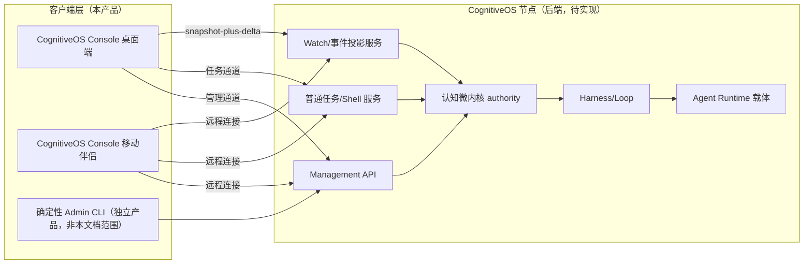

边界规则（不可违反）：

| # | 规则 | 依据 |
|---|---|---|
| B1 | Console、Agent Shell、移动端都是**客户端**，不是 authority、微内核或永久 root Agent | 架构 §4.7、§12.8 |
| B2 | Management API 是所有管理客户端的共同机制入口；无模型时确定性 Admin CLI/Console 仍必须可用 | 架构 §12.8 三入口、`REQ-MGMT-FALLBACK-001` |
| B3 | Console 不做授权判定、不签发 capability、不提交 Effect；一切最终判定在节点侧 authority | 架构 §12.3、§12.5 |
| B4 | Console 展示的状态一律来自 authority projection（`ShellStatusView`、watch 事件），不来自 Agent 文本、日志或"已完成"自述 | 架构 §12.10、[shell-status-view.schema.json](../../specs/schemas/shell-status-view.schema.json) |
| B5 | Console 本地缓存只是投影缓存，权限或版本变化后必须失效重取 | 架构 §12.11、`WATCH_CURSOR_STALE` |

---

<a id="sec-3"></a>
## 3. 用户与权限

### 3.1 角色定义

| 角色 | 描述 | 默认通道 | 典型平台 |
|---|---|---|---|
| 终端用户（End User） | 通过 Shell 对话创建、监督、修正自己的任务；管理自己的 Conversation 与记忆可见项 | 任务通道 | 五端 |
| Tenant 管理员（Tenant Admin） | 管理本 tenant 的 Agent 安装、成员、Membership、策略、委派与配额 | 管理通道（tenant scope） | 桌面为主，移动审批 |
| 平台运维（Platform Operator） | 管理节点、Runtime 载体、资源、系统健康与升级；`scope_domain=platform` | 管理通道（platform scope） | 桌面 |
| 安全审计员（Security Auditor） | 只读审计链、Effect 对账记录、审批记录、安全事件；导出需独立授权 | 审计只读通道 | 桌面 |
| 审批人（Approver） | 处理 R1—R3 审批请求；R2/R3 的批准主体必须独立于提案者 | 审批通道 | 五端（R2/R3 见 §11 可信确认面） |
| Agent 开发/发布人员（Agent Publisher） | 提交 AgentPackageManifest、查看兼容性报告与负例测试证据、管理版本与回滚点 | 管理通道（受限 scope） | 桌面 |

角色是 RBAC 候选权限来源，不是最终授权：最终许可不超过 `用户委派 ∩ 工作负载权限 ∩ TaskContract ∩ 资源策略 ∩ 适用 capability`（架构 §12.3）。Console 在 UI 上只做**能力提示与入口裁剪**，不做授权判定（判定永远在节点侧，拒绝以已登记错误码返回，见 §13.8）。

### 3.2 角色—资源—动作矩阵

图例：R=读（授权投影内）、W=发起写 proposal（仍需节点门禁）、A=审批、`-`=默认无入口。**任何 W 都不是直接写**，而是生成结构化 proposal 进入 `Intent → Authorize → Execute → Reconcile → Verify → Commit/Abort` 协议（架构 §12.5）。

| 资源 \ 角色 | 终端用户 | Tenant 管理员 | 平台运维 | 安全审计员 | 审批人 | Agent 发布者 |
|---|---|---|---|---|---|---|
| Conversation / 自己的任务 | R/W | R（元数据，默认无正文） | R（元数据，默认无正文） | R（审计投影） | R（审批上下文投影） | - |
| Agent 目录 / AgentPackageManifest | R | R/W（tenant 内安装） | R/W（平台目录） | R | R | R/W（自己发布的包） |
| AgentInstallation / 兼容性报告 | R（已安装项） | R/W | R/W | R | R | R（自己的包） |
| AgentExecution / Runtime 载体 | R/W（自己的执行） | R/W（tenant 内） | R/W（平台级载体） | R | R | - |
| Task / Loop / Effect / Verification | R/W（自己的） | R（tenant 内元数据） | R（平台健康视角） | R | R（审批关联项） | - |
| MemoryObject / MemoryCandidate | R/W（自己 scope 内） | R/W（tenant 策略与准入队列，默认无正文） | - | R（审计投影） | - | - |
| KnowledgeObject / 谱系 | R（授权范围） | R/W（tenant 知识准入） | - | R | - | - |
| 用户 / Membership / 角色 | R（自己） | R/W（tenant 内） | R/W（平台账户，默认无 tenant 正文） | R | - | - |
| Delegation / Capability | R（自己相关） | R/W（tenant 内签发申请与撤销） | R/W（平台级） | R | - | - |
| 审批队列 | R（自己发起的） | R/A（tenant 内） | R/A（平台域） | R | A | R（自己包相关） |
| 审计链 / Evidence | R（自己相关） | R（tenant 内） | R（平台运行事件） | R（全量投影） | R（决策相关） | - |
| 系统健康 / ResourceGraph / 配置 | - | R（tenant 配额视角） | R/W | R | - | - |
| PrivilegedManagementSession | - | 自己的（建立/查看/撤销） | 自己的 | R（审计投影） | - | 自己的（受限） |

### 3.3 管理员正文隔离

- **Tenant 是隔离域，不是权限等级**（架构 §6.2）。tenant/platform 管理员**默认不获得**用户 Conversation 正文、记忆正文、ContextView 内容的读取权；他们看到的是元数据、状态投影与审计记录。
- 平台运维使用 `PlatformContext`（`scope_domain=platform`）；[governance-domain-context.schema.json](../../specs/schemas/governance-domain-context.schema.json) 只固定 platform/tenant 治理域形状，**正文读取隔离义务来自 RFC-0001 §3—§8 与架构 §6.2 的 prose，而不是该 schema 自身的授权约束**。
- Console 只在调用者另有 metadata discovery 权限时显示对象存在、类型、状态、体量与审计线索；正文区域使用"正文不可见"占位。若对象存在性本身不可发现，denied 与 not-found 使用不可区分响应，避免占位组件泄露受保护元数据。

### 3.4 Break-glass

紧急正文访问走独立、限时、可审计授权（架构 §20.2：break-glass 读取"独立授权、限时、双人或等价审批并通知审计"）。Console 产品化为：

1. 管理员在目标对象的锁定占位上发起 break-glass 申请（填写理由、时限、范围）。
2. 生成独立 proposal，进入 R2/R3 审批（双人或等价），不能由申请人自批；已登记独立审批拒绝使用 `MANAGEMENT_INDEPENDENT_APPROVAL_REQUIRED`。`MANAGEMENT_SELF_AUTHORIZATION_DENIED` 保留给管理动作自授权被拒的语义。
3. 批准后 Console 显示醒目的"break-glass 会话中"横幅（持续可见、含剩余时限与撤销按钮），所有读取逐条计入审计。
4. 超时或撤销后正文视图立即失效并清除本地缓存。

后端的 break-glass 授权对象当前无已登记 schema —— **产品依赖/待实现**。

### 3.5 职责分离

- R2/R3 的 **`approve` 决定**必须 `independent_from_proposer: true`（[management-approval-decision.schema.json](../../specs/schemas/management-approval-decision.schema.json)）；该 schema 不对 `deny/challenge/expired` 作此要求。Console 在审批 UI 中对提案者本人隐藏批准操作，仅显示"等待独立审批人"状态。已登记向量 `MGMT-APPROVAL-005` 覆盖批准自提案被拒路径。
- 审计视图对安全审计员只读；审计员无任何 W 入口，保证审查者与被审对象分离。
- Agent 发布者不能审批自己包的安装 proposal。

---

<a id="sec-4"></a>
## 4. 部署与连接模型

### 4.1 连接拓扑总览

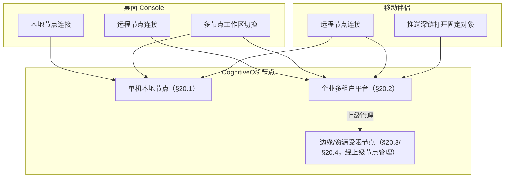

### 4.2 五种部署/连接场景

| 场景 | 描述 | Console 行为 | 依据 |
|---|---|---|---|
| 单机本地 | 桌面 Console 与单进程 CognitiveOS 节点同机（微内核库+本地对象存储+事件日志+Harness+沙箱+verifier） | 连接 loopback 传输；仍走完整认证与通道隔离，进程同机不放宽任何门禁 | 架构 §20.1、§4.7 信任域部署变体 |
| 桌面连远程 | 桌面 Console 连接局域网/云端节点 | 强认证后建立任务通道；管理操作按需建立 `PrivilegedManagementSession`；每个信任域跳变重新认证 | 架构 §12.8、AKP §10 |
| 企业多租户 | 多 tenant、多管理域、独立审批与审计平台 | 工作区绑定 tenant；平台域与 tenant 域视图分离；跨 tenant 仅 ShareGrant 或本地重授权 | 架构 §20.2 |
| 多节点/多工作区 | 一个 Console 管理多个节点（如本地开发节点+生产节点） | 每个工作区独立：凭证、缓存、watch cursor、投影 store 互不共享；UI 显式标注当前节点身份与环境色 | 产品建议（隔离语义沿用 B5） |
| 移动远程伴侣 | iOS/Android 连接远程节点做对话、监督、审批、管理 | 全部能力经远程 API；无本地节点托管；推送只做通知面 | 边界 #20、§5.4 |

### 4.3 节点就绪度与降级

Console 首页与节点切换器必须区分节点的三种就绪度（架构 §20.1）。这些名称当前是**架构 prose，不是已登记 state domain/health schema**；后端需提供权威 readiness projection，Console 不得从组件日志自行合成：

| 就绪度 | 含义 | Console 呈现 |
|---|---|---|
| `MANAGEMENT_READY` | authority、审计、Management API 与确定性管理入口可用；可能尚无模型/Shell/domain Agent | 管理视图全部可用；Shell 输入框禁用并显示"节点处于管理就绪状态，对话不可用；您仍可检查状态、停止执行、撤销 capability、对账 Effect" |
| `USER_READY` | 任务通道、身份、Conversation、意图固定、Task/Execution 创建与 watch 可用 | Shell 可用；依赖 domain Agent 的能力显示其各自可用性 |
| `OPERATIONAL` | 适用 domain Agent、Harness、模型/工具、verifier 就绪 | 全功能 |

`MANAGEMENT_READY` 不是故障态；Console 不得把它渲染成错误页。

### 4.4 离线、弱网、重连、session 失效、节点不可达

| 情形 | Console 行为 |
|---|---|
| 完全离线 | MVP 默认将敏感正文离线快照标为 `unsupported`，只显示非敏感连接元数据。未来若启用可选敏感只读快照，必须满足 sensitivity policy、设备本地重认证、device-only/nonbackup key 与服务端短期 offline-access lease，并显示 `as_of`/lease expiry/“过期数据”；该 lease 契约只阻断此可选能力，不阻断默认无敏感离线数据的发布。Management/break-glass 正文永不离线缓存；所有写入口禁用 |
| 弱网/高延迟 | watch 按 [watch-subscription.schema.json](../../specs/schemas/watch-subscription.schema.json) 声明的背压策略之一运行（`bounded_block`/`disconnect_resume`/`spill`/`coalesce_non_authoritative`）；UI 显示"事件流延迟"指示 |
| 断连重连 | 先重新认证，再以已确认 cursor 恢复订阅；cursor 过期（`WATCH_CURSOR_STALE`）时重新获取授权快照后续接增量；断连**不取消**任何已提交命令（架构 §12.10） |
| AuthenticationSession 失效 | 弹出重新认证；重新认证只恢复观察与当前授权下的控制入口，**不恢复** `PrivilegedManagementSession`（`REQ-SHELL-ATTACH-001`、`REQ-MGMT-SESSION-LIFECYCLE-001`） |
| `PrivilegedManagementSession` 过期/撤销 | 管理视图立即降级为只读；未决 proposal 显示 `MANAGEMENT_SESSION_EXPIRED` / `MANAGEMENT_SESSION_REVOKED`；已持久化的 Intent/Effect 不消失，继续可对账（架构 §12.8） |
| 节点不可达 | 显示按工作区维度的不可达状态与最后已知快照；**不得**把"连不上"渲染为"任务已停止"——远端执行可能仍在推进（架构 §16、分布式 companion） |

---

<a id="sec-5"></a>
## 5. 平台能力矩阵

状态图例：`planned`=列入产品计划；`experimental`=受平台限制、单列试验能力，需 PoC 与商店政策验证后才可承诺；`unsupported`=明确不支持，UI 不出现该入口。

### 5.1 桌面端

| 能力 | Windows | Linux | macOS |
|---|---|---|---|
| 本地节点托管（同机连接本地 CognitiveOS 进程） | planned | planned | planned |
| 远程节点管理 | planned | planned | planned |
| Agent 安装（向所连节点发起安装事务） | planned | planned | planned |
| Runtime/进程查看（本机载体+远端载体投影） | planned | planned | planned |
| Shell 对话 | planned | planned | planned |
| 任务监督（watch） | planned | planned | planned |
| R1 聊天内结构化确认 | planned | planned | planned |
| R2/R3 可信确认面（passkey/FIDO2 绑定 proposal digest） | planned | experimental（平台验证器差异大，依赖安全密钥/跨设备验证，见 §12.5） | planned |
| 通知 | planned（系统通知中心） | planned（桌面环境差异需降级策略） | planned |
| 密钥安全存储 | planned（Credential Locker/DPAPI） | planned（Secret Service；无 keyring 时按 §11.6 降级策略） | planned（Keychain） |
| 自动更新 | planned（签名 updater） | planned（发行渠道各异：仓库/AppImage/Flatpak） | planned（签名+公证 updater） |
| 后台能力（常驻托盘/菜单栏、watch 长连接） | planned | planned | planned |
| 平台限制 | WebView2 运行时依赖 | WebKitGTK/桌面环境碎片化；无障碍与 keyring 因发行版而异 | 公证与权限声明流程；WKWebView 限制 |

### 5.2 移动端（默认定位：远程伴侣客户端）

| 能力 | iOS | Android |
|---|---|---|
| 本地节点托管 | unsupported（平台执行模型不允许常驻本地节点） | unsupported（默认；受限试验形态见 §5.4） |
| 本地 Agent 安装 / 管理任意系统进程 | unsupported | unsupported |
| 远程节点管理（对话、监督、审批、受限管理写） | planned | planned |
| Agent 安装（向**远程节点**发起安装事务） | planned | planned |
| Runtime/进程查看（远端投影） | planned | planned |
| Shell 对话 | planned | planned |
| 任务监督（前台 watch；后台仅 best-effort 通知提示，回前台后 resnapshot） | planned | planned |
| R1 聊天内结构化确认 | planned | planned |
| R2/R3 可信确认面 | planned（系统浏览器+passkey，见 §11.3） | planned（同左；Credential Manager） |
| 推送通知 | planned（APNs；**产品依赖**：节点侧通知网关；后台/force-quit 投递不保证） | planned（FCM；同左；默认依赖 Google Play Services，企业/无 GMS 设备需单列替代方案） |
| 密钥安全存储 | planned（Keychain/Secure Enclave） | planned（Keystore/StrongBox 可用时） |
| 自动更新 | App Store 更新流（应用内二进制自更新 unsupported） | Play/企业商店更新流（同左） |
| 后台能力 | 受限：无无限后台；push 不保证唤醒/投递，恢复前台后重取快照 | 受限：push/WorkManager/前台服务均受配额与厂商策略约束，恢复前台后重取快照 |
| 平台限制 | 后台执行限制、深链冷启动、商店审核政策 | 厂商省电策略差异、后台启动限制、商店政策 |

### 5.3 不强求五端同构

- 桌面端是**全功能操作台**：本地节点托管、多工作区、密集信息布局、命令面板、图谱可视化全量。
- 移动端是**远程伴侣**：以 Chat、任务监督、审批收件箱为核心；管理写操作保留但以"审阅+确认"形态出现，不做批量运维界面；知识图谱等重可视化降级为列表+邻接浏览（§14.7）。
- 平台专属能力（如 macOS 菜单栏常驻、Windows 任务栏进度、Android 通知渠道）按平台惯例实现，不追求像素级一致。

### 5.4 移动端本地运行能力（experimental，单列）

按边界 #20 单独列出，不进入默认能力矩阵：

| 试验项 | 平台 | 状态 | 前提 |
|---|---|---|---|
| Android 前台服务承载受限本地 Runtime 载体查看器（仅观察本机上运行的伴生进程，不托管节点） | Android | experimental | 通过后台存活 PoC、厂商省电策略实测、Google Play 政策审查；且节点侧具备该形态的载体注册协议（产品依赖） |
| iOS 本地任何形式的节点/Runtime 托管 | iOS | unsupported | 平台执行模型与商店政策不允许；不设试验项 |

任何市场宣传、文案与 UI 均不得把移动端描述为"本地 OS 管理"或"像桌面宿主一样安装本地 Agent"（对应风险见 §20 R-01）。

---

<a id="sec-6"></a>
## 6. 信息架构

### 6.1 桌面端导航

桌面端采用“全局工作区切换器 + 一级侧边栏 + 对象详情工作区”的结构。默认首页为 Shell；一级导航保持稳定，权限只影响入口可用性和数据投影，不改变用户对对象关系的认知。

| 一级导航 | 主要页面 | 核心对象 |
|---|---|---|
| Shell | Conversation 列表、对话工作区、命令预览、后台任务抽屉 | Conversation、UserIntentRecord、ShellActionProposal、Task |
| Agents | Agent 目录、安装向导、Installed Agents、兼容性报告 | AgentPackageManifest、AgentInstallation、AgentCompatibilityReport |
| Executions | AgentExecution 列表/详情、Runtime 载体、检查点、迁移/恢复 | AgentExecutionBinding、ExecutionContext、Runtime（产品依赖） |
| Tasks | 任务看板、Task 详情、Loop、Effect、Verification | TaskContract、Task/Loop/Effect/Verification 状态投影 |
| Memory | Candidate 收件箱、工作集、已准入记忆、冲突/失效/删除 | MemoryCandidate、MemoryAdmissionDecision、MemoryObject |
| Knowledge | Knowledge 浏览、Claim/Evidence 详情、谱系图、失效影响 | KnowledgeObject、Claim、Evidence（均有后端缺口，见 §8.6） |
| Collaboration | 委派、handoff、Agent 消息、冲突与升级 | Delegation、AuthorizationDelegation、Capability、Task |
| Approvals | 审批收件箱、我发起的、历史、策略/健康 | ManagementActionProposal、ManagementApprovalDecision |
| Users & Access | 用户、Tenant、Membership、角色、委派、Capability | Principal、Membership、AuthorizationDelegation、ResourceScope |
| Operations | Operation Catalog、匹配报告、绑定与可用性 | OperationSummary、OperationCatalogSnapshot、OperationMatchReport |
| Audit | 审计搜索、Effect/Evidence 链、导出申请 | Event、StateTransitionRecord、Evidence 引用 |
| System | 节点、健康、ResourceGraph、配置、更新、诊断 | ResourceGraph、WorldState、ProfileManifest、节点就绪度 |

### 6.2 移动端导航

移动端采用五个底部入口，优先满足“对话—监督—审批”的伴侣场景：

1. **Chat**：默认页；Conversation 切换、Shell 对话、任务引用。
2. **Tasks**：我关注的 Task/Execution、阻塞项、Effect 未知结果。
3. **Agents**：已安装 Agent、兼容性摘要、远程安装 proposal；不出现本地安装暗示。
4. **Inbox**：任务等待、审批、安全事件、`OUTCOME_UNKNOWN`。
5. **More**：Memory、Knowledge（列表降级）、Users & Access（受限）、Operations、Audit、System、节点切换和设置。

### 6.3 站点地图

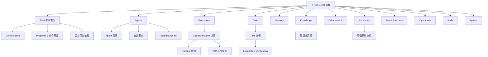

### 6.4 关键对象关系

图中箭头表示引用、派生或治理关系，不表示“左侧天然为真”或“拥有右侧 authority”。

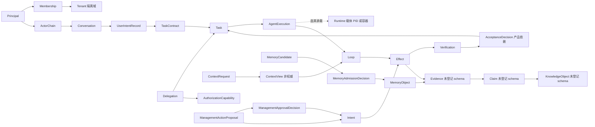

### 6.5 导航与对象定位规则

- 所有对象详情页顶部显示：类型、稳定 ID/强引用、版本、authority 来源、tenant/scope、`as_of`、权限摘要。
- 统一对象链接使用架构 §12.9 的命名空间作为**产品词汇**；必须注明这些 URI 族目前不是已登记 URI grammar。机器引用优先显示已登记强引用结构（见 §13.4）。
- 全局搜索只返回调用者可发现的对象摘要；“能发现”不等于“能读正文/调用”。打开对象时重新授权。
- 任意列表项可打开“来源与权限”侧栏，回答：该字段来自哪个 authority projection、何时更新、为何可见、何时失效。
- 桌面支持跨页面固定对象（pin）；移动端只保留最近对象和收藏，避免复杂多窗格。

---

<a id="sec-7"></a>
## 7. 默认首页：Agent Shell

### 7.1 桌面三栏工作区

| 区域 | 内容 | 安全语义 |
|---|---|---|
| 左栏（280–340 px） | 工作区/节点、Conversation 列表、搜索、创建 Conversation | 每个 Conversation 显示 tenant/scope；跨 workspace 切换会清空输入草稿中的资源引用并重新授权 |
| 中栏（弹性） | 消息流、系统状态卡、输入器、附件与资源引用、proposal/preview | Agent 生成内容与系统卡片使用不可混淆的渲染容器；Agent 文本不能生成系统操作控件 |
| 右栏（360–480 px） | 当前目标、Context 来源、权限、预算/deadline、Task/Execution/Effect 状态、后台任务 | 数据来自 authority projection；可折叠但高风险 proposal 打开时强制显示 |

移动端将三栏变为：主对话页 + 顶部 Conversation 切换 + 底部“任务/上下文”抽屉；审批打开独立全屏流程。

### 7.2 Conversation 切换

- Conversation 列表显示名称、scope、参与者关系、最近 Task 状态和最后授权更新时间，不显示无权读取的正文预览。
- 切换 Conversation 会创建/更新显式 `ConversationBinding`；不得隐式继承“最近对话”（架构 §6.1）。
- 如果参与关系版本陈旧或 Conversation 已 `revoked`，先显示重新绑定/重新授权流程，绝不静默复用旧 ContextView。
- 跨 tenant 切换执行“硬切换”：清空该窗口任务 store、Context cache、草稿附件 token、watch 订阅与管理通道；打开新工作区的独立 store。

### 7.3 多 Agent / 模型目标选择

输入器上方“目标”控件分三层：

1. **工作模式**：普通任务 / 管理（管理需显式进入，不能靠措辞切换）。
2. **Agent 目标**：Auto（由已授权 Operation/Catalog 选择）或具体 Installed Agent。
3. **模型偏好**：只有节点公开且用户有权选择时出现；它是执行偏好，不是 authority 或安全等级。

目标选择器同时显示 C0—C3 兼容等级与最大已验证风险级别 R0—R3，两者并排但绝不合并为一个分数（架构 §5.2、评审基线 V12）。

### 7.4 输入、附件和资源引用

- 支持文本、文件、图片（若节点/Agent 声明支持）、对象链接和资源引用。
- 附件先显示分类、tenant/scope、敏感度、预计出域与预算；用户确认后才形成受治理输入引用。
- `@` 引用只形成 `TargetSelector` 候选；写操作必须解析为唯一、固定版本强引用。歧义返回 `SHELL_TARGET_AMBIGUOUS`，不存在返回 `SHELL_TARGET_NOT_FOUND`。
- 粘贴或拖入的 Agent 文本、网页、日志、工具输出一律标为“不可信数据”，永不成为 capability、proposal 控制字段或系统卡片。

### 7.5 命令理解、歧义澄清与预览

从用户表达至执行前的 UI 顺序：

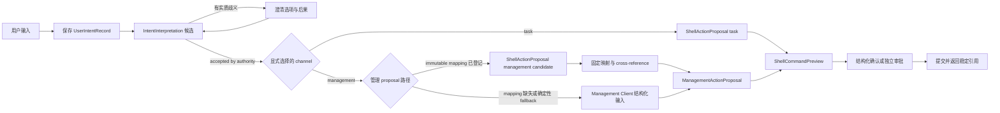

Channel 来自用户显式进入的任务/管理模式，不能由普通措辞自动升级。Task 路径使用 `ShellActionProposal`；管理路径以 `ManagementActionProposal` 为 broker 的 canonical 输入。当前两 schema 没有不可变 cross-binding：在 mapping 登记前，Shell 的 management candidate 不能提交，只能转入确定性 Management Client 重新形成结构化 proposal。

执行前卡片必须完整显示架构 §12.10 要求的信息。其数据来自**组合投影**：[shell-command-preview.schema.json](../../specs/schemas/shell-command-preview.schema.json) 提供目标/变化/假设/歧义/风险成本/验证/取消/补偿/过期与 preview digest；Task 路径的 `ShellActionProposal` 提供 channel、Effect/Risk、预算、deadline、confirmation/approval policy 与 proposal digest，管理路径则由 `ManagementActionProposal` 提供其已登记目标、参数、版本、idempotency、risk、binding 与 approval flags。当前 Preview schema 没有独立 egress、deadline 或 approval-reference 字段，管理 schema 也未覆盖全部 Shell preview 字段；缺失信息必须由未来契约提供，不能由客户端猜测。

### 7.6 Proposal、风险和预算

- Proposal 卡顶部显示通道（任务/管理）、风险 R0—R3、Effect class、目标数量、proposal digest 短码、有效期。
- 预算区分 token/费用/时间/迭代/工具调用（以实际 `budget` 投影为准，不虚构后端维度）；展示“已用/保留/剩余”。
- 任何目标版本、参数 digest、权限、预算、风险、deadline 或数据出域变化都会使旧 preview 标为 `SHELL_PREVIEW_STALE`，必须重新预览。
- 用户选择“修改范围”时产生 superseding proposal；旧 proposal、确认与 approval 失效，不在原卡上就地篡改。

### 7.7 结构化确认

- R0：禁止外部可观察写，但允许为治理与可追溯性产生内部 Event/TaskContract/Checkpoint 等记录；策略允许时自动提交，卡片事后可查。风险等级必须由服务端 policy/authority 计算或验证最低风险下界；客户端、Agent 或 proposal 不得把 R1—R3 降为 R0，风险上调会使旧 preview 失效。
- R1：在聊天中使用由 Console 自身渲染的结构化确认控件；显示 proposal digest 短码、一次性 number matching、有效期和明确动作。控件必须支持键盘/屏幕阅读器并宣告剩余时间；重发 challenge 会使旧 challenge 失效，可访问替代仍使用同一结构化、一次性、digest-bound 语义，不能降级为自由文本“同意”。
- R2/R3：聊天卡只显示通知与“在可信确认面打开”深链；不能在普通消息流中完成（详见 §11.3、§15.3）。
- 密码不能作为审批输入；生物识别手势本身也不是授权，只能解锁受信验证器执行的 passkey/FIDO2 流程。

### 7.8 后台任务、attach/detach 与 watch

- 提交后立即返回并固定显示稳定 command、Task、AgentExecution、Intent/Effect（如有）引用；前台等待与后台运行不改变生命周期。
- “移到后台”只关闭前台等待；`detach` 不取消任务、不转移所有权、不延长 capability。
- `attach` 必须重新认证和授权；只恢复当前权限下的观察/控制入口，不恢复旧 `PrivilegedManagementSession`、能力或执行所有权（`REQ-SHELL-ATTACH-001`）。
- 右栏 watch 显示 snapshot version、cursor、high-watermark、事件延迟、最后 ack 和订阅 expiry；断线恢复见旅程 12。

### 7.9 Context 来源和权限提示

“Context 来源”面板按 `ContextView` 的 loaded/rejected/loss 信息分组显示：

- 来源对象与强引用版本；
- `trust_level` 与 `role` 独立标签；
- 为何纳入/为何拒绝；
- scope、purpose、敏感度与出域；
- freshness、renderer/policy 版本；
- loss declaration（压缩/省略造成的信息损失）；
- “ContextView 非权威、短期有效”的固定提示（架构 §9、评审基线 V2/V6）。

用户无权读取的 Context 项只显示拒绝原因类别，不泄露对象正文、名称或存在性（视策略决定）。

### 7.10 错误、等待、取消与恢复

| 情形 | UI 行为 |
|---|---|
| `waiting` / `blocked` | 卡片必须回答 reason、等待对象/主体、下一 gate、剩余预算、deadline、安全动作 |
| `cancel_pending` | 明确“取消请求已提交，远端可能仍执行”；持续 watch Effect 与 Runtime |
| `CANCEL_TOO_LATE` | 显示不能再阻止执行，转向 reconcile/verify/compensate（若 Descriptor 支持） |
| `outcome_unknown` | 红线提示“禁止盲重试/换幂等键”，显示负责对账的主体与 Reconcile 入口 |
| `STATE_STORE_UNAVAILABLE` | 冻结 governed writes；不把本地/内存缓冲显示为 committed；保留 authority 提供的只读 inspect 与确定性 stop/revoke |
| `EFFECT_IDEMPOTENCY_CONFLICT` | 显示同键异参冲突；不自动换 key、改参、去重或创建新 Effect |
| `quarantined` | 显示具体状态域（Execution/Loop/Effect/Memory）及其是否终态，避免一词多义 |
| watch 断线 | 保留最后快照、冻结实时动画、显示 `as_of`；恢复后先快照再增量 |
| 客户端崩溃/重启 | 以稳定引用重新 attach；不从本地聊天记录推断任务状态 |

### 7.11 普通任务与管理通道的视觉及安全隔离

| 维度 | 普通任务通道 | 特权管理通道 |
|---|---|---|
| 入口 | 默认 Shell | 顶栏“进入管理模式”+强认证 |
| 外观 | 常规主题 | 固定管理横幅、独立窗口/场景、scope/risk ceiling/剩余 session 时间常驻 |
| 凭证 | AuthenticationSession | 独立 `PrivilegedManagementSession`（短期、有界、可撤销） |
| ContextView | task store | management store，禁止与任务 Context 合并 |
| 缓存 | Conversation/working/KV cache | 独立缓存与 isolation key；退出立即清除 |
| Proposal/Approval | ShellActionProposal（task） | ManagementActionProposal + 独立 Approval；不能跨通道复用 |
| 审计 | 任务审计绑定 | 管理审计绑定，独立 correlation |
| 失效 | Conversation 解绑 | idle/absolute expiry、撤销、重连/信任域变化均失效 |

管理通道可复用纯展示组件，但不得复用凭证、ContextView、缓存实例、proposal/approval store 或审计绑定（架构 §12.9、`REQ-SHELL-CHANNEL-001`、错误码 `SHELL_CHANNEL_BINDING_MISMATCH`）。

---

<a id="sec-8"></a>
## 8. 功能模块设计

本节中“操作”分三类：只读逻辑服务调用；改变治理状态的 proposal；以及对**既有固定 proposal** 生成 `ManagementApprovalDecision` 的 approve/deny/challenge 路径。第三类不是为审批决定递归创建新 proposal。三类都不代表客户端直接修改 authority 状态。模块的共同错误组件包含：安全拒绝（显示已登记 error code 与安全解释）、版本冲突（重新加载/重做预览）、节点不可达（最后快照）、权限变化（清缓存并重授权）。

### 8.1 Agent 目录与安装事务

| 维度 | 设计 |
|---|---|
| 目标 | 安全发现 AgentPackage，完成 Verify → Static Analysis → Adapter Selection → Sandbox Construction → Compatibility/Negative Tests → Profile Admission → Capability Ceiling → Installation Commit（架构 §5.1） |
| 主要页面 | Agent 目录；Package 详情；安装向导；安装事务详情；升级差异与回滚点 |
| 核心组件 | 发布者/签名/provenance 摘要、权限与出域声明、sandbox 要求、兼容目标、负例测试证据、逐阶段时间线、proposal 预览 |
| 对象模型 | `AgentPackageManifest`、`AgentCompatibilityReport`、`AgentInstallation`、ManagementActionProposal、Effect |
| 操作 | discover/inspect、install、upgrade、取消尚未 dispatch 的安装、查看 rollback point；卸载不得删除未决 Effect/审计/retention 对象 |
| 权限 | Tenant 管理员、平台运维、受限 Agent 发布者；安装 capability 与任务运行 capability 分离 |
| 状态 | 安装 companion 文本主路径 `SUBMITTED→VERIFIED→ANALYZED→ADAPTED→TESTED→ADMITTED→COMMITTED` 只作**流程标签**，每一阶段还允许进入 `REJECTED` 或 `QUARANTINED`；当前无安装 transition table。持久 `AgentInstallation.state` 仅 `committed/disabled/removing/removed/quarantined` |
| 空状态 | “目录中没有当前 scope 可发现的 Agent”；提供导入包（如策略允许）或切换目录入口 |
| 错误状态 | `AGENT_PACKAGE_VERIFICATION_FAILED`、`AGENT_ADAPTER_BYPASS_DETECTED`、`AGENT_COMPATIBILITY_DEGRADED`；显示哪个平台/通道证据不足，不泛化到其他平台 |
| 移动差异 | 只对远程节点发起安装；采用摘要→风险→审批的逐步流程，不展示本地包拖放 |
| 产品依赖 | 安装事务 transition table、installer/sandbox/adapter 实现、目录服务、host/channel-specific 负例证据均待实现 |

### 8.2 Installed Agent 与兼容性报告

| 维度 | 设计 |
|---|---|
| 目标 | 查看已提交 installation、版本、能力上限、降级项、平台证据和更新状态 |
| 主要页面 | Installed Agents 列表；Agent 详情；版本历史；兼容性报告；配置/能力 ceiling |
| 核心组件 | C0—C3 等级、R0—R3 最大已验证风险并排矩阵；feature `supported/degraded/unsupported`；hidden state、checkpoint、Conversation isolation、effect recovery、negative tests |
| 对象模型 | `AgentInstallation`、`AgentCompatibilityReport`、`AgentPackageManifest` |
| 操作 | inspect、配置 proposal、enable/disable（若后端定义）、upgrade/remove、查看回滚点 |
| 权限 | 终端用户只读自己可用的 Agent；管理写操作需管理通道 |
| 状态 | 持久 installation 状态严格取 schema enum；兼容性 feature 状态严格取 `supported/degraded/unsupported` |
| 空/错状态 | 未安装；报告缺失；报告过期；包版本与报告 digest 不匹配；一律缩小声明，不能“推测支持” |
| 移动差异 | 卡片化摘要；完整证据表通过只读详情/导出打开 |
| 产品依赖 | 兼容性 feature 当前是自由 map，缺 host OS/kernel/runtime/interception 标准矩阵；Console 只展示节点提供内容 |

**正交展示规则**：不得显示“C3/R3 = 最高等级”一类合并徽章。C3 只说明原生集成；R3 说明具身/安全关键风险门禁，两轴分别展示。

### 8.3 AgentExecution 与 Runtime 载体

| 维度 | 设计 |
|---|---|
| 目标 | 清晰区分跨重启逻辑身份 `AgentExecution` 与瞬时 PID/容器/进程 Runtime 载体 |
| 主要页面 | Executions 列表；Execution 详情；Runtime 载体标签页；Checkpoint/恢复；未决 Effect |
| 核心组件 | 双层身份卡、五状态带、fencing epoch、节点/载体历史、资源趋势、Checkpoint、pending Effects |
| 对象模型 | `AgentExecutionBinding`、`ExecutionContext`、`ActivityContext`、`LoopCheckpoint`；Runtime 载体 schema **未登记** |
| 操作 | attach、pause、resume/readmission、checkpoint、migrate、cancel Task、stop Runtime、terminate Execution、fence writer、reconcile Effect |
| 权限 | 用户可控自己的 Execution；Tenant 管理员限 tenant scope；平台运维可控载体但默认无任务正文 |
| 状态 | AgentExecution 只用 transition table 的 `CREATED/ADMITTED/RUNNABLE/WAITING/CHECKPOINTED/RECOVERING/SUSPENDED/QUARANTINED/TERMINATED`；Runtime 显示“载体状态（产品依赖）”，不得混入 Execution 状态 |
| 空/错状态 | Execution 暂无载体是合法状态（等待/检查点/迁移）；Runtime 遥测缺失不等于 Execution 终止；远端不可达不等于停止 |
| 移动差异 | 只显示远端载体摘要和安全控制；无本机进程管理入口 |
| 产品依赖 | 完整 AgentExecution schema、RuntimeSession/载体 schema、停止结果契约、Checkpoint/恢复后端待实现 |

页面禁止出现通用“Kill Agent”按钮。危险操作菜单拆成“请求取消 Task”“停止当前 Runtime 载体”“Fence writer”“对账未决 Effect”“终止 AgentExecution”，逐项显示不能保证的事项。

### 8.4 Task / Loop / Effect / Verification

| 维度 | 设计 |
|---|---|
| 目标 | 并列呈现业务任务、控制循环、外部效果与验证，不用单一进度覆盖它们 |
| 主要页面 | Task 看板；Task 详情；Loop 时间线；Effect 账本；Verification 证据 |
| 核心组件 | 五状态机条带、TaskContract 条件/预算、Loop gate、Effect idempotency/receipt/reconcile、Verification freshness、Acceptance 提示 |
| 对象模型 | `TaskContract`、`LoopCheckpoint`、`Effect`、`VerificationReport`、五 transition tables |
| 操作 | wait/watch、request cancel、pause Execution、reconcile、verify、compensate（单独 Effect）、quarantine、escalate |
| 权限 | 所有控制动作按对象 scope 与 capability；compensate 必须独立授权 |
| 状态 | 严格使用 §10 的五组机器状态；Task `COMPLETED` 仅由 acceptance authority 推进 |
| 空状态 | 无活动任务；无 Effect 是合法的纯观察任务；未请求 Verification 显示 `NOT_REQUESTED` |
| 错误状态 | `STATE_CONFLICT`、`STATE_STALE_OBSERVATION`、`EFFECT_OUTCOME_UNKNOWN`、`EFFECT_RECOVERY_QUARANTINED`、`CANCEL_PENDING`、`CANCEL_TOO_LATE` |
| 移动差异 | 默认显示用户友好摘要；向下展开五条状态和证据，不省略关键差异 |
| 产品依赖 | Task/AgentExecution/Verification lifecycle carrier、AcceptanceDecision、reconciliation report 等 schema/服务待实现 |

### 8.5 Memory

| 维度 | 设计 |
|---|---|
| 目标 | 管理候选、写者工作集、准入、冲突、失效与删除，避免把 Memory 当聊天记录或 Knowledge |
| 主要页面 | Candidate 收件箱；即时工作集；Admitted Memory；冲突；Stale/Quarantine；Deletion |
| 核心组件 | scope/purpose/retention、来源证据、冲突集、准入决定、派生/替代关系、删除影响预览 |
| 对象模型 | `MemoryCandidate`、`MemoryAdmissionDecision`、`MemoryObject` |
| 操作 | propose、admit/reject/review/quarantine、promote、invalidate、tombstone/delete request |
| 权限 | 用户管理自己的 scope；准入者按 policy；管理员默认无正文，只能管理策略/队列元数据 |
| 状态 | UI 必须区分：candidate（`proposed`）、工作集即时可见（产品投影）、`admitted`、conflict（关系状态）、stale（freshness 派生）、`quarantined`、`invalidated`、deleted（映射 `tombstoned`）；`expired` 单列 |
| 空状态 | “暂无候选”；解释异步准入和 read-your-write，不把空队列当同步完成 |
| 错误状态 | `MEMORY_ADMISSION_DENIED`、`MEMORY_SCOPE_PROMOTION_REQUIRED`、`MEMORY_DERIVATION_INVALIDATED` |
| 移动差异 | 候选审阅与删除影响摘要；复杂冲突比较建议在桌面打开 |
| 产品依赖 | 无 memory transition table；私有 pending-working-set carrier、writer/Activity/Conversation/TTL 字段未在 schema 中完整表达 |

删除语义：物理删除、tombstone、retention/legal hold、派生失效必须分开。Console 先展示影响图，再提交删除 proposal；不得承诺已从所有派生、缓存和备份即时消失。

### 8.6 Knowledge lineage graph

| 维度 | 设计 |
|---|---|
| 目标 | 展示 Evidence → Claim → KnowledgeObject 的来源、支持、冲突、替代、派生和失效传播；不暗示图中内容天然为真 |
| 主要页面 | Knowledge 搜索；Claim 详情；Evidence 查看；谱系图；冲突与 invalidation 影响 |
| 核心组件 | 节点类型/状态、边语义、来源 authority、valid time、confidence method、冲突并列、失效影响预览 |
| 对象模型 | Evidence、KnowledgeClaim、KnowledgeObject、KnowledgeCompilationProfile —— **当前均无机器 schema**；RFC-0001 §9 / 架构 §18.3 仅为 prose/pseudo-schema |
| 操作 | query、inspect lineage、比较冲突、请求 invalidate、查看 derived objects；不提供“设为真”按钮 |
| 权限 | 发现/摘要权限与读取正文/导出权限分离；跨 tenant 谱系边在目标域本地重授权 |
| 状态 | 建议产品投影：candidate/published/conflicted/stale/quarantined/invalidated（明确标为产品建议，不冒充已登记状态机） |
| 空状态 | 没有知识对象；没有可见 Evidence；图被权限裁剪时显示“部分谱系不可见”而不泄露节点 |
| 错误状态 | 已登记 `KNOWLEDGE_SOURCE_INVALIDATED`、`KNOWLEDGE_POISON_QUARANTINED`、`KNOWLEDGE_MAINTENANCE_BOUNDED` |
| 移动差异 | 图谱降级为“当前节点 + 支持/冲突/派生”邻接列表；可深链到桌面 |
| 产品依赖 | 知识对象/Claim/Evidence schema、知识 authority、编译/维护服务与审计契约待实现 |

图谱视觉语义：实线“supports”、双向冲突边“contradicts”、有向“supersedes/derived_from”、虚线“source/provenance”；每个 Claim 均显示“断言，不等于事实”标签。

### 8.7 Users、Tenant、Membership、Delegation、Capability

| 维度 | 设计 |
|---|---|
| 目标 | 管理主体、租户关系、资源范围、可衰减授权委派与短期 capability |
| 主要页面 | Principals；Tenant；Membership；角色/策略视图；AuthorizationDelegation；Capability 检视与撤销 |
| 核心组件 | ActorChain、Membership 期限/版本、scope、purpose、actions、参数约束、lease、delegation depth、revocation epoch |
| 对象模型 | `Principal`、`Membership`、`ActorChain`、`ResourceScope`、`AuthorizationDelegation`、`AuthorizationCapability` |
| 操作 | invite/disable Membership proposal、委派（只能衰减）、撤销、inspect effective access、模拟只读解释 |
| 权限 | Tenant 管理员限本 tenant；平台运维限 platform governance；用户查看自己的链 |
| 状态 | Membership/Conversation 等 schema enum 原样呈现；Capability 的有效/过期/撤销由 authority projection 派生，不在客户端判定 |
| 空/错状态 | 无 Membership；策略版本陈旧；委派扩大被 `AUTH_CAPABILITY_ATTENUATION_VIOLATION` 拒绝；过期为 `AUTH_CAPABILITY_EXPIRED` |
| 移动差异 | 以审批/撤销和到期提醒为主；批量成员管理限桌面 |
| 产品依赖 | standalone Tenant/ShareGrant schema、AuthorizationDecision schema 和 IdP 集成待实现 |

### 8.8 Multi-Agent Collaboration

| 维度 | 设计 |
|---|---|
| 目标 | 透明呈现多 Agent 委派、协作消息、handoff、verifier 和冲突升级，不把消息当共享 state authority |
| 主要页面 | 协作拓扑；Delegation 详情；handoff 队列；冲突集；升级记录 |
| 核心组件 | 父/子 Task、显式任务范围、可见数据、预算 grant、deadline、Capability 衰减、verifier、handoff 条件、升级路径、消息 provenance |
| 对象模型 | 分布式 `Delegation` 与治理 `AuthorizationDelegation`（二者不可混同）、Task、Capability、Checkpoint；现有 `delegation.schema.json` 只直接覆盖 Task/Capability refs、budget、data visibility、deadline、depth |
| 操作 | delegate、accept/reject delegation、handoff、request verifier、escalate conflict、revoke child capability |
| 权限 | 委派者不能授予自身没有的权限/预算；每个 trust-domain hop 本地重授权 |
| 状态 | 子 Agent 的 `completed` 只是一条 claim；父 Task 仍需独立 Verification/Acceptance |
| 空/错状态 | 无协作者；远端分区；消息冲突；budget/deadline 到期；显示“远端状态未证实” |
| 移动差异 | 只看协作摘要、阻塞与升级；拓扑图简化为父子列表 |
| 产品依赖 | 显式 task-scope、verifier、handoff condition、escalation path，以及 Lease、Mailbox、ConflictSet schema 和完整分布式后端均待实现；多 Agent 属架构 §21 Phase 5 |

每条 Delegation 详情必须固定展示八项：任务范围、可见数据、预算、deadline、Capability 衰减、verifier、handoff 条件、升级路径。

### 8.9 Approval Center

| 维度 | 设计 |
|---|---|
| 目标 | 集中处理 proposal、去重/聚合、风险路由、独立审批与健康指标 |
| 主要页面 | 待我审批；我发起的；已处理；过期/挑战；审批健康；可信确认全屏页 |
| 核心组件 | 固定 proposal digest、目标/版本/差异、风险、发起 ActorChain、deadline、重复聚合、独立性检查、验证器状态 |
| 对象模型 | `ManagementActionProposal`、`ManagementApprovalDecision`、`PrivilegedManagementSession`；通用 Approval Request/队列 schema 未登记 |
| 操作 | approve/deny/challenge、要求缩小范围（生成 superseding proposal）、稍后处理、举报轰炸 |
| 权限 | R2/R3 的 approve 使用独立 principal；提案者不能自批；R3 双人审批为架构基线但 quorum machine contract 待实现 |
| 状态 | Decision enum `approve/deny/challenge/expired`；分发/待处理状态为产品投影，标记“未登记/产品依赖” |
| 空/错状态 | 空收件箱；proposal 过期/版本漂移；session 撤销；重复请求被聚合；无可信验证器 |
| 移动差异 | Inbox 为一级入口；R2/R3 深链到系统浏览器/原生可信流程；推送本身不能批准 |
| 产品依赖 | §12.12 队列、分发、反疲劳、R1 number matching、passkey 绑定、R3 quorum 的 REQ/向量尚未登记 |

### 8.10 Operation Catalog

| 维度 | 设计 |
|---|---|
| 目标 | 在权限过滤后发现、解释、匹配和固定 Operation，展示风险/数据/实时类与替代方案 |
| 主要页面 | Catalog 浏览；OperationSummary；Match Report；Descriptor 详情（若后端提供）；Binding 预览 |
| 核心组件 | 已登记 Summary/Snapshot/MatchReport 可提供 semantic name/version/digest、I/O 摘要、effect/risk/realtime class、availability 与 top-k 结果；`data_class`、`approval_hint`、typed precondition/rationale/approval 差异及 reconcile/compensation 细节来自完整 Descriptor/companion prose，当前 schema 不完整 |
| 对象模型 | `OperationSummary`、`OperationCatalogSnapshot`、`OperationMatchReport`；完整 `OperationDescriptor` 与 InvocationBinding schema 未登记 |
| 操作 | discover、describe、match、bind、dry-run/validate-only（仅在 Descriptor 声明时） |
| 权限 | 发现结果不是 capability；打开正文、绑定、调用分别重新授权 |
| 状态 | availability `available/degraded/unavailable/retired`；match `selected_candidate/inconclusive/no_authorized_candidate/dry_run_required/escalate` |
| 空/错状态 | 无授权候选；Catalog 版本陈旧；匹配不确定；`CATALOG_VERSION_STALE`、`CATALOG_MATCH_INCONCLUSIVE`、`NO_AUTHORIZED_OPERATION_CANDIDATE` |
| 移动差异 | 以只读 inspect 和批准绑定为主；复杂 schema 浏览限桌面 |
| 产品依赖 | 完整 Descriptor/InvocationBinding 契约、上述缺失的 typed match/approval 字段与 Catalog 后端待实现 |

### 8.11 Audit / Evidence

| 维度 | 设计 |
|---|---|
| 目标 | 追溯 principal → Task/Context/Intent → authorization → receipt → reconcile → verification → Event/result state |
| 主要页面 | 审计搜索；对象时间线；Effect 证据链；审批链；导出申请；异常审计 |
| 核心组件 | ActorChain、tenant/scope、policy/membership/revocation 版本、correlation/causation、版本/digest、Evidence 引用、保留策略 |
| 对象模型 | `Event`、`StateTransitionRecord` 及对象引用；**无专用 AuditRecord/Evidence schema** |
| 操作 | 查询、固定过滤器、验证链完整性（由后端结果）、请求导出；不得在客户端“修复”审计 |
| 权限 | 审计员只读；正文导出与审计元数据读取分权；导出自身被审计 |
| 状态 | authority committed history 与可丢遥测分栏；遥测缺口不能覆盖审计缺口 |
| 空/错状态 | 无授权结果；链不完整；导出被拒；审计服务不可用（当前无已登记专用错误码，显示“未登记错误/产品依赖”） |
| 移动差异 | 只显示关键安全事件和简化证据链；大规模检索/导出限桌面 |
| 产品依赖 | AuditRecord、证据链/导出 schema、审计服务与不可用语义均待实现 |

### 8.12 System Health、ResourceGraph、配置与更新

| 维度 | 设计 |
|---|---|
| 目标 | 查看节点就绪度、组件健康、资源/放置、配置版本、客户端/节点更新与诊断 |
| 主要页面 | 节点总览；健康；ResourceGraph；配置；Profile；更新；诊断包 |
| 核心组件 | `MANAGEMENT_READY/USER_READY/OPERATIONAL`、authority 可用性、watch 延迟、资源容量、版本兼容、更新签名/渠道 |
| 对象模型 | `ResourceGraph`、`WorldState`、`PlacementManifest`、`ProfileManifest`、`PerformanceReport` |
| 操作 | inspect、配置 proposal、组件 stop/fence/restart proposal、更新/回滚 proposal、导出脱敏诊断 |
| 权限 | 平台运维为主；Tenant 管理员仅 tenant 配额/健康投影；审计员只读 |
| 状态 | 健康与 readiness 分离；`MANAGEMENT_READY` 是合法降级，不显示为失败；资源观测带 freshness |
| 空/错状态 | 组件未声明；遥测缺口；authority 不可达；配置版本冲突；更新签名失败 |
| 移动差异 | 健康摘要、严重告警和受限安全操作；配置编辑与 ResourceGraph 全图限桌面 |
| 产品依赖 | 节点健康/配置/更新逻辑服务、Profile 实例、PerformanceReport 实例均待实现 |

---

<a id="sec-9"></a>
## 9. 关键用户旅程

图中的 API/服务名均为**逻辑角色**，不代表仓库中已存在具体 endpoint 或实现。

### 9.1 首次启动、连接节点和身份认证

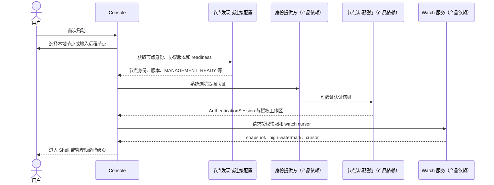

失败出口：节点身份不匹配时阻断连接；协议不兼容时显示 `VERSION_UNSUPPORTED`；认证成功但正文权限不足时仍可进入元数据受限视图，不把认证等同授权。

### 9.2 用户从 Shell 创建长任务

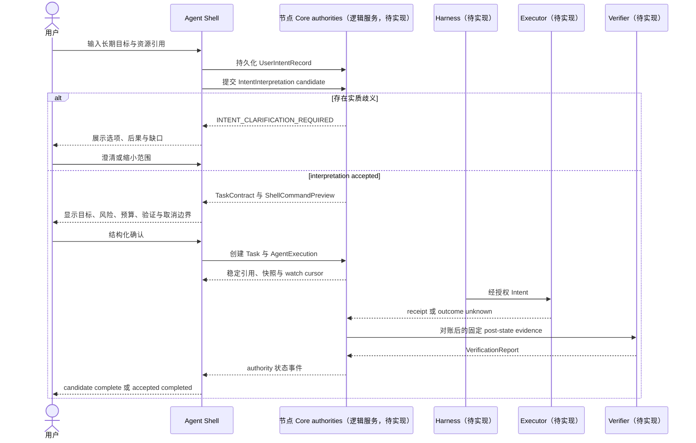

Shell 可随时 detach；任务继续。重新 attach 仅恢复当前授权下的观察权。

### 9.3 管理员安装/升级 Agent 并查看兼容性和回滚点

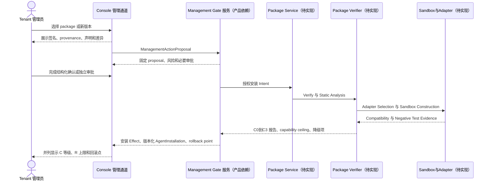

升级产生新 installation 版本；失败或降级不会静默覆盖旧版本。各 OS/sandbox 证据只对其明确平台有效。

### 9.4 查看 AgentExecution，停止 Runtime 但继续对账未决 Effect

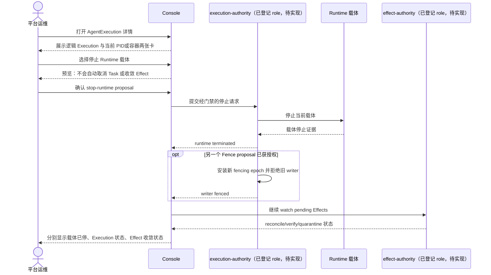

Console 只有在对应 authority 投影证实后才显示“载体已停止”“writer 已 fence”“Effect 已对账”；三个结论互不替代。

### 9.5 `OUTCOME_UNKNOWN` 调查、reconcile 和 quarantine

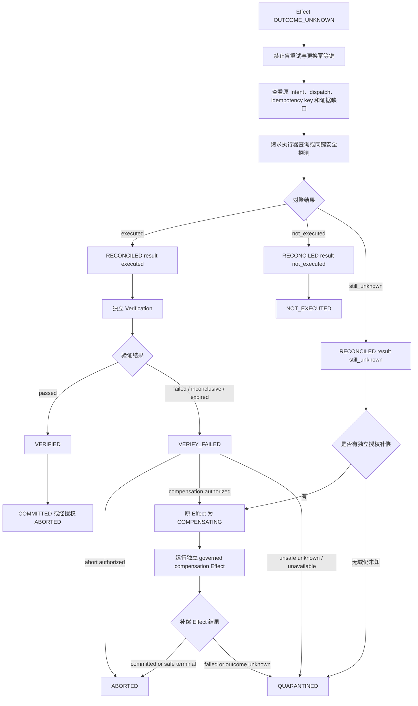

`OUTCOME_UNKNOWN` 不能直接跳到 `COMMITTED`、`NOT_EXECUTED` 或 `QUARANTINED`；必须先按 [effect.transitions.json](../../specs/transitions/effect.transitions.json) 进入带结果元数据的 `RECONCILED`。

### 9.6 记忆 candidate 的查看、准入、冲突和删除

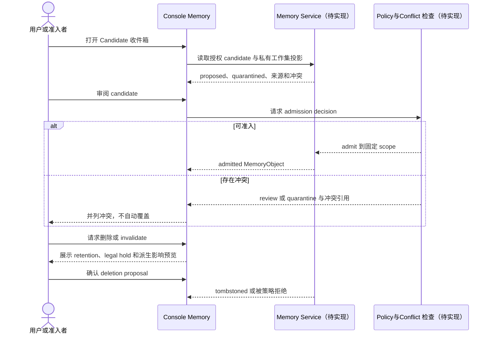

候选在准入前只在写者的私有工作集即时可见（`REQ-MEM-ADMIT-002`），不得跨 Conversation/scope 泄露；该私有工作集尚缺完整机器 schema。

### 9.7 查看知识 Claim 的证据、冲突与 invalidation

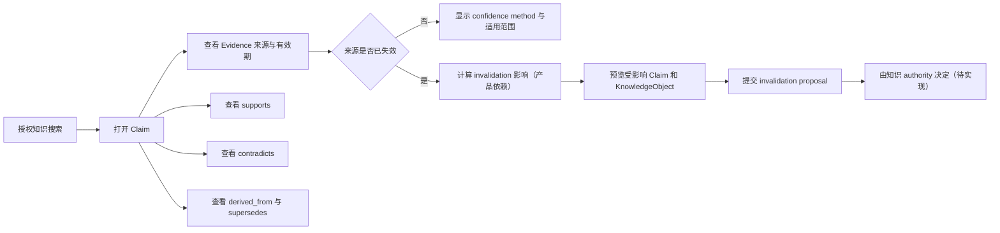

图谱每个节点都显示“来源/断言/发布对象”类型与有效期；关系只表示支持、冲突、替代或派生，不表示真值。Knowledge/Claim/Evidence 当前无机器 schema，此旅程是产品目标与后端依赖。

### 9.8 多 Agent 委派、handoff 和 verifier

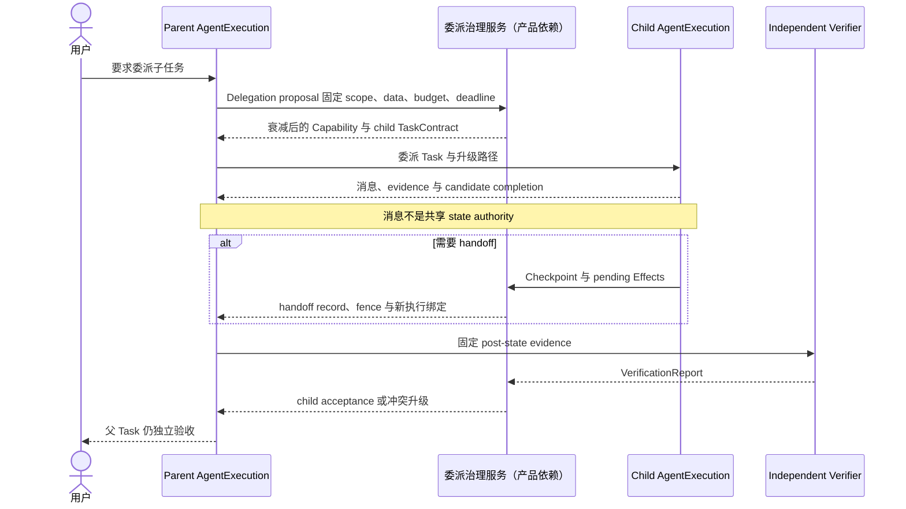

委派详情始终展示 scope、可见数据、预算、deadline、Capability 衰减、verifier 和升级路径；子 Agent 的“完成”不能直接完成父 Task。

### 9.9 R1 聊天内结构化确认

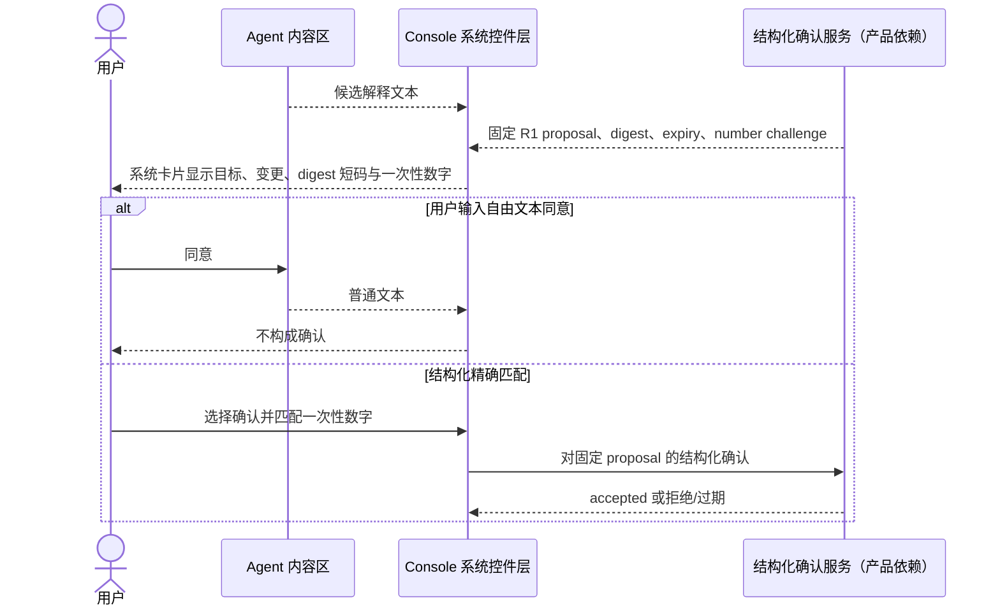

R1 number matching、独立通道身份和防疲劳细节来自架构 §12.12 / IMP-05，目前尚未登记 REQ/向量，标为**产品依赖**。

### 9.10 R2/R3 可信确认和双人审批

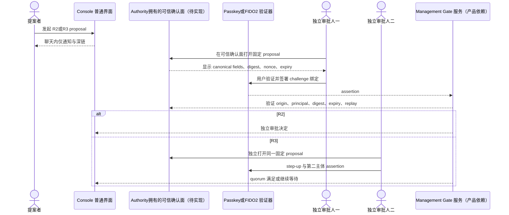

生物识别只可解锁验证器，不能被描述为授权本身。普通 passkey 能绑定 challenge/digest，但不能单独证明任意 proposal 文本被正确显示，因此 R2/R3 必须使用 authority 拥有、Agent 不可写入的确认面，并在服务端校验 canonical proposal（实现与 machine contract 均为产品依赖）。

### 9.11 移动端收到通知后安全打开固定 proposal

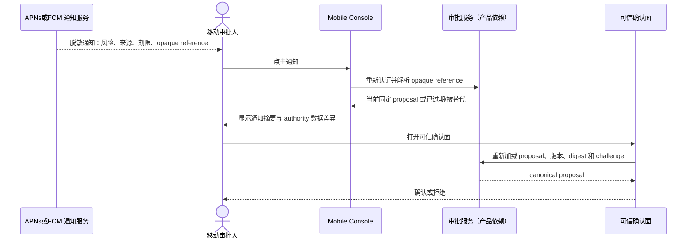

推送只是可能丢失/延迟/重复的提示，不是后台执行或可靠唤醒机制；iOS force-quit 等场景不得假设可送达。Payload 不携带正文、凭证或可直接批准的 token。Deep link 使用短期、single-use、高熵 opaque handle，并在服务端绑定 principal、app/environment、workspace、audience、proposal ID/version 与 expiry；它只负责导航，不能构成 approval。应用回到前台后必须重新认证、resnapshot 并从 authority 解析 handle。若 proposal 已 superseded/expired，必须显示新旧差异并禁止旧确认。

### 9.12 Watch 断线、快照恢复和 cursor 续接

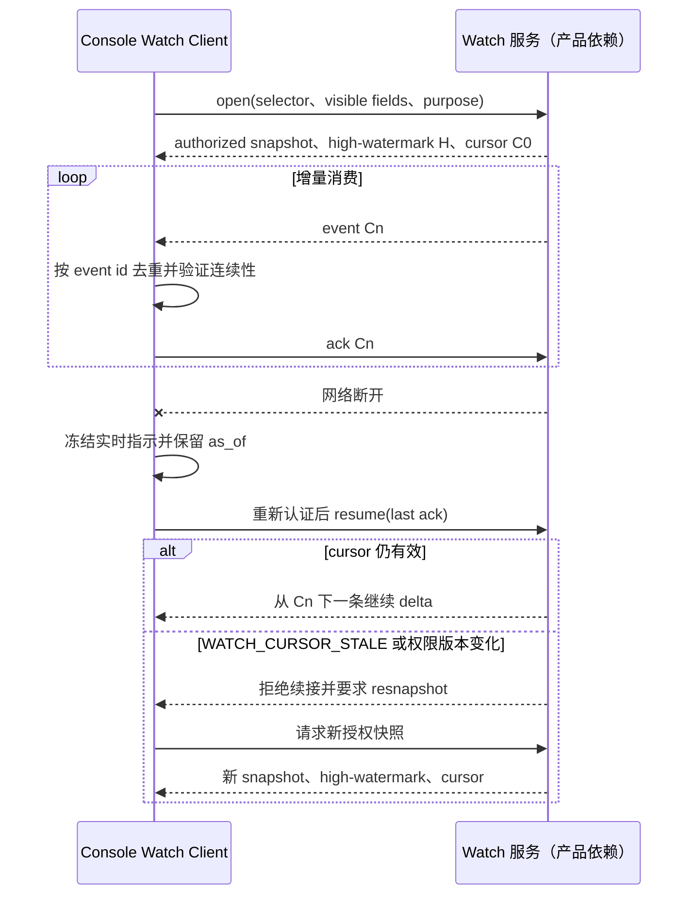

任何缺口都 fail closed：Console 不得丢失 governed event 后继续宣称连续；只能合并非权威进度事件（架构 §12.11、`REQ-SHELL-WATCH-001`、向量 `SHELL-WATCH-RESUME-006`）。

---

<a id="sec-10"></a>
## 10. 状态和操作语义

### 10.1 唯一状态来源

五个状态域及 authority 角色来自 [state-domains.yaml](../../specs/registry/state-domains.yaml)，各域状态闭集与合法迁移来自对应 v0.1 Draft transition table：

| 状态域 | Authority 角色 | Transition table |
|---|---|---|
| `agent-execution` | `execution-authority` | [agent-execution.transitions.json](../../specs/transitions/agent-execution.transitions.json) |
| `task` | `task-acceptance-authority` | [task.transitions.json](../../specs/transitions/task.transitions.json) |
| `loop` | `execution-authority` | [loop.transitions.json](../../specs/transitions/loop.transitions.json) |
| `effect` | `effect-authority` | [effect.transitions.json](../../specs/transitions/effect.transitions.json) |
| `verification` | `verification-authority` | [verification.transitions.json](../../specs/transitions/verification.transitions.json) |

Console 不自行推导或推进状态；只消费 authority projection。状态域 registry 是 open registry，但每个已登记域的状态集合由 pinned transition table 关闭；客户端不得发明替代状态或迁移边。

### 10.2 五状态机：机器状态与用户标签

#### 10.2.1 AgentExecution State

| 机器状态 | 用户标签 | 终态 | UI 解释 |
|---|---|---|---|
| `CREATED` | 已创建 | 否 | 逻辑执行身份已存在，尚未准入 |
| `ADMITTED` | 已准入 | 否 | policy/预算已准入，尚未进入可调度 |
| `RUNNABLE` | 可调度 | 否 | authority 允许调度；不等于 Runtime 正在占用 CPU |
| `WAITING` | 等待中 | 否 | 等待依赖、预算预留或背压解除 |
| `CHECKPOINTED` | 已检查点 | 否 | continuation 已关闭，未决 Effect 已记录 |
| `RECOVERING` | 恢复中 | 否 | 使用新 fencing epoch 恢复并对账 |
| `SUSPENDED` | 已暂停 | 否 | 禁止新 Activity dispatch；恢复必须重新准入 |
| `QUARANTINED` | 执行已隔离 | 否 | 正常 dispatch 禁用；只能对账恢复或终止 |
| `TERMINATED` | 执行已终止 | 是 | 逻辑执行生命周期结束；不等于 Task 已完成 |

#### 10.2.2 Task State

| 机器状态 | 用户标签 | 终态 | UI 解释 |
|---|---|---|---|
| `DRAFT` | 草拟中 | 否 | TaskContract 尚未被接受 |
| `READY` | 已就绪 | 否 | 契约与 acceptance criteria 已固定 |
| `ACTIVE` | 进行中 | 否 | 已有 admitted execution 推进工作 |
| `BLOCKED` | 已阻塞 | 否 | 依赖、审批或资源条件未满足 |
| `CANDIDATE_COMPLETE` | 候选完成 | 否 | Agent 声称完成且已请求验证；**尚未验收** |
| `COMPLETED` | 已验收完成 | 是 | 当前 Verification 通过且 acceptance authority 已提交决定 |
| `FAILED` | 失败 | 是 | 不可恢复或验收不可能/终局失败 |
| `CANCELLED` | 已取消 | 是 | 经授权取消且相关未决 Effect 已关闭/隔离 |
| `ESCALATED` | 已升级处理 | 是 | 当前 Task 交由升级路径处理；不是完成 |

#### 10.2.3 Loop State

| 机器状态 | 用户标签 | 终态 | UI 解释 |
|---|---|---|---|
| `START` | 循环启动 | 否 | 固定 TaskContract 与预算 |
| `OBSERVE` | 收集观察 | 否 | 记录可用观察/evidence |
| `RESOLVE` | 解析 Context | 否 | 关闭所需 Context 并授权 |
| `ORIENT` | 形成态势 | 否 | 固定决策输入 |
| `DECIDE` | 决策中 | 否 | 形成有界 proposal |
| `ACT` | 执行动作 | 否 | 经授权 Effect 正在推进 |
| `VERIFY` | 验证进展 | 否 | 对固定 post-state 请求 Verification |
| `CONTINUE` | 准备下一轮 | 否 | 已验证有进展且预算仍允许 |
| `DIAGNOSE` | 诊断中 | 否 | 验证失败/不确定/停滞后的诊断 |
| `WAIT` | 循环等待 | 否 | 等待外部事件、依赖或审批 |
| `QUARANTINE` | 循环隔离 | 否 | 禁止正常迭代，只能进入 `RECONCILE` |
| `RECONCILE` | 循环对账 | 否 | 解析不确定事实并重新授权 |
| `ESCALATE` | 循环升级 | 否 | 等待 handoff 记录后进入 `END` |
| `STOP` | 循环停止中 | 否 | 已有 acceptance commit，等待 stop record |
| `END` | 循环结束 | 是 | Loop 已结束；本身不替代 Task acceptance |

#### 10.2.4 Effect State

| 机器状态 | 用户标签 | 终态 | UI 解释 |
|---|---|---|---|
| `PROPOSED` | 效果已提议 | 否 | Intent/参数/幂等绑定待授权 |
| `AUTHORIZED` | 效果已授权 | 否 | 允许 dispatch，尚未证明执行 |
| `DENIED` | 效果被拒绝 | 是 | 本请求的拒绝决定为终局 |
| `EXECUTING` | 效果执行中 | 否 | 已 dispatch；等待可验证执行事实 |
| `EXECUTED` | 执行器报告已执行 | 否 | receipt 匹配；尚需对账/验证/提交 |
| `OUTCOME_UNKNOWN` | 执行结果未知 | 否 | 可能已执行；禁止盲重试 |
| `RECONCILED` | 已对账 | 否 | 迁移边 metadata 为 `executed/not_executed/still_unknown` 之一；当前 `effect.schema.json` 无对应 typed carrier 字段，reconciliation report schema 也未登记 |
| `VERIFIED` | 后置条件已验证 | 否 | 当前 Verification 通过；尚未 commit |
| `VERIFY_FAILED` | 后置条件未通过 | 否 | 可 abort、独立授权补偿或隔离 |
| `COMPENSATING` | 补偿中 | 否 | 独立 governed Effect 正在补偿 |
| `NOT_EXECUTED` | 确认未执行 | 是 | 有 authority 认可的未执行证据 |
| `COMMITTED` | 效果已提交 | 是 | verification 与 expected version 当前，commit authority 已决定 |
| `ABORTED` | 效果已中止 | 是 | 不再 commit；需结合证据判断外部残留 |
| `QUARANTINED` | 效果已隔离 | 是 | 本表版本中的终态；不确定/不安全残留被隔离 |

#### 10.2.5 Verification State

| 机器状态 | 用户标签 | 终态 | UI 解释 |
|---|---|---|---|
| `NOT_REQUESTED` | 未请求验证 | 否 | 尚无固定 subject/criteria/post-state |
| `PENDING` | 等待验证 | 否 | 已固定请求，正在收集证据 |
| `EVIDENCE_READY` | 证据已就绪 | 否 | 授权、闭合、fresh evidence set 可判定 |
| `PASSED` | 验证通过（当前） | **否** | 可因 post-state 变化、证据失效或 verifier 撤销进入 `EXPIRED` |
| `FAILED` | 验证失败 | 是 | 至少一项必要标准失败 |
| `INCONCLUSIVE` | 验证不确定 | 是 | 证据不足/冲突/无法判定 |
| `EXPIRED` | 验证已过期 | 是 | 绑定或 evidence 不再当前 |

`PASSED` 故意不是终态；Console 必须显示“当前有效至何时/绑定何版本”，不得用永久绿色勾暗示永不失效。

### 10.3 五状态机并列呈现

每个 Task/Execution 详情页固定提供“生命周期五轨”组件：

```text
AgentExecution  RUNNABLE       可调度        [authority: execution-authority]
Task            BLOCKED        已阻塞        [等待 approval://…]
Loop            WAIT           循环等待      [next gate: approval]
Effect          OUTCOME_UNKNOWN 结果未知      [reconcile owner: …]
Verification    NOT_REQUESTED   未请求验证    [等待 Effect 对账]
Runtime         carrier-2      载体不可达     [非状态机，仅载体遥测]
```

设计规则：

- 五轨总是同时可见；无实例时显示“无关联对象”，不省略该概念。
- Runtime 载体放在第六条、明确标记“非五状态机”；PID/容器状态不能覆盖 AgentExecution。
- 每轨显示机器状态、中文标签、authority、对象版本、`as_of`、reason code、证据链接。该信息需要 `ShellStatusView` 与 lifecycle/transition projection 的组合；后者的完整 carrier/API 当前是产品依赖。
- 总览页可给出“需要关注”的摘要，但摘要永远不能取代五轨详情，也不能出现单一“Agent 状态”字段。

### 10.4 ShellStatusView 与机器状态

[shell-status-view.schema.json](../../specs/schemas/shell-status-view.schema.json) 的用户投影枚举为：

`queued | runnable | waiting | blocked | cancel_pending | outcome_unknown | quarantined | candidate_complete | completed | failed | cancelled | escalated`

这些是 authority 派生的 Shell 投影，不是第六个执行状态机。Console **只显示 authority 给出的投影**，不在客户端用日志或五状态机组合自行计算。`ShellStatusView` 自身含 `status` 与 `derived_from_refs`，但不含 authority、domain 或底层机器状态字段；五轨必须通过另一个已授权 lifecycle/transition projection 补齐（契约待实现），不能从 `derived_from_refs` 在本地猜测。

### 10.5 每个非终态必须回答的问题

每个非终态卡片必须完整显示以下字段（架构 §12.10、§12.11；[shell-status-view.schema.json](../../specs/schemas/shell-status-view.schema.json)）：

| 用户问题 | UI 字段 | 规则 |
|---|---|---|
| 当前由谁认定为何状态？ | lifecycle/transition projection 的 authority、对象、机器状态、版本，以及 Shell view 的 `as_of` | `ShellStatusView` 单独不含 authority/domain/machine state；不允许以 Agent 自述替代 |
| 为什么没推进？ | `reason_code` + 安全解释 | reason code 必须保留原值；本地化文本不可覆盖机器码 |
| 正在等谁/什么？ | `waiting_on` / wait condition | 对象不可见时只显示安全类别 |
| 下一道门是什么？ | `next_gate` | 如 approval、budget reservation、reconcile、verification |
| 还剩多少？ | `remaining_budget`、deadline | 不自行估算缺失维度 |
| 用户可安全做什么？ | `available_actions`、`safe_exit_state` | 入口仍由服务端再次授权 |

### 10.6 操作语义差异

| 操作 | 作用对象 | 意义 | 不保证 |
|---|---|---|---|
| Cancel（请求取消） | Task/Intent | 请求停止未来工作；最终 `CANCELLED` 需 authorization 且 pending Effects 关闭/隔离 | 不保证 Runtime 已停、远端未执行、世界已收敛 |
| Pause | AgentExecution | `RUNNABLE → SUSPENDED`，禁用新 Activity dispatch | 不回滚已 dispatch Effect；恢复不是原地继续，须 `SUSPENDED → ADMITTED → RUNNABLE` |
| Stop Runtime | PID/容器/进程载体 | 停止瞬时载体 | 不终止 AgentExecution，不取消 Task，不处理 pending Effect |
| Terminate | AgentExecution | 进入 `TERMINATED`；需要 writer fenced 与 pending Effects 闭合/隔离（按来源状态 guard） | 不等于 Task `COMPLETED` 或 Effect `COMMITTED` |
| Fence | writer/epoch | 安装新 fencing epoch/token，拒绝旧 writer 写入 | 不是状态；不自动对账已经 dispatch 的外部动作 |
| Reconcile | Effect/恢复流程 | 使用原 idempotency binding 建立 executed/not_executed/still_unknown 事实 | 不等于 verify 或 commit |
| Compensate | 新的 governed Effect | 尝试减少/抵消原 Effect；需要独立 Intent、授权、验证 | 不保证完全可逆，不把原 Effect 改写成“未发生” |
| Quarantine | Execution/Loop/Effect/Memory 等具体域 | 阻断正常推进并隔离不安全/未知对象 | 各域终态性不同：Effect 为终态；Execution/Loop 可受限恢复；Memory 无 transition table |

通用 `kill` 与 `undo` 不作为一级操作。命令面板输入 `kill` 时要求用户选择确切意图并展示上述差异；`undo` 只有 Descriptor 声明 compensation 且新 Effect 获独立授权时才出现（架构 §12.9）。

### 10.7 乐观更新、服务端确认与失败回滚

1. **只读本地交互可乐观**：筛选、折叠、草稿、收藏等纯客户端状态可即时更新。
2. **任何治理写不乐观推进 domain state**：点击确认后只显示客户端瞬时状态“正在提交”（明确标为 UI 状态，不写入机器状态），直到收到 authority 的版本化 projection/transition record。
3. **两阶段视觉反馈**：
   - 已收到请求：显示 request/proposal ref 与 correlation，不显示“成功”；
   - authority 已提交：用新对象版本与 transition evidence 替换“正在提交”。
4. `STATE_CONFLICT` / `SHELL_PREVIEW_STALE`：撤销本地瞬时状态，保留用户输入，拉取新快照，展示版本差异并要求重新预览/确认。
5. 网络超时：显示“提交结果未知”，不得自动重发带新 idempotency key；先查询原 request/Effect 或进入 reconcile。
6. 权限变化：立即废弃 optimistic cache、未提交草稿中的敏感引用和所有受影响 preview；服务端拒绝永远优先于客户端入口判断。
7. `STATE_STORE_UNAVAILABLE`：不把内存/本地队列标为已提交，不在 Intent 未持久化时显示已 dispatch；冻结 governed writes，保持只读 inspect 与节点仍提供的确定性 stop/revoke。
8. `EFFECT_IDEMPOTENCY_CONFLICT`：同键异参不自动修复/重试；显示原/新 parameter digest 冲突。只有用户明确形成新的 superseding Intent/Proposal 并重新门禁时，才可使用新的 idempotency binding。

---

<a id="sec-11"></a>
## 11. 安全与隐私设计

### 11.1 威胁模型与信任边界

Console 假设以下内容均可能恶意或被 prompt injection 污染：Agent 消息、模型输出、工具结果、网页、文件、日志、远程 Agent 消息、Operation 描述中的自由文本。它们只能进入**数据区**，不能成为：

- authority 状态或系统通知；
- capability、approval、credential、policy 或控制字段；
- 自动可点击的高风险操作；
- Console 自身的路由、DOM/Widget 树或原生系统 UI；
- proposal 的 canonical 参数（必须由结构化、schema-valid、authority 签名的对象提供）。

对象通过完整性/签名校验不代表其中的自由文本语义可信。系统控件只读取 typed canonical fields；模型生成说明、发布者描述和证据摘要即使位于签名对象中，也进入带 provenance 的 sanitized、noninteractive 数据子容器。

确定性参考监视器在模型受注入时仍必须阻止越权副作用（架构 §9.2、§17.3；评审基线 V7）。客户端不是该参考监视器，只负责不模糊其结果。

### 11.2 任务/管理双通道隔离

| 隔离面 | 要求 |
|---|---|
| Credential | AuthenticationSession 与 PrivilegedManagementSession 分开存储、分开获取、分开撤销 |
| ContextView | task 与 management 不共享对象实例；管理 Context 不进入 Conversation 历史 |
| Cache | KV/prompt、工作集、HTTP response、离线投影、搜索索引按 channel/workspace/tenant/principal/purpose/version 分区 |
| Proposal | task 与 management 使用不同 schema/store；不可跨通道引用旧确认 |
| Approval | management approval 不写回普通聊天 transcript；聊天只持 opaque reference |
| Audit | 独立 binding/correlation；管理 session 的每次 action 可追溯 |
| UI 进程/场景 | R2/R3 确认与 Agent 可写内容分离；管理模式有持续可见边界 |

普通 Conversation 无论措辞如何都不能升级为管理通道；如果用户在任务通道说“以管理员身份执行”，Console 只能解释并邀请用户显式进入管理流程，不能沿用当前 Context/credential。

共享 Presentation Domain 仅表示共享无副作用的显示代码，不表示共享运行时权限。Task window/renderer 的 IPC allowlist 不包含任何 management command；Management Client 置于独立 privileged broker/process/scene，只有经强认证创建的 management window 能取得短期句柄。`ShellActionProposal` 不能被 broker 当作 `ManagementActionProposal`；两者缺少机器 cross-binding 的现状属于发布阻断产品依赖。

### 11.3 可信审批表面与风险等级

| 风险 | 通知面 | 确认面 | 授权要求 |
|---|---|---|---|
| R0 | 默认不打扰，事后可查 | 策略自动批准 | 无外部写；仍受 scope/Context/缓存隔离 |
| R1 | Console 聊天系统卡 | 聊天内结构化、一次性、限时 number matching，精确绑定 proposal digest | Authority 接受结构化 confirmation |
| R2 | 聊天/推送仅通知与深链 | Agent 不可写的 authority-owned 系统浏览器 origin 或经 PoC 验证的原生可信面；passkey/FIDO2 challenge 绑定 proposal digest | 独立审批主体；当前 `ManagementApprovalDecision` 只对 R2/R3 的 `approve` 要求 `independent_from_proposer=true` |
| R3 | 同 R2 | 同 R2 + 第二独立 principal + step-up；实时安全域仍独立仲裁 | 双人/quorum 与 step-up（machine contract 待实现） |

**不可降低的规则：**

- R2/R3 不得仅凭聊天中的“同意”、密码、普通按钮或推送完成。
- Push、聊天卡、系统通知只是通知面，不能自动成为高风险确认面。
- 风险等级及其最低下界由服务端 policy/authority 计算并校验；客户端/Agent 只能请求更保守的处理，不能下调。R0 禁止外部可观察写，但可产生内部治理记录；任何外部写至少重新分类并重新预览。
- `PrivilegedManagementSession` 只是 scope/risk 的管理授权上界，不批准任何具体写操作；每个写操作仍需要固定 proposal、门禁、必要 approval、Effect 和审计。
- passkey/FIDO2 assertion 必须在 authority 侧验证 RP/origin、principal、随机 nonce、固定 proposal digest、版本、过期时间和 replay 状态。
- 生物识别手势只解锁验证器；它不是 authorization 或 approval 本身。
- 普通 WebAuthn/passkey 能签 challenge，但不能普遍证明任意 proposal 文本被正确展示。因此可信面还必须由 authority 自己从 canonical proposal 渲染字段，并显示 digest 短码供用户核对。嵌入式 WebView 不默认视为可信面，须经过 PoC 门禁。

在称为“digest 绑定”前，后端必须登记/固定：canonical JSON/projection、签名字段集合、domain-separation tag、proposal ID/version、tenant/management domain、principal/audience、risk、nonce/expiry、RP ID/origin、key identity、trust-anchor rotation/revocation 与 replay 状态。同步 passkey 只证明对应账户验证器，不等于 managed-device 或 hardware-bound 证明；R2/R3 的 authenticator/attestation 策略须按部署风险另行决定。上述机器契约当前均为产品依赖。

Authority-owned Web 确认面使用独立专用 origin，不加载第三方 script/analytics/font，不渲染 Agent/模型自由文本；启用严格 CSP、Trusted Types（可用时）、`frame-ancestors 'none'`/等价 anti-clickjacking、最小 connect-src、cookie/token 最小化、immutable reviewed assets 与 XSS/同源隔离负例。R2/R3 在 canonical binding 契约和 hardened-surface gate 均通过前保持禁用。

现有已登记资产包括 `REQ-MGMT-GATE-001`、`REQ-MGMT-AUTHZ-001`、`REQ-MGMT-TRUST-001`、`REQ-MGMT-APPROVAL-001` 及其 vectors，以及 `shell-action-proposal.schema.json` 和 [management-approval-decision.schema.json](../../specs/schemas/management-approval-decision.schema.json)；后者对 R2/R3 **approve** 要求独立主体。架构 §12.12 / IMP-05 的集中队列、R1 matching/confirmation object、canonical digest/signature、passkey 流、独立通道身份、聚合/限流/防疲劳与 R3 quorum **仍未登记完整机器契约/向量**；本文全部标为产品依赖。

### 11.4 防审批轰炸

- 按 proposal digest、发起 ActorChain、目标与时间窗去重；重复请求合并为一条并显示次数。
- 每来源、每目标、每审批人设置频控与指数退避（具体阈值由后端策略给出，Console 不硬编码）。
- 连续拒绝后，同 proposal/目标的重新提交进入冷却并升级安全事件；用户可一键静默该来源并报告。
- R2/R3 推送不提供批准快捷操作；锁屏通知默认只显示风险类别与期限。
- 展示“橡皮图章风险”提示：极短审批时延、大量同源请求、连续相同批准会触发安全教育/step-up（判定策略为产品依赖）。
- 审批人可批量**拒绝/静默**，不可批量批准 R2/R3。

### 11.5 防 Agent 伪造系统卡片

- 系统卡片由 Console 只根据 authority 对象的 typed canonical fields 渲染控制区；对象内自由文本在独立、sanitized、noninteractive 数据子容器展示并标 provenance。消息 Markdown/HTML 不允许使用系统卡组件、相同图标/边框或注册点击处理器。
- Agent/网页/日志内容运行在 sandboxed opaque origin、独立 WebView/process 或等价隔离域，不能与 R1/system controls 同 origin/DOM。Web 技术栈启用严格 CSP、Trusted Types（可用时）、无第三方脚本、URL scheme allowlist、navigation/network 拦截和最小 IPC；R1 controls 由 system renderer 独立承载。
- Agent 内容区永不展示可交互的 approve/deny、credential、permission prompt。
- 系统卡片具有固定“CognitiveOS System”标识、可展开的对象引用/authority/digest；该标识不接受 Agent 文本或图片覆盖。
- 外部内容中的形似按钮只作为不可交互图像/文本；点击外部链接先经过出域预览。
- 无法验证系统对象时，卡片降级为“未验证数据”，所有控制按钮禁用。
- 发布前负例必须覆盖 sanitizer bypass、DOM clobbering、XSS、图片像素仿冒、恶意 SVG/URL、跨 frame/window 消息与直接调用 R1/management IPC。

### 11.6 客户端安全存储

| 平台 | 凭证/密钥策略 | 无安全存储时的行为 |
|---|---|---|
| Windows | Credential Locker/DPAPI；可用时绑定 Windows Hello/FIDO2 平台验证器 | 不持久化 refresh credential；每次启动重新认证 |
| macOS/iOS | Keychain；可用时 non-exportable Secure Enclave key | 禁止离线管理 session；只保留非敏感连接配置 |
| Android | Keystore；可用时 StrongBox；Credential Manager passkey | 同上；检测备份/恢复后重新设备绑定 |
| Linux | Secret Service/系统 keyring；外部 FIDO2 安全密钥作为高风险验证选项 | 无 keyring 时进入“非持久会话模式”，不把密钥降级写入明文文件 |

禁止存储 root signing key、可转让的永久管理 bearer token、聊天中的密码。设备密钥只证明设备绑定或签名客户端请求，最终授权仍在 authority。

### 11.7 Session 超时、撤销与设备绑定

- `PrivilegedManagementSession` UI 常驻显示 scope、risk ceiling、idle 剩余时间、absolute expiry 和 state（schema enum：`pending/active/expired/revoked/closed`）。
- idle timeout 最长范围由 schema 限制（30–3600 秒）；Console 不延长、不在后台伪造活动。watch、poll、推送、后台 refresh 与只读 telemetry **不得刷新管理 idle timeout**；只有服务端定义并审计的显式人类管理活动可刷新，具体规则尚待契约化。
- 重连、sidecar、continuation、trust-domain/tenant/ActorChain 变化不得恢复旧 management session；重新强认证。
- 收到撤销/过期事件时立即：关闭管理写入口、清 management cache/challenge、取消本地未提交 confirmation、保留已持久化 Effect 的只读对账入口。
- 设备绑定记录设备公钥、平台证明（若有）、注册时间、最后活动与撤销状态；其后端对象当前未登记 —— 产品依赖。

### 11.8 屏幕截图、剪贴板、导出与通知脱敏

| 通道 | 默认策略 |
|---|---|
| 截图/录屏 | R2/R3 确认、break-glass 正文、secret 视图在支持的平台启用 secure-screen；不支持时显示可见警告并记录风险。不能宣称可阻止外部相机 |
| 剪贴板 | 敏感字段默认不可复制；允许时复制最小投影并设置短期清理（平台允许范围内）；永不复制 private key/完整 credential |
| 导出 | 先生成范围/字段/retention/水印预览，再走 proposal 与独立授权；导出行为自身审计；受管容器内加密保存并有到期策略。明文离开受管容器后，Console 不得把“到期/销毁”描述为可保证删除外部副本 |
| 系统通知 | 锁屏默认只含事件类别、风险、节点别名与期限；不含正文、参数、用户内容、proposal digest 全值或一键批准 token |
| 崩溃报告 | 只收技术元数据、版本、匿名错误 fingerprint；不含 prompt、Conversation、Context、Memory/Knowledge 正文、credential |

### 11.9 管理员正文隔离与 break-glass

管理员页面的数据查询分为两个明确的服务投影：

1. **控制面投影**：对象 ID、类型、状态、版本、体量、健康、审计引用；每个字段仍需 metadata/discovery 授权，不能因是管理员而默认获取。
2. **正文数据面**：Conversation/Context/Memory/Knowledge 内容；需要对象级授权或独立 break-glass。

两者使用不同 cache namespace 和访问日志。break-glass 成功也只对固定对象/字段/时间窗有效；到期后本地正文缓存加密销毁并重新验证工作区。平台管理员不能通过“导出诊断”旁路正文隔离。

### 11.10 本地缓存、日志和遥测 retention

| 数据类 | 默认保留原则 | 失效触发 |
|---|---|---|
| Authority 投影缓存 | 最小化、加密、绑定 tenant/principal/channel/purpose/policy/membership/revocation 版本；离线正文默认禁止，只有 sensitivity policy + 本地重认证 + 未过期 offline lease 才只读 | 权限/版本变化、offline lease 到期、退出工作区、设备撤销、用户清除 |
| Conversation/Context 正文 | 不跨 Conversation 复用；敏感正文可配置为仅内存 | Conversation revoke、retention 到期、logout |
| Management cache | 仅当前在线 session；不进入普通备份/搜索索引，management/break-glass 正文不支持离线读取 | session expiry/revoke/close、窗口退出 |
| 客户端日志 | 不记录正文、secret、完整 prompt、隐藏 reasoning；保留 correlation ID 与安全 reason | 产品 retention 策略到期 |
| 遥测 | 明确 opt-in/enterprise policy；聚合指标优先；tenant/scope 去标识 | consent/policy 撤销 |
| 推送 token | 设备级加密保存，和 principal/workspace 绑定 | logout、设备撤销、token rotation |

具体 retention 时长属于部署策略，本文不虚构数字。客户端必须能够展示“由谁的策略决定、当前保留到何时”。

### 11.11 移动设备丢失与远程撤销

1. 用户或管理员从另一设备撤销设备绑定和 push token（后端产品依赖）。
2. 节点提升 revocation epoch；所有 refresh credential、watch、approval challenge 失效。
3. 丢失设备下次联网收到撤销后清除安全存储中的本地会话与加密缓存密钥。
4. 未联网时依赖 OS 锁屏、硬件安全存储和本地自动过期；不得承诺“远程擦除已即时完成”。
5. 新设备恢复不迁移 management session、approval challenge 或 non-exportable key；必须重新注册和 step-up。

### 11.12 Prompt injection 下的 UI 信任边界

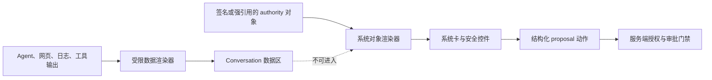

客户端渲染器本身也不可信到足以做最终授权：即便 UI 被攻破，服务端仍必须验证 proposal digest、scope、risk、policy/revocation、step-up、approval、expected version、idempotency 与 Effect 协议（架构 §12.8 的门禁顺序）。

---

<a id="sec-12"></a>
## 12. 客户端技术架构

### 12.1 设计原则

1. **Server-authoritative**：authority、授权判定、transition commit、Effect commit/abort、approval verification 全部在节点侧；客户端只有候选、投影与请求。
2. **通道物理隔离优先**：Task Client 与 Management Client 分凭证、连接、store、cache 和 telemetry correlation。
3. **离线只读**：离线缓存不能生成新 authority 事实；任何写操作需在线重新认证、取当前版本、重做 preview。
4. **共享契约，不假设同构 UI**：五端共享 schema adapter、领域模型、状态展示语义与设计 tokens；桌面/移动导航和平台集成分别优化。
5. **平台安全能力如实声明**：某个平台 PoC 的 sandbox、passkey、secure screen 或 key store 证据不得外推到其他平台。

### 12.2 分层架构

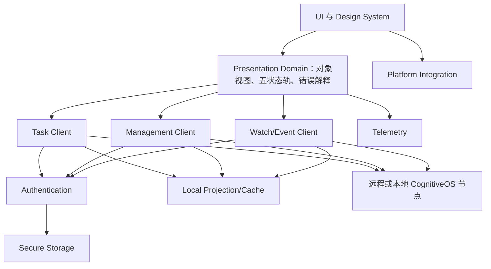

| 层 | 职责 | 禁止承担 |
|---|---|---|
| UI / Design System | 组件、布局、可访问性、风险/状态语义、平台响应式 | 解析自由文本为最终控制字段；授权判定 |
| Presentation Domain | schema validation 结果展示、对象引用、五状态轨、错误本地化、proposal diff | 自行推进状态；用日志推断完成 |
| Task Client | Conversation、intent、Shell proposal、Task 控制的逻辑调用 | 管理 credential / management cache |
| Management Client | 建立/关闭管理 session、management proposal、approval/effect 的逻辑调用 | 复用 Task Client session；直接批准 |
| Watch/Event Client | snapshot-plus-delta、cursor/ack、去重、gap/expiry/backpressure | 将非权威遥测混入 governed event 连续性 |
| Authentication | 系统浏览器 native-app flow、step-up、设备绑定 | 把认证等同授权；持有 root key |
| Secure Storage | OS keychain/keystore/credential locker 抽象 | 明文回退；持久化 permanent root token |
| Local Projection/Cache | 授权快照、离线只读、索引、版本/权限绑定与失效 | 成为事实来源；跨 tenant/channel 复用 |
| Platform Integration | 通知、deep link、窗口、菜单、secure screen、更新、系统验证器 | 绕过服务端 gate；统一伪装各平台能力 |
| Telemetry | 性能、崩溃、产品指标；最小化与去标识 | Conversation/Context/Memory 正文、secret、隐藏 reasoning |

原生应用认证采用系统浏览器与 [RFC 8252](https://datatracker.ietf.org/doc/rfc8252/) 同类安全基线：authorization code + PKCE、随机 state/nonce、精确 redirect 匹配、claimed HTTPS/universal/app links 优先、回调后服务端换取短期会话；不在自定义 URI/push 中携带 bearer credential。AuthenticationSession/redirect/PKCE wire contract 当前未登记，是 release-blocking 产品依赖。

### 12.3 Store 与进程边界

最低隔离要求：

```text
Workspace A / Task Channel
  task-credential + task-projection + conversation-cache + task-watch

Workspace A / Management Channel
  management-session + management-projection + management-cache + management-watch

Workspace B
  完全独立的上述两组
```

- task store 与 management store 不允许共享持久化数据库表/collection 的 encryption key；如共用物理数据库，必须独立 key、namespace 和访问接口。
- R2/R3 确认场景独立于 Agent 可写 renderer；系统浏览器或原生场景只接收 opaque proposal reference，从 authority 重取 canonical 内容。
- Renderer/Widget 层不能直接访问 secure storage；只能向经过 allowlist 的平台命令请求短期证明。
- Task renderer/window 的 IPC capability allowlist 不包含 management broker；Management Client 运行于独立 privileged broker/process/scene，句柄绑定 management window、session、workspace 与 channel。共享 UI package 不共享 IPC 权力。
- 管理 broker 只接受 `ManagementActionProposal` 与其固定 binding；`ShellActionProposal` 到 Management proposal 的显式机器映射当前不存在，禁止客户端结构强转。在不可变 mapping/cross-reference 完成登记前，Shell 管理自然语言只可形成候选解释/预览，实际管理写必须由确定性 Management Client 直接形成 `ManagementActionProposal`；mapping 登记后方可开放 Shell 发起的管理提交。
- IPC 类型检查是输入卫生，不是授权边界；所有请求仍在节点侧验证。

### 12.4 三种技术方案比较

本比较是**产品技术建议**，不是仓库已登记资产。仓库当前没有 Console 实现、build manifest 或技术栈 ADR；已有 [ADR-0004 Canonical JSON](../../docs/adr/0004-canonical-json.md) 与 [ADR-0005 ID and Clock](../../docs/adr/0005-id-and-clock.md)，但二者不选择客户端框架。判断依据包括框架官方支持矩阵与安全文档、平台厂商对后台/passkey/商店的约束、公开问题记录，以及必须执行的跨平台 PoC；不以框架宣传的“支持五端”作为生产可用结论。

| 维度 | Tauri 2 + React/TypeScript 五端共享 | Flutter 五端共享 | Electron 桌面 + React Native 移动 |
|---|---|---|---|
| Rust/TypeScript 契合 | **强**：Rust host/插件 + React/TS；适合复用 schema/协议与 Rust 核心 | 中：Dart UI；Rust 需 FFI/bridge，增加边界和生成链 | 中强：Electron/RN 都可用 TS；Rust 通过 native addon/sidecar，桌面/移动桥不同 |
| 代码复用 | 高潜力：领域/React 组件可共享；移动原生插件仍需 Swift/Kotlin | 高潜力：UI/领域 Dart 共享；平台 channel 必不可少 | 中：共享 TS 合同/领域逻辑；Electron DOM 与 RN 原生组件难共享屏幕 |
| Windows/Linux/macOS 成熟度 | Windows/macOS 良好潜力；Linux 受 WebKitGTK/发行版碎片影响 | 三桌面官方支持，但系统托盘、多窗口、更新等产品级插件需验证 | Electron 桌面生态最成熟；代价是 Chromium 体积、内存和安全面 |
| iOS/Android 插件成熟度 | Tauri 2 已支持移动，插件需 Swift/Kotlin；push/passkey/secure storage 不能假定一套插件成熟 | Flutter 移动生态成熟；passkey/企业安全插件仍需审计社区包或自研 native channel | React Native 移动成熟；与 Electron 是两套平台集成和发布链 |
| Trusted approval surface | WebView renderer **不天然可信**；需系统浏览器/原生独立面 | 自绘 Widget 也不等于安全 UI；仍需 OS/authority-owned 独立面 | Electron renderer 攻击面最大；RN 仍需原生/系统浏览器确认面 |
| Passkey/WebAuthn | 桌面 WebView 与移动 WKWebView/Android WebView 行为不同；建议 native/system-browser adapter | 依赖原生 AuthenticationServices/Credential Manager 插件 | Electron 可走系统浏览器/WebAuthn；RN 需原生插件；两套实现 |
| 推送与后台任务 | 桌面可常驻；移动 remote push/native background 需自研/验证，iOS 无无限后台 | APNs/FCM 生态较成熟；后台仍受 OS 限制 | Electron 桌面常驻成熟；RN 推送成熟但两套状态恢复逻辑 |
| 可访问性 | 系统 WebView 可访问树；Linux/WebKit 与复杂虚拟列表需实测 | Semantics 树成熟但桌面键盘/屏幕阅读器组合需实测 | Chromium a11y 成熟；RN 各平台需单独适配，组件共享较低 |
| 自动更新、签名、发布 | 官方桌面 updater；移动必须走商店；Linux 格式差异 | 桌面更新需产品化方案；移动商店成熟 | Electron updater/打包成熟；RN 商店成熟；供应链与流水线最多 |
| Bundle/性能/内存 | 系统 WebView 通常减小 bundle；实际内存取决于 WebView/页面，必须量测 | AOT/自绘，性能可控；engine 增加 bundle；图谱/大流需压测 | 桌面 Chromium bundle/内存最高；RN 移动原生渲染，但双运行时 |
| 团队维护成本 | 单一 React+Rust 主栈，但需 Swift/Kotlin、Linux WebKit 专长 | 单一 Dart UI + Rust bridge + 各平台 native；引入新语言栈 | 两套 UI shell、两套插件/测试/发布链；Web 技能普遍但总成本最高 |
| 主要不确定性 | 移动插件、Linux、passkey、push、secure storage successor、深链冷启动 | 桌面原生集成/更新、Linux passkey、Rust bridge、社区插件治理 | 双栈漂移、桌面资源、安全更新节奏、RN native module 维护 |

外部证据入口（技术选型阶段必须重新核验版本与发布日期）：

- Tauri：[Tauri 2.0](https://v2.tauri.app/blog/tauri-20/)、[Capabilities](https://v2.tauri.app/security/capabilities/)、[Mobile Plugin Development](https://v2.tauri.app/develop/plugins/develop-mobile/)、[Updater](https://v2.tauri.app/plugin/updater/)、[Webview Versions](https://v2.tauri.app/reference/webview-versions/)；公开风险跟踪包括 [push notifications issue](https://github.com/tauri-apps/tauri/issues/11651) 与 [Linux GTK/WebKit issue](https://github.com/tauri-apps/tauri/issues/11942)。
- Flutter：[Supported deployment platforms](https://docs.flutter.dev/reference/supported-platforms)、[Desktop support](https://docs.flutter.dev/platform-integration/desktop)、[Accessibility](https://docs.flutter.dev/ui/accessibility-and-internationalization/accessibility)。
- Electron/React Native：[Electron security](https://www.electronjs.org/docs/latest/tutorial/security)、[Electron context isolation](https://www.electronjs.org/docs/latest/tutorial/context-isolation)、[React Native security](https://reactnative.dev/docs/security)、[React Native accessibility](https://reactnative.dev/docs/accessibility)。
- 平台硬约束：[Apple background execution](https://developer.apple.com/forums/thread/685525)、[Apple passkeys](https://developer.apple.com/documentation/authenticationservices/supporting-passkeys)、[Android Credential Manager for WebView](https://developer.android.com/identity/sign-in/credential-manager-webview)、[Android background foreground-service restrictions](https://developer.android.com/develop/background-work/services/fgs/restrictions-bg-start)、[WebAuthn Level 2](https://www.w3.org/TR/webauthn/)。

### 12.5 推荐结论

**条件式主方案：Tauri 2 + React/TypeScript，桌面优先、移动远程伴侣、原生安全适配器。**

理由：

1. 与 CognitiveOS 潜在 Rust 核心和产品要求中的 TypeScript/React 生态最匹配，能共享 schema adapter、领域视图和设计系统。
2. 桌面系统 WebView 可降低安装体积；Tauri capability/IPC allowlist 有助于缩小 renderer 权限，但不被误当成 authority。
3. 移动端需求本来就是伴侣而非宿主，允许把 Tauri mobile 的后台/插件限制收敛在 push、deep link、passkey、secure storage 等少数原生适配器。

该结论不是无条件采用：任何关键 PoC 失败，先调整平台实现而不是削弱安全边界。

**备选方案：Flutter。** 如果移动端交付质量、统一原生渲染与推送生态比 React/TypeScript 复用更重要，且团队接受 Dart+Rust bridge 与桌面平台集成成本，则选 Flutter。
**第三方案：Electron + React Native。** 仅在团队高度依赖成熟 Chromium/Node 桌面生态、可接受显著资源和双栈维护成本时采用；不作为默认备选。

### 12.6 必须先通过的 PoC 门禁

| Gate | 验证内容 | 通过条件 |
|---|---|---|
| POC-01 可信审批 | 恶意 Agent/renderer、XSS/clickjacking/第三方脚本尝试伪造、修改、重放 R2/R3 proposal | 独立 hardened origin 无第三方内容且通过 CSP/同源负例；authority 只接受当前 principal 对固定 canonical digest/domain/nonce/expiry 的有效 assertion；R3 双主体 |
| POC-02 Passkey | Windows Hello、安全密钥、macOS/iOS passkey、Android Credential Manager、Linux 安全密钥 | 注册/断言/取消/恢复/跨设备均有明确结果；无能力平台 fail closed，有系统浏览器 fallback |
| POC-03 Secure Storage | 五平台锁屏、登出、重装、备份恢复、生物特征变化、Linux 无 keyring | 密钥不明文、不跨错误 principal 恢复；缺能力时进入非持久会话 |
| POC-04 Push/Deep Link | 前台、后台、terminated/force-quit、token rotation、duplicate、离线、恶意 handler、无 GMS Android | 明确不可送达场景；payload 脱敏；single-use handle 绑定 principal/app/environment/workspace/audience/proposal version；cold/warm start 均从 authority resnapshot |
| POC-05 Background | 长 watch 在 iOS/Android 挂起、断网、错过推送后恢复 | 不依赖无限后台；前台恢复可由 snapshot+cursor 正确收敛 |
| POC-06 Linux 矩阵 | 至少选择支持的发行版/桌面环境验证 WebKitGTK、keyring、通知、Orca、更新与安全补丁时效 | 明确支持矩阵、minimum patched WebKitGTK 和 privileged-feature kill switch；未验证/停止安全更新的发行版不宣称支持 |
| POC-07 Accessibility | Narrator、VoiceOver、TalkBack、Orca；键盘、高对比、缩放、减少动画 | 关键旅程可完成，尤其 proposal、五状态轨、`OUTCOME_UNKNOWN` 与审批 |
| POC-08 Release/Update | 五端签名、macOS 公证、商店、桌面 updater、metadata replay/freeze、key rotation/root recovery、断电/回滚 | 失败安全；拒绝过期/降序 metadata；回滚不低于 security floor；渠道绑定/签名可验证；移动不旁路商店 |
| POC-09 Performance | 启动、全进程 RSS/PSS、idle CPU、电量、10k 事件流、长会话内存、图谱 | 形成实测报告与预算；不引用营销 benchmark |
| POC-10 Isolation | workspace/tenant/channel 切换、session revoke、cache key、renderer compromise | 无跨 tenant/channel 泄露；management material 不进入 task store |
| POC-11 Store Policy | iOS/Android 远程 Agent 管理、动态内容、企业分发审查 | 明确允许的产品描述和能力；失败则收窄，不伪装成本地安装 |
| POC-12 Upgrade Cost | 连续两个框架小版本、native project regeneration、插件升级 | 团队能在目标维护窗口内完成，自动化测试持续通过 |

---

<a id="sec-13"></a>
## 13. 数据与 API 映射

### 13.1 原则：逻辑服务，不虚构 endpoint

本文只定义客户端需要的逻辑能力、对象输入输出和信任边界。传输可为进程内、named pipe/Unix socket、HTTP/gRPC、QUIC 或其他 AKP mapping；具体路径、方法、端口、分页协议均未登记，属于后端设计依赖。

### 13.2 逻辑服务映射

| 客户端逻辑服务 | 主要职责 | 已登记/现有输入 | 当前缺口 |
|---|---|---|---|
| Session & Identity | AuthenticationSession 结果消费、ConversationBinding、ActorChain、workspace | `Principal`、`Membership`、`ActorChain`、`Conversation`、`ConversationBinding` schema | AuthenticationSession/RuntimeSession/Turn、IdP API 未登记 |
| Shell / Task | record/interpret/preview/submit/attach/control | `UserIntentRecord`、`IntentInterpretation`、`ShellActionProposal`、`ShellCommandPreview`、`TaskContract` | API/envelope、Task carrier、AcceptanceDecision 待实现 |
| Management | 建立短期 session、proposal、逐门禁写操作 | `PrivilegedManagementSession`、`ManagementActionProposal`、`ManagementApprovalDecision` | 传输/API、challenge、approval queue/quorum 待实现 |
| Watch / Event | snapshot-plus-delta、ack/resume/close | `WatchSubscription`、`Event`、`ShellStatusView` | StateSnapshot、persistent ack/partition cursor schema 待实现 |
| Agent Lifecycle | package/compat/install/upgrade/remove/inspect | 三份 Agent schema、compatibility companion | installer、安装 transition、sandbox 证据待实现 |
| Memory | propose/admit/invalidate/tombstone | 三份 Memory schema | 私有工作集 carrier、memory transition/service 待实现 |
| Catalog | discover/describe/match/bind | OperationSummary/Snapshot/MatchReport | OperationDescriptor/InvocationBinding schema 与服务待实现 |
| Knowledge | ingest/query/lint/lineage | `REQ-KNOW-001..009` prose | Evidence/Claim/KnowledgeObject/CompilationProfile schema 与服务待实现 |
| Audit | 查询、追溯、导出申请 | Event、StateTransitionRecord、`REQ-AUDIT-001/002` | AuditRecord/export/API/error 待实现 |
| System | readiness、health、ResourceGraph、配置、更新 | ResourceGraph/WorldState/Profile/Placement/Performance schema；三 readiness 名称仅为架构 prose | readiness/health machine carrier、逻辑服务、实例与实现待实现 |

### 13.3 Management API 与普通任务/Shell API 分离

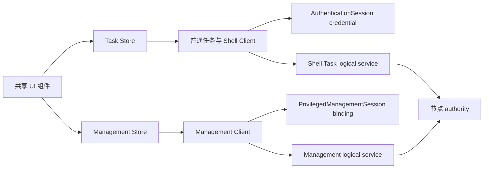

`PrivilegedManagementSession` 的校验顺序必须保持架构 §12.8 的服务端门禁：session validity → ActorChain/ActivityContext binding → scope → risk → policy/revocation → step-up → independent approval → expected version → idempotency → Effect protocol。客户端可预览这些门禁，但不能跳过或做最终判断。

### 13.4 AKP 映射

[specs/akp/README.md](../../specs/akp/README.md) 已登记的逻辑 operation families 可作为客户端能力协商词汇：

- Agent：`agent.install | agent.upgrade | agent.remove | agent.inspect`
- Memory：`memory.propose | memory.admit | memory.invalidate | memory.tombstone`
- Discovery/Context：`resource.discover`、`context.admit | context.expand | context.resolve_delta`
- Catalog：`catalog.discover | catalog.describe | catalog.bind`
- Intent/Shell：`intent.record | intent.interpret | intent.admit | intent.supersede`、`shell.preview | shell.submit | shell.attach | shell.control`
- Watch：`watch.open | watch.ack | watch.resume | watch.close`

这些名称不是本产品自造 endpoint；实际 AKP envelope、transport binding 与错误映射仍缺机器 schema/实现。客户端启动时必须协商协议/extension；未知 critical extension 以已登记 `CRITICAL_EXTENSION_UNKNOWN` fail closed。

### 13.5 WatchSubscription：snapshot-plus-delta

实现语义：

1. `open` 固定 ActorChain digest、ResourceScope、purpose、selector、visible fields、event types、预算、expiry、backpressure。
2. 服务端返回授权 snapshot version、high-watermark `H` 与 cursor；客户端原子替换该订阅投影。
3. 从 `H` 后消费 delta，按 event ID 去重、验证 cursor 连续性；成功持久化投影后再 ack。
4. 断线从 last durable ack `resume`，不是从“最后看见”位置。
5. `WATCH_CURSOR_STALE`、权限/Policy/Membership/Revocation 版本变化、字段投影变化时废弃 subscription，重新授权 snapshot。
6. `coalesce_non_authoritative` 只能合并可丢进度，不得合并/丢弃 governed transition/event 后宣称连续。

`WatchSubscription` 当前只有整数 cursor/high-watermark，没有 StateSnapshot reference 或持久 ack schema；后端需补契约，Console 不私自定义 wire shape。

### 13.6 强引用与统一 URI 命名空间

当前存在两个需版本感知处理的引用族：

| 引用族 | 机器形状 | 使用现状 |
|---|---|---|
| Legacy `common-defs#strongRef` | `{id, version, digest}`，`id` 为 URI | 多数既有 schema（含 ShellStatusView） |
| Governed `ObjectReference` strong | `{kind:\"strong\", id:<UUIDv7>, object_version, content_digest}` | [object-reference.schema.json](../../specs/schemas/object-reference.schema.json) 与 governed-object standard |

它们不可互换（[governed-object-contract.md](../../docs/standards/governed-object-contract.md)）。客户端必须有 version-aware reference adapter，保留原始形状与 schema version，不做有损转换；迁移由后端/规范显式完成。

Core 已描述 `state://`、`memory://`、`knowledge://`、`operation://`、`event://`、`cap://`、`cas://`、`query://` 等 typed URI；架构 §12.9 另列 `os://`、`agent-package://`、`installation://`、`execution://`、`task://`、`episode://`、`activity://`、`conversation://`、`resource://`、`context://`、`effect://`、`approval://`、`audit://` 等产品词汇。后者不是已登记 URI grammar。Console：

- 不新增 scheme；
- 对已知 schema 中的引用原样展示/传输；
- 对架构词汇只作导航别名，解析仍交给节点；
- URI/ID/digest/可发现性/网络可达性永不授予权限；
- `query://` 不是稳定身份；写操作必须 pin 成强引用。

### 13.7 Proposal / Approval / Effect / Audit 引用链

```mermaid
flowchart LR
  IntentRecord[UserIntentRecord] --> TaskContract[TaskContract]
  TaskContract --> Proposal[Shell 或 Management Proposal]
  Proposal --> Preview[ShellCommandPreview]
  Proposal --> Approval[ManagementApprovalDecision]
  Proposal --> Intent[Intent]
  Approval --> Intent
  Intent --> Effect[Effect]
  Effect --> Receipt[Receipt 引用]
  Effect --> Reconcile[Reconciliation Report 产品依赖]
  Reconcile --> Verification[VerificationReport]
  Verification --> Transition[StateTransitionRecord]
  Transition --> Event[Event]
  Event --> Audit[Audit view 产品依赖]
```

每个详情页提供“引用链”入口；缺少对象或无权限时显示断点类别，不通过猜测补链。Audit view 是投影，专用 AuditRecord schema 尚未登记。

### 13.8 Cache 绑定与权限变化失效

缓存 key 至少绑定：workspace/node identity、scope_domain/tenant、initiating/effective/workload principal 或 ActorChain digest、Conversation/non-conversational ResourceScope、purpose、channel、Policy/Membership/Revocation version、schema/renderer version、对象版本/digest。

以下任一变化立即失效对应 cache/watch/preview：

- principal、ActorChain、tenant、Conversation、scope、purpose；
- Membership/Policy/Revocation version；
- management session state、risk ceiling 或 isolation key；
- target object version/digest、schema/renderer version；
- device binding 撤销或 workspace node identity 变化。

失效后不能继续显示可操作控件；离线快照仅显示“历史授权下最后可见”，在线后重新授权。

### 13.9 错误码和安全拒绝展示

Console 必须保留 registry 中的原始 code、retryable 属性和 `correlation_id`（若服务端提供），并附安全本地化解释。不得把所有拒绝简化为“权限不足”。

| 类别 | 已登记错误码 | 产品展示/动作 |
|---|---|---|
| State | `STATE_CONFLICT`、`STATE_STALE_OBSERVATION`、`STATE_STORE_UNAVAILABLE` | 冲突/陈旧时拉取 authority snapshot；存储不可用时所有 governed writes fail closed，不把内存缓冲显示为 committed，保留只读 inspect 与确定性 stop/revoke |
| Context/Auth | `CONTEXT_AUTH_DENIED`、`AUTH_CAPABILITY_ATTENUATION_VIOLATION`、`AUTH_CAPABILITY_EXPIRED` | 不泄露正文；解释需缩小 scope/重新授权 |
| Management | `MANAGEMENT_SESSION_EXPIRED`、`MANAGEMENT_SESSION_REVOKED`、`MANAGEMENT_STEP_UP_REQUIRED`、`MANAGEMENT_SCOPE_MISMATCH`、`MANAGEMENT_SELF_AUTHORIZATION_DENIED`、`MANAGEMENT_INDEPENDENT_APPROVAL_REQUIRED` | 关闭写入口；引导重新认证/独立审批；撤销不可自动重试 |
| Channel | `SHELL_CHANNEL_BINDING_MISMATCH` | 清除跨通道材料，要求从正确入口重建 proposal |
| Effect | `EFFECT_OUTCOME_UNKNOWN`、`EFFECT_RECOVERY_QUARANTINED`、`EFFECT_IDEMPOTENCY_CONFLICT` | 未知结果禁止盲重试；同一 idempotency key + 不同 parameter digest 必须拒绝，不能去重、改参或创建新 Effect |
| Agent | `AGENT_PACKAGE_VERIFICATION_FAILED`、`AGENT_ADAPTER_BYPASS_DETECTED`、`AGENT_COMPATIBILITY_DEGRADED` | 显示证据与平台范围；不允许覆盖警告强装 |
| Memory/Knowledge | `MEMORY_ADMISSION_DENIED`、`MEMORY_SCOPE_PROMOTION_REQUIRED`、`MEMORY_DERIVATION_INVALIDATED`、`KNOWLEDGE_SOURCE_INVALIDATED`、`KNOWLEDGE_POISON_QUARANTINED`、`KNOWLEDGE_MAINTENANCE_BOUNDED` | 展示准入/失效链；正文按权限裁剪 |
| Catalog/Semantic | `CATALOG_VERSION_STALE`、`CATALOG_MATCH_INCONCLUSIVE`、`NO_AUTHORIZED_OPERATION_CANDIDATE`、`SEMANTIC_SERVICE_UNAVAILABLE`、`SEMANTIC_MATCH_INCONCLUSIVE`、`MODEL_EGRESS_DENIED`、`SEMANTIC_BUDGET_EXHAUSTED` | 重新发现或使用确定性 fallback；不得恢复被过滤候选 |
| Shell/Intent | `SHELL_TARGET_AMBIGUOUS`、`SHELL_TARGET_NOT_FOUND`、`SHELL_PREVIEW_STALE`、`INTENT_CLARIFICATION_REQUIRED`、`INTENT_VERSION_SUPERSEDED` | 消歧、重预览、显示 superseding 版本 |
| Lifecycle/Watch | `CANCEL_PENDING`、`CANCEL_TOO_LATE`、`WATCH_CURSOR_STALE` | 区分请求与结果；重新快照再续接 |
| Protocol | `VERSION_UNSUPPORTED`、`CRITICAL_EXTENSION_UNKNOWN`、`SCHEMA_MISMATCH`、`DIGEST_MISMATCH`、`PROTOCOL_MAPPING_INCOMPLETE`、`PROTOCOL_SCHEMA_DIGEST_MISMATCH` | fail closed；显示兼容性/升级建议，不尝试宽松解析 |

Prose 中出现但不在 `errors.yaml` 的名称（如无 `EFFECT_` 前缀的 `IDEMPOTENCY_CONFLICT`、`DURABILITY_UNAVAILABLE`、audit-sink failure）不得被 Console 称为已登记错误码；若后端返回，显示为“未登记服务错误”并记录产品依赖。

v1.0.1 已登记的 `STATE_STORE_UNAVAILABLE` 对应 `REQ-REC-003`：虽然 registry 标为 retryable，客户端不得自动重放 governed write；必须等 authority 明确恢复持久提交路径、重新取快照/版本并重做门禁。`EFFECT_IDEMPOTENCY_CONFLICT` 对应 Core `REQ-EFF-002` 与向量 `EFF-IDEM-CONFLICT-001`，是 non-retryable 的同键异参拒绝。

---

<a id="sec-14"></a>
## 14. 视觉与交互规范

### 14.1 视觉原则

1. **状态保真优先于装饰**：机器状态、authority、版本、freshness 与安全动作永远可见。
2. **数据与控制可区分**：Agent/网页/日志内容使用“数据容器”；系统对象和控制使用不可由内容复刻的系统容器。
3. **风险、状态、权限三轴分离**：R 风险、生命周期状态、用户权限分别编码，禁止一个颜色/徽章承载三种含义。
4. **颜色不是唯一信号**：每种状态同时具有文本标签、图标/形状、位置和可访问描述。
5. **渐进披露而非语义删减**：移动/窄屏隐藏次要字段，但 `OUTCOME_UNKNOWN`、approval、authority freshness 等安全信息不可折叠到不可见。

### 14.2 桌面信息密度与三栏 Shell

- Shell 使用 §7.1 三栏；列表默认“舒适密度”，运维/审计页面可切“紧凑密度”，但点击目标最小尺寸仍满足 WCAG 2.2 AA。
- 大表格固定对象 ID/状态列，水平滚动不隐藏风险与 `as_of`；列可保存为用户布局，不改变字段权限。
- 对象详情采用“摘要头 + 五状态轨/关键状态 + 标签页”：
  - 摘要头：对象类型、强引用、tenant/scope、authority、version、freshness；
  - 主区：任务/执行语义；
  - 右侧：Context、权限、预算、引用链；
  - 底部：Event/审计时间线。
- 高风险 proposal 打开时进入 focus mode：固定显示目标、变化、digest、风险、审批与取消/补偿边界，其他导航不夺取焦点。

### 14.3 移动端渐进披露

移动卡片首层仅显示：对象名/类型、机器状态+中文标签、风险（如适用）、reason、deadline、一个推荐安全动作。向上拉取详情后按顺序展示：

1. 等待对象与下一 gate；
2. 预算与 freshness；
3. 五状态轨；
4. Evidence/引用链；
5. 高级控制（需重新认证）。

批量操作、完整 ResourceGraph、大图谱、多列审计导出不移植到移动端；移动端提供收藏、过滤、深链到桌面和受限单对象操作。

### 14.4 状态、风险和权限的颜色/图标语义

具体色值由 Design System token 在实现阶段确定，并通过浅/深主题对比测试。下表定义语义，不定义品牌色：

| 语义 | 颜色方向 | 图标/形状 | 必须同时显示的文本 |
|---|---|---|---|
| 正常/当前 | 中性或正向色 | 圆形 check/info | 机器状态与中文标签 |
| 等待 | 蓝/中性色 | clock | 等待谁/什么、deadline |
| 阻塞 | 琥珀色 | pause-octagon | reason、下一 gate |
| 结果未知 | 高注意红/紫 | question-diamond | `OUTCOME_UNKNOWN`、禁止盲重试 |
| 隔离 | 高注意色 | shield-slash | 状态域 + `QUARANTINED` + 是否终态 |
| 完成 | 正向色 | check-circle | `COMPLETED` 且“验收已提交” |
| 候选完成 | 蓝/紫 | outlined-check | `CANDIDATE_COMPLETE` + “待验证/验收” |
| R0/R1/R2/R3 | 灰/蓝/橙/红方向 | 0/1/2/3 级盾牌 | 完整 `R0`—`R3` 文本与影响说明 |
| 无权限 | 中性色 | lock | “无权读取/操作”及安全原因 |
| Break-glass | 高对比警示 | open-lock + timer | 剩余时限、范围、审计提示 |

屏幕阅读器不朗读“红色状态”，而朗读“Effect 状态：OUTCOME_UNKNOWN，结果未知，禁止盲重试”。

### 14.5 深色/浅色主题

- 默认跟随系统，可手动覆盖；高对比模式单独适配。
- 所有文本/背景、非文本控件、焦点环按 WCAG 2.2 AA 对比要求验证；代码/digest 等宽字体亦不例外。
- 图谱、趋势图和状态轨在深色主题使用同一语义 token，不用透明度过低的边。
- 风险色不作为品牌强调色，避免“所有主按钮都像危险操作”。

### 14.6 键盘、命令面板和快捷键

| 功能 | Windows/Linux | macOS | 约束 |
|---|---|---|---|
| 全局命令面板 | `Ctrl+K` | `Cmd+K` | 只列当前授权可能动作；执行仍需 preview/gate |
| 搜索 | `Ctrl+F` | `Cmd+F` | 默认当前视图；全局搜索显式选择 |
| 新 Conversation | `Ctrl+N` | `Cmd+N` | 避免覆盖系统/平台保留快捷键 |
| 切换工作区 | `Ctrl+Shift+P` 后命令 | `Cmd+Shift+P` 后命令 | 切换前提示未提交草稿/管理 session |
| 打开对象引用 | `Ctrl+L` | `Cmd+L` | 输入 URI/ref 仍重新授权 |
| 关闭管理模式 | 默认 `Ctrl+Alt+M`（可重映射） | 默认 `Cmd+Option+M`（可重映射） | 同时提供常驻“退出管理模式”按钮；避开系统保留键；立即清 management cache，不取消已持久 Effect |

- 所有功能可不用鼠标完成；快捷键可重映射且不与屏幕阅读器保留键冲突。
- 破坏性动作没有单键快捷键，必须经过 preview/确认。
- 命令面板中的 `kill`/`undo` 进入语义消歧，不直接执行（§10.6）。

### 14.7 响应式布局与图谱降级

| 宽度形态 | 布局 |
|---|---|
| 宽桌面（≥1440 CSS px） | 三栏全部可见；详情侧栏常驻 |
| 标准桌面/平板横屏（1024–1439） | 左栏可折叠，右栏抽屉；主区保持五状态轨 |
| 窄屏（<1024） | 单主区 + 分层抽屉；移动底部导航 |

知识/协作/ResourceGraph 降级顺序：

1. 全图（桌面、授权节点数在性能预算内）；
2. 聚类/虚拟化图（大规模）；
3. 当前节点的邻接列表（移动、减少动画、屏幕阅读器）；
4. 可导出的结构化表格（无 Canvas/WebGL 或无障碍替代）。

任何降级都保留边类型（supports/contradicts/supersedes/derived_from）、方向、状态和不可见节点提示。

### 14.8 WCAG 2.2 AA 与辅助技术

- 目标：WCAG 2.2 AA；关键旅程（连接、创建任务、监督、拒绝/批准、`OUTCOME_UNKNOWN` 对账、撤销 session）纳入五平台辅助技术验收。
- 语义结构：单一 H1、层级标题、landmark、表格 header、图谱的列表等价物。
- 焦点管理：
  - 新系统卡不自动抢焦点；以 live region 宣告；
  - 打开 proposal modal 后焦点进入标题，关闭返回触发控件；
  - validation error 汇总并链接到字段；
  - R2/R3 切出系统浏览器后，返回时焦点落在 authority 结果。
- 动态状态：使用 `aria-live`/平台语义公告，但高速 watch 事件聚合宣告，避免朗读轰炸。
- 限时 confirmation：计时器可被辅助技术读取但不逐秒轰炸；允许按 policy 请求合理延长/重发，新 challenge 原子失效旧 challenge；不能因无障碍模式降低风险、digest 绑定或独立性。
- 减少动画：跟随系统设置，禁用图谱力导向动画、闪烁、自动滚动；状态变化用静态高亮。
- 目标尺寸、拖动替代、焦点不被遮挡、重复输入减少等遵循 WCAG 2.2 新增准则。
- 屏幕阅读器矩阵：Narrator+Windows、VoiceOver+macOS/iOS、TalkBack+Android、Orca+支持的 Linux 发行版。

### 14.9 中英文、时区和审计时间

- 首发支持简体中文 `zh-CN` 与英文 `en`；对象名、机器状态、REQ-ID、error code、digest 不翻译，旁边提供本地化解释。
- 所有用户文案采用 ICU message 格式思维，支持复数、性别中性、参数重排；不拼接句子。
- 普通页面默认显示用户本地时区，并可悬停/展开查看 UTC 和节点时区。
- 审计页面固定同时显示：
  - RFC 3339/ISO 8601 UTC 原值；
  - 用户本地时间；
  - authority/node clock 来源与可能的 uncertainty（若后端提供）。
- 相对时间（“5 分钟前”）不能单独用于审批期限、Effect 对账或审计证据。
- 中文排序、全文搜索和名称规范化不改变稳定 ID/强引用。

---

<a id="sec-15"></a>
## 15. 通知与审批

### 15.1 通知分类

| 类别 | 示例 | 默认优先级 | 桌面/应用内 | 移动推送 | 必要动作 |
|---|---|---|---|---|---|
| 普通信息 | Task 进度、Agent 更新可用 | 低 | 收件箱聚合 | 默认不推或摘要 | 查看 |
| 任务等待 | 等待用户输入、依赖或授权 | 中 | 任务卡 + badge | 可推送（脱敏） | 回答/打开 Task |
| 预算/deadline | 预算临界、deadline 将到 | 中/高 | 常驻提示 | 可按策略推送 | 调整 scope/预算 proposal 或升级 |
| 审批 | R1—R3 proposal | 按风险 | Approval Center | 仅通知与深链 | 在对应确认面 approve/deny/challenge |
| 安全事件 | session revoke、疑似轰炸、越权尝试 | 高 | 安全收件箱 + 横幅 | 高优先脱敏推送 | 检查/撤销/报告 |
| Effect 未知结果 | `EFFECT_OUTCOME_UNKNOWN` | 高 | 持续事件，不自动消失 | 推送责任人/值班组 | Reconcile、必要时 quarantine |
| 系统故障 | authority/审计/watch/资源故障 | 按影响 | System Health | 严重时推送 | failover/检查/降级 |

### 15.2 聚合与去重

- 去重主键由 authority 提供的对象/事件 ID、proposal digest 或稳定 correlation 构成；客户端不以相似文本合并安全事件。
- 同一 Task 的普通进度按时间窗聚合；`OUTCOME_UNKNOWN`、session revoke、审批决定、governed transition 不被进度聚合吞掉。
- 同一 proposal 重发合并为一条并显示重发次数、来源与首次/最近时间。
- 跨设备已读以服务端 authority/通知服务的读游标同步（产品依赖）；设备本地“已读”不等于 approval 已处理。

### 15.3 频控、静默时段与升级

- 用户可配置普通信息/任务等待静默时段；组织策略可设值班路由。
- 安全事件、R3、`OUTCOME_UNKNOWN` 与即将越过安全 deadline 默认不被静默，但必须避免重复声音/震动；持续显示直到 acknowledged/handled。
- 频控策略由服务端返回；客户端展示“已聚合 N 条/已按策略静默”，不隐瞒。
- 升级链：个人责任人 → 备份审批人/值班组 → Tenant 安全负责人 → 平台事故响应（范围由部署策略定义）。
- deadline 过期不是默认批准；proposal 到期变 `expired`，需新 proposal。

### 15.4 跨设备已读与处理状态

区分四种状态：

1. **delivered**（产品通知状态，未登记）：某设备收到；
2. **read**（产品通知状态，未登记）：用户打开；
3. **acknowledged**（产品通知状态，未登记）：用户确认已知悉；
4. **decided/handled**：authority 对 proposal/Task/Effect 记录了实际决定或状态。

前三者不能替代第四项。跨设备同步只接受服务端更新；离线本地标记联网后若冲突，以 authority 当前结果为准。

### 15.5 Approval Center 交互规则

- 默认排序：风险/安全 deadline → 等待时长 → 业务优先级；不以“最可能批准”排序。
- 支持按 tenant、风险、来源、目标、proposal family 过滤；批量拒绝/静默可用，R2/R3 批量批准不可用。
- 卡片必须显示 proposal 版本/digest、发起者/ActorChain、独立性、变更摘要、风险、过期时间、重复次数和验证器可用性。
- “要求修改”不直接编辑原 proposal；创建 `supersedes` 的新 proposal，旧 approval 失效。
- 拒绝后再次提交显示新旧差异与拒绝原因；用于测量拒绝后重试率（§19）。
- 推送、聊天卡与系统通知均无直接 R2/R3 approve 控件。

---

<a id="sec-16"></a>
## 16. 发布与更新

技术栈尚未经 ADR/PoC 锁定；以下是发布产品要求，不表示构建资产已存在。

### 16.1 平台发布

| 平台 | 分发形态 | 签名/权限 | 更新 |
|---|---|---|---|
| Windows | 首选签名 MSIX 或 MSI/EXE（最终由 ADR 与企业部署 PoC 决定）；企业软件分发支持 | 代码签名证书、SmartScreen reputation；按需声明协议 handler/通知，不请求不必要管理员权限 | 签名桌面 updater 或企业渠道；验证 manifest/artifact signature |
| macOS | 签名 `.app` + DMG/PKG；可选 Mac App Store/企业 MDM | Developer ID 签名、公证、hardened runtime、准确 entitlement/隐私声明；不索取无关系统权限 | 签名 updater 或商店；公证与回滚包 |
| Linux | 明确支持发行版矩阵；候选 `.deb`/`.rpm`/AppImage/Flatpak，不承诺全部首发 | 发布 GPG/cosign 签名；记录 WebKitGTK、Secret Service、通知依赖差异 | 优先发行版仓库/企业渠道；AppImage 等渠道独立验证更新签名 |
| iOS/iPadOS | App Store、TestFlight、企业/受管分发（符合适用政策） | App signing、entitlements、Associated Domains、push、Keychain；隐私清单 | 只走 App Store/受管更新，不应用内替换二进制 |
| Android | Play AAB、internal track、企业 managed Play/受管分发 | App signing、Digital Asset Links、通知/biometric/网络最小权限 | 走 Play/企业商店；不下载替换应用代码 |

Tauri/Electron 等方案的 WebView/Chromium 也属于安全更新边界。每个平台声明最低 patched runtime 与支持期限，持续跟踪 WebView2/WKWebView/Android System WebView/WebKitGTK/Chromium CVE；启动时验证可观测版本（平台允许范围内）。低于 security floor 时远程 kill switch 禁用 management、R1—R3 与敏感 projection，只保留无 credential 的修复/升级指引。Linux 只支持能在声明窗口获得 WebKitGTK 安全更新的发行版/版本。

移动商店版本只能作为远程伴侣；任何动态 Agent/插件内容必须是远端节点能力或不可执行的数据描述，避免被误解为下载改变 App 功能的可执行代码。最终表述需通过商店政策审查（§20 R-10）。

### 16.2 自动更新、灰度与回滚

1. 更新 manifest 必须签名，固定 metadata version/monotonic sequence、短期 expiry、平台/架构、artifact digest、最低/最高协议范围、channel binding、security floor 与回滚兼容性；客户端拒绝重放的旧 metadata 和长期冻结在过期 metadata。
2. Desktop 支持 stable/beta/enterprise pinned 渠道；移动使用商店 rollout/managed track。
3. 灰度分群不使用 Conversation/正文内容；按匿名设备 cohort、组织策略和平台版本。
4. 更新前检查：
   - 无正在进行的 R2/R3 可信确认；
   - 管理 session 显式关闭；
   - 本地 durable watch ack 已持久化；
   - 未提交草稿提示保存/放弃；
   - 更新不改变后端 Task/Effect 生命周期。
5. 更新失败只能回滚到**不低于当前 monotonic security floor** 的最后已验证客户端。降到已撤回/有漏洞版本的签名、限时 exception 只允许进入 network/data-isolated recovery UI，用于修复/重新升级；不得获取 credential、连接节点或读取任何敏感 projection，且不得回滚 security revocation list 或服务端 authority 状态。
6. 更新信任根需支持 threshold/offline root、key rotation、root recovery 与 compromise drill；渠道切换不能复用另一渠道的旧 metadata。
7. 紧急安全撤回必须禁止有漏洞版本获得 credential、敏感 projection 或建立任何 management/task session；只有“版本旧但未低于 security floor”的客户端，普通任务只读降级才由服务端兼容策略决定。

### 16.3 客户端—服务端协议兼容

- 连接握手（逻辑能力，wire contract 待实现）需协商：节点 identity、CognitiveOS/Core/AKP 版本、schema digest set、critical extensions、可用逻辑 operation、readiness 与客户端最小版本。
- 未知 critical extension：`CRITICAL_EXTENSION_UNKNOWN` fail closed；未知非关键字段可按 schema version 策略保留但不执行。
- `PROTOCOL_SCHEMA_DIGEST_MISMATCH` / `SCHEMA_MISMATCH`：禁用相关写操作，仍允许安全的确定性 inspect/升级指引（若协议允许）。
- 客户端 N/N-1 兼容窗口由未来 ADR 决定；本文不虚构版本数量。每个发布物携带已测试协议矩阵。
- 引用形状迁移（legacy strongRef ↔ governed ObjectReference）必须显式协商，不在客户端猜测转换。

### 16.4 供应链与 SBOM

- 每个五端发布物生成 SPDX 或 CycloneDX SBOM（格式由 ADR 定），覆盖 Rust crates、npm/Dart/native dependencies、WebView runtime 假设和构建工具。
- 构建在受控 CI 中完成；依赖 lockfile、最小构建权限、短期签名身份、可审计 provenance（如 SLSA-compatible attestation，具体等级待决策）。
- 发布前执行漏洞、许可证、恶意包、secret、签名与 artifact digest 扫描。
- 签名 key 在 HSM/受控签名服务；支持 key rotation、撤销和应急重签演练。
- 插件/原生依赖按平台分别审核；某个平台通过的 sandbox/供应链证据不外推。
- 客户端不得下载并执行未签名更新、Agent 二进制或任意脚本；Agent 安装由远端/本地 CognitiveOS 节点的安装事务负责，不由 Console 执行。

### 16.5 崩溃报告边界

默认可采集：应用/OS/架构版本、匿名 installation ID（可重置）、错误 fingerprint、堆栈（符号化前脱敏）、页面/功能类别、资源指标、网络错误类别。默认禁止：

- prompt/Conversation/Context/Memory/Knowledge/附件正文；
- proposal 参数、完整 digest/challenge、credential、passkey assertion；
- tenant/Principal 明文标识、完整 URI；
- 模型隐藏 reasoning、屏幕截图、剪贴板；
- 审计/Effect evidence 正文。

用户/企业策略可关闭崩溃上传并导出本地脱敏诊断包；诊断包生成有字段预览、retention 和审计。崩溃服务提供方、数据驻留与 retention 是待决策项。

---

<a id="sec-17"></a>
## 17. MVP 与路线图

路线图以架构 §21 为当前架构规划输入，并遵循其“先安装与不可绕过，再做多轮发现，最后增加语义优化”及“实现优先与规范表面冻结”原则。表中凡标“产品排序”的内容是本文建议，不声称为 §21 原文阶段分配。由于仓库当前无后端或 Console 实现，以下功能状态除明确 `experimental/unsupported` 外均为 `planned`，不代表已交付。

| 产品阶段 | 架构阶段 / 产品排序 | 用户价值 | 后端依赖（均待实现） | 主要风险 | 状态 | 验收条件 |
|---|---|---|---|---|---|---|
| 技术与安全 PoC | Phase 0 前置 | 验证五端框架、隔离、可信审批和发布可行性 | 最小 mock authority/contract fixture；不等同生产后端 | 框架移动插件、安全存储、Linux、商店政策 | planned | §12.6 POC-01—12 有可复现实测报告；技术 ADR 批准；未通过项收窄范围 |
| MVP Desktop | Phase 0 + Phase 1 + Core Shell 基线；R1/管理写为产品 entrance gate | Windows/Linux/macOS 连接单节点；Shell 对话；Task/Execution 五轨监督；R0；门禁满足后开放 C0/C1 安装与 R1/相应风险管理写；确定性管理 fallback | Native-app auth/AuthenticationSession、Management/Shell logical services、watch、五个 state-domain authority binding（四种已登记 role）、install/sandbox/Catalog、audit；confirmation/canonical digest/risk matrix | 后端为空；写入确认契约未登记；Linux 差异 | planned | 先完成 R0 连接→长任务→断线恢复→验收；相应 gate 通过后才验收安装/R1 写；只有 deterministic management readiness gate 通过后才宣称模型不可用时 inspect/stop/revoke/reconcile；无跨 channel/tenant 泄露 |
| MVP Mobile Companion | 产品排序：与 MVP Desktop 同期或后一发布列车；R1 同一 entrance gate | iOS/Android 远程 Chat、Tasks、Agents 摘要、Inbox、门禁满足后的 R1 确认、脱敏 push | 远程 identity/task/watch/notification gateway、deep link、device binding；R1 confirmation contract | 后台限制、推送可靠性、商店文案误导 | planned | 在平台允许投递的前台/后台/terminated 场景验证通知，并记录 force-quit/无 GMS 等不可保证条件；前台恢复只从 authority 重取状态；不出现本地 Agent 安装/进程管理入口 |
| Governed Memory 与认知发现 | Phase 2 | candidate 工作集、准入、冲突、失效、删除；Context 来源与增量 | Memory/Discovery service、私有工作集、ContextViewDelta、停滞检测 | schema 不足表达 read-your-write 隔离 | planned | 写者即时可见、跨 scope 不可见；准入/冲突/删除影响可追溯；`MEM-RYW-001` 等声明式场景有 runner 后执行通过 |
| 企业管理 | 产品排序：在 Phase 1—4 能力上渐进产品化；非 §21 独立阶段 | 多租户、Membership/Delegation/Capability、审批、审计、节点/资源管理 | IdP、policy/revocation、ShareGrant、audit export、health/config/update services | 管理员越权、break-glass 滥用、职责分离 | planned | 管理员正文默认不可读；break-glass 限时双人且可审计；tenant/platform store 负例通过 |
| R2/R3 审批 | §12.12 / IMP-05；产品排序建议 R2 在恢复能力成熟后、R3 与具身安全同步，非 §21 原文映射 | 高影响操作的可信确认、独立/双人审批和防疲劳 | 已登记 gate/authz/trust/独立 approve 资产；仍缺 Approval service、confirmation/challenge/quorum、canonical digest、passkey/FIDO2 binding、hardened trusted surface、anti-fatigue | WebView 伪造、approval bombing、跨平台验证器不等价 | planned | 缺失机器契约先登记；POC-01/02 与 hardened-origin gate 通过；聊天“同意”与推送按钮无法批准；R3 双主体与 step-up 可验证 |
| Lifecycle / C2 Recovery | Phase 4 | checkpoint、迁移、pending Effect、`OUTCOME_UNKNOWN`、fence/replay/reconcile | C2 adapters、checkpoint store、fencing sink、recovery/reconciliation reports、形式模型 | 成熟 Agent 不暴露 checkpoint/cancel；Effect 残留 | planned | crash/restart 后按 fence→重放→对账→重授权→重解析恢复；不重复 Effect；Execution/Runtime 分离可见 |
| Multi-Agent / Distributed | Phase 5 | 显式衰减委派、handoff、verifier、冲突与跨节点协作 | cross-node catalog、ShareGrant/local reauthorization、Mailbox/Lease/ConflictSet、distributed watch | 消息被当 authority、分区下错误宣称停止/完成 | planned | 每次委派显示八项约束；远端 completed 不完成父 Task；分区 UI 不宣称 commit/stop |
| Knowledge graph 增强 | 产品排序：Phase 2 记忆/发现之后，利用 Phase 7 受治理知识/学习能力；非 §21 独立 UI 阶段 | Evidence/Claim/KnowledgeObject 谱系、冲突、失效传播与受治理编译 | Evidence/Claim/KnowledgeObject/CompilationProfile schema、knowledge authority/compiler | 图谱暗示真值、投毒、派生删除不完整、性能 | planned | 机器契约先登记；每条 Claim 可追 Evidence/冲突/替代；source invalidation 传播且保留审计；无权节点不泄露 |
| Distributed / Embodied | Phase 5 + Phase 6 | 边缘—云监督、ResourceGraph、设备安全状态与最终执行器证据 | Distributed Profile、Embodied Profile、独立实时安全域、watchdog/safe-state/hazard evidence | Console 被误当最终安全仲裁；网络/时限不可靠 | planned（移动本地托管 unsupported） | Console 断连不影响实时安全域；R3 最终动作由独立域仲裁；hard real-time 回路不调用动态 Context Resolution |
| Controlled Learning / Release | Phase 7 | shadow/canary、知识/策略/模型发布与自动回滚 | 独立评估、release authority、lineage/invalidation、canary telemetry | 自动学习污染生产知识/策略 | planned | 候选不能自发布；独立评估与回滚点固定；派生删除/失效可证明 |

### 17.1 MVP 明确排除

- MVP 不宣称 Core/Profile 符合性，除非未来存在 profile-manifest、runner 与执行证据。
- 对外 MVP 的入口 gate 包含已登记并实现的 AuthenticationSession/native-app code+PKCE/redirect contract；缺失时只能做无真实身份的内部 UI prototype，不能连接生产节点。
- R1 与其他管理写只有在适用 confirmation object、canonical digest/signature projection、server-side risk-admission matrix 和 renderer isolation 机器/安全契约登记并通过负例后才开放；否则 MVP 限 R0、确定性只读与对既有 Effect 的安全 inspect/reconcile fallback。
- Console 只有在节点实现 `PrivilegedManagementSession`、`ManagementActionProposal`、适用审批、expected-version/idempotency/Effect、`REQ-REC-003` durability 以及模型无关的 stop/revoke/reconcile 路径后，才宣称支持 `MANAGEMENT_READY`。在此 gate 前不得承诺模型不可用时的 stop/revoke。
- MVP 不含移动本地 CognitiveOS 节点、任意本地 Agent 安装或无限后台运行。
- MVP 不含 R2/R3 聊天内批准；可信确认后端与规范未完成前，相关写操作只能禁用或通过独立既有管理工具处理。
- MVP Knowledge 仅可显示后端已提供的只读引用/占位；在 Knowledge machine contract 缺失时不创造客户端事实模型。
- MVP 不用客户端聚合状态替代 authority projection。

---

<a id="sec-18"></a>
## 18. 产品要求与验收

### 18.1 编号与地位

`CONSOLE-PRD-xxx` 是本文档内部的 **informative 产品 ID**，仅用于产品追踪、设计评审和未来客户端测试。它们不是 CognitiveOS normative `REQ-*`，不进入 `specs/registry/requirements.yaml`，也不修改任何 schema/transition/vector。

### 18.2 需求—资产—页面—测试映射

| 产品要求 | 要求摘要 | 架构章节 | 已验证存在的 REQ-ID / schema | 页面/流程 | 测试建议 |
|---|---|---|---|---|---|
| `CONSOLE-PRD-001` | Console 是客户端，不拥有 authority/commit/root | §4.7、§12.8 | 无单一对应资产；架构基线 | 全局边界、所有写流程 | 恶意 renderer 直接构造“已提交”状态必须无效 |
| `CONSOLE-PRD-002` | 任务/管理通道隔离 credential、Context、cache、proposal、approval、audit | §12.9 | `REQ-SHELL-CHANNEL-001`；`shell-action-proposal.schema.json`；错误 `SHELL_CHANNEL_BINDING_MISMATCH` | Shell/管理模式 | 跨通道复用 session/proposal/cache 负例 |
| `CONSOLE-PRD-003` | PrivilegedManagementSession 短期、有界、可撤销且不是单次批准 | §12.8 | `REQ-MGMT-SESSION-001..003`、`REQ-MGMT-SESSION-LIFECYCLE-001`；`privileged-management-session.schema.json` | 管理模式/session 状态条 | idle/absolute expiry、revoke、reconnect 不恢复 |
| `CONSOLE-PRD-004` | 每个写操作有固定 proposal、preview、gate、Effect 与审计 | §12.5、§12.10 | `REQ-SHELL-PREVIEW-001`、`REQ-MGMT-GATE-001`、`REQ-MGMT-EFFECT-001`；proposal/preview schemas | Shell preview、安装、配置 | target version 改变后旧 preview 以 `SHELL_PREVIEW_STALE` 拒绝 |
| `CONSOLE-PRD-005` | R2/R3 不得靠聊天同意/密码/普通按钮；绑定 proposal digest 和独立主体 | §12.12、§17 | `REQ-MGMT-GATE-001`、`REQ-MGMT-AUTHZ-001`、`REQ-MGMT-TRUST-001`、`REQ-MGMT-APPROVAL-001` 及 vectors；Shell/Management proposal 与 approval schemas。Canonical confirmation/passkey/quorum：**未登记/产品依赖** | Approval Center、旅程 10/11 | 聊天文本、push action、自批、replay、hardened-origin 负例 |
| `CONSOLE-PRD-006` | 状态只来自 authority projection | §6.3、§12.10/12.11 | `REQ-SHELL-STATUS-001`；`shell-status-view.schema.json` | 五状态轨、Shell 卡 | Agent 输出“completed”不能改变 UI authority 状态 |
| `CONSOLE-PRD-007` | AgentExecution 与 Runtime 载体分别展示 | §6.1、§12.9 | `REQ-RUN-STATE-001`；`agent-execution-binding.schema.json`；Runtime schema **未登记** | Execution 详情 | 杀死 PID 后 Execution/Task 状态不被客户端篡改 |
| `CONSOLE-PRD-008` | 五状态机并列且只使用登记状态 | §6.3 | 五 transition tables；`state-domains.yaml`。`REQ-STATE-001..005` 是通用 authority/snapshot/CAS/execution identity/continuation 要求，**不是五机器状态定义** | Task/Execution 详情 | transition fixture 覆盖每个状态、终态和非法迁移展示 |
| `CONSOLE-PRD-009` | `CANDIDATE_COMPLETE` 与 `COMPLETED` 明确区分 | §6.3、§12.10 | `REQ-INTENT-ACCEPT-001`；task transition；`shell-status-view.schema.json`；`INTENT-ACCEPTANCE-007` | Task 卡/验收流 | 无 current Verification+AcceptanceDecision 时禁止显示 completed |
| `CONSOLE-PRD-010` | Cancel、Pause、Stop Runtime、Terminate、Fence、Reconcile、Compensate、Quarantine 不混同 | §6.3、§12.9、§16 | `REQ-SHELL-CONTROL-001`、`REQ-AKP-SHELL-003`；`SHELL-CANCEL-SEMANTICS-005`；transition tables | 危险操作菜单 | 每个动作预览其作用对象与不保证事项 |
| `CONSOLE-PRD-011` | Tenant 是隔离域；管理员默认无正文读取权 | §6.2、§12.8、§20.2 | `REQ-GOBJ-DOMAIN-001`、`REQ-GOBJ-TENANT-001`/governance schemas 只固定治理域/tenant 绑定；管理员正文隔离来自 RFC/架构 prose，专用 machine rule **未登记** | Users & Access、管理/审计 | 正文与 metadata discovery 分别授权；denied/not-found 不泄露存在性 |
| `CONSOLE-PRD-012` | Memory 区分 candidate、工作集、admitted、conflict、stale、quarantined、invalidated、deleted | §9.5、§18.3 | `REQ-MEM-ADMIT-001/002`、`REQ-MEM-MUTATE-001`、`REQ-MEM-DELETE-001`；三 memory schemas；工作集/stale/conflict transition **未登记** | Memory | read-your-write 与跨 scope 拒绝；tombstone/invalidated 分开 |
| `CONSOLE-PRD-013` | Knowledge 图显示 Evidence→Claim→KnowledgeObject 的来源/支持/冲突/替代/派生且不暗示真值 | §18.3 | `REQ-KNOW-001..009`；Evidence/Claim/KnowledgeObject schema **未登记** | Knowledge graph | 源失效影响、冲突并列、权限裁剪测试 |
| `CONSOLE-PRD-014` | 多 Agent 委派显示 scope/data/budget/deadline/capability/verifier/handoff/escalation | §15 | `REQ-DIST-DEL-001`、`REQ-DIST-BUD-001`；`delegation.schema.json` 只直接含 refs/budget/data visibility/deadline/depth；task-scope/verifier/handoff/escalation 与 Mailbox/Lease/ConflictSet **未登记** | Collaboration、旅程 8 | 衰减负例、约束字段缺失 fail closed、远端 completed 不完成父 Task |
| `CONSOLE-PRD-015` | C0—C3 与 R0—R3 正交展示 | §5.2、§20.5 | `REQ-AGENT-COMPAT-001`；`agent-compatibility-report.schema.json` | Agent 兼容性 | 所有 4×4 组合均可呈现，不生成单轴总分 |
| `CONSOLE-PRD-016` | 平台 sandbox/安全证据不得跨平台外推 | §5.3、§19 | `REQ-AGENT-SANDBOX-001`；compatibility report；host/channel 细分证据仍不足 | 安装/兼容报告 | Windows 证据不能使 Linux/macOS feature 变 supported |
| `CONSOLE-PRD-017` | 移动端默认是远程伴侣，不宣称本地 OS/Agent 宿主能力 | §20 部署边界 | **未登记/产品范围约束** | 平台矩阵、移动导航、商店文案 | UI/文案扫描无本地安装/任意进程管理入口 |
| `CONSOLE-PRD-018` | Watch 采用授权 snapshot-plus-delta、ack/cursor、去重、gap 恢复 | §12.10/12.11 | `REQ-SHELL-WATCH-001`、`REQ-AKP-SHELL-002`；`watch-subscription.schema.json`；`SHELL-WATCH-RESUME-006` | Watch client、旅程 12 | 断线、duplicate、gap、stale cursor、权限变化 |
| `CONSOLE-PRD-019` | 强引用固定版本/digest；歧义目标 fail closed | §12.9 | `REQ-SHELL-TARGET-001`、`REQ-GOBJ-REF-001..003`；ObjectReference/ShellActionProposal | 搜索、@引用、preview | ambiguous/stale/not-found 与 reference migration |
| `CONSOLE-PRD-020` | Task/Management cache 分离并在权限版本变化时失效 | §9.4、§12.9 | 通道隔离 REQ 已登记；完整 cache-key/失效 machine contract **未登记/产品依赖** | 本地 store | tenant/channel/revocation 组合污染负例 |
| `CONSOLE-PRD-021` | 安全拒绝保留原 error code/retryable，不统一成模糊错误 | §11/§12/§17 | `REQ-ERR-001/002`；`errors.yaml` | 全局错误组件 | 每类已登记错误 fixture；未知 code 标“未登记” |
| `CONSOLE-PRD-022` | 模型不可用时仍有确定性管理路径 | §12.8、§20.1 | `REQ-MGMT-FALLBACK-001`；`MGMT-FALLBACK-008` | Management-ready 降级页 | 禁用模型/Agent 后 inspect/stop/revoke/reconcile 可达 |
| `CONSOLE-PRD-023` | Agent 安装按验证/沙箱/负例/兼容/commit 事务显示并保留回滚点 | §5 | `REQ-AGENT-INSTALL-001/002`、`REQ-AGENT-RECOVERY-001`；Agent schemas；安装 transition **未登记** | Agent 安装 | 签名失败、adapter bypass、upgrade rollback、pending Effect 保留 |
| `CONSOLE-PRD-024` | 审计链可追 principal→Task/Context/Intent→Effect→Verification→状态 | §19 | `REQ-AUDIT-001/002`；Event/StateTransitionRecord；AuditRecord **未登记** | Audit/Evidence | 缺链、无权正文、导出审计、tamper indication |
| `CONSOLE-PRD-025` | WCAG 2.2 AA、键盘/屏幕阅读器/减少动画、颜色非唯一 | 产品建议；架构 §19 可观测/符合性 | **未登记/产品要求** | 全产品 | 五平台辅助技术关键旅程 |
| `CONSOLE-PRD-026` | 离线只读、节点不可达不推断远端停止；MVP 不缓存敏感正文，可选敏感快照须 offline lease；重连重新授权 | §16、§12.10 | `REQ-SHELL-ATTACH-001`、`REQ-SHELL-DETACH-001`；`SHELL-DETACH-ATTACH-004`；offline lease **未登记/仅为可选能力依赖** | 连接状态、离线快照 | 默认无敏感离线数据；可选能力测试 lease/本地重认证/非备份 key；management cache 禁离线 |
| `CONSOLE-PRD-027` | 通知脱敏、聚合/频控/静默/升级、跨设备已读不替代决定 | §12.12、§17 | §12.12 机制 **未登记/产品依赖** | Inbox/Notifications | 锁屏隐私、duplicate、quiet hours、安全升级 |
| `CONSOLE-PRD-028` | 客户端/服务端协议与 schema digest 不兼容时 fail closed | §11、§21 | `REQ-AKP-VER-001`、`REQ-AKP-CONF-001`；协议错误码 | 首次连接/更新 | critical extension/schema digest/version 负例 |
| `CONSOLE-PRD-029` | Memory、Context、World State、Knowledge 与聊天记录在 IA、cache、authority 和文案中分离 | §8、§9、§18.3 | 各自 companion/schema 部分存在；跨概念统一 separation contract **未登记/产品依赖** | Shell Context、Memory、Knowledge、System | 跨模块误分类、缓存复用、搜索结果与状态来源负例 |
| `CONSOLE-PRD-030` | 服务端计算/验证风险下界；R0 禁止外部可观察写但允许内部治理记录；客户端/Agent 不得降级风险 | §12.12、§20.5 | R0—R3 为架构基线并出现在多个 schema enum；统一 risk-admission authority/matrix **未登记/产品依赖** | Proposal/Preview/Approval | risk downgrade、R0 external write、内部治理记录、变更后旧 preview 负例 |
| `CONSOLE-PRD-031` | 原生客户端使用系统浏览器 code+PKCE/安全回调；未登记 AuthenticationSession/wire contract 前不得连接生产节点 | §12.8、§17 | AuthenticationSession/redirect/PKCE contract **未登记/产品依赖** | 首次连接/重新认证 | state/nonce、redirect hijack、code replay、custom URI credential、session revoke 负例 |
| `CONSOLE-PRD-032` | 不可信内容 renderer 与 R1/management 控件隔离；系统 WebView/Chromium 低于 security floor 时禁用 privileged features | §17 安全、§20 发布 | `REQ-MGMT-TRUST-001` 提供部分 trust 基线；renderer isolation/WebView patch contract **未登记/产品依赖** | Shell/system cards、启动/更新 | XSS/DOM/IPC、minimum runtime、CVE kill-switch、known-vulnerable rollback 负例 |
| `CONSOLE-PRD-033` | 权威提交存储不可持久化时 governed writes fail closed，内存缓冲不得冒充 commit | §16 恢复、v1.0.1 | `REQ-REC-003`；错误 `STATE_STORE_UNAVAILABLE`；向量 `STATE-STORE-DEGRADE-001` | 全局写入口、System Health | disk-full/read-only/log-unwritable；只读 inspect、确定性 stop/revoke 保持可达 |
| `CONSOLE-PRD-034` | 同一 idempotency key 携带不同 parameter digest 必须拒绝且不创建/执行新 Effect | §12.5、v1.0.1 | `REQ-EFF-002`；错误 `EFFECT_IDEMPOTENCY_CONFLICT`；向量 `EFF-IDEM-CONFLICT-001` | Proposal/Effect 详情 | same-key same-params resume 与 same-key different-params reject 对照 |

### 18.3 关键 Given / When / Then 验收

| 产品要求 | Given | When | Then |
|---|---|---|---|
| `CONSOLE-PRD-001` | Renderer/本地 cache 构造一个“已提交/已批准”对象 | 用户打开状态或执行下一步 | 无 authority projection/有效引用时只显示未验证数据，不能启用受保护动作或改变 lifecycle |
| `CONSOLE-PRD-002` | 用户正在普通 Conversation，Task store 已载入 | Agent 文本要求“切换管理员并安装 Agent” | Console 不复用当前 credential/Context/cache；只提供显式进入管理模式入口；直接提交返回 channel mismatch/拒绝 |
| `CONSOLE-PRD-003` | 管理 session 已 active 且有未决 Effect | session idle/absolute expiry 或被撤销 | 新管理操作被禁用，management cache 清除；已持久 Effect 仍可只读 watch/reconcile，不被删除 |
| `CONSOLE-PRD-004` | 用户已审阅固定目标版本的 preview | authority 中目标版本在确认前变化 | 旧确认不能提交；显示 `SHELL_PREVIEW_STALE` 和差异，要求新 preview |
| `CONSOLE-PRD-005` | R2 proposal 已发送到聊天和移动 push | 用户回复“同意”、输入密码或点击通知 | 不产生 approve；必须在可信面由独立主体完成对 digest 绑定的验证器流程 |
| `CONSOLE-PRD-006` | Agent 消息声称“任务已完成” | Task authority 仍为 `ACTIVE` | UI 保持“进行中”，Agent 文本只作为数据；显示 authority 来源与 `as_of` |
| `CONSOLE-PRD-007` | AgentExecution `RUNNABLE` 且 Runtime PID 存在、Effect 未决 | 运维停止 PID | 只显示 Runtime 已停（收到证据后）；Execution/Task/Effect 各自保持 authority 状态并继续对账 |
| `CONSOLE-PRD-008` | 一个对象关联五个不同状态 | 用户打开详情 | 五轨并列显示机器状态/中文标签/authority/reason/版本；不得只有“运行中”总状态 |
| `CONSOLE-PRD-009` | Task 为 `CANDIDATE_COMPLETE`，Verification 尚未通过或已过期 | Agent/远端报告 completed | Console 显示“候选完成，待验证/验收”，绝不显示 `COMPLETED` |
| `CONSOLE-PRD-010` | Effect 为 `OUTCOME_UNKNOWN` | 用户尝试 retry 或 kill | Console 阻止盲重试，解释 stop Runtime 不收敛 Effect，并提供 Reconcile（经授权） |
| `CONSOLE-PRD-011` | Platform admin 已认证且能看 tenant 对象元数据 | 打开用户 Conversation/Memory 正文 | 显示锁定占位而非正文；只有独立 break-glass proposal/审批后固定范围可见 |
| `CONSOLE-PRD-012` | 用户刚写入 MemoryCandidate，异步准入未完成 | 同一工作集与另一 Conversation 分别读取 | 写者工作集可见 candidate；另一 scope 不可见；准入失败后标记/隔离 |
| `CONSOLE-PRD-013` | Claim 的一项 Evidence 被 invalidated | 用户打开谱系/影响分析 | Claim 不被静默删除或继续暗示为真；显示来源失效、冲突与受影响派生对象 |
| `CONSOLE-PRD-014` | Parent Agent 委派子 Task | Child 返回文本 completed | 父 Task 不完成；展示 child evidence 并等待独立 verifier/acceptance |
| `CONSOLE-PRD-015` | 一个 Agent 为 C3 但操作风险为 R3 | 用户查看/执行 | UI 同时显示 C3 与 R3；仍走 R3 独立安全域/双人审批，不因 C3 降低门禁 |
| `CONSOLE-PRD-016` | Compatibility report 只有 Windows sandbox 负例证据 | 用户切换到 Linux 安装目标 | Linux 对应 feature 显示未验证/degraded，而不是继承 supported |
| `CONSOLE-PRD-017` | 用户在 iOS/Android Agents 页 | 查看安装/Runtime 功能 | 所有操作明确指向远程节点；不存在本地 package 安装、任意 PID 管理或无限后台承诺 |
| `CONSOLE-PRD-018` | Watch 已 ack cursor C，随后断网并产生事件 | 重连时 cursor 有效或 stale | 有效则从 C+1 去重续接；stale/权限变化则先新授权快照；任何 gap 都不宣称连续 |
| `CONSOLE-PRD-019` | 自然语言选择器匹配多对象或对象版本已漂移 | 用户尝试预览/提交写操作 | 返回 ambiguous/stale，列出被授权候选供消歧；未 pin 强引用前不能提交 |
| `CONSOLE-PRD-020` | 同设备打开两个 tenant 及 task/management channel | 权限/revocation/Conversation 版本变化或恶意 renderer 访问另一 store | 受影响 cache/watch/preview 原子失效；跨 tenant/channel 数据与 management broker 均不可达 |
| `CONSOLE-PRD-021` | 服务端返回已登记拒绝或未知 code | Console 渲染错误 | 保留原 code/retryable/correlation；提供安全动作；未知 code 标“未登记”，不伪装成已知成功/权限不足 |
| `CONSOLE-PRD-022` | 模型、Shell/domain Agent 不可用但节点 `MANAGEMENT_READY` | 运维打开 Console | 可确定性 inspect、stop Runtime/request terminate、revoke capability、reconcile；Shell 输入禁用并解释降级 |
| `CONSOLE-PRD-023` | 包签名失败、sandbox bypass 或平台证据缺失 | 管理员尝试安装/强制升级 | 安装不 commit；显示对应 error/evidence；保留旧 installation 与 rollback point，未决 Effect 不删除 |
| `CONSOLE-PRD-024` | 审计链缺少 transition/evidence 或用户无正文权限 | 审计员打开/导出 | 显示可验证断点与授权裁剪；不补造记录；导出需独立 proposal 且导出行为自身审计 |
| `CONSOLE-PRD-025` | 用户使用目标屏幕阅读器、键盘或减少动画 | 完成连接、proposal、审批、unknown reconcile 旅程 | 无颜色/拖拽/动画唯一依赖；焦点与公告正确；限时 challenge 有等强度可访问路径 |
| `CONSOLE-PRD-026` | Console 离线且有最后快照 | 用户查看/尝试控制远端执行 | 无有效 offline lease 或本地重认证时不显示敏感正文；所有写/management cache 禁用；不把不可达显示为 stopped |
| `CONSOLE-PRD-027` | 同一 proposal 被重复 push，且设备处于 quiet hours | 用户在多设备查看 | 请求被去重，锁屏脱敏；R2/R3 无 push approve；read 不替代 authority decision，安全升级按策略保留 |
| `CONSOLE-PRD-028` | 客户端遇到未知 critical extension、schema digest 或不兼容版本 | 建立连接或提交写操作 | 相关能力 fail closed；显示升级/兼容说明；不宽松解析或丢字段执行 |
| `CONSOLE-PRD-029` | 同一来源同时出现在聊天、Context、Memory candidate 与 Knowledge Claim | 用户搜索/打开详情 | 各概念显示各自 authority/生命周期/cache；聊天文本不自动成为 Memory/Knowledge/World State |
| `CONSOLE-PRD-030` | Agent/客户端把含外部写的 proposal 标为 R0 | 服务端评估并返回更高最低风险 | R0 submission 被拒或重新分类；旧 preview/confirmation 失效；按新风险重新审批 |
| `CONSOLE-PRD-031` | 外部 MVP 尚无已登记 AuthenticationSession/PKCE redirect wire contract | 用户尝试连接生产节点 | 产品保持不可发布/仅内部 mock；不得用嵌入式登录或自定义 URI bearer token 临时替代 |
| `CONSOLE-PRD-032` | Task content 尝试 XSS/IPC，或系统 WebView 版本低于 security floor | 用户打开系统卡/管理模式 | 内容无法访问 R1/management broker；低版本不获得 credential/敏感 projection，只显示修复升级路径 |
| `CONSOLE-PRD-033` | 权威事件日志/状态快照/Effect 记录因磁盘满或只读而不可持久化 | 用户提交 governed write 或查看状态 | 返回 `STATE_STORE_UNAVAILABLE`；不 dispatch 新 external Effect、不显示 committed；已提交历史/只读 inspect/确定性 stop-revoke 仍可用 |
| `CONSOLE-PRD-034` | 已有 key K 绑定 parameter digest A | 客户端用同一 K 提交 digest B | 返回 `EFFECT_IDEMPOTENCY_CONFLICT`，不去重为原 Effect、不改参、不执行/创建新 Effect |

---

<a id="sec-19"></a>
## 19. 指标

### 19.1 测量原则

- 本节只定义口径，不提供无依据目标数字。目标值必须在有基线数据后由产品/安全/运维共同批准。
- 分母只包含**符合前置条件的 eligible 样本**；例如节点本身未部署安装服务的尝试不进入 Agent 安装成功率，而单独计为能力不可用。
- 以 authority timestamps/结果为主；客户端埋点不能宣称服务端 commit。
- 指标按平台、版本、连接形态（本地/远程）、风险 R0—R3、兼容 C0—C3、网络质量分层；禁止总体平均掩盖安全失败或尾延迟（架构 §19.4、评审基线 V11）。
- 遥测不采集用户正文、prompt、Context/Memory/Knowledge 内容、proposal 参数或 credential；关联使用短期去标识 cohort。

### 19.2 核心指标口径

| 指标 | 分子 | 分母 | 测量边界与报告方式 |
|---|---|---|---|
| 首次连接成功率 | 新安装/新 profile 在首次 eligible 连接旅程中完成节点身份校验、认证、授权快照并进入 Shell/管理降级页的数量 | 发起首次 eligible 连接且客户端/节点版本在声明兼容矩阵内的新安装/新 profile 数量 | 从用户选择节点到首个授权 snapshot；按本地/远程、平台、错误码分层 |
| 首次 Agent 安装完成率 | 用户首次 eligible 安装从确认 proposal 到 authority 投影 `AgentInstallation.state=committed` 且有 compatibility report/rollback point 的数量 | 发起并确认的首次 eligible 安装 proposal 数量 | 不把用户主动 deny/cancel 混为技术失败；分别报告签名、sandbox、compat、approval、Effect 失败 |
| Task 创建成功率 | Shell 确认后获得稳定 Task、AgentExecution 与 watch 引用的数量 | 用户确认且未主动撤销的有效 ShellActionProposal 数量 | 从 confirmation 到 stable refs；`candidate_complete`/最终结果不属于创建成功 |
| Task 监督成功率 | 监督会话能展示 authority snapshot、持续或恢复连续 delta，并让用户到达 Task 终态/明确 detach 的数量 | 打开 Task 详情并至少持续一个有效 watch 周期的监督会话数量 | 分开记录客户端崩溃、节点断线、权限变化、stale cursor；不要求任务本身成功 |
| 状态新鲜度达标率 | 前台样本中“含时钟不确定性的 lag 上界”不超过对象/部署声明 freshness budget 的样本数 | 所有前台可见且声明 freshness budget 的 authority projection 样本数（无法校准时钟的样本也保留在分母） | 使用 authority timestamp、客户端 monotonic receipt 与已校准 clock-uncertainty interval；无法校准标 `freshness_unknown`、不计入分子；同时报告 lag interval p50/p95/p99 |
| Watch 重连恢复率 | 断线后在声明恢复窗口内通过 cursor resume 或授权 resnapshot 恢复连续投影且无未解释 gap 的订阅数 | 发生可恢复断线并重新获得认证的 watch 订阅数 | resume 与 resnapshot 分开；`WATCH_CURSOR_STALE` 不算失败，错误丢 gap 才失败 |
| Approval 时延 | 已决定 approval 从 authority `request_ready_at` 到有效 decision 的总时长（用于 closed-request 均值） | 产生有效 approve/deny/challenge/expired decision 的 eligible approval 数量 | 另报 p50/p95/p99；报告窗口内仍 pending 的请求必须作为 right-censored 样本进入 survival/backlog-age 分布并单列数量，不能用 closed-only 数据隐藏积压；暂停规则由策略声明 |
| Approval 待决积压年龄 | 报告截止时所有 pending approval 的当前年龄总和 | 截止时所有 eligible pending approval 数量 | 报均值与 p50/p95/p99，按风险/通道/责任组分层；无 pending 时标 N/A 而不是 0 延迟 |
| 拒绝后重试率 | 被 deny 后在策略观察窗内对同目标/动作重新产生 proposal 的拒绝事件数 | 所有可观察的 deny decision 数 | 区分相同 digest 重发、superseding 收窄 proposal、攻击性轰炸；观察窗由策略声明 |
| 橡皮图章率 | 审批用时低于已声明最低审阅阈值，且未展开关键差异/证据或触发高频模式的 approve 数 | 适用该审阅阈值的 approve decision 数 | 阈值必须由风险策略配置，不在客户端硬编码；这是风险信号，不直接断言审批无效 |
| 错误恢复率 | 遇到可恢复错误后，在不绕过安全门禁的情况下通过推荐动作回到可继续状态或安全终态的旅程数 | 发生 registry 中 retryable 错误且用户有权限采取恢复动作的旅程数 | 按 error code/推荐动作分层；盲重试导致重复 Effect 单列为安全失败 |
| `OUTCOME_UNKNOWN` 安全收敛率 | 未盲重试，最终进入 `RECONCILED` 后到 `NOT_EXECUTED/COMMITTED/ABORTED/QUARANTINED` 的 Effect 数 | 进入 `OUTCOME_UNKNOWN` 且达到观测截止期的 Effect 数 | 同时报告收敛时长分布；仍未决单列，不强行归失败/成功 |
| 无障碍完成率 | 使用目标辅助技术的参与者无需旁人代操作完成指定关键旅程的次数 | 辅助技术测试中启动的 eligible 关键旅程次数 | 按 Narrator/VoiceOver/TalkBack/Orca、平台、旅程分层；记录阻断点而非用户内容 |
| 桌面 crash-free session 率 | Windows/Linux/macOS 会话中无未处理崩溃的会话数 | 产生前台交互或后台 watch 的 eligible 桌面会话数 | 三平台分别报告；更新重启/用户关闭不计崩溃；长会话另报 crash-free hours |
| 移动 crash-free session 率 | iOS/Android 会话中无未处理崩溃/ANR（按平台定义）的会话数 | eligible 移动会话数 | iOS/Android 分开；后台 OS kill 与 app crash 分开；不粉饰强制停止 |
| 状态可理解性 | 在可用性测试中正确回答“当前状态/为何等待/下一 gate/是否完成/安全动作”全部问题的任务数 | 所有完成状态理解测试且看到标准五轨/卡片的任务数 | 按角色、机器状态、语言与平台分层；尤其覆盖 candidate/complete/unknown/quarantine |
| 管理员正文隔离成功率 | 管理员无独立正文授权时，正文请求被阻止且元数据视图不泄露正文的测试/生产判定数 | 所有无正文授权的管理员正文访问尝试数 | 目标为安全不变量，任何失败作为事件调查；不记录被请求正文 |
| 通知可达观测率 | 在观察窗内取得至少一个授权设备 delivery receipt/前台 inbox fetch 证据的通知 attempt 数 | 所有由 authority 产生且配置了通知 channel 的 eligible notification attempt 数 | delivered/unknown 是产品通知 telemetry、不是已登记 CognitiveOS state；分别报告 push delivered、foreground fetched、unknown/undelivered，不能把未知当成功 |
| 通知有效处理率 | 通知 attempt 后在 deadline 内由 authority 记录正确处理/升级结果的事件数 | 所有需要用户处理且进入通知服务的 eligible 事件数（包括 undelivered/unknown） | delivered/read 不算 handled；同时按 delivered/unknown 与类别/风险分层，避免用 push 点击率替代结果或隐藏送达失败 |

### 19.3 指标治理

- 指标定义、埋点 schema、retention 和访问角色需版本化；本文指标本身不是已登记 CognitiveOS schema。
- 安全失败（越权、跨 tenant 泄露、错误批准、重复 Effect）单独报告，不被综合成功率抵消。
- 任何客户端 A/B 实验不得改变风险门禁、trusted surface、状态语义或正文隔离；仅可优化说明、布局、顺序等非安全机制。
- 使用指标做产品决策前先验证埋点没有把客户端“点击”误认为 authority“完成”。

---

<a id="sec-20"></a>
## 20. 风险与待决策

### 20.1 风险登记

| ID | 风险 | 影响 | 缓解措施 | 验证方法 | 决策期限 |
|---|---|---|---|---|---|
| R-01 | 移动端被错误宣传为本地 OS 管理/本地 Agent 宿主 | 用户预期、商店政策与安全边界被破坏 | 产品名旁固定“Remote Companion”；能力矩阵和商店文案明确 unsupported；无本地入口 | 文案/UI 自动扫描+法务/商店预审+用户研究 | MVP Mobile 范围冻结前 |
| R-02 | WebView 中可信审批表面不足 | 被恶意 renderer/Agent 伪造 R2/R3 审批 | R2/R3 转 authority-owned 系统浏览器 origin 或经验证原生面；登记 canonical projection/domain separation/trust rotation；passkey challenge 绑定 digest；聊天/Push 仅通知 | POC-01/02；renderer compromise、display mismatch、replay、phishing 负例 | 技术栈 ADR 与 R2/R3 开发前 |
| R-03 | 五平台安全能力不对等 | 弱平台被错误宣称与强平台等价 | 每平台 capability 声明与 fail-closed；Linux/移动单独支持矩阵；证据不外推 | 平台安全矩阵、验证器/key store/secure screen 实机测试 | 每个平台 Beta 前 |
| R-04 | Agent 文本伪造系统 UI | 用户把不可信内容当 proposal/approval/state | 数据/系统双渲染器、不可复刻控件、authority ref/digest、内容区禁交互批准 | prompt injection/red-team、像素仿冒、HTML/Markdown fuzz | Design System Alpha 前 |
| R-05 | 管理员越权读取用户正文 | 隐私与租户隔离失效 | 控制面/正文面服务与 cache 分离；默认锁定占位；break-glass 独立限时双人审计 | tenant/platform admin 负例、导出/诊断旁路测试 | 企业管理 MVP 前 |
| R-06 | UI 过度简化状态机 | `candidate_complete` 被当 completed、kill 被当安全收敛 | 五轨常驻、Runtime 第六轨、操作差异预览、状态理解测试 | 全状态 fixture、非法迁移、可用性理解指标 | MVP Desktop 设计冻结前 |
| R-07 | 大规模事件流和谱系图性能不足 | 卡顿、内存增长、事件缺口、图不可用 | 虚拟化、增量投影、bounded backpressure、图聚类/邻接列表降级、性能预算 | POC-09；10k+ event/大图/24h soak，gap 注入 | MVP Desktop Beta 与 Knowledge Alpha 前 |
| R-08 | 离线缓存泄露 | 设备丢失/换用户/权限撤销后正文泄露 | MVP 敏感离线正文 unsupported；未来可选能力才启用 device-only/nonbackup key、local reauth、signed offline lease；management/break-glass 永不离线 | 设备丢失、backup/restore、lease expiry、offline revoke、forensic cache test | 首个外部 Beta 前；可选能力独立 gate |
| R-09 | Tauri/Flutter/RN 移动或 Linux 插件成熟度不足 | 关键能力延期或依赖无人维护插件 | 原生适配器可替换边界、依赖治理、POC-02—08/12、Flutter 备选 | 两次框架升级、插件维护/issue SLA、native fallback demo | 技术栈 ADR 前；每季度复核 |
| R-10 | App Store/Google Play 政策限制 Agent 管理产品 | 审核拒绝、能力被迫下架 | 移动只做远程伴侣；不下载可执行 Agent/替换代码；隐私/动态内容说明预审 | TestFlight/closed track、政策咨询、审核反馈 | MVP Mobile 开发承诺前 |
| R-11 | CognitiveOS 后端实现尚未完成 | Console 无真实 authority/API 可连接，产品成为静态 mock | Contract-first mock 仅用于 UI；roadmap 把所有后端列依赖；不宣称实现；先单节点 R0/R1 | profile manifest + runner + executed vectors + end-to-end fixture 才放行 | 每个里程碑入口 gate |
| R-12 | Legacy strongRef 与 Governed ObjectReference 并存 | 引用错绑、digest/version 丢失、跨 schema 误解析 | version-aware adapter，保留原形，禁止猜测转换，协议协商 migration | 双引用 fixture、round-trip、stale/weak/semantic ref 负例 | API contract 冻结前 |
| R-13 | IMP-05 审批机制文本已应用但未登记 | UI 先行形成私有协议或错误合规声明 | R2/R3 前完成独立规范变更；未登记字段不写进 CognitiveOS 对象；能力禁用而非降级 | registry/schema/vector review + security review | R2/R3 方案立项 gate |
| R-14 | 无障碍在自绘图谱/WebView/跨端组件上退化 | 部分用户无法完成审批/恢复等关键旅程 | 列表等价物、语义树、焦点管理、减少动画、平台 AT 矩阵 | POC-07 + `CONSOLE-PRD-025` 关键旅程 | 每个平台 Beta 前 |
| R-15 | 客户端/系统 WebView 更新或依赖供应链被攻击/冻结 | credential、proposal、投影被窃取或篡改 | SBOM、签名/provenance、HSM、lockfile、WebView minimum patch/CVE policy/kill switch、expiring metadata、security floor、root recovery | 签名 MITM、WebView 漏洞版本、metadata replay/freeze、key rotation/root compromise、恶意依赖演练 | 首个签名发行前 |
| R-16 | 通知/审批疲劳导致橡皮图章 | 高风险错误批准、社会工程 | 聚合、频控、拒绝后冷却、R2/R3 无 push approve、审批健康指标 | approval bombing 模拟、橡皮图章/重试率观测 | Approval Center Beta 前 |
| R-17 | 客户端 projection 被误当 authority 或离线状态被当实时 | 错误控制/审计结论 | `as_of`/authority/version 常驻、离线只读、gap fail closed | clock skew、断网、stale cursor、authority unavailable 测试 | MVP Desktop Alpha 前 |
| R-18 | 客户端/Agent 下调风险等级绕过审批 | 外部写被伪装成 R0/R1 | 服务端 risk-floor authority；R0 禁止外部可观察写但保留内部治理记录；风险上调使 preview/confirmation 失效 | `CONSOLE-PRD-030` risk downgrade/R0 external-write 负例 | Proposal contract 冻结前 |
| R-19 | Push/deep link 被当可靠唤醒或授权 bearer | 漏通知、错 workspace、链接重放/劫持 | Push 仅 hint；前台 resnapshot；single-use 高熵 handle 绑定 principal/app/environment/workspace/audience/proposal version；无 GMS/force-quit 降级 | POC-04 的丢失/重复/恶意 handler/无 GMS/force-quit 测试 | Mobile Alpha 前 |

### 20.2 集中待决策

以下商业、品牌和发布选择不影响本文架构边界，采用合理默认并在对应 gate 前决策：

| 决策 | 当前默认 | 需要的证据 | 决策期限 |
|---|---|---|---|
| 产品正式名称/品牌 | 暂用 CognitiveOS Console | 商标、品牌架构、用户测试 | Public Beta 命名前 |
| 主技术栈 | 条件式 Tauri 2 + React/TS；Flutter 备选 | §12.6 全套 PoC、团队维护成本、两次升级演练 | 技术栈 ADR 前 |
| Linux 支持范围 | 不宣称“所有 Linux”；选择少量发行版/桌面环境 | WebKitGTK/keyring/Orca/通知/更新矩阵 | Linux Alpha 前 |
| R2/R3 可信面 | authority-owned 系统浏览器 origin 优先，原生 secure surface 视平台 | threat model、passkey/深链/renderer compromise、UX 测试 | R2/R3 ADR 前 |
| Approval service / quorum machine contract | 不在客户端私有定义；等待规范登记 | IMP-05 修正型规范、schema/vector/security review | R2/R3 开发前 |
| 桌面包格式/更新渠道 | Windows 一个企业友好包；macOS DMG；Linux 按支持矩阵 | 企业部署访谈、签名/rollback PoC | Release Engineering Alpha 前 |
| 移动企业分发 | App Store/Play 为默认；受管分发按客户需求 | 商店政策、MDM/managed Play PoC | Mobile Beta 前 |
| Crash/Telemetry provider 与驻留 | 默认不上传正文，provider 未选 | DPA、区域、retention、离线部署、成本 | 外部 Beta 前 |
| Android 本地受限 experimental | 默认不开启 | 平台政策、前台服务/电量、安全模型、用户价值 | MVP Mobile 后独立 gate |
| Knowledge 图引擎 | 默认 Canvas/WebGL + 无障碍列表替代（框架待定） | 大图性能、AT、移动降级、内存 | Knowledge Alpha 前 |

### 20.3 当前最大产品依赖结论

Console 不是当前仓库中后端能力“已经存在”的证明。尤其下列关键依赖尚不存在实现或完整机器契约：

- Shell/Management/Watch API 与 AKP envelope/transport；
- AgentExecution/Task/Verification lifecycle carrier、Runtime 载体、AcceptanceDecision；
- installer/sandbox/adapter/compatibility runner 与安装 transition table；
- approval queue/challenge/quorum/trusted surface/anti-fatigue；
- approval canonical projection/domain separation/key trust rotation、server-side risk floor 与 management idle-activity rules；
- Memory private working set、Knowledge Evidence/Claim/Object schemas；
- AuditRecord/export、StateSnapshot/ack、reconciliation/recovery report；
- native-app authentication redirect/PKCE、可选敏感离线快照所需 offline-access lease、deep-link handle resolution、IdP/device binding/push gateway/config/update/health services；
- conformance runner、executed vectors 与 profile-manifest 实例。

在这些依赖交付并经相应 gate 验证前，Console 只能保持 `planned`，不包装成“已实现 CognitiveOS 管理能力”。

---

<a id="appendix-a"></a>
## 附录 A. 关键页面清单

| # | 页面 | 桌面 | 移动 | 首要对象/目的 |
|---|---|---|---|---|
| A-01 | 节点与工作区选择 | 完整 | 简化 | 节点身份、readiness、连接状态 |
| A-02 | 首次连接/认证 | 是 | 是 | AuthenticationSession（后端依赖） |
| A-03 | Shell 三栏工作区 | 三栏 | 单栏+抽屉 | Conversation、Intent、Task |
| A-04 | Command Preview | 侧栏/焦点模式 | 全屏 | ShellCommandPreview、proposal digest |
| A-05 | 后台任务抽屉 | 是 | Tasks tab | stable Task/Execution refs |
| A-06 | Agent 目录 | 完整筛选 | 卡片 | AgentPackageManifest |
| A-07 | Package 详情 | 完整 | 摘要 | 签名/provenance/声明 |
| A-08 | 安装/升级向导 | 完整 | 远程审阅 | ManagementActionProposal、AgentInstallation |
| A-09 | Compatibility Report | 矩阵 | 摘要 | C0—C3 × R0—R3 |
| A-10 | Installed Agent 详情 | 是 | 是 | AgentInstallation、配置/版本 |
| A-11 | Executions 列表 | 是 | 关注项 | AgentExecution |
| A-12 | AgentExecution 详情 | 双层身份+五轨 | 摘要+展开 | Execution/Runtime/Checkpoint |
| A-13 | Task 看板 | 多视图 | 列表 | Task |
| A-14 | Task 生命周期详情 | 五轨+时间线 | 五轨展开 | Task/Loop/Effect/Verification |
| A-15 | Effect 账本/对账 | 完整 | 关键动作 | Effect、idempotency、reconcile |
| A-16 | Verification Evidence | 完整 | 只读摘要 | VerificationReport |
| A-17 | Memory Candidate Inbox | 是 | 是 | MemoryCandidate |
| A-18 | Memory 冲突/删除影响 | 并排比较 | 摘要 | MemoryObject/Decision |
| A-19 | Knowledge 搜索/详情 | 是 | 是 | Claim/KnowledgeObject（依赖） |
| A-20 | Knowledge lineage graph | 全图/列表 | 邻接列表 | Evidence/Claim/Object（依赖） |
| A-21 | Collaboration 拓扑 | 图+表 | 父子列表 | Delegation/Capability |
| A-22 | Handoff/Conflict | 是 | 摘要/升级 | Checkpoint/ConflictSet（依赖） |
| A-23 | Approval Inbox | 是 | 一级 Inbox | Proposal/Decision |
| A-24 | Trusted Confirmation | 独立场景 | 独立场景 | 固定 digest/passkey（依赖） |
| A-25 | Users & Membership | 完整 | 受限 | Principal/Membership |
| A-26 | Delegation & Capability | 完整 | 查看/撤销 | AuthorizationDelegation/Capability |
| A-27 | Operation Catalog | 完整 | 查看 | Summary/Snapshot/MatchReport |
| A-28 | Audit Search/Timeline | 完整 | 安全摘要 | Event/TransitionRecord |
| A-29 | Export Request | 是 | 发起/状态 | 导出 proposal（依赖） |
| A-30 | System Overview | 完整 | 摘要 | readiness/health |
| A-31 | ResourceGraph | 全图/表 | 摘要 | ResourceGraph |
| A-32 | Configuration/Update | 完整 | 审阅/审批 | 配置/更新 proposal（依赖） |
| A-33 | Notification Settings | 完整 | 完整 | 分类/频控/静默 |
| A-34 | Device & Sessions | 完整 | 当前设备 | session/device binding（依赖） |

---

<a id="appendix-b"></a>
## 附录 B. 术语与不可混淆概念对照

| 概念 A | 不等于概念 B | 产品表达 |
|---|---|---|
| Architecture baseline | normative registry/schema/vector/实现证据 | 来源地位标签常驻 |
| `specified` | `implemented` / vector passed | 产品状态统一 `planned`，直至有证据 |
| Agent Shell | Management API / Admin CLI / authority | Shell 是客户端；三入口共享门禁 |
| Task channel | Management channel | 双 store/credential/视觉边界 |
| Tenant | 权限等级 | Tenant 是隔离域 |
| Administrator | 用户正文读取者 | 默认正文锁定 |
| AuthenticationSession | Conversation / RuntimeSession / PrivilegedManagementSession | 各自单独状态与失效 |
| AgentExecution | PID/容器/Runtime 载体 | 双层身份卡 |
| Task | Loop / Effect / Verification | 五状态轨 |
| `CANDIDATE_COMPLETE` | `COMPLETED` | 候选完成 vs 验收完成 |
| `OUTCOME_UNKNOWN` | failed / succeeded | 未知，必须对账 |
| receipt | Verification / Acceptance | 执行器报告只是 evidence |
| Loop `STOP/END` | Task `COMPLETED` | 停止循环不完成 Task |
| AgentExecution `TERMINATED` | 世界已安全收敛 | 另看 fence/Effect/safe state |
| Runtime stopped | Task cancelled | 分开显示 |
| Fence | 状态/对账 | writer gate 事实 |
| Compensation | undo / 原 Effect 未发生 | 独立受治理 Effect |
| Memory | Context / World State / Knowledge / chat record | 分模块、分 authority |
| ContextView | authority state | 短期、非权威投影 |
| Event history | World State / observation Evidence | 三事实分离 |
| Evidence | Claim / KnowledgeObject | 来源、断言、发布对象分层 |
| Claim in graph | truth | 固定“断言，不等于事实” |
| OperationDescriptor | AuthorizationCapability | 描述能力 vs 权力凭证 |
| Natural-language agreement | approval/capability | 仅结构化、digest 绑定决定有效 |
| Push/chat card | R2/R3 trusted confirmation | 只做通知/深链 |
| 生物识别手势 | authorization | 仅验证器用户验证步骤 |
| C0—C3 | R0—R3 | 兼容轴 vs 风险轴 |
| Multi-Agent message | shared-state authority | 消息是 claim/evidence |
| Child completed | Parent Task accepted | 父任务独立验证/验收 |
| URI/discovery | read/call permission | 每次解析/打开/调用重新授权 |
| Break-glass | 永久管理员正文权 | 独立、限时、双人、审计 |
| Client cache | authority | 离线只读、版本绑定、可失效 |

---

## 文档结束说明

本产品设计依据当前 v1.0.1 正式架构白皮书（informative）与当前 Draft companion/registry/schema/transition 资产制定，只新增 Console 的 informative 产品层设计。它没有修改 CognitiveOS 架构、规范、registry、schema、transition table、测试向量或现有 [README.md](./README.md)，也不对任何未实现后端能力作完成性声明。
