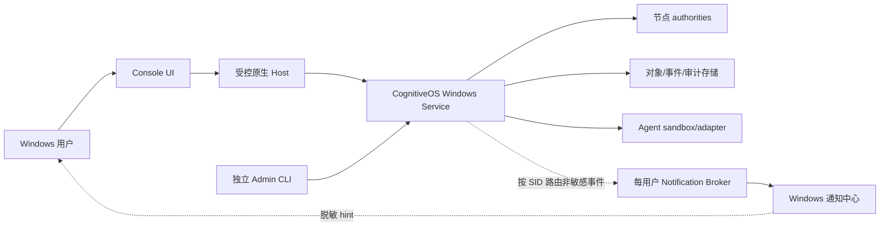

# CognitiveOS Console v2 — Windows v1 范围

> 状态：Draft / planned
>
> 决策依据：[decision-log.md](./decision-log.md)
>
> 产品范围：Windows 桌面、一个本机共享节点、R0/R1

## 1. 发布切片

Windows v1 是一个可闭合的本地竖切，不是五端能力清单：

1. 安装或发现本机 CognitiveOS Windows Service；
2. 通过本机 TOFU 固定节点身份；
3. 使用节点拥有的本地账号认证；
4. 进入对话优先 Shell；
5. 创建、监督、暂停和恢复受治理任务；
6. 查看候选完成、验证、验收和结果未知；
7. 从任意来源获取并检查 Agent；
8. 对 authority 判定为 R0/R1 的 proposal 执行安装、升级、回滚和卸载；
9. 在托盘继续监督并接收脱敏 Windows 通知；
10. 在存储、审计或 watch 降级时安全收窄能力。

当前 Console 实现状态仍为 `planned`。仓库存在参考实现骨架不代表本切片的 Console、Service 合同、认证、监督 lease 或 Agent 生命周期后端已经提供。

## 2. 部署边界

边界要求：

- Windows Service 独立于 Console 和任一用户会话存活。
- Console renderer 不能直接访问 Service Manager、节点数据目录、账号数据库、secure storage 或任意进程 API。
- 原生 Host 只暴露版本化 allowlist IPC，并把当前 Windows SID、节点身份、session 和 channel 绑定到请求。
- Service 是本地账号、授权、状态迁移、risk floor、审计和提交的 authority。
- Admin CLI 是恢复/确定性管理入口，不与 Shell 自然语言共享 proposal 或 credential。
- Service 安装/卸载/stop/restart、机器级更新、bootstrap bundle mint、信任重置和恢复同时要求 Windows 管理员/UAC、签名来源与 anti-rollback；CognitiveOS Owner 不自动拥有 OS 管理权限。
- Session 0 的 Service 不直接向交互桌面发通知。每个登录用户使用受限 notification broker/AUMID activation，把事件路由到正确 SID；无人登录时只保留服务端待办。

## 3. 首次设置与账号

### 3.1 Service 安装

- 若 Service 不存在，Console 可以启动签名安装器；提权发生在受控安装流程，不在 renderer。
- 安装器显示发布者、版本、安装范围、数据目录、网络暴露和回滚结果。
- 默认仅监听本机受控传输；不得因为是 loopback 而跳过身份、session、channel 或权限检查。

### 3.2 Owner bootstrap

- 经过 Windows 管理员/UAC 授权的安装器/Admin CLI 生成高熵、单次、短时 bootstrap bundle，其中包含目标 Service endpoint key、绑定的目标 Windows SID 和 secret。
- Console 必须先验证 endpoint key 匹配 bundle，再提交 secret；不得向仅靠 TOFU 接受的未知端点发送 bearer secret。
- Service 从受认证 IPC peer token 派生 SID，不信任请求正文自报 SID，并原子创建/绑定首个 Owner。
- secret 使用后、过期后或领取失败超过策略阈值后不可重放。
- bootstrap 失败不能回退为“第一个连接者自动成为 Owner”。

### 3.3 后续用户

- 每个 Windows 用户映射独立 CognitiveOS 本地账号。
- Windows SID 是本机绑定信号，不自动等于 CognitiveOS 权限。
- Service 验证本地密码并签发短期 AuthenticationSession；Console 不保存密码或密码哈希。
- 其他本机用户由 Owner 通过 Admin CLI 预置/启用；Windows v1 Console 只管理当前账号/session，完整成员管理后续提供。
- 忘记密码只通过 Admin CLI 恢复；恢复轮换相关 session/secret 并产生持久审计。

### 3.4 TOFU

- 安装器 bundle 存在时，以其 endpoint key 为 bootstrap 信任；没有 bootstrap 动作的普通 loopback 首连才显示节点短身份、Service 发布者和数据位置并以 TOFU 固定。
- 后续身份变化一律阻断，不能用普通“继续”按钮忽略。
- 恢复需由签名更新/恢复证据或 Admin CLI 明确重置信任。
- 未来远程/企业连接不得复用本地 TOFU 默认。

## 4. v1 能力

### 4.1 工作

- Conversation 创建、列表、搜索和恢复；
- 文本、文件、图片及受治理对象引用输入（以节点声明的能力为准）；
- Intent 澄清、目标/范围修订；
- Command Preview 与 R0/R1 结构化确认；
- 稳定 Task/AgentExecution 引用，以及 authority 实际创建时返回的 Intent/Loop/Effect refs；
- 托盘后台监督与 Windows 通知深链。

### 4.2 任务监督

- 任务列表和当前重点任务；
- 普通语言状态摘要 + 机器详情；
- pause request、纠偏/补充输入、attach/detach、reconcile；
- `CANDIDATE_COMPLETE` 与 `COMPLETED` 分离；
- `OUTCOME_UNKNOWN` 作为一级安全状态；
- supervision lease、heartbeat、过期后安全检查点暂停；
- watch snapshot + cursor 恢复。

### 4.3 Agent 全生命周期

- 来源输入：Catalog、URL、Git、本地文件；已识别的 Catalog 身份/传输信任不等于其中包内容可信；
- 下载/导入元数据、签名、provenance、digest 与依赖；
- 静态检查、compatibility、sandbox/adapter 证据；
- 安装 preview、R0/R1 确认、安装进度；
- 升级差异、已有任务影响和 rollback point；
- 回滚 preview 与未决 Effect 保护；
- 卸载前依赖、运行实例、数据保留和审计影响；
- 已安装 Agent 详情和版本历史。

### 4.4 嵌入式最小治理

- 每个系统对象的 authority/version/`as_of`/稳定引用；
- Activity/事件时间线；
- R0/R1 风险等级、外部影响（`Effect`）、预算和失联策略；
- 最小 System Health：Service、authority state store、audit、watch、sandbox、更新状态；
- 安全收件箱：等待用户、结果未知、session 撤销、系统降级；
- 当前账号/session 与通知设置。

不在 v1 建立独立的 Approval、Audit、Users & Access 或 Operation Catalog 一级工作区。

## 5. 风险与写入范围

### 5.1 R0

- 允许 policy 声明的内部治理记录和无外部可观察影响操作。
- 客户端不能自行把 proposal 标成 R0；authority 必须计算或验证风险下界。
- R0 自动提交后仍在 Activity 中可追踪。

### 5.2 R1

- Console 显示目标、变化、来源、参数摘要、风险、预算、出域、deadline、验证、暂停/取消和补偿边界。
- 默认使用明确、动词开头的动作按钮。
- policy 要求时增加一次性 number matching；重发使旧 challenge 原子失效。
- 修改目标、参数、版本、权限、risk、budget、deadline 或 egress 后旧 preview/确认失效。

### 5.3 R2/R3

- 识别并显示“此操作需要后续可信确认能力，Windows v1 不支持”。
- 不显示可点击批准按钮，不接受聊天文本、密码、Windows 通知 action 或本地 debug flag 降级。
- 用户可以返回修改范围；新的 proposal 仍由 authority 重新判定风险。

## 6. 监督 lease 与退出

### 6.1 lease 行为

- 创建任务前，preview 明确“关闭窗口进入托盘会继续监督；退出 Console 会请求暂停”。
- Console 只有在 task/principal/SID/logon-session/channel/client-epoch 绑定仍有效、AuthenticationSession 当前、watch freshness 满足门禁且 UI 可响应时续租；旧实例和被撤销实例不能续租。
- 锁屏、用户切换、session revoke、watch stale 或 UI 健康超时停止续租；Console 不把本地计时器当 authority。
- heartbeat 丢失后 Service 等待策略定义的 grace window，再进入 `pause_pending`。
- pause 只在安全检查点生效；正在执行的不可中断 Effect 不被描述为已停止。
- 恢复 Console 后重新认证、取 snapshot，再由用户显式恢复任务/lease。

### 6.2 关闭行为

- 窗口关闭：隐藏到托盘，不改变任务状态。
- “退出并请求暂停”：列出受影响任务，提交 pause intent，并有界等待 authority 接受请求；接受后终止续租并退出，不等待最终安全检查点无限完成。
- 接受结果超时：默认留在托盘继续监督；用户若仍强制退出，UI 明确将依赖 lease 到期、保留稳定请求引用且不得宣称已暂停。
- 强制结束/崩溃：lease 到期路径负责收窄；不能依赖客户端 `finally`。
- Windows 关机：尽力提交退出信号，但正确性仍依赖 lease 到期。

## 7. 离线与降级

### 7.1 断线、锁屏和本地残留

- 应用不主动把敏感 projection 持久化到磁盘。当前已解锁会话可显示 last-good 快照，固定显示 `as_of` 和“非实时”。
- 所有新写入口禁用；本地草稿可以保留，但不得显示为已提交。
- 锁屏/用户切换进入 `privacy-locked`：teardown 敏感 renderer、零化应用管理的 buffer、显示隐私遮罩；解锁后进入 `reauth-required` 并 resnapshot。
- 冷启动、登出或进程退出后只保留非敏感连接元数据。
- WebView2 UDF/cache、Windows pagefile/hibernation 和 crash dump 可能产生 OS 管理的残留；须使用临时/隔离 profile、禁用不必要 DOM storage、退出清理、dump 策略和平台 PoC 收窄，不作绝对“物理内存唯一副本”承诺。

### 7.2 state store / audit 不可用

- 普通任务、Agent 生命周期、账号/bootstrap/recovery、Service update/trust reset 和配置写全部 fail closed。
- 紧急 pause/stop 只有在 store 健康时预铸的限时遏制 capability 仍可验证、绑定目标/version/fencing、policy 明确允许且独立应急日志可写时继续；`stop` 不被一概视为降低风险。
- 无法验证授权/撤销/fencing 时，仅允许 Service 自身已登记的 supervision lease 到期安全暂停；若应急日志也不可写，返回明确失败而非 best effort。
- 恢复后按稳定 ref 对账；不能把本地排队时间冒充 authority commit 时间。

### 7.3 watch 降级

- 有效 cursor：从已确认位置续接并去重。
- cursor stale、权限变化或 gap：先获取新授权 snapshot，再接增量。
- 刷新时保留 last-good snapshot，但必须标记 refreshing/stale；动画冻结。

## 8. 明确排除

- 远程节点、企业 IdP、多节点、多工作区；
- macOS/Linux/移动发行；
- R2/R3 可信确认面；
- 持久敏感离线缓存；
- 完整审计导出、break-glass、双人审批；
- Memory/Knowledge/Multi-Agent UI；
- 任意包“仅凭警告”运行；
- 本地账号由 Console 保存或验证；
- renderer 直接访问 Service/进程/密钥；
- 客户端聚合状态替代 authority projection。

## 9. 主要产品依赖

以下均未因本设计而自动成为规范已登记或实现已提供：

- Windows Service 安装、版本、IPC、恢复和更新合同；
- 本地账号、SID mapping、Owner bootstrap、Admin CLI recovery；
- AuthenticationSession 和 channel-bound session；
- supervision lease/heartbeat/eligibility/client-epoch/safe-checkpoint pause；
- Task/Loop/Execution/Runtime/Effect/Verification/Acceptance 完整 projection；
- Agent source acquisition、installer、sandbox、adapter、compatibility 和 lifecycle transition；
- server-side risk floor、R1 confirmation object/canonical display profile；
- audit-readiness、应急日志和事后 reconcile；
- 每用户 Windows notification broker、AUMID/session routing 和一次性 handle resolution；
- Console 客户端实现与端到端测试。

## 10. 技术候选与 release gate

Tauri 2 + React/TypeScript 仍是候选，不是已批准结论。进入实现前至少需要：

1. Windows Service + 原生 Host + renderer 的权限隔离 PoC；
2. bootstrap bundle/endpoint key/SID、TOFU、账号/session/recovery 的威胁模型和合同；
3. supervision lease 在多实例、锁屏、用户切换、session revoke、watch stale、UI hang、崩溃、断网、睡眠和关机下的故障注入；
4. 任意包 acquisition 的 SSRF/UNC/ambient credential/path access/resource budget、签名缺失、sandbox bypass 和 rollback 负例；
5. WebView2 security floor、IPC fuzz、XSS/prompt injection；
6. Narrator、键盘、高对比、200%/400% 缩放和 reduced motion；
7. 10k 事件、长会话、托盘 24h、内存和电量预算；
8. 签名安装、Windows 管理员/UAC 边界、anti-rollback、Service 更新、客户端更新和失败回滚；
9. 中英文伪本地化、长文本、Unicode/Bidi 和时区；
10. 所有 release-blocking 产品依赖有 machine contract、实现和已执行证据。
