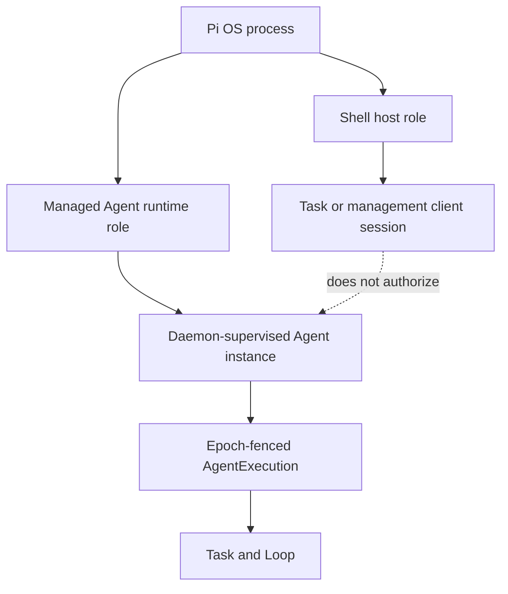

# Personal Agent Shell and Agent Lifecycle

- Status: informative target design
- Decision source: [ADR-0035](../../adr/0035-personal-pi-shell-and-managed-agent-role-separation.md)
- Acquisition source: [ADR-0036](../../adr/0036-personal-linux-1-0-and-official-pi-acquisition.md)

## 1. Agent Shell role

The Agent Shell is the default interaction model, not an authority service and
not synonymous with Pi. Linux 1.0 uses Pi as the Shell host because it provides
the conversational terminal, model interaction and Extension surface. The
governed Shell semantics live in CognitiveOS clients and daemon services so a
future TUI, CLI or graphical client can reuse them.

The Shell supports two modes:

- **natural language** produces an interpretation candidate and structured
  proposal;
- **deterministic commands** select the same operation and application service
  without model interpretation.

Both modes converge before authorization. A model outage must degrade to
deterministic management, not disable recovery or hide state.

## 2. Pi dual-role model

The process is an implementation detail. The daemon may restart the Agent
runtime without ending the Shell watch, or replace a Shell session without
changing the Agent instance. A Pi session identifier cannot be used as an
Agent instance, Task or execution identifier.

## 3. Natural-language management protocol

Every request follows the same logical stages:

1. **record**: persist the user's raw request before interpretation;
2. **interpret**: Pi/model emits a candidate operation and target set;
3. **resolve**: daemon resolves exact resource identities and current versions;
4. **classify**: daemon reads catalog risk, capability and budget policy;
5. **preview**: daemon returns canonical action, targets, expected versions,
   permission changes, external side effects, budget impact and rollback plan;
6. **admit**: client submits the exact preview digest and idempotency key;
7. **execute**: daemon schedules or performs the governed operation;
8. **watch**: Shell renders only authority projections and evidence state.

Ambiguous language never selects a destructive target by guess. If target
resolution is not unique, the Shell asks for clarification before preview.

## 4. Channel model

| Channel | Operations | Credential rule | Projection rule |
|---|---|---|---|
| Task | intent, preview, admit, attach, watch, detach, cancel | task-only bearer | task/loop/execution projections only |
| Management | list, inspect, install, activate, suspend, upgrade, uninstall, grants, doctor | management-only bearer | resource and lifecycle projections only |

A client may hold both sessions, but never places both privileges into one
bearer or shared retry/projection context. Tier 2 operations always require an
explicit confirmation over the management path even if the originating text
appeared in an ordinary conversation.

## 5. Agent object model

| Object | Stable facts | Mutable facts | Does not imply |
|---|---|---|---|
| Agent package | source, version, digest, declared adapter and requirements | none | installation or trust |
| Agent installation | verified bytes, acquisition lock, compatibility report | active/superseded/removed lifecycle | runtime permission |
| Agent definition | installation binding and Personal policy defaults | allowed models, Tools, workspace and Memory policy | a running process |
| Agent instance | definition binding, owner and lifecycle identity | health, activation, suspension and current execution | Task completion |
| Agent execution | Task/Loop/instance/epoch binding | progress, checkpoint and recovery disposition | authority over Task state |
| Process | PID/handle and bounded runtime observation | alive/exited/stopped | logical execution completion |

Agent definition and instance remain product concepts pending a Lane-CTR public
contract decision. The implementation must first reuse registered package,
installation and AgentExecution contracts where they are sufficient.

## 6. Lifecycle operations

### 6.1 Install and connect

`install` acquires and commits package bytes. `connect` is the user concept for
registering a verified installation with Personal policy and creating an
inactive logical instance. Neither grants runtime Tools or workspace access.

For Pi 1.0, install uses the exact official npm package and a production-signed
acquisition lock. A legacy user path may be inspected for migration but cannot
silently become the release-qualified installation.

### 6.2 Activate and supervise

Activation checks installation health, adapter digest, Node compatibility,
current policy and capability leases, then commits a new instance epoch before
starting or selecting a process. Supervision reports health and process facts;
it does not synthesize logical success from `exit 0`.

### 6.3 Pause, resume and stop

- **pause/suspend** blocks new dispatch, fences stale work and reaches a safe
  checkpoint or reports why it cannot;
- **resume** reauthorizes current policy and starts a fresh execution epoch;
- **stop instance** ends supervised runtime after dispatch quiescence and
  Effect reconciliation;
- **cancel Task** requests Task/Loop closure and is not equivalent to killing a
  process.

### 6.4 Upgrade and rollback

Upgrade acquires a second immutable version, runs compatibility/health checks,
then atomically supersedes the active installation/adapter binding. Running
executions remain bound to their recorded epoch or are explicitly migrated
through checkpoint/recovery. Failed activation restores the prior complete
binding; incomplete rollback is durable and visible.

### 6.5 Uninstall

Uninstall previews impacted instances, Tasks, pending Effects, retained data
and capability leases. It disables new dispatch, suspends/fences instances,
closes or quarantines Effects, removes package bytes and marks the installation
removed. Audit/evidence and user data remain unless their separate retention or
purge operation is explicitly confirmed.

## 7. Future adapters

OpenClaw, Hermes, Codex, WorkBuddy and other Agents use the same lifecycle but
are not Linux 1.0 supported Agents. Each requires:

- exact package/protocol/adapter identity and digest;
- compatibility and degradation report;
- declared filesystem, network, subprocess, Tool and secret boundaries;
- lifecycle, cancellation, recovery and out-of-band mutation negatives;
- an independent campaign and release inclusion decision.

Multiple installed Agents do not enable Multi-Agent orchestration. Delegation
and shared-work coordination remain a separate default-off capability train.

## 8. Implementation sequence

1. P2-T02 connects the Pi-hosted Shell to the real Task API and watch path.
2. P5-T01 builds adapter-neutral acquisition/installation and implements Pi.
3. P5-T02 builds registry, instance health and supervision for Pi.
4. B09 proves the managed-Pi lifecycle and adapter framework.
5. P5-T03 through P5-T05 qualify MCP/Tool ecosystem work after Linux 1.0.

Until those tasks execute, current Pi configuration/launch remains a client
integration path rather than a managed-Agent lifecycle claim.
