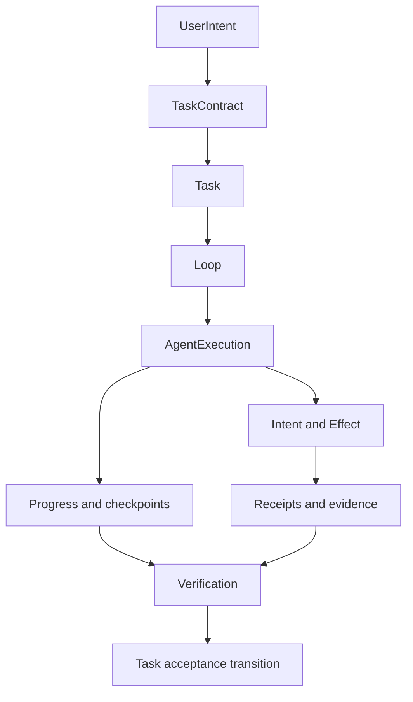
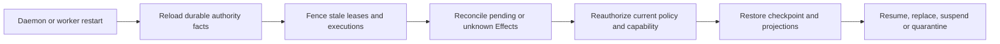

# Personal Authority, Data and Recovery

- Status: informative composition design
- Normative behavior: [Task/Loop/Verification](../../standards/task-loop-verification.md),
  [Intent/Effect](../../standards/intent-effect-idempotency.md),
  [authorization](../../standards/authn-authz-capability.md), and
  [event/watch](../../standards/event-audit-watch.md)

## 1. Authority boundary

The Rust daemon is the sole authority writer. Pi, Agent adapters, the CLI, SDK,
Shell, process supervisor, Provider fixture and tests may submit requests or
observations; none may directly mutate authority SQLite or advance Task,
Effect, AgentExecution or Verification state.

Every authority mutation is evaluated against:

- authenticated principal and channel;
- capability scope and current policy;
- object version/CAS guard;
- Task/Loop/AgentExecution epoch;
- deadline, retry, step, token and cost ceilings;
- idempotency and current Effect state;
- registered state-transition rules.

## 2. Durable object relationships

An Agent installation or instance is referenced by an execution binding; it
does not become part of the Task identity. A new execution epoch fences output
from a replaced instance or stale worker.

## 3. Admission and budgets

The daemon persists raw intent before probabilistic interpretation. The
canonical preview binds resolved targets, expected versions, operation kinds,
capability impact, budget ceilings, acceptance criteria and an idempotency
identity. Admission rejects any digest or version mismatch before Task state is
created or superseded.

Budget checks occur at admission and immediately before dispatch. Reaching an
inclusive deadline/retry/step/cost ceiling prevents another dispatch. The stop
fact must be durably recorded and must not be inferred only from a worker
return value.

## 4. Persist-before-dispatch

For every external mutating operation:

1. validate catalog identity, input schema, capability and Task binding;
2. mint and persist the raw Intent;
3. persist an Effect with stable operation, target, idempotency and fencing
   identity;
4. commit the outbox/dispatch fact before external I/O;
5. dispatch at most under the admitted epoch;
6. persist receipt or unknown outcome;
7. query/reconcile with the same identity;
8. close, compensate or quarantine the Effect;
9. make closed Effect facts available to independent verification.

Provider completion used for conversation is read/egress behavior and creates
no Task side effect by itself. A Tool that mutates external state cannot reuse
that shortcut.

## 5. Scheduler and fencing

Scheduler eligibility is durable. A lease records owner, epoch, expiry,
next-eligible time, attempt count and cancellation state. Acquisition is a
transactional CAS. An expired lease may be reclaimed only under a strictly
higher epoch; old workers remain stale even if their process is still alive.

Canonical wall-clock samples may be clamped to a monotonic floor for scheduling
decisions, while recorded timestamps preserve their own clock-domain meaning.
A clock rollback must not create a second eligible dispatch.

## 6. Completion and evidence

The executor reports observations and evidence references. A separate verifier
evaluates each acceptance criterion against immutable evidence digests and
current authority state. Task completion requires:

- all required criteria have an accepted result;
- no required Effect is open or outcome-unknown;
- no stale execution supplied the accepted result;
- the acceptance transition succeeds under current version/epoch guards.

Provider response, Pi `agent_end`, process exit zero, a Tool receipt or an
executor's self-report is insufficient by itself.

## 7. Recovery protocol

Recovery never retries an unknown external mutation with a new identity. It
queries or reconciles the original Effect. If safe closure cannot be proved,
the Task remains blocked/suspended and the operator receives an actionable,
redacted projection.

Agent upgrade and process replacement use the same rule: establish a new
instance/execution epoch first, fence the old path, then resume only after
pending Effects and checkpoint compatibility are known.

## 8. Data and secret placement

| Data | Approved location | Forbidden locations |
|---|---|---|
| Provider/user secret | native Secret Store | argv, ordinary config, SQLite, logs, CI and evidence |
| Secret reference | bounded non-secret config/authority record | client display and support bundle unless safely redacted |
| Authority state/events | daemon-owned SQLite WAL | direct client/Agent writes |
| Agent package bytes | private immutable installation root | release bundle for Pi, unverified active path |
| Context/artifacts/evidence | governed stores with provenance and access policy | model-owned untracked cache as source of truth |
| Acquisition lock | signed non-secret installation record | raw credentials or mutable package paths |

Backup/restore includes user data and authority metadata according to versioned
migration rules but excludes secret material. Restore revalidates schema,
installation bindings and migrations before the daemon resumes dispatch.

## 9. Evidence boundaries

Local, fixture, WSL and ordinary CI tests may prove implementation behavior.
They do not advance B01, B09, `GMVP-LINUX`, release or Profile status unless a
predeclared campaign explicitly names the environment, artifact, workload,
threshold, evidence collector and independent verifier.
