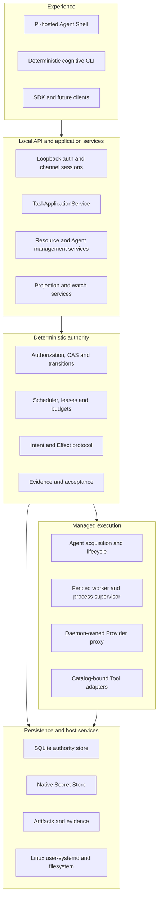
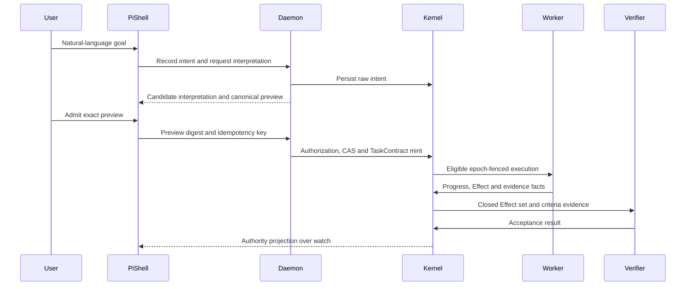
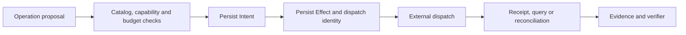

# CognitiveOS Personal System Architecture

- Status: informative target architecture
- Product release target: Linux 1.0 through `GMVP-LINUX`
- Decisions: [ADR-0035](../../adr/0035-personal-pi-shell-and-managed-agent-role-separation.md),
  [ADR-0036](../../adr/0036-personal-linux-1-0-and-official-pi-acquisition.md)

## 1. Architectural purpose

Personal is not a replacement for the Linux kernel. It is a local operating
layer for cognitive resources and Agent work. Linux owns hardware, processes,
filesystems, networking and user isolation. Personal owns the higher-level
facts that make Agent work bounded and recoverable: identity, admission,
permissions, Task contracts, budgets, scheduling, external Effects, evidence
and acceptance.

The design optimizes for one invariant:

> A probabilistic component may suggest what should happen; only the
> deterministic daemon may decide what is authorized, persist what will
> happen, dispatch an external mutation, reconcile its result or accept a Task.

## 2. Layered model

### 2.1 Experience layer

- `packages/pi-cognitiveos` is the Linux 1.0 Pi-hosted Shell adapter. Today it
  provides readiness and daemon-owned completion; P2-T02 adds governed natural
  language Task and management mapping.
- `apps/agent-shell` is the reusable task-channel session core for proposal,
  preview, submit, attach, watch, detach and cancel semantics. It is not a
  second product frontend.
- `apps/admin-cli` provides deterministic recovery and administration when the
  model or Pi is unavailable. Its commands call the same daemon application
  services as the Shell.

Every experience component is a client. Client-local UI state is never a
substitute for an authority projection.

### 2.2 Local API and application services

The daemon binds only a numeric loopback address and authenticates each local
session. Task and management channels have separate credentials, retry
contexts, projection caches and operation sets.

Application services translate client contracts into existing kernel
primitives. They do not create a parallel state machine. In particular,
`TaskApplicationService` fixes raw intent, emits a digest-bound preview, admits
the exact contract under epoch CAS and exposes read-only intent projections.

### 2.3 Deterministic authority

The Rust authority layer owns:

- principal/capability authorization and Tier 0/1/2 policy results;
- object version guards, task/loop epochs and stale-worker fencing;
- deadline, retry, step, token and cost ceilings;
- state-transition legality and atomic event/outbox commits;
- Intent/Effect idempotency and reconciliation;
- acceptance criteria, evidence digests and final Task completion.

No Agent adapter, Provider response, process supervisor or fixture may bypass
these decisions.

### 2.4 Managed execution

The Agent manager acquires and verifies immutable packages, commits durable
installations, registers policy bindings, supervises instances and binds a
fresh `AgentExecution` to a Task/Loop epoch. The worker receives only scoped,
digest-bound inputs and has no authority to enlarge them.

The Provider proxy resolves credentials from the native Secret Store only at
the egress boundary. Tool adapters receive an admitted operation descriptor;
mutating operations require a persisted Effect before dispatch.

### 2.5 Persistence and host services

- SQLite WAL stores authority objects, events, budgets, scheduler facts,
  installation records and reconciliation state.
- The native Secret Store holds Provider/user secret material; SQLite and
  ordinary configuration hold only non-secret references.
- Artifacts and evidence are content-addressed and access-controlled; release
  or support bundles contain only redacted facts and digests.
- Linux 1.0 uses one `cognitiveos-personal.service` user unit and
  `127.0.0.1:48181`.

## 3. Core control flows

### 3.1 Natural-language Task flow

The Shell cannot turn its own proposal, optimistic display or Pi completion
into a Task state.

### 3.2 Agent installation and activation

```mermaid
flowchart LR
  preview["Source and capability preview"] --> acquire["Acquire exact npm artifact"]
  acquire --> verify["Verify identity, SRI and digests"]
  verify --> stage["Private immutable staging"]
  stage --> qualify["Compatibility and health qualification"]
  qualify --> commit["Durable AgentInstallation commit"]
  commit --> register["Registry and policy binding"]
  register --> activate["Epoch-fenced activation"]
```

Acquisition is a network mutation and is governed independently from runtime
permission. A verified package receives no workspace, Tool, model or secret
capability automatically.

### 3.3 External mutation

An unknown dispatch outcome remains unknown until query/reconcile resolves it;
the caller must not blindly retry with a new idempotency key.

## 4. Reuse and refactor map

| Existing asset | Personal 1.0 role | Required change |
|---|---|---|
| `packages/pi-cognitiveos` | Pi Shell host adapter | add separate task-channel integration and natural-language resource operations |
| `apps/agent-shell` | reusable task-channel/session core | remove obsolete milestone framing; compose behind Pi rather than ship as a competing frontend |
| `apps/pi-agent-adapter` | Pi compatibility/candidate boundary | reuse pin and observations; do not promote candidate output to authority |
| `cognitive-management::TaskApplicationService` | Task lifecycle application service | expose through real Personal business routes |
| runtime/store installer | durable acquisition/installation substrate | bind official npm Pi package and production acquisition lock |
| scheduler repository/service | durable eligibility, leases and ceilings | connect durable stop facts, worker and Effect closure |
| Agent package/installation schemas | shared contract foundation | reuse unchanged where sufficient |

If stable adapter identity, Agent definition or Agent instance must become a
public client contract, a later Lane-CTR structural task must update schemas,
registries, generated bindings and negative vectors together. Personal-private
implementation types must not pre-empt that decision.

## 5. Current-versus-target boundary

The repository currently has a real Pi first-conversation route and partial P2
Task/scheduler foundations. The real Task API, managed Pi acquisition and
lifecycle, worker/Tool/verification closure, B09 and Linux 1.0 release Gate are
not established merely by this design. Current facts remain in
[PROGRESS.md](../../plan/PROGRESS.md).
