# UCR-01 Unified Cognitive Resource Workload

- Status: target/design and preregistration input; not-run
- Change class: owner-approved `product-semantic + structural` documentation
- Project: `cognitiveos-personal`
- Current-status owner: [PROGRESS.md](../plan/PROGRESS.md) `Current snapshot`
- Task/Gate owner: [PERSONAL-DEVELOPMENT-PLAN.md](../plan/PERSONAL-DEVELOPMENT-PLAN.md)
- Architecture mapping: [Personal system architecture](../architecture/personal/system-architecture.md),
  [authority and recovery](../architecture/personal/authority-data-and-recovery.md), and
  [Agent lifecycle](../architecture/personal/agent-shell-and-agent-lifecycle.md)
- Benefit-claim contract: [Agent Benefit Benchmark Contract](agent-benefit-benchmark.md)

This document defines the target UCR-01 workload for the unified
cognitive-resource control plane. It does not report an execution, create a new
registry requirement, mark a task complete, change a current Gate, or support a
release/Profile claim.

**Target release rule:** UCR-01 is release-blocking for the first approved
release scope that includes the unified Memory, Skill, Context and recovery
capability described here. Every blocking assertion must pass in its
preregistered campaign; assertions cannot be averaged into a composite score.
The formal Personal plan and release manifest decide which release scope the
rule applies to, while `PROGRESS.md` alone records whether it has run or passed.

## 1. Purpose and bounded claim

UCR-01 tests one governed Task trace across all six resource families, then adds
a second Task to prove immutable Skill reuse and injects one ambiguous external
mutation outcome to prove recovery without a duplicate Effect. It answers four
bounded questions:

1. Can one Task consume exact Memory, Skill, Tool, Context and Runtime bindings
   while Task remains its own authority family, without creating a universal
   resource state machine?
2. Can a later session recall required admitted Memory with no user
   restatement while excluding unauthorized and stale candidates?
3. Can two Tasks pin the same immutable `SkillRevision` digest, and can stable
   and changed Context avoid full replay without reducing verified completion?
4. Can daemon/sidecar restart reconcile an already completed external mutation
   with the original key and still require independent acceptance?

The workload can support a scenario-limited UCR-01 statement only. A broader
claim that CognitiveOS provides significant Agent benefit still requires the
four-arm, W1/W2, statistical and six-threshold protocol in the
[Agent Benefit Benchmark Contract](agent-benefit-benchmark.md).

## 2. Fixed resource fixture

The campaign manifest fixes exact IDs, versions and digests before execution.
It includes at least one resource from each independent family:

| Family | Fixed fixture | Required distinction |
|---|---|---|
| Memory | one required fact admitted in an earlier session, plus stale and unauthorized distractors | admitted provenance/scope/revision remains visible; conversation history is not substituted |
| Skill | one immutable qualified `SkillRevision` used by both Task 1 and Task 2 | both Tasks pin the same digest; no mutable Task-local copy is presented as reuse |
| Tool | one immutable descriptor for a narrow, queryable, idempotent external mutation | candidate, daemon-issued permit, receipt, Effect closure and Task completion remain separate |
| Context | one stable-context stratum and one changed-context stratum with an authorized versioned delta | current, stale and unauthorized sources are labeled before ranking/rendering |
| Task | two admitted Tasks with exact contracts, budgets, criteria and independent acceptance | Task, Loop, resource binding, Effect and Verification identities remain distinct |
| Runtime/Process | exact Pi package, installation, registration, active instance, sidecar protocol/adapter digest, `AgentExecution` and `ProcessAttempt` observation | package, installation, registration, instance, sidecar, process and execution IDs remain separate; process is not a completion authority |

Model is a cross-cutting binding rather than a seventh family. The fixture
therefore also pins one qualified Provider/model revision and capability
snapshot; model selection grants no Tool or secret capability. It also pins
the Task set, sampling settings, Tool endpoint,
permissions, token/time/cost budgets, hardware, concurrency, cache state,
fault-injection point, verifier and grader digest. Provider/user secret material
is never part of the fixture or evidence.

## 3. Required Task trace

Task 1 must produce one correlated authority/evidence trace in this order:

```mermaid
flowchart LR
  taskContract["TaskContract"] --> admittedMemory["Admitted Memory"]
  admittedMemory --> pinnedSkill["Pinned SkillRevision"]
  pinnedSkill --> contextView["ContextView"]
  contextView --> toolDescriptor["Exact Tool descriptor"]
  toolDescriptor --> sidecarExecution["Sidecar and AgentExecution"]
  sidecarExecution --> processAttempt["ProcessAttempt observation"]
  processAttempt --> artifactEffect["Artifact and Effect facts"]
  artifactEffect --> verification["Independent Verification and acceptance"]
```



The arrows mean governed reference/use order, not ownership transfer. Every
step records the Task/Loop/execution epoch, exact resource ID and digest, event
cursor and content-addressed evidence reference needed to correlate the trace.
`ProcessAttempt` stays an implementation-private daemon observation.

Task 2 uses a distinct `TaskContract`, Task ID, execution and sidecar binding,
but pins the exact same Skill stable ID and `SkillRevision` digest used by Task
1. Reacquiring, copying or silently rewriting the Skill does not count as
reuse.

## 4. Six-family projection coverage

The versioned `ResourceApplicationService` must exercise `list`, `inspect` and
resumable `watch` for every family. Each returned item contains stable ID,
family, revision digest or explicit non-revision reason, scope, owner, health,
bindings, usage, blocked reason, allowed actions, object/projection version and
watch cursor.

| Family | `list` assertion | `inspect` assertion | `watch` assertion |
|---|---|---|---|
| Memory | returns only admitted, authorized records | exposes provenance, revision, conflict/tombstone and usage | admission/revocation/forget events resume without unauthorized exposure |
| Skill | returns the stable Skill family and qualified revisions | exposes the pinned digest and both Task bindings | pin/deprecate/revoke changes resume without rewriting revision history |
| Tool | returns the exact immutable descriptor and availability | exposes effect class, capability, health and blocked reason | candidate, disable/revoke and Effect-related availability changes resume without dispatching |
| Context | returns current governed views and source scope | exposes view/source digests, provenance, losses and token usage | invalidation and authorized delta changes resume without stale replay |
| Task | returns both exact admitted Tasks | exposes contract, budget, resource bindings, Effects, criteria and acceptance blockers | admission, progress, reconciliation and acceptance events resume without client-fabricated state |
| Runtime/Process | returns the Pi Runtime projection without collapsing package/installation/registration/instance/sidecar/execution/process identities | exposes pinned adapter/protocol digest, health, current execution and bounded process observations | activation, fence, process exit and sidecar replacement events resume without duplicates or false completion |

Each domain retains its own schema, lifecycle and event types. Passing this
coverage must not be implemented by persisting one generic resource aggregate
or accepting arbitrary common-state transitions.

## 5. Session, Context and fault profile

### 5.1 Cross-session setup

1. Session 1 admits the required Memory fact with provenance, scope, owner and
   revision; the user then ends that Shell and Pi session.
2. Session 2 starts with no conversation replay and no restatement of the fact.
3. Task 1 must retrieve the admitted fact through the Memory domain, include it
   in the governed `ContextView`, and use it in independently verified output.
4. Stale and unauthorized distractors remain in the corpus to prove pre-ranking
   scope filtering and current-version selection.

### 5.2 Stable and changed Context strata

- **Stable Context:** the authorized source set and revisions remain unchanged
  between the measured steps.
- **Changed Context:** one preregistered authorized source changes to a new
  revision; the old revision remains as a stale distractor and only the bounded
  current delta may replace it.
- **Full-replay reference:** the same Agent receives the complete authorized
  Task Context on every measured step, with identical task facts and budget.

Repeated input tokens are counted at the Agent/model input boundary and include
tokens repeated from already admitted unchanged input. The manifest fixes the
tokenizer, message framing, cache state and whether any provider prompt/KV cache
is available. Stable and changed strata are reported separately.

### 5.3 Required mutation fault

The daemon persists Intent, Effect, original idempotency key and dispatch fact,
then issues an exact epoch-bound permit. The external mutation completes. A
fault is injected **after external completion but before receipt persistence**.

After restart:

1. the old sidecar exits and its epoch is fenced;
2. the daemon reloads durable facts;
3. the pending/unknown Effect is queried and reconciled with the original key;
4. policy, capability and budget are reauthorized;
5. Context and pinned resource references are rebuilt;
6. a digest-pinned sidecar starts under the new epoch;
7. execution resumes or quarantines; it never blindly redispatches under a new
   key.

The external-state oracle and independent verifier determine whether exactly
one mutation occurred. Receipt recovery alone cannot mark the Effect committed
or the Task complete.

## 6. Release-blocking correctness and utility assertions

All assertions use complete denominators from the preregistered campaign.
Timeout, refusal, outcome-unknown, quarantine and manual-intervention attempts
remain in the denominator.

| Assertion | Release-blocking target | Required evidence |
|---|---:|---|
| Cross-session recall | every required prior-session fact is retrieved and used in verified output | admitted Memory provenance plus verifier trace |
| User restatement | `0` restatements of the required fact in Session 2 | redacted input/event accounting |
| Skill reuse | Task 1 and Task 2 pin the same stable Skill ID and exact `SkillRevision` digest | both `TaskContract` bindings and Skill inspect/watch projections |
| Required recall | `100%` of preregistered required facts | per-fact retrieval/use numerator and full denominator |
| Unauthorized or stale exposure | `0` unauthorized or stale Memory/Context facts delivered to the Agent | pre-rank authorization/version decisions and rendered Context digest |
| Stable Context repeated-input reduction | at least `20%` versus full replay, with no decrease in verified completion | paired token counts and acceptance results for the stable stratum |
| Changed Context repeated-input reduction | at least `20%` versus full replay, with no decrease in verified completion | paired token counts, authorized delta/version proof and acceptance results for the changed stratum |
| Duplicate Effect | `0` duplicate external mutations across the injected fault | Effect/original-key trace and independent external-state oracle |
| Observability | every required trace stage and all six family list/inspect/watch paths are correlated; resumed watches have no missing or duplicate authority event | event cursors, projection versions, CAS refs and evidence digests |
| False completion | `0` Tasks reported complete before independent acceptance and closed required Effects | Task/Effect/Verification transition evidence |
| Secret leakage | `0` Provider/user secret or usable secret value in argv, config, SQLite, AKP frames, logs or evidence | redaction scanner plus bounded negative inspection |
| Stale epoch acceptance | `0` stale sidecar/execution messages accepted, dispatched or used for verification | old/new epoch trace and fail-closed negatives |

For each Context stratum:

```text
repeated_input_reduction =
  1 - optimized_repeated_input_tokens / full_replay_repeated_input_tokens
```

The threshold requires `repeated_input_reduction >= 0.20` and
`optimized_verified_completion_rate >= full_replay_verified_completion_rate`
within that stratum. A token reduction cannot compensate for a correctness,
authorization, Effect, completion, secret or stale-epoch failure.

## 7. A/B/C/D evaluation design

Any benefit or non-inferiority statement uses the fixed-variable and
preregistration rules from the
[Agent Benefit Benchmark Contract](agent-benefit-benchmark.md).
For UCR-01 the arms are:

| Arm | UCR-01 realization | Interpretation |
|---|---|---|
| A - native baseline | exact same Pi/model/Tool/task set runs natively without CognitiveOS; permissions and budgets are made as equivalent as the native surface allows and every difference is declared | native task baseline, not authority evidence |
| B - governance-only | same Pi runs through daemon authority, sidecar, capability, budget, Context gate, Intent/Effect, audit and verifier; semantic Memory retrieval, Skill reuse, incremental Context and recovery optimization are disabled, using the fixed full-replay behavior | governance cost and non-inferiority only |
| C - optimized | B plus admitted cross-session Memory, immutable Skill reuse, versioned Context delta/CAS references and checkpoint/recovery continuation | candidate bounded utility mechanism set |
| D-memory | C with cross-session Memory retrieval/admission benefit disabled; no hidden manual fact injection may compensate | Memory attribution |
| D-skill | C with reusable `SkillRevision` binding disabled; no copied instructions may be labeled reuse | Skill attribution |
| D-context | C with incremental/delta Context disabled and fixed full replay restored | Context attribution |
| D-recovery | C with checkpoint/recovery optimization disabled while all safety rules remain; the fault may force safe restart/quarantine but never blind redispatch | recovery attribution |

All arms share exact tasks, model/revision, sampling, Tool endpoint, effective
permissions, budgets, hardware/concurrency, cache state, fault profile and
independent verifier. No ablation may turn off authorization, stale-epoch
fencing, persist-before-dispatch, original-key reconciliation, secret controls
or independent acceptance. Full failure denominators and p50/p95/p99 costs are
reported; an ablation failure cannot be silently dropped.

## 8. Claim and statistical boundary

UCR-01 correctness assertions can block a release that includes this capability,
but passing them does not automatically support a broad Agent-benefit claim.

- B versus A may support only governance non-inferiority when the benchmark
  contract's non-inferiority and workload-specific overhead/cache conditions
  are met.
- C and D can attribute a **UCR-01 scenario-limited** mechanism result when the
  preregistered paired statistics and confidence intervals support it.
- A generalized statement such as "CognitiveOS significantly improves Agent
  performance" still requires W1 and W2, power analysis, A/B/C/D arms, 95%
  confidence intervals, an end-to-end primary endpoint, a qualifying effect
  size, mechanism attribution, no safety regression and no offsetting tail or
  maintenance cost under
  section 5.2 of the [Agent Benefit Benchmark Contract](agent-benefit-benchmark.md).
- If those broader gates are absent or fail, the report uses only `hypothesis`,
  `non_inferiority`, or an explicitly scenario-limited capability statement.
  The UCR-01 `>=20%` repeated-input target alone is not a generalized benefit
  claim.

Any executed report must populate the normative performance-report comparison
shape, identify its preregistration, retain every attempt and distinguish
release-blocking correctness disposition from statistical benefit claim level.

## 9. Evidence package

The target evidence package contains:

- immutable campaign manifest, environment and A/B/C/D arm differences;
- exact Pi, package, installation, registration, instance, adapter, protocol,
  sidecar, execution, model, Tool, Memory, Context and Skill identities/digests;
- both `TaskContract` records and the shared Skill binding proof;
- all six families' list/inspect/watch projections and resumed cursor traces;
- rendered Context/CAS references, tokenizer/accounting version and paired
  stable/changed/full-replay token counts;
- Intent/Effect/outbox/permit/reconcile trace with the redacted original key and
  external-state oracle;
- ProcessAttempt, bounded stream, Artifact, evidence and Verification refs;
- fault-injection timestamp, daemon/sidecar epoch transition and stale-message
  negative results;
- independent verifier identity, criteria digest, complete denominator and
  assertion disposition.

The package excludes Provider/user secret values, usable credentials, raw
sensitive Context/Memory where a digest suffices, and any unsupported release
or Profile wording.

## 10. Current status and non-claims

UCR-01 is defined here as a target workload and release-blocking design input.
No campaign result is recorded in this document. Nothing here claims that the
six domain services, common resource projection, sidecar, cross-session Memory,
Skill reuse, Context token reduction, Effect recovery, B09, `GMVP-LINUX`, a
release or a Profile has been implemented, run or passed. Current facts remain
only in [PROGRESS.md](../plan/PROGRESS.md).
