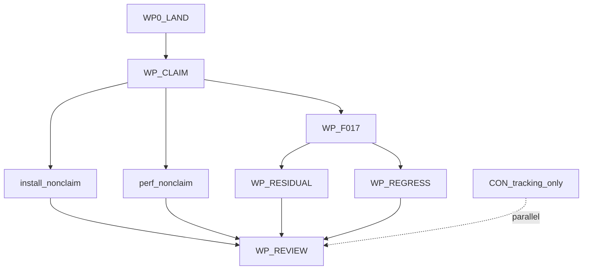

# CognitiveOS M6 出口闭合 / v0.1 重评审计划

- 状态：approved（2026-07-21）；类别 plan（informative）
- Canonical 出口计划；承接 [M6-PLAN.md](M6-PLAN.md) 未闭合出口项
- 更新责任：出口 WP 合入与 v0.1 重评审时同步本文件与 [PROGRESS.md](PROGRESS.md)

## 1 页执行摘要

**目标**：在不扩大 v0.1 规范表面的前提下，闭合 **F-017**（及评审认定的发布级残留），固化可复现平台矩阵 digests 与声明边界，然后以诚实 manifest 重做 **v0.1 发布评审**；结论只能是 GO / GO-with-explicit-non-claim / NO-GO。

**入口（实测 2026-07-21 合入后）**：
- `origin/main` = `24842bb83a0395264e4d5467883e5ac841ceff84`（#31 → #32 → #34；#33 superseded）
- CI run `29801433518` success；pins **pass 55 / not-run 29 / self-check ≥36**
- 工程会话必须在干净 worktree；禁止从含 `personal-blog/**` 的 dirty `main` 推送

**出口**：F-017 对**发布声明集**闭合；M6-A1…A7 / F011-REG 不回归；manifest 诚实（`implemented=0` 可接受）；无冻结违约。**不是**「所有 profile implemented」。

**最大风险**：把 WSL2 Linux guest 写成 Windows-native pass；或把 unit/sample 写成 behavior/Profile。

**推荐合入序**：修 CI → 合入 RUN+CFR → WP-CLAIM 冻结声明 → WP-F017 证据 →（条件）WP-INSTALL / WP-PERF → WP-RESIDUAL/REGRESS → WP-REVIEW。

**已冻结裁决（本计划）**：
1. F-017 最小可 GO = **linux_native 已声明 deny 行有 digest** + **windows_native=unsupported** + **WSL2=not_tested** → 允许 **GO-with-explicit-non-claim**
2. InstallationStore：**non-claim**（进程内 ledger）；不强制 KRN store
3. PERF 全 HW 战役：**non-claim**（A6 partial）；完整 A6 pass 另开战役
4. D-018：交换面 **non-claim**（不得模糊 partial）；不阻塞 GO-with-explicit-non-claim

---

## A. 目标与出口定义

### A1. 一句话目标

闭合 F-017 相对发布声明集的证据与 honesty 边界，补齐可复现 digests，并以诚实 manifest 完成 v0.1 重评审。

### A2. 入口证据（落盘时须 `git fetch` 重跑）

| 项 | 核实命令 | 通过标准 |
|---|---|---|
| main tip | `git fetch origin main && git rev-parse origin/main` | 含已合入 M6 RUN+CFR |
| CI | `gh run list --commit $(git rev-parse origin/main) --limit 5` | success |
| worktree | `git status --short --branch` | clean；无 personal-blog 本地提交混入 |
| pins | CI honesty gate / local runner | 55/29（或当时实测）+ self-check ≥36 |

### A3. 已承认事实（不得改写）

**已交付**：包验证拒装；进程内安装账本 + crash 无半安装（unit）；sandbox/adapter/OOB；`AGENT-INSTALL-001` / `AGENT-BYPASS-002` / `AGENT-OOB-001` behavior pass；readiness 有序评估器（milestone only，D-021）；PERF builder + ungoverned baseline 字段（非完整 HW）；RC manifest 真实 digest、profile ≤ experimental、**implemented=0**。

**残留**：F-017 相对声明集须证据固化；Installation 非 KRN SQLite store（non-claim）；D-018 residual（non-claim）；D-020/D-021 禁止发明；PERF 缺同条件战役 digest（non-claim）；F-011 仅回归。

### A4. v0.1 重评审出口检查清单

1. DEVELOPMENT-PLAN §1 单节点 R0/R1 能力逐项有四类状态用语
2. M6-A1…A7：A1/A2/A4/A7 保持；A3 unit + durable non-claim；A5 milestone-only；A6 partial + non-claim；**M6-F017 对声明集闭合**
3. F-011 三负例 + M6 三 agent 向量不回归
4. 平台行拆分；禁跨平台合并
5. D-018 书面 non-claim（交换面风险）
6. pins/self-check 仅实测；地板不降
7. manifest 诚实；安全负例不可豁免
8. 无 REQ-PERF-005；无冻结扩张
9. 两 OS CI 绿；证据可复现
10. review 链 + PROGRESS + ledger + handoff 完整
11. P-1/P-2 未决不宣称 crates.io/npm 公开发布就绪

---

## B. 工作包分解

### WP0-LAND（前置）

- **Owner**：DOC(#31) → CTR(#32) → RUN/CFR(#34)
- **交付**：clippy/rustfmt 绿；三栈合入；pins 实测
- **禁止**：dirty/personal-blog 基线推送

### WP-CLAIM

- **Owner**：DOC + CFR + RUN
- **交付**：发布声明集冻结表（见 [f017-platform-matrix.md](../traceability/f017-platform-matrix.md) Claim freeze）
- **禁止**：扩大声明超过证据

### WP-F017

- **Owner**：CFR + RUN；新 CI job 须单独权限确认
- **交付**：claimed 行复现命令 + digest；矩阵台账闭合（相对声明集）
- **禁止**：WSL2→Windows-native；无 digest 的 deny

### WP-INSTALL-DURABILITY（本轮不触发）

- **裁决**：non-claim in-process ledger
- **禁止**：installation transition table（D-020）

### WP-PERF-MEASURE（本轮不触发完整战役）

- **裁决**：A6 partial + non-claim；仅 REQ-PERF-004 字段/builder 保留
- **禁止**：REQ-PERF-005；sample 当战役

### WP-RESIDUAL

- **D-018**：non-claim（治理对象端口残留；交换面风险已记录）
- **not-run**：继续 not-run（附理由）；不改负例

### WP-REGRESS

- F-011 三负例 + M6 三 agent 向量；self-check 地板不降

### WP-REVIEW

- 交付 `docs/checkpoints/*-v01-rereview.md`；结论三选一

---

## C. 串行合入序与并行边界

- 单车道分支、单 crate owner、逐路径暂存
- CON 不进核心 PR

---

## D. 验收矩阵

| 判据ID | 描述 | 规范资产 | 实现落点 | 测试层 | 证据路径 | 通过标准 | 阻断级别 |
|---|---|---|---|---|---|---|---|
| F017-MATRIX | 声明集行有复现+digest | F-017；REQ-AGENT-SANDBOX-001；AGENT-BYPASS-002 | SandboxGate + CFR | unit/behavior | f017-platform-matrix.md | 声明集闭合 | **硬** |
| F017-NO-MERGE | 禁跨平台合并 | F-017 | refuse_cross_platform_merge | unit | runtime tests | 合并失败 | **硬** |
| V01-REGRESS | F-011 + M6 三向量 | F-011；AGENT-* | conformance | runner | report + CI pins | behavior pass | **硬** |
| V01-MANIFEST | 真实 RC manifest | REQ-CONF-001/003 | runner | honesty | RC manifest | ≤experimental | **硬** |
| V01-PERF | PERF 战役或 non-claim | REQ-PERF-004 | runtime perf | benchmark/docs | review non-claim | 显式 non-claim | 软（本轮） |
| V01-D018 | envelope 残留裁决 | D-018 | docs | docs | review | 书面 non-claim | 软（本轮） |
| V01-REVIEW | 重评审诚实 | DEVELOPMENT-PLAN §1 | docs | docs/CI | *-v01-rereview.md | 三选一结论 | **硬** |
| M6-A1…A7 | 见 M6-PLAN §D | 同左 | 同左 | 同左 | 同左 | A6 partial+non-claim；A3 durable non-claim | 见上 |

---

## E. 风险与 No-Go

立即 NO-GO：跨平台合并；半安装泄漏；adapter bypass；缺 baseline 却宣称 A6；honesty 虚报；冻结违约；F-017 声明集未闭合却 GO；dirty/personal-blog 基线。

---

## F. Week-0 / Batch-0

1. **Batch-E0**：干净 worktree；合入 #34；重测 pins/CI
2. **Batch-E1**：WP-CLAIM + F-017 linux_native digests（本批）
3. **Batch-E2+**：可选 store/PERF 战役 / D-018 闭合 / 后续重评（分会话）

提示词：
- [m6-exit-batch0-land-and-claim.md](../prompts/m6-exit-batch0-land-and-claim.md)
- [m6-exit-batch1-f017-evidence.md](../prompts/m6-exit-batch1-f017-evidence.md)
- [m6-exit-batch2-optional-store-perf.md](../prompts/m6-exit-batch2-optional-store-perf.md)
- [m6-exit-batch3-rereview.md](../prompts/m6-exit-batch3-rereview.md)

---

## G. 明确不做

R2/R3；distributed；具身/CIM；学习；M7 memory/discovery 产品面；Console/clients 实现；Agent Hub；REQ-PERF-005；规范表面扩张；改写负例；WSL2 当 Windows-native。

## 相关入口

- [M6-PLAN.md](M6-PLAN.md) · [DEVELOPMENT-PLAN.md](DEVELOPMENT-PLAN.md) · [f017-platform-matrix.md](../traceability/f017-platform-matrix.md)
- [20260721-m6-milestone-review.md](../checkpoints/20260721-m6-milestone-review.md)
