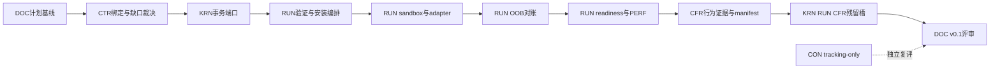

# CognitiveOS M6 开发与验收计划

- 状态：approved（2026-07-21）；类别 plan（informative）
- 入口证据：`origin/main` tip `3c7115c`（PR #30 pins：pass 52 / not-run 32 / self-check ≥33）；[M5 milestone review](../checkpoints/20260721-m5-milestone-review.md) **GO M6**
- 出口：v0.1 发布评审；F-017 平台矩阵为出口硬阻断
- 更新责任：M6 批次合入与出口评审时同步本文件与 [PROGRESS.md](PROGRESS.md)

## 1 页执行摘要

**目标**：在不扩大 v0.1 规范表面的前提下，交付可复现的 C0/C1 安装、回滚、adapter、sandbox、OOB 对账、readiness 与治理开销证据，并以诚实的 profile manifest 完成 v0.1 发布评审。

**已核实入口**：`origin/main` = `3c7115c3eaa50de468505d2e125e5ad81abbf673`（PR #30）；CI run success；PROGRESS 标记 M5 done / GO M6；[M5 review §7](../checkpoints/20260721-m5-milestone-review.md) 三项附带条件。工程会话必须在干净 worktree 从 `git fetch origin main` 后的 tip 建车道；禁止从含 `personal-blog/**` 的本地 dirty `main` 推送。

**出口**：v0.1 发布评审不是“所有 profile implemented”。要求 M6 七项验收、F-017 平台矩阵、F-011 R1 回归核验、M0–M6 review 链、两 OS CI、真实 evidence digest、诚实 manifest、无禁止范围；任何适用 MUST 缺证据时维持 `planned`/`experimental`，安全负例不得降级豁免。

**最大风险**：把 WSL2 的 Linux-kernel 结果写成 Windows-native sandbox 声明。平台行必须拆为 Linux native、Windows+WSL2（Linux guest）和 Windows native；后者没有原生证据即 `unsupported/not-tested`，不得合并成 “Windows pass”。F-017 未闭合即 No-Go。

**推荐串行合入序**：DOC 计划 → CTR 既有 schema codegen/合同缺口裁决 → KRN 安装事务持久化与 fault seam → RUN 包验证/事务编排 → RUN sandbox/adapter/OOB → RUN readiness/R0/PERF → CFR M6 行为执行与 manifest → KRN/RUN/CFR M5 残留槽 → DOC v0.1 review。Lane-CON 只做 tracking/gate 复评，可并行但不进入核心 PR。

**基线缺口（必须先裁决）**：仓库现有五张迁移表仅覆盖 agent-execution/effect/loop/task/verification；**没有** installation transition table。readiness 仅有 `apps/kernel-server` 常量与架构 prose，**没有**登记 REQ/schema/vector/carrier。Lane-CTR 先裁决：使用 companion 确定性状态序列并记录“无机器表”，或证明修正型漏登；冻结期禁止实现车道自行新增表、REQ、Profile 或错误码。

## A. 目标与出口定义

### A1. 一句话目标

让单节点 R0/R1 参考实现能够验证并事务化安装 C0/C1 Agent，在逐平台 sandbox 证据、adapter 不可绕过、OOB 对账、分级 readiness 和治理开销报告约束下，生成首份绑定真实执行证据的 profile manifest，并接受 v0.1 发布评审。

### A2. 入口证据

- [DEVELOPMENT-PLAN §M6](DEVELOPMENT-PLAN.md)：入口 = M5 出口，出口 = v0.1 review。
- [PROGRESS](PROGRESS.md)：M5 done、52/32、self-check ≥33、Profile implemented = 0。
- [M5 review §7](../checkpoints/20260721-m5-milestone-review.md)：GO M6；D-018/剩余向量持续消化；clients blocked；F-017 阻断出口。
- Git/CI：`origin/main=3c7115c...`；开工复核：`git fetch origin main`、`git rev-parse origin/main`、`gh run list --commit $(git rev-parse origin/main)`、`git status --short --branch`。

### A3. v0.1 出口检查清单

1. DEVELOPMENT-PLAN §1 单节点 Core、确定性 management/admin、task Shell、C0/C1 安装适配、R1 结构化确认逐项有实现/测试/证据状态；未交付项不得用规划或静态 schema 冒充。
2. M6 验收 1–7 全通过；F-017 单列通过。
3. F-011 三个 R1 负例保持 behavior pass，不回归；R2/R3 不纳入 v0.1。
4. F-017 平台/通道矩阵逐行声明；Linux native 参考；WSL2 只代表 Linux guest；Windows native 无证据则不声明。
5. D-018 剩余治理对象端口与 envelope 行为证据有明确结果；未闭合须说明对 v0.1 交换面的风险，不得模糊 “partial”。
6. runner 报告逐向量五态诚实；pins 只按实测更新；self-check 地板不得下降。
7. 真实 manifest 由 runner 生成；`test_runs`/performance report/evidence refs 均 pin digest；只有全部适用 MUST 有证据的 profile 才能 `implemented`。
8. PERF 仅报告 REQ-PERF-004 治理开销与 ungoverned baseline；不得输出 REQ-PERF-005 agent benefit 结论。
9. Windows + Linux CI、workspace 测试、consistency、matrix、diff check 全绿；证据可按文档命令重建。
10. M0–M6 milestone-review 链、PROGRESS、matrix、ledger、handoff、影响面扫描完整；无 `History/`、`personal-blog/**`、clients 实现、R2/R3、distributed、具身、学习混入。
11. 许可证与发布渠道（DEVELOPMENT-PLAN §6 P-1/P-2）未决定时允许继续开发，但不得宣告 crates.io/npm 公开发布就绪。

## B. 工作包分解

### WP0 合同消费准备与冻结裁决（S，Lane-CTR + DOC）

依赖 M5 GO。输入：现有 AgentPackage/Installation/Compatibility、performance-report、profile-manifest schema，agent compatibility companion 与 registry。交付：将现有 M6 schema 纳入 Rust/TS codegen（修正型绑定）；对“安装迁移表不存在”和“readiness 无 carrier”出具裁决并写 ledger/handoff。若无法证明为修正型漏登，不新增机器资产；实现按 companion 状态序列测试并把缺口留作已知限制。测试先行：regenerate-diff/round-trip。相关：REQ-AGENT-INSTALL-001/002、COMPAT-001、CONF-001/003、PERF-004；不得新增错误码。

提示词：[m6-batch0-contracts.md](../prompts/m6-batch0-contracts.md)

### WP1 Package 验证（M，Lane-RUN）

依赖 WP0 bindings。交付：`cognitive-runtime` installer/verifier + `kernel-server` 管理入口；签名经端口注入；确定性代码判定 digest/schema/provenance/绑定一致性。失败测试先行：tamper/signature/provenance/digest mismatch → `AGENT_PACKAGE_VERIFICATION_FAILED`、零 commit、零 capability 扩张。REQ-AGENT-INSTALL-001/002；AGENT-INSTALL-001。

提示词：[m6-batch1-installer.md](../prompts/m6-batch1-installer.md)

### WP2 安装事务与回滚（L，Lane-KRN → Lane-RUN）

KRN 提供 append-only installation facts、CAS/lease/fencing、staging→commit 原子可见性、rollback point、crash seam；RUN 编排 companion `SUBMITTED → VERIFIED → ANALYZED → ADAPTED → TESTED → ADMITTED → COMMITTED`（任一步可 REJECTED|QUARANTINED）。故障点至少 verification 后、adapter staging 后、evidence 写入后、commit 前。当前**不存在** installation transition table，不得声称“机器表已消费”。事务中断错误码由 WP0 对照 registry 裁决，禁止虚构。

### WP3 Sandbox 平台矩阵与 F-017（L，Lane-RUN → Lane-CFR）

矩阵：执行环境 × network/filesystem/secrets/subprocess/device/model/MCP/A2A/IPC × declared/undeclared × observability × deny/degrade。Linux native = 参考声明；Windows+WSL2 单列 Linux guest；Windows native 无原生 containment 则 unsupported。REQ-AGENT-SANDBOX-001、ADAPTER-001、COMPLETE-001；AGENT-BYPASS-002；`AGENT_ADAPTER_BYPASS_DETECTED`。F-017 仅在逐行 evidence digest 与复现命令齐全后关闭。

### WP4 C0/C1 六族 adapter（L，Lane-RUN）

Identity / Memory / Tool / Completion / Checkpoint / Sandbox。C0 只声明能证明的 containment；C1 必须中介 identity/conversation/memory/tool/fs/network/secret。Tool batch 只允许已登记 proxy endpoint，逐调用保留 authz/audit/idempotency（IMP-12）。REQ-AGENT-ADAPTER-001、COMPAT-001、COMPLETE-001、INSTALL-002、SHELL-001。

### WP5 OOB 对账（M，Lane-RUN，必要时 KRN projection port）

首读比较 pinned digest；漂移作 external observation → candidate；不得静默覆盖任一侧。REQ-AGENT-OOB-001；AGENT-OOB-001；无专用 error code、不新增。

### WP6 Readiness 与 R0 降级（M，Lane-RUN）

`MANAGEMENT_READY → USER_READY → OPERATIONAL` 确定性 evaluator；乱序故障注入必须 fail；IMP-06 R0 薄路径保留不可降级边界。当前无 readiness REQ/schema/vector/carrier → 证据归 milestone e2e/fault，不得写成 registry conformance；WP0 裁决前不得新增 carrier。

### WP7 PERF 治理开销基线（M，Lane-RUN + CFR）

插桩 authorization/context/effect、cache hit、persistence writes/bytes、approval latency/rubber-stamp、overhead share；同条件 ungoverned baseline。REQ-PERF-004；PERF-REPORT-CONTRACT-001；`PERFORMANCE_REPORT_INCOMPLETE`。禁止示例数字当实测；禁止 REQ-PERF-005 收益宣称。

### WP8 CFR 行为证据与真实 manifest（L，Lane-CFR）

按批使 AGENT-INSTALL-001、AGENT-BYPASS-002、AGENT-OOB-001 not-run→behavior pass；自检地板只升不降；pins 仅实测后更新。runner 生成非 sample release-candidate manifest；`implemented` 仅在全部适用 MUST 有证据时允许。

### WP9 M5 残留并行槽（M，KRN → RUN → CFR）

不挡入口，发布前重新分级：D-018；INTENT-SUPERSEDE-002；INTENT-ACCEPTANCE-007；MGMT-FALLBACK-008（7 vs 4）；SHELL-CHANNEL-ISOLATION-003；TARGET-AMBIGUITY；MIGRATION；DISC-DELTA-SCOPE；disk-full。不改负例 expected。F-011 仅回归。

### WP10 v0.1 发布评审（M，Lane-DOC）

交付 `docs/checkpoints/YYYYMMDD-m6-milestone-review.md` 与证据索引。结论仅 GO / GO-with-explicit-non-claim / NO-GO。F-017、半安装可见、adapter bypass、缺 ungoverned baseline、manifest 虚报任一 → NO-GO。

## C. 串行合入序与并行边界

- 单车道分支、单 crate owner、逐路径 `git add`；禁 `git add -A`。
- 合入序 CTR → {KRN, CFR, TSC} → RUN（见 [PARALLEL-LANES](PARALLEL-LANES.md)）。
- CTR 只做既有 schema 绑定与修正型裁决；新增 transition/schema/REQ/error 必须先证明修正型。
- CON 可独立更新 clients gate 事实；implementation-ready 仍 blocked。
- F-017 若需新 CI job：CFR 单独 workflow-scope PR，先获权限确认。

## D. 验收矩阵

| 判据ID | 描述 | 规范资产 | 实现落点 | 测试层 | 证据路径 | 通过标准 | 阻断级别 |
|---|---|---|---|---|---|---|---|
| M6-ENTRY | M5 出口与 pins | PROGRESS / M5 review / PR #30 | — | CI/read-only | GitHub run + review | tip 含 M5 GO、52/32、self-check≥33 | 入口 |
| M6-A1 | 篡改包拒装 | REQ-AGENT-INSTALL-001/002；AGENT-INSTALL-001；AGENT_PACKAGE_VERIFICATION_FAILED | runtime + kernel-server | unit/e2e/runner | installer tests + conformance report | digest/signature/provenance 错 → 零 commit/零 capability；vector behavior pass | 出口 |
| M6-A2 | adapter/sandbox 绕过拦截 | REQ-AGENT-ADAPTER/SANDBOX/COMPLETE-001；AGENT-BYPASS-002；AGENT_ADAPTER_BYPASS_DETECTED | runtime sandbox/adapters | unit/security/runner | platform matrix + report | 声明边界负例 deny/degrade；authority/capability 不变 | 出口 |
| M6-A3 | 安装事务中断无半安装 | REQ-AGENT-INSTALL-001/002；installation schema | store/kernel/runtime | fault/e2e | crash harness report | reopen 后 committed view 原子；staging 清理/隔离；rollback 可重放 | 出口 |
| M6-A4 | OOB 修改对账 | REQ-AGENT-OOB-001；AGENT-OOB-001 | runtime + projection port | unit/fault/runner | OOB evidence | digest drift + candidate ingest；无 silent overwrite | 出口 |
| M6-A5 | readiness 严格有序 | DEVELOPMENT-PLAN M6；architecture prose；kernel-server constant（机器资产 TBD） | kernel-server/runtime | unit/e2e/fault | readiness fault report | management 可独立；乱序升级 fail；降级不扩权 | 出口（milestone，非 Profile） |
| M6-A6 | PERF 全指标族与基线 | REQ-PERF-004；PERF-REPORT-CONTRACT-001；PERFORMANCE_REPORT_INCOMPLETE | runtime + CFR | benchmark/schema/runner | digest-pinned report | 全指标族实测 + ungoverned baseline；无 benefit claim | 出口 |
| M6-A7 | 真实 profile manifest | REQ-CONF-001/003；REQ-PROFILE-CORE-001；MANIFEST-* | conformance runner | runner/schema/honesty | release manifest + report digest | 非 sample；implemented 仅全部适用 MUST 有证据 | 出口 |
| M6-F017 | 逐平台 sandbox | REQ-AGENT-SANDBOX-001；AGENT-BYPASS-002；F-017 | runtime + CFR | security/runner/platform CI | platform-channel matrix | Linux native 与 WSL2 guest 分列；Windows native 未测不声明 | **出口硬阻断** |
| M6-F011-REG | R1 安全回归 | F-011/IMP-05 三负例 | management/runtime/CFR | runner | conformance report | 三向量保持 behavior pass、dispatches=0 | 出口 |
| M6-D018 | 治理 envelope 残留 | event schema；D-018 | kernel/runtime/CFR | unit/watch/runner | handoff + report | 端口与跨边界组装明确；未闭合须风险裁决 | 软→评审可能出口 |
| M6-RELEASE | v0.1 总评 | DEVELOPMENT-PLAN §1/M6；ledger | 全仓 | CI/e2e/runner/docs | M6 review | A1–A7、F017、F011 通过；No-Go 为零；状态语言诚实 | 出口 |

## E. 风险与 No-Go

- R5/F-017：跨平台合并声明或把 WSL2 当 Windows-native → No-Go。
- 半安装泄漏：未 committed 安装可见或 crash 后自动授予 capability → No-Go。
- Adapter bypass：未登记 network/secret/tool/MCP/proxy 可达，或 completion 文本推进 authority → No-Go。
- PERF：无同条件 ungoverned baseline、示例数字、遗漏 tails，或夹带 REQ-PERF-005 → No-Go。
- Honesty：把 M5 not-run/静态 pass/unit test 写成 behavior pass/Profile implemented → No-Go。
- 合同冻结：自行新增 installation table/readiness carrier/错误码/REQ/Profile，或改写负例 → No-Go。
- 运维：磁盘不足只清可再生 `target`/artifacts；rate limit 不虚报 CI；workflow 缺权限则停；pins 只实测更新。
- 本地基线：不得从含 personal-blog 本地提交与 dirty 文件的 `main` 推送。

## F. Week-0 / Batch-0

1. **Batch-0A**（Lane-CTR）：[m6-batch0-contracts.md](../prompts/m6-batch0-contracts.md) — 既有 M6 schema codegen + 安装表/readiness 缺口裁决。
2. **Batch-0B**（Lane-RUN，待 0A 合入）：[m6-batch1-installer.md](../prompts/m6-batch1-installer.md) — 篡改拒装 tracer（VERIFIED/拒绝为止）。

总入口：[milestone-m6.md](../prompts/milestone-m6.md)。不要把 11 个工作包装进单个工程会话。

## G. 明确不做

R2/R3 完整审批；distributed/多 Agent；具身/CIM；在线或受控学习；M7 memory/discovery 产品面；Console/clients 实现；Agent Hub 实现；REQ-PERF-005 agent 收益宣称；规范对象族/Profile/REQ 域扩张；改写/删除负例；用 mock/静态 schema/unit test 冒充 Profile 证据。

## 相关入口

- 规划源：[DEVELOPMENT-PLAN.md](DEVELOPMENT-PLAN.md) §1 + §M6；[PARALLEL-LANES.md](PARALLEL-LANES.md)
- 台账：[../traceability/findings-ledger.md](../traceability/findings-ledger.md)（F-017 / D-018 / IMP-04/06/11/12）
- 规范：[../../specs/agent-compatibility/README.md](../../specs/agent-compatibility/README.md)
- 规划 handoff：[../checkpoints/20260721-m6-planning-handoff.md](../checkpoints/20260721-m6-planning-handoff.md)
