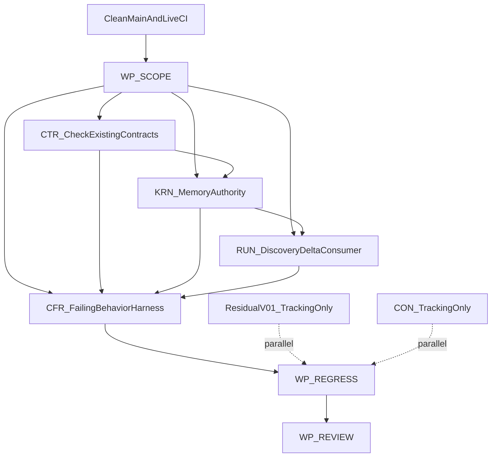

# CognitiveOS M7 开发与验收计划

- 状态：approved（2026-07-21）；类别 plan（informative）
- Canonical 下一阶段计划；主线 = **M7 受治理记忆与认知发现**
- 承接：[DEVELOPMENT-PLAN.md](DEVELOPMENT-PLAN.md) §M7+；[M6-EXIT-PLAN.md](M6-EXIT-PLAN.md)；[20260721-v01-rereview.md](../checkpoints/20260721-v01-rereview.md)（**GO-with-explicit-non-claim**）
- 更新责任：M7 入口/出口 WP 合入时同步本文件与 [PROGRESS.md](PROGRESS.md)

## 1 页执行摘要

**目标**：在诚实保留 v0.1 explicit non-claim 的前提下，交付可复现的 MemoryCandidate 准入/生命周期与 discovery delta/停滞/read-separation 行为证据；默认继续禁止 REQ-PERF-005 收益声明；v0.1 残留（InstallationStore / PERF-004 全 HW 战役 / D-018 / F-017 扩声明）隔离为并行加固轨或继续 non-claim，不与 M7 混仓。

**主线裁决**：
1. 下一主线 = **M7**（非 V01-HARDENING 优先，非 POST-V01 双轨）。
2. 规范边界 = **existing-only**：只实现 tip 已登记的 Memory/Discovery schema、REQ、companion、vectors；**不**新增 Profile / REQ 域 / 对象族；**不**默认解冻 IMP-01。若 Batch-0 证明登记合同不足，停在 WP-SCOPE，另行人类裁决修正型变更。
3. v0.1 结论继续是 **GO-with-explicit-non-claim**；M7 是独立实验 Profile 轨，不回写 v0.1 为 Profile implemented。

**入口证据（本计划落盘实测 2026-07-21）**：

| 项 | 实测 |
|---|---|
| `origin/main` | `f933d3c50ec1b4086d81428f0e76f7a7f8272b59`（含 #34 M6+EXIT + #35 tip 钉扎） |
| CI | [run 29801983501](https://github.com/agentkernel/cognitive-os/actions/runs/29801983501) **success**（ubuntu + windows） |
| 开放 PR | **0**（`gh pr list --state open`） |
| pins | **pass 55 / not-run 29 / self-check ≥36**（CI honesty gate） |
| F-017 | **closed-for-release-claim-set**；digest `sha256:evidence-{network,secrets,tool_proxy}` |
| Profile implemented | **0**；RC ≤ `experimental` |
| 工作目录 | 本批在干净 worktree `lane/doc-m7-plan` ← `origin/main`；**禁止**从含 `personal-blog/**` 的 dirty `main` 推送 |

开工会话须重新 `git fetch` 并核对 tip；pins 以当时实测为准，不得抄旧数。

**出口**：M7 关键安全负例行为 pass + 故意绕过 self-check fail；v0.1 回归（F-011 / M6 三 agent / F-017 claim-freeze）不回退；manifest 诚实；结论只能是 **GO** / **GO-with-explicit-non-claim** / **NO-GO**。**不是**「所有 profile implemented」。

**最大风险**：把 unit/static/sample 写成 behavior/Profile；跨平台合并 sandbox 声明；静默升级 v0.1 non-claim；借 M7 扩规范表面。

**推荐合入序**：干净入口 → WP-SCOPE → CTR（仅核对既有合同）→ KRN memory authority → RUN discovery delta consumer → CFR behavior/self-check → REGRESS → REVIEW。CON 与 Residual-V01 仅并行 tracking。

---

## A. 目标与出口定义

### A1. 一句话目标

交付 `Observation → MemoryCandidate → deterministic admission → MemoryObject/lifecycle` 与 `candidate → bound/narrowed admission → ContextViewDelta → bounded resolution` 的可复现行为证据；模型只产 candidate/proposal；授权、scope 收窄、CAS、预算、fencing、派生失效与最终提交由确定性代码执行。

### A2. 入口证据（落盘后会话须重跑）

| 项 | 核实命令 | 通过标准 |
|---|---|---|
| main tip | `git fetch origin main; git rev-parse origin/main` | 等于本计划记录 SHA，或经重评审更新 |
| CI | `gh run list --commit $(git rev-parse origin/main) --limit 5` | success |
| worktree | `git status --short --branch` | clean；无 personal-blog 本地提交混入 |
| pins | CI honesty gate / local runner | 以实测为准（落盘参考 55/29；self-check ≥36） |
| consistency | `pnpm run check:consistency`；`git diff --check` | 绿 |

### A3. 已承认事实（不得改写）

**v0.1 已达成（GO-with-explicit-non-claim）**：M0–M6 交付链在案；pins 55/29；RC ≤ experimental；implemented=0；F-017 closed-for-release-claim-set（仅 linux_native 三 deny 行有 digest）。

**explicit non-claims（必须继承到 M7 review / 发布笔记）**：
1. Windows-native sandbox — unsupported
2. WSL2 guest sandbox — not_tested（若测，只能写 Linux guest）
3. Durable install authority — in-process ledger only（非 KRN `InstallationStore`）
4. REQ-PERF-004 全 HW 战役 — 未做（builder/sample ≠ campaign）
5. REQ-PERF-005 agent benefit — 未输出
6. Profile `implemented` — 0
7. D-018 治理对象端口 — residual / exchange-surface non-claim
8. R2/R3、distributed、clients/Console/Agent Hub、M8+ 产品面 — 不在 v0.1，亦不因本计划默启

**已登记 M7 输入资产（existing-only）**：
- Companion：`specs/governed-memory/README.md`、`specs/cognitive-discovery/README.md`
- Schema：`memory-candidate` / `memory-admission-decision` / `memory-object` / `context-view-delta`（及已有 `context-request-admission`、`cognitive-resource-manifest`、`information-gap`）
- REQ：`REQ-MEM-OBJECT-001`、`REQ-MEM-ADMIT-001/002`、`REQ-MEM-PROMOTE-001`、`REQ-MEM-DELETE-001`、`REQ-DISC-MANIFEST-001`、`REQ-DISC-ADMIT-001`、`REQ-DISC-DELTA-001`、`REQ-DISC-STAGNATION-001`；扩展覆盖追踪项 `REQ-MEM-MUTATE-001`、`REQ-MEM-SHELL-001`、`REQ-DISC-PRIVACY-001`、`REQ-DISC-SHELL-001`（不得伪称行为已完成）
- Vectors：`MEM-ADMISSION-001`、`MEM-RYW-001`、`MEM-PROMOTION-002`、`MEM-INVALIDATION-003`、`DISC-DISCOVER-READ-001`、`DISC-ADMISSION-002`、`DISC-DELTA-SCOPE-003`、`DISC-STAGNATION-004`
- 评测合同：`docs/evaluation/agent-benefit-benchmark.md`（REQ-PERF-005；默认本阶段 non-claim）
- 注：`DISC-STAGNATION-004` / `DISC-ADMISSION-002` 已有 M3 行为 pass；M7 须确认 delta 消费与 memory 路径缺口，不得把既有 pass 扩成 Profile implemented

### A4. 出口检查清单

1. DEVELOPMENT-PLAN §M7 关键闭环有四类状态用语诚实落档
2. Memory：admission / RYW / promotion / invalidation 安全负例行为 pass
3. Discovery：read-separation / candidate narrowing / delta scope / stagnation（含 DISC-DELTA-SCOPE-003 脱 not-run 或有据延期）
4. F-019 行为侧闭合或显式 remaining non-claim
5. F-011 三负例 + M6 三 agent 向量 + F-017 claim-freeze digests 回归
6. pins/self-check 仅实测；地板不降
7. manifest 诚实；安全负例不可豁免；Profile implemented 可仍为 0
8. REQ-PERF-005：默认 non-claim；若升格须完整四臂+预注册
9. InstallationStore / PERF-004 campaign / D-018 / F-017 扩声明未混入 M7 核心 PR 且未静默升级
10. Console/clients 仍 tracking-only；implementation-ready 仍 blocked
11. 两 OS CI 绿；证据可复现；PROGRESS + ledger + handoff + review 完整
12. 无 IMP-01 违约（无新对象族/Profile/REQ 域）

---

## B. 工作包分解

### WP-SCOPE：主线与规范边界

| 字段 | 内容 |
|---|---|
| 依赖 | 入口证据；v01-rereview；M6-EXIT；PARALLEL-LANES；findings-ledger |
| Owner | Lane-DOC 主导；CTR 仅在已有合同被证明不足时参与；CFR 复核 runner 可执行性 |
| 输入 | 已登记 M7 schemas/REQ/vectors；IMP-01/03/18；F-019/F-026；D-018 |
| 交付物 | 本文件；REQ→vector→owner 清单；existing-only 冻结说明；入口 handoff |
| 测试层 | consistency；registry↔schema↔vector；计划审查 |
| 禁止 | 借计划新增 Profile/REQ/object；把向量 `profiles:` 元数据写成 Profile implemented |

### WP-M7-MEM：MemoryCandidate 准入与生命周期

| 字段 | 内容 |
|---|---|
| 依赖 | M5 authority/Task/Effect 基线；WP-SCOPE |
| Owner | **Lane-KRN**（memory authority/store/lifecycle）+ **Lane-CFR**（behavior）；CTR 仅既有绑定/codegen；RUN 仅在需暴露投影时协作；DOC 追溯 |
| 输入 | memory-* schemas；REQ-MEM-*；MEM-* vectors；governed-memory companion |
| 交付物 | Candidate 类型与工作集边界；确定性 admission；admit/reject/review/quarantine；RYW 私有绑定；跨 scope 新对象+新 admission+lineage；source revocation 对 index/summary/embedding/cache/ContextView 的 closure |
| 测试层 | Rust unit/integration；真实 authority store 行为；CFR runner；schema contract；self-check；fault（若 harness 支持） |
| 必须证明 | 模型摘要不可直发长期 memory；pending writer 可见、跨 Conversation/ResourceScope 不可见；失败 quarantine；原地跨 scope relabel 拒；冲突保留；删除/读撤销/legal hold/derived closure 分账 |
| 禁止 | in-process ledger 冒充 InstallationStore；MemoryObject 当 World State/Knowledge/Evidence；模型直写 authority；未批准新错误码/对象族 |

### WP-M7-DISC：发现 delta / 停滞 / read-separation

| 字段 | 内容 |
|---|---|
| 依赖 | M3 context pipeline；M5+ delta 消费路径；WP-M7-MEM 投影；WP-SCOPE |
| Owner | **Lane-KRN**（admission/state）+ **Lane-RUN**（delta consumer）+ **Lane-CFR**；CTR 仅既有绑定；DOC 追溯；CON 仅 tracking |
| 输入 | cognitive-resource-manifest / context-request-admission / context-view-delta / information-gap；REQ-DISC-*；DISC-* vectors |
| 交付物 | discover/read/action 分离；candidate normalize/bind/narrow；delta base binding + 新增引用重授权 + 累计预算；bounded stagnation 出口；错误隐私外部表示 |
| 测试层 | CFR behavior；runtime integration；KRN tests；schema；security negative |
| 必须证明 | delta 不扩大 ActivityContext/purpose/scope/audience/egress/hard budget；服务不可用 ≠ 无结果；有界停滞；discoverable ≠ read；撤销后 expandable 失效；跨 Conversation reuse 拒 |
| 禁止 | ranker/LLM 决定最终 scope/authority；static/sample 冒充 behavior；新增 M8 catalog/SMS/CRB 面 |

### WP-PERF-005：条件工作包（默认不触发实测）

| 字段 | 内容 |
|---|---|
| 依赖 | MEM/DISC 可评测机制；BenchmarkManifest；独立 verifier；人类升格裁决 |
| Owner | CFR（评测/证据）+ RUN/KRN（instrumentation）+ DOC（预注册复核） |
| 默认出口 | **继续 non-claim/hypothesis**；可交付 harness/预注册设计，**不**输出 agent benefit |
| 升格出口 | 四臂 A/B/C/D；至少 W1/W2；固定模型/工具/权限/预算/cache/fault/grader；完整分母；comparison 块；claim_level ∈ {hypothesis, non_inferiority, significant_benefit} |
| 禁止 | microbenchmark/sample/builder 冒充收益；缺 B 臂/ablation/preregistration；非劣化写成提升；删失败样本；把 PERF-004 未完成战役宣称完成 |

### WP-RESIDUAL-V01：v0.1 残留隔离

| 条目 | 本阶段裁决 | Owner | 备注 |
|---|---|---|---|
| InstallationStore | **继续 durable non-claim** | KRN/RUN（另开） | 不阻塞 M7 |
| PERF-004 全 HW 战役 | **继续 non-claim** | CFR/RUN（另开） | builder ≠ campaign |
| D-018 治理对象端口 | **继续 residual / exchange-surface non-claim** | CTR/KRN/RUN（另开） | 不阻塞 M7 |
| F-017 扩声明 | **禁止无 digest 扩声明**；扩则 reopen → NO-GO | CFR/RUN/DOC | claim freeze 冻结 |

测试层：追踪/文档一致性 + 回归。禁止混入 M7 核心 PR 或静默升级。

### WP-NOT-RUN：29 条消化分级（入口参考；执行时以 runner 报告实测为准）

| 分级 | 代表项 | 处置 |
|---|---|---|
| **入 M7** | `MEM-ADMISSION-001`、`MEM-RYW-001`、`MEM-PROMOTION-002`、`MEM-INVALIDATION-003`、`DISC-DELTA-SCOPE-003`、`DISC-DISCOVER-READ-001`（及 M7 discovery 行为缺口） | 行为执行目标；未完成保持 not-run+理由 |
| **已有行为、M7 复核** | `DISC-ADMISSION-002`、`DISC-STAGNATION-004`（M3 pass） | 不得扩成 Profile implemented；确认与 memory/delta 路径一致性 |
| **M5/M6 回补（不因 M7 借名关闭）** | `MGMT-FALLBACK-008`、`INTENT-SUPERSEDE-002`、`INTENT-ACCEPTANCE-007`、`SHELL-CHANNEL-ISOLATION-003`、`SHELL-TARGET-AMBIGUITY-001`、`SHELL-EXECUTION-MIGRATION-009`、`state-store-degradation` disk-full 分量等 | 继续 not-run 或另开回补批 |
| **继续 not-run（M8+）** | catalog / semantic / knowledge / embodied / CIM / learning 等 | 保留理由；不改 expected |

纪律：not-run ≠ fail；schema/unit/sample pass ≠ behavior pass。

### WP-REGRESS：v0.1 回归

| 字段 | 内容 |
|---|---|
| Owner | CFR 主导；KRN/RUN/TSC 提供实现回归；DOC 声明复核 |
| 固定集 | F-011 三审批负例；`AGENT-INSTALL-001` / `AGENT-BYPASS-002` / `AGENT-OOB-001`；`f017_claim_freeze_digests_are_stable` + `refuse_cross_platform_merge`；self-check ≥36；RC manifest honesty |
| 通过 | 原 pass 不回退；三 digest 与平台行不变；Windows native unsupported；WSL2 Linux guest not_tested |

### WP-CON-GATE：Console/clients（tracking only）

| 字段 | 内容 |
|---|---|
| Owner | Lane-CON + Lane-DOC |
| 交付 | 复评依赖组 1/2/6/7 与 `clients/governance/readiness-gates.md`；记录 M7 Memory private working set 仍属依赖组 6，**不是**实现授权 |
| 禁止 | 任何 Console/clients/Agent Hub 组件、脚手架、mock、helper、实现；不得把 M7 backend evidence 写成 implementation-ready |

### WP-REVIEW：里程碑出口

| 字段 | 内容 |
|---|---|
| Owner | Lane-DOC；CFR/KRN/RUN/CTR 供证；CON informative 复评 |
| 交付 | `docs/checkpoints/YYYYMMDD-m7-milestone-review.md`；PROGRESS；ledger/matrix；handoff |
| 结论 | **GO** / **GO-with-explicit-non-claim** / **NO-GO**（三选一，禁止模糊） |

---

## C. 串行合入序与并行边界

规则：
- 一车道一分支一会话；单 crate/package owner；逐路径 `git add`；禁 `git add -A`
- 接口/schema/生成物只经 Lane-CTR；向量增补/执行经 CTR/CFR + docs-sync-contract
- 合入序：DOC/SCOPE → CTR check → KRN → RUN → CFR → REGRESS → REVIEW
- 共享 PROGRESS/ledger/matrix：后合并方 rebase
- CON 不进核心 PR

---

## D. 验收矩阵

| 判据ID | 描述 | 规范资产 | 实现落点 | 测试层 | 证据路径 | 通过标准 | 阻断级别 |
|---|---|---|---|---|---|---|---|
| ENTRY | 干净且基于最新远端 main | AGENTS；PARALLEL-LANES；v01-rereview | git/worktree/CI | shell + GitHub | M7 handoff entry | tip 与记录一致或经重评；status clean；CI success；无 personal-blog 基线 | 硬 |
| PINS | 入口计数真实 | IMP-17；conformance-evidence | CFR runner | runner | conformance-report.json；CI | 仅实测；落盘参考 55/29；self-check ≥36 | 硬 |
| REGRESS-V01 | v0.1 行为回归 | F-011；M6 AGENT-* | KRN/RUN/CFR | behavior + unit | CI；M7 review | F-011 三负例 + M6 三 agent pass，无回退 | 硬 |
| F017-CLAIM-FREEZE | 平台声明冻结 | F-017；f017-platform-matrix | SandboxGate | unit/behavior | matrix + digests | 三 linux_native deny digest 稳定；WSL2 not_tested；windows_native unsupported；无跨平台 merge | 硬 |
| M7-MEM-SCHEMA | Candidate/decision/object 合同可解析 | REQ-MEM-*；memory schemas | contracts/codegen + KRN | schema/regenerate | schema tests | registry↔schema↔vector 绿；无新对象族 | 硬 |
| M7-MEM-ADMIT | 长期 memory 必经确定性 admission | REQ-MEM-ADMIT-001；MEM-ADMISSION-001 | KRN admission/store | behavior negative | vector report | 模型摘要不可直发；authority 不变；capability 不扩；expected 不变 | 硬 |
| M7-MEM-RYW | pending RYW + 跨 scope 私有 | REQ-MEM-ADMIT-002；MEM-RYW-001 | working-set guard | behavior + isolation | vector + store tests | writer RYW；跨 Conversation false；失败 quarantine | 硬 |
| M7-MEM-LIFECYCLE | 晋升新对象；失效闭包 | REQ-MEM-PROMOTE/DELETE；MEM-PROMOTION-002；MEM-INVALIDATION-003 | KRN lifecycle | behavior + fault | M7 memory evidence | 原地 relabel 拒；冲突保留；派生失效可审计 | 硬 |
| M7-DISC-READ | discover ≠ read/action | REQ-DISC-MANIFEST-001；DISC-DISCOVER-READ-001 | manifest/authz | behavior negative | CFR report | 正文读拒；不泄露存在性 | 硬 |
| M7-DISC-ADMIT | candidate 收窄后执行 | REQ-DISC-ADMIT-001；DISC-ADMISSION-002 | context admission | behavior | CFR/KRN | 只收窄；ranker 不可绕过 | 硬 |
| M7-DISC-DELTA | delta 不扩 scope/重置预算 | REQ-DISC-DELTA-001；DISC-DELTA-SCOPE-003 | RUN delta + KRN | runtime behavior | vector + integration | base binding；重授权；预算单调；越权拒 | 硬 |
| M7-DISC-STAGNATION | 有界可观察停滞 | REQ-DISC-STAGNATION-001；DISC-STAGNATION-004 | ResolutionSession | behavior + fault | CFR + kernel | 注册停滞码；不可用 ≠ 无结果 | 硬 |
| M7-CROSS-SCOPE | 禁跨 scope/Conversation | REQ-MEM-ADMIT-002；REQ-DISC-DELTA-001 | store/context | security negative | isolation evidence | 全拒或 controlled fallback；无 capability 铸造 | 硬 |
| NOT-RUN-LEDGER | 29 条诚实分级 | IMP-17 | runner report | static/report | M7 review | 每条入 M7/残留/继续 not-run；无静默转换 | 硬 |
| PERF-005-CLAIM | 收益声明合规 | REQ-PERF-005；agent-benefit-benchmark | harness/report | benchmark | preregistration + report | 默认 non-claim；任何 claim 须四臂+W1/W2+完整分母 | 硬（若宣称）/ 否则显式 non-claim |
| MANIFEST-HONESTY | Profile 状态诚实 | REQ-CONF；profile-manifest | generator | consistency + review | RC/profile | implemented 仅有全证据；可仍为 0 | 硬 |
| RESIDUAL-INSTALL | durable install 分离 | M6 rereview | 无 M7 实现 | docs | review/handoff | 显式 non-claim | 硬（若虚报） |
| RESIDUAL-PERF004 | HW 战役分离 | REQ-PERF-004 | 无 M7 campaign | docs | review | sample ≠ campaign | 硬（若虚报） |
| RESIDUAL-D018 | D-018 状态准确 | D-018 | exchange surface | docs | review | residual/non-claim 除非另证闭合 | 硬（若虚报） |
| RESIDUAL-F017 | 无 digest 不扩声明 | F-017 freeze | SandboxGate | unit/review | matrix | 扩声明 = reopen | 硬 |
| CON-GATE | Console 仍 blocked | DEVELOPMENT-PLAN；readiness-gates | docs only | manual gate | clients READINESS | 无实现/mock；仅 tracking | 硬 |
| DOC-SYNC | 文档联动 | docs-sync-contract | Lane-DOC | consistency | PR 描述 | check:consistency + diff --check 绿 | 硬 |
| SELF-CHECK | 错误实现翻 fail | runner self-check | CFR | self-check | CI | ≥36；新 anti-pattern 必翻 | 硬 |
| REVIEW | 出口结论可复现 | DEVELOPMENT-PLAN M7 | milestone review | CI + review | `*-m7-milestone-review.md` | GO / GO-with-explicit-non-claim / NO-GO | 硬 |

---

## E. 风险与 No-Go

立即 **NO-GO**：
- WSL2 Linux guest 写成 Windows-native；无 digest 扩大 F-017 声明集
- adapter bypass、半安装泄漏、authority 绕过、跨 Conversation/scope memory 泄漏
- receipt / 远端 completed / 模型自述 / HTTP 200 / sample 伪造完成证据
- unit/static/schema-valid/sample/builder 写成 behavior pass 或 Profile implemented
- PERF-004 sample 写成全 HW campaign；PERF-005 hypothesis/non_inferiority 写成收益提升
- 新增 Memory/Discovery 对象族、Profile、REQ 域或未批准错误码（IMP-01 违约）
- 改写/删除安全负例或放宽 expected
- 概率组件直写 authority / 输出 decision-commit 语义
- Console/clients/Agent Hub 实现或 mock 进入本阶段
- dirty / personal-blog 基线推送；跳过 PR/CI/owner
- PROGRESS / matrix / ledger / handoff / 证据路径未同步

残留项各自独立 owner/计划/证据，不作 M7 隐含前置或隐含完成。

---

## F. Week-0 / Batch-0

### 最小第一批

1. **Batch-0A**：干净 worktree；fetch/tip/CI/status/runner/check-consistency/diff-check；冻结 inventory；**不改** normative asset → [`m7-scope-and-entry.md`](../prompts/m7-scope-and-entry.md)
2. **Batch-0B**：为 `MEM-RYW-001` / `MEM-ADMISSION-001` / `MEM-PROMOTION-002` / `DISC-DELTA-SCOPE-003` / `DISC-DISCOVER-READ-001` 建真实执行入口，先确认 fail/not-run → [`m7-memory-contract-and-failing-tests.md`](../prompts/m7-memory-contract-and-failing-tests.md)
3. **Batch-0C**：authority 边界审查（working-set / store / lifecycle / delta consumer）；需新合同则回 WP-SCOPE
4. **Batch-0D**：最小竖切 `candidate → admission → writer-private RYW → quarantine/reject` → [`m7-memory-runtime-slice.md`](../prompts/m7-memory-runtime-slice.md)

### 后续分批提示词

| 批次 | 提示词 | 车道 |
|---|---|---|
| Discovery | [m7-discovery-delta-and-stagnation.md](../prompts/m7-discovery-delta-and-stagnation.md) | RUN + KRN |
| CFR 向量 | [m7-cfr-vectors-and-self-check.md](../prompts/m7-cfr-vectors-and-self-check.md) | CFR |
| PERF-005 裁决 | [m7-perf005-decision.md](../prompts/m7-perf005-decision.md) | DOC + CFR（默认不测收益） |
| 出口 | [m7-exit-review.md](../prompts/m7-exit-review.md) | DOC |

总入口：[milestone-m7.md](../prompts/milestone-m7.md)。**禁止**单会话塞入全部 WP。

---

## G. 明确不做

除非本计划后续人类明确升格并另开计划：
- R2/R3；SMS/CRB/M8；distributed/M9；多 Agent
- 具身/CIM/M10；在线/受控学习/M11
- Console / clients / Agent Hub **实现**
- Windows-native sandbox；WSL2 当 Windows-native
- durable `InstallationStore`；REQ-PERF-004 全 HW campaign
- REQ-PERF-005 agent-benefit claim（默认）
- D-018 端口闭合（默认）
- 无 digest 扩 F-017；改写负例；借新增对象族/Profile/REQ 域绕过 IMP-01
- 混用 implemented / behavior pass / Profile evidence

---

## 开放问题（默认裁决）

| # | 问题 | 本计划默认 |
|---|---|---|
| 1 | 主线 M7 / 加固 / 双轨？ | **M7** |
| 2 | 是否有界解冻规范表面？ | **否（existing-only）** |
| 3 | InstallationStore / PERF-004 / D-018 阻塞 M7 出口？ | **否**；继续 non-claim / 另开 |
| 4 | REQ-PERF-005 进入本阶段？ | **默认继续禁止收益声明**；仅可预注册设计 |
| 5 | Console gate？ | **仅 informative 复评**；implementation-ready 仍 blocked |
| 6 | Batch-0 发现合同不足？ | 停 WP-SCOPE；人类确认修正型后再动 CTR |

---

## 相关入口

- [DEVELOPMENT-PLAN.md](DEVELOPMENT-PLAN.md) · [M6-EXIT-PLAN.md](M6-EXIT-PLAN.md) · [PARALLEL-LANES.md](PARALLEL-LANES.md) · [PROGRESS.md](PROGRESS.md)
- [20260721-v01-rereview.md](../checkpoints/20260721-v01-rereview.md) · [f017-platform-matrix.md](../traceability/f017-platform-matrix.md) · [findings-ledger.md](../traceability/findings-ledger.md)
- [milestone-m7.md](../prompts/milestone-m7.md) · [20260721-m7-planning-handoff.md](../checkpoints/20260721-m7-planning-handoff.md)
