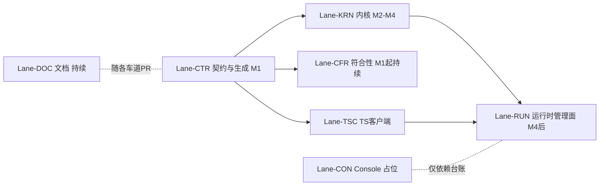

# PARALLEL-LANES — 并行车道机制（面向 Cursor Multitask）

- 状态：v1.0（M0 产出）；类别 plan
- 更新责任：车道启动/交还/换分支时必更所有权表；接口冻结状态变化时必更 §3

## 1. 车道划分

**接口先行原则**：`cognitive-contracts`/`packages/contracts-ts` 的生成合同与 `cognitive-kernel` 的端口 trait 冻结后，各车道方可分叉并行；此前只有 Lane-CTR 与 Lane-CFR 可动。

| 车道 | 职责 | 启动条件 | 接续提示词 |
|---|---|---|---|
| **Lane-CTR** 契约与生成 | contracts 双端（Rust/TS）+ golden fixtures + codegen + F-003 schema 单轨迁移——**所有车道的地基，最先完成** | 立即（M1） | [prompts/lane-ctr.md](../prompts/lane-ctr.md) |
| **Lane-CFR** 符合性与工具 | runner 执行能力、tools、CI 演进（M1 起持续） | 立即（M1，可与 CTR 并行） | [prompts/lane-cfr.md](../prompts/lane-cfr.md) |
| **Lane-KRN** 内核主线 | domain → store → kernel（M2–M4） | M1 出口（生成合同冻结） | [prompts/lane-krn.md](../prompts/lane-krn.md) |
| **Lane-TSC** TS 客户端 | sdk-ts、admin-cli 交互层、agent-shell | CTR golden 对齐后与 KRN 并行；M5 集成 | [prompts/lane-tsc.md](../prompts/lane-tsc.md) |
| **Lane-RUN** 运行时与管理面 | runtime、management、akp、kernel-server | M4 出口（tracer bullet 后） | [prompts/lane-run.md](../prompts/lane-run.md) |
| **Lane-DOC** 文档与计划维护 | 标准/计划/台账/白皮书对齐；可随各车道 PR 附带 | 持续 | [prompts/lane-doc.md](../prompts/lane-doc.md) |
| **Lane-CON** Console 产品 | 激活前仅 informative 产品研究/设计与依赖台账；实现仍由后端 gate 阻断 | 文档例外已批准；实现须后端 gate | [prompts/lane-con.md](../prompts/lane-con.md) |

## 2. 并行规则（违反 = PR 拒收）

1. **一个车道 = 一个 git 分支（`lane/<名>`，建议配 `git worktree`）= 一个 Cursor Multitask 代理会话**。会话开工先对照本表认领；一个会话不得同时跨两条车道。
2. **跨车道接口变更只能经 Lane-CTR** 走契约变更流程（schema/trait/生成物一体变更），并在 `PROGRESS.md` 车道表通告；其他车道等待新契约合并后 rebase。
3. **两个车道禁止同时修改同一 crate/package**（所有权表 §3 为准）；共享文件（PROGRESS、findings-ledger）冲突时后合并者负责 rebase 合并。
4. **合并顺序**：CTR → {KRN, CFR, TSC} → RUN；Lane-DOC 随时但不得夹带代码语义变更。
5. 一律经 PR + CI 门禁合并（两 OS 全绿 + DoD 清单）；禁止直接推 main。
6. 车道会话结束按 B4 协议写 handoff（`docs/checkpoints/YYYYMMDD-lane-<名>-handoff.md`）。
7. **`personal-blog/` 不是本表车道**：嵌套独立仓 [`agentkernel/blog`](https://github.com/agentkernel/blog)；不得用 Cos lane worktree / `D:\blog-*` 平行克隆替代唯一副本 `personal-blog/`（见 `.cursor/rules/19-personal-blog-boundary.mdc`）。

### 2.1 Lane-CON 激活前文档例外

2026-07-20 批准一个窄幅、可审计例外：后端 gate 通过前，Lane-CON 可维护 `clients/**`（客户端项目根，ADR-0007：PC/mobile/shared/Agent Hub 文档、治理件、计划与提示词，含 `clients/agent-hub/{docs,plan,prompts}/`）以及兼容 stub `apps/cognitiveos-console/`、`docs/platforms/`、`docs/clients/` 下的 informative 平台研究、产品设计、产品要求/决策、README、roadmap、index、parity matrix、治理说明和已登记漂移的事实修正。

该例外不激活 Console 实现车道，不允许组件、脚手架、mock server、helper、安装器或其他实现代码，不允许修改 registry/schema/transition/vector 等 normative 机器资产，也不允许声称实现已提供、测试已执行或 Profile 已符合。实现 gate 以 [平台文档入口](../../clients/governance/readiness-gates.md#console-实现-gate) 为准；Agent Hub 另加 Paseo/AGPL 与第三方组件义务的独立法务 gate。

## 3. 所有权表（当前）

| crate / package / 目录 | 车道 | 当前分支 | 当前会话/状态 |
|---|---|---|---|
| `crates/cognitive-contracts`、`packages/contracts-ts`、`tests/golden/`、`specs/schemas/`（迁移期） | Lane-CTR | `main` @ `2baef99`（PR #68） | ADR-0014 Ordinary Core/High-Assurance split：minimal `status.inspect` AUDIT decision/receipt schemas, digest references and generated bindings registered；Lane-RUN consumption provided/tested；Lane-CFR behavior pending |
| `crates/cognitive-conformance`、`tools/`、`.github/workflows/` | Lane-CFR | `main`（PR #46 已合入） | `SHELL-TARGET-AMBIGUITY-001` behavior pass；pins 59/25；self-check 40；见 `20260722-lane-cfr-shell-target-ambiguity-handoff.md` |
| `crates/cognitive-domain`、`cognitive-store`、`cognitive-kernel` | Lane-KRN | `lane/krn`（已建，worktree） | M4 已交付；M5 kernel 面可启动 |
| `packages/sdk-ts`、`apps/agent-shell` | Lane-TSC | `lane/tsc`（已建分支） | 客户端骨架/生成绑定已交付；M5 真 transport 集成待 RUN |
| `crates/cognitive-runtime`、`cognitive-management`、`cognitive-akp`、`apps/kernel-server`、`apps/admin-cli` | Lane-RUN | `lane/run-v02-ordinary-core-audit-binding-consumption` | Ordinary Core audited runtime path directly consumes registered generated decision/receipt carriers；unaudited inspect remains crate-private；durable CLI path and fail-closed release gate retained；Lane-CFR behavior/CA-0/Profile claims remain pending |
| `docs/`（standards/plan/traceability/checkpoints/prompts）、根 README/AGENTS | Lane-DOC | 随车道 PR | 持续 |
| `clients/**`、`apps/cognitiveos-console/`（stub）、`docs/platforms/`（stub）、`docs/clients/`（stub） | Lane-CON（治理文件由 Lane-DOC 协作） | — | informative 文档例外有效（§2.1）；实现未激活；Agent Hub 另需 AGPL 法务 gate |
| `specs/registry/`、`specs/transitions/`、`conformance/vectors/` | 契约资产：变更一律经 Lane-CTR（向量增补可经 Lane-CFR），走 docs-sync-contract 流程 | — | — |

## 4. 里程碑 ↔ 车道对照

| 里程碑 | 主车道 | 协作车道 | 提示词 |
|---|---|---|---|
| M1 | CTR + CFR | DOC | [milestone-m1.md](../prompts/milestone-m1.md) |
| M2 | KRN | CFR（向量执行）、DOC | [milestone-m2.md](../prompts/milestone-m2.md) |
| M3 | KRN | CFR、TSC（投影消费）、DOC | [milestone-m3.md](../prompts/milestone-m3.md) |
| M4 | KRN | CFR（故障注入）、DOC | [milestone-m4.md](../prompts/milestone-m4.md) |
| M5 | RUN + TSC | CFR、DOC | [milestone-m5.md](../prompts/milestone-m5.md) |
| M6 | RUN | CFR（平台矩阵）、DOC、CON（依赖复核） | [milestone-m6.md](../prompts/milestone-m6.md) · [M6-PLAN.md](M6-PLAN.md) |
