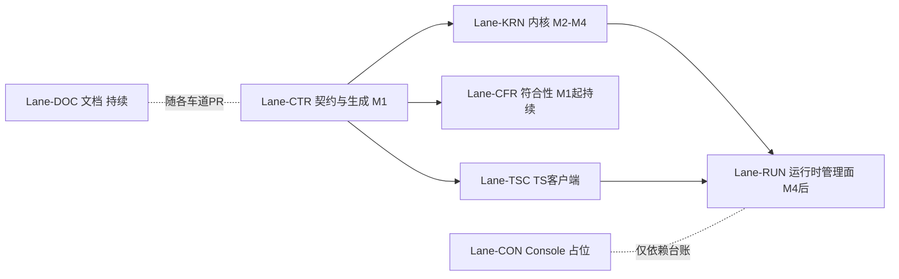

# PARALLEL-LANES — CognitiveOS Personal ownership lease 台账

- 状态：v1.1（active ownership lease model）；类别 plan
- 更新责任：车道启动/交还/换分支时必更所有权表；接口冻结状态变化时必更 §3

`cognitiveos-personal` 是唯一活动实现项目。下列 Lane 是一个项目内的架构责任角色，
不是可各自推进的产品或 backlog。任务来自 `PERSONAL-DEVELOPMENT-PLAN.md`；本文件只
决定当前可写路径，不能改变任务、Gate 或当前产品状态。

## 1. 架构责任角色

Lane 只表示一个 Personal task 内的 primary architecture responsibility，不能生成任务、
固定分支或实现顺序。当前执行入口始终是 `AGENTS.md`、Personal 正式计划、Current
snapshot 和本文件 active lease table。旧 `docs/prompts/lane-*` 与 milestone/v0.1 prompts
是 dated non-executable reference。

| 车道 | 当前责任 |
|---|---|
| **Lane-CTR** 契约与生成 | public contracts、Rust/TS bindings、schema/transition/vector 协同 |
| **Lane-CFR** 符合性与工具 | runner、consistency、CI、evidence tooling |
| **Lane-KRN** 内核主线 | domain、authority store、kernel primitives |
| **Lane-TSC** TS 客户端 | sdk-ts、Agent Shell client core、client contract use |
| **Lane-RUN** 运行时与管理面 | runtime、management、AKP、Personal daemon composition |
| **Lane-DOC** 文档与计划维护 | product/architecture/governance/plan/trace closure |
| **Lane-CON** Console 产品 | inactive compatibility/design role only; no implementation task source |

```mermaid
flowchart LR
  CTR[Lane-CTR 契约与生成 M1] --> KRN[Lane-KRN 内核 M2-M4]
  CTR --> CFR[Lane-CFR 符合性 M1起持续]
  CTR --> TSC[Lane-TSC TS客户端]
  KRN --> RUN[Lane-RUN 运行时管理面 M4后]
  TSC --> RUN
  DOC[Lane-DOC 文档 持续] -.随各车道PR.- CTR
  CON[Lane-CON Console 占位] -.仅依赖台账.- RUN
```

## 2. 并行规则（违反 = PR 拒收）

1. **一个任务 = 一个 primary lane + 一个分支/PR + 一份活动 ownership lease**。一个 cohesive task 可在 lease 中声明 runtime、CLI、tests 和 docs 等 secondary paths；不再用历史 lane 名阻止跨目录的完整原子批。每个 lease 使用稳定 `lease_id`，格式为 `lease/personal/<task>/<slice>`。
2. **跨车道接口变更只能经 Lane-CTR** 走契约变更流程（schema/trait/生成物一体变更），并在 `PROGRESS.md` 车道表通告；其他车道等待新契约合并后 rebase。
3. **两个活动 lease 禁止覆盖同一 writable path**；ownership 以 `lease_id`、任务、branch、owned paths、owner/session、claimed_at、last_heartbeat 记录。状态仅允许 `active`、`closed`、`abandoned`、`stale`。只有 `active` 条目授予写权限；其他状态必须移到历史表，不再阻断新任务。共享文件由后合并者负责整合当前快照。禁止用 `docs/plan/**`、`docs/standards/**`、`docs/adr/**`、`specs/**` 等 broad protected-tree glob 取得排他所有权；应列精确文件或窄 feature directory。
4. **合并顺序**：CTR → {KRN, CFR, TSC} → RUN；Lane-DOC 随时但不得夹带代码语义变更。
5. 代码和 protected governance 变更经 PR + required CI 门禁合并；ADR-0008 允许的低风险 docs-only 批可直推 main，分支保护拒绝时改走 PR。
6. 车道会话结束按 B4 协议写 handoff（`docs/checkpoints/YYYYMMDD-lane-<名>-handoff.md`）。
7. **`personal-blog/` 不是本表车道**：嵌套独立仓 [`agentkernel/blog`](https://github.com/agentkernel/blog)；不得用 Cos lane worktree / `D:\blog-*` 平行克隆替代唯一副本 `personal-blog/`。
8. Lease ledger 使用窄幅协调更新：会话只能新增、heartbeat、关闭自己的行并保留其他行。
   `docs/plan/PARALLEL-LANES.md` 不得列入任何 lease 的 writable paths；更新自己的 ledger
   row 是不授予其他路径的协调操作。父目录 lease 不能独占本文件。PR 合并时必须在同一
   closure delivery 关闭 lease；已合并但遗留 active 的行由下一治理 session 诚实关闭。

### 2.1 Lane-CON 激活前文档例外

2026-07-20 批准一个窄幅、可审计例外：后端 gate 通过前，Lane-CON 可维护 `clients/**`（客户端项目根，ADR-0007：PC/mobile/shared/Agent Hub 文档、治理件、计划与提示词，含 `clients/agent-hub/{docs,plan,prompts}/`）以及兼容 stub `apps/cognitiveos-console/`、`docs/platforms/`、`docs/clients/` 下的 informative 平台研究、产品设计、产品要求/决策、README、roadmap、index、parity matrix、治理说明和已登记漂移的事实修正。

2026-07-26 所有者将客户端文档域整体迁出至独立仓库 [cognitiveos-clients](https://github.com/agentkernel/cognitiveos-clients)（保留 subtree 历史；外部仓根对应原 `clients/`）。上述 2026-07-20 批准记录作为史实保留不变；自该日起，在**本仓库内**该例外仅覆盖余下兼容 stub（`apps/cognitiveos-console/`、`docs/platforms/`、`docs/clients/`），`clients/**` 不得在本仓重建，客户端文档树的维护改由外部仓自身流程承担。

该例外不激活 Console 实现车道，不允许组件、脚手架、mock server、helper、安装器或其他实现代码，不允许修改 registry/schema/transition/vector 等 normative 机器资产，也不允许声称实现已提供、测试已执行或 Profile 已符合。实现 gate 以 [平台文档入口](https://github.com/agentkernel/cognitiveos-clients/blob/main/governance/readiness-gates.md#console-实现-gate) 为准；Agent Hub 另加 Paseo/AGPL 与第三方组件义务的独立法务 gate。

## 3. 活动 ownership leases（唯一当前台账）

只有下表中的 `active` 行授予当前写权限。开始写入前必须新增一行；`PROGRESS.md`
只能引用这里存在的 `lease_id` 或写 `none`。

| Lease ID | Task / slice | Primary lane | Branch | Writable paths | Owner/session | Claimed / heartbeat | Status |
|---|---|---|---|---|---|---|---|

### 3.1 最近关闭的 leases

| Lease ID | Task / slice | Branch | Closed | Closure |
|---|---|---|---|---|
| `lease/personal/P2-T02/adr-0036-supersession-clarification` | Correct ADR-0036's supersession wording so its historical Memory/Context deferral cannot contradict the approved P2/P3/P4 Linux 1.0 target | `main` | 2026-08-02 | ADR-0036 now names ADR-0037's partial supersession and defers only advanced Memory retrieval and complex Context optimization. Two defect-focused reviews, consistency and diff checks passed; no task, Gate, runtime, release or Profile status changed. |
| `lease/personal/P2-T02/unified-resource-closure-fix` | Correct final Current snapshot consistency after unified-resource lease closure | `main` | 2026-08-02 | Corrected the B01 Current snapshot to retain checker-readable minimum-20 wording and removed a closed lease ID from the `Active task lease: none` row. Consistency and diff checks passed before closure; no design, runtime, Gate, release or Profile scope changed. |
| `lease/personal/P2-T02/unified-resource-baseline` | Owner-approved Personal unified cognitive-resource and sidecar product baseline serving P2/P3/P4/P5/P7 | `main` | 2026-08-02 | Product-semantic/structural documentation delivery completed locally: ADR-0037/0038, six-family product/architecture model, Pi sidecar boundary, Linux 1.0 task/Gate rebase, UCR-01, B01 statistical addendum, support/environment/trace synchronization and final handoff. Consistency and diff checks passed; runtime, public contracts, UCR-01/Gate campaigns, release and Profile remain not-run. The worktree remains uncommitted. See `20260802-personal-unified-resource-restructure-handoff.md`. |
| `lease/personal/governance/personal-1-0-docs` | Personal 1.0 architecture, product, governance, plan and consistency refactor | `lane/doc-personal-1-0-restructure` | 2026-08-02 | Product-semantic/structural/corrective documentation delivery completed locally: ADR-0035/0036, canonical product/architecture docs, Linux 1.0/Pi dual-track planning, environment/support registry, governance alignment, stale implementation-doc correction and strengthened consistency/failure-injection checks. Focused tools, Agent Shell and Pi Extension builds/tests plus consistency and diff checks passed; Rust, remote CI, Gate, release and Profile evidence are not-run. The branch remains uncommitted pending explicit authorization. See `20260802-personal-1-0-doc-restructure-handoff.md`. |
| `lease/personal/P2-T03/fenced-quiescence-contract` | TaskContract compatibility and loop ceiling-stop quiescence contract | `lane/ctr-p2-t03-fenced-quiescence` | 2026-08-02 | PR #129 merged as `main@7ea1cde`; finite TaskContract compatibility, scheduler ceiling authority, and related contract/runtime slices landed with their recorded focused evidence. Worker dispatch, durable stop integration, P2 Gates, release, and Profile claims remain not-run. The broad lease is released. |
| `lease/personal/P2-T03/execution-binding-contract` | TaskContract execution binding and scheduler ceiling-stop transition | `lane/ctr-p2-t03-execution-binding` | 2026-08-01 | Contract unblock committed as `4187250`; Linux m5 intent-chain regression passed 6/6. Remaining exhaustive contract/transition/vector evidence and protected CI are not-run. See `20260801-personal-p2-t03-execution-binding-contract-handoff.md`. |
| `lease/personal/P2-T03/durable-authority` | assess daemon-owned durable ceiling fact loading and fenced stop-fact persistence | `lane/personal-p2-t03-durable-authority` | 2026-08-01 | Bounded blocker: no authoritative TaskContract deadline or task-to-loop/budget binding exists, and a ceiling stop lifecycle transition is not registered. No implementation was started; see `20260801-personal-p2-t03-durable-authority-handoff.md`. |
| `lease/personal/P2-T03/ceiling-authority` | inclusive deadline/retry/step/cost scheduler admission from supplied authority-fact snapshots | `lane/personal-p2-t03-ceiling-authority` | 2026-08-01 | Failure-first evaluator test passed 2/2 on the Linux host; fmt and focused Clippy passed. Durable fact loading, stop-fact persistence, and BoundedHarness worker wiring remain not-run. No Gate, release, or Profile claim. See `20260801-personal-p2-t03-ceiling-authority-handoff.md`. |
| `lease/personal/P2-T03/scheduler-service` | deterministic scheduler eligibility, TTL lease-expiry takeover, and clock-shift no-double-dispatch protections | `lane/personal-p2-t03-scheduler-service` | 2026-08-01 | Linux-host failure-first test repaired and passed 5/5; store suite, fmt, and focused Clippy passed. No Gate, release, or Profile claim. See `20260801-personal-p2-t03-scheduler-service-handoff.md`. |
| `lease/personal/P1-T09/b01-execution` | execute the preregistered clean-Linux B01 first-install/first-conversation attempt 1 on `B01-Desktop-Linux-002`, collect redacted evidence, and record the attempt | `main` | 2026-08-01 | Attempt 1 passed all phases with immutable artifact `0.0.0-campaign.20260801.1`; bounded first response in 6295 ms with expected marker and `authority_side_effects:false`; cleanup passed including operator-secret deletion with post-clear not-found. B01 Gate remains `running` pending the formal campaign denominator, aggregate threshold calculation, zero-critical-failure closure and independent verifier disposition. See `20260801-personal-p1-t09-b01-attempt-ledger.md`. |
| `lease/personal/P1-T09/b01-desktop-candidate` | provision a dedicated Ubuntu Desktop 24.04.4 x86_64 B01 candidate with a reset-capable operator-held keyring master and requalify the native Secret Service prerequisite | `main` | 2026-08-01 | `B01-Desktop-Linux-002` provisioned from the official verified ISO; keyring probe passed with the operator-held login password as the recoverable master; reset snapshot `b01-platform-qualified-baseline` taken; campaign `0.0.0-campaign.20260801.1` built from `main@0a5524b` and independently verified by a locked verifier; B01 remains not-run at this lease close. See `20260731-personal-p1-t09-b01-clean-vm-handoff.md`. |
| `lease/personal/P1-T09/b01-gui-keyring-enablement` | add native persistent Secret Service qualification to the dedicated B01 guest | `main` | 2026-07-31 | Desktop console attempts exposed Xorg mode failures across QXL, VirtIO, VGA/VESA, and VMware SVGA. The approved one-time agent master then created an encrypted persistent default collection and Product-compatible non-sensitive store/lookup/clear probes passed before and after headless cleanup. B01 remains not-run because that master cannot be retained for the preregistered reset procedure; no artifact, Pi state, Provider secret, or attempt was created. See `20260731-personal-p1-t09-b01-clean-vm-handoff.md`. |
| `lease/personal/P1-T09/b01-clean-vm-execution` | allocate and qualify the separately clean KVM B01 guest and native Secret Service start-gate prerequisites | `main` | 2026-07-31 | Dedicated Ubuntu 24.04/x86_64 KVM guest, clean baseline snapshot, native user-systemd, and no-product-state checks are recorded. Native transient Secret Service probe passed, but Product-compatible persistent default collection creation stops at a required GUI prompt with no headless prompt agent; no B01 attempt, Provider secret, artifact, Pi state, or claim was created. See `20260731-personal-p1-t09-b01-clean-vm-handoff.md`. |
| `lease/personal/P1-T09/b01-preregistration` | pre-register the separate clean-Linux B01 first-install/first-conversation campaign | `main` | 2026-07-31 | B01 campaign identity, clean-environment, artifact, reset, attempt, threshold, redaction, cleanup, and ownership requirements are fixed in `20260731-personal-p1-t09-b01-preregistration.md`; no VM, artifact, secret opt-in, or B01 attempt was started. Owner action is required before an execution lease. |
| `lease/personal/P1-T09/route-probe-reconciliation` | correct the bounded runner and Pi runtime-model route contract | `lane/personal-p1-t09-abi-targeted-campaign-v2` | 2026-07-31 | PR #126 merged `main@c044f2f`; protected campaign `30603971105` passed and campaign `.4` was independently verified/installed on the qualified host. Redacted installed route observed expected first response in 4267 ms with no authority side effect; `tested-local` only, B01 remains `not-run`. |
| `lease/personal/P1-T09/verified-experimental-deployment` | independently verify and install campaign `.11`, persist exact Pi, and correct the bounded post-configure readiness race | `lane/personal-p1-t09-abi-targeted-campaign-v2` | 2026-07-31 | campaign `30566251554` was independently offline-verified and installed on the qualified host; exact Pi and the redacted installed route passed as `tested-local`; B01 remains `not-run`; see `20260730-personal-p1-t09-verified-experimental-deployment-handoff.md` |
| `lease/personal/P1-T09/protected-experimental-signing-workflow` | provide a protected experimental campaign signing workflow for the coherent bundle | `lane/personal-p1-t09-coherent-bundle-delivery` | 2026-07-30 | workflow YAML and repository consistency passed; GitHub Environment and signing secret are absent, so dispatch, artifact, deployment, and route validation are not-run; see `20260730-personal-p1-t09-protected-experimental-signing-workflow-handoff.md` |
| `lease/personal/P1-T09/redacted-product-route-runner` | add a reproducible non-secret first-response route runner and focused negative coverage | `lane/personal-p1-t09-coherent-bundle-delivery` | 2026-07-30 | local and Linux-native non-secret fixtures passed; installed-product invocation remains blocked by authorized signing/deployment workflow; see `20260730-personal-p1-t09-product-route-runner-handoff.md` |
| `lease/personal/P1-T09/coherent-bundle-delivery` | deliver verified product CLI and complete Pi Extension with the daemon bundle | `lane/personal-p1-t09-coherent-bundle-delivery` | 2026-07-30 | implementation and supported CI complete; Linux-native payload build complete; protected signing-material workflow unavailable, so no archive was signed/installed/deployed; see `20260730-personal-p1-t09-coherent-bundle-delivery-handoff.md` |
| `lease/personal/P1-T09/product-pi-configuration-timeout-diagnosis` | configure the non-secret product Pi route, diagnose bounded first-response timeout | `lane/personal-p1-t09-product-pi-configuration-timeout-diagnosis` | 2026-07-30 | bounded blocker: exact Pi and restored service available, but product CLI and deployed Extension entry are absent; `cognitive pi configure`, doctor, launch, and direct first response not-run; see `20260730-personal-p1-t09-product-pi-configuration-timeout-diagnosis-handoff.md` |
| `lease/personal/P1-T09/linux-real-provider-prerequisites` | native SecretStore correction and real daemon-owned Provider connectivity | `lane/personal-p1-t09-real-provider-prerequisites` | 2026-07-30 | `20260730-personal-p1-t09-real-provider-prerequisites-handoff.md`; native secret and Provider proxy tested-local, direct Pi smoke timed out, B01 remains not-run |
| `lease/personal/P1-T09/exact-pi-extension-load` | exact Pi `0.81.1` availability and real Extension default-export invocation observation | `lane/personal-p1-t09-exact-pi-extension-load` | 2026-07-30 | `20260730-personal-p1-t09-exact-pi-extension-load-handoff.md`; session-local real Pi observation recorded; B01 remains not-run |
| `lease/personal/governance/project-identity-rules-20260730` | Personal project identity and development-rule refactor | `lane/doc-personal-project-identity` | 2026-07-30 | `20260730-personal-project-identity-governance-handoff.md`; local checks and failure injection passed |
| `lease/personal/governance/operating-model-20260730` | Personal governance operating-model correction | `lane/personal-p1-t08-mvp-single-service` | 2026-07-30 | `20260730-governance-operating-model-handoff.md` |
| `lease/personal/P1-T09/provider-fixture-ci-repair` | deterministic binary Provider fixture CI repair | `lane/personal-p1-t09-provider-fixture` | 2026-07-30 | PR #117 required CI green |
| `lease/personal/P1-T09/linux-environment-qualification` | Linux-native Pi environment qualification | `lane/personal-p1-t09-provider-fixture` | 2026-07-30 | SSH qualification recorded; exact Pi availability remains `not-run` |

Normative assets under `specs/registry/`, `specs/schemas/`, `specs/transitions/`, generated contracts, and conformance vector semantics remain Lane-CTR-owned regardless of lease.

## 3.2 Historical architecture ownership snapshot

The table below is retained as historical coordination context. Its branches and status text do not grant an active lease and cannot block new work without a current §3 lease.

| crate / package / 目录 | 车道 | 当前分支 | 当前会话/状态 |
|---|---|---|---|
| `crates/cognitive-contracts`、`packages/contracts-ts`、`tests/golden/`、`specs/schemas/`（迁移期） | Lane-CTR | `main` @ `2baef99`（PR #68） | ADR-0014 Ordinary Core/High-Assurance split：minimal `status.inspect` AUDIT decision/receipt schemas, digest references and generated bindings registered；Lane-RUN consumption provided/tested；Lane-CFR vector test executed |
| `crates/cognitive-conformance`、`tools/`、`.github/workflows/` | Lane-CFR | `lane/cfr-ctr-ordinary-core-audit-inspect` | Approved atomic CFR+CTR exception: `ORDINARY-CORE-AUDIT-INSPECT-001` executes the audited public consumer and durable adapter; vector test executed pass (pins 60/25; self-check 41/41); no Profile claim |
| `crates/cognitive-domain`、`cognitive-store`、`cognitive-kernel` | Lane-KRN | `main` @ `7324227`（PR #78） | durable InstallationStore KRN 原子批已合入：仅 SQLite staging/commit/recovery，不新增安装迁移表；cross-process lifecycle lease 仍需单独 API 决策 |
| `packages/sdk-ts`、`apps/agent-shell` | Lane-TSC | `lane/tsc`（已建分支） | 客户端骨架/生成绑定已交付；M5 真 transport 集成待 RUN |
| `crates/cognitive-runtime`、`cognitive-management`、`cognitive-akp`、`apps/kernel-server`、`apps/admin-cli` | Lane-RUN | `lane/run-installation-authority` | Durable authority consumption requires an exclusive in-process manager session for verified stage/commit and recovery; zero capability, Task completion or Effect claims. Targeted runtime tests, clippy and consistency passed locally; cross-process lifecycle lease, verifier and OS sandbox gates remain pending. |
| `docs/`（standards/plan/traceability/checkpoints/prompts）、根 README/AGENTS | Lane-DOC | 随车道 PR | 持续 |
| 客户端文档域已迁至独立仓库 [cognitiveos-clients](https://github.com/agentkernel/cognitiveos-clients)（本仓不再有 `clients/**`）；本仓仅余 `apps/cognitiveos-console/`（stub）、`docs/platforms/`（stub）、`docs/clients/`（stub） | Lane-CON（治理文件由 Lane-DOC 协作） | — | informative 文档例外有效（§2.1）；实现未激活；Agent Hub 另需 AGPL 法务 gate |
| `specs/registry/`、`specs/transitions/`、`conformance/vectors/` | 契约资产：变更一律经 Lane-CTR（向量增补可经 Lane-CFR），走 docs-sync-contract 流程 | `lane/cfr-ctr-ordinary-core-audit-inspect` | Approved one-batch exception completed for the Ordinary Core AUDIT vector + dual registry mapping + matrix; IMP-01 correction only |

## 4. 里程碑 ↔ 车道对照

| 里程碑 | 主车道 | 协作车道 | 提示词 |
|---|---|---|---|
| M1 | CTR + CFR | DOC | [milestone-m1.md](../prompts/milestone-m1.md) |
| M2 | KRN | CFR（向量执行）、DOC | [milestone-m2.md](../prompts/milestone-m2.md) |
| M3 | KRN | CFR、TSC（投影消费）、DOC | [milestone-m3.md](../prompts/milestone-m3.md) |
| M4 | KRN | CFR（故障注入）、DOC | [milestone-m4.md](../prompts/milestone-m4.md) |
| M5 | RUN + TSC | CFR、DOC | [milestone-m5.md](../prompts/milestone-m5.md) |
| M6 | RUN | CFR（平台矩阵）、DOC、CON（依赖复核） | [milestone-m6.md](../prompts/milestone-m6.md) · [M6-PLAN.md](M6-PLAN.md) |
