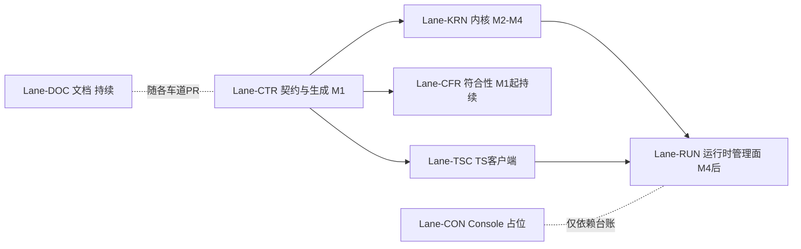

# PARALLEL-LANES — CognitiveOS Personal ownership lease 台账

- 状态：v1.1（active ownership lease model）；类别 plan
- 更新责任：车道启动/交还/换分支时必更所有权表；接口冻结状态变化时必更 §3

`cognitiveos-personal` 是唯一活动实现项目。下列 Lane 是一个项目内的架构责任角色，
不是可各自推进的产品或 backlog。任务来自 `PERSONAL-DEVELOPMENT-PLAN.md`；本文件只
决定当前可写路径，不能改变任务、Gate 或当前产品状态。

## 1. 架构责任角色

Lane 只表示一个 Personal task 内的 primary architecture responsibility，不能生成任务、
固定分支或实现顺序。当前执行入口始终是 `AGENTS.md`、Personal 正式计划、Current
snapshot 和本文件 active lease table。旧 `docs/prompts/lane-*` 与 milestone/v0.1 prompts
是 dated non-executable reference。

| 车道 | 当前责任 |
|---|---|
| **Lane-CTR** 契约与生成 | public contracts、Rust/TS bindings、schema/transition/vector 协同 |
| **Lane-CFR** 符合性与工具 | runner、consistency、CI、evidence tooling |
| **Lane-KRN** 内核主线 | domain、authority store、kernel primitives |
| **Lane-TSC** TS 客户端 | sdk-ts、Agent Shell client core、client contract use |
| **Lane-RUN** 运行时与管理面 | runtime、management、AKP、Personal daemon composition |
| **Lane-DOC** 文档与计划维护 | product/architecture/governance/plan/trace closure |
| **Lane-CON** Console 产品 | inactive compatibility/design role only; no implementation task source |

```mermaid
flowchart LR
  CTR[Lane-CTR 契约与生成 M1] --> KRN[Lane-KRN 内核 M2-M4]
  CTR --> CFR[Lane-CFR 符合性 M1起持续]
  CTR --> TSC[Lane-TSC TS客户端]
  KRN --> RUN[Lane-RUN 运行时管理面 M4后]
  TSC --> RUN
  DOC[Lane-DOC 文档 持续] -.随各车道PR.- CTR
  CON[Lane-CON Console 占位] -.仅依赖台账.- RUN
```

## 2. 并行规则（违反 = PR 拒收）

1. **一个任务 = 一个 primary lane + 一个 task branch/Draft PR + 一份活动 task lease**。一个
   cohesive task 可在 lease 中声明 runtime、CLI、tests 和 docs 等 secondary paths；Slice
   只是该任务内的执行检查点，不得另建 branch、PR、lease 或普通 handoff。每个 lease 使用
   稳定 `lease_id`，格式为 `lease/personal/<task>/<purpose>`，并持续到完整 task acceptance
   与 merge/branch closure 完成。
2. **跨车道接口变更只能经 Lane-CTR** 走契约变更流程（schema/trait/生成物一体变更），并在 `PROGRESS.md` 车道表通告；其他车道等待新契约合并后 rebase。
3. **两个活动 lease 禁止覆盖同一 writable path**；ownership 以 `lease_id`、任务、branch、owned paths、owner/session、claimed_at、last_heartbeat 记录。状态仅允许 `active`、`closed`、`abandoned`、`stale`。只有 `active` 条目授予写权限；其他状态必须移到历史表，不再阻断新任务。共享文件由后合并者负责整合当前快照。禁止用 `docs/plan/**`、`docs/standards/**`、`docs/adr/**`、`specs/**` 等 broad protected-tree glob 取得排他所有权；应列精确文件或窄 feature directory。
4. **合并顺序**：CTR → {KRN, CFR, TSC} → RUN；Lane-DOC 随时但不得夹带代码语义变更。
5. 代码和 protected governance 变更经 PR + required CI 门禁合并；ADR-0008 允许的低风险 docs-only 批可直推 main，分支保护拒绝时改走 PR。
6. Handoff 只在完整任务收口、真正外部阻塞、未知并发改动、ownership transfer 或 owner
   明确暂停时写一次；不得因 Slice、checkpoint、push、CI 轮次或普通会话边界产生逐段
   handoff。
7. **`personal-blog/` 不是本表车道**：嵌套独立仓 [`agentkernel/blog`](https://github.com/agentkernel/blog)；不得用 Cos lane worktree / `D:\blog-*` 平行克隆替代唯一副本 `personal-blog/`。
8. Lease ledger 使用窄幅协调更新：会话只能新增、heartbeat、关闭自己的行并保留其他行。
   `docs/plan/PARALLEL-LANES.md` 不得列入任何 lease 的 writable paths；更新自己的 ledger
   row 是不授予其他路径的协调操作。父目录 lease 不能独占本文件。PR 合并时必须在同一
   closure delivery 关闭 lease；已合并但遗留 active 的行由下一治理 session 诚实关闭。
9. 一个 branch/PR 不得承载多个正式任务。当前已存在的 legacy shared branch 不重写历史，
   但每个活动任务必须在下一安全 continuation boundary 分离到自己的 task branch/PR；不得
   在 shared branch 上再领取新任务。完整任务合并后关闭 lease、确认 PR merged、清理安全
   可删的远端 task branch，并在本地切回/fast-forward `main` 后核对 clean worktree 与
   HEAD/upstream。

### 2.1 Lane-CON 激活前文档例外

2026-07-20 批准一个窄幅、可审计例外：后端 gate 通过前，Lane-CON 可维护 `clients/**`（客户端项目根，ADR-0007：PC/mobile/shared/Agent Hub 文档、治理件、计划与提示词，含 `clients/agent-hub/{docs,plan,prompts}/`）以及兼容 stub `apps/cognitiveos-console/`、`docs/platforms/`、`docs/clients/` 下的 informative 平台研究、产品设计、产品要求/决策、README、roadmap、index、parity matrix、治理说明和已登记漂移的事实修正。

2026-07-26 所有者将客户端文档域整体迁出至独立仓库 [cognitiveos-clients](https://github.com/agentkernel/cognitiveos-clients)（保留 subtree 历史；外部仓根对应原 `clients/`）。上述 2026-07-20 批准记录作为史实保留不变；自该日起，在**本仓库内**该例外仅覆盖余下兼容 stub（`apps/cognitiveos-console/`、`docs/platforms/`、`docs/clients/`），`clients/**` 不得在本仓重建，客户端文档树的维护改由外部仓自身流程承担。

该例外不激活 Console 实现车道，不允许组件、脚手架、mock server、helper、安装器或其他实现代码，不允许修改 registry/schema/transition/vector 等 normative 机器资产，也不允许声称实现已提供、测试已执行或 Profile 已符合。实现 gate 以 [平台文档入口](https://github.com/agentkernel/cognitiveos-clients/blob/main/governance/readiness-gates.md#console-实现-gate) 为准；Agent Hub 另加 Paseo/AGPL 与第三方组件义务的独立法务 gate。

### 2.2 Owner-directed 评测 campaign lease（Operating Model §2.5）

Owner-directed 评测 campaign（如 `PERSONAL-PERF-EVAL-002`）使用
`lease/personal/EVAL-<id>/<purpose>` 形式的评测 lease：Task/slice 列写 campaign id 而非
正式 `P*-T*/DNN` slice；campaign id 必须已在 `PROGRESS.md` Current snapshot 的
`Owner-directed campaign` 行登记；writable paths 只允许 `docs/evaluation/`、
`docs/checkpoints/` 与 `docs/plan/PROGRESS.md` 下的精确路径。评测 lease 不创建任务状态，
不得覆盖产品代码、specs 或其他 protected trees；日期、非重叠与关闭规则与普通 lease 相同。
一致性检查器按此格式校验（`EVAL_LEASE_*`）。

## 3. 活动 ownership leases（唯一当前台账）

只有下表中的 `active` 行授予当前写权限。开始写入前必须新增一行；`PROGRESS.md`
只能引用这里存在的 `lease_id` 或写 `none`。

| Lease ID | Task / slice | Primary lane | Branch | Writable paths | Owner/session | Claimed / heartbeat | Status |
|---|---|---|---|---|---|---|---|

Closed historical leases are archived in
[PARALLEL-LANES-CLOSED.md](PARALLEL-LANES-CLOSED.md). That archive grants no
writable ownership. Only the active table above grants write access.

### 3.1 最近关闭的 leases（摘要）

| Lease ID | Task / slice | Branch | Closed | Closure |
|---|---|---|---|---|
| `lease/personal/P9-T10/live-prompt-injection` | P9-T10/D01–D03 live `--append-system-prompt` | `personal/P9-T10-live-prompt-injection` | 2026-08-20 | Merged PR [#250](https://github.com/agentkernel/cognitive-os/pull/250) at `main@30c4e16a`. Local `c1_c2_paired_p_arm` **16/16**. Linux exact `745c60d8` admin-cli `append_system_prompt` **3/3**, print-mode **1/1**, Clippy `-D warnings`, fmt. Required CI `32350029054` at `745c60d8`; docs-head `32352242187` at `36fe0029`. Claim ceiling `hypothesis`; no Gate, release, Profile, B01, EVAL, or Agent-benefit promotion. |
| `lease/personal/P2-T38/workspace-patch-post-state` | P2-T38/D01–D03 public WorkspacePatch post-state | `personal/P2-T38-workspace-patch-post-state` | 2026-08-20 | Merged PR [#248](https://github.com/agentkernel/cognitive-os/pull/248) at `main@2b4c8f17`. Linux focused kernel-server **4/4**, Clippy `-D warnings`, fmt at `5f4a538f`. Required CI `32333296569` passed Ubuntu, Windows, and required-ci at `31f8f165`. Local/remote task branches deleted; `main` matches `origin/main`. Claim ceiling `hypothesis`; no Gate, release, Profile, B01, EVAL, or Agent-benefit promotion. EVAL-012 Priority 2 (P/O system-prompt bytes) remains open. |
| `lease/personal/EVAL-012/c1-c2-paired-b0` | `PERSONAL-PERF-EVAL-012` full execution-plan remainder on B01-Desktop-Linux-002 | `evaluation/EVAL-012-freeze` | 2026-08-20 | B0 fairness **fail** (`system_task_prompt_bytes`); C2a O Patch fail retained (`fixed post-state is unavailable`); C0/B3–B5/T/S extras `not-run`. Cleanup **pass**. Claim ceiling `hypothesis`; `not_reviewed`. Evaluation routing OFF. Product follow-up P2-T38 is now closed. |
| `lease/personal/P9-T08/c1-c2-paired-readiness` | P9-T08/D01–D04 C1/C2 paired-benchmark readiness | `personal/P9-T08-c1-c2-paired-readiness` | 2026-08-20 | Merged PR [#247](https://github.com/agentkernel/cognitive-os/pull/247) at `main@f24c282ec1ea8ca433c2fae2a6b364164f456a78`; local and remote task branches deleted; local `main` matches `origin/main`. Packages 6–14 delivered. Required CI `32316092401` passed Ubuntu, Windows, and required-ci. `PERSONAL-PERF-EVAL-012` reserved, not active. Claim ceiling `hypothesis`; no B0, Gate, release, Profile, B01, or Agent-benefit promotion. |
| `lease/personal/P2-T37/c2a-public-mutation-path` | P2-T37/D03 C2a public mutation path | `personal/P2-T37-c2a-public-mutation-path` | 2026-08-20 | Merged PR [#246](https://github.com/agentkernel/cognitive-os/pull/246) at `main@286f7538148ba0d22f496f1f44d1af46f0f44aa0`; local task branch deleted and local `main` matches `origin/main`. Public Write and Patch Tasks completed the full authority chain. Required CI `32290876044` and `32292548920` passed Ubuntu, Windows, and required-ci. Claim ceiling `hypothesis`; no C2, EVAL, Gate, release, Profile, B01, or Agent-benefit promotion. |
| `lease/personal/P2-T36/c1-public-production-path` | P2-T36/D02 C1 public production path | `personal/P2-T36-c1-public-production-path` | 2026-08-19 | Merged PR [#244](https://github.com/agentkernel/cognitive-os/pull/244) at `main@3efd7011b605a32ac0c9ec114321831995f32d90`; local/remote task branch deleted and `main` reconciled. Fresh non-B01 Linux runtimes independently completed public Task-bound WorkspaceRead and WorkspaceSearch through daemon candidate admission, scheduler lease, executor, passed independent verification, and acceptance. Final docs-head required CI `32245868452` passed Ubuntu, Windows, and required-ci. Claim ceiling `hypothesis`; no C2, EVAL, Gate, release, Profile, B01, or Agent-benefit promotion. |
| `lease/personal/EVAL-010/c1-c2-paired-freeze` | `PERSONAL-PERF-EVAL-010` C1/C2 paired freeze after P2-T33 host-path product; no formal task/slice | `evaluation/EVAL-010-freeze` | 2026-08-18 | Freeze pass at `289eebad` (root `/home/hal9001/perfeval010-20260818`, daemon `48298`, SecretStore `/19`, Pi `0.81.1`). C1/C2 paired B0 partial (`candidate_has_missing_fields_or_an_invalid_parameters_digest`; Task DRAFT; lease_acquired 0; short socket created; real adapter spawned). B1/B2 not-run. Cleanup pass: daemon 48298 stopped; broker 48398 absent; SecretStore `/19` cleared without search/lookup; 48181/48284/48383 and EVAL-004/005/006/007/008/009 roots untouched. Final: [personal-performance-assessment-20260818-eval-010.md](../evaluation/personal-performance-assessment-20260818-eval-010.md). Claim ceiling `hypothesis`; `not_reviewed`. Evaluation routing OFF. Campaign closure does not resume development. |
| `lease/personal/P2-T33/private-candidate-host-path` | P2-T33/D03 private-candidate host path and public adapter diagnosis | `personal/P2-T33-private-candidate-host-path` | 2026-08-18 | Merged PR [#240](https://github.com/agentkernel/cognitive-os/pull/240) at `main@09a44455`. Product pin `289eebad` (linux-002 focused `p2_t33` 2/2 + units + Clippy `-D warnings`; Ubuntu `32063236152` verify **pass**; PR CI `32064313430` Ubuntu+Windows SUCCESS). Stub Workspace* pass is not C1/C2 真机. Claim ceiling `hypothesis`; no Gate, release, Profile, B01, EVAL, or Agent-benefit promotion. |
| `lease/personal/EVAL-009/c1-c2-paired-freeze` | `PERSONAL-PERF-EVAL-009` C1/C2 paired freeze after EVAL-008 UNIX_PATH_MAX hypothesis; no formal task/slice | `evaluation/EVAL-009-freeze` | 2026-08-18 | Freeze pass at `fb85cfff` (root `/home/hal9001/e009`, daemon `48296`, SecretStore `/18`, Pi `0.81.1`). C1/C2 paired B0 partial (`private_pi_candidate_adapter_rejected_the_request`; Task DRAFT; lease_acquired 0; socket created; real adapter spawned). B1/B2 not-run. Cleanup pass: daemon 48296 stopped; broker 48396 absent; SecretStore `/18` cleared without search/lookup; 48181/48284/48383 and EVAL-004/005/006/007/008 roots untouched. Final: [personal-performance-assessment-20260818-eval-009.md](../evaluation/personal-performance-assessment-20260818-eval-009.md). Claim ceiling `hypothesis`; `not_reviewed`. Evaluation routing OFF. Campaign closure does not resume development. |
| `lease/personal/EVAL-008/c1-c2-paired-freeze` | `PERSONAL-PERF-EVAL-008` C1/C2 paired freeze after P2-T32 public launcher; no formal task/slice | `evaluation/EVAL-008-freeze` | 2026-08-18 | Freeze pass at `fb85cfff` (root `/home/hal9001/perfeval008-20260818`, daemon `48294`, SecretStore `/17`, Pi `0.81.1`). C1/C2 paired B0 partial (`private_completion_socket_could_not_be_created`; Task DRAFT; lease_acquired 0; no Pi child). B1/B2 not-run. Cleanup pass: daemon 48294 stopped; broker 48394 absent; SecretStore `/17` cleared without search/lookup; 48181/48284/48383 and EVAL-004/005/006/007 roots untouched; redactor evidence 1/0 runtime 16/0. Final: [personal-performance-assessment-20260818-eval-008.md](../evaluation/personal-performance-assessment-20260818-eval-008.md). Claim ceiling `hypothesis`; `not_reviewed`. Evaluation routing OFF. |
| `lease/personal/P2-T32/public-daemon-start-scheduler` | P2-T32/D02 public `cognitive daemon start` scheduler lease | `personal/P2-T32-public-daemon-start-scheduler` | 2026-08-18 | Merged PR [#239](https://github.com/agentkernel/cognitive-os/pull/239) at `main@c7ce4e5f`. Product pin `fb85cfff` (Ubuntu `32047487272` verify **pass**; linux-002 focused `p2_t32` 1/1 + `daemon_log` 2/2; later PR CI `32049064078` Ubuntu+Windows SUCCESS at `a653dc7b`). Stub Workspace* pass is not C1/C2 真机. Claim ceiling `hypothesis`; no Gate, release, Profile, B01, EVAL, or Agent-benefit promotion. |
| `lease/personal/EVAL-007/c1-c2-paired-freeze` | `PERSONAL-PERF-EVAL-007` C1/C2 paired freeze after P2-T31; no formal task/slice | `evaluation/EVAL-007-freeze` | 2026-08-18 | Freeze pass at `main@2a8d4d2f` (root `/home/hal9001/perfeval007-20260817`, daemon `48292`, SecretStore `/16`, Pi `0.81.1`). C1/C2 paired B0 partial (Task `DRAFT`; `lease_acquired` 0; no Pi child on public `cognitive daemon start`; stderr was `/dev/null`). B1/B2 not-run. Cleanup pass. Final assessment lives on `origin/evaluation/EVAL-007-freeze` (do not reopen). Claim ceiling `hypothesis`; `not_reviewed`. |
| `lease/personal/P2-T31/live-daemon-scheduler-lease` | P2-T31/D01-D03 live-daemon HTTP scheduler lease | `personal/P2-T31-live-daemon-scheduler-lease` | 2026-08-17 | Live HTTP admit shares the daemon-owned SQLite writer; stdout-valid stub Pi candidates skip the unused Provider completion wait; first dispatch is not a retry when `max_retries` is 0. Ubuntu/Windows/`required-ci` `32038273275` green at `49cdfc0c`; linux-002 focused live HTTP 1/1, bin 337/337, workspace 0-failed, Clippy `-D warnings`, fmt. Merged via PR [#236](https://github.com/agentkernel/cognitive-os/pull/236) at `main@da6fca2e`. Report: [P2-T31 running validation report](../checkpoints/20260817-personal-p2-t31-live-daemon-scheduler-report.md). Claim ceiling `hypothesis`; no Gate, release, Profile, B01, EVAL, or Agent-benefit promotion. |
| `lease/personal/EVAL-006/c1-c2-paired-freeze` | `PERSONAL-PERF-EVAL-006` C1/C2 paired freeze after P2-T30; no formal task/slice | `evaluation/EVAL-006-freeze` | 2026-08-17 | Freeze pass at `main@103fe776` (root `/home/hal9001/perfeval006-20260817`, daemon `48290`, SecretStore `/15`, Pi `0.81.1`). C1/C2 paired B0 partial (`scheduler_row_skip_before_lease`; Task DRAFT; lease_acquired 0/0; no Pi child on the live daemon). B1/B2 not-run. Cleanup pass: daemon 48290 already stopped; broker 48390 absent; SecretStore `/15` cleared without search/lookup; 48181/48284/48383 and EVAL-004/005 roots untouched; redactor 16 files 0 key-shaped hits. Final: [personal-performance-assessment-20260817-eval-006.md](../evaluation/personal-performance-assessment-20260817-eval-006.md). Claim ceiling `hypothesis`; `not_reviewed`. Evaluation routing OFF. |
| `lease/personal/P2-T30/scheduler-lease-acquisition` | P2-T30/D01-D03 public-admit scheduler lease acquisition | `personal/P2-T30-scheduler-lease-acquisition` | 2026-08-17 | Public admit persists owner-local Context authorization; first tick walks Loop START→DECIDE then Pi; later tick acquires the lease and leaves DRAFT. Ubuntu/Windows/`required-ci` `32020479890` green at `85d6a2bb`; linux-002 focused public-admit pass, bin 337/337, workspace 0-failed, Clippy `-D warnings`, fmt. Merged via PR [#233](https://github.com/agentkernel/cognitive-os/pull/233) at `main@b13655b9091174d6fbfb774159e68b43ea60b0cc`. Report: [P2-T30 running validation report](../checkpoints/20260817-personal-p2-t30-scheduler-lease-acquisition-report.md). Claim ceiling `hypothesis`; no Gate, release, Profile, B01, EVAL, or Agent-benefit promotion. |
| `lease/personal/EVAL-005/c1-c2-paired-freeze` | `PERSONAL-PERF-EVAL-005` C1/C2 paired freeze after P2-T29; no formal task/slice | `evaluation/EVAL-005-freeze` | 2026-08-17 | Owner authorized measurement close. C1/C2 paired B0 partial (`scheduler_row_skip_before_lease`; Tasks DRAFT; lease_acquired 0/0; no Pi child). B1/B2 not-run. MS-AUTH Memory 10/10 pass. Cleanup pass: daemon 48288 already stopped; broker 48388 absent; SecretStore `/14` absent; never search/lookup; 48181/48284/48383 and EVAL-004 roots untouched; redactor 22 files 0 key-shaped hits. Final: [personal-performance-assessment-20260817-eval-005.md](../evaluation/personal-performance-assessment-20260817-eval-005.md). Claim ceiling `hypothesis`; `not_reviewed`. Evaluation routing OFF. |
| `lease/personal/P2-T29/c1-c2-enablement` | P2-T29/D01-D03 C1/C2 Pi Workspace* advertisement and daemon Memory composer | `personal/P2-T29-c1-c2-enablement` | 2026-08-17 | Daemon-governed WorkspaceSearch/Write/Patch advertised without opening bash/edit/write; unsealed public remember with daemon-composed GovernanceSeed headers. Ubuntu/Windows CI `32000735588` green at `dbbd176f`; product `a317d817`; linux-002 p4 7/7, adapter 14/14, bin 336/336, workspace 0-failed, Clippy `-D warnings`, fmt. Merged via PR [#230](https://github.com/agentkernel/cognitive-os/pull/230) at `main@98cb23d1dc548929e727259fa4d3109cfe38f5ee`. Report: [P2-T29 running validation report](../checkpoints/20260817-personal-p2-t29-c1-c2-enablement-report.md). Claim ceiling `hypothesis`; no Gate, release, Profile, B01, EVAL, or Agent-benefit promotion. |
| `lease/personal/EVAL-20260817/remaining-required-cells` | `PERSONAL-PERF-EVAL-004` remaining required cells; no formal task/slice | `evaluation/EVAL-004-refreeze` | 2026-08-17 | Owner 「继续完成」. C1/C2 paired `not-run` after public-path re-check. MS-AUTH Skill 10/10, Memory sealed-header `not-run`. B3 deadline/broker/upstream-timeout/oversize 10/10; stale `not-run`. UJ2 cold 10/10 retained (seed 0 timeout; 1–9 complete). UJ3 403 kept as isolation. B4 mixed/B5 paired/B5 24h `not-run`. Cleanup pass (48286/48386 stopped; SecretStore `/13` cleared without search/lookup; 48181/48284/48383 untouched). Final: [personal-performance-assessment-20260817-full-os-only.md](../evaluation/personal-performance-assessment-20260817-full-os-only.md). Claim ceiling `hypothesis`; `not_reviewed`. Campaign closure does not resume development. |
| `lease/personal/EVAL-20260816/full-os-only-refreeze` | `PERSONAL-PERF-EVAL-004` owner-directed evaluation campaign; no formal task/slice | `evaluation/EVAL-004-refreeze` | 2026-08-17 | Re-freeze at `main@1e71344a` on `B01-Desktop-Linux-002`. B0/B1/B2 C0 pass; UJ3/T-GOV/B4/T2/UJ4 pass; MS-AUTH/B3/UJ2 partial; B5 1 h/8 h pass; B5 24 h not-run; C1/C2 paired not-run. Cleanup pass (campaign 48286/48386 stopped; SecretStore `/12` cleared; 48181/48284/48383 untouched) with an operator-transcript incident: `secret-tool search` printed secret material (rotate the Provider key). Final: [personal-performance-assessment-20260817-full-os-only.md](../evaluation/personal-performance-assessment-20260817-full-os-only.md). Claim ceiling `hypothesis`; verifier `not_reviewed`; no Gate/release/Profile/B01/Agent-benefit promotion. Campaign closure does not resume development. |
| `lease/personal/P2-T28/journey-capability-truth` | P2-T28/D01-D03 End-to-end journey and capability truth (BR-08) | `personal/P2-T28-journey-capability-truth` | 2026-08-16 | Frozen UJ1..UJ6 capability-truth matrix with Web UI/Multi-Agent scope-excluded; hermetic public-caller smoke; exact-revision linux-002 named oracles. Ubuntu `31941999146` green at `c7d4c7f7`; docs-head `31943289974` green at `d45a64be`. `DEV-LINUX-NATIVE-01` bins 336/336, workspace 0-failed, Clippy `-D warnings`, fmt. Windows `not-run by owner-directed Linux-only route`; `B01-Desktop-Linux-002` untouched during the product task. Merged via PR [#227](https://github.com/agentkernel/cognitive-os/pull/227) at `main@1e71344a7b2c4a443fd0581e7fd33f21e970efbd`. Closure evidence: [P2-T28 running validation report](../checkpoints/20260816-personal-p2-t28-journey-capability-truth-report.md). Claim ceiling `hypothesis`; no Gate, release, Profile, B01, EVAL, or Agent-benefit promotion. |
| `lease/personal/P2-T27/user-lifecycle-backup` | P2-T27/D01-D03 User lifecycle and backup/restore (BR-07) | `personal/P2-T27-user-lifecycle-backup` | 2026-08-16 | Public secret-excluding backup/restore, transactional overlay, and managed Pi install→recover. Ubuntu `31940138451` green at `0f121a23`; `DEV-LINUX-NATIVE-01` at `5a561fbf`: store 23/23, CLI 2/2, HTTP 1/1, Pi lifecycle 1/1, recover 3/3, fencing 4/4, fmt, Clippy `-D warnings`. Windows `not-run by owner-directed Linux-only route`; `B01-Desktop-Linux-002` untouched (EVAL-004-only). Merged via PR [#226](https://github.com/agentkernel/cognitive-os/pull/226) at `main@70980131c34e514c8bfba681ca0ee7c8a8f92fdc`. Closure evidence: [P2-T27 running validation report](../checkpoints/20260816-personal-p2-t27-user-lifecycle-backup-report.md). Claim ceiling `hypothesis`; no Gate, release, Profile, B01, EVAL, or Agent-benefit promotion. |
| `lease/personal/P2-T26/bounded-os-observation` | P2-T26/D01-D03 Bounded OS observation plane (BR-06) | `personal/P2-T26-bounded-os-observation` | 2026-08-16 | Authenticated bounded O2/O3/O4/O5/O13 observation plane with named zeros, overlay serialization, and cross-task isolation. Ubuntu supporting CI `31934786837` green at `e083b259`; docs-closure `31935261827` at `bea60ee2`; `DEV-LINUX-NATIVE-01` observation 27/27, HTTP 1/1, P2-T17 15/15, bins 329/329, workspace 0-failed, Clippy `-D warnings`, fmt. Windows `not-run by owner-directed Linux-only route`; `B01-Desktop-Linux-002` untouched (EVAL-004-only). Merged via PR [#225](https://github.com/agentkernel/cognitive-os/pull/225) at `main@9e1404a1b262a0e8588dbc2d1daac08ce419bd33`. Closure evidence: [P2-T26 running validation report](../checkpoints/20260816-personal-p2-t26-bounded-os-observation-report.md). Claim ceiling `hypothesis`; no Gate, release, Profile, B01, EVAL, or Agent-benefit promotion. |
| `lease/personal/P2-T25/tool-lifecycle-invocation` | P2-T25/D01-D03 Tool lifecycle and real invocation (BR-05) | `personal/P2-T25-tool-lifecycle-invocation` | 2026-08-16 | Public overlay lifecycle, Agent exposure, bounded selection receipts, campaign-scoped pinned HTTPS, and RegisteredCheckRun-only process family. Ubuntu supporting CI `31930697492` green at `492f9e9f`; docs/D03 CI `31931377786` at `de9a267b`; `DEV-LINUX-NATIVE-01` kernel-server bin 319/319, `registered_check` 24/24, Clippy `-D warnings`, fmt. Windows `not-run by owner-directed Linux-only route`; `B01-Desktop-Linux-002` untouched (EVAL-004-only). Merged via PR [#224](https://github.com/agentkernel/cognitive-os/pull/224) at `main@4b10db9a64584bda42ae249bd1df289475bd6324`. Closure evidence: [P2-T25 running validation report](../checkpoints/20260816-personal-p2-t25-tool-lifecycle-invocation-report.md). Claim ceiling `hypothesis`; no Gate, release, Profile, B01, EVAL, or Agent-benefit promotion. |
| `lease/personal/P2-T24/effect-fault-reconciliation-observation` | P2-T24/D01-D03 Effect fault and reconciliation observation (BR-04) | `personal/P2-T24-effect-fault-reconciliation` | 2026-08-16 | Default-off campaign-authorized fault profiles and bounded `GET /task/effects` history; original-key restart reconcile under persisted profiles; production native dispatch consults the four fixed points. Ubuntu supporting CI `31925698730` green at `8b7dea7a`; docs closure CI `31926294253` at `8fd5ca08`; `DEV-LINUX-NATIVE-01` kernel-server bin 309/309, `p2_t24_d02` 3/3, `fault_profile` 5/5, P2-T17 15/15, workspace tests 0-failed, Clippy `-D warnings`, fmt. Windows `not-run by owner-directed Linux-only route`; `B01-Desktop-Linux-002` untouched (EVAL-004-only). Merged via PR [#223](https://github.com/agentkernel/cognitive-os/pull/223) at `main@2b803e0fb955d03374e10569b4d9aecd0b4162d7`. Closure evidence: [P2-T24 running validation report](../checkpoints/20260816-personal-p2-t24-effect-fault-reconciliation-report.md). Claim ceiling `hypothesis`; no Gate, release, Profile, B01, EVAL, or Agent-benefit promotion. |
| `lease/personal/P2-T23/public-memory-skill-consumption-resume` | P2-T23/D01-D03 public Memory/Skill consumption and resume (BR-03) | `personal/P2-T23-memory-skill-consumption-resume` | 2026-08-16 | Public remember/review/forget and import/inspect/bind plus `GET /task/resource/v1/consumption` redacted pins; session-2 GET resume after restart; forged-prompt/digest fail closed. Ubuntu supporting CI `31922660543` green at `79764387`; docs closure `96fad83d`; `DEV-LINUX-NATIVE-01` kernel-server bin 299/299, p4_t05 5/5, workspace tests 0-failed, Clippy `-D warnings`, fmt. Windows `not-run by owner-directed Linux-only route`; `B01-Desktop-Linux-002` untouched (EVAL-004-only). Merged via PR [#222](https://github.com/agentkernel/cognitive-os/pull/222) at `main@795bfac8d8ee77b1b3be4137d33399fc817d20eb`. Closure evidence: [P2-T23 running validation report](../checkpoints/20260816-personal-p2-t23-memory-skill-consumption-resume-report.md). Claim ceiling `hypothesis`; no Gate, release, Profile, B01, EVAL, or Agent-benefit promotion. |
| `lease/personal/P2-T22/governed-software-repair` | P2-T22/D01-D03 governed software-repair journey (BR-02) | `personal/P2-T22-governed-software-repair` | 2026-08-16 | D01 freeze TypeScript/Rust repair corpora; D02 production write → Loop `DECIDE` → `check_id`-only RegisteredCheckRun → independent verifier → acceptance on one Task; D03 exact-revision linux-002 restart/unknown-outcome/resource/secret/cleanup matrix. Focused negatives: hidden-test gutting, public-test weakening, out-of-scope write, descriptor drift, timeout/orphan/oversize, exit-without-independent-verification, restart unknown-outcome. Ubuntu required CI green at `4a803070` (run `31919267639`); `DEV-LINUX-NATIVE-01` registered_check 21/21, A7 15/15, p2_t16 3/3, production_ 10/10, C1 1/1, kernel-server 295/295, workspace tests 0-failed, Clippy `-D warnings`, fmt. Windows `not-run by owner-directed Linux-only route`; `B01-Desktop-Linux-002` untouched (EVAL-004-only). Merged via PR [#221](https://github.com/agentkernel/cognitive-os/pull/221) at `main@03bc530d692649a00efa7918bfeadddf8ba0ebea`. Closure evidence: [P2-T22 running validation report](../checkpoints/20260816-personal-p2-t22-governed-software-repair-report.md). Claim ceiling `hypothesis`; no Gate, release, Profile, B01, EVAL, or Agent-benefit promotion. |
| `lease/personal/P2-T21/governed-candidate-parameters-terminal-evidence` | P2-T21/D01-D03 governed candidate parameters and terminal evidence (BR-01) | `personal/P2-T21-candidate-parameters-terminal-evidence` | 2026-08-16 | D01 bounded Search/Write/Patch candidate contract + digest binding, D02 end-to-end public Task → Pi candidate → daemon canonicalization → governed Intent → scheduler → production Search/Write/Patch router/sink reachability, D03 authority/CAS-rehydrated redacted terminal-evidence endpoint (`GET /task/evidence`) + `admin-cli evidence` caller. Focused negatives: digest mismatch, preimage drift, family/action/epoch drift, unknown outcome / restart / missing-CAS, cross-task/wrong-channel query rejection. Ubuntu required CI green at `a942abd5` (run `31902392486`); `DEV-LINUX-NATIVE-01` (`wuz@192.168.1.2`, hal9000, Rust 1.97.1) at `0404f0be`: kernel-server bin tests 283/283, full workspace tests 0-failed, `cargo clippy --workspace --all-targets --locked -- -D warnings` clean, `cargo fmt --all -- --check` clean. Windows `not-run by owner-directed Linux-only route`; `B01-Desktop-Linux-002` untouched (EVAL-004-only). Draft PR [#220](https://github.com/agentkernel/cognitive-os/pull/220) is the remaining ready/merge action. Closure evidence: [P2-T21 running validation report](../checkpoints/20260816-personal-p2-t21-governed-candidate-terminal-evidence-report.md). Claim ceiling `hypothesis`; no Gate, release, Profile, B01, EVAL, or Agent-benefit promotion. |
| `lease/personal/P2-T14/verified-task-completion` | P2-T14/D01-D02 acceptance authority and verified Task completion | `personal/P2-T14-verified-completion` | 2026-08-14 | Owner 2026-08-13 decision resolved `acceptance_decision` (daemon-authored canonical bytes in Artifact CAS) and the distinct acceptance-authority principal; D01 implements `activate_task_for_worker_authorization` + `complete_task_from_persisted_verification` with genuinely-derived acceptance guards, D02 failure-first negatives cover missing report/non-authority, duplicate acceptance, open Effect, superseded report, missing CAS and stale fixed-post-state. Exact native `95f402d3` scheduler authority 57/57, verification executor 12/12, Clippy; required CI `31771090880` passed Ubuntu and Windows. PR [#217](https://github.com/agentkernel/cognitive-os/pull/217). No Gate/release/Profile/B01/Agent-benefit claim. |
| `lease/personal/P2-T18/local-token-csprng` | P2-T18/D01-D02 local bootstrap/session token OS CSPRNG corrective | `personal/P2-T18-local-token-csprng` | 2026-08-14 | Both production bearer generation points use OS CSPRNG and fail closed on entropy failure/short/zero/repeated output; persisted legacy/empty bootstrap is rejected and all secret-bearing Debug/log/error surfaces are redacted. Exact native `6ad5122a`: auth 15/15, source guard 1/1, kernel-server 238/238, all-target Clippy; final required CI [31737253872](https://github.com/agentkernel/cognitive-os/actions/runs/31737253872) passed Ubuntu/Windows at PR head `17b848ea`. PR [#215](https://github.com/agentkernel/cognitive-os/pull/215) merged as `main@203b3fca69b9a879fcbb5e933a5305141fcfb442`. No public contract, P2-T14, Gate, release, Profile, B01 or campaign claim. |
| `lease/personal/P9-T07/pi-nested-stage-timing` | P9-T07/D01-D04 Pi nested per-request timing and Provider usage | `personal/P9-T05-pi-nested-stage-timing` (legacy pre-renumber name) | 2026-08-14 | Correctively renumbered after merged PR #213 claimed P9-T05; P9-T06 remains separate. Completed/cancelled/error attempts have exact content-free terminal records; success joins seven monotonic stages; concurrent correlation is isolated; measured usage is request-bound, immutable and single-publication. Accepted `20f2636e`: local Pi 90/90; required CI [31732673976](https://github.com/agentkernel/cognitive-os/actions/runs/31732673976) Ubuntu/Windows; exact native daemon `554c6cf9` route 9/9, timing 1/1, front door 2/2, fmt/Clippy. PR [#216](https://github.com/agentkernel/cognitive-os/pull/216); [closure](../checkpoints/20260813-personal-p9-t07-pi-nested-stage-timing-closure.md). `EVAL-003/PI-NESTED` remains `not-run` (no frozen plan/runner/report); no overhead attribution, benchmark, Gate, release, Profile or B01 claim. |
| `lease/personal/P9-T05/daemon-readiness-wait` | P9-T05/D01-D03 daemon integration-test readiness wait | `personal/P9-T05-ci-readiness-wait` | 2026-08-14 | Fixed 2 s/6 s/10 s and unbounded copied waits are replaced by one 20 ms poll with a 60 s deadline, non-empty bootstrap publication, bounded listener connection and immediate exited-child diagnosis. Failure-first CI `31717595506` proved the 2 s defect on both platforms; exact `543f3f49e39b982dc1a98d440933064d05b93286` required CI `31728481070` passed Ubuntu/Windows with slow-start, missing-secret, unavailable-port and early-exit cases. PR [#213](https://github.com/agentkernel/cognitive-os/pull/213); report [20260813-personal-p9-t05-readiness-wait-validation.md](../checkpoints/20260813-personal-p9-t05-readiness-wait-validation.md). Test-harness only; no product/Gate/release/Profile/B01/performance claim. |
| `lease/personal/P2-T15/executor-hardening-review-repair` | P2-T15/D01-D03 independent-review executor hardening | `personal/executor-hardening-review-fixes` | 2026-08-13 | All eleven confirmed post-merge defects plus three final-review state-loss/isolation gaps are closed without contract/negative weakening. Accepted exact `580c0a0`: required Ubuntu/Windows CI `31666003044`; native Tool executor 76/76, readiness 11/11, full kernel-server 179/179 plus integrations, full workspace Rust tests, Clippy/fmt; final review no findings. PR [#208](https://github.com/agentkernel/cognitive-os/pull/208). Closure: [20260813-personal-p2-t15-executor-hardening-closure.md](../checkpoints/20260813-personal-p2-t15-executor-hardening-closure.md). No Gate/release/Profile/B01/benchmark claim. |
| `lease/personal/EVAL-20260813/performance-evaluation-002-recovery` | PERSONAL-PERF-EVAL-002 phase-3 evidence recovery and remaining executable cells | `main` | 2026-08-13 | Superseded, append-only, the earlier phase-3 “no cell executed” closure with retained guest evidence (preregistration §12). Recovered `B6` at post-P2-T11-only `158e9276`: 270/270 blocks, 540/540 runs, B2→B6 changes +0.37 pp (CI [−3.33,+4.07]) and −91.5 ms (CI [−219.9,+31.2]) — no measurable optimization. Executed/dispositioned the remaining executable Linux cells (`B3` deadline/daemon/broker/Pi-kill/mismatch, `UJ2` with the cold sub-cell honestly reclassified `instrument_error`, optional `T3` `not-run`, `B4` mixed profiles) and ran the plan-gated `B5` 8 h soak to a complete passing denominator (480/480 minutes, 12 960/12 960 local ops 0 non-OK, 48/48 held-out paired blocks 96/96 runs, 8/8 clean hourly restarts, no cross-segment leak signature); `B5` 24 h `not-run` (trigger unmet). Final totals 18 735 retained samples; cleanup pass (processes stopped, campaign SecretStore entry cleared, 0 digit-bearing key-shaped hits across 18 972 files, P9-T04 residue and snapshot untouched; 159 evidence files ~1.1 MiB retained). Claim ceiling `hypothesis`, verifier `not_reviewed`; no Gate/release/Profile/B01/Agent-benefit promotion; development not resumed. |
| `lease/personal/P2-T10/tool-executor-parity` | P2-T10/D01-D04 registered Tool family executor parity | `personal/P2-T10-tool-executor-parity` | 2026-08-12 | D01–D04 assemble the four missing Tool sinks the `PERSONAL-PERF-EVAL-002` assessment measured as `registered_only`: `WorkspaceSearch` with double containment and fixed ceilings, the `WorkspaceWrite`/`WorkspacePatch` expected-preimage compare-and-swap with staging-file-plus-rename atomic publish and filesystem-based reconciliation, and `HttpFetchReadOnly` over the repository's single audited Rustls boundary. `ASSEMBLED_EXECUTOR_FAMILIES` now lists all six behind a parity negative. Exact native Linux at `8979749`: `tool_executor` 54/54 (was 27), `cognitive-provider-transport` 10/10 including four real loopback-TLS negatives, `tool_registry` 11/11, fmt and Clippy clean. Required Ubuntu/Windows CI passed on closure head `effae9a` (run `31617885666`; the first Windows attempt was a confirmed daemon-startup-timing flake). PR #207 merged at `main@3f766020c4d822556887ff8af59d41ed0cb92d75`. Closure: [20260812-personal-p2-t10-tool-executor-parity-closure.md](../checkpoints/20260812-personal-p2-t10-tool-executor-parity-closure.md). `execution_ready` is not a claim that an Agent can reach a tool; gaps 1, 2 and 4 remain and are registered as P2-T12/P2-T13. No Gate/release/Profile claim. |
| `lease/personal/EVAL-20260812/performance-evaluation-002-phase3` | PERSONAL-PERF-EVAL-002 phase 3 | `main` | 2026-08-12 | Closed **without executing any phase-3 cell**. The lease was claimed to run `B6` replay, the remaining `B3` fault cells, `UJ2` cold/warm strata and the `B5` 8 h soak; before any of them started, the owner superseded the campaign with a delivery instruction to remove the structural blockers the campaign found (Operating Model §2.5.4). The only commit made under it, `260b455`, opened the row and the lease. Every phase-3 cell therefore remains **`not-run`** and the published assessment [personal-performance-assessment-20260812.md](../evaluation/personal-performance-assessment-20260812.md) stands unchanged as the campaign's final report. |
| `lease/personal/P2-T11/surface-correctness` | P2-T11/D01 campaign-found public-surface correctness defects | `personal/P2-T11-surface-correctness` | 2026-08-12 | Delivers the `PERSONAL-PERF-EVAL-002` assessment's Priority 1 and 2: `provider` readiness now resolves the configured `secret_ref` and blocks with `provider_secret_unresolvable` / `provider_secret_store_unavailable` instead of reading ready on a dangling reference, and `skill/binding/revoke` is matched before the shadowing `skill/bind` prefix. Three failure-first negatives plus an isolated evaluation-lease fixture. Exact native Linux at `7c25863`: readiness 10/10, `p4_t05_resource_api` 1/1, Clippy and fmt clean; tools 58/58; required Ubuntu/Windows CI passed on run `31610688007`; PR #206 merged as `main@c83b755`. Also carries the owner-directed `TEST-REPORT-INCREMENTAL-01` Operating Model amendment. No Gate/release/Profile claim. |
| `lease/personal/EVAL-20260812/performance-evaluation-002-phase2` | PERSONAL-PERF-EVAL-002 phase 2 (owner scope change: complete all tests) | `main` | 2026-08-12 | Phase 2 imported the owner-designated Provider key through the product's stdin path, qualified a campaign-only pure-Pi credential broker, a frozen nine-family C0 corpus with mechanical oracles and a paired P/O runner (all digest-pinned, all in ignored artifact roots, no product code touched), then executed `B1` pilot (90 pairs) and `B2` confirmatory (270 held-out pairs). Headline: completion 88.9 % `P` vs 89.6 % `O` (delta +0.7 pp, CI [−2.22, +3.70], McNemar p = 0.8145) with a paired wall cost of +1828.5 ms (CI [1753.6, 1893.9]); Extension load, streaming mode, daemon residual scaling and output size are each excluded as causes by direct measurement. Cleanup cleared the campaign SecretStore entry and found 0 key-shaped hits. Same records as the phase-1 row below. |
| `lease/personal/EVAL-20260812/performance-evaluation-002` | PERSONAL-PERF-EVAL-002 owner-directed performance evaluation campaign (phase 1) | `main` | 2026-08-12 | Measurement-only campaign at frozen revision `4cbec84` on `B01-Desktop-Linux-002`. 3853 retained samples; `B0`/`UJ3`/`UJ3b`/`UJ4`/`B4`/`B5`/`O-LAUNCH`/cleanup pass, `D`/`T-GOV`/`MS-AUTH`/`B3` partial, all paired `O vs P` cells `not-run` (no pure-Pi broker, no paired runner, no guest Provider credential — all barred from mid-campaign implementation by Operating Model §2.5). Freeze and per-cell record: [20260812-personal-perf-eval-002-preregistration.md](../checkpoints/20260812-personal-perf-eval-002-preregistration.md); final report: [personal-performance-assessment-20260812.md](../evaluation/personal-performance-assessment-20260812.md). Claim ceiling `hypothesis`; no Gate/release/Profile/B01/Agent-benefit promotion. |
| `lease/personal/P8-T08/docs-sync-enforcement` | P8-T08/D01-D03 docs-sync enforcement | `personal/P8-T08-docs-sync-enforcement` | 2026-08-12 | D01–D03 deliver the conditional `docs-sync-gate` (source-map routing, fail-closed unsynced-mapped-change verdict, explicit-reason escape), repo `.githooks` pre-commit/pre-push + `hooks:install`/`check:docs-sync`, docs-sync-contract v0.2 §2/§5/§6 handbook obligations, rule 10/20 + AGENTS checkpoint/closure wording, and bilingual handbook sync. Gate tests 7/7 (tools 56/56); PR #203. Closure: [20260812-personal-p8-t08-docs-sync-enforcement-closure.md](../checkpoints/20260812-personal-p8-t08-docs-sync-enforcement-closure.md). |
| `lease/personal/P8-T07/independent-handbook` | P8-T07/D01-D04 independent bilingual handbook | `personal/P8-T07-independent-handbook` | 2026-08-12 | D01–D04 deliver the bilingual `handbook/` (54 docs × en/zh-CN), machine manifest/source-map/coverage/fingerprints/source-set, 9 generated reference families, `check-handbook` (HB001–HB015) with 15/15 focused negatives, generator `--check` gate, rule-20 sync adapter, `llms.txt`, AGENTS pointer and CI step. Local checks green; content-head CI `31572262460`; closure-head dispatch CI `31573503885`; PR #202. Closure: [20260812-personal-p8-t07-independent-handbook-closure.md](../checkpoints/20260812-personal-p8-t07-independent-handbook-closure.md). |
| `lease/personal/P7-T07/windows-install-surface` | P7-T07/D01-D04 Windows install surface | `personal/P7-T07-windows-install-surface` | 2026-08-12 | D01 Windows Credential Manager backend, D02 inspectable installer/scheduled-task templates, and D03 B01-W gate authoring are complete with required CI `31570126985` passed at `13e772a` (Draft PR #200). The task is **blocked** on B01-W execution prerequisites (Windows release artifacts, `B01-W-DESKTOP-001` provisioning, operator); the validated implementation and blocked accounting merged to `main` via PR #200 by owner directive. Blocked-closure record: `docs/checkpoints/20260812-personal-p7-t07-windows-install-closure.md`. |
| `lease/personal/P2-T09/tool-execution-readiness` | P2-T09/D01 Tool execution-readiness projection | `personal/P2-T09-tool-execution-readiness` | 2026-08-12 | D01 separates registered/enabled from execution-ready using the assembled executor set, with readiness kept out of the immutable descriptor digest. Linux tool_registry 11/11 + Clippy at `cbb830a`; required CI at `0227b97`; PR #201. Full closed history: [PARALLEL-LANES-CLOSED.md](PARALLEL-LANES-CLOSED.md). |
| `lease/personal/P9-T04/comprehensive-performance-campaign` | P9-T04/D01-D09 comprehensive performance campaign | `personal/P9-T04-comprehensive-performance-campaign` | 2026-08-12 | D01-D09 deliver the measurement envelope, L0/L1 runner, transport decomposition, resource sampler, campaign claim policy, L3 route policy and L4 scenario harness. `L0`-`L3` executed; `L4` `T1` partial; `L5` closed by owner disposition. Closure: [20260812-personal-p9-t04-performance-campaign-closure.md](../checkpoints/20260812-personal-p9-t04-performance-campaign-closure.md). Full closed history: [PARALLEL-LANES-CLOSED.md](PARALLEL-LANES-CLOSED.md). |
| `lease/personal/P5-T04/dynamic-tool-ecosystem` | P5-T04/D01-D04 dynamic Tool + B10 | `personal/P5-T04-dynamic-tool-ecosystem` | 2026-08-11 | D01–D04 deliver dynamic discovery/enable/disable/quarantine/exposure/reconcile with ADR-0050 B10 MVP pass. Linux `dynamic_tool_ecosystem` 4/4 + Clippy at `b49d274`; required CI `31486478177` on `992dfe3`; PR #196. Full closed history: [PARALLEL-LANES-CLOSED.md](PARALLEL-LANES-CLOSED.md). |
| `lease/personal/P5-T03/mcp-tool-adapter` | P5-T03/D01-D04 MCP Tool adapter | `personal/P5-T03-mcp-tool-adapter` | 2026-08-11 | D01–D04 deliver transport-only MCP fixture adapter with drift/timeout/bypass negatives and non-claim report. Linux `mcp_tool_adapter` 4/4 + Clippy at `a83bdb8`; required CI `31482773002` on `4c06161`; PR #195. Full closed history: [PARALLEL-LANES-CLOSED.md](PARALLEL-LANES-CLOSED.md). |
| `lease/personal/P7-T08/gmvp-linux` | P7-T08/D01-D04 GMVP-LINUX | `personal/P7-T08-gmvp-linux` | 2026-08-11 | D01–D04 deliver ADR-0048 B08 MVP pass, ADR-0049 GMVP composition binder, and GMVP-LINUX MVP pass. B08 CI `31479512940`; composition CI `31480604511`; PR #194. Full closed history: [PARALLEL-LANES-CLOSED.md](PARALLEL-LANES-CLOSED.md). |
| `lease/personal/P9-T02/structure-debt` | P9-T02/D01-D04 structure debt | `personal/P9-T02-structure-debt` | 2026-08-11 | D01–D04 deliver scheduler_authority/tool_executor/sqlite structure splits with focused-test parity and acceptance closure. Linux evidence through `a11d0bd`; required CI `31470278984` on `eddaa70`; PR #192 merged at `main@cff740192601f97fd7071f9f0e1a00f824ae6141`. Full closed history: [PARALLEL-LANES-CLOSED.md](PARALLEL-LANES-CLOSED.md). |
| `lease/personal/P8-T03/non-pi-agent` | P8-T03/D01-D04 non-Pi Codex | `personal/P8-T03-non-pi-agent` | 2026-08-11 | D01–D04 deliver Codex fixture identity, lifecycle, non-claim qualification matrix, and acceptance closure. Linux evidence through `b41f06f`; required CI `31463130827` / closure on `3beb825`; PR #191 merged at `main@47478e40aed0c96808875225df91d6452ca1fb49`. Full closed history: [PARALLEL-LANES-CLOSED.md](PARALLEL-LANES-CLOSED.md). |
| `lease/personal/P8-T06/learning-loop` | P8-T06/D01-D04 learning loop | `personal/P8-T06-learning-loop` | 2026-08-11 | D01–D04 deliver Reflexion failure-lesson Memory/Skill candidate planners, daemon Memory admission wiring, and acceptance closure. Linux evidence through `b81414d`; required CI `31461384771` / closure `31462013806` on `db6fa7a`; PR #190 merged at `main@ad6656566ca0ea365b532b8e059d50d061c5c1df`. Full closed history: [PARALLEL-LANES-CLOSED.md](PARALLEL-LANES-CLOSED.md). |
| `lease/personal/P8-T05/context-compaction` | P8-T05/D01-D04 context compaction | `personal/P8-T05-context-compaction` | 2026-08-11 | D01–D04 deliver digest-bound compaction, adaptive budgets, UCR-01 non-claim benefit observation, and acceptance closure. Linux evidence through `e15492a`; required CI `31459558236` / closure `31460220901` on `c02b272`; PR #189 merged at `main@fa4f74a8feaadaa74affca90cb37660f40cdeb25`. Full closed history: [PARALLEL-LANES-CLOSED.md](PARALLEL-LANES-CLOSED.md). |
| `lease/personal/P8-T04/harness-hooks` | P8-T04/D01-D04 harness hooks | `personal/P8-T04-harness-hooks` | 2026-08-11 | D01–D04 deliver lifecycle hooks, management-channel digest invoke, graded Skill/rule load, and acceptance closure. Linux evidence through `bc3dacd`; required CI `31457314002` on `15e7200`; PR #188 is the task closure PR. Full closed history: [PARALLEL-LANES-CLOSED.md](PARALLEL-LANES-CLOSED.md). |
| `lease/personal/P8-T02/agent-adapter-contract` | P8-T02/D01-D04 agent adapter contract | `personal/P8-T02-agent-adapter-contract` | 2026-08-11 | D01–D04 deliver private AKP registration/lifecycle, Lane-CTR `agent-adapter-manifest` + generated bindings, and acceptance closure. Linux evidence through `791d5ff`; required CI `31453659735` on `f5e427f`; PR #187 is the task closure PR. Full closed history: [PARALLEL-LANES-CLOSED.md](PARALLEL-LANES-CLOSED.md). |
| `lease/personal/P7-T03/six-resource-doctor` | P7-T03/D01-D04 six-resource doctor | `personal/P7-T03-six-resource-doctor` | 2026-08-11 | D01–D04 deliver redacted six-resource, headless vault, and operability doctor sections on `/personal/doctor`. Linux evidence through `749a0c3`; required CI `31451402260`; PR #186 is the task closure PR. Full closed history: [PARALLEL-LANES-CLOSED.md](PARALLEL-LANES-CLOSED.md). |
| `lease/personal/P7-T02/lifecycle-backup` | P7-T02/D01-D04 lifecycle backup | `personal/P7-T02-lifecycle-backup` | 2026-08-11 | D01–D04 deliver secret-excluding inventory, digest-bound Memory/Skill/bindings export, restore preflight, and transactional update/rollback/uninstall. Exact native Linux `personal_backup` 15/15 + Clippy at `68abc82`; required CI `31449589853`; PR #185 is the task closure PR. Full closed history: [PARALLEL-LANES-CLOSED.md](PARALLEL-LANES-CLOSED.md). |
| `lease/personal/P7-T01/release-pipeline` | P7-T01/D01-D04 release pipeline | `personal/P7-T01-release-pipeline` | 2026-08-11 | D01–D04 deliver signed six-family release-manifest, SBOM/artifact digest binding, immutable toolchain pins, and acceptance closure. Exact native Linux `release_manifest` 11/11 + Clippy at `34812f8`; required CI green; PR #184 merged at `main@3198614496571ac251821d2eff1f982274959f06`. Full closed history: [PARALLEL-LANES-CLOSED.md](PARALLEL-LANES-CLOSED.md). |
| `lease/personal/P5-T05/b09-managed-pi` | P5-T05/D01-D04 B09 managed Pi | `personal/P5-T05-b09-managed-pi` | 2026-08-11 | ADR-0047 MVP: D01–D04 deliver process-bound SidecarSession, upgrade/uninstall fencing, recover/orphan identity negatives, fixed-denominator B09 matrix, and owner-affirmed B09 MVP pass. Exact native Linux matrix and required Ubuntu/Windows CI run `31423464703` passed; PR #183 is the task closure PR. Full closed history: [PARALLEL-LANES-CLOSED.md](PARALLEL-LANES-CLOSED.md). |
| `lease/personal/P2-T08/runtime-spine-gates` | P2-T08/D01-D04 Runtime Spine Gates | `personal/P2-T08-runtime-spine-gates` | 2026-08-11 | ADR-0046 MVP: D01–D04 deliver non-claim harness, ADR-0018 expiry, authority-path negatives, fixed-denominator campaign, and owner-affirmed B02/B04/B05/B12 MVP pass. Exact native Linux matrix and required Ubuntu/Windows CI run `31407542786` passed at `be7febb`; PR #182 is the task closure PR. Full closed history: [PARALLEL-LANES-CLOSED.md](PARALLEL-LANES-CLOSED.md). |
| `lease/personal/P5-T02/sidecar-foundation` | P5-T02/D01-D03 sidecar foundation | `personal/P5-T02-sidecar-foundation` | 2026-08-10 | D01-D03 deliver official-Pi Agent registration, epoch-fenced SidecarSession activate, pause/resume/stop/recover, redacted health with `process_bound=false`, and management-session admin-cli callers. Exact native Linux focused validation and required Ubuntu/Windows CI run `31391916831` passed at `58ff0a723a8eae0f7fc89d9a99e9fdd55406aa92`; PR #181 is the task closure PR. Full closed history: [PARALLEL-LANES-CLOSED.md](PARALLEL-LANES-CLOSED.md). |
| `lease/personal/P8-T01/doc-restructure` | P8-T01 complete documentation restructure and 2.0 design baseline | `personal/P8-T01-doc-restructure` | 2026-08-10 | D01-D03 deliver AXIOMS/governance convergence, whitepaper/product/architecture/ADR-0041+, plan/ledger repair, Phase 8/9 registration, and closure checkpoint. Required Ubuntu/Windows CI run `31383446541` passed; PR #180 is the task closure PR. Full closed history: [PARALLEL-LANES-CLOSED.md](PARALLEL-LANES-CLOSED.md). |
| `lease/personal/P7-T04/performance-governance` | P7-T04 complete performance campaign and regression floor | `personal/P7-T04-performance-governance` | 2026-08-10 | D01-D05 deliver deterministic module benchmarks, governed-path stage timing, B06/B07 non-claim observations, module regression-floor policy, and fixed-native governance A/B non-inferiority. Required Ubuntu/Windows CI passed; PR #179 is the task closure PR. Full closed history: [PARALLEL-LANES-CLOSED.md](PARALLEL-LANES-CLOSED.md). |
| `lease/personal/P3-T06/context-correctness` | P3-T06 MVP B03 policy, evidence, and task closure | `personal/P3-T06-context-correctness` | 2026-08-10 | ADR-0040 fixed the MVP B03 denominator; PR #171 merged and reconciled. Full closed history: [PARALLEL-LANES-CLOSED.md](PARALLEL-LANES-CLOSED.md). |
| `lease/personal/P5-T01/pi-acquisition` | P5-T01 complete official Pi acquisition/install lifecycle | `personal/P5-T01-pi-acquisition` | 2026-08-10 | D01-D03 acquisition lifecycle closed in PR #178. Full closed history: [PARALLEL-LANES-CLOSED.md](PARALLEL-LANES-CLOSED.md). |
## 3.2 Historical architecture ownership snapshot

The table below is retained as historical coordination context. Its branches and status text do not grant an active lease and cannot block new work without a current §3 lease.

| crate / package / 目录 | 车道 | 当前分支 | 当前会话/状态 |
|---|---|---|---|
| `crates/cognitive-contracts`、`packages/contracts-ts`、`tests/golden/`、`specs/schemas/`（迁移期） | Lane-CTR | `main` @ `2baef99`（PR #68） | ADR-0014 Ordinary Core/High-Assurance split：minimal `status.inspect` AUDIT decision/receipt schemas, digest references and generated bindings registered；Lane-RUN consumption provided/tested；Lane-CFR vector test executed |
| `crates/cognitive-conformance`、`tools/`、`.github/workflows/` | Lane-CFR | `lane/cfr-ctr-ordinary-core-audit-inspect` | Approved atomic CFR+CTR exception: `ORDINARY-CORE-AUDIT-INSPECT-001` executes the audited public consumer and durable adapter; vector test executed pass (pins 60/25; self-check 41/41); no Profile claim |
| `crates/cognitive-domain`、`cognitive-store`、`cognitive-kernel` | Lane-KRN | `main` @ `7324227`（PR #78） | durable InstallationStore KRN 原子批已合入：仅 SQLite staging/commit/recovery，不新增安装迁移表；cross-process lifecycle lease 仍需单独 API 决策 |
| `packages/sdk-ts`、`apps/agent-shell` | Lane-TSC | `lane/tsc`（已建分支） | 客户端骨架/生成绑定已交付；M5 真 transport 集成待 RUN |
| `crates/cognitive-runtime`、`cognitive-management`、`cognitive-akp`、`apps/kernel-server`、`apps/admin-cli` | Lane-RUN | `lane/run-installation-authority` | Durable authority consumption requires an exclusive in-process manager session for verified stage/commit and recovery; zero capability, Task completion or Effect claims. Targeted runtime tests, clippy and consistency passed locally; cross-process lifecycle lease, verifier and OS sandbox gates remain pending. |
| `docs/`（standards/plan/traceability/checkpoints/prompts）、根 README/AGENTS | Lane-DOC | 随车道 PR | 持续 |
| 客户端文档域已迁至独立仓库 [cognitiveos-clients](https://github.com/agentkernel/cognitiveos-clients)（本仓不再有 `clients/**`）；本仓仅余 `apps/cognitiveos-console/`（stub）、`docs/platforms/`（stub）、`docs/clients/`（stub） | Lane-CON（治理文件由 Lane-DOC 协作） | — | informative 文档例外有效（§2.1）；实现未激活；Agent Hub 另需 AGPL 法务 gate |
| `specs/registry/`、`specs/transitions/`、`conformance/vectors/` | 契约资产：变更一律经 Lane-CTR（向量增补可经 Lane-CFR），走 docs-sync-contract 流程 | `lane/cfr-ctr-ordinary-core-audit-inspect` | Approved one-batch exception completed for the Ordinary Core AUDIT vector + dual registry mapping + matrix; IMP-01 correction only |

## 4. 里程碑 ↔ 车道对照

| 里程碑 | 主车道 | 协作车道 | 提示词 |
|---|---|---|---|
| M1 | CTR + CFR | DOC | [milestone-m1.md](../prompts/milestone-m1.md) |
| M2 | KRN | CFR（向量执行）、DOC | [milestone-m2.md](../prompts/milestone-m2.md) |
| M3 | KRN | CFR、TSC（投影消费）、DOC | [milestone-m3.md](../prompts/milestone-m3.md) |
| M4 | KRN | CFR（故障注入）、DOC | [milestone-m4.md](../prompts/milestone-m4.md) |
| M5 | RUN + TSC | CFR、DOC | [milestone-m5.md](../prompts/milestone-m5.md) |
| M6 | RUN | CFR（平台矩阵）、DOC、CON（依赖复核） | [milestone-m6.md](../prompts/milestone-m6.md) · [M6-PLAN.md](M6-PLAN.md) |
