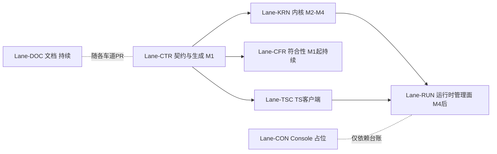

# PARALLEL-LANES — CognitiveOS Personal ownership lease 台账

- 状态：v1.1（active ownership lease model）；类别 plan
- 更新责任：车道启动/交还/换分支时必更所有权表；接口冻结状态变化时必更 §3

`cognitiveos-personal` 是唯一活动实现项目。下列 Lane 是一个项目内的架构责任角色，
不是可各自推进的产品或 backlog。任务来自 `PERSONAL-DEVELOPMENT-PLAN.md`；本文件只
决定当前可写路径，不能改变任务、Gate 或当前产品状态。

## 1. 架构责任角色

Lane 只表示一个 Personal task 内的 primary architecture responsibility，不能生成任务、
固定分支或实现顺序。当前执行入口始终是 `AGENTS.md`、Personal 正式计划、Current
snapshot 和本文件 active lease table。旧 `docs/prompts/lane-*` 与 milestone/v0.1 prompts
是 dated non-executable reference。

| 车道 | 当前责任 |
|---|---|
| **Lane-CTR** 契约与生成 | public contracts、Rust/TS bindings、schema/transition/vector 协同 |
| **Lane-CFR** 符合性与工具 | runner、consistency、CI、evidence tooling |
| **Lane-KRN** 内核主线 | domain、authority store、kernel primitives |
| **Lane-TSC** TS 客户端 | sdk-ts、Agent Shell client core、client contract use |
| **Lane-RUN** 运行时与管理面 | runtime、management、AKP、Personal daemon composition |
| **Lane-DOC** 文档与计划维护 | product/architecture/governance/plan/trace closure |
| **Lane-CON** Console 产品 | inactive compatibility/design role only; no implementation task source |

```mermaid
flowchart LR
  CTR[Lane-CTR 契约与生成 M1] --> KRN[Lane-KRN 内核 M2-M4]
  CTR --> CFR[Lane-CFR 符合性 M1起持续]
  CTR --> TSC[Lane-TSC TS客户端]
  KRN --> RUN[Lane-RUN 运行时管理面 M4后]
  TSC --> RUN
  DOC[Lane-DOC 文档 持续] -.随各车道PR.- CTR
  CON[Lane-CON Console 占位] -.仅依赖台账.- RUN
```

## 2. 并行规则（违反 = PR 拒收）

1. **一个任务 = 一个 primary lane + 一个 task branch/Draft PR + 一份活动 task lease**。一个
   cohesive task 可在 lease 中声明 runtime、CLI、tests 和 docs 等 secondary paths；Slice
   只是该任务内的执行检查点，不得另建 branch、PR、lease 或普通 handoff。每个 lease 使用
   稳定 `lease_id`，格式为 `lease/personal/<task>/<purpose>`，并持续到完整 task acceptance
   与 merge/branch closure 完成。
2. **跨车道接口变更只能经 Lane-CTR** 走契约变更流程（schema/trait/生成物一体变更），并在 `PROGRESS.md` 车道表通告；其他车道等待新契约合并后 rebase。
3. **两个活动 lease 禁止覆盖同一 writable path**；ownership 以 `lease_id`、任务、branch、owned paths、owner/session、claimed_at、last_heartbeat 记录。状态仅允许 `active`、`closed`、`abandoned`、`stale`。只有 `active` 条目授予写权限；其他状态必须移到历史表，不再阻断新任务。共享文件由后合并者负责整合当前快照。禁止用 `docs/plan/**`、`docs/standards/**`、`docs/adr/**`、`specs/**` 等 broad protected-tree glob 取得排他所有权；应列精确文件或窄 feature directory。
4. **合并顺序**：CTR → {KRN, CFR, TSC} → RUN；Lane-DOC 随时但不得夹带代码语义变更。
5. 代码和 protected governance 变更经 PR + required CI 门禁合并；ADR-0008 允许的低风险 docs-only 批可直推 main，分支保护拒绝时改走 PR。
6. Handoff 只在完整任务收口、真正外部阻塞、未知并发改动、ownership transfer 或 owner
   明确暂停时写一次；不得因 Slice、checkpoint、push、CI 轮次或普通会话边界产生逐段
   handoff。
7. **`personal-blog/` 不是本表车道**：嵌套独立仓 [`agentkernel/blog`](https://github.com/agentkernel/blog)；不得用 Cos lane worktree / `D:\blog-*` 平行克隆替代唯一副本 `personal-blog/`。
8. Lease ledger 使用窄幅协调更新：会话只能新增、heartbeat、关闭自己的行并保留其他行。
   `docs/plan/PARALLEL-LANES.md` 不得列入任何 lease 的 writable paths；更新自己的 ledger
   row 是不授予其他路径的协调操作。父目录 lease 不能独占本文件。PR 合并时必须在同一
   closure delivery 关闭 lease；已合并但遗留 active 的行由下一治理 session 诚实关闭。
9. 一个 branch/PR 不得承载多个正式任务。当前已存在的 legacy shared branch 不重写历史，
   但每个活动任务必须在下一安全 continuation boundary 分离到自己的 task branch/PR；不得
   在 shared branch 上再领取新任务。完整任务合并后关闭 lease、确认 PR merged、清理安全
   可删的远端 task branch，并在本地切回/fast-forward `main` 后核对 clean worktree 与
   HEAD/upstream。

### 2.1 Lane-CON 激活前文档例外

2026-07-20 批准一个窄幅、可审计例外：后端 gate 通过前，Lane-CON 可维护 `clients/**`（客户端项目根，ADR-0007：PC/mobile/shared/Agent Hub 文档、治理件、计划与提示词，含 `clients/agent-hub/{docs,plan,prompts}/`）以及兼容 stub `apps/cognitiveos-console/`、`docs/platforms/`、`docs/clients/` 下的 informative 平台研究、产品设计、产品要求/决策、README、roadmap、index、parity matrix、治理说明和已登记漂移的事实修正。

2026-07-26 所有者将客户端文档域整体迁出至独立仓库 [cognitiveos-clients](https://github.com/agentkernel/cognitiveos-clients)（保留 subtree 历史；外部仓根对应原 `clients/`）。上述 2026-07-20 批准记录作为史实保留不变；自该日起，在**本仓库内**该例外仅覆盖余下兼容 stub（`apps/cognitiveos-console/`、`docs/platforms/`、`docs/clients/`），`clients/**` 不得在本仓重建，客户端文档树的维护改由外部仓自身流程承担。

该例外不激活 Console 实现车道，不允许组件、脚手架、mock server、helper、安装器或其他实现代码，不允许修改 registry/schema/transition/vector 等 normative 机器资产，也不允许声称实现已提供、测试已执行或 Profile 已符合。实现 gate 以 [平台文档入口](https://github.com/agentkernel/cognitiveos-clients/blob/main/governance/readiness-gates.md#console-实现-gate) 为准；Agent Hub 另加 Paseo/AGPL 与第三方组件义务的独立法务 gate。

## 3. 活动 ownership leases（唯一当前台账）

只有下表中的 `active` 行授予当前写权限。开始写入前必须新增一行；`PROGRESS.md`
只能引用这里存在的 `lease_id` 或写 `none`。

| Lease ID | Task / slice | Primary lane | Branch | Writable paths | Owner/session | Claimed / heartbeat | Status |
|---|---|---|---|---|---|---|---|
| `lease/personal/P7-T07/windows-install-surface` | P7-T07/D01 Windows credential store backend | Lane-RUN | `personal/P7-T07-windows-install-surface` | `crates/cognitive-secret/Cargo.toml`; `crates/cognitive-secret/src/lib.rs`; `crates/cognitive-secret/src/backend_select.rs`; `crates/cognitive-secret/src/windows_credential_manager.rs`; `crates/cognitive-secret/tests/p7_t07_windows_credential_store.rs`; `crates/cognitive-secret/tests/p1_t02_provider_secret.rs`; `apps/admin-cli/src/personal_cli/init.rs`; `deploy/windows/`; `crates/cognitive-runtime/tests/p7_t07_windows_install_surface.rs`; `docs/adr/0052-personal-windows-install-surface.md`; `docs/checkpoints/20260812-personal-p7-t07-b01-w-preregistration.md`; `docs/checkpoints/20260812-personal-p7-t07-windows-install-closure.md`; `docs/plan/PERSONAL-TEST-ENVIRONMENTS.md` | Cursor parallel session B (claimed while the P9-T04 campaign session was active; P9-T04 is now merged and its lease closed. Rust validation routes to `CI-UBUNTU-01`/`CI-WINDOWS-MSVC-01` only; this task does not touch `DEV-LINUX-NATIVE-01` or `B01-DESKTOP-002`) | 2026-08-12 / 2026-08-12 | active |

Closed historical leases are archived in
[PARALLEL-LANES-CLOSED.md](PARALLEL-LANES-CLOSED.md). That archive grants no
writable ownership. Only the active table above grants write access.

### 3.1 最近关闭的 leases（摘要）

| Lease ID | Task / slice | Branch | Closed | Closure |
|---|---|---|---|---|
| `lease/personal/P9-T04/comprehensive-performance-campaign` | P9-T04/D01-D09 comprehensive performance campaign | `personal/P9-T04-comprehensive-performance-campaign` | 2026-08-12 | D01-D09 deliver the measurement envelope, L0/L1 runner, transport decomposition, resource sampler, campaign claim policy, L3 route policy and L4 scenario harness. `L0`-`L3` executed; `L4` `T1` partial; `L5` closed by owner disposition. Closure: [20260812-personal-p9-t04-performance-campaign-closure.md](../checkpoints/20260812-personal-p9-t04-performance-campaign-closure.md). Full closed history: [PARALLEL-LANES-CLOSED.md](PARALLEL-LANES-CLOSED.md). |
| `lease/personal/P5-T04/dynamic-tool-ecosystem` | P5-T04/D01-D04 dynamic Tool + B10 | `personal/P5-T04-dynamic-tool-ecosystem` | 2026-08-11 | D01–D04 deliver dynamic discovery/enable/disable/quarantine/exposure/reconcile with ADR-0050 B10 MVP pass. Linux `dynamic_tool_ecosystem` 4/4 + Clippy at `b49d274`; required CI `31486478177` on `992dfe3`; PR #196. Full closed history: [PARALLEL-LANES-CLOSED.md](PARALLEL-LANES-CLOSED.md). |
| `lease/personal/P5-T03/mcp-tool-adapter` | P5-T03/D01-D04 MCP Tool adapter | `personal/P5-T03-mcp-tool-adapter` | 2026-08-11 | D01–D04 deliver transport-only MCP fixture adapter with drift/timeout/bypass negatives and non-claim report. Linux `mcp_tool_adapter` 4/4 + Clippy at `a83bdb8`; required CI `31482773002` on `4c06161`; PR #195. Full closed history: [PARALLEL-LANES-CLOSED.md](PARALLEL-LANES-CLOSED.md). |
| `lease/personal/P7-T08/gmvp-linux` | P7-T08/D01-D04 GMVP-LINUX | `personal/P7-T08-gmvp-linux` | 2026-08-11 | D01–D04 deliver ADR-0048 B08 MVP pass, ADR-0049 GMVP composition binder, and GMVP-LINUX MVP pass. B08 CI `31479512940`; composition CI `31480604511`; PR #194. Full closed history: [PARALLEL-LANES-CLOSED.md](PARALLEL-LANES-CLOSED.md). |
| `lease/personal/P9-T02/structure-debt` | P9-T02/D01-D04 structure debt | `personal/P9-T02-structure-debt` | 2026-08-11 | D01–D04 deliver scheduler_authority/tool_executor/sqlite structure splits with focused-test parity and acceptance closure. Linux evidence through `a11d0bd`; required CI `31470278984` on `eddaa70`; PR #192 merged at `main@cff740192601f97fd7071f9f0e1a00f824ae6141`. Full closed history: [PARALLEL-LANES-CLOSED.md](PARALLEL-LANES-CLOSED.md). |
| `lease/personal/P8-T03/non-pi-agent` | P8-T03/D01-D04 non-Pi Codex | `personal/P8-T03-non-pi-agent` | 2026-08-11 | D01–D04 deliver Codex fixture identity, lifecycle, non-claim qualification matrix, and acceptance closure. Linux evidence through `b41f06f`; required CI `31463130827` / closure on `3beb825`; PR #191 merged at `main@47478e40aed0c96808875225df91d6452ca1fb49`. Full closed history: [PARALLEL-LANES-CLOSED.md](PARALLEL-LANES-CLOSED.md). |
| `lease/personal/P8-T06/learning-loop` | P8-T06/D01-D04 learning loop | `personal/P8-T06-learning-loop` | 2026-08-11 | D01–D04 deliver Reflexion failure-lesson Memory/Skill candidate planners, daemon Memory admission wiring, and acceptance closure. Linux evidence through `b81414d`; required CI `31461384771` / closure `31462013806` on `db6fa7a`; PR #190 merged at `main@ad6656566ca0ea365b532b8e059d50d061c5c1df`. Full closed history: [PARALLEL-LANES-CLOSED.md](PARALLEL-LANES-CLOSED.md). |
| `lease/personal/P8-T05/context-compaction` | P8-T05/D01-D04 context compaction | `personal/P8-T05-context-compaction` | 2026-08-11 | D01–D04 deliver digest-bound compaction, adaptive budgets, UCR-01 non-claim benefit observation, and acceptance closure. Linux evidence through `e15492a`; required CI `31459558236` / closure `31460220901` on `c02b272`; PR #189 merged at `main@fa4f74a8feaadaa74affca90cb37660f40cdeb25`. Full closed history: [PARALLEL-LANES-CLOSED.md](PARALLEL-LANES-CLOSED.md). |
| `lease/personal/P8-T04/harness-hooks` | P8-T04/D01-D04 harness hooks | `personal/P8-T04-harness-hooks` | 2026-08-11 | D01–D04 deliver lifecycle hooks, management-channel digest invoke, graded Skill/rule load, and acceptance closure. Linux evidence through `bc3dacd`; required CI `31457314002` on `15e7200`; PR #188 is the task closure PR. Full closed history: [PARALLEL-LANES-CLOSED.md](PARALLEL-LANES-CLOSED.md). |
| `lease/personal/P8-T02/agent-adapter-contract` | P8-T02/D01-D04 agent adapter contract | `personal/P8-T02-agent-adapter-contract` | 2026-08-11 | D01–D04 deliver private AKP registration/lifecycle, Lane-CTR `agent-adapter-manifest` + generated bindings, and acceptance closure. Linux evidence through `791d5ff`; required CI `31453659735` on `f5e427f`; PR #187 is the task closure PR. Full closed history: [PARALLEL-LANES-CLOSED.md](PARALLEL-LANES-CLOSED.md). |
| `lease/personal/P7-T03/six-resource-doctor` | P7-T03/D01-D04 six-resource doctor | `personal/P7-T03-six-resource-doctor` | 2026-08-11 | D01–D04 deliver redacted six-resource, headless vault, and operability doctor sections on `/personal/doctor`. Linux evidence through `749a0c3`; required CI `31451402260`; PR #186 is the task closure PR. Full closed history: [PARALLEL-LANES-CLOSED.md](PARALLEL-LANES-CLOSED.md). |
| `lease/personal/P7-T02/lifecycle-backup` | P7-T02/D01-D04 lifecycle backup | `personal/P7-T02-lifecycle-backup` | 2026-08-11 | D01–D04 deliver secret-excluding inventory, digest-bound Memory/Skill/bindings export, restore preflight, and transactional update/rollback/uninstall. Exact native Linux `personal_backup` 15/15 + Clippy at `68abc82`; required CI `31449589853`; PR #185 is the task closure PR. Full closed history: [PARALLEL-LANES-CLOSED.md](PARALLEL-LANES-CLOSED.md). |
| `lease/personal/P7-T01/release-pipeline` | P7-T01/D01-D04 release pipeline | `personal/P7-T01-release-pipeline` | 2026-08-11 | D01–D04 deliver signed six-family release-manifest, SBOM/artifact digest binding, immutable toolchain pins, and acceptance closure. Exact native Linux `release_manifest` 11/11 + Clippy at `34812f8`; required CI green; PR #184 merged at `main@3198614496571ac251821d2eff1f982274959f06`. Full closed history: [PARALLEL-LANES-CLOSED.md](PARALLEL-LANES-CLOSED.md). |
| `lease/personal/P5-T05/b09-managed-pi` | P5-T05/D01-D04 B09 managed Pi | `personal/P5-T05-b09-managed-pi` | 2026-08-11 | ADR-0047 MVP: D01–D04 deliver process-bound SidecarSession, upgrade/uninstall fencing, recover/orphan identity negatives, fixed-denominator B09 matrix, and owner-affirmed B09 MVP pass. Exact native Linux matrix and required Ubuntu/Windows CI run `31423464703` passed; PR #183 is the task closure PR. Full closed history: [PARALLEL-LANES-CLOSED.md](PARALLEL-LANES-CLOSED.md). |
| `lease/personal/P2-T08/runtime-spine-gates` | P2-T08/D01-D04 Runtime Spine Gates | `personal/P2-T08-runtime-spine-gates` | 2026-08-11 | ADR-0046 MVP: D01–D04 deliver non-claim harness, ADR-0018 expiry, authority-path negatives, fixed-denominator campaign, and owner-affirmed B02/B04/B05/B12 MVP pass. Exact native Linux matrix and required Ubuntu/Windows CI run `31407542786` passed at `be7febb`; PR #182 is the task closure PR. Full closed history: [PARALLEL-LANES-CLOSED.md](PARALLEL-LANES-CLOSED.md). |
| `lease/personal/P5-T02/sidecar-foundation` | P5-T02/D01-D03 sidecar foundation | `personal/P5-T02-sidecar-foundation` | 2026-08-10 | D01-D03 deliver official-Pi Agent registration, epoch-fenced SidecarSession activate, pause/resume/stop/recover, redacted health with `process_bound=false`, and management-session admin-cli callers. Exact native Linux focused validation and required Ubuntu/Windows CI run `31391916831` passed at `58ff0a723a8eae0f7fc89d9a99e9fdd55406aa92`; PR #181 is the task closure PR. Full closed history: [PARALLEL-LANES-CLOSED.md](PARALLEL-LANES-CLOSED.md). |
| `lease/personal/P8-T01/doc-restructure` | P8-T01 complete documentation restructure and 2.0 design baseline | `personal/P8-T01-doc-restructure` | 2026-08-10 | D01-D03 deliver AXIOMS/governance convergence, whitepaper/product/architecture/ADR-0041+, plan/ledger repair, Phase 8/9 registration, and closure checkpoint. Required Ubuntu/Windows CI run `31383446541` passed; PR #180 is the task closure PR. Full closed history: [PARALLEL-LANES-CLOSED.md](PARALLEL-LANES-CLOSED.md). |
| `lease/personal/P7-T04/performance-governance` | P7-T04 complete performance campaign and regression floor | `personal/P7-T04-performance-governance` | 2026-08-10 | D01-D05 deliver deterministic module benchmarks, governed-path stage timing, B06/B07 non-claim observations, module regression-floor policy, and fixed-native governance A/B non-inferiority. Required Ubuntu/Windows CI passed; PR #179 is the task closure PR. Full closed history: [PARALLEL-LANES-CLOSED.md](PARALLEL-LANES-CLOSED.md). |
| `lease/personal/P3-T06/context-correctness` | P3-T06 MVP B03 policy, evidence, and task closure | `personal/P3-T06-context-correctness` | 2026-08-10 | ADR-0040 fixed the MVP B03 denominator; PR #171 merged and reconciled. Full closed history: [PARALLEL-LANES-CLOSED.md](PARALLEL-LANES-CLOSED.md). |
| `lease/personal/P5-T01/pi-acquisition` | P5-T01 complete official Pi acquisition/install lifecycle | `personal/P5-T01-pi-acquisition` | 2026-08-10 | D01-D03 acquisition lifecycle closed in PR #178. Full closed history: [PARALLEL-LANES-CLOSED.md](PARALLEL-LANES-CLOSED.md). |
## 3.2 Historical architecture ownership snapshot

The table below is retained as historical coordination context. Its branches and status text do not grant an active lease and cannot block new work without a current §3 lease.

| crate / package / 目录 | 车道 | 当前分支 | 当前会话/状态 |
|---|---|---|---|
| `crates/cognitive-contracts`、`packages/contracts-ts`、`tests/golden/`、`specs/schemas/`（迁移期） | Lane-CTR | `main` @ `2baef99`（PR #68） | ADR-0014 Ordinary Core/High-Assurance split：minimal `status.inspect` AUDIT decision/receipt schemas, digest references and generated bindings registered；Lane-RUN consumption provided/tested；Lane-CFR vector test executed |
| `crates/cognitive-conformance`、`tools/`、`.github/workflows/` | Lane-CFR | `lane/cfr-ctr-ordinary-core-audit-inspect` | Approved atomic CFR+CTR exception: `ORDINARY-CORE-AUDIT-INSPECT-001` executes the audited public consumer and durable adapter; vector test executed pass (pins 60/25; self-check 41/41); no Profile claim |
| `crates/cognitive-domain`、`cognitive-store`、`cognitive-kernel` | Lane-KRN | `main` @ `7324227`（PR #78） | durable InstallationStore KRN 原子批已合入：仅 SQLite staging/commit/recovery，不新增安装迁移表；cross-process lifecycle lease 仍需单独 API 决策 |
| `packages/sdk-ts`、`apps/agent-shell` | Lane-TSC | `lane/tsc`（已建分支） | 客户端骨架/生成绑定已交付；M5 真 transport 集成待 RUN |
| `crates/cognitive-runtime`、`cognitive-management`、`cognitive-akp`、`apps/kernel-server`、`apps/admin-cli` | Lane-RUN | `lane/run-installation-authority` | Durable authority consumption requires an exclusive in-process manager session for verified stage/commit and recovery; zero capability, Task completion or Effect claims. Targeted runtime tests, clippy and consistency passed locally; cross-process lifecycle lease, verifier and OS sandbox gates remain pending. |
| `docs/`（standards/plan/traceability/checkpoints/prompts）、根 README/AGENTS | Lane-DOC | 随车道 PR | 持续 |
| 客户端文档域已迁至独立仓库 [cognitiveos-clients](https://github.com/agentkernel/cognitiveos-clients)（本仓不再有 `clients/**`）；本仓仅余 `apps/cognitiveos-console/`（stub）、`docs/platforms/`（stub）、`docs/clients/`（stub） | Lane-CON（治理文件由 Lane-DOC 协作） | — | informative 文档例外有效（§2.1）；实现未激活；Agent Hub 另需 AGPL 法务 gate |
| `specs/registry/`、`specs/transitions/`、`conformance/vectors/` | 契约资产：变更一律经 Lane-CTR（向量增补可经 Lane-CFR），走 docs-sync-contract 流程 | `lane/cfr-ctr-ordinary-core-audit-inspect` | Approved one-batch exception completed for the Ordinary Core AUDIT vector + dual registry mapping + matrix; IMP-01 correction only |

## 4. 里程碑 ↔ 车道对照

| 里程碑 | 主车道 | 协作车道 | 提示词 |
|---|---|---|---|
| M1 | CTR + CFR | DOC | [milestone-m1.md](../prompts/milestone-m1.md) |
| M2 | KRN | CFR（向量执行）、DOC | [milestone-m2.md](../prompts/milestone-m2.md) |
| M3 | KRN | CFR、TSC（投影消费）、DOC | [milestone-m3.md](../prompts/milestone-m3.md) |
| M4 | KRN | CFR（故障注入）、DOC | [milestone-m4.md](../prompts/milestone-m4.md) |
| M5 | RUN + TSC | CFR、DOC | [milestone-m5.md](../prompts/milestone-m5.md) |
| M6 | RUN | CFR（平台矩阵）、DOC、CON（依赖复核） | [milestone-m6.md](../prompts/milestone-m6.md) · [M6-PLAN.md](M6-PLAN.md) |
