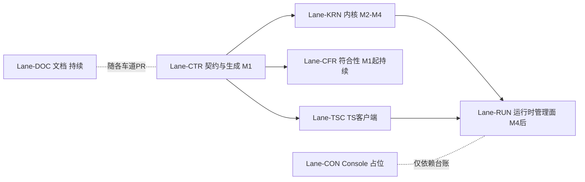

# PARALLEL-LANES — CognitiveOS Personal ownership lease 台账

- 状态：v1.1（active ownership lease model）；类别 plan
- 更新责任：车道启动/交还/换分支时必更所有权表；接口冻结状态变化时必更 §3

`cognitiveos-personal` 是唯一活动实现项目。下列 Lane 是一个项目内的架构责任角色，
不是可各自推进的产品或 backlog。任务来自 `PERSONAL-DEVELOPMENT-PLAN.md`；本文件只
决定当前可写路径，不能改变任务、Gate 或当前产品状态。

## 1. 架构责任角色

Lane 只表示一个 Personal task 内的 primary architecture responsibility，不能生成任务、
固定分支或实现顺序。当前执行入口始终是 `AGENTS.md`、Personal 正式计划、Current
snapshot 和本文件 active lease table。旧 `docs/prompts/lane-*` 与 milestone/v0.1 prompts
是 dated non-executable reference。

| 车道 | 当前责任 |
|---|---|
| **Lane-CTR** 契约与生成 | public contracts、Rust/TS bindings、schema/transition/vector 协同 |
| **Lane-CFR** 符合性与工具 | runner、consistency、CI、evidence tooling |
| **Lane-KRN** 内核主线 | domain、authority store、kernel primitives |
| **Lane-TSC** TS 客户端 | sdk-ts、Agent Shell client core、client contract use |
| **Lane-RUN** 运行时与管理面 | runtime、management、AKP、Personal daemon composition |
| **Lane-DOC** 文档与计划维护 | product/architecture/governance/plan/trace closure |
| **Lane-CON** Console 产品 | inactive compatibility/design role only; no implementation task source |

```mermaid
flowchart LR
  CTR[Lane-CTR 契约与生成 M1] --> KRN[Lane-KRN 内核 M2-M4]
  CTR --> CFR[Lane-CFR 符合性 M1起持续]
  CTR --> TSC[Lane-TSC TS客户端]
  KRN --> RUN[Lane-RUN 运行时管理面 M4后]
  TSC --> RUN
  DOC[Lane-DOC 文档 持续] -.随各车道PR.- CTR
  CON[Lane-CON Console 占位] -.仅依赖台账.- RUN
```

## 2. 并行规则（违反 = PR 拒收）

1. **一个任务 = 一个 primary lane + 一个 task branch/Draft PR + 一份活动 task lease**。一个
   cohesive task 可在 lease 中声明 runtime、CLI、tests 和 docs 等 secondary paths；Slice
   只是该任务内的执行检查点，不得另建 branch、PR、lease 或普通 handoff。每个 lease 使用
   稳定 `lease_id`，格式为 `lease/personal/<task>/<purpose>`，并持续到完整 task acceptance
   与 merge/branch closure 完成。
2. **跨车道接口变更只能经 Lane-CTR** 走契约变更流程（schema/trait/生成物一体变更），并在 `PROGRESS.md` 车道表通告；其他车道等待新契约合并后 rebase。
3. **两个活动 lease 禁止覆盖同一 writable path**；ownership 以 `lease_id`、任务、branch、owned paths、owner/session、claimed_at、last_heartbeat 记录。状态仅允许 `active`、`closed`、`abandoned`、`stale`。只有 `active` 条目授予写权限；其他状态必须移到历史表，不再阻断新任务。共享文件由后合并者负责整合当前快照。禁止用 `docs/plan/**`、`docs/standards/**`、`docs/adr/**`、`specs/**` 等 broad protected-tree glob 取得排他所有权；应列精确文件或窄 feature directory。
4. **合并顺序**：CTR → {KRN, CFR, TSC} → RUN；Lane-DOC 随时但不得夹带代码语义变更。
5. 代码和 protected governance 变更经 PR + required CI 门禁合并；ADR-0008 允许的低风险 docs-only 批可直推 main，分支保护拒绝时改走 PR。
6. Handoff 只在完整任务收口、真正外部阻塞、未知并发改动、ownership transfer 或 owner
   明确暂停时写一次；不得因 Slice、checkpoint、push、CI 轮次或普通会话边界产生逐段
   handoff。
7. **`personal-blog/` 不是本表车道**：嵌套独立仓 [`agentkernel/blog`](https://github.com/agentkernel/blog)；不得用 Cos lane worktree / `D:\blog-*` 平行克隆替代唯一副本 `personal-blog/`。
8. Lease ledger 使用窄幅协调更新：会话只能新增、heartbeat、关闭自己的行并保留其他行。
   `docs/plan/PARALLEL-LANES.md` 不得列入任何 lease 的 writable paths；更新自己的 ledger
   row 是不授予其他路径的协调操作。父目录 lease 不能独占本文件。PR 合并时必须在同一
   closure delivery 关闭 lease；已合并但遗留 active 的行由下一治理 session 诚实关闭。
9. 一个 branch/PR 不得承载多个正式任务。当前已存在的 legacy shared branch 不重写历史，
   但每个活动任务必须在下一安全 continuation boundary 分离到自己的 task branch/PR；不得
   在 shared branch 上再领取新任务。完整任务合并后关闭 lease、确认 PR merged、清理安全
   可删的远端 task branch，并在本地切回/fast-forward `main` 后核对 clean worktree 与
   HEAD/upstream。

### 2.1 Lane-CON 激活前文档例外

2026-07-20 批准一个窄幅、可审计例外：后端 gate 通过前，Lane-CON 可维护 `clients/**`（客户端项目根，ADR-0007：PC/mobile/shared/Agent Hub 文档、治理件、计划与提示词，含 `clients/agent-hub/{docs,plan,prompts}/`）以及兼容 stub `apps/cognitiveos-console/`、`docs/platforms/`、`docs/clients/` 下的 informative 平台研究、产品设计、产品要求/决策、README、roadmap、index、parity matrix、治理说明和已登记漂移的事实修正。

2026-07-26 所有者将客户端文档域整体迁出至独立仓库 [cognitiveos-clients](https://github.com/agentkernel/cognitiveos-clients)（保留 subtree 历史；外部仓根对应原 `clients/`）。上述 2026-07-20 批准记录作为史实保留不变；自该日起，在**本仓库内**该例外仅覆盖余下兼容 stub（`apps/cognitiveos-console/`、`docs/platforms/`、`docs/clients/`），`clients/**` 不得在本仓重建，客户端文档树的维护改由外部仓自身流程承担。

该例外不激活 Console 实现车道，不允许组件、脚手架、mock server、helper、安装器或其他实现代码，不允许修改 registry/schema/transition/vector 等 normative 机器资产，也不允许声称实现已提供、测试已执行或 Profile 已符合。实现 gate 以 [平台文档入口](https://github.com/agentkernel/cognitiveos-clients/blob/main/governance/readiness-gates.md#console-实现-gate) 为准；Agent Hub 另加 Paseo/AGPL 与第三方组件义务的独立法务 gate。

## 3. 活动 ownership leases（唯一当前台账）

只有下表中的 `active` 行授予当前写权限。开始写入前必须新增一行；`PROGRESS.md`
只能引用这里存在的 `lease_id` 或写 `none`。

| Lease ID | Task / slice | Primary lane | Branch | Writable paths | Owner/session | Claimed / heartbeat | Status |
|---|---|---|---|---|---|---|---|
| `lease/personal/P2-T04/private-worker-composition` | P2-T04/D01 private scheduler-to-Context-to-pinned-Pi candidate worker composition | Lane-RUN | `lane/ctr-p3-t01-context-request-binding` | `apps/kernel-server/src/personal/{provider_proxy.rs,scheduler_authority.rs,server.rs,pi_runtime.rs}`; `apps/pi-agent-adapter/{Cargo.toml,src/{lib.rs,main.rs},fixtures/private_candidate_provider.mjs,tests/daemon_candidate_protocol.rs}`; `apps/admin-cli/src/personal_cli/{mod.rs,pi.rs}`; `crates/cognitive-runtime/src/{harness_loop.rs,lib.rs}`; `crates/cognitive-kernel/src/context.rs`; `packages/pi-cognitiveos/src/daemon-client.ts`; focused P2-T04 tests; `docs/checkpoints/20260805-personal-p2-t04-*.md` | Cursor session | 2026-08-05 / 2026-08-06 | active |
| `lease/personal/P2-T05/native-tool-registry-validation` | P2-T05 native daemon Tool registry and pre-executor validator review/fix | Lane-KRN | `lane/ctr-p3-t01-context-request-binding` | `crates/cognitive-kernel/src/{tool_registry.rs,lib.rs}`; `apps/kernel-server/src/personal/resource_api.rs`; `apps/kernel-server/tests/p2_t02_resource_projection.rs`; focused P2-T05 tests; `docs/checkpoints/20260806-personal-p2-t05-*.md` | Cursor session | 2026-08-06 / 2026-08-06 | active |

### 3.1 最近关闭的 leases

| Lease ID | Task / slice | Branch | Closed | Closure |
|---|---|---|---|---|
| `lease/personal/P3-T01/d01-push-blocker` | P3-T01/D01 pushed-checkpoint delivery blocker record | `lane/ctr-p3-t01-context-request-binding` | 2026-08-07 | Local documentation checkpoint records that GitHub HTTPS could not connect through the configured local proxy while pushing `fcb1708`; it remains unpushed. See `20260807-personal-p3-t01-d01-push-blocker-handoff.md`. |
| `lease/personal/P3-T01/context-request-binding` | P3-T01/D01 durable TaskContract ContextRequest binding, workspace source, and daemon-admin authorization/revocation prerequisite | `lane/ctr-p3-t01-context-request-binding` | 2026-08-07 | Prerequisite implementation and focused Context-store evidence are complete, and the daemon-only Context-before-private-Pi candidate composition is merged in PR #153 at `d3d9d295970964f9fe4055fdf4f6a29ab85a5e0b`. The next required durable ContextView emission and revoked-source integration negative remain blocked on the non-overlapping P2-T04 scheduler/Pi lease; no B03, Task completion, Gate, release, or Profile claim changed. See `20260807-personal-p3-t01-d01-context-integration-blocker-handoff.md`. |
| `lease/personal/GOV/task-atomic-delivery-rules` | repository governance refactor for whole-task continuous delivery, MVP-first authorization and deterministic closure | `lane/governance-task-atomic-delivery-rules` | 2026-08-07 | Merged as PR #157 at `ddaeb69`; all required checks passed. See `20260807-task-atomic-delivery-rules-handoff.md`. The parallel window's legacy branch `lane/ctr-p3-t01-context-request-binding` and its worktree changes were untouched throughout. |
| `lease/personal/P2-T07/d05-continuation-prerequisite` | P2-T07/D01 private verification, checkpoint, and continuation authority prerequisite consumed by P2-T03/D05 | `lane/ctr-p2-t03-worker-input-contract` | 2026-08-05 | P2-T07/D01 and P2-T03/D05 are done: exact immutable Linux `08932f7868d46f494aaa76835f4818fd7a1f2962` passed focused worker/recovery tests, full workspace fmt/build/test/Clippy, and required Ubuntu/Windows CI. The private authority only enables `ACT -> VERIFY -> CONTINUE -> OBSERVE`; Artifact, Task acceptance/completion, Gate, release, and Profile remain separate. See `20260805-personal-p2-t03-d05-native-linux-closure-handoff.md`. |
| `lease/personal/P2-T03/worker-input-contract` | P2-T03/D05 public worker-input authority contract and scheduler consumption | `lane/ctr-p2-t03-worker-input-contract` | 2026-08-05 | Superseded by owner-approved `P2-T07/D01` continuation prerequisite. Candidate WIA handoff/recovery remains durable and is consumed by D05, but its prior BoundedHarness use was corrected: WIA authorizes atomic `DECIDE -> ACT`, not `CONTINUE -> OBSERVE`. The new active lease owns the narrow durable verification/checkpoint/continuation authority prerequisite; no Task completion, Gate, release, or Profile claim changed. |
| `lease/personal/P2-T03/scheduler-bounded-harness-worker-recovery` | P2-T03/D05 scheduler-to-BoundedHarness worker and restart-safe recovery | `lane/run-p2-t03-d05-worker-recovery` | 2026-08-03 | Blocked after checkpoint `cc006c1`: durable scheduler registration, recovery discovery, TaskBinding fencing, and stale-epoch negative are implemented, but no canonical persisted authority source exists for the worker's candidate, charge, progress/evidence and expected-loop-version inputs. See `20260803-personal-p2-t03-d05-authority-input-blocker-handoff.md`; a new exact D05 lease is required after the owner decision. |
| `lease/personal/P2-T02/acceptance-assessment` | P2-T02 formal acceptance assessment across completed D01-D04 | `lane/run-p2-t02-acceptance-assessment` | 2026-08-03 | P2-T02 is task-complete: D01-D04 provide the required authenticated daemon API/watch, daemon-owned governance binding, private projection, CLI/Pi common application-service calls, and channel-isolation negatives. Exact Linux evidence and required Ubuntu/Windows CI are recorded per slice. B02/B04/B05/B12, release and Profile remain not-run/incomplete. See `20260803-personal-p2-t02-acceptance-assessment-handoff.md`. |
| `lease/personal/P2-T02/pi-sidecar-parity` | P2-T02/D04 Pi Shell private sidecar Task/resource application parity and non-authority isolation | `lane/run-p2-t02-pi-sidecar-parity` | 2026-08-03 | PR #144 checkpoint `ed01c27` gives the Pi client separate management/resource and Task watch bearer caches, private projection/watch calls, cursor paths, and snapshot-first validation. Focused TS tests, exact Linux daemon-side integration, and required Ubuntu/Windows CI passed. D04 is done; P2-T02 acceptance assessment, B02/B04/B05/B12, release, and Profile remain separate/incomplete. See `20260803-personal-p2-t02-pi-sidecar-parity-handoff.md`. |
| `lease/personal/P2-T02/deterministic-cli-parity` | P2-T02/D03 deterministic CLI Task/resource parity and channel/retry/cursor isolation | `lane/run-p2-t02-cli-parity` | 2026-08-03 | PR #143 checkpoint `af2f6c9` gives `cognitive` distinct management/resource and Task watch sessions, cursors, and read-only daemon calls. Exact immutable Linux daemon-plus-CLI process test 1/1 and required Ubuntu/Windows CI passed. D03 is done; P2-T02, B02/B04/B05/B12, release and Profile remain incomplete/not-run. See `20260803-personal-p2-t02-deterministic-cli-parity-handoff.md`. |
| `lease/personal/P2-T02/private-resource-projection` | P2-T02/D02 private versioned six-family resource projection and cursor isolation | `lane/run-p2-t02-private-resource-projection` | 2026-08-03 | PR #142 checkpoint `70f40a5` provides a private versioned six-family projection and management-bound, process-lifetime watch. Missing authority services are explicit `not-backed`, and task bearer access is rejected. Exact immutable Linux focused process test 1/1 and required Ubuntu/Windows CI passed. D02 is done; P2-T02, B02/B04/B05/B12, release and Profile are not complete. See `20260803-personal-p2-t02-private-resource-projection-handoff.md`. |
| `lease/personal/P2-T02/daemon-task-api-watch` | P2-T02/D01 daemon-owned governance context, authenticated Task API, and process-lifetime watch | `lane/run-p2-t02-daemon-task-api-watch` | 2026-08-03 | PR #141 checkpoint `734cbce` provides generated authenticated Task record/interpret/preview/admit routing, a daemon-owned principal-bound governance root, server-side WriterLease, and bounded snapshot-first process-lifetime watch. Exact-revision Linux focused process test 1/1 and required Ubuntu/Windows CI passed. The slice is done, but P2-T02, B02/B04/B05/B12, release, and Profile remain incomplete/not-run. See `20260803-personal-p2-t02-daemon-task-api-watch-handoff.md`. |
| `lease/personal/P2-T02/bootstrap-governance-context` | P2-T02/D01 Personal bootstrap governance-context contract decision | `lane/ctr-p2-t02-bootstrap-governance-context` | 2026-08-03 | ADR-0022 and governed-object contract now allow only the daemon to persist a canonical, principal-bound local governance root for initial Task-chain mutation; client authority facts remain rejected. Local consistency/diff and required PR #140 Ubuntu/Windows CI passed. P2-T02/D01 remains `in-progress`: route, durable composition, and process-lifetime watch need a distinct Lane-RUN lease. See `20260803-personal-p2-t02-bootstrap-governance-context-handoff.md`. |
| `lease/personal/P2-T02/task-intent-contracts` | P2-T02/D01 authenticated intent record/interpret public-contract prerequisite | `lane/ctr-p2-t02-task-intent-contracts` | 2026-08-03 | Registered daemon-owned Task-channel `intent.record`/`intent.interpret` request/result contracts, generated Rust/TS bindings, client-governance negative vector, traceability and count pins. Exact Linux generated-binding 9/9 and runner 13/13, local TS 39/39, and required Ubuntu/Windows CI at PR #139 passed. P2-T02/D01 remains `in-progress`: daemon authority-context composition and the real API/watch vertical path require a new Lane-RUN lease. See `20260803-personal-p2-t02-task-intent-contracts-handoff.md`. |
| `lease/personal/P2-T02/task-preview-admit-contracts` | P2-T02/D01 server-issued Task preview/admit public-contract prerequisite | `lane/ctr-p2-t02-task-preview-admit-contracts` | 2026-08-03 | Registered the narrow server-issued `task.preview` / `task.admit` request/result contracts, generated Rust/TS bindings, a forged-preview-digest negative vector, traceability and CI count pins. Existing watch cursor-resume/dedup semantics remain unchanged. Exact Linux schema/runner/generated-binding tests, Clippy/fmt, and required Ubuntu/Windows CI passed at PR #138. The parent D01 remains `in-progress`: daemon composition and authenticated watch are a new Lane-RUN lease. See `20260803-personal-p2-t02-task-preview-admit-contracts-handoff.md`. |
| `lease/personal/P0-T01/checkpoint-delivery-governance` | Separate Git checkpoint persistence from Slice closure and make continuation recoverable | `lane/governance-checkpoint-delivery` | 2026-08-03 | Added `CHECKPOINT-DELIVERY-01`, standing automatic commit/push/Draft PR delivery, guarded ready/merge, fast resume, bounded dirty handoff, and consistency failure injection. Local eligible checks and the first Ubuntu CI revision passed; owner explicitly requested merge. Lease closed in the final PR delivery before waiting for all checks on the closure revision. No task, Slice, Gate, release or Profile claim changed. See `20260803-personal-checkpoint-delivery-governance-handoff.md`. |
| `lease/personal/P2-T02/task-api-watch` | P2-T02/D01 real Task API/watch vertical path | `lane/personal-p2-t02-task-api-watch` | 2026-08-03 | PR #135 merged checkpoint `287de70` into `main@cfa4d70` while D01 remained incomplete. The merged branch lease is closed because it no longer grants isolated writable ownership; D01 honestly remains `in-progress`, no completion/Gate claim is created, and continuation requires a new branch/lease. This premature checkpoint merge motivated `CHECKPOINT-DELIVERY-01`. |
| `lease/personal/P1-T09/b01-clean-guest-retirement` | Retire the failed B01 clean-server candidate from active environment selection; retain only historical qualification evidence | `main` | 2026-08-03 | Owner selected `B01-Desktop-Linux-002` as the sole active B01 guest. `B01-Clean-Linux-001` is retired historical qualification evidence, not an alternate B01 or ordinary test target. An authorized read-only SSH/system-libvirt preflight recorded the host and guest visibility; no guest lifecycle change occurred. Consistency, checker regression and diff checks passed. See `20260803-personal-b01-clean-guest-retirement-handoff.md`. |
| `lease/personal/P0-T01/command-environment-guardrails` | Make PowerShell and unsupported Windows GNU execution routing fail-fast and machine-checked | `main` | 2026-08-03 | Added stable `COMMAND-SHELL-PS51` and `RUST-LINK-DEV-WIN-GNU-01` rules, an explicit local non-linking allowlist, supported Rust validation routing, no-repeat requirements and consistency failure injection. All eligible checks passed; no Rust linking command was run locally. No task, Gate, release or Profile claim changed. See `20260803-personal-command-environment-guardrails-handoff.md`. |
| `lease/personal/P2-T03/delivery-slice-governance` | Reconcile delivery-slice rules, P2 task closure, and the current progress queue | `main` | 2026-08-03 | Introduced formal task-internal Delivery Slices, vertical-closure-first and WIP=1 rules, three-layer progress reporting, supported-validation closure requirements and machine-enforced consistency/failure injection. Reconciled P2-T01 to `done` from its unchanged, already-passed acceptance evidence; B01, P2 Gates, release and Profile claims remain unchanged. Checks passed. See `20260803-personal-delivery-slice-governance-handoff.md`. |
| `lease/personal/P2-T03/concrete-effect-closure-release` | Bind the resolved durable Effect to an exact owner/epoch-fenced scheduler lease release | `main` | 2026-08-03 | Added the daemon-private durable Effect-to-lease release boundary. A closed durable Effect releases only the exact owner/epoch lease; pending reconciliation and ceiling STOP retain it, and independent Task verification remains unchanged. The focused Rust test was blocked before compilation by Windows GNU linker exit 121; formatting, diff and consistency checks passed. No evidence level, Gate, release or Profile claim advanced. See `20260803-personal-p2-t03-concrete-effect-closure-release-handoff.md`. |
| `lease/personal/P2-T03/linux-validation-evidence-correction` | Correct the failed SSH validation record without changing implementation or claims | `main` | 2026-08-03 | Corrected the false Linux test-pass statement after verifying SSH failed host-key verification before any remote command ran. No task, evidence, Gate, release or Profile claim advanced. See `20260803-personal-p2-t03-linux-validation-evidence-correction-handoff.md`. |
| `lease/personal/P2-T03/linux-native-task-effect-validation` | Validate the pushed durable task-to-Effect lookup in a disposable exact-revision Linux Git worktree | `main` | 2026-08-03 | SSH host-key verification failed (exit 255) before the remote shell could clone, checkout, test, or install a cleanup trap. This attempt adds no evidence, Gate, release or Profile claim. Next action: establish approved host-key trust, then re-run the exact-revision validation. See `20260803-personal-p2-t03-linux-native-task-effect-validation-handoff.md`. |
| `lease/personal/P2-T03/durable-task-effect-lookup` | Resolve and classify the durable Effect binding for a scheduler TaskContract epoch before worker closure wiring | `main` | 2026-08-03 | Added a deterministic TaskBinding-to-Intent reverse lookup and fail-closed daemon Effect resolver. Missing/ambiguous/inconsistent bindings, absent Effects and unknown states are refused; terminal reconciliation/verification states alone classify closed. Local Rust tests stopped before compilation at Windows GNU linker exit 121; format, diff and consistency checks passed. No evidence level, Gate, release or Profile claim advanced. Next action: bind an unambiguous resolved Effect to the concrete worker closure/release operation. See `20260803-personal-p2-t03-durable-task-effect-lookup-handoff.md`. |
| `lease/personal/P2-T03/durable-dispatch-closure` | Wire a fenced scheduler dispatch outcome to durable lease release only after a daemon-owned closure disposition | `main` | 2026-08-03 | Added the private closed-Effect release boundary and focused closed/pending regressions. The local Rust test did not reach crate compilation because the Windows GNU linker returned exit 121; format, diff and consistency checks passed. No implementation-evidence level, Gate, release or Profile claim advanced. Next action: durable task-to-Effect lookup and concrete worker closure/release invocation. See `20260803-personal-p2-t03-durable-dispatch-closure-handoff.md`. |
| `lease/personal/P1-T09/b01-attempt-2-execution` | Execute preregistered B01 clean-Linux first-install/first-conversation attempt 2 after authorized system-libvirt reset | `lane/personal-p1-t09-b01-attempt-2-execution` | 2026-08-02 | System-libvirt preflight confirmed the exact domain and snapshot. Attempt 2 crossed the reset checkpoint, then bounded SSH network readiness failed before artifact installation or any Provider, secret, or product operation. Cleanup restored the exact snapshot and confirmed the domain shut off. The ledger records 1 success / 1 failure in fixed N=20; no critical safety failure was observed. Next action: diagnose baseline guest SSH/network readiness before a separately claimed attempt 3. See `20260802-personal-p1-t09-b01-attempt-2-execution-handoff.md`. |
| `lease/personal/P1-T09/b01-attempt-2` | Execute preregistered B01 clean-Linux first-install/first-conversation attempt 2, retain redacted evidence, and record its outcome | `lane/personal-p1-t09-b01-attempt-2` | 2026-08-02 | The approved no-secret preflight on `wuz@192.168.1.2` returned `failed to get domain 'B01-Desktop-Linux-002'`. The clean-reset checkpoint was never crossed, so attempt 2 did not start and the immutable ledger remains unchanged. No guest, snapshot, artifact, service, Pi state, Provider, or credential was created or changed. `blocked_paths`: authorized KVM host and registered B01 domain/snapshot; `blocked_task_ids`: P1-T09; `blocked_gate_ids`: B01, GMVP-LINUX; owner: product owner; next action: provide the authorized KVM host for the preregistered guest without substituting another environment. See `20260802-personal-p1-t09-b01-attempt-2-handoff.md`. |
| `lease/personal/P1-T09/windows-provider-fixture-timeout` | Reproduce and repair the Windows deterministic Provider fixture discovery timeout | `lane/personal-p1-t09-windows-fixture-timeout` | 2026-08-02 | `035e5c9` raises the deterministic fixture's bounded test-only budget and exchange deadline to tolerate Windows CI process scheduling. Both Ubuntu and Windows workflows passed, including the formerly timing-out fixture test. Normative surface, task/Gate status, evidence level and claims are unchanged; see `20260802-personal-p1-t09-windows-provider-fixture-timeout-handoff.md`. |
| `lease/personal/P2-T03/scheduler-closure-ci-blocker-record` | Record the replacement CI result and bounded unrelated P1-T09 Windows fixture blocker | `main` | 2026-08-02 | Replacement CI `30753436524` passed the P2-T03 correction on Linux but failed in unrelated Windows P1-T09 Provider fixture discovery with `Transport(Timeout)`. The fixture path and P1-T09 owner are recorded in the handoff; P2 evidence and Gate status remain unchanged. |
| `lease/personal/P2-T03/scheduler-closure-ci-correction` | Record and deliver the narrow corrective Clippy lint scoping after the scheduler closure slice CI failure | `main` | 2026-08-02 | Scoped the required test `unwrap` allowance and the pre-existing test-module ordering allowance after CI `30753039014` reported those warnings. Local formatting and consistency passed; the replacement CI run is pending after this corrective commit. |
| `lease/personal/P2-T03/scheduler-closure-clippy-fix` | Correct test-module Clippy scope for the scheduler Effect-closure slice | `main` | 2026-08-02 | Scoped the required test `unwrap` allowance and the pre-existing test-module ordering allowance after CI reported those warnings. A replacement CI run is pending. |
| `lease/personal/P2-T03/scheduler-worker-effect-closure` | Integrate fenced scheduler worker admission with durable Effect-closure disposition while tightening stale lease release fencing | `main` | 2026-08-02 | Release now matches both owner and epoch, preventing an old worker from closing a successor lease even when the owner identity is reused. A daemon-private Effect-closure boundary skips callback after ceiling STOP and retains unresolved dispatches for reconciliation. Windows GNU linker exit 121 blocked focused Rust execution; no evidence level, Gate, release or Profile claim advanced. See `20260802-personal-p2-t03-scheduler-worker-effect-closure-handoff.md`. |
| `lease/personal/P2-T03/linux-native-admission-regression-validation` | Validate the committed daemon admission-order regression in a disposable exact-revision Linux Git worktree using a low-speed-tolerant fetch | `main` | 2026-08-02 | Exact `ac12a04` was shallow-fetched with an ephemeral low-speed override into a disposable Linux worktree; `cargo test -p kernel-server scheduler_authority::tests` passed 4/4. The worktree was removed by the remote cleanup trap. This is `experimental-local-only` / `tested-local` implementation evidence only; no Gate, release or Profile claim. See `20260802-personal-p2-t03-daemon-admission-order-regression-handoff.md`. |
| `lease/personal/P2-T03/daemon-admission-order-regression` | Add a focused daemon admission regression proving terminal STOP skips lease acquisition and a clear decision acquires once | `main` | 2026-08-02 | Commit `ac12a04` makes the final STOP-or-lease branch explicit and adds both regressions. Format, diff and consistency checks passed. Local compilation stopped at the Windows GNU linker (exit 121); an approved Linux exact-revision attempt could not clone GitHub before its low-speed timeout, and its disposable worktree was removed. No new test, Gate, release or Profile evidence; see `20260802-personal-p2-t03-daemon-admission-order-regression-handoff.md`. |
| `lease/personal/P2-T03/daemon-ceiling-dispatch-admission` | Add daemon-owned ceiling-stop-or-lease admission ordering before any scheduler worker dispatch | `main` | 2026-08-02 | Commit `a3cbea1` adds the daemon-owned STOP-before-lease ordering boundary. Exact revision `a3cbea10eb7c6ba4a6dcf8a9399ba97effd2e38d` passed Linux `scheduler_authority::tests` 2/2; end-to-end admission ordering, worker/Effect closure and Gates remain not-run. See `20260802-personal-p2-t03-daemon-ceiling-dispatch-admission-handoff.md`. |
| `lease/personal/P2-T03/checkpoint-effect-closure-helper` | Restore fail-closed checkpoint-effect closure evaluation required by the registered ceiling STOP edge | `main` | 2026-08-02 | Commit `d5e5024` restores the missing fail-closed helper. Exact revision `d5e5024b6c130f33f465e934cf88a5a2d354385b` passed the focused Linux kernel STOP regression 1/1 and runtime reason-map regression 1/1 in a disposable Git worktree; no Gate, release or Profile claim. See `20260802-personal-p2-t03-checkpoint-effect-closure-helper-handoff.md`. |
| `lease/personal/P2-T03/ceiling-stop-dispatch-adapter` | Map fresh durable scheduler ceiling decisions into the fenced kernel STOP transition before any worker lease is acquired | `main` | 2026-08-02 | Commit `6ab740d` provides the runtime adapter and reason-map regression. Static checks passed, but Linux-native validation exposed a pre-existing kernel compile failure: `checkpoint_effects_are_closed` was called but not defined. No test, Gate, release or Profile claim was advanced; see `20260802-personal-p2-t03-ceiling-stop-dispatch-adapter-handoff.md`. |
| `lease/personal/P2-T03/fenced-ceiling-stop` | Persist loop-scoped scheduler ceiling STOP transition with fenced dispatch disablement and pending-effect closure evidence | `main` | 2026-08-02 | Added the deterministic `LoopDriver::stop_for_ceiling` path and a failure-first regression for terminal STOP plus unresolved-effect refusal. Formatting, diff and consistency checks passed. The focused Rust test did not compile locally because the Windows GNU linker exited 121; Linux-native execution requires explicit user authorization. See `20260802-personal-p2-t03-fenced-ceiling-stop-handoff.md`. |
| `lease/personal/P2-T03/linux-native-execution-routing` | Route Linux-native P2-T03 validation and future experimental deployment to a reviewed SSH worktree without consuming B01 KVM campaign guests | `main` | 2026-08-02 | Confirmed the SSH host and reserved B01 KVM guests, pushed `8d7601d`, checked it out in a disposable remote Git worktree, and passed `cargo test -p kernel-server scheduler_authority::tests` 2/2. No deployment, service change, secret, Provider or B01 guest action occurred; see `20260802-personal-p2-t03-linux-native-execution-routing-handoff.md`. |
| `lease/personal/P2-T03/daemon-authority-adapter-regression` | Failure-first regression coverage for daemon-owned durable scheduler ceiling-fact loading | `main` | 2026-08-02 | Centralized the fail-closed v0.2 TaskContract parser and added v0.1/incomplete-v0.2 regression coverage. `git diff --check` and workspace formatting passed; the focused kernel-server test did not complete because the local Windows GNU linker exited 121 before crate compilation. No worker, STOP, Effect, Gate, release or Profile claim. See `20260802-personal-p2-t03-daemon-authority-adapter-regression-handoff.md`. |
| `lease/personal/P2-T02/adr-0036-supersession-clarification` | Correct ADR-0036's supersession wording so its historical Memory/Context deferral cannot contradict the approved P2/P3/P4 Linux 1.0 target | `main` | 2026-08-02 | ADR-0036 now names ADR-0037's partial supersession and defers only advanced Memory retrieval and complex Context optimization. Two defect-focused reviews, consistency and diff checks passed; no task, Gate, runtime, release or Profile status changed. |
| `lease/personal/P2-T02/unified-resource-closure-fix` | Correct final Current snapshot consistency after unified-resource lease closure | `main` | 2026-08-02 | Corrected the B01 Current snapshot to retain checker-readable minimum-20 wording and removed a closed lease ID from the `Active task lease: none` row. Consistency and diff checks passed before closure; no design, runtime, Gate, release or Profile scope changed. |
| `lease/personal/P2-T02/unified-resource-baseline` | Owner-approved Personal unified cognitive-resource and sidecar product baseline serving P2/P3/P4/P5/P7 | `main` | 2026-08-02 | Product-semantic/structural documentation delivery completed locally: ADR-0037/0038, six-family product/architecture model, Pi sidecar boundary, Linux 1.0 task/Gate rebase, UCR-01, B01 statistical addendum, support/environment/trace synchronization and final handoff. Consistency and diff checks passed; runtime, public contracts, UCR-01/Gate campaigns, release and Profile remain not-run. The worktree remains uncommitted. See `20260802-personal-unified-resource-restructure-handoff.md`. |
| `lease/personal/governance/personal-1-0-docs` | Personal 1.0 architecture, product, governance, plan and consistency refactor | `lane/doc-personal-1-0-restructure` | 2026-08-02 | Product-semantic/structural/corrective documentation delivery completed locally: ADR-0035/0036, canonical product/architecture docs, Linux 1.0/Pi dual-track planning, environment/support registry, governance alignment, stale implementation-doc correction and strengthened consistency/failure-injection checks. Focused tools, Agent Shell and Pi Extension builds/tests plus consistency and diff checks passed; Rust, remote CI, Gate, release and Profile evidence are not-run. The branch remains uncommitted pending explicit authorization. See `20260802-personal-1-0-doc-restructure-handoff.md`. |
| `lease/personal/P2-T03/fenced-quiescence-contract` | TaskContract compatibility and loop ceiling-stop quiescence contract | `lane/ctr-p2-t03-fenced-quiescence` | 2026-08-02 | PR #129 merged as `main@7ea1cde`; finite TaskContract compatibility, scheduler ceiling authority, and related contract/runtime slices landed with their recorded focused evidence. Worker dispatch, durable stop integration, P2 Gates, release, and Profile claims remain not-run. The broad lease is released. |
| `lease/personal/P2-T03/execution-binding-contract` | TaskContract execution binding and scheduler ceiling-stop transition | `lane/ctr-p2-t03-execution-binding` | 2026-08-01 | Contract unblock committed as `4187250`; Linux m5 intent-chain regression passed 6/6. Remaining exhaustive contract/transition/vector evidence and protected CI are not-run. See `20260801-personal-p2-t03-execution-binding-contract-handoff.md`. |
| `lease/personal/P2-T03/durable-authority` | assess daemon-owned durable ceiling fact loading and fenced stop-fact persistence | `lane/personal-p2-t03-durable-authority` | 2026-08-01 | Bounded blocker: no authoritative TaskContract deadline or task-to-loop/budget binding exists, and a ceiling stop lifecycle transition is not registered. No implementation was started; see `20260801-personal-p2-t03-durable-authority-handoff.md`. |
| `lease/personal/P2-T03/ceiling-authority` | inclusive deadline/retry/step/cost scheduler admission from supplied authority-fact snapshots | `lane/personal-p2-t03-ceiling-authority` | 2026-08-01 | Failure-first evaluator test passed 2/2 on the Linux host; fmt and focused Clippy passed. Durable fact loading, stop-fact persistence, and BoundedHarness worker wiring remain not-run. No Gate, release, or Profile claim. See `20260801-personal-p2-t03-ceiling-authority-handoff.md`. |
| `lease/personal/P2-T03/scheduler-service` | deterministic scheduler eligibility, TTL lease-expiry takeover, and clock-shift no-double-dispatch protections | `lane/personal-p2-t03-scheduler-service` | 2026-08-01 | Linux-host failure-first test repaired and passed 5/5; store suite, fmt, and focused Clippy passed. No Gate, release, or Profile claim. See `20260801-personal-p2-t03-scheduler-service-handoff.md`. |
| `lease/personal/P1-T09/b01-execution` | execute the preregistered clean-Linux B01 first-install/first-conversation attempt 1 on `B01-Desktop-Linux-002`, collect redacted evidence, and record the attempt | `main` | 2026-08-01 | Attempt 1 passed all phases with immutable artifact `0.0.0-campaign.20260801.1`; bounded first response in 6295 ms with expected marker and `authority_side_effects:false`; cleanup passed including operator-secret deletion with post-clear not-found. B01 Gate remains `running` pending the formal campaign denominator, aggregate threshold calculation, zero-critical-failure closure and independent verifier disposition. See `20260801-personal-p1-t09-b01-attempt-ledger.md`. |
| `lease/personal/P1-T09/b01-desktop-candidate` | provision a dedicated Ubuntu Desktop 24.04.4 x86_64 B01 candidate with a reset-capable operator-held keyring master and requalify the native Secret Service prerequisite | `main` | 2026-08-01 | `B01-Desktop-Linux-002` provisioned from the official verified ISO; keyring probe passed with the operator-held login password as the recoverable master; reset snapshot `b01-platform-qualified-baseline` taken; campaign `0.0.0-campaign.20260801.1` built from `main@0a5524b` and independently verified by a locked verifier; B01 remains not-run at this lease close. See `20260731-personal-p1-t09-b01-clean-vm-handoff.md`. |
| `lease/personal/P1-T09/b01-gui-keyring-enablement` | add native persistent Secret Service qualification to the dedicated B01 guest | `main` | 2026-07-31 | Desktop console attempts exposed Xorg mode failures across QXL, VirtIO, VGA/VESA, and VMware SVGA. The approved one-time agent master then created an encrypted persistent default collection and Product-compatible non-sensitive store/lookup/clear probes passed before and after headless cleanup. B01 remains not-run because that master cannot be retained for the preregistered reset procedure; no artifact, Pi state, Provider secret, or attempt was created. See `20260731-personal-p1-t09-b01-clean-vm-handoff.md`. |
| `lease/personal/P1-T09/b01-clean-vm-execution` | allocate and qualify the separately clean KVM B01 guest and native Secret Service start-gate prerequisites | `main` | 2026-07-31 | Dedicated Ubuntu 24.04/x86_64 KVM guest, clean baseline snapshot, native user-systemd, and no-product-state checks are recorded. Native transient Secret Service probe passed, but Product-compatible persistent default collection creation stops at a required GUI prompt with no headless prompt agent; no B01 attempt, Provider secret, artifact, Pi state, or claim was created. See `20260731-personal-p1-t09-b01-clean-vm-handoff.md`. |
| `lease/personal/P1-T09/b01-preregistration` | pre-register the separate clean-Linux B01 first-install/first-conversation campaign | `main` | 2026-07-31 | B01 campaign identity, clean-environment, artifact, reset, attempt, threshold, redaction, cleanup, and ownership requirements are fixed in `20260731-personal-p1-t09-b01-preregistration.md`; no VM, artifact, secret opt-in, or B01 attempt was started. Owner action is required before an execution lease. |
| `lease/personal/P1-T09/route-probe-reconciliation` | correct the bounded runner and Pi runtime-model route contract | `lane/personal-p1-t09-abi-targeted-campaign-v2` | 2026-07-31 | PR #126 merged `main@c044f2f`; protected campaign `30603971105` passed and campaign `.4` was independently verified/installed on the qualified host. Redacted installed route observed expected first response in 4267 ms with no authority side effect; `tested-local` only, B01 remains `not-run`. |
| `lease/personal/P1-T09/verified-experimental-deployment` | independently verify and install campaign `.11`, persist exact Pi, and correct the bounded post-configure readiness race | `lane/personal-p1-t09-abi-targeted-campaign-v2` | 2026-07-31 | campaign `30566251554` was independently offline-verified and installed on the qualified host; exact Pi and the redacted installed route passed as `tested-local`; B01 remains `not-run`; see `20260730-personal-p1-t09-verified-experimental-deployment-handoff.md` |
| `lease/personal/P1-T09/protected-experimental-signing-workflow` | provide a protected experimental campaign signing workflow for the coherent bundle | `lane/personal-p1-t09-coherent-bundle-delivery` | 2026-07-30 | workflow YAML and repository consistency passed; GitHub Environment and signing secret are absent, so dispatch, artifact, deployment, and route validation are not-run; see `20260730-personal-p1-t09-protected-experimental-signing-workflow-handoff.md` |
| `lease/personal/P1-T09/redacted-product-route-runner` | add a reproducible non-secret first-response route runner and focused negative coverage | `lane/personal-p1-t09-coherent-bundle-delivery` | 2026-07-30 | local and Linux-native non-secret fixtures passed; installed-product invocation remains blocked by authorized signing/deployment workflow; see `20260730-personal-p1-t09-product-route-runner-handoff.md` |
| `lease/personal/P1-T09/coherent-bundle-delivery` | deliver verified product CLI and complete Pi Extension with the daemon bundle | `lane/personal-p1-t09-coherent-bundle-delivery` | 2026-07-30 | implementation and supported CI complete; Linux-native payload build complete; protected signing-material workflow unavailable, so no archive was signed/installed/deployed; see `20260730-personal-p1-t09-coherent-bundle-delivery-handoff.md` |
| `lease/personal/P1-T09/product-pi-configuration-timeout-diagnosis` | configure the non-secret product Pi route, diagnose bounded first-response timeout | `lane/personal-p1-t09-product-pi-configuration-timeout-diagnosis` | 2026-07-30 | bounded blocker: exact Pi and restored service available, but product CLI and deployed Extension entry are absent; `cognitive pi configure`, doctor, launch, and direct first response not-run; see `20260730-personal-p1-t09-product-pi-configuration-timeout-diagnosis-handoff.md` |
| `lease/personal/P1-T09/linux-real-provider-prerequisites` | native SecretStore correction and real daemon-owned Provider connectivity | `lane/personal-p1-t09-real-provider-prerequisites` | 2026-07-30 | `20260730-personal-p1-t09-real-provider-prerequisites-handoff.md`; native secret and Provider proxy tested-local, direct Pi smoke timed out, B01 remains not-run |
| `lease/personal/P1-T09/exact-pi-extension-load` | exact Pi `0.81.1` availability and real Extension default-export invocation observation | `lane/personal-p1-t09-exact-pi-extension-load` | 2026-07-30 | `20260730-personal-p1-t09-exact-pi-extension-load-handoff.md`; session-local real Pi observation recorded; B01 remains not-run |
| `lease/personal/governance/project-identity-rules-20260730` | Personal project identity and development-rule refactor | `lane/doc-personal-project-identity` | 2026-07-30 | `20260730-personal-project-identity-governance-handoff.md`; local checks and failure injection passed |
| `lease/personal/governance/operating-model-20260730` | Personal governance operating-model correction | `lane/personal-p1-t08-mvp-single-service` | 2026-07-30 | `20260730-governance-operating-model-handoff.md` |
| `lease/personal/P1-T09/provider-fixture-ci-repair` | deterministic binary Provider fixture CI repair | `lane/personal-p1-t09-provider-fixture` | 2026-07-30 | PR #117 required CI green |
| `lease/personal/P1-T09/linux-environment-qualification` | Linux-native Pi environment qualification | `lane/personal-p1-t09-provider-fixture` | 2026-07-30 | SSH qualification recorded; exact Pi availability remains `not-run` |

Normative assets under `specs/registry/`, `specs/schemas/`, `specs/transitions/`, generated contracts, and conformance vector semantics remain Lane-CTR-owned regardless of lease.

## 3.2 Historical architecture ownership snapshot

The table below is retained as historical coordination context. Its branches and status text do not grant an active lease and cannot block new work without a current §3 lease.

| crate / package / 目录 | 车道 | 当前分支 | 当前会话/状态 |
|---|---|---|---|
| `crates/cognitive-contracts`、`packages/contracts-ts`、`tests/golden/`、`specs/schemas/`（迁移期） | Lane-CTR | `main` @ `2baef99`（PR #68） | ADR-0014 Ordinary Core/High-Assurance split：minimal `status.inspect` AUDIT decision/receipt schemas, digest references and generated bindings registered；Lane-RUN consumption provided/tested；Lane-CFR vector test executed |
| `crates/cognitive-conformance`、`tools/`、`.github/workflows/` | Lane-CFR | `lane/cfr-ctr-ordinary-core-audit-inspect` | Approved atomic CFR+CTR exception: `ORDINARY-CORE-AUDIT-INSPECT-001` executes the audited public consumer and durable adapter; vector test executed pass (pins 60/25; self-check 41/41); no Profile claim |
| `crates/cognitive-domain`、`cognitive-store`、`cognitive-kernel` | Lane-KRN | `main` @ `7324227`（PR #78） | durable InstallationStore KRN 原子批已合入：仅 SQLite staging/commit/recovery，不新增安装迁移表；cross-process lifecycle lease 仍需单独 API 决策 |
| `packages/sdk-ts`、`apps/agent-shell` | Lane-TSC | `lane/tsc`（已建分支） | 客户端骨架/生成绑定已交付；M5 真 transport 集成待 RUN |
| `crates/cognitive-runtime`、`cognitive-management`、`cognitive-akp`、`apps/kernel-server`、`apps/admin-cli` | Lane-RUN | `lane/run-installation-authority` | Durable authority consumption requires an exclusive in-process manager session for verified stage/commit and recovery; zero capability, Task completion or Effect claims. Targeted runtime tests, clippy and consistency passed locally; cross-process lifecycle lease, verifier and OS sandbox gates remain pending. |
| `docs/`（standards/plan/traceability/checkpoints/prompts）、根 README/AGENTS | Lane-DOC | 随车道 PR | 持续 |
| 客户端文档域已迁至独立仓库 [cognitiveos-clients](https://github.com/agentkernel/cognitiveos-clients)（本仓不再有 `clients/**`）；本仓仅余 `apps/cognitiveos-console/`（stub）、`docs/platforms/`（stub）、`docs/clients/`（stub） | Lane-CON（治理文件由 Lane-DOC 协作） | — | informative 文档例外有效（§2.1）；实现未激活；Agent Hub 另需 AGPL 法务 gate |
| `specs/registry/`、`specs/transitions/`、`conformance/vectors/` | 契约资产：变更一律经 Lane-CTR（向量增补可经 Lane-CFR），走 docs-sync-contract 流程 | `lane/cfr-ctr-ordinary-core-audit-inspect` | Approved one-batch exception completed for the Ordinary Core AUDIT vector + dual registry mapping + matrix; IMP-01 correction only |

## 4. 里程碑 ↔ 车道对照

| 里程碑 | 主车道 | 协作车道 | 提示词 |
|---|---|---|---|
| M1 | CTR + CFR | DOC | [milestone-m1.md](../prompts/milestone-m1.md) |
| M2 | KRN | CFR（向量执行）、DOC | [milestone-m2.md](../prompts/milestone-m2.md) |
| M3 | KRN | CFR、TSC（投影消费）、DOC | [milestone-m3.md](../prompts/milestone-m3.md) |
| M4 | KRN | CFR（故障注入）、DOC | [milestone-m4.md](../prompts/milestone-m4.md) |
| M5 | RUN + TSC | CFR、DOC | [milestone-m5.md](../prompts/milestone-m5.md) |
| M6 | RUN | CFR（平台矩阵）、DOC、CON（依赖复核） | [milestone-m6.md](../prompts/milestone-m6.md) · [M6-PLAN.md](M6-PLAN.md) |
