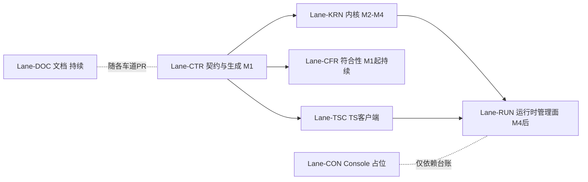

# PARALLEL-LANES — 并行车道机制（面向 Cursor Multitask）

- 状态：v1.1（active ownership lease model）；类别 plan
- 更新责任：车道启动/交还/换分支时必更所有权表；接口冻结状态变化时必更 §3

## 1. 车道划分

**接口先行原则**：`cognitive-contracts`/`packages/contracts-ts` 的生成合同与 `cognitive-kernel` 的端口 trait 冻结后，各车道方可分叉并行；此前只有 Lane-CTR 与 Lane-CFR 可动。

| 车道 | 职责 | 启动条件 | 接续提示词 |
|---|---|---|---|
| **Lane-CTR** 契约与生成 | contracts 双端（Rust/TS）+ golden fixtures + codegen + F-003 schema 单轨迁移——**所有车道的地基，最先完成** | 立即（M1） | [prompts/lane-ctr.md](../prompts/lane-ctr.md) |
| **Lane-CFR** 符合性与工具 | runner 执行能力、tools、CI 演进（M1 起持续） | 立即（M1，可与 CTR 并行） | [prompts/lane-cfr.md](../prompts/lane-cfr.md) |
| **Lane-KRN** 内核主线 | domain → store → kernel（M2–M4） | M1 出口（生成合同冻结） | [prompts/lane-krn.md](../prompts/lane-krn.md) |
| **Lane-TSC** TS 客户端 | sdk-ts、admin-cli 交互层、agent-shell | CTR golden 对齐后与 KRN 并行；M5 集成 | [prompts/lane-tsc.md](../prompts/lane-tsc.md) |
| **Lane-RUN** 运行时与管理面 | runtime、management、akp、kernel-server | M4 出口（tracer bullet 后） | [prompts/lane-run.md](../prompts/lane-run.md) |
| **Lane-DOC** 文档与计划维护 | 标准/计划/台账/白皮书对齐；可随各车道 PR 附带 | 持续 | [prompts/lane-doc.md](../prompts/lane-doc.md) |
| **Lane-CON** Console 产品 | 激活前仅 informative 产品研究/设计与依赖台账；实现仍由后端 gate 阻断 | 文档例外已批准；实现须后端 gate | [prompts/lane-con.md](../prompts/lane-con.md) |

```mermaid
flowchart LR
  CTR[Lane-CTR 契约与生成 M1] --> KRN[Lane-KRN 内核 M2-M4]
  CTR --> CFR[Lane-CFR 符合性 M1起持续]
  CTR --> TSC[Lane-TSC TS客户端]
  KRN --> RUN[Lane-RUN 运行时管理面 M4后]
  TSC --> RUN
  DOC[Lane-DOC 文档 持续] -.随各车道PR.- CTR
  CON[Lane-CON Console 占位] -.仅依赖台账.- RUN
```

## 2. 并行规则（违反 = PR 拒收）

1. **一个任务 = 一个 primary lane + 一个分支/PR + 一份活动 ownership lease**。一个 cohesive task 可在 lease 中声明 runtime、CLI、tests 和 docs 等 secondary paths；不再用历史 lane 名阻止跨目录的完整原子批。
2. **跨车道接口变更只能经 Lane-CTR** 走契约变更流程（schema/trait/生成物一体变更），并在 `PROGRESS.md` 车道表通告；其他车道等待新契约合并后 rebase。
3. **两个活动 lease 禁止覆盖同一 writable path**；ownership 以任务、branch、owned paths、owner/session、claimed_at、last_heartbeat 记录。merged/abandoned/stale lease 自动成为历史，不再阻断新任务。共享文件由后合并者负责整合当前快照。
4. **合并顺序**：CTR → {KRN, CFR, TSC} → RUN；Lane-DOC 随时但不得夹带代码语义变更。
5. 代码和 protected governance 变更经 PR + required CI 门禁合并；ADR-0008 允许的低风险 docs-only 批可直推 main，分支保护拒绝时改走 PR。
6. 车道会话结束按 B4 协议写 handoff（`docs/checkpoints/YYYYMMDD-lane-<名>-handoff.md`）。
7. **`personal-blog/` 不是本表车道**：嵌套独立仓 [`agentkernel/blog`](https://github.com/agentkernel/blog)；不得用 Cos lane worktree / `D:\blog-*` 平行克隆替代唯一副本 `personal-blog/`。

### 2.1 Lane-CON 激活前文档例外

2026-07-20 批准一个窄幅、可审计例外：后端 gate 通过前，Lane-CON 可维护 `clients/**`（客户端项目根，ADR-0007：PC/mobile/shared/Agent Hub 文档、治理件、计划与提示词，含 `clients/agent-hub/{docs,plan,prompts}/`）以及兼容 stub `apps/cognitiveos-console/`、`docs/platforms/`、`docs/clients/` 下的 informative 平台研究、产品设计、产品要求/决策、README、roadmap、index、parity matrix、治理说明和已登记漂移的事实修正。

2026-07-26 所有者将客户端文档域整体迁出至独立仓库 [cognitiveos-clients](https://github.com/agentkernel/cognitiveos-clients)（保留 subtree 历史；外部仓根对应原 `clients/`）。上述 2026-07-20 批准记录作为史实保留不变；自该日起，在**本仓库内**该例外仅覆盖余下兼容 stub（`apps/cognitiveos-console/`、`docs/platforms/`、`docs/clients/`），`clients/**` 不得在本仓重建，客户端文档树的维护改由外部仓自身流程承担。

该例外不激活 Console 实现车道，不允许组件、脚手架、mock server、helper、安装器或其他实现代码，不允许修改 registry/schema/transition/vector 等 normative 机器资产，也不允许声称实现已提供、测试已执行或 Profile 已符合。实现 gate 以 [平台文档入口](https://github.com/agentkernel/cognitiveos-clients/blob/main/governance/readiness-gates.md#console-实现-gate) 为准；Agent Hub 另加 Paseo/AGPL 与第三方组件义务的独立法务 gate。

## 3. 活动 ownership leases（当前）

| Task | Primary lane | Branch | Writable paths | Owner/session | Claimed / heartbeat | Status |
|---|---|---|---|---|---|---|
| Personal governance operating-model correction | Lane-DOC | `lane/personal-p1-t08-mvp-single-service` | `AGENTS.md`, `plan.md`, `docs/README.md`, `docs/governance/**`, `docs/plan/**`, `docs/traceability/findings-ledger.md`, `docs/standards/docs-sync-contract.md`, `docs/adr/0008-*`, current governance handoff | current governance session | 2026-07-30 / 2026-07-30 | active; documentation-only |
| P1-T09 implementation continuation | Lane-RUN | next task-correct `lane/personal-p1-t09-*` branch | must be declared when claimed; existing user-dirty `apps/kernel-server/src/personal/server.rs` excluded until owner releases it | unclaimed | — | available after governance closure |

Normative assets under `specs/registry/`, `specs/schemas/`, `specs/transitions/`, generated contracts, and conformance vector semantics remain Lane-CTR-owned regardless of lease.

## 3.1 Historical ownership snapshot

The table below is retained as historical coordination context. Its branches and status text do not grant an active lease and cannot block new work without a current §3 lease.

| crate / package / 目录 | 车道 | 当前分支 | 当前会话/状态 |
|---|---|---|---|
| `crates/cognitive-contracts`、`packages/contracts-ts`、`tests/golden/`、`specs/schemas/`（迁移期） | Lane-CTR | `main` @ `2baef99`（PR #68） | ADR-0014 Ordinary Core/High-Assurance split：minimal `status.inspect` AUDIT decision/receipt schemas, digest references and generated bindings registered；Lane-RUN consumption provided/tested；Lane-CFR vector test executed |
| `crates/cognitive-conformance`、`tools/`、`.github/workflows/` | Lane-CFR | `lane/cfr-ctr-ordinary-core-audit-inspect` | Approved atomic CFR+CTR exception: `ORDINARY-CORE-AUDIT-INSPECT-001` executes the audited public consumer and durable adapter; vector test executed pass (pins 60/25; self-check 41/41); no Profile claim |
| `crates/cognitive-domain`、`cognitive-store`、`cognitive-kernel` | Lane-KRN | `main` @ `7324227`（PR #78） | durable InstallationStore KRN 原子批已合入：仅 SQLite staging/commit/recovery，不新增安装迁移表；cross-process lifecycle lease 仍需单独 API 决策 |
| `packages/sdk-ts`、`apps/agent-shell` | Lane-TSC | `lane/tsc`（已建分支） | 客户端骨架/生成绑定已交付；M5 真 transport 集成待 RUN |
| `crates/cognitive-runtime`、`cognitive-management`、`cognitive-akp`、`apps/kernel-server`、`apps/admin-cli` | Lane-RUN | `lane/run-installation-authority` | Durable authority consumption requires an exclusive in-process manager session for verified stage/commit and recovery; zero capability, Task completion or Effect claims. Targeted runtime tests, clippy and consistency passed locally; cross-process lifecycle lease, verifier and OS sandbox gates remain pending. |
| `docs/`（standards/plan/traceability/checkpoints/prompts）、根 README/AGENTS | Lane-DOC | 随车道 PR | 持续 |
| 客户端文档域已迁至独立仓库 [cognitiveos-clients](https://github.com/agentkernel/cognitiveos-clients)（本仓不再有 `clients/**`）；本仓仅余 `apps/cognitiveos-console/`（stub）、`docs/platforms/`（stub）、`docs/clients/`（stub） | Lane-CON（治理文件由 Lane-DOC 协作） | — | informative 文档例外有效（§2.1）；实现未激活；Agent Hub 另需 AGPL 法务 gate |
| `specs/registry/`、`specs/transitions/`、`conformance/vectors/` | 契约资产：变更一律经 Lane-CTR（向量增补可经 Lane-CFR），走 docs-sync-contract 流程 | `lane/cfr-ctr-ordinary-core-audit-inspect` | Approved one-batch exception completed for the Ordinary Core AUDIT vector + dual registry mapping + matrix; IMP-01 correction only |

## 4. 里程碑 ↔ 车道对照

| 里程碑 | 主车道 | 协作车道 | 提示词 |
|---|---|---|---|
| M1 | CTR + CFR | DOC | [milestone-m1.md](../prompts/milestone-m1.md) |
| M2 | KRN | CFR（向量执行）、DOC | [milestone-m2.md](../prompts/milestone-m2.md) |
| M3 | KRN | CFR、TSC（投影消费）、DOC | [milestone-m3.md](../prompts/milestone-m3.md) |
| M4 | KRN | CFR（故障注入）、DOC | [milestone-m4.md](../prompts/milestone-m4.md) |
| M5 | RUN + TSC | CFR、DOC | [milestone-m5.md](../prompts/milestone-m5.md) |
| M6 | RUN | CFR（平台矩阵）、DOC、CON（依赖复核） | [milestone-m6.md](../prompts/milestone-m6.md) · [M6-PLAN.md](M6-PLAN.md) |
