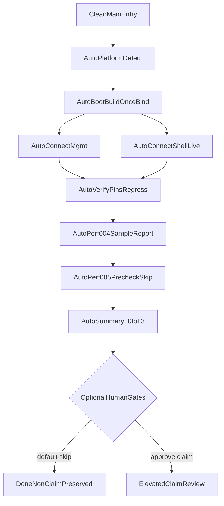

# V01 Auto-Run / Verify / Perf Plan（无人值守优先）

- 状态：active（2026-07-21）；类别 plan（informative）
- Canonical 一键编排计划；承接 [M6-EXIT-PLAN.md](M6-EXIT-PLAN.md) / [20260721-v01-rereview.md](../checkpoints/20260721-v01-rereview.md) 的 **GO-with-explicit-non-claim**
- 更新责任：编排脚本或 pins/入口面变化时同批更新本文件与 [PROGRESS.md](PROGRESS.md)
- 战役升格附录：[V01-PERF-CAMPAIGN-PLAN.md](V01-PERF-CAMPAIGN-PLAN.md)（默认不触发）

## 1 页执行摘要

**一键入口**：`pnpm run verify:local` → `scripts/v01-auto-run-entry.mjs` → Windows `scripts/v01-auto-run.ps1` / POSIX `scripts/v01-auto-run.sh`。

阶段门：`detect → boot → connect → verify → perf-auto → summary`。证据根：`artifacts/evidence/v01-auto-run/<run_id>/`（`summary.json` + `summary.md` + sha256 清单）。

| 级别 | tip 含义 | 自动判绿 |
|---|---|---|
| **L0 Boot-green** | `kernel-server` 非长驻；仅 `--once --bind` | workspace 构建成功 + binary 可解析 |
| **L1 Connect-green** | admin-cli 四动词 + sdk-ts `http_live` + `m5_http_sse` | 既有测试全绿 |
| **L2 Verify-green** | CI honesty pins | consistency + pins 84/55/29 + self-check ≥36 + F-011/M6/F-017 |
| **L3 Perf-report-ready** | builder/sample only | sample 报告 + `campaign=not_executed`；禁止 benefit |

人闸门（≤5，默认 skip）：`HUMAN-PLATFORM-LABEL`、`HUMAN-CI-JOB-ADD`、`HUMAN-PERF004-CAMPAIGN`、`HUMAN-PERF005-CLAIM`、`HUMAN-NO-GO`。

**自动绿灯 ≠ Profile implemented ≠ 跨平台安全符合。**

---

## A. 目标与出口

无人值守拉起 tip 参考实现路径、跑通管理面与 Shell 最小联通、钉住 pins/回归、采集 PERF sample 并生成诚实分区报告（`auto_pass` / `auto_fail` / `skipped_nonclaim` / `needs_human`）。

人可选升格（非默认）：`L3-campaign-pass`、`L3-benefit-claim`。

### Tip 启动面硬事实（禁止臆造）

- 无 clap / `--data-dir` / `/health` / `/ready`
- 联通：`--once --bind` + sdk-ts live / `kernel-server` `m5_http_sse`
- admin-cli：`inspect|stop|revoke|reconcile` + `--store` / `--session`
- PERF-004：`cognitive-runtime` builder + runner 嵌入 sample；无全 HW campaign
- PERF-005：合同/文档 only；四臂 harness 不存在 → `skipped_nonclaim`
- Console/clients：**blocked**，不入主路径

### 继承 v0.1 non-claims（summary 必须带出）

Windows-native sandbox unsupported；WSL2 not_tested；durable install = in-process only；PERF-004 campaign 未做；PERF-005 无收益；Profile implemented=0；D-018 residual；M7+/Console 不在范围。

---

## B. 工作包

### WP-SCOPE（自动）

- **入口**：编排器平台探测
- **输出**：`platform.json` → F-017 标签 `linux_native` | `windows_wsl2_linux_guest` | `windows_native`
- **通过**：标签诚实；禁止 Windows-native sandbox pass
- **人**：探测矛盾 → `HUMAN-PLATFORM-LABEL`；默认更保守标签并继续

### WP-BOOT（全自动）

- **入口**：`cargo build --workspace --locked`；`pnpm install --frozen-lockfile`；`pnpm -r build`
- **通过**：exit 0；`KERNEL_SERVER_BIN` 可解析（**不**要求长驻或 HTTP health）
- **人**：无

### WP-CONNECT-MGMT（全自动）

- **入口**：`cargo test -p admin-cli --test m5_deterministic_fallback`；`cargo test -p cognitive-management --test m5_fallback_verbs`
- **人**：无

### WP-CONNECT-SHELL（全自动）

- **入口**：`KERNEL_SERVER_BIN=... pnpm --filter @cognitiveos/sdk-ts test`；`cargo test -p kernel-server --test m5_http_sse`
- **通过**：live 三项非 skip；bin 缺失 = `auto_fail`
- **诚实 skip**：`CONNECT-FULL-DEMO`、`CONNECT-WATCH`（断线/cursor）= `skipped_nonclaim`

### WP-VERIFY（全自动，默认必跑）

- **入口**：`pnpm run check:consistency`；`cargo run --locked -p cognitive-conformance --bin conformance-runner`；`--self-check`；`cargo test -p cognitive-runtime --lib sandbox::tests`
- **pins**：`{ total_vectors: 84, pass: 55, fail: 0, not-applicable: 0, documented-degradation: 0, not-run: 29 }`；`must_flip ≥ 36`
- **回归**：`MGMT-APPROVAL-R1-009` / `SELF-010` / `FATIGUE-011`；`AGENT-INSTALL-001` / `BYPASS-002` / `OOB-001`
- **失败**：自动 NO-GO 本流水线

### WP-PERF-004-AUTO（自动采集，默认不升格）

- **入口**：`cargo test -p cognitive-runtime overhead_report_requires_ungoverned_baseline_and_forbids_benefit -- --exact`
- **输出**：`artifacts/evidence/performance/performance-report-v01-sample.json` + honesty 字段 `claim_level=sample_or_builder_only`、`campaign=not_executed`
- **人**：`HUMAN-PERF004-CAMPAIGN` 默认 skip

### WP-PERF-005-AUTO（默认跳过）

- **输出**：`perf005-precheck.json` → `skipped_nonclaim`
- **人**：`HUMAN-PERF005-CLAIM` 默认禁止收益

### WP-ORCHESTRATOR

- **入口**：`pnpm run verify:local`（可选 `--skip-build` / `--strict-entry`）
- **CI**：默认复用现有 `verify` job 本地等价步骤；新增独立 job = `HUMAN-CI-JOB-ADD`（默认跳过）

### WP-REVIEW

自动 `summary.json` / `summary.md`。写入正式 release note / 升格宣称才需要人。

---

## C. 串行与并行



---

## D. 验收矩阵

| 判据ID | 通过标准 | 阻断 | 人介入 |
|---|---|---|---|
| ENTRY | tip/CI 可记录；无 personal-blog porcelain 基线 | 硬 | StrictEntry 可选 |
| PLATFORM-LABEL | F-017 标签诚实 | 硬（虚报） | 矛盾时 |
| BOOT-BUILD / BOOT-UP | 构建 + binary | 硬 | 否 |
| BOOT-TEARDOWN | 清 tmp | 软 | 否 |
| CONNECT-MGMT / CONNECT-SHELL | tip 测试绿 | 硬 | 否 |
| CONNECT-WATCH | 诚实 skip | 软 | 否 |
| VERIFY-CONSISTENCY / PINS / SELFCHECK | CI 同口径 | 硬 | 否 |
| REGRESS-V01 / F017-CLAIM-FREEZE | 六向量 + digests | 硬 | 否 |
| PERF004-AUTO-REPORT | sample + digest/sha256 | →L3 | 否 |
| PERF004-NO-SILENT-CAMPAIGN | campaign≠pass | 硬 | 升格时 |
| PERF005-DEFAULT-NONCLAIM / NO-SILENT-BENEFIT | skipped；无 benefit | 硬（虚报） | 升格时 |
| ORCHESTRATOR-ONE-SHOT / SUMMARY-MACHINE-READABLE | 单命令→summary | 硬 | CI 可选 |
| MANIFEST-HONESTY | implemented=0 口径 | 硬 | 否 |
| REVIEW | informative 默认 | 软 | 正式宣称 |

---

## E. 风险与 No-Go

- sample/builder 写成 campaign 或 benefit
- WSL2/Linux guest 写成 Windows-native sandbox pass
- pins/self-check 回退仍报 L2
- mock Console 冒充联通
- 改负例 expected 求绿
- dirty / `personal-blog/**` 基线
- L1/L2 绿写成 Profile `implemented`
- 发明 tip 不存在的启动 flag 并宣称已测

---

## F. Batch 拆分与提示词

1. Batch-A：入口 + 平台 + 编排骨架 — [v01-auto-orchestrator.md](../prompts/v01-auto-orchestrator.md)
2. Batch-B：Boot + Connect — [v01-auto-boot-connect.md](../prompts/v01-auto-boot-connect.md)
3. Batch-C：Verify — [v01-auto-verify-regress.md](../prompts/v01-auto-verify-regress.md)
4. Batch-D：Perf — [v01-auto-perf-report.md](../prompts/v01-auto-perf-report.md)
5. Batch-E：本计划 + summary 模板

---

## G. 明确不做（除非人闸门批准）

- Console / clients / Agent Hub 实现
- 静默 PERF-004 campaign / PERF-005 benefit
- 扩 F-017 声明集
- M7+ memory/discovery 混入本流水线
- 把自动绿灯写成 Profile implemented
- 改向量 / 降 pins 地板

---

## 人介入清单

| Gate ID | 默认（无人） | summary |
|---|---|---|
| HUMAN-PLATFORM-LABEL | 更保守标签并继续 | needs_human → resolved_by_default |
| HUMAN-CI-JOB-ADD | 仅本地 `verify:local` | skipped_nonclaim |
| HUMAN-PERF004-CAMPAIGN | 保持 non-claim | skipped_nonclaim |
| HUMAN-PERF005-CLAIM | 禁止 | skipped_nonclaim |
| HUMAN-NO-GO | failed，不发布 | auto_fail + release=blocked |

## 开放问题默认

| # | 默认 |
|---|---|
| 平台 | linux_native 参考；Windows 可跑但 sandbox `unsupported`/`skip` |
| 联通深度 | tip live 已有面 |
| PERF-004 | sample + campaign non-claim |
| PERF-005 | 预检 + 禁止收益 |
| CI | 先本地；加 job 需 HUMAN-CI-JOB-ADD |

## 命令速查

```powershell
pnpm run verify:local
pnpm run verify:local -- --skip-build
pwsh -File scripts/v01-auto-run.ps1 -SkipBuild
```

```bash
pnpm run verify:local
bash scripts/v01-auto-run.sh --skip-build
```
