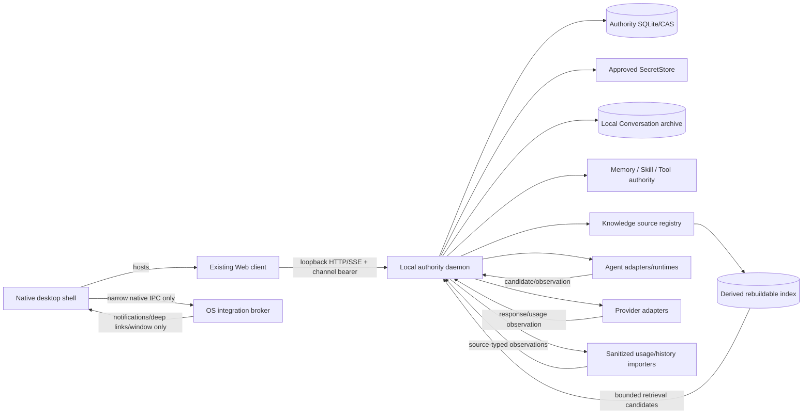
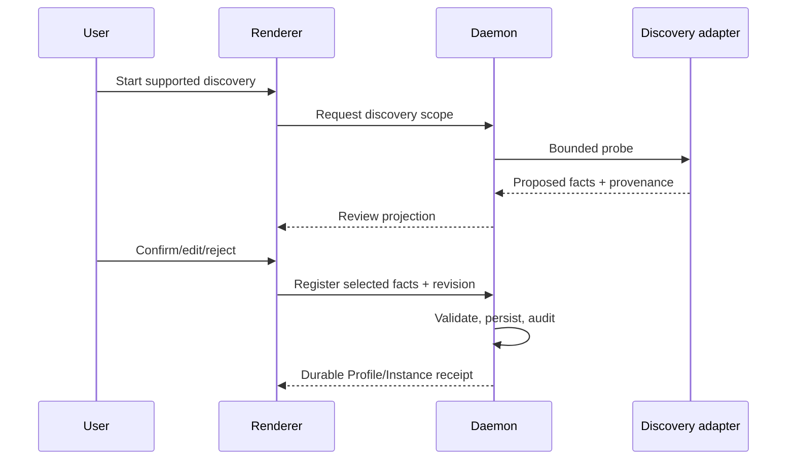

# CognitiveOS Personal 候选架构

Date: 2026-08-25
Status: **candidate / owner-confirmed discovery / non-canonical / no implementation authorization**

本文件描述 [Personal 产品](03-personal-product-design.md)的候选 architecture。它不修改
contract、schema、transition、ADR、code 或正式计划。`clients/docs/design/26–41` 是 2026-08-24
dated baseline；本文只记录 owner-confirmed delta。

## 1. Capability truth

| Layer | Current classification |
|---|---|
| Rust daemon authority chain | **FACT: implemented / tested；部分 HTTP-accessible / bounded Gate-proven** |
| formal Personal Web client | **FACT: implemented in external `cognitiveos-clients/pc/web`; current UI presentation exists** |
| native desktop shell | **DESIGNED only** |
| complete Agent readiness projection | **PARTIAL / HTTP gaps** |
| Provider accounts/models/bindings/usage | **implemented / HTTP-accessible / tested；not release/Profile-proven** |
| Entitlement/cost provenance model | **DESIGNED / partial implementation** |
| P0 activation orchestration | **DESIGNED only** |
| Conversation archive/import/resume | **DESIGNED / current implementation coverage unknown** |
| local Knowledge source registry/index adapter | **PARTIAL substrate / Desktop flow DESIGNED** |
| Context inspection/diff | **PARTIAL Context substrate / Desktop projection DESIGNED** |
| Memory/Skill/Tool authority | **implemented in separate domain slices；Desktop lifecycle/projection PARTIAL** |
| native token import/adapters | **DESIGNED only；no dependency/import executed** |

任何 200 response 不自动证明 route/capability；现有 unmatched stubs 必须通过 route whitelist
和 shape/version checks 排除。

## 2. Candidate topology



**FACT / non-negotiable**：

- daemon 是唯一 authority writer；
- shell、renderer、WebView、Agent、Provider 只发 request/candidate/observation；
- external mutation 必须 persist Intent before dispatch，并以 Effect reconcile；
- Task execution 使用 lease epoch/fence 与 hard Task budget；
- independent verification precedes acceptance；
- secret 只进入 approved SecretStore，不进入 renderer、argv、ordinary config、logs/evidence。

## 3. Process and trust boundaries

| Boundary | Trusted for | Not trusted for |
|---|---|---|
| Native shell main process | window lifecycle、deep links、tray、signed update handoff | Task/Provider authority mutation |
| Renderer/Web client | display、input、request composition | secret custody、completion decision |
| Loopback channel | authenticated bounded API transport | origin alone is not authentication |
| Native IPC | allowlisted OS operation | generic filesystem/network/command bridge |
| Daemon | policy、persistence、authority transition、verification composition | Provider invoice truth without source |
| Agent adapter | candidate、runtime observation | Task completion、authority |
| Provider adapter | model/usage/access observation | local policy、acceptance |
| SecretStore | secret value custody | UI-facing metadata source beyond redacted refs |

Renderer compromise blast radius 必须被 CSP、Origin allowlist、memory-only bearer、narrow IPC、
no-secret response、route allowlist 与 daemon reauthorization 限制。

## 4. Transport choice

### 4.1 Loopback HTTP remains primary service channel

候选默认复用现有 loopback HTTP/SSE 与 task/management channel bearer：

- preserves existing Web client logic；
- daemon 统一 auth/authorization/error semantics；
- desktop shell 不复制 product API；
- HTTP route capability 用 explicit catalog/version/shape，而非 200 success。

### 4.2 Native IPC is OS-only

允许 candidate verbs：

- window open/focus/close；
- register/decode signed deep link；
- tray menu/notification request；
- platform version/update status；
- choose file through OS picker，返回 scoped handle 而非 arbitrary path（若需求成立）。

拒绝 generic `readFile`、`writeFile`、`exec`、arbitrary URL fetch、secret get/set。任何未来
native capability 需要 allowlist、schema validation、origin binding、audit 和 threat test。

## 5. Desktop framework comparison spike

**OWNER DECISION**：保留同一 fixed matrix；基于当前 composition 与 OSS evidence，
Tauri 是 **conditionally preferred/adopt candidate**。Electron 默认 reject，只有等价 spike
在 security、packaging、accessibility、maintenance 或 compatibility 上推翻当前证据才可采用。

| Fixed criterion | Tauri-like Rust-native shell | Hardened Electron | Required evidence |
|---|---|---|---|
| existing Web compatibility | system WebView behavior may vary | bundled Chromium predictable | current SPA routes/tests |
| Windows packaging | MSI/MSIX/toolchain to prove | mature ecosystem | signed install/uninstall |
| signing/update | plugin/updater review | updater review | downgrade/tamper/offline |
| accessibility | WebView/platform matrix | Chromium baseline | keyboard/AT scenarios |
| runtime provenance | OS WebView + shell deps | bundled Chromium/Node | SBOM/version/source |
| process isolation | Rust main + WebView | main/renderer/preload | sandbox escape negatives |
| IPC | command allowlist | contextIsolation + narrow preload | unauthorized verb tests |
| SecretStore/browser auth | OS integration spike | OS integration spike | secret never renderer |
| crash recovery | shell/daemon independent | Electron process model | restart/state retention |
| deep links/tray | plugin/native APIs | mature APIs | signed link/action tests |
| performance | startup/RSS/package size | startup/RSS/package size | fixed device/cold-warm |
| macOS/Linux | future qualification | future qualification | no extrapolation from Windows |

Spike output 是 Candidate ADR input，不是自动 selection。不得因 Rust 与 daemon 同语言就
推定 Tauri 更安全，也不得因 Electron 成熟就忽略 Node/Chromium attack surface。Tauri
必须满足 [OSS assessment](12-open-source-reuse-assessment.md) 的 exact-version、CSP、
IPC、updater、SBOM、accessibility、origin-confusion 与 removal gates。

## 6. P0 data flows

### 6.1 Agent discovery → registration



Discovery 不扫描 credentials、browser cookies、unapproved session files。adapter 结果是
proposed facts；daemon validation 后才能 durable register。manual path 走相同 validation。

### 6.2 Provider link → binding

```text
account metadata
→ approved auth handoff
→ SecretStore / native session ref
→ daemon verifies access/model/entitlement
→ owner reviews Profile + Instance + account + model + budget
→ revisioned binding CAS
→ readiness receipt
→ source-typed usage/cost projection
```

Secret value one-way；response 只返回 SecretRef/redacted status。consumer plan 仅 supported
read-only 或 user-declared。external mutation 若存在，仍需 Intent/Effect；P0 不包含
unsupported subscription mutation。

### 6.3 Conversation → Context → Memory

```text
local/imported Conversation archive
→ explicit source/input authorization
→ daemon resolves eligible Knowledge/Memory/Skill/Tool refs
→ ContextView + loss/freshness/token allocation
→ Agent/Provider candidate exchange
→ local transcript append
→ Memory candidates
→ owner/daemon admission
→ durable Memory revision or explicit rejection
```

Conversation content does not automatically become Knowledge、Memory、Evidence or Task state。
Imported tool calls are inert；Context authorization happens before retrieval/body access；Memory
extractor output is candidate-only。

### 6.4 Continuation Checkpoint

```text
last durable checkpoint
+ current Binding/Context/Memory/Skill/Tool/Task facts
→ typed diff
→ unknown Effect / revoked source / stale epoch checks
→ owner review where required
→ resume receipt
```

Checkpoint does not serialize hidden CoT、secret、Provider-private session internals or unauthorized
content。Unknown external Effect blocks replay until reconciled。

## 7. Conceptual domain and read projections

### 7.1 Persistence ownership

| Fact | Owner |
|---|---|
| Package/Installation/Registration | daemon-authorized local store |
| Profile | daemon-composed product projection；candidate durable shape TBD |
| Instance/health | durable identity + fresh runtime observation |
| AccessAccount/Auth ref/Binding | daemon authority store |
| secret value | approved SecretStore only |
| Entitlement/Usage/Cost | source-typed observation store/projection |
| readiness | derived projection with source/freshness |
| Conversation transcript/index | local canonical archive + derived search index |
| Knowledge source | daemon-authorized source registry；external source retains body SoR |
| Knowledge index | derived/rebuildable；not authority |
| ContextView | daemon-composed versioned scoped view |
| Memory/Skill/Tool | existing separate daemon authority stores/services |
| import provenance | local typed import record；never invoice/evidence by default |
| UI draft/wizard checkpoint | local non-secret client/shell store；not authority |

### 7.2 Projection envelope candidate

```text
{
  data,
  source_kind,
  source_ref?,
  observed_at,
  expires_at?,
  revision?,
  capability_state,
  completeness,
  limitations[]
}
```

这是 private-service candidate，不是 public schema。`unknown`、`unavailable`、`stale`、
`unsupported` 分离。

## 8. Offline, freshness, idempotency

- daemon unavailable：UI read-only 显示 last-known + observed_at，不允许 authority mutation；
- Provider unavailable：保持 local binding，readiness 变 partial/stale，不推断 denied；
- discovery retry：request id + source digest 去重；
- register/bind：expected revision/CAS；duplicate exact request idempotent；
- auth flow restart：不保留 secret；保留 account metadata 与 wizard checkpoint；
- source freshness：per-source TTL；critical auth/readiness expiry fail closed；
- update/restart：daemon migrations 先于 UI capability enable；older client 使用 negotiation。
- Conversation offline：local archive/search remains；Provider/source refresh becomes unavailable；
- purge：logical deny/tombstone precedes derived cache/index removal，verified denominator required；
- index loss：rebuild from authorized source/version，never from unscoped cache；
- import retry：source digest + parser version idempotency；duplicate rows do not double count usage。

## 9. Error and capability model

Candidate normalized error：

```text
code
message
scope
retryable
preserved_state
next_action
details_ref?
capability_state?
```

client 必须 normalize 现有多种 envelope，但不覆盖 raw bounded diagnostic ref。capability
catalog 至少有 `supported`、`unsupported`、`not_backed`、`not_authorized`、`unavailable`、
`version_mismatch`。UI 不凭 route guessing 或 stub response 启用 action。

## 10. Private/public/Lane-CTR boundary

### 10.1 P0 private-service candidates

- activation orchestration/readiness composition；
- richer local Profile/Instance projection；
- entitlement/cost provenance aggregation；
- wizard checkpoint；
- shell deep-link mapping。

### 10.2 Possible public contract candidates

只有满足第二消费者、跨进程互操作、稳定 semantic 或 external SDK need 时进入 Lane-CTR：

| Gap | Candidate disposition |
|---|---|
| Agent Profile/Instance read shape | private first；public only after consumer proof |
| Binding revision semantics | reuse current if sufficient；semantic change → Lane-CTR |
| Entitlement/Allowance taxonomy | likely Lane-CTR if external clients consume |
| source-typed Usage/Cost | public candidate；must preserve invoice distinction |
| capability catalog | public candidate if shell/client compatibility requires |
| Assignment/Task P1 | likely Lane-CTR；not P0 |
| Conversation archive/resume/export | private local first；public only for second consumer/portability |
| Continuation Package | private prototype；cross-tool interop/signature → Lane-CTR |
| Knowledge source/index projection | private adapter seam；shared source/version semantics may trigger Lane-CTR |
| ContextView diff/loss/freshness | reuse current shape if possible；new wire semantics → Lane-CTR |
| Memory admission/tombstone projection | reuse authority；Desktop read/action gaps private first |
| Skill/Tool readiness | private composition；no generic Resource schema |
| usage import provenance | private importer first；public only for cross-client export |

不得在文档中发明 final endpoint、schema enum 或 transition。任何 normative delta 经
Lane-CTR、A6 negative protection、generated bindings 与 conformance。

## 11. Security and privacy controls

| Threat | Control |
|---|---|
| renderer secret theft | no secret response；one-way handoff；CSP；no broad IPC |
| local malicious origin | loopback bearer + Origin allowlist + channel binding |
| account confusion | display account/model/source；binding digest/revision |
| stale readiness | TTL + fail-closed eligibility + reverify |
| forged capability | source/provenance + registered version + stub detection |
| duplicate mutation | request id + CAS + Intent/Effect where external |
| usage/cost deception | source class + observed_at + estimate/invoice separation |
| unknown worktree mutation | A8 fail closed；P1 only through governed tools |
| update compromise | signed package/update, SBOM, rollback policy, provenance |
| telemetry leakage | off/minimized by default；no body/secret/transcript |
| Conversation privacy leak | local canonical；explicit retention/export/delete；no telemetry body |
| imported active content | inert archive；no tool/Memory/Task replay |
| Knowledge cross-scope | authorize before index query/body；scope/version/ACL receipts |
| Memory resurrection | tombstone + derived-index purge + negative query |
| prompt injection | retrieved body remains untrusted data；cannot grant policy/tool authority |
| shell/index purge mismatch | daemon owns deletion plan and verified receipt |

## 12. Update lifecycle and crash recovery

1. shell checks signed update metadata；
2. renderer never downloads/executes arbitrary update；
3. daemon compatibility checked before activation；
4. update cannot silently rotate auth or migrate secret；
5. crash restart restores route/wizard checkpoint from non-secret state；
6. in-flight daemon operations remain authoritative and are re-read；
7. rollback only if data compatibility proven；otherwise safe blocked guidance。

## 13. Observability

Content-free operational signals：

- startup/version/compatibility；
- route/capability negotiation result；
- discovery/link/verify/bind stage and reason code；
- latency/error bucket；
- daemon/provider availability；
- projection freshness；
- crash/update outcome。

No prompt body、secret、token、full account id、artifact body、source content。diagnostic export
redacts and lists included categories before save。

## 14. Supported validation route

| Validation | Route |
|---|---|
| Markdown/static/design | local Windows |
| Web unit/network/component/a11y/build | local Node/pnpm allowed |
| shell spike Windows | `CI-WINDOWS-MSVC-01` or qualified Windows environment |
| Rust build/test/Clippy | CI Ubuntu/Windows MSVC or pushed exact revision Linux |
| daemon-served UI journey | `DEV-LINUX-NATIVE-01` exact pushed revision where applicable |
| packaging/signing/update | qualified clean Windows campaign; claim remains candidate |

`DEV-WIN-GNU-01` 不运行 Rust link/build/test/Clippy。普通 CI/local evidence 不升级为
release/Profile/Gate。本文未运行任何 product validation。

## 15. Baseline delta, risks, open questions

相对 `clients/docs/design/26–41`：

- KEEP existing Web client logic、loopback auth、daemon routes 与 page-level refactor strategy；
- NEW native shell boundary 与 fixed framework spike；
- P0 从 baseline Work-first 改为 activation/readiness；
- current API gaps（rich inventory、agent lifecycle、unified Activity）继续 honest tiering；
- shell 不是 authority，且不建立第二 API。

OPEN QUESTION（implementation shaping，不改变 owner requirement）：

- exact private projection versus Lane-CTR split；
- Windows code-signing/operator prerequisites；
- browser/device auth per qualified Provider；
- shell update channel/rollback；
- active P7-T05/D13 ownership and canonical-scope resolution。

## 16. Open-source integration seams

No upstream project may become the authority store、Task scheduler、Binding store、Memory owner、
Context policy engine or completion verifier。

| Candidate | Mode | Process boundary | Allowed input/output | Explicitly disabled |
|---|---|---|---|---|
| Tauri | conditional direct dependency | native shell main/WebView | window、deep link、tray、updater、narrow picker | DB writer、generic fs/net/exec、secret access |
| ccusage | sanitized read-only importer | disposable parser worker | user-selected fixture/path → typed usage rows | home scan、invoice/allowance inference、mutation |
| OpenHands | out-of-process coding adapter | per-Task isolated workspace/runtime | daemon-issued scope/tools → candidates/events | Docker socket、ambient home、self-completion |
| LiteLLM | cautious transport adapter | local sidecar/proxy | fixed Provider/model request/response/usage | routing、fallback、virtual-key authority、budget、logging |
| RAGFlow | derived-index adapter | isolated index service | immutable authorized source versions → bounded hits | source/policy SoR、credential custody |
| Mem0 | candidate extractor | isolated Memory adapter | scoped transcript/Context → Memory candidates | direct durable Memory write、silent retention |
| OpenLLMetry | redacted telemetry library in adapter | adapter/collector only | allowlisted content-free spans | prompt/completion/embedding、Task/evidence transition |
| MCP TS SDK | post-1.0 protocol dependency | Tool adapter | framed descriptor/call/result candidates | dynamic auto-enable、registry trust、Tool authority |

Detailed license/security/PoC evidence is in
[12-open-source-reuse-assessment.md](12-open-source-reuse-assessment.md).

### 16.1 Adapter lifecycle

```text
pin exact upstream revision/package/image
→ license/security/SBOM/provenance review
→ isolated no-secret qualification
→ daemon registers adapter identity/capabilities
→ fail-closed health and compatibility
→ bounded invocation/import
→ source-typed candidate/observation
→ daemon validation/admission/reconciliation
→ disable/rollback/remove without authority migration
```

Every adapter has a kill switch、timeout、resource bound、redaction profile、upgrade owner and removal
test。No mutable `latest`。

## 17. Data and trust flows

### 17.1 Conversation create/append/restart

1. renderer sends owner input + Conversation revision + selected Binding/Context policy；
2. daemon authorizes Conversation/Agent/Provider/source scope；
3. daemon resolves Context and token bounds；
4. Provider/Agent receives only bounded material；
5. response is candidate/observation；
6. local archive appends source-typed turn；
7. Work Effects, Evidence and Memory admission remain separate；
8. restart reads durable revision and computes Continuation Checkpoint。

### 17.2 Conversation import/export

Import：

- explicit file picker/scoped handle；
- identify upstream format/version；
- parse in isolated no-network/no-secret worker；
- show preview, omissions, unsupported active content；
- persist archive + provenance digest；
- no tool replay, Binding creation, Memory retention or Task mutation。

Export：

- choose transcript/authorized Context refs/receipts；
- remove secret、hidden CoT、Provider-private session state、unauthorized content；
- list omissions and schema version；
- deterministic digest + local receipt。

### 17.3 Knowledge source and index

```text
owner enrolls source ref
→ daemon validates source/scope/purpose/classification
→ authorized version snapshot/digest
→ adapter parses/indexes derived data
→ query authorization before index search
→ bounded result candidates
→ daemon constructs ContextView
→ use evidence records source/version/loss
```

Index corruption/loss triggers delete/rebuild；it cannot change source authorization。RAGFlow or other
adapter does not receive SecretStore material except through a narrowly authorized transient connector
that never persists it。

### 17.4 Context resolution

Inputs：Conversation/Task purpose、Agent/Binding、Knowledge/Memory refs、Skill/Tool requirements、
policy、budget、freshness、token bound。

Outputs：ContextView digest、included refs、omitted/loss reasons、source/ACL versions、token allocation、
freshness、limitations。No retrieval body is inspected before authorization。

### 17.5 Memory admission

1. conversation/user/adapter proposes candidate；
2. preview source、scope、purpose、content summary、sensitivity；
3. daemon validates and persists immutable Memory version；
4. index/cache derives from that version；
5. forget writes tombstone and immediately denies retrieval；
6. physical purge covers FTS/vector/cache/export queues；
7. verified receipt names denominator/remaining exceptions。

### 17.6 Provider usage and cost

Priority：

1. actual provider invoice reference；
2. provider-reported accrual/usage；
3. local Agent/CLI observation；
4. locally estimated cost using versioned price；
5. unavailable。

Rows are not merged across incompatible source/period/model/account identities。ccusage import remains
external local observation。LiteLLM price/routing metadata cannot become invoice or hard budget truth。

## 18. Secret boundary

- renderer never receives SecretStore value；
- shell has no secret get/set IPC；
- auth handoff is browser/device/native/API one-way flow；
- SecretRef response includes redacted label/store/status/verified_at only；
- no upstream adapter gets ambient env、argv、config、home credential directory；
- Provider request material is injected through approved transient secret channel；
- telemetry/import/export/crash dump/update log exclude secret；
- deletion of account metadata does not silently delete secret and vice versa；explicit two-part receipt。

## 19. Deletion, purge and offline matrix

| Object | Logical action | Derived cleanup | Offline behavior |
|---|---|---|---|
| Conversation | archive/delete revision | search index/cache | local action allowed；remote sync absent |
| Knowledge source | disable/revoke | index/chunks/cache purge | deny immediately；physical purge resumes |
| Memory | tombstone | FTS/vector/cache | deny immediately |
| Skill | disable/remove revision | extracted package/cache | active Work binding may block |
| Tool | revoke/disable | descriptor/cache | no new dispatch；reconcile existing Effect |
| Provider account | disable/unlink | catalog/usage cache | local metadata retained per choice |
| Binding | revoke/rebind CAS | readiness projection | old revision cannot resume silently |
| usage import | delete import batch | aggregate recompute | local-only |

Purge success requires exact denominator and verified zero/retained-exception list。Local Conversation or
Memory deletion cannot erase required Task/Effect/Evidence records without separate policy/confirmation。

## 20. Capability and API gap register

All entries are Candidate; no endpoint/schema is declared final。

| Product need | Current status | Candidate first boundary | Lane-CTR trigger |
|---|---|---|---|
| Conversation list/detail/search | unknown/partial client-specific | private daemon projection | second client/portable archive |
| Conversation append/resume revision | gap to verify | private CAS application service | cross-client writer semantics |
| Continuation Checkpoint diff | designed | private composed projection | portable signed package |
| Conversation import/export/delete | designed | private service + typed format | external interoperability |
| Knowledge source registry | partial Context substrate | private management service | shared source identity/ACL |
| derived index status/rebuild/purge | designed | adapter-private orchestration | external index protocol |
| ContextView inspection/diff | partial | extend private read projection | stable wire/SDK |
| Memory candidate/admit/tombstone | authority exists; Desktop gaps | reuse service + private projection | semantic change/new external consumer |
| Skill/Tool readiness | authority exists; composed view gap | private aggregation | public lifecycle delta |
| global usage dimensions/import batches | partial | private economic projection | cross-product export |
| management mode/capability catalog | designed | private shell-client catalog | versioned client compatibility |
| desktop shell deep-link/update | absent | native IPC/private shell schema | independent shell consumer |

Before implementation, each row must be verified against exact current code/routes；an unmatched HTTP 200
is not capability evidence。

## 21. Canonical and validation warning

This architecture supports a **Personal Desktop 1.0 candidate** only。Accepted ADR-0036/formal plan
remain authoritative for Linux `1.0.0`。Tauri preference、OSS adapters、Conversation archive、
Continuation Package and candidate APIs are not selected or implemented。Canonicalization follows
[baseline delta §8](13-control-plane-baseline-to-personal-desktop-1.0-delta.md) after D13 ownership
resolution and requires [validation gates](10-validation-and-delivery-readiness.md).
