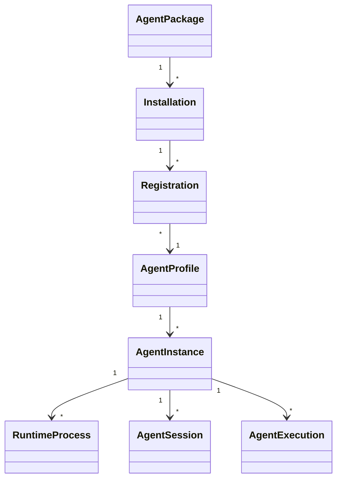
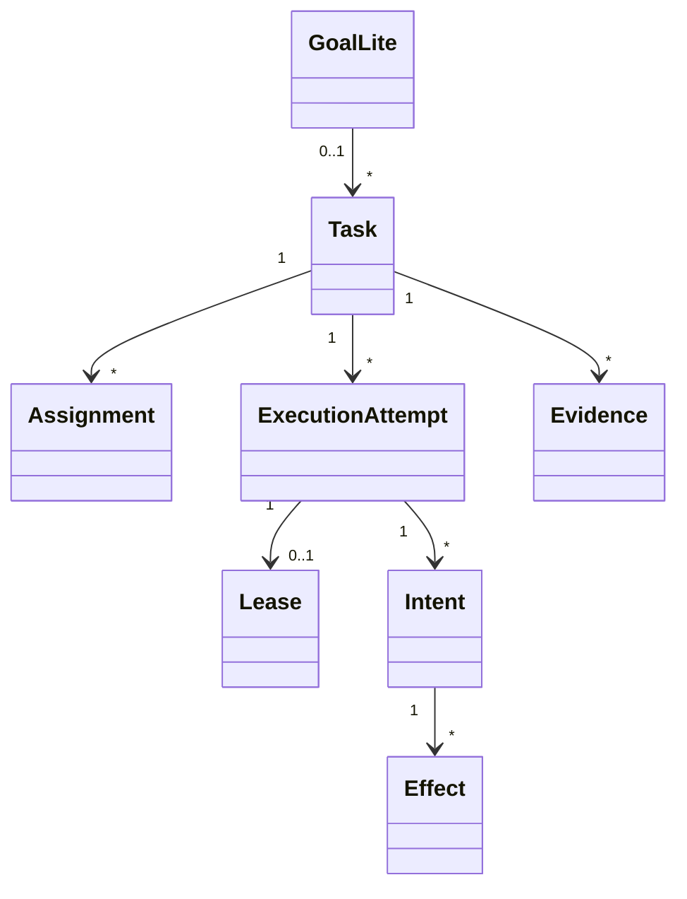

# CognitiveOS Personal / Enterprise 共享 Domain 与 Contract 边界

Date: 2026-08-25
Status: **candidate / owner-confirmed discovery / non-canonical / no implementation authorization**

本文件协调 [Personal 架构](05-personal-architecture.md)与
[Enterprise 架构](../../../enterprise/docs/design/08-enterprise-architecture.md)。所有 API/schema/ADR disposition 均为
Candidate；没有 Lane-CTR mutation 或 public contract 被接受。

## 1. Sharing principles

共享的是 authority semantics、protocol candidates、security invariants 与 semantic design
language；不自动共享 deployment、identity、tenancy、UI density 或 storage ownership。

| Category | Shared | Not automatically shared |
|---|---|---|
| Code | Task/Intent/Effect/Evidence/fencing/budget primitives | Enterprise central services、fleet、tenant index |
| Protocol | signed/versioned request、projection、reason/error、capability negotiation | private local shell IPC、vendor connector internals |
| Concepts | Agent distinctions、Provider taxonomy、Assignment vs lease、source/freshness | Personal single-owner shortcuts、Enterprise org graph |
| Design | restrained brand、semantic state/evidence layers | density、navigation scale、role views |
| Security | daemon writer、SecretStore、verification、A8 | enterprise key hierarchy/HA |

## 2. Domain disposition map

| Domain | Disposition | Notes |
|---|---|---|
| Task / TaskContract | KEEP | authority unit |
| Intent / Effect / Verification / Evidence | KEEP | non-negotiable |
| Scheduler lease/fence/hard Task budget | KEEP | execution ownership |
| Agent Package/Installation/Registration | KEEP/EXTEND | existing facts, richer projections |
| Agent Profile/Instance | NEW/EXTEND projection | do not collapse identities |
| Assignment | NEW | typed responsibility, daemon-written |
| ExecutionAttempt | NEW derived projection | persisted generic Run DEFER |
| Goal-lite | EXTEND | outcome/ref；no authority lifecycle initially |
| Workstream | DEFER | demand not validated |
| Provider AccessAccount/Binding | KEEP/EXTEND | separate commercial/access facts |
| Entitlement/Allowance/Usage/Cost | EXTEND | source/freshness/enforcement class |
| universal Subscription | REJECT | semantically false |
| Activity | EXTEND | authority/observation separation |
| Continuation Package | NEW | portable authorized continuation |
| KnowledgeSource registry / derived index | EXTEND Personal / NEW Enterprise | Personal local source registry；Enterprise tenant-managed index |
| Conversation archive / Continuation Checkpoint | NEW Personal projection | local canonical；not Task/Evidence |
| Memory / Skill / Tool | KEEP/EXTEND | separate authority domains；Library is navigation only |
| ContextView | KEEP/EXTEND | scoped assembly；not durable source body |
| Organization/Tenant/Sponsor/Fleet | NEW Enterprise | not Personal |
| policy engine lock-in | DEFER/REJECT now | stable decision contract first |
| central remote SQLite writer | REJECT | violates authority boundary |

## 3. Agent conceptual relationships



| Object | Authority/meaning |
|---|---|
| Package | code/manifest/publisher/version/provenance |
| Installation | environment install fact |
| Registration | daemon accepted identity/capability claim |
| Profile | purpose/capability/task-family projection |
| Instance | schedulable/deployed identity |
| Process | observation only |
| Session | adapter/provider continuation context |
| Execution | one controlled attempt relation |

Session 不等于 Task；Process exit 不等于 completion；Profile 不等于 personality；Instance 不
等于 external workload principal。

## 4. Provider Access relationships

```text
Provider
└─ AccessAccount
   ├─ AuthenticationMethod → SecretRef | NativeSessionRef
   ├─ Entitlement → Allowance*
   ├─ ModelCatalogSnapshot*
   ├─ Allocation* (Enterprise)
   ├─ UsageObservation*
   ├─ CostObservation*
   └─ InvoiceRef*

AgentBinding → Profile/Instance + AccessAccount + AuthRef + ModelRef
BudgetPolicy → Binding | Agent | Task | Allocation
```

`SecretRef` 永远不是 secret value。invoice authority 在 Provider/finance SoR。hard monetary
budget 需要 reservation/concurrency/retry proof；否则 label advisory。

## 5. Work and execution relationships



- Assignment：owner selected responsibility，versioned against Task epoch；
- Lease：current fenced execution ownership；
- Attempt：derived human-facing projection；
- Run：不作为当前 persisted generic domain；
- completion：daemon from independent verification + acceptance；
- Goal progress：accepted evidence/external SoR/human-approved metric。

## 6. Continuation Package boundary

Shared conceptual sections：

| Section | Required property |
|---|---|
| Task/objective/acceptance | exact epoch/digest |
| decisions/instructions | source + authority |
| transcript material | authorized excerpt/summary only |
| ContextView/source refs | purpose/version/ACL |
| artifacts | digest/provenance/classification |
| Effects/evidence | reconciled state + refs |
| binding/budget | non-secret、freshness、remaining bound |
| blocker/next action | durable、owner |

Not portable：hidden CoT、credentials、Provider-private state、unsupported native session internals、
unauthorized content。Personal 可 local-only package；Enterprise adds signature、tenant、
cross-node transfer、owner confirmation、sync。

## 7. Knowledge relationships

```text
External Knowledge SoR
→ KnowledgeSource enrollment
→ SourceVersion / ACLSnapshot / Classification
→ Authorized copied Object
→ Chunk / Embedding / Summary
→ RetrievalDecision
→ ContextView
→ Task use evidence
→ RevocationTombstone / PurgeReceipt
```

Personal Desktop 1.0 candidate exposes local KnowledgeSource enrollment and a derived/rebuildable
index path without inventing a universal KnowledgeBase authority。Enterprise managed index remains a
separate, not-activated governance design；source retains body/legal-hold SoR。authorization precedes
indexing/search/body exposure。

## 8. Authority and SoR matrix

| Fact | Personal authority | Enterprise authority/SoR |
|---|---|---|
| local Task/Intent/Effect | local daemon | node daemon |
| Assignment | local daemon candidate | node daemon with central request |
| lease/fence | local scheduler/store | node scheduler/store |
| human identity | owner-local session | external IdP + central refs + node validation |
| Sponsor/org | implicit owner | HRIS/registry refs + governance overlay |
| Agent registry | local daemon facts | external registry + CognitiveOS overlay |
| secret | approved local SecretStore | enterprise Secret Manager |
| policy | fixed built-in evaluator | versioned contract + pluggable engine |
| raw evidence | local node/CAS | node/source |
| central projection | absent/local UI | central minimized signed projection |
| Knowledge body | external source | source SoR + approved managed copied index |
| Provider invoice | external | Provider/finance |
| UI state | non-authority | non-authority |

## 9. Personal simplifications / Enterprise extensions

| Shared concept | Personal | Enterprise |
|---|---|---|
| realm | one implicit local | tenant/org/node |
| principal | owner | federated principal/delegation |
| sponsor | owner | distinct Sponsor |
| policy | built-in fixed | versioned/pluggable |
| approval | preview/admit | multi-role/SoD |
| Agent registry | local | federated overlay |
| Continuation | local/native supported | cross-tool/node signed package |
| evidence | local receipt | minimized central projection |
| Provider | owner account | org account/pool/allocation |
| Knowledge | local source registry + derived index candidate | opt-in tenant-managed central index |
| UI | native Personal | Desktop Fleet + Web fallback |

Enterprise extension 不能反向要求 Personal multitenancy、SCIM、central cloud 或 copied index。

## 10. Contract/API gap register

| Need | Current reality | Candidate boundary | Lane-CTR trigger |
|---|---|---|---|
| richer Agent projection | partial HTTP/runtime envelopes | private composition first | stable external consumer |
| Profile/Instance identity | partial/new projection | versioned read model | public semantic |
| Assignment | absent product relation | daemon CAS service | public mutation/SDK |
| Entitlement taxonomy | partial | source-typed projection | cross-client schema |
| Cost truth | partial | estimate/accrual/invoice/unavailable | public contract |
| capability negotiation | route/stub gaps | explicit catalog | shell/client compatibility |
| Continuation Package | absent | private prototype then contract | cross-tool interoperability |
| central node protocol | absent | signed request/projection | Enterprise deployment |
| policy decision | internal/future | versioned engine-neutral | Enterprise connector |
| Knowledge ingest/search/purge | absent | Enterprise private service | external connector/SDK |

No endpoint names、enum、transition are final。

## 11. Public/private criteria

Use private service/projection when：

- one product consumer；
- rapid iteration；
- no cross-process semantic promise；
- no external compatibility need。

Use Lane-CTR public contract when：

- two real consumers or external integration；
- authority mutation crosses process/repository；
- evidence/signature must interoperate；
- long-lived persisted/wire compatibility；
- conformance vectors/SDK required。

Contract change requires additive versioning、capability negotiation、deprecation、generated bindings、
failure-first negatives、A6 non-weakening。

## 12. Error/version/capability contract

Shared error candidate：

```text
code + scope + retryable + reason_codes
preserved_state + next_action
revision/version + details_ref
```

Version axes：

- contract version；
- object revision/Task epoch；
- policy version；
- capability catalog revision；
- source/ACL version；
- package version；
- node protocol version。

Capability negotiation must distinguish unsupported、not-backed、not-authorized、unavailable、
stale、version-mismatch。No HTTP 200 inference。

## 13. Security implications

| Boundary | Main risk | Required property |
|---|---|---|
| shell IPC | renderer escape | narrow allowlist、no secret/fs/exec |
| Assignment | responsibility grants authority | separate daemon validation/lease |
| Continuation | data/Effect replay leakage | typed allowlist、preview、digest、reconcile |
| central projection | sensitive replication | minimized/redacted/signed/tenant-scoped |
| Knowledge index | cross-tenant/stale ACL/injection | pre-auth、partition、purge、untrusted content |
| Provider | credential/invoice confusion | SecretRef、source taxonomy |
| policy plugin | semantic drift | engine-neutral contract/conformance |

## 14. Migration compatibility

- additive reader-first rollout；
- old client sees unknown field as unsupported/ignored without enabling action；
- node accepts only supported signed request versions；
- projection schema includes source/coverage/limitations；
- Continuation import validates package/contract/adapter compatibility；
- Knowledge reindex preserves source version and purge tombstone；
- no destructive migration without backup/rollback and exact-revision validation。

## 15. Candidate ADR disposition table

All rows are **Candidate**, not Accepted。

| Candidate | Owner direction | Future ADR question |
|---|---|---|
| native shell framework | compare ≥2 | Tauri-like vs Electron based on fixed spike |
| Profile/Instance | split | persisted domain or projection? |
| Assignment | explicit owner selection | private/public writer and CAS semantics |
| Run | projection first | when does durable Run earn existence? |
| Continuation Package | versioned portable package | schema/signature/import protocol |
| completion guarantee | qualified + terminal fallback | qualification/SLO/exclusion |
| Enterprise topology | central + node daemon | trust/sync/deployment |
| policy | pluggable contract | engine adapter lifecycle |
| Knowledge index | managed copied index | tenancy/auth/retention/purge architecture |
| Enterprise UI | Desktop primary + Web fallback | shared route/session implementation |
| Provider same release | separate acceptance | tracks/dependencies/capability gates |

## 16. Repository strategy

Current candidate：

- keep authority/contracts/runtime in current kernel repository；
- keep formal Web client in `cognitiveos-clients`；
- do not create new repo/monorepo during discovery；
- extract protocol/connector package only after stable contract + second consumer；
- Enterprise service repository only after independent deployment/release/security ownership is
  demonstrated。

Extraction triggers：independent scaling、release cadence、security team/license boundary、two real
consumers、stable public API、measured delivery blockage。

## 17. Baseline delta and non-claims

`clients/docs/design/01–41` remains dated baseline。Owner-confirmed deltas：native Personal shell、inventory
P0、Continuation Package、qualified guarantee、managed central index、Desktop Fleet + Web fallback、
Provider same-release track。This document changes no source, contract, ADR, schema or implementation。

## 18. Open-source boundary matrix

No upstream project replaces CognitiveOS authority。See
[open-source assessment](12-open-source-reuse-assessment.md) for exact versions/licenses。

| Candidate | Shared boundary type | May own | Must not own |
|---|---|---|---|
| Tauri | Personal packaging dependency | window/WebView/tray/update mechanics | Task/Provider/Memory/Context authority |
| ccusage | data importer | parser-local transient state | canonical usage、invoice、entitlement |
| OpenHands | Agent adapter | isolated runtime/workspace observations | Task state、Tool permission、completion |
| LiteLLM | Provider transport adapter | transient wire conversion | routing policy、Binding、secret、budget |
| RAGFlow | derived index adapter | rebuildable chunks/index | Knowledge source/ACL/policy SoR |
| Mem0 | Memory candidate adapter | extractor/search transient state | admitted Memory/version/tombstone |
| OpenLLMetry | telemetry adapter | redacted transient spans | Evidence、Task transition、content archive |
| MCP SDK | protocol implementation | framing/negotiation | Tool trust/permission/Effect |
| Paperclip/LangGraph | concept/reference | none | scheduler、Task、Run authority |

Authority non-replacement rule：

> Upstream output is candidate、observation、derived index row、imported archive or telemetry only.
> A daemon service validates/adopts/rejects it under existing policy; removing the upstream component
> cannot remove or rewrite CognitiveOS authority state.

## 19. Derived, rebuildable and import data classes

| Data class | Examples | Required properties |
|---|---|---|
| Authority | Task、Intent、Effect、Memory revision、Binding、Tool permission | daemon-only writer、CAS/fence、audit |
| Source of record reference | Knowledge source/version、invoice ref、external work link | source identity、version、ownership |
| Derived/rebuildable | RAG chunks/embedding/index、search cache、readiness projection | source digest、delete/rebuild、no authority |
| Imported archive | Conversation history、ccusage rows、external Agent export | provenance、schema/parser version、loss、inert content |
| Observation | Agent event、Provider usage、process health、telemetry | source/freshness/coverage、never self-completion |
| Presentation state | filters、selection、pane size、wizard checkpoint | non-secret、disposable、not authority |

Index/import adapters must tolerate deletion and full rebuild from approved source/authority facts。

## 20. Portability data classes

Continuation/export must label every item：

| Class | Portable? | Rule |
|---|---|---|
| Task objective/acceptance/ref | yes | exact epoch/digest and receiving compatibility |
| owner decision/instruction | yes | source/authority/timestamp |
| transcript | bounded | approved excerpt/summary + privacy/retention |
| ContextView/source ref | yes | scope/version/ACL/loss；body only if authorized |
| Memory | bounded | admitted version/provenance/tombstone state |
| Skill | by reference/package | exact revision/license/provenance |
| Tool | descriptor only | permission is re-evaluated at target |
| artifact/evidence | bounded | digest/classification/source |
| Binding/budget | metadata only | non-secret；target re-verifies |
| hidden CoT/secret/private session | no | explicit omission |
| unknown Effect | no replay | reconcile first |
| derived index/cache | no | rebuild at target |

## 21. License, trademark and provenance boundary

- OSS license does not grant Provider/model/data/trademark rights。
- File-level license wins over repository summary；`ee/`、`enterprise/`、generated、vendored and docs
  trees are reviewed separately。
- Source copy、binary dependency、container、data import and UI inspiration have different obligations。
- No logo/icon/screenshot/theme/preset/prompt/sample data is copied without explicit review。
- Every adopted artifact requires exact revision/digest、license/NOTICE、SBOM、provenance、
  vulnerability/secret scan、upgrade/rollback owner。
- Custom/source-available projects are not described as permissive merely because older strata were
  MIT/Apache。
- Imported Conversation/usage/Knowledge data retains source tool/version/digest and does not imply
  upstream license transfers content rights。

## 22. Candidate release boundary

These Personal additions describe **Personal Desktop 1.0 candidate** only。Accepted ADR-0036 and the
formal plan still reserve `1.0.0` for Linux。Enterprise remains discovery and is not activated by the
shared model。Future canonicalization must follow
[baseline delta](13-control-plane-baseline-to-personal-desktop-1.0-delta.md) and
[validation gates](10-validation-and-delivery-readiness.md).
