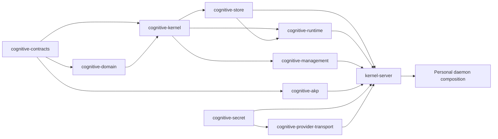
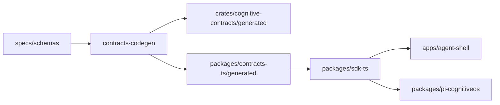
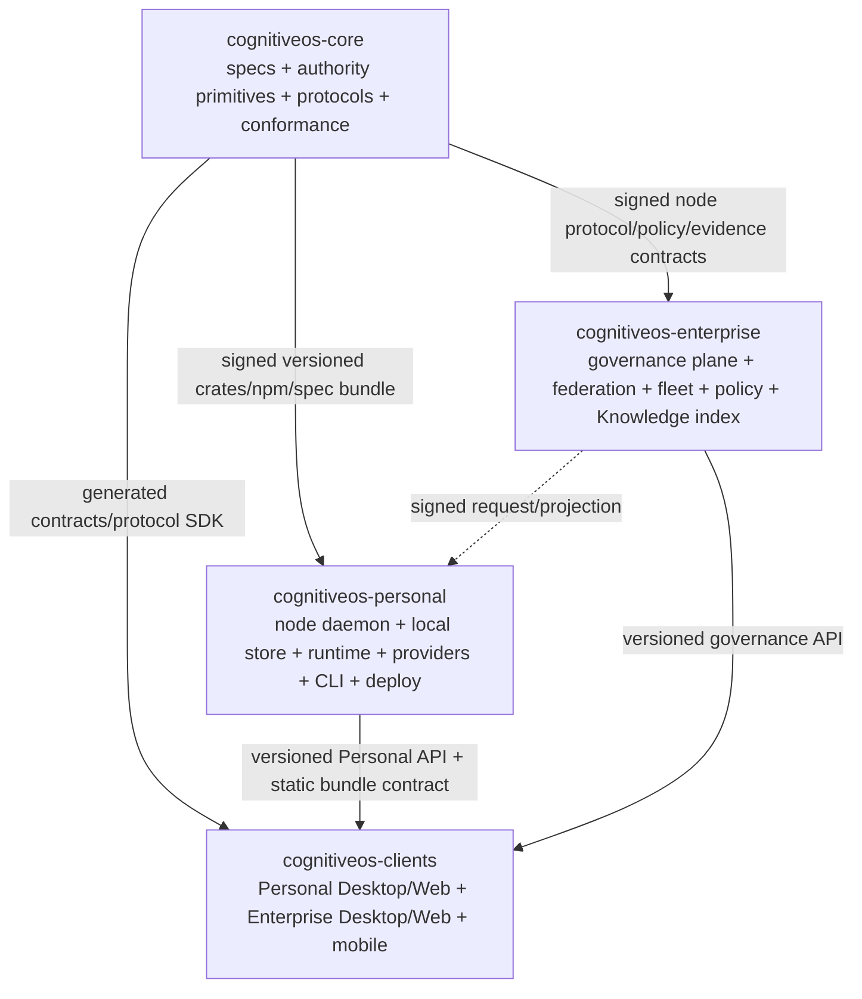

# CognitiveOS 项目仓库治理与拓扑建议

Date: 2026-08-25

Status: **candidate / owner-requested discovery / non-canonical / no repository migration authorization**

Change class: **structural discovery documentation**

本文件回答一个限定问题：是否应立即把当前 `cognitive-os` 仓库精简或改名为
`cognitiveos-core`，并立即建立 `cognitiveos-personal` 与
`cognitiveos-enterprise` 两个产品仓库。

本文件只提供研判和未执行 runbook。它没有移动代码、改名仓库、创建仓库、发布 package、
注册正式任务、接受 ADR、改变项目身份或授权 Enterprise 实现。

关联材料：

- [Research and development readiness](./01-research-and-development-readiness.md)
- [Personal architecture](./05-personal-architecture.md)
- [Enterprise architecture](./08-enterprise-architecture.md)
- [Shared domain and contract boundaries](./09-shared-domain-and-contract-boundaries.md)
- [Validation and delivery readiness](./10-validation-and-delivery-readiness.md)
- [Project identity](../governance/PROJECT-IDENTITY.md)
- [Personal formal plan](../plan/PERSONAL-DEVELOPMENT-PLAN.md)
- [Normative source and versioning](../standards/normative-source-and-versioning.md)
- [Docs-sync contract](../standards/docs-sync-contract.md)

## 1. Executive decision

### 1.1 Recommendation headline

**RECOMMENDATION：现在不要把当前仓库改名为 `cognitiveos-core`，也不要现在创建
`cognitiveos-personal` 和 `cognitiveos-enterprise` 实现仓库。**

当前应选择：

> **先在现有仓库内部建立可机器验证的 Core / Personal 依赖边界，稳定并发布可消费的
> contracts、SDK 和兼容性策略；只有客观拆分门槛满足后，再按保留历史的方式提取
> `cognitiveos-core`。**

如果未来达到拆分条件，推荐的目标不是立即三仓，而是：

```text
cognitiveos-core
  ↑ versioned contracts / protocols / SDK artifacts
  ├──────────────┬──────────────────┐
  │              │                  │
cognitiveos-personal   cognitiveos-enterprise   cognitiveos-clients
  │ node authority       central governance       Desktop/Web/mobile clients
  └────────────────────── clients consume product APIs ────────────────┘
```

即 **四仓候选拓扑**。现有 `cognitiveos-clients` 已经是实际独立仓库和发布边界，不应为了
凑成“三仓”而立即合并或归档。

### 1.2 Why not now

| Evidence | Meaning |
|---|---|
| **FACT**：当前 canonical project id 是 `cognitiveos-personal` | 当前仓库不是中性的 Core 仓库 |
| **FACT**：root npm 名为 `cognitiveos-personal-workspace` | 构建和产品身份已是 Personal |
| **FACT**：`kernel-server/src/personal/`、Personal CLI、installer、Provider、SecretStore、Pi/dsh adapter 均在本仓库 | 产品组合与通用 primitives 尚未物理解耦 |
| **FACT**：Rust workspace 和 npm packages 均为 `publish = false` / `private: true`、版本 `0.0.1` | 尚无可支持多仓消费的发布链 |
| **FACT**：Rust/TS schema bindings 由同一 generator 在同一 CI 中原子再生成 | 过早拆仓会破坏最强的防漂移门 |
| **FACT**：两个仓库均无 Git tags 或 GitHub Releases | 尚无稳定 release/version continuity |
| **FACT**：Enterprise 不是活动实现项目 | 建立 Enterprise 仓库会制造无实现依据的第二项目身份 |
| **FACT**：P7-T05/D13 正在活动开发并消费 `docs/design/14`、`39`；相关 worktree/lease 受保护 | 当前不是安全迁移窗口 |

### 1.3 What would reverse this recommendation

满足下列全部基础条件和至少一项业务触发后，可将建议改为“执行拆分”：

**基础条件**

1. Core package graph 通过机器门证明不依赖任何 Personal module、store layout、Provider、
   installer、CLI 或 product configuration。
2. contracts/spec bundle、Rust crates、TS contracts/SDK 已具备签名、SBOM、provenance、
   SemVer、兼容窗口和至少一次真实 consumer upgrade/rollback 证据。
3. Personal 可只通过发布 artifact 消费 Core，在临时隔离仓库中完整构建、测试和运行。
4. Cross-repo CI、consumer contract tests、release promotion 和 security patch 流程已演练。
5. 所有活动任务/PR/lease 收口，main clean，迁移 freeze 得到 owner 批准。

**业务触发，至少一项**

- Enterprise 获得正式实施授权、至少三个设计伙伴，并需要独立部署/安全 ownership；
- 至少两个真实独立消费者使用相同 Core public API；
- Core 与 Personal 已出现可量化的独立 release cadence；
- 当前单仓因 ownership、合规、许可证或构建规模造成持续交付阻塞；
- 需要对外发布稳定 Core SDK/contract，而 Personal 产品发布必须保持独立。

## 2. Scope, evidence and non-claims

### 2.1 Evidence sources

本研判读取：

- root Cargo/pnpm workspace、各 package manifest 和 dependency direction；
- `apps/`、`crates/`、`packages/`、`specs/`、`conformance/`、`tests/`、`tools/`、
  `deploy/`、CI、docs 和 handbook routing；
- accepted ADR-0001/0006/0007/0025/0034/0037/0043/0044/0045/0053；
- current project identity、Personal plan、Current snapshot 和 active leases；
- `D:\cognitiveos-clients` 的 tracked topology、Git state、manifests 和治理文档；
- 当前 Git/GitHub remote、branch、tag 和 release metadata。

未读取 `History/`，未读取 secret/artifact，未执行 build、test、migration 或服务。

### 2.2 Classification

本文使用：

- **FACT**：当前仓库、accepted decision 或 Git/GitHub 可直接证明；
- **INFERENCE**：由多个事实推导出的结构结论；
- **RECOMMENDATION**：建议采取的治理动作；
- **OPEN QUESTION**：拆分前必须由 owner 或真实 consumer 回答。

### 2.3 Current identity boundary

- **FACT**：`cognitiveos-personal` 是唯一活动实现项目。
- **FACT**：CognitiveOS architecture/contracts 是 Personal 的架构和合同基础，不是第二
  backlog。
- **FACT**：Enterprise 目前只有 candidate product/architecture design，不是活动实现项目。
- **FACT**：`docs/agent-work-system/` 全部文档是 non-canonical candidate。
- **RECOMMENDATION**：仓库拓扑不得先于项目身份、formal plan 和 implementation
  authorization 自行创造产品。

## 3. Current repository reality

### 3.1 Current repositories

| Repository | Current role | GitHub facts | Current delivery state |
|---|---|---|---|
| `agentkernel/cognitive-os` | Architecture/contracts + sole active Personal implementation | public；Apache-2.0；default `main` | active P7-T05 task branch；no tags/releases |
| `agentkernel/cognitiveos-clients` | independent client project/document root + actual Personal Web UI | public；GitHub 未识别 repo-level license；default `main` | actual `pc/web` implementation；no tags/releases；no repository CI workflow found |

**FACT**：`cognitiveos-clients` 已不只是“未来设想”。`pc/web` 有 React/TypeScript/Vite
implementation，独立 branch、PR 和 dirty worktree；ADR-0053 明确它是唯一正式 Web UI
implementation path。

### 3.2 Tracked shape of `cognitive-os`

Read-only `git ls-files` top-level counts show：

| Tree | Tracked files | Primary meaning |
|---|---:|---|
| `docs/` | 565 | architecture、Personal product/plan、ADR、evidence/governance |
| `crates/` | 277 | contracts/domain/kernel/store/runtime/management/conformance |
| `packages/` | 130 | TS contracts/SDK、Pi/dsh adapters |
| `apps/` | 122 | daemon、CLI、Agent Shell、Pi adapter |
| `handbook/` | 120 | generated/derived bilingual user/developer documentation |
| `specs/` | 94 | machine contracts and normative companions |
| `conformance/` | 90 | vectors and test definitions |
| `tools/` | 62 | codegen、consistency、Gate/report tooling |
| `tests/` | 13 | golden/e2e/fault/security assets |
| `deploy/` | 5 | Personal Linux/Windows installation surfaces |

**INFERENCE**：仓库重量不是主要问题；真正问题是同一 workspace 内“可复用 Core”和
“Personal composition”仍有源代码依赖交叉。按目录数量拆仓不会自动得到正确边界。

### 3.3 Rust workspace



Workspace members:

- likely reusable: `cognitive-contracts`、`cognitive-domain`、`cognitive-kernel`、
  `cognitive-akp`;
- mixed/reference adapters: `cognitive-store`、`cognitive-runtime`、
  `cognitive-management`、`cognitive-conformance`;
- Personal-specific: `cognitive-secret`、`cognitive-provider-transport`,
  `kernel-server`, `admin-cli`, `pi-agent-adapter`.

Important coupling:

- `cognitive-store` contains generic SQLite ports **and** `personal_db`、Provider control plane、
  Personal backup、installation/layout;
- `cognitive-runtime` contains generic execution **and** Personal installer、release manifest、
  Linux bundle/service、campaign and provider route behavior;
- `cognitive-management` is mostly reusable service logic but is consumed as part of Personal
  composition;
- `cognitive-conformance` directly depends on store、management、runtime and AKP to execute the
  reference implementation, so “conformance asset” and “Personal implementation harness” are not
  yet separate packages.

**RECOMMENDATION**：这些 mixed crates 必须先内部拆 module/package boundary，不能在当前
形态整体搬入所谓 Core。

### 3.4 TypeScript workspace



- **FACT**：所有 npm packages 版本为 `0.0.1`，均 `private: true`。
- **FACT**：`@cognitiveos/sdk-ts` 只依赖 workspace-local `contracts-ts`。
- **FACT**：schema→Rust/TS binding 由同一 Rust generator 生成并由 CI dirty-diff gate
  约束。
- **FACT**：外部 `pc/web` 当前并未声明依赖 `@cognitiveos/sdk-ts` 或
  `@cognitiveos/contracts-ts`；它直接消费多个 implementation-private HTTP routes，并自行
  normalise projections。

**INFERENCE**：当前 client split 已经暴露协议发布缺口。再拆 Core/Personal 会把一次
原子变更扩展为三个或四个 PR，而现有 artifact/version channel 尚不存在。

### 3.5 CI and release reality

Current kernel CI atomically runs：

- pnpm install/build/test；
- Cargo build/test/Clippy/fmt on Ubuntu and Windows；
- schema regeneration and Rust/TS diff；
- consistency/traceability/handbook gates；
- conformance runner and self-check；
- cross-language golden digest comparison。

Current release facts：

- Cargo workspace `publish = false`;
- npm root/private packages not publishable;
- crates/npm package versions are `0.0.1`;
- GitHub Releases are empty;
- Git tags are empty;
- clients repository has no tags/releases and no repository CI workflow found;
- Personal distribution is designed around GitHub Release bundles, not crates.io/npm publication.

**RECOMMENDATION**：在没有 package publication、provenance 和 consumer compatibility
matrix 前，Git repository 不应被当作 API versioning mechanism 拆分。

## 4. Coupling and atomic-change map

### 4.1 Change families that are currently atomic

| Change | Required same-revision assets today | Split risk |
|---|---|---|
| registered schema | `specs/` + Rust generated + TS generated + tests + conformance + docs | multi-repo generated drift |
| authority transition/error | standard + registry/schema/transition/vector + kernel + store + runner | consumer may observe semantic half-state |
| Task/Effect/Evidence path | contracts + kernel + store + runtime + daemon + verifier tests | incompatible daemon/core versions |
| Provider route | SecretStore + transport + store + daemon + CLI + handbook | Personal-specific; does not belong in Core |
| Personal install/release | runtime installer + deploy + CLI + release manifest + platform tests | product release boundary |
| Web UI feature | daemon private route + client projection/UX + paired validation | already cross-repo, currently manual paired PR |
| SDK contract | specs + generator + TS SDK + downstream client | needs published artifact and consumer gate |

### 4.2 Boundary violations against a hypothetical Core

| Current area | Why it crosses boundary | Required internal refactor |
|---|---|---|
| `cognitive-store` | generic authority store plus Personal DB/provider/backup/install facts | split core ports/reference store from Personal repositories |
| `cognitive-runtime` | generic execution plus Personal installer/release/campaign logic | isolate execution kernel from product runtime composition |
| `cognitive-management` | generic Task application semantics in Personal delivery package | freeze service ports and remove product wiring assumptions |
| `cognitive-conformance` | normative vectors and concrete Personal IUT adapters in one crate | separate portable suite from reference-IUT harness |
| `packages/sdk-ts` | protocol client plus Personal channel assumptions | separate protocol SDK from Personal application SDK |
| root docs/tools | architecture/spec governance and Personal task/Gate governance share checks | split canonical ownership without duplicate truth |

### 4.3 Existing cross-repo lesson

`cognitiveos-clients` provides useful evidence:

- positive: independent UI ownership and release surface are real;
- negative: no shared published SDK dependency, no repository CI, direct private-route consumption,
  paired kernel/client PRs, and status drift risk.

**INFERENCE**：现有 client split 应先被“做完整”，而不是作为继续拆仓的充分理由。

## 5. What `cognitiveos-core` should mean

### 5.1 Core definition

`cognitiveos-core` should be：

> A product-neutral, versioned authority and interoperability substrate that
> defines machine/behavior contracts, deterministic authority primitives,
> protocol boundaries and portable conformance assets without owning Personal
> or Enterprise product composition.

### 5.2 Candidate Core contents

| Asset | Core disposition | Qualification |
|---|---|---|
| `specs/registry`、schemas、transitions、normative companions | INCLUDE | canonical contract source |
| applicable `docs/standards/` | INCLUDE | behavior/versioning authority |
| `cognitive-contracts` | INCLUDE | generated bindings/canonical digest |
| `cognitive-domain` | INCLUDE | pure state machines/invariants |
| `cognitive-kernel` | INCLUDE after audit | deterministic ports/authority primitives only |
| `cognitive-akp` | INCLUDE | product-neutral adapter/protocol boundary |
| TS generated contracts | INCLUDE or published artifact | generated atomically with specs |
| protocol-only SDK | INCLUDE after split | must not contain Personal session/product assumptions |
| conformance vectors/suite manifest | INCLUDE | portable normative tests |
| conformance runner core | INCLUDE after split | concrete Personal IUT adapter stays Personal |
| reference store adapter | OPTIONAL | only after removing Personal tables/config |
| architecture whitepaper/RFC | INCLUDE informative | no product current status |
| codegen/spec consistency tooling | INCLUDE | required to publish coherent Core release |

### 5.3 Assets that are not Core

| Asset | Target |
|---|---|
| `kernel-server/src/personal` composition | Personal |
| Personal SQLite DB/layout/migrations/backups | Personal |
| SecretStore backend and Provider transport/control plane | Personal, with shared ports in Core if proven |
| Personal scheduler/executor wiring | Personal using Core primitives |
| admin/product CLI and `cognitive daemon` | Personal |
| Linux/Windows installer/service definitions | Personal |
| Pi/dsh concrete adapters and acquisition | Personal |
| Personal task plan、Gate、support matrix、PROGRESS | Personal |
| Personal product/architecture docs and handbook | Personal |
| Web/Desktop/mobile UI | Clients |
| Enterprise IAM/HRIS/fleet/policy distribution/Knowledge index | Enterprise |

### 5.4 Special cases

#### Store

SQLite is not automatically “non-Core”. A product-neutral reference adapter may live in Core if it
implements only Core ports and schemas. The current `cognitive-store` cannot be called that because
it also owns Personal-specific layout, Provider, installation and backup behavior.

#### Daemon

The daemon-only writer **semantic** belongs to Core. A concrete Personal daemon binary, HTTP routes,
bootstrap, local session, provider binding and installation lifecycle do not.

#### Scheduler

Lease、fence、budget and dispatch authority primitives can be Core. Personal eligibility policy,
Agent choice, local process composition and product readiness remain Personal.

#### SecretRef

Opaque `SecretRef` and port semantics can be Core. Secret Service/Windows credential backend,
Provider key handling and product recovery UX remain Personal.

#### Conformance

Normative vectors and portable runner semantics belong to Core. Tests that instantiate Personal
SQLite/runtime/management are reference implementation integration tests and must move with Personal
or become a separate adapter package.

## 6. Options assessment

Scoring: 5 = favorable, 1 = unfavorable for current evidence.

| Option | Speed | Atomic safety | Ownership clarity | Release cost | Reversibility | Current fit |
|---|---:|---:|---:|---:|---:|---:|
| A. Keep topology/name unchanged indefinitely | 5 | 5 | 2 | 5 | 4 | 3 |
| B. Internal modularization first, no split now | 4 | 5 | 4 | 4 | 5 | **5** |
| C. Rename current to Core and create Personal/Enterprise now | 1 | 1 | 2 | 1 | 2 | **1** |
| D. Extract stable Core later; current repo becomes/remains Personal | 4 | 4 | 5 | 3 | 4 | **5 future** |
| E. Future three repos with published contracts/SDK | 3 | 4 | 4 | 2 | 3 | 3 future |
| F. Future four repos retaining clients | 3 | 4 | 5 | 2 | 3 | **4 future** |

### 6.1 Option A — Keep current topology and name

Benefits：

- keeps schema/codegen/conformance atomic;
- lowest CI and release overhead;
- preserves issue/PR/history continuity;
- no package registry dependency.

Costs：

- current repo name and product identity remain ambiguous;
- CODEOWNERS and security boundaries are directory-level only;
- Enterprise work would eventually crowd Personal governance;
- public Core consumption remains difficult.

Disposition：**acceptable temporarily, insufficient as long-term strategy**.

### 6.2 Option B — Internal modularization first

Benefits：

- tests proposed boundaries before irreversible history/repository operations;
- preserves current CI gates;
- produces measurable coupling data;
- supports later extraction by path/package;
- does not create Enterprise before it is active.

Costs：

- one repository continues carrying multiple conceptual layers;
- requires disciplined module ownership and dependency checks;
- package publication work must still be done.

Disposition：**recommended now**.

### 6.3 Option C — Rename current to Core now; create product repos now

Why rejected：

1. Current repo canonical identity and most active work are Personal.
2. Current daemon/store/runtime are not product-neutral.
3. No publishable Core artifact exists.
4. No Enterprise implementation/project authority exists.
5. Schema/codegen/conformance atomicity would be broken immediately.
6. Existing active PRs/issues would remain in a repo newly labeled Core although they describe
   Personal delivery.
7. It creates three sources of product truth before field ownership is frozen.

Disposition：**REJECT now**.

### 6.4 Option D — Extract Core later; current repo becomes Personal

This is the preferred split path because：

- current GitHub issue/PR history is primarily Personal delivery history;
- canonical project identity already says Personal;
- current apps/deploy/docs/plan are Personal;
- GitHub repository rename/transfer can preserve issues/PRs/redirects better than filtered export.

Candidate sequence：

1. internally isolate Core paths;
2. create history-preserving `cognitiveos-core` extraction;
3. keep current repository intact during compatibility period;
4. rename current `cognitive-os` remote to `cognitiveos-personal` only after owner-approved cutover;
5. update Core dependency to signed published releases;
6. retain redirects/stubs and commit mapping.

Disposition：**preferred future migration path**.

### 6.5 Option E — Three-repository topology

Possible shape：

```text
cognitiveos-core
cognitiveos-personal   # includes Personal clients
cognitiveos-enterprise # includes Enterprise clients
```

Problem：it requires merging or splitting `cognitiveos-clients`, which currently contains PC Web,
mobile/shared and Agent Hub assets with its own governance/history. That additional migration provides
no immediate authority benefit.

Disposition：**possible only if client ownership is intentionally collapsed later**.

### 6.6 Option F — Four-repository topology

```text
cognitiveos-core
cognitiveos-personal
cognitiveos-enterprise
cognitiveos-clients
```

Benefits：

- aligns protocol, node product, central governance product and UX release boundaries;
- preserves existing client history;
- supports independent security ownership;
- clients can consume Personal and Enterprise APIs without becoming authority.

Costs：

- highest CI/release coordination overhead;
- requires mature package publication and compatibility automation;
- documentation/issue triage must route across four projects.

Disposition：**preferred eventual target if split triggers are met**.

## 7. Recommendation now

### 7.1 Decision

Adopt **Option B now**, shape toward **Option D + F later**.

```text
Now:
  cognitive-os (single repo)
    ├─ internally isolated core packages
    ├─ Personal reference/product composition
    └─ atomic specs/codegen/conformance CI

  cognitiveos-clients
    └─ independent client boundary, hardened with published SDK + CI

Later, only after gates:
  cognitiveos-core
  cognitiveos-personal   # continuity successor of current repository
  cognitiveos-enterprise
  cognitiveos-clients
```

### 7.2 Rename recommendation

- **Do not rename the current repository to `cognitiveos-core` now.**
- Keep GitHub remote `cognitive-os` during modularization.
- If future split happens, the current repository is a better continuity base for
  `cognitiveos-personal`.
- Create `cognitiveos-core` from isolated, filtered, mapped history.
- Create `cognitiveos-enterprise` only when Enterprise implementation entry criteria pass.

### 7.3 Naming convention

Candidate consistent names：

| Layer | Repository | Artifact namespace |
|---|---|---|
| Core | `cognitiveos-core` | `cognitiveos.*`, Rust `cognitive-*`, npm `@cognitiveos/*` |
| Personal | `cognitiveos-personal` | product id `cognitiveos-personal` |
| Enterprise | `cognitiveos-enterprise` | product id `cognitiveos-enterprise` |
| Clients | `cognitiveos-clients` | client-specific packages/apps |

Repository name is not artifact identity. Wire identity must remain exact and versioned independent of
GitHub rename.

## 8. Target dependency and authority model

### 8.1 Dependency graph



Dependency prohibitions：

- Core must not depend on Personal、Enterprise or Clients.
- Personal must not import Enterprise service implementation.
- Enterprise must never import or directly mutate Personal store implementation.
- Clients never own authority transitions.
- Enterprise central services send requests; node daemon reauthorizes and remains sole local writer.

### 8.2 System-of-record matrix

| Fact | Core | Personal | Enterprise | Clients |
|---|---|---|---|---|
| machine/behavior contract | SoR | consume | consume | consume |
| Task/Intent/Effect local authority | semantics/ports | **writer/SoR** | projection/request only | read/request |
| local lease/fence/budget | semantics | **writer/SoR** | bounded policy/request | display |
| Personal Provider binding | taxonomy/ports where stable | **SoR** | allocation projection if integrated | request/display |
| secret value | SecretRef semantics | approved SecretStore | external Secret Manager | never |
| Enterprise org/sponsor/policy | protocol candidates | validate signed subset | **SoR/overlay** | display/request |
| raw local evidence/artifact | envelope/digest rules | **node/source SoR** | minimized refs/projections | read permitted projection |
| UI state | none | non-authority | non-authority | local presentation |
| conformance claim | suite semantics | IUT evidence | IUT evidence | client evidence only |

## 9. Existing `cognitiveos-clients` disposition

### 9.1 Recommendation

**RECOMMENDATION：保留 `cognitiveos-clients`，不合并、不归档、不改名。**

Reasons：

1. it is an actual repository and active Personal Web implementation boundary;
2. ADR-0053 already makes `pc/web` the sole formal SPA path;
3. it contains PC、mobile、shared、Agent Hub governance/history, not just one Personal component;
4. merging it into Personal would mix client release cadence with daemon authority again;
5. the immediate problem is missing SDK/CI/release integration, not repository existence.

### 9.2 Required hardening

Before any further split：

- add required CI for build/test/a11y/links/license checks;
- establish repo-level LICENSE/NOTICE consistency;
- consume published `@cognitiveos/contracts` / SDK instead of duplicating route semantics;
- publish a client compatibility matrix against Personal/Enterprise API versions;
- require paired consumer tests in Core/Personal release promotion;
- define ownership for Personal and Enterprise client surfaces;
- separate current dated client plans from active implementation status.

### 9.3 Future alternatives

| Alternative | Trigger | Recommendation |
|---|---|---|
| Keep one shared clients repo | cross-product design system/SDK remains useful | preferred |
| Split Personal and Enterprise clients | independent teams/security/release cadence prove need | later candidate |
| Merge Personal UI into Personal repo | clients repo narrows to only Personal and cross-repo overhead is measured harmful | not now |
| Archive clients repo | all real implementations migrated with history and no remaining consumer | no evidence |

## 10. Objective split gates

### 10.1 Core purity gate

Pass only when：

- no Core package references `personal`, product service names, Personal DB paths, Provider accounts,
  installer, user service or UI route;
- dependency graph is acyclic and enforced in CI;
- public ports do not expose SQLite/HTTP/provider-specific types;
- reference adapters are separate packages;
- Core can build/test from an isolated source export.

### 10.2 Public API stability gate

- complete artifact inventory and owner;
- SemVer and compatibility windows documented;
- generated Rust/TS outputs produced from the same signed spec set;
- all breaking changes produce migration guide and conformance changes;
- no `workspace:*`, path dependency or mutable branch reference crosses repositories;
- at least two consumer releases complete upgrade and rollback.

### 10.3 Release infrastructure gate

- signed tags/releases;
- crates/npm/OCI or equivalent immutable artifact channel selected;
- SBOM、SLSA-compatible provenance、checksums、attestation;
- OIDC-based publishing with protected environments;
- reproducible source/artifact mapping;
- security advisory and backport policy.

### 10.4 Consumer gate

- Personal consumes Core release without source checkout;
- client consumes SDK artifact without hand-copied DTOs;
- cross-repo canary tests validate current and N-1 compatibility;
- consumer failure blocks Core promotion before stable release.

### 10.5 Enterprise gate

- Enterprise is formally activated by owner;
- at least three target organizations validate architecture/JTBD;
- independent deployment、security ownership、SLO and budget exist;
- node protocol and policy/evidence contract are stable enough for external consumer use;
- central service never requires remote node DB write.

### 10.6 Migration safety gate

- no active task/lease/PR;
- both repositories clean and at known exact revisions;
- freeze window and responsible owners assigned;
- mirror backups verified;
- staging organization rehearsal passed;
- commit/tag/issue/PR mapping reviewed;
- rollback can restore old remotes and release flow.

## 11. Internal modularization before split

### Phase 0 — Freeze the boundary inventory

Deliverables：

- Candidate ADR defining Core and product boundaries;
- package ownership matrix and CODEOWNERS proposal;
- machine-generated dependency graph;
- public/private API inventory;
- data/SoR and docs canonical ownership map;
- baseline build/test/release timing.

Exit：every tracked path has one proposed repository disposition and owner.

### Phase 1 — Enforce dependency direction

Candidate package groups：

```text
core-contracts
core-domain
core-authority
core-protocol-akp
core-conformance-suite

reference-store-adapter
personal-store
personal-runtime
personal-management
personal-daemon
personal-provider
personal-adapters
```

Actions：

- split mixed Rust modules without changing semantics;
- prohibit reverse imports by CI;
- move product constants/config from Core candidates;
- ensure errors/contracts cross the boundary instead of implementation structs;
- retain one repository and one atomic CI.

Exit：Core candidate packages build/test with Personal packages excluded.

### Phase 2 — Separate conformance and codegen products

- produce immutable specification-set bundle;
- split portable conformance suite from Personal IUT adapter;
- generate Rust/TS bindings from one source release;
- package golden fixtures and digests;
- prove byte-identical regeneration in isolated workspaces.

Exit：a consumer can verify Core compatibility without cloning Personal source.

### Phase 3 — Stabilize Personal composition

- Personal store implements Core ports;
- daemon/API use explicit versioned contracts;
- provider/installer/CLI/adapters have no Core reverse dependency;
- Personal release manifest pins exact Core artifacts;
- Personal tests exercise both current and N-1 Core compatibility.

### Phase 4 — Complete client boundary

- client CI becomes required;
- shared published SDK replaces hand-coded stable DTOs;
- private Personal endpoints remain explicitly private and version-bound;
- paired API contract tests run before Personal and client promotion;
- client bundle compatibility is included in daemon release manifest.

### Phase 5 — Rehearse extraction

- export Core candidate into a disposable private/staging repository;
- preserve commit mapping;
- build, test, publish prerelease artifacts;
- consume from disposable Personal/clients clones;
- simulate breaking change, security patch and rollback;
- delete staging outputs after evidence retention.

Only after Phase 5 passes should physical split be proposed for owner GO.

## 12. Versioning and compatibility strategy

### 12.1 Version axes

Do not force one version number across all products.

| Axis | Candidate format | Owner |
|---|---|---|
| specification set | SemVer + digest | Core |
| Rust Core crates | aligned Core SemVer | Core |
| TS contracts/protocol SDK | aligned Core SemVer | Core |
| node protocol | independent protocol SemVer | Core |
| Personal product | product SemVer | Personal |
| Enterprise product | product SemVer | Enterprise |
| client application | product-specific app SemVer | Clients |
| policy bundle | ID + SemVer + digest + expiry | Enterprise |

### 12.2 Compatibility matrix

Each consumer release must publish：

```text
consumer_version
supported_core_spec_sets[]
supported_core_crate/sdk_range
supported_node_protocol_range
required_critical_extensions[]
known_degradations[]
minimum_security_patch
```

Rules：

- exact spec-set digest is always retained;
- unknown major and unknown critical extension fail closed;
- `latest` is forbidden;
- Personal stable supports at least current and N-1 Core minor only if security semantics are equal;
- emergency security revocation may shorten the window with explicit advisory;
- no product release uses unreleased Git branch refs.

### 12.3 Release train

```text
Core candidate
→ generated artifacts + conformance
→ Personal/Enterprise consumer canary
→ client compatibility canary
→ Core stable
→ product release candidates
→ client release
```

Core stable must not be promoted merely because Core unit tests pass.

## 13. Ownership, security and release governance

### 13.1 CODEOWNERS candidates

| Area | Required owners |
|---|---|
| specs/standards/contracts/conformance | Core contract + security |
| authority/kernel/crypto/digest | Core kernel + security |
| Personal daemon/store/provider/secret | Personal runtime + security |
| Enterprise identity/policy/Knowledge/fleet | Enterprise platform + security/data governance |
| clients | client platform + product security |
| release/workflows/publishing | release engineering + security |

High-risk changes require two-person review and one security owner：

- authority transitions;
- canonical digest/version negotiation;
- SecretRef/credential flow;
- signature/provenance;
- policy/approval;
- cross-node protocol;
- Knowledge tenant/ACL/purge.

### 13.2 Branch protection

Every future repo：

- protected `main`;
- required signed/verified CI status;
- no force push;
- CODEOWNERS review;
- required security/supply-chain checks;
- linear or merge-commit policy documented consistently;
- protected release tags/environment;
- least-privilege GitHub App/OIDC publishing;
- dependency review and secret scanning.

### 13.3 Release cadence

- Core：stability/security-oriented, not tied to every Personal feature;
- Personal：node product cadence, pins Core;
- Enterprise：central service cadence, compatible with node windows;
- Clients：UI cadence, capability-negotiated against APIs.

Independent cadence must be demonstrated, not assumed. If every Core change still requires immediate
Personal/client commits, the split has not earned existence.

## 14. Non-executed migration runbook

This section is operator guidance only. Commands are examples and were **not executed**.

### 14.1 Confirmation boundary

Before any destructive or history-rewriting command：

1. owner approves final topology and ADR;
2. all work freezes;
3. mirror backups exist in two independent locations;
4. exact refs/tags/branches/issues/PRs/releases are inventoried;
5. staging rehearsal passes;
6. old repositories remain undeleted and read-only during rollback window.

### 14.2 Backup examples

```powershell
# EXAMPLE ONLY — run from a reviewed temporary directory after owner approval.
git clone --mirror https://github.com/agentkernel/cognitive-os.git cognitive-os-backup.git
git -C cognitive-os-backup.git fsck --full
git -C cognitive-os-backup.git bundle create ..\cognitive-os-all-refs.bundle --all
```

Verify backup digest and restoration in a disposable location. A bundle that has not been restored is
not a proven backup.

### 14.3 Core history extraction options

#### `git filter-repo`

Best for Core because Core paths span multiple directories and mixed files need callbacks/path maps.

```powershell
# EXAMPLE ONLY — use a fresh mirror clone, never the live worktree.
git clone --mirror https://github.com/agentkernel/cognitive-os.git core-extract.git
git -C core-extract.git filter-repo `
  --path specs `
  --path conformance `
  --path crates/cognitive-contracts `
  --path crates/cognitive-domain `
  --path crates/cognitive-kernel `
  --path crates/cognitive-akp
```

Cautions：

- rewrites commit IDs;
- invalidates commit/tag signatures;
- does not transfer GitHub issues、PR discussions、Actions、secrets or protections;
- path-only filtering is insufficient for mixed crates;
- must retain old→new commit map and source remote attestation;
- should strip unrelated secrets/blobs only through separately reviewed policy.

#### `git subtree split`

Useful only when the source is a clean prefix.

```powershell
# EXAMPLE ONLY.
git subtree split --prefix=some-clean-prefix -b extraction-preview
```

Current Core spans many prefixes, so subtree alone is not adequate unless internal modularization first
consolidates paths.

#### Repository rename/transfer

Use for current repo → future Personal because GitHub preserves repository metadata and redirects more
effectively than creating Personal from a filtered copy. Before relying on redirects, audit package
URLs, Actions permissions, apps, webhooks and external mirrors.

### 14.4 Recommended migration waves

#### Wave M0 — Decision and freeze

- accepted structural ADR;
- final path map and owner map;
- migration issue board;
- freeze exact revision;
- all worktrees clean;
- backups verified.

#### Wave M1 — Create Core staging repository

- filtered history import;
- root manifests/workflows/license/NOTICE rebuilt;
- canonical source links fixed;
- commit mapping published;
- no public release.

#### Wave M2 — Publish Core prerelease

- spec bundle;
- Rust crates;
- TS contracts/SDK;
- conformance suite;
- SBOM/provenance/signatures;
- immutable prerelease versions.

#### Wave M3 — Convert current repo to artifact consumer

- remove path/workspace dependencies crossing the boundary;
- pin prerelease artifacts/digests;
- run full Personal CI and exact-revision validation;
- preserve temporary compatibility adapters.

#### Wave M4 — Client conversion

- replace duplicated stable shapes with published SDK;
- add required client CI;
- run paired daemon/client suites;
- retain private endpoint compatibility matrix.

#### Wave M5 — Rename current repo to Personal

- only after all Personal builds no longer need Core source paths;
- preserve GitHub issues/PRs/history;
- update remotes and stubs;
- keep old URL redirect and migration notice.

#### Wave M6 — Enterprise repository

- only after formal Enterprise entry gate;
- bootstrap from published Core artifacts, not copied Personal code;
- implement central services as requests/projections, never node DB writer.

#### Wave M7 — Stable cutover

- Core stable release;
- Personal/client stable compatible releases;
- freeze old compatibility branch;
- enter supported N/N-1 window;
- monitor and retain rollback capability.

## 15. File-family mapping

Candidate mapping after internal refactor：

| Current family | Future Core | Future Personal | Future Enterprise | Clients |
|---|---|---|---|---|
| `specs/` | yes | consume | consume | generated consume |
| `docs/standards/` | applicable contract standards | Personal governance separate | Enterprise governance separate | consume |
| `crates/cognitive-contracts` | yes | dependency | dependency | via SDK |
| `crates/cognitive-domain` | yes | dependency | dependency only if public | no |
| `crates/cognitive-kernel` | pure modules | dependency | no direct node implementation | no |
| `crates/cognitive-akp` | yes | adapter protocol | protocol consume | SDK consume |
| `crates/cognitive-store` | split reference-only part | Personal store majority | no | no |
| `crates/cognitive-runtime` | split primitive part | Personal majority | no | no |
| `crates/cognitive-management` | shared ports/service candidates | composition | protocol consume | SDK |
| `crates/cognitive-conformance` | portable runner core | Personal IUT adapter | Enterprise IUT adapter | client suite |
| `crates/cognitive-secret` | port only if separated | implementation | connector refs | never secret |
| Provider transport/control | stable port only | implementation | central allocation connector | UI |
| `apps/kernel-server` | no | yes | no | static bundle consumer |
| `apps/admin-cli` | no | yes | possible separate enterprise CLI | no |
| Pi/dsh packages/apps | no | yes | no | shell UI only where relevant |
| `deploy/` | no | yes | own deploy later | app packaging |
| Personal docs/plan/handbook | no | yes | no | links/derived client docs |
| Enterprise candidate docs | protocol refs only | no | promote only after authorization | UI specs |
| `tools/` | split by owner | Personal tools | Enterprise tools | client tools |

No physical move should occur until mixed-file ownership is resolved.

## 16. GitHub and governance migration checklist

### 16.1 Issues and PRs

- classify each open issue/PR as Core、Personal、Enterprise、Clients or cross-repo;
- keep Personal history with current repository;
- for filtered Core history, create pointer issues rather than pretending PR discussions transferred;
- preserve original issue/PR URLs in migration records;
- close or transfer only with owner confirmation;
- do not mass duplicate open issues without canonical owner.

### 16.2 Branches, tags and releases

- inventory all refs including protected/environment refs;
- define new tag namespaces and artifact coordinates;
- map old commit to extracted Core commit;
- recreate signed tags after verifying extracted content;
- never reuse an old tag for different bytes;
- current no-tag/no-release state must be replaced by an explicit baseline before cutover.

### 16.3 Actions, apps and secrets

- recreate GitHub Actions with pinned actions and least privilege;
- use OIDC trusted publishing, not long-lived publish tokens;
- recreate environments, approvals and branch protections;
- reconfigure GitHub Apps, webhooks, Dependabot and code scanning;
- secrets are manually re-established through approved stores; never copied through Git history or
  migration logs;
- verify cloud agent repository grants for every target repo.

### 16.4 Documentation

- one canonical source per fact;
- old paths become deprecated pointer stubs during support window;
- update README、AGENTS、project identity、formal plans、ADR indexes、handbook source maps and links;
- separate Core normative docs from Personal current status;
- Enterprise docs stay candidate until project activation;
- avoid cross-repo copies of standards; publish versioned bundles/links.

### 16.5 Packages and releases

- package names and license metadata reviewed;
- NOTICE/third-party inventories split by shipped artifact;
- changelog/security advisory channels created;
- SBOM and provenance refer to exact source repo/revision;
- consumer lockfiles pin immutable versions/digests;
- publish rollback/yank policy;
- vulnerability fixes define coordinated release order.

## 17. Validation and acceptance

### 17.1 Boundary tests

- Core isolated build has zero Personal dependencies;
- dependency graph rejects reverse imports;
- Core public API contains no SQLite、HTTP server、Provider or Personal config type;
- Personal builds only from published Core artifacts;
- Enterprise prototype cannot write node store;
- Clients compile against published SDK.

### 17.2 Contract tests

- schema bundle digest parity;
- Rust/TS generated binding parity;
- canonical JSON/digest golden equality;
- transition/error/vector coverage;
- unknown version/critical extension fail closed;
- N/N-1 consumer compatibility;
- no client infers capability from HTTP 200/stub.

### 17.3 Product integration

- Personal full Task/Intent/Effect/verifier path;
- SecretStore/Provider boundaries;
- installer/update/rollback;
- daemon-served client bundle;
- Enterprise signed request/node reauthorization;
- evidence projection minimization;
- partition/revocation/Knowledge purge where applicable.

### 17.4 Supply chain

- reproducible source→artifact mapping;
- SBOM and provenance verification;
- signed release/tags;
- dependency lock integrity;
- malicious package/substitution negative;
- compromised publisher/OIDC denial path.

### 17.5 Migration acceptance

Pass only when：

- all canonical links resolve;
- no duplicate authority source;
- all old→new commit/path mappings recorded;
- issues/PRs have one owner;
- current and N-1 compatibility pass;
- exact rollback rehearsal restores prior release flow;
- no secret/credential appears in migration artifacts;
- old repository remains recoverable during support window.

No local fixture or static check alone proves cutover ready.

## 18. Rollback strategy

### 18.1 Principles

- never delete or archive the original repository at cutover;
- treat cutover as reversible routing change, not immediate destruction;
- avoid dual authority writes;
- compatibility adapters are read/translate boundaries, not second stores;
- maintain old artifact channel until new consumer evidence passes.

### 18.2 Rollback triggers

- contract digest mismatch;
- consumer build/upgrade failure;
- release signing/provenance failure;
- missing issue/PR/history mapping;
- branch protection or permission regression;
- Personal authority behavior changes;
- client cannot negotiate supported version;
- secret or sensitive blob exposure.

### 18.3 Rollback actions

1. stop new releases in target repositories;
2. restore consumers to last pinned monorepo/core artifact;
3. restore original remote/default branch routing;
4. leave extracted repositories read-only for diagnosis;
5. verify Personal authority/store compatibility;
6. publish incident and commit mapping;
7. retry only after a new reviewed migration plan.

Database rollback is a separate product migration problem and must never be inferred from Git rollback.

## 19. Risks and open questions

| Item | Type | Required decision/evidence |
|---|---|---|
| Core public API surface | OPEN QUESTION | Which ports have two real consumers? |
| Package publication | OPEN QUESTION | crates/npm/OCI/private registry and ownership |
| Version alignment | OPEN QUESTION | unified Core versions vs independent crate versions |
| Current repo rename | RECOMMENDATION | future Personal continuity base |
| clients license | FACT gap | repo-level license/NOTICE review |
| client CI | FACT gap | no workflow found; establish required checks |
| Enterprise timing | OPEN QUESTION | formal authorization/design partners |
| security ownership | OPEN QUESTION | distinct teams or current owner remains shared |
| mixed store/runtime crates | FACT | modularize before extraction |
| issue/PR migration | OPEN QUESTION | owner policy for cross-cutting history |
| public consumers | FACT absent | all packages private and unpublished |
| performance benefit | UNKNOWN | no evidence that repo split improves build/delivery |

## 20. Actions that must not be taken now

1. Do not rename `cognitive-os` to `cognitiveos-core`.
2. Do not create empty Personal/Enterprise repositories as implied active products.
3. Do not copy source into multiple repos while retaining multiple canonical writers.
4. Do not split `specs` from generated Rust/TS bindings before artifact/codegen gates exist.
5. Do not publish `0.0.1` workspace packages as stable APIs.
6. Do not use Git submodules or mutable branch dependencies as a substitute for package releases.
7. Do not move Provider、SecretStore、installer、Personal CLI or concrete adapters into Core.
8. Do not move the whole current `cognitive-store` or `cognitive-runtime` into Core without internal
   separation.
9. Do not merge/archive `cognitiveos-clients` merely to reach a three-repo diagram.
10. Do not create Enterprise authority that writes Personal/node SQLite.
11. Do not rewrite live history while P7-T05/D13 or another lease/PR is active.
12. Do not delete the old repository immediately after a future cutover.
13. Do not transfer secrets through argv、environment、Git、issue body、migration log or bundle.
14. Do not treat a successful source move as implementation、Gate、release or Profile evidence.

## 21. Concrete next actions without splitting

### Near term

1. Finish and close P7-T05/D13; reconcile both repositories to clean main.
2. Accept or reject a repository-boundary ADR candidate.
3. Generate a machine dependency graph and forbidden-import rules.
4. Split mixed `store/runtime/conformance/SDK` modules internally.
5. Add required CI and license governance to `cognitiveos-clients`.
6. Define Core artifact coordinates and prerelease policy without enabling stable publication.

### Medium term

1. Produce a signed Core specification-set prerelease.
2. Publish private/prerelease Rust and TS artifacts.
3. Convert Personal and client test clones to artifact consumers.
4. Run breaking-change and security-patch rehearsals.
5. Measure delivery/build/release coordination cost for at least two cycles.

### Decision point

If gates pass and independent consumers exist, request owner GO for Option D/F extraction. Otherwise
continue modular monorepo operation.

## 22. Final decision card

| Question | Decision |
|---|---|
| Should current repository become `cognitiveos-core` now? | **No** |
| Should Personal/Enterprise repos be created now? | **No** |
| What should happen now? | Internal modularization and publish-ready seams |
| What is the preferred future split path? | Extract Core later; current repo becomes/remains Personal |
| Preferred eventual topology? | Four repos retaining `cognitiveos-clients` |
| Why keep clients separate? | It is already a real implementation/governance boundary |
| What belongs in Core? | Contracts、pure authority primitives、protocols、portable conformance |
| What does not? | Product composition、stores with Personal semantics、Provider、CLI、installer、UI |
| When may Enterprise repo start? | Formal authorization + partners + independent deployment/security boundary |
| What is the strongest split trigger? | Two consumers + stable published Core + rehearsed cross-repo delivery |
| What blocks immediate migration? | Active work、mixed packages、no releases/tags、private packages、no Enterprise implementation |
| Is this decision canonical? | No; candidate recommendation only |

## 23. OSS adapter/dependency consequences

The [open-source assessment](./12-open-source-reuse-assessment.md) reinforces, rather than reverses,
the “modularize before split” recommendation。

### 23.1 Package boundaries

Candidate external integrations should enter behind product-owned ports：

| Boundary | Candidate package/module | Must remain outside |
|---|---|---|
| desktop shell | thin Tauri shell in formal client repository | authority store、Provider/Memory/Task semantics |
| Agent adapter | one adapter package/process per qualified Agent | generic kernel process trust |
| Provider transport | fixed LiteLLM-like adapter | routing/fallback/budget/secret authority |
| usage importer | parser-only package | canonical usage/invoice store |
| Knowledge index | rebuildable adapter/service | source/ACL/policy SoR |
| Memory extractor | candidate adapter | admitted Memory/tombstone store |
| telemetry | redacted adapter library | Evidence/Task transition |
| MCP | protocol adapter after activation | Tool trust/permission/Effect |

Each boundary needs a dependency-direction rule: product authority may call a port；the adapter cannot
import store internals or write authority DB。

### 23.2 Why no new repository now

- no OSS candidate creates an independent CognitiveOS release product；
- no stable adapter SDK/public contract exists；
- one actual consumer is not enough to justify a protocol repository；
- Desktop candidate is non-canonical and collides with active D13 ownership；
- Enterprise is still not an active implementation project；
- extraction would multiply license/SBOM/release coordination before boundaries are proven。

Therefore no source migration、new Core/Personal/Enterprise repository、submodule or mutable Git
dependency is justified now。

### 23.3 Dependency and release governance

Before any adoption：

1. pin exact upstream tag/commit/package/image digest；
2. isolate permissive core from commercial/custom-license trees；
3. record LICENSE/NOTICE/trademark/file provenance；
4. generate SPDX 2.3 + CycloneDX 1.6 SBOM；
5. attach source/build provenance and vulnerability/security review；
6. assign patch/rollback owner and advisory SLO；
7. prove adapter removal/rebuild/export；
8. publish no stable package before API/consumer gates in §10 pass。

If future split occurs, SBOMs are compositional：

- Core SBOM covers only portable contracts/primitives；
- Personal SBOM covers daemon/store/adapters/installer and native shell；
- clients SBOM covers Web/shell dependencies；
- Enterprise SBOM is created only after an independent deployable exists。

Cross-repository release manifests must bind compatible artifact digests；version ranges or mutable
branch refs cannot substitute exact tested composition。

### 23.4 License/provenance affects extraction

History extraction must exclude third-party source/assets not proven redistributable。A copied project
tree cannot be “cleaned up later” after repository creation。Any future `filter-repo`/subtree rehearsal
must verify:

- no custom/commercial `enterprise/` paths；
- complete NOTICE and source-offer obligations；
- generated/vendored files have provenance；
- trademarks/assets are removed or licensed；
- SBOM and release manifest remain traceable across path/history rewrite。

## 24. Docs-sync and validation statement

- `handbook/_meta/source-map.json` has no route matching
  `docs/agent-work-system/**`.
- Docs-sync impact：candidate governance analysis only；no user/runtime/API behavior changed；
  no generated handbook file should be edited.
- A future commit must record a concrete
  `DOCS_IMPACT_NONE="candidate repository-topology analysis changes no canonical product/runtime behavior"`
  unless the source map is separately changed.
- No product build/test/conformance/Gate was run for this document.
- Repository split, package publish, history rewrite and migration commands above are **not-run**.
- No OSS dependency, source, asset, state or credential was imported or migrated.

