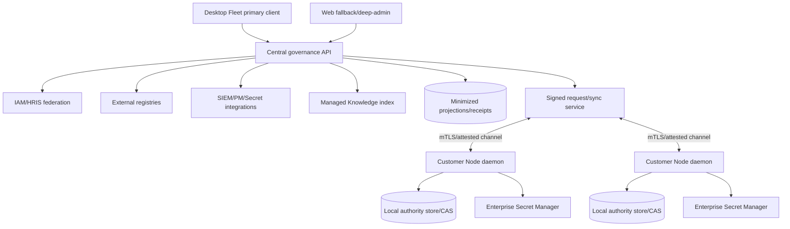
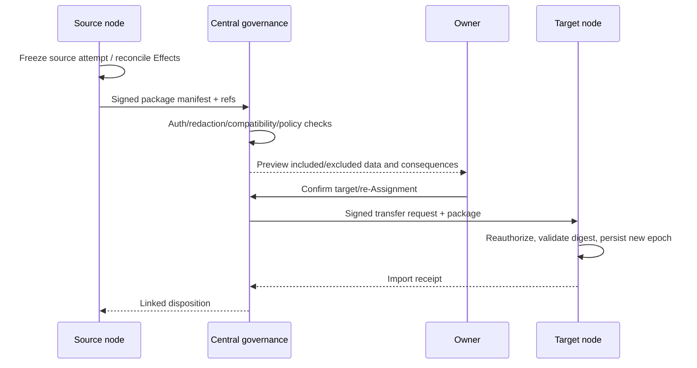

# CognitiveOS Enterprise 候选架构

Date: 2026-08-25
Status: **candidate / owner-confirmed discovery / non-canonical / no implementation authorization**

本文件是 [Enterprise 产品设计](./06-enterprise-product-design.md)的 candidate architecture。
它不创建 service、schema、protocol、ADR、tenant、index 或 implementation task。

## 1. Non-negotiable architecture

- node/workspace daemon 是 Task、Assignment execution ownership、Intent、Effect、lease、
  dispatch、verification、local evidence 的唯一 writer；
- central plane 不 mount/read-write remote SQLite；
- central request 必须 signed/versioned；node reauthorizes；
- Agents/Providers/central clients 只产生 request/candidate/observation；
- persist-before-dispatch、fencing、hard Task budget、SecretStore、independent verification、
  evidence claim ceilings 与 A8 继续 binding。

## 2. Deployment topology



Desktop Fleet 与 Web 使用同一 authenticated backend、permissions、object IDs 和 durable
routes。UI 不直接连 node database。

## 3. System-of-record federation

| Fact | SoR | CognitiveOS central | Node |
|---|---|---|---|
| human/org | IAM/HRIS | stable refs + minimal claims | fresh signed principal context |
| secret value | Enterprise Secret Manager | SecretRef only | JIT resolve, no persistence |
| Agent/workload identity | external registry/IAM | execution/governance overlay | attested operational identity |
| external work | PM/ITSM/Git | reference + sync cursor | TaskContract link |
| policy source | policy repo/governance | version/sign/distribute | verify/evaluate/enforce |
| Task/Intent/Effect | node daemon | minimized projection/ref | sole writer |
| raw logs/artifacts | node/source | ref/digest only | local/source retention |
| Knowledge source body | external source SoR | opt-in managed copied index | ContextView/retrieval use |
| invoice | Provider/finance | reference | no authority |

Managed Knowledge copy 不改变 source SoR；index 是 governed derived store。

## 4. Identity model

Distinct concepts：

- `Principal`：human/service identity；
- `Sponsor`：organizational accountability；
- `Agent`：logical governed actor overlay；
- `AgentPackage/Profile/Instance`：software/capability/deployment；
- `Workload`：runtime-attested process/service identity；
- `Assignment`：Task selected responsibility；
- `LeaseHolder`：current fenced execution owner。

这些 ID 不可互换。Agent sponsor 变更不自动 transfer workload authority；Assignment 不授予
SQLite writer；lease 不等于 business responsibility。

## 5. Federated Agent Registry overlay

Overlay candidate fields：

```text
external_registry_ref
logical_agent_id
package/profile/version
sponsor_ref
workload_identity_refs[]
node_presence[]
capability_claims + sources
eligibility status + reasons
bindings[]
policy_version / revocation_watermark
evidence refs
freshness
```

connector events 经过 source signature/version、matching、conflict review。duplicate/ambiguous
identity blocks new assignment。external registry 仍 owns lifecycle facts；CognitiveOS owns
execution/governance overlay。

## 6. Policy contract

**OWNER DECISION**：先稳定 versioned decision/evidence contract，engine pluggable；不锁定
OPA/Cedar。

Candidate input：

```text
principal + sponsor + agent + workload + delegation
tenant/org/scope + resource + action + purpose + Task
environment/risk/time + policy version
attestation + classification/residency
entitlement/budget + approval + capability
revocation watermark + freshness
```

Candidate output：

```text
Permit | Deny | RequireApproval | Indeterminate
reason_codes[]
obligations[]
policy_version
input_digest
expires_at
evidence_ref
```

missing/stale required input → Deny/Indeterminate。RequireApproval 不是 Permit；approval 后重新
evaluate。built-in Personal evaluator 是 initial implementation reference，不是 Enterprise
engine choice。

## 7. Evidence projection and retention

Central retains：

- signed state projections；
- receipts；
- digests；
- node/source references；
- policy/decision facts；
- bounded summaries；
- sequence/cursor/freshness/coverage。

Raw logs/artifacts remain node/source-local。central deep inspection uses authorized short-lived
fetch/reference，not default replication。projection envelope includes tenant、node、object、
authority-vs-observation、source、observed_at、sequence、signature、limitations。

Outbox properties：

- append after local durable authority commit；
- monotonic per-node sequence；
- idempotent central ingest；
- gap detection；
- replay bounded by cursor；
- signature/attestation verification；
- no secret/raw body by default。

## 8. Portable Continuation Package

### 8.1 Conceptual schema

```text
ContinuationPackage {
  package_version
  package_id
  source_task_ref / contract_epoch / objective / acceptance
  decisions[] / owner_instructions[]
  transcript_material[] { excerpt|summary, source, authorization, redaction }
  context_refs[] { ContextView/source/version/purpose }
  artifacts[] { ref, digest, provenance, classification }
  effects[] / evidence_refs[]
  binding_state { agent/profile/instance/account/model, no secret }
  budget_state / deadline
  blockers[] / completed[] / remaining[]
  durable_next_action
  exclusions[] / limitations[]
  source_signature / package_digest
}
```

Hidden CoT、Provider-private state、credentials、unsupported session internals、unauthorized
content explicitly excluded。

### 8.2 Transfer protocol



same approved binding 可 bounded automatic retry；cross-tool/re-Assignment requires owner
confirmation。official native session continuation 作为 supported adapter reference，不取代
portable package。

### 8.3 Idempotency and recovery

- package ID + digest immutable；
- import exact duplicate returns prior receipt；
- different digest same ID fails；
- source Effect reconciliation precedes transfer；
- target never replays completed irreversible Effects without explicit plan；
- failed import leaves source disposition unchanged；
- partial transfer stores itemized rejection；
- retry/reassignment consumes budget/attempt bound；
- independent acceptance remains at target Task epoch。

## 9. Qualified completion guarantee

Guarantee eligibility record pins：

- qualified Task class/version；
- satisfiable acceptance + verifier；
- Agent/tool/model compatibility；
- authority/policy/attestation；
- resource availability；
- budget/time/deadline bounds；
- retry/reassignment envelope；
- Provider/Knowledge dependencies。

precondition monitor detects loss。Loss immediately changes projection to
`guarantee_withdrawn(reason)`；system continues only under permitted terminal-accountability path。
Fallback terminal states：independently accepted、durable blocked、durable failed，均有 evidence、
owner、next action。

## 10. Local-canonical context and opt-in sync

- node/local conversation and Continuation Package store is canonical；
- cloud sync disabled unless tenant policy **and** user authority enable；
- encryption in transit/at rest；tenant-scoped keys；
- sync unit is authorized package/material, not implicit full transcript；
- conflict uses version/vector/cursor candidate；never last-write-wins authority facts；
- revocation/deletion propagates tombstone and verified purge；
- offline package remains usable only within policy/TTL；
- key loss/recovery and legal hold require explicit design。

Central sync service is not Task authority。

## 11. Managed central Knowledge index

### 11.1 Ingestion

```text
source opt-in
→ connector identity + copy authority
→ approved source/content classes
→ classification/residency/retention policy
→ pre-index ACL authorization
→ DLP/malware/injection classification
→ encrypted tenant partition
→ chunk/embedding with provenance
→ searchable only after authorization index commit
```

### 11.2 Retrieval

authorization before metadata search；then candidate retrieval；before body exposure recheck
principal/Agent/Task purpose、ACL revision、classification、policy、residency。cache key includes all
authority dimensions and expiry。retrieved body remains untrusted data。

### 11.3 Revocation and purge

1. deny future search/body immediately；
2. write revocation tombstone；
3. invalidate cache/embedding references；
4. delete bodies/chunks/embeddings/backups per policy；
5. verify denominator and emit signed purge receipt；
6. report residual legal-hold copies explicitly。

### 11.4 Threat controls

- tenant partition + per-tenant keys；
- provenance to source/version/chunk/embedding；
- ACL freshness SLO and fail closed；
- prompt injection segmentation/instruction isolation；
- DLP/output policy；
- poisoning/quarantine/reindex；
- no cross-tenant vector search；
- audit of enrollment/search/body exposure；
- source SoR remains authoritative。

## 12. Provider/subscription architecture

Same-release independent track：

```text
ProviderTenant
→ AccessAccount
→ AuthenticationMethod / SecretRef
→ Entitlement / SeatPool / Allowance
→ Allocation
→ ModelRef / AgentBinding / TaskBinding
→ UsageObservation
→ BudgetPolicy
→ CostObservation
→ InvoiceRef
```

Plan ≠ account ≠ auth ≠ entitlement ≠ budget ≠ usage ≠ cost ≠ invoice。mutation capability is
connector-specific。external mutation requires Intent/Effect and idempotency when executed through
node authority；central delegated SaaS mutation requires its own durable authority design and is not
assumed here。

## 13. Partition, ordering and revocation

Reconnect/order：

1. revocation watermark；
2. identity/policy/ACL；
3. attestation；
4. queued and in-flight reevaluation；
5. Knowledge deny/purge；
6. evidence/usage outbox drain；
7. lower-priority catalog refresh。

partition modes candidate：

| Class | Behavior |
|---|---|
| read last-known projection | allowed with freshness/coverage |
| existing low-risk bounded Task | only pre-issued authority + valid TTL/budget |
| new high-risk Task/transfer | deny |
| approval | deny/queue; never assume |
| Knowledge enrollment/search with stale ACL | deny |
| Provider allocation mutation | deny unless connector/node authority proves |

## 14. HA/DR and observability

Central services need multi-zone candidate, durable queue/outbox, idempotent consumers, signed backup,
tenant restore test, RPO/RTO proposal。Node autonomy reduces central outage blast radius but not policy/
revocation expiry。

Observability records reason codes、latency、queue depth、sequence gap、policy version、watermark、
purge denominator、connector freshness、cost source；no secret、Knowledge body、transcript body。

## 15. Data classification

| Class | Examples | Default |
|---|---|---|
| Public metadata | product version | central allowed |
| Internal operational | node health、reason codes | minimized central |
| Confidential | Task objective、transcript excerpt、Knowledge metadata | scoped/encrypted |
| Restricted | secret、credential、regulated body | SecretStore/source or explicitly enrolled index |
| Evidence digest | signed ref/digest | central allowed with tenant scope |

## 16. API/protocol candidates

Candidate families only：

- governance projection/query；
- signed node request/response；
- registry federation overlay；
- policy decision/evidence；
- Continuation Package manifest/import receipt；
- Knowledge enrollment/retrieval/purge receipt；
- Provider entitlement/allocation/usage/cost projection。

Public contract requires Lane-CTR, generated bindings, versioning, negatives, conformance。No final
route or schema is accepted here。

## 17. Threat model

| Threat | Control |
|---|---|
| central compromise writes node state | node reauthorization + signed bounded requests + no DB access |
| cross-tenant leakage | tenant keys/partition/query auth/negative tests |
| continuation leaks secret/private state | typed allowlist、redaction、preview、owner confirmation |
| duplicate Effects after transfer | reconcile/fence/epoch/idempotency |
| stale policy continues work | short TTL/watermark/reconnect order |
| Knowledge stale ACL | pre-search/body auth + freshness fail closed |
| prompt injection | untrusted-content boundary、policy not from content、DLP |
| cost misstatement | source taxonomy、invoice external SoR |
| guarantee overclaim | pinned preconditions、withdrawal、terminal fallback |

## 18. Baseline delta and non-claims

相对 `docs/design/01–41` 与 research `01`：

- owner 选择 managed central Knowledge index，取代原 source-native-only recommendation；
- owner 增加 cross-tool Continuation Package；
- Desktop Fleet primary、Web fallback；
- Provider/subscription track 与 first release 同期但 separate acceptance；
- policy engine 继续 contract-first/no lock-in；
- raw evidence 仍 node/source-local。

No Enterprise service、tenant、index、connector、sync、desktop client、test、ADR、contract、
Gate/release implementation exists。
