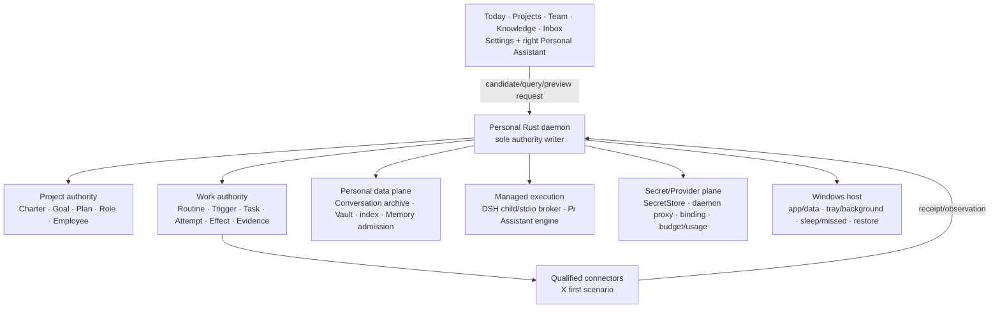

# CognitiveOS Personal architecture

- Status: informative current/target composition
- Change class: owner-approved `product-semantic` architecture follow-through
- Project: `cognitiveos-personal`
- Current-status owner: [PROGRESS.md](../../../docs/plan/PROGRESS.md)
- Task/Gate owner:
  [PERSONAL-DEVELOPMENT-PLAN.md](../../../docs/plan/PERSONAL-DEVELOPMENT-PLAN.md)
- Normative machine contracts: [`core/specs/`](../../../core/specs)
- Current product decision:
  [ADR-0059](../../../docs/adr/0059-personal-2-0-opc-project-runtime-and-memory-boundary.md)

This directory explains composition. It creates no public DTO, route, error,
transition, current status, support statement, or Gate result.

## Architecture status vocabulary

| Label | Meaning |
|---|---|
| **Now** | repository-established implementation within its exact recorded platform and evidence boundary |
| **2.0 target** | adopted Windows OPC composition; not implemented or supported by documentation |
| **Requires-backend** | future daemon/client/adapter/host/data implementation needed |
| **Requires-environment** | qualified Windows-native or campaign environment absent |
| **Deferred** | explicitly outside the 2.0 success path |

## Current and target systems

### Now

Linux Personal 1.0 remains six-family and Pi-qualified. The Rust daemon is the
sole authority writer. Current Resource Manager, Provider Control Plane,
Task/Effect/verification, learning admission, adapter registration, dsh Path B,
and daemon-served `/ui/` retain their implemented boundaries. Native dsh web is
a separate current surface. None establishes Windows OPC support.

### Personal 2.0 target

Project/Role/Employee/Routine/Attempt/Conversation/Vault are not a new generic
Resource family. Engine checkpoints are recovery inputs, not authority.

## Stable boundaries

- UI, Personal Assistant, Pi, DSH, employees, adapters, MCP, and connectors are
  clients, candidates, observations, or bounded executors.
- External mutation persists Intent/Effect before dispatch and reconciles
  unknown outcomes under fencing.
- Completion requires current independent evidence and daemon acceptance.
- DSH is the preinstalled managed Installed Agent: exact audited artifact,
  isolated child, bounded stdio broker, daemon Provider proxy, update/rollback.
  It is not in-process, vendored, a native UI, or conversation authority.
- Pi is hidden behind the Personal Assistant and owns no authority, Secret,
  archive, Memory, or completion.
- Personal owns Conversations, archive/index/retrieval, admitted Memory, Project
  state, and employee identity.
- Secrets remain in approved Secret Stores. DSH/Pi never receive raw material.
- Public contract changes still require Lane-CTR; architecture does not invent
  the machine shape.

## Chapters

| Chapter | Responsibility |
|---|---|
| [System architecture](system-architecture.md) | containers, dependency direction, data ownership, and current/target boundary |
| [Web UI architecture](web-ui-architecture.md) | daemon-served OPC client, projections, state, and single-composer boundary |
| [v9 OPC → daemon mapping](personal-2.0-opc-v9-implementation-mapping.md) | owner-approved v9 Scene → current `/ui/` + daemon HTTP mapping; informative; not implementation |
| [Project, Role, and Employee](project-role-employee.md) | Project aggregate, manager, Blueprint/Assignment/Employee identities |
| [Agent Shell and lifecycle](agent-shell-and-agent-lifecycle.md) | Pi Personal Assistant engine, managed DSH child, strict runtime identities |
| [Agent adapter](agent-adapter-contract.md) | delivered adapter foundation and future qualification boundary |
| [Multi-agent orchestration](multi-agent-orchestration.md) | manager/member Tasks, artifacts, handoffs, and verification |
| [Conversation, Memory, and Vault](conversation-memory-vault.md) | Personal archive/index/retrieval, Vault, admission, privacy/forget |
| [Routine, Trigger, and missed run](routine-trigger-missed-run.md) | no-overlap, queue-latest, offline/missed, risk-based resume |
| [Windows host and background](windows-host-background.md) | app/data, tray/background, sandbox/process, restore/export |
| [Authority, data, and recovery](authority-data-and-recovery.md) | ownership, Intent/Effect, checkpoint non-authority, restart order |
| [Provider Control Plane](provider-control-plane.md) | daemon proxy, global/Project/employee/Task binding, budget/usage |
| [Learning loop](learning-loop.md) | reflection/retrieval candidates and deterministic admission |
| [Context evolution](context-evolution.md) | scoped archive/Vault retrieval, compaction, progressive disclosure |
| [Resource Manager](resource-manager-architecture.md) | six-family current facts, domain separation, advanced MCP |
| [MCP/conversation private envelopes](mcp-conversation-private-projection.md) | retained ADR-0058 MCP/fail-closed boundary and superseded first slice |
| [Async event evolution](async-event-evolution.md) | unchanged measurement-first async decision |
| [Performance architecture](performance-architecture.md) | unchanged evidence floors and non-claims |
| [Headroom](headroom-iot-and-multitenancy.md) | non-current future boundaries |

The route inventory remains a frozen P7-T05 input; it is not an OPC contract.

## ADR-0058 preservation

MCP remains `cognitiveos.personal.mcp-family/0.1`; Core and the 1.0 six-family
projection remain unchanged/fail-closed; P5 records do not auto-migrate.
ADR-0059 supersedes only dsh Path B as the first common-conversation slice.
`cognitiveos.personal.conversation-projection/0.1` is not reinterpreted; the
Personal-owned archive shape needs a new private version or future Lane-CTR.

## Source ownership and non-claims

Machine contracts come from Core specs; behavior from applicable standards;
product decisions from accepted ADRs; tasks from the formal plan; current facts
from `PROGRESS.md`. Architecture presence is not implementation, support,
qualification, Gate, release, Profile, performance, or Agent-benefit evidence.
