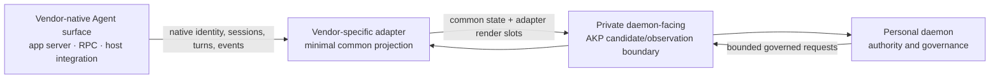

# Personal Agent Adapter Architecture

- Status: informative current/target alignment
- Change class: `product-semantic + structural` documentation
- Accepted foundation:
  [ADR-0043](../../../docs/adr/0043-personal-universal-agent-adapter.md) and
  [ADR-0044](../../../docs/adr/0044-personal-multi-agent-mainline.md)
- Product companion:
  [Agent integration and conversations](../product/agent-integration-and-conversations.md)
- Lifecycle companion:
  [Agent Shell and Agent lifecycle](agent-shell-and-agent-lifecycle.md)

This chapter describes a conceptual Personal product contract. It deliberately
does not define a new public schema, DTO, route, error registry, or state
machine.

## 1. Current implemented foundation

### Now

P8-T02 delivered the registered adapter manifest and lifecycle guard with:

- exact package, adapter, and protocol identity;
- a private daemon-facing AKP adaptation boundary;
- candidate-only declaration;
- channel isolation;
- lifecycle operations guarded by registered identity; and
- fail-closed digest and scope checks.

P8-T03 exercised that foundation with a Codex fixture and independent
qualification report. It did not ship a live Codex product integration or
transfer Pi qualification. Pi remains the only Agent covered by Linux 1.0.

The current contract is sufficient for registration and bounded
candidate/observation exchange. It does not provide a common native
conversation projection service, native login model, event history, plan, attachment,
approval, MCP-binding, or runtime launch/attach projection for the Control
Plane. Existing Core Conversation/ConversationBinding contracts remain
available governance identities; they are not that missing product projection.

## 2. Two-sided adapter boundary

### 2.0 target

The vendor-facing side uses the strongest safe native interface available.
Codex app-server, Pi RPC, dsh Host, and future vendor-native interfaces are
valid examples of the pattern; no one protocol is assumed to fit all Agents.

The daemon-facing side preserves ADR-0043: AKP is the private adaptation path
into Personal authority. This does not require the vendor itself to speak AKP.
Agent Client Protocol (ACP) conformance is optional and never a prerequisite
for installation, observation, or qualification.

An adapter is vendor-specific because session semantics are vendor-specific.
The common layer is intentionally minimal. Vendor detail that does not belong
in that common layer stays in bounded adapter-specific render slots. Every
adapter is independently versioned, capability-declared, and qualified;
evidence from one vendor path never establishes another.

The common/native conversation projection reuses or references existing Core
`Conversation` and `ConversationBinding` identities where applicable.
Vendor-native conversation/thread IDs are opaque origin bindings carried by
the adapter. They do not create a duplicate public Conversation model.
Additional projection state remains Personal-private until P10-T02 decides
otherwise.

## 3. Capability condition model

Every adapter capability is reported with one of four conceptual conditions:

| Condition | Meaning |
|---|---|
| **Supported** | the adapter declares the capability and has enough current information to evaluate it |
| **Unsupported** | the Agent/native integration does not provide the capability |
| **Unavailable** | the capability exists, but current authentication, runtime, connection, policy, version, or dependency blocks it |
| **Unknown** | the adapter cannot currently establish whether the capability exists or is usable |

The adapter also supplies source and freshness for the condition. The Control
Plane must not turn `unknown` into `unavailable`, or present `unsupported` as a
temporarily disabled control. Availability is contextual and never a standing
authority grant.

Capability condition is separate from **support path**. Where known, the
adapter also identifies whether a capability is:

- vendor-native and directly supported by a session API;
- supplied through a managed adapter path;
- cooperative through MCP plus vendor rules;
- observable only; or
- not qualified for Personal use.

For example, an observable native turn can be `Supported` for reading while
remaining unavailable for interruption. A cooperative MCP path never acquires
native-session-control semantics by being connected.

## 4. Conceptual product state contracts

The following concepts define the 2.0 product projection. They do not select a
wire shape.

| Concept | Minimum semantic responsibility | Authority boundary |
|---|---|---|
| **Initialize** | establish adapter/native endpoint identity, compatibility, current runtime reachability, and observation starting point | initialization authorizes nothing |
| **Identity** | distinguish adapter, Agent package/registration/instance, native Agent, native account/login, runtime, opaque vendor conversation/turn, and referenced Core ConversationBinding | origin identity is not a new public Conversation, Personal principal, or capability |
| **Capabilities** | declare each common operation's condition, reason, freshness, and vendor constraints | declaration is not permission |
| **Authentication** | expose redacted auth readiness and an opaque login handle; initiate or attach to a vendor-supported login flow when allowed | no credential/token material crosses the common conversation wire |
| **Conversation list** | enumerate bounded native conversations with exact origin identity, lineage, freshness, and coverage | listing is observation, not admission |
| **Conversation create** | ask the origin to create a native conversation and return its origin identity | does not create Goal, Plan, Task, Context, or capability |
| **Conversation load** | obtain a bounded current native snapshot and sequence coverage | loaded content remains origin-owned |
| **Conversation resume** | reattach to an existing native lineage when the origin supports resume | does not resume a Personal Task |
| **Conversation fork** | create a new origin lineage linked to its source | does not fork governed work until separately admitted |
| **Conversation close** | request origin-native closure and report the observed result | does not cancel a Task or erase Personal history |
| **Turn submit** | submit owner content to the exact native conversation | submitted content is not a Task admission |
| **Turn steer** | provide vendor-supported direction to an active native turn | cannot alter daemon Plan/Task authority |
| **Turn interrupt** | request that an active native turn yield or stop | not Task cancel, process kill, or Effect reconciliation |
| **Sequenced events** | report source identity, source sequence/cursor when available, ordering coverage, gaps, and bounded event payload | events are observations until daemon admission/validation |
| **Tool approval** | expose native approval requests/results and their exact native scope | native approval is not Personal Tool authorization |
| **Native plan** | expose the Agent's current plan, revisions if native, and provenance | never the daemon-owned revisioned Plan |
| **History** | read bounded origin history with coverage and truncation explicit | no automatic Memory/Context/Task promotion |
| **Attachments** | identify origin attachment metadata/content reference and availability | access still requires Personal scope and content policy |
| **MCP binding** | observe native MCP configuration/association and propose a Personal binding or projection | installation/binding grants no Tool authority |
| **Runtime launch** | request a new exact vendor runtime under Personal supervision when supported | launch is not registration, assignment, or completion |
| **Runtime attach** | connect to an existing exact runtime without claiming ownership of its prior work | attachment is observation until current identity and policy are validated |

An adapter may implement only a subset. Partial support is represented per
capability; the adapter is not forced to fake a complete session model.

## 5. Common conversation state

The minimal common conversation reading contains:

- exact opaque native conversation identity, adapter identity, and applicable
  Core Conversation/ConversationBinding reference;
- parent/fork lineage when known;
- current auth and runtime attachment condition;
- active-turn condition;
- event ordering coverage and last observed source position;
- native plan/history/attachment/tool-approval/MCP-binding availability;
- links to the daemon-admitted Goal -> Plan revision -> Task -> Attempt
  hierarchy, if any;
- explicit unsupported, unavailable, unknown, stale, and truncated facts; and
- zero or more adapter-specific render slots.

The common state is a projection, not a synchronized replacement for the
origin. Personal does not rewrite native history to make it look governed.

Agent connection establishes an explicit observation scope. Conversation
listing, history refresh, and sequenced events may be automatic only inside
that scope. The adapter performs no speculative/global session scan and does
not surprise-enroll a newly discovered session.

### Adapter-specific render slots

A render slot:

- is owned and versioned by the adapter;
- is source-labeled and bounded;
- contains display-safe native detail that has no common semantic equivalent;
- cannot inject executable markup, actions, credentials, or authority-shaped
  state;
- can disappear without changing common state; and
- is not persisted as Personal authority merely because the UI displayed it.

If a native detail becomes necessary for policy or authority, it must be
promoted through a separately accepted contract rather than parsed from a
render slot.

## 6. Sequencing and observation honesty

An adapter preserves the strongest ordering fact the origin provides. It never
manufactures a total order across:

- native events;
- adapter/process observations;
- daemon authority events; and
- independent verification.

The progress composer links those sources by stable identity and causal
reference where available. A missing source sequence, reconnect gap,
truncation, or runtime replacement remains visible. Wall-clock sorting is a
presentation aid only.

Duplicate native delivery may be deduplicated as an observation when the origin
provides stable identity. It does not reuse or invent daemon mutation
idempotency. Unknown delivery or outcome remains unknown until the owning
system can be queried or reconciled.

## 7. Secret and authentication boundary

No Provider/user secret, native access token, browser cookie material, Secret
Store payload, daemon bootstrap secret, or resolvable secret reference may pass
through:

- conversation history;
- turn content;
- adapter events;
- render slots;
- attachments;
- native plan;
- MCP advertisements or configuration;
- Context/Memory candidates; or
- progress/evidence.

Authentication projection contains only redacted status, source, expiry or
freshness when safe, and an opaque login handle. Credential import is a
daemon-owned ADR-0055 boundary; Provider consumption uses a daemon proxy
profile. An Agent receives neither imported material nor a Secret Store reader.

## 8. MCP and rules fallback

MCP plus Agent instructions/rules can provide a cooperative fallback for:

- advertising candidate tools, resources/context, and prompts;
- asking the Agent to include stable correlation references;
- proposing Context/Skill/Tool use; and
- returning bounded result candidates.

It is not a substitute for native session control. Unless independently
provided by the native integration, it cannot establish complete conversation
inventory, auth state, lineage, active-turn ownership, ordered history,
interrupt semantics, fork/close semantics, runtime attachment, or durable
native plan state.

MCP advertisements remain untrusted candidates into existing Personal domains.
Installing an MCP server or projecting it into an Agent configuration grants no
Tool authority.

## 9. Admission and governed work

Native sessions remain native observations. The adapter may prepare an
admission candidate with lineage, bounded content references, native-plan
observation, capability conditions, and event coverage. The owner requests
management and confirms the daemon preview; only daemon admission creates:

- a Personal Goal;
- a revisioned Personal Plan;
- governed Tasks and Task-owned Attempts;
- Agent assignments and handoffs;
- resource and Provider bindings;
- budgets and capability bounds; and
- acceptance criteria.

The daemon owns every later graph revision and authority decision. Agent/native
updates can propose changes but cannot silently revise the Plan or reassign
work.

## 10. Lifecycle and recovery

Adapter initialization, native login, runtime launch/attach, conversation
load/resume/fork/close, turn interrupt, Agent execution pause, Task cancel, and
daemon restart are separate concepts. The adapter reports only the operation it
actually performed and the resulting native observation.

On daemon or adapter restart:

1. current Personal authority is reloaded and stale adapter/execution epochs
   are fenced;
2. pending external Effects are reconciled before new dispatch;
3. the adapter reinitializes and re-establishes native identity;
4. native event coverage is checked for gaps;
5. current scope, capability, Provider binding, and budget are reauthorized;
6. runtime/conversation attachment is re-established or marked unavailable;
   and
7. governed work resumes only under a current daemon decision.

A still-running native process or conversation is not automatically adopted as
current.

## 11. Current/target and contract boundary

| Capability | Status |
|---|---|
| Registered adapter manifest, private AKP adaptation, lifecycle guard, candidate-only boundary | **Now** |
| Pi Linux 1.0 qualification | **Now**, Pi only |
| Codex fixture qualification | **Now**, fixture/non-claim only |
| Vendor-native common conversation/capability projection | **Requires-backend** |
| Adapter-specific render-slot safety and versioning | **Requires-backend**; P10-T02/Lane-CTR only if public |
| Goal -> Plan revision -> Task -> Attempt/native-session admission linkage | **Requires-backend**; P10-T02/Lane-CTR only for new public semantics |
| MCP seventh-family binding/config projection | **Requires-backend**; P10-T02/Lane-CTR only for a new/changed public surface |

Contract decisions intentionally left for future Lane-CTR work are:

1. how the common projection reuses/references existing Core Conversation and
   ConversationBinding while opaque vendor-native IDs remain origin bindings,
   and whether any additional Personal-private projection becomes public;
2. the minimum cross-vendor event ordering and gap semantics;
3. the stable identity/linkage between native conversation lineage, Core
   ConversationBinding, and daemon-admitted Goal -> Plan revision -> Task ->
   Attempt objects;
4. the safety/version boundary for adapter render slots; and
5. which auth, runtime, history, attachment, and MCP concepts need shared
   normative shapes rather than adapter-private projections.

Until those decisions are accepted, architecture prose is not a machine
contract. No Gate, release, Profile, or Agent-benefit claim follows.
