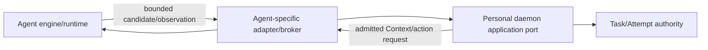

# Personal Agent adapter architecture

- Status: delivered generic foundation plus target qualification rules
- Decisions:
  [ADR-0043](../../../docs/adr/0043-personal-universal-agent-adapter.md),
  [ADR-0044](../../../docs/adr/0044-personal-multi-agent-mainline.md), and
  [ADR-0059](../../../docs/adr/0059-personal-2-0-opc-project-runtime-and-memory-boundary.md)
- Lifecycle: [Personal Assistant and Agent lifecycle](agent-shell-and-agent-lifecycle.md)

## 1. Current foundation

P8 delivered exact package/adapter/protocol identity, private daemon-facing AKP
adaptation, candidate-only declaration, channel isolation, lifecycle guards,
and fail-closed digest/scope checks. Codex fixture evidence did not ship or
qualify Codex. Current dsh Path B is a bounded post-1.0 integration. Pi remains
the only Linux 1.0 qualified Agent.

## 2. Two-sided port

The engine-facing protocol is implementation-specific. The daemon-facing side
preserves exact identity, bounded payload, channel, scope, capability, budget,
fencing, and candidate-only semantics. ACP/MCP conformance is not a substitute
for Personal qualification.

## 3. DSH managed adapter

The 2.0 default uses DSH's exact audited official artifact behind a
Personal-owned isolated-child/stdio-broker adapter. The adapter:

- starts only an admitted installation slot;
- supplies bounded Task/Attempt Context;
- proxies Provider traffic through the daemon;
- rejects native MCP/base tools, HMR, home patch, ambient env/plaintext
  credentials, and unregistered actions;
- reports health/process/protocol observations;
- returns candidate output and bounded artifacts;
- supports update/rollback through daemon lifecycle.

It does not expose native DSH UI/conversations or make DSH an authority writer.
Personal owns Conversation and Memory.

## 4. Pi Assistant adapter

Pi supports the Personal Assistant as a hidden, pinned, default-deny client/
sidecar engine. Its application port permits explanation, navigation,
research, and proposal candidates over bounded projections. It has no Installed
Agent presentation, Project employee identity, authority write, archive,
Memory, secret, or completion.

## 5. Capability and qualification

Every adapter capability is separately:

- declared with source/version/freshness;
- supported, unsupported, unavailable, unknown, or unqualified;
- mapped to an exact daemon operation;
- authorized for Task/Attempt scope;
- independently validated on the claimed platform/artifact.

Capability declaration grants no permission. Process health does not imply
Task readiness. One adapter's evidence never transfers to another.

## 6. Future adapter candidates

Hermes, Codex, Cursor, and others remain future candidates. They require exact
artifact, license/provenance, protocol, secret handling, workspace/process/
network containment, lifecycle, recovery, capability, negative, and
fixed-denominator qualification. Personal 2.0 promises no native
conversation-sync compatibility or multiple engines.

## 7. Observation, handoff, and completion

Adapter events retain source identity, sequence/coverage where available,
freshness, and gaps. Handoff changes daemon-owned Task/Assignment state; an
adapter acknowledgement does not transfer authority. Engine checkpoint, final
text, Tool result, Provider response, or process exit is not Effect closure or
completion.

## 8. Contract and non-claims

Concrete managed DSH/Pi ports remain **Requires-backend** and Windows DSH
qualification **Requires-environment**. Public shapes require Lane-CTR. This
chapter does not implement or qualify an adapter, Agent, support row, Gate,
release, Profile, or benefit.
