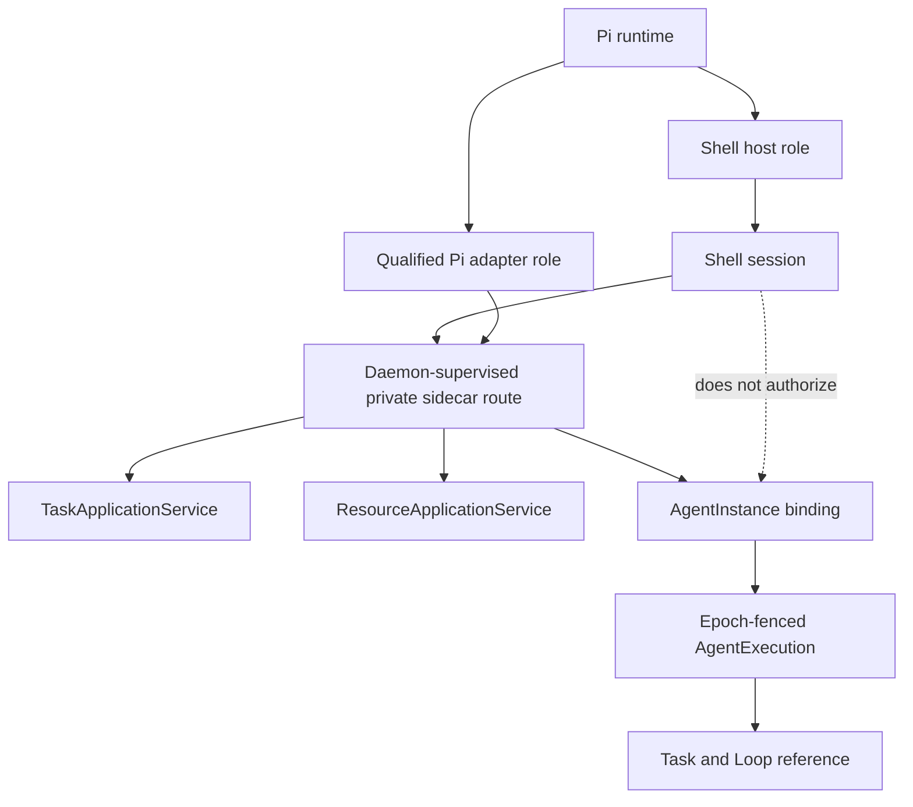

# Personal Agent Shell and Agent Lifecycle

- Status: informative target/design
- Change class: owner-approved `product-semantic + structural` documentation
- Decision source: [ADR-0035](../../../docs/adr/0035-personal-pi-shell-and-managed-agent-role-separation.md)
- Acquisition source: [ADR-0036](../../../docs/adr/0036-personal-linux-1-0-and-official-pi-acquisition.md)

## 1. Agent Shell role and route

The Agent Shell is the default interaction model, not an authority service and
not synonymous with Pi. Linux 1.0 uses Pi as the Shell host because Pi provides
the conversational terminal, model interaction and Extension surface. Pi is
also the only Agent adapter targeted for Linux 1.0 qualification; no other
adapter inherits that qualification.

The Pi-hosted Shell reaches the daemon through the daemon-supervised Pi sidecar
route and then the Task or Resource application service. The Shell never owns
the daemon bootstrap credential, sidecar management authority, installation
authority or an ambient management bearer. The deterministic `cognitive` CLI
uses the same application services through its own authenticated client route.

The Shell supports two modes:

- **natural language** produces an interpretation candidate and structured
  proposal;
- **deterministic commands** select the same application-service operation
  without model interpretation.

Both modes converge before authorization. A model or Pi outage degrades to the
deterministic CLI; it must not disable recovery or hide authority state.

## 2. Pi dual-role and sidecar model

The roles can be co-located by an implementation, but they cannot share a
logical identity or authority. The daemon may restart the sidecar/Agent runtime
without ending a Shell watch, or replace a Shell/Pi session without changing
the Agent instance. A Pi session ID cannot stand in for a Shell session,
sidecar, instance, execution or Task ID.

## 3. Strict runtime identity model

| Identity | Stable binding | Lifecycle owner | Must not be treated as |
|---|---|---|---|
| Agent package | source, package version, bytes digest, declared adapter/protocol requirements | acquisition verification | installation, permission or process |
| Agent installation | verified immutable package plus acquisition lock and compatibility result | installation domain | registration, activation or permission |
| Agent registration | installation, adapter digest and Personal policy defaults | Agent domain | running instance or granted capability |
| Agent instance | registration, owner/scope and durable lifecycle identity | Agent domain | sidecar session, process, Task or completion |
| Sidecar session | one current logical daemon-supervised adapter session for an active instance, bound to protocol digest and epoch | daemon supervisor | authority service, installation or AgentExecution |
| OS process | PID/handle and parent/transport relationship | daemon process supervisor | stable Agent identity or logical success |
| AgentExecution | exact Task, Loop, Agent instance, sidecar and execution epoch binding | scheduler/runtime authority | Task identity or authority to complete it |
| Shell session | user-experience conversation/watch identity and bounded client channel | daemon session service | Pi session, management authority or AgentExecution |
| Pi session | Pi runtime/model conversation identity | Pi adapter observation boundary | Shell authority, Agent instance, execution or Task |
| Task | admitted goal, contract, budget and acceptance lifecycle | Task authority | Agent, process or session identity |

`ProcessAttempt` is an implementation-private daemon observation that correlates
one supervised spawn/attach attempt with bounded output, exit and reconcile
facts. It is not another public identity domain, not a resource family, and not
proof that an `AgentExecution`, Effect or Task succeeded.

## 4. Per-Agent sidecar session

Each active `AgentInstance` has exactly one current logical sidecar session.
Linux 1.0 may implement it as one separate OS process. The daemon creates the
session, launches the process, and connects framed AKP over private stdio or a
socketpair. There is no public sidecar listener, TLS PKI, service discovery or
service mesh.

The sidecar is limited to:

- exact package/adapter/protocol handshake;
- Agent protocol translation;
- lifecycle and health observations;
- Context and Skill reference delivery;
- Memory and Tool candidate return;
- progress, artifact/CAS references and bounded streams.

It cannot authorize itself, grant capability, alter a Task or budget, commit an
Effect, reconcile a mutation or accept completion. The daemon validates every
control-plane identity/digest/epoch and every data-plane reference.

On daemon restart the old private transport closes, or parent-death supervision
terminates the old sidecar. After durable reload and fencing, the daemon starts
a new sidecar session under a higher epoch. An orphan or stale session is never
adopted because it is still alive. Stale epoch, package/adapter digest drift or
AKP protocol digest drift fails closed.

## 5. Natural-language resource and Task protocol

Every natural-language request follows the same logical stages:

1. **record**: daemon persists the user's raw request before interpretation;
2. **interpret**: Pi/model emits only a candidate operation and target set;
3. **resolve**: daemon resolves exact IDs, digests and versions across the six
   resource families;
4. **classify**: daemon reads catalog risk, capability, channel and budget
   policy;
5. **preview**: daemon returns canonical action, targets, versions, permission
   changes, side effects, budget impact and rollback expectation;
6. **admit**: the client submits the exact preview digest and idempotency key;
7. **execute**: daemon schedules or runs the typed governed workflow;
8. **watch**: Shell renders only authority projections and evidence state.

Ambiguous language never selects a destructive target by guess. The common
`ResourceApplicationService` only provides versioned list/inspect/watch and
bind/unbind/enable/disable/revoke projection/commands. Domain-specific acquire,
install, execute, reconcile and purge workflows do not become generic resource
transitions.

## 6. Channel isolation

| Channel | Operations | Credential rule | Projection rule |
|---|---|---|---|
| Task | intent, clarify, preview, admit, attach, watch, detach, cancel | Task-only bearer/session, bound retry IDs | Task, Loop and execution projections only |
| Management | resource list/inspect/watch/bind/unbind/enable/disable/revoke plus typed lifecycle workflows | management-only bearer/session | six-family resource and lifecycle projections only |
| Sidecar control | handshake, pinned identities/digests, lifecycle, epoch, bounded budget/capability view | daemon-created private session; no bootstrap or ambient bearer | current instance/execution only |
| Sidecar data | governed refs, candidates, progress, artifacts and bounded streams | scoped to the control-plane binding | no direct authority projections or writes |

A Shell implementation may concurrently render Task and management views, but
it must keep credentials, retry contexts, caches, watch cursors and operation
sets separate. Ordinary conversation wording cannot upgrade a Task session to
management. Tier 2 operations require explicit confirmation on the management
path.

## 7. Agent lifecycle operations

### 7.1 Acquire, install and register

Acquisition verifies an exact package and immutable digest. Installation commits
verified bytes and the acquisition lock. Registration binds that installation,
an exact adapter/protocol digest and Personal policy defaults. None of these
steps grants Tool, workspace, network, model, Memory or secret capability.

For the Linux 1.0 target, acquisition uses the exact official Pi npm package
and production trust material. A legacy user path may be inspected for migration
but cannot silently become a qualified installation.

### 7.2 Activate and supervise

Activation checks installation health, package/adapter/protocol digests, Node
compatibility, policy and capability, then commits a new instance epoch before
creating its one logical sidecar session. A subsequent `AgentExecution` binds a
Task/Loop epoch to that instance and sidecar. Supervision reports process and
health facts; `exit 0` remains only an observation.

### 7.3 Pause, resume and stop

- **pause/suspend execution** prevents new dispatch, fences stale work, reaches
  a safe checkpoint and reconciles Effects or exposes why it cannot;
- **resume execution** follows recovery order: reload, fence, reconcile,
  reauthorize, rebuild Context, restart sidecar, then resume or quarantine;
- **disable/stop instance** quiesces new execution and terminates the sidecar
  only after pending Effects are closed or quarantined;
- **cancel Task** requests Task/Loop closure and is not equivalent to killing a
  sidecar or OS process.

### 7.4 Upgrade and rollback

Upgrade acquires a second immutable package, verifies the new adapter/protocol
digests and checks compatibility before superseding the registration binding.
Running executions stay bound to their recorded epoch or migrate through the
ordered recovery protocol. Failed activation restores the prior complete
binding; incomplete rollback is a durable visible failure.

### 7.5 Revoke and uninstall

Revocation fences the exact binding or capability and projects affected Tasks,
executions and blockers. Uninstall previews instances, sidecars, Tasks, pending
Effects, retained data and capability leases; stops new dispatch; reconciles or
quarantines Effects; removes package bytes; and marks the installation removed.
Audit/evidence and user data remain unless separately retained or purged under
an explicitly confirmed policy.

## 8. Mutating Tool boundary

A sidecar may return a Tool candidate but cannot dispatch from that candidate.
The daemon validates the exact descriptor, capability, budget and epoch,
persists Intent and Effect with the original idempotency key, commits the
dispatch fact, and only then issues an Effect-bound permit to the executor. A
receipt sent through the sidecar is not Effect commit, reconciliation,
Verification or Task completion.

## 9. Future adapters and product boundary

OpenClaw, Hermes, Codex, WorkBuddy and other Agents may use the same package,
registration, sidecar and execution boundaries, but they are not Linux 1.0
qualified Agents. Each requires exact identity/digests, compatibility and
degradation reports, declared host/Tool/secret boundaries, lifecycle and
recovery negatives, and its own campaign/release decision.

Multiple installed Agents do not enable Multi-Agent orchestration. A future
container, VM, cgroup, eBPF, device or hardware placement implementation cannot
move authorization, CAS, budget, Effect or acceptance authority out of the
daemon.

This entire document remains target/design. It does not claim that the sidecar,
managed Pi lifecycle, any non-Pi adapter, B09, `GMVP-LINUX`, a release or a
Profile is implemented or passed. Current facts remain in
[PROGRESS.md](../../../docs/plan/PROGRESS.md).
