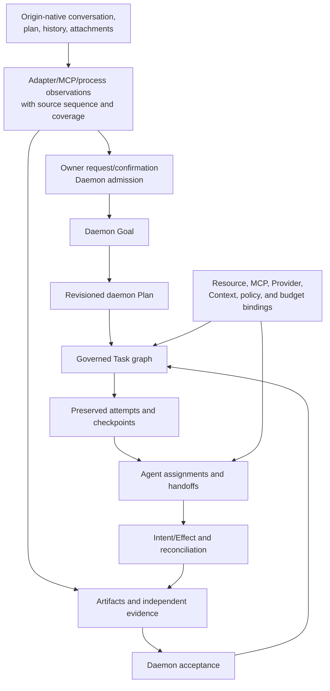

# Personal Authority, Data, Progress, and Recovery

- Status: informative current/target alignment
- Change class: owner-approved `product-semantic + structural` documentation
- Normative behavior:
  [Task/Loop/Verification](../../../docs/standards/task-loop-verification.md),
  [Intent/Effect](../../../docs/standards/intent-effect-idempotency.md),
  [authorization](../../../docs/standards/authn-authz-capability.md), and
  [event/watch](../../../docs/standards/event-audit-watch.md)
- Personal 2.0 companions:
  [System architecture](system-architecture.md),
  [Agent adapter architecture](agent-adapter-contract.md), and
  [Resource Manager](resource-manager-architecture.md)

## 1. Sole authority boundary

### Now and 2.0 target

The Rust daemon is the sole authority writer. Models, Pi, third-party Agents,
Agent-native runtimes, adapters, sidecars, MCP servers, the browser, CLI, SDK,
Shell, schedulers, process supervisors, executors, and Provider systems may
submit requests, candidates, or observations. None may directly mutate
authority storage or decide Task, Effect, Verification, budget, capability,
Goal, or Plan authority.

Every daemon authority mutation is evaluated against the applicable:

- authenticated principal and isolated channel;
- exact object, origin, scope, purpose, and current policy;
- expected version and fencing epoch;
- package, adapter, protocol, native runtime/conversation, and resource
  identities;
- deadline, retry, step, token, cost, and graph budget;
- stable mutation identity and current Effect outcome;
- currently admitted Context/resource/Provider bindings; and
- domain-specific normative rules.

The common Resource Manager, Desktop Control Plane, global Agent Shell, and
progress composer do not weaken these checks. They are projections and clients,
not generic writers.

## 2. Current durable authority

### Now

Personal already persists governed Task/Loop, scheduler, resource-domain,
Intent/Effect, event, artifact, evidence, verification, acceptance, adapter,
runtime, Provider, and binding facts according to their existing owners.
Adapter/process/native output remains observation. Independent verification is
required for Task completion.

The daemon may provision the accepted owner-local governance-root context for
the authenticated Personal principal. Clients cannot supply or replace that
root through request content.

Current authority has no Goal or revisioned Plan product object and no common
native-conversation projection service. Existing Core
Conversation/ConversationBinding contracts remain the governed interaction
identities and must not be duplicated or confused with a missing product
projection. Goal/Plan target concepts must not be retrofitted onto current Task
rows or client caches.

## 3. Personal 2.0 relationship model

### 2.0 target

Native content remains origin-owned. Admission creates new Personal authority
with provenance; it does not rewrite origin history. A native plan can be
source material for a daemon Plan candidate but never becomes the current
daemon Plan without admission.

Where applicable, Personal reuses or references existing Core `Conversation`
and `ConversationBinding`. Vendor-native IDs remain opaque origin bindings;
additional projection state is Personal-private until P10-T02 decides
otherwise. Agent connection establishes the explicit observation scope.
Automatic observation is limited to that scope; there is no speculative/global
scan or surprise per-session enrollment.

Goal/Plan/Task/Attempt implementation is **Requires-backend**. Only a new or
changed public machine surface conditionally requires P10-T02/Lane-CTR; a
Personal-private projection may not.

## 4. Ownership and data placement

| Data/fact | Owner | Personal treatment |
|---|---|---|
| Native conversation/history/plan | Agent/vendor origin | bounded observation with identity, lineage, source position, freshness, and gaps |
| Native/MCP attachment or advertised content | origin | candidate source; no automatic Context/Memory/Skill/Tool admission |
| Goal, Plan revision, Task graph | daemon | authority state after explicit admission |
| Attempt/checkpoint lineage | daemon | preserves each execution/recovery branch, evidence, and relationship to its Task |
| Assignment/handoff | daemon | exact Task/attempt, Agent/runtime/conversation linkage, scope, budget, and provenance |
| Resource/Provider/MCP binding | daemon | policy and expected-version authority; source content may remain federated |
| Process/runtime event | origin/host observation | bounded, redacted observation; not lifecycle success |
| Intent/Effect | daemon | persisted before external mutation and reconciled under fencing |
| Artifact/evidence | governed content-addressed store | immutable reference with source and policy |
| Verification/acceptance | independent verifier plus daemon acceptance authority | completion decision only under current bindings and closed Effects |
| Provider/user secret | approved `SecretStore` through approved daemon input/import path | never in authority database, client, Agent, adapter conversation, MCP, Context, logs, or evidence |

Personal-owned policy/binding does not imply ownership of source content.
Origin ownership does not imply permission to read, rank, copy, or write.

## 5. Admission, revision, and budgets

The daemon records owner intent before probabilistic interpretation. An
admission candidate resolves exact native lineage, resource/MCP/Provider
bindings, scope, expected versions, capabilities, budgets, acceptance
criteria, and known observation gaps.

Admission creates or revises governed authority only after current facts still
match. A stale native conversation position, changed origin resource,
superseded Provider binding, MCP advertisement drift, or changed policy
requires a fresh disposition rather than silent rebasing.

In the target model:

- a Goal states the durable owner outcome and boundary;
- each Plan revision explains the current decomposition and why it changed;
- Tasks are the governed schedulable/acceptable units;
- each Attempt belongs to one Task and preserves retries/checkpoint forks
  without erasing prior failure or evidence;
- assignments bind Tasks to exact Agent/runtime/native context;
- graph and assignment budgets attenuate, never expand, parent limits; and
- native plans and Agent proposals may suggest revisions but cannot commit
  them.

Budget is checked at admission, scheduling, assignment, continuation, and
dispatch. Reaching an inclusive ceiling prevents further dispatch and creates
a durable governed fact. Agent narrative cannot extend the budget.

## 6. Authority, candidate, observation, and secret planes

| Plane | Examples | Treatment |
|---|---|---|
| Authority/Governed | Goal/Plan/Task/Attempt, assignments, policy/bindings, budget, Intent/Effect, reconciliation | daemon-owned, versioned, domain-specific |
| Candidate | Shell interpretation, native plan suggestion, MCP advertisement, Tool/Memory/Skill proposal, handoff proposal | retained only as candidate until deterministic admission |
| Observation | native event, adapter status, process output, Provider result, MCP result, external receipt | source-labeled and bounded; never authority by payload shape |
| Verified | independent verification and daemon acceptance | verified completion evidence/outcome only |
| Secret | imported credential material, Provider/native token, approved store payload | isolated to approved daemon input/import and egress; excluded from all other planes |

An opaque handle is not secret material only when clients cannot resolve it and
its disclosure does not expose a credential or brute-forceable derivative.

## 7. Persist-before-dispatch and writeback

Every external or irreversible mutation, including Agent/MCP configuration
projection and federated-origin writeback, follows this authority order:

All writes retain Intent/Effect. An unchanged exact daemon grant/risk policy may
authorize automatic execution. New, broader, destructive, or conflicted scope
requires a fresh preview and owner confirmation.

1. resolve exact target, source/origin identity, operation, scope, and current
   expected revision;
2. validate capability, policy, budget, Goal/Plan/Task/Attempt/assignment
   binding, and current epoch;
3. capture a bounded recoverable preimage or prove why no rollback exists;
4. persist Intent/Effect, stable operation identity, and fencing facts before
   external I/O;
5. dispatch only the admitted operation;
6. record a receipt or outcome-unknown observation;
7. query and reconcile with the original identity;
8. verify the post-state independently; and
9. close, compensate, or quarantine the Effect under daemon authority.

The adapter, Agent, MCP server, browser, or executor cannot mint or broaden a
mutation permit. A successful native/MCP/Provider response is not Effect
closure.

### Administrative preauthorization

An administrator may preauthorize automatic reconciliation only within the
unchanged exact daemon grant/risk policy: same source, target, capability, scope,
purpose, network/Provider boundary, secret treatment, budget, and rollback
class. Any expansion requires confirmation.

## 8. Federated conflict handling

Personal never uses silent last-write-wins. A conflict exists when current
origin state cannot be proved compatible with the admitted Personal binding or
pending writeback.

The daemon:

- preserves all relevant origin and Personal versions;
- stops unsafe dispatch or writeback;
- keeps read-only observation available when safe;
- records which comparison or outcome is unknown;
- attempts deterministic reconcile with the original operation identity; and
- requires owner confirmation when no accepted merge/compensation rule applies.

Timestamp recency is not authority. An origin that lacks stable revisions may
be observed, but mutation requires a stronger precondition or remains
unavailable.

## 9. Progress provenance

The Desktop Control Plane composes four lanes:

| Lane | Source | Meaning |
|---|---|---|
| **Native** | Agent-native conversation, turn, plan, history, attachment, native approval | origin-owned state |
| **Observed** | adapter sequence, runtime/process, MCP, Provider, external receipt | bounded observation |
| **Governed** | daemon Goal -> Plan revision -> Task -> Attempt, assignment/handoff, policy, binding, budget, Intent/Effect, reconcile | authority state |
| **Verified** | independent verification and daemon acceptance | verified outcome and final acceptance only |

Each timeline item retains source identity, source position when available,
observed time, daemon link, and coverage. Causal links are preferred to clock
order. If cross-source ordering is unknown, the timeline says so.

The timeline does not invent events to fill gaps and does not compress Native,
Observed, Governed, and Verified into one fake lifecycle. A native "completed"
event remains Native even when it later contributes evidence to Verified.

## 10. Recovery operation distinctions

| Operation | What it changes | What it does not mean |
|---|---|---|
| **detach** | one client/adapter observation attachment | native work stopped, Task cancelled, or Effect reconciled |
| **interrupt** | current native turn is asked to yield | conversation closed, Task cancelled, process killed, or work accepted |
| **cancel** | daemon requests governed Task closure and handles open Effects | native conversation deleted or external mutation undone |
| **pause** | daemon fences new governed dispatch and seeks a safe checkpoint | runtime permanently stopped or Task completed |
| **restart** | daemon/adapter/native runtime machinery is replaced under fresh identity/epoch | prior work automatically resumed or adopted |
| **native fork** | origin creates a new native conversation lineage | Goal -> Plan revision -> Task -> Attempt graph changed until owner confirmation and daemon admission |
| **retry/fork from checkpoint** | daemon creates a new governed attempt linked to the prior attempt/checkpoint | prior attempt, failure, evidence, or open Effect erased |
| **close** | origin closes native conversation state | Personal authority/evidence history erased |
| **undo** | daemon issues a new compensating mutation with its own Intent/Effect/evidence | original mutation or audit fact removed |

The current browser lacks typed Task and Agent controls. Native interrupt/fork
support can exist independently, but the UI must not present it as daemon
cancel/pause/restart.

## 11. Ordered daemon recovery

```mermaid
flowchart LR
  reload["Reload durable authority,\npolicy, graph, and Effect facts"]
  fence["Establish recovery epoch\nand fence stale work"]
  reconcile["Reconcile pending/unknown Effects\nwith original identities"]
  origins["Re-observe native/MCP/federated origins\nand detect gaps/conflicts"]
  auth["Reauthorize scope, bindings,\ncapability, budget, and secrets"]
  context["Rebuild governed Context\nand validate revisions"]
  attach["Initialize adapters and\nreattach/launch exact runtimes"]
  decide["Resume, pause, compensate,\nblock, or quarantine"]

  reload --> fence --> reconcile --> origins --> auth --> context --> attach --> decide
```

Recovery never adopts a still-running process, adapter session, native
conversation, or MCP connection merely because it responds. Identity, epoch,
source coverage, bindings, policy, and open Effects must be current.

An unknown mutation is reconciled before redispatch. A native conversation may
continue at its origin during daemon downtime, but Personal resumes governed
work only after event gaps and current admission bindings are resolved.

## 12. Completion

Task completion requires current independent verification against durable
criteria and closed/reconciled required Effects under non-stale authority.
In the 2.0 target, the containing Plan and Goal may aggregate Task outcomes, but
they cannot weaken Task completion or infer success from graph shape.

The following remain insufficient:

- native Agent "done";
- native plan completion;
- all collaborating Agents agreeing;
- Shell statement;
- process exit;
- adapter or MCP success;
- Provider response;
- external receipt; or
- client timeline reaching its last observed item.

## 13. Backup, restore, and secrets

Backup/restore includes eligible authority metadata and user-governed content
according to current migration policy, while excluding secret material and
origin-owned content that Personal never admitted. Restore revalidates
identity, schema/contract compatibility, bindings, adapter/MCP availability,
and policy before dispatch.

ADR-0055 credential imports default to retaining the source; secure deletion is
an explicit per-import choice. Backup must not convert an imported source or
Secret Store item into portable plaintext.

## 14. Current/target boundary

| Capability | Status |
|---|---|
| Task/Effect/fencing/verification/acceptance authority and ordered recovery | **Now** |
| Goal -> Plan revision -> Task -> Attempt authority | **Requires-backend**; P10-T02/Lane-CTR only for new public semantics |
| Native conversation/event/plan provenance projection | **Requires-backend** |
| Four-lane complete progress composition | **Requires-backend** |
| Federated conflict and governed writeback | **Requires-backend**; shared public contracts conditionally require Lane-CTR |
| MCP family/config projection | **Requires-backend**; P10-T02/Lane-CTR only for a new/changed public surface |
| Typed browser cancel/pause/restart and Agent controls | **Requires-backend** |
| Compensating undo for each external operation | operation-specific **Requires-backend** |

Architecture and implementation presence do not promote Gate, release, Profile,
or Agent-benefit claims. Current facts remain in
[PROGRESS.md](../../../docs/plan/PROGRESS.md).
