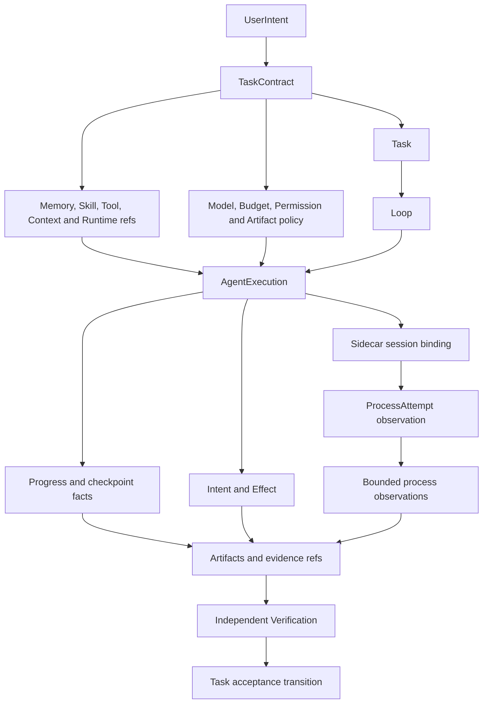

# Personal Authority, Data and Recovery

- Status: informative target/design composition
- Change class: owner-approved `product-semantic + structural` documentation
- Normative behavior: [Task/Loop/Verification](../../../docs/standards/task-loop-verification.md),
  [Intent/Effect](../../../docs/standards/intent-effect-idempotency.md),
  [authorization](../../../docs/standards/authn-authz-capability.md), and
  [event/watch](../../../docs/standards/event-audit-watch.md)

## 1. Sole authority boundary

The Rust daemon is the sole authority writer. Pi, Agent adapters, sidecars, the
CLI, SDK, Shell, schedulers, process supervisors, executors, Provider fixtures
and tests may submit requests, candidates or observations; none may directly
mutate authority SQLite or advance Task, resource-domain, Effect,
`AgentExecution` or Verification state.

Every authority mutation is evaluated against:

- authenticated principal and isolated Task or management channel;
- capability scope and current policy;
- object/projection version and CAS guard;
- Task, Loop, AgentInstance, sidecar and `AgentExecution` epoch;
- package, adapter, protocol and immutable revision digests;
- deadline, retry, step, token and cost ceilings;
- stable idempotency identity and current Effect state;
- typed domain and registered state-transition rules.

The common resource projection does not weaken these checks. It dispatches to
the owning domain service, which keeps its own schema and lifecycle. There is no
generic resource row or universal transition function that can bypass a typed
domain guard.

### Personal local governance-root provisioning

For the first authenticated Task-chain mutation of a local Personal principal,
the daemon may provision a durable local governance-root context rather than
requiring a separately pre-created external governance object. The daemon
creates canonical immutable owner, authority, and ResourceScope anchors,
persists their identity/digest binding before the governed mutation, and binds
the context to that authenticated principal. Subsequent mutations reload the
same context; missing, corrupt, ambiguous, or principal-mismatched state fails
closed. This narrow bootstrap rule does not let Pi, CLI, SDK, Shell, sidecar,
or any request body supply governance facts, a writer lease, actor chain, or
governed object identity.

## 2. Durable relationships and observation identities

Agent package, installation, registration, instance, sidecar session, OS
process and `AgentExecution` stay distinct. `ProcessAttempt` is an
implementation-private daemon observation used to correlate spawn, exit,
bounded streams and reconciliation. It is not a new authority domain, a public
resource lifecycle or evidence of logical success.

## 3. Admission, resource bindings and budgets

The daemon persists raw intent before probabilistic interpretation. The
canonical preview binds exact domain resource IDs, revision digests, expected
versions, capability impact, budget ceilings, acceptance criteria and an
idempotency identity. Admission rejects any digest, scope or version mismatch
before a Task is created or superseded.

A `TaskContract` references independently governed resources. For example, it
may pin one `SkillRevision`, authorize an admitted Memory record, select a
`ContextView`, bind an exact Tool descriptor and choose one Agent instance. The
Task does not copy those resources into a second schema or take over their
lifecycles.

Budget checks occur at admission, scheduling and immediately before dispatch.
Reaching an inclusive deadline/retry/step/cost ceiling prevents another
dispatch. The stop fact must be durably recorded; a worker return value or
sidecar observation cannot substitute for it.

## 4. Control-plane and data-plane separation

The daemon-created private framed AKP transport carries two logical planes:

| Plane | Content | Authority treatment |
|---|---|---|
| Control plane | handshake; package, adapter, AgentInstance and `AgentExecution` identities; protocol digest; lifecycle messages; current budget/capability view; epoch | exact digest and epoch checks precede every accepted message; stale or drifted sessions fail closed |
| Data plane | Context and Skill references; Memory and Tool candidates; progress; artifact and CAS references; bounded event/stdout/stderr streams | all content remains scoped candidate/observation data until deterministic validation and persistence |

The planes do not carry Provider/user secret material. A capability snapshot is
not a transferable bearer and cannot be expanded by the sidecar. A data-plane
Tool candidate is not a permit to execute.

## 5. Persist-before-dispatch and mutation permits

For every external mutating Tool operation:

1. validate the Tool descriptor, input digest, target, capability, Task,
   execution, sidecar session, budget and current epoch;
2. mint and persist the raw Intent;
3. persist an Effect with stable operation, target, original idempotency key,
   dispatch identity and fencing identity;
4. atomically commit the outbox/dispatch fact before external I/O;
5. issue a narrow, short-lived permit bound to that persisted Effect and the
   exact current sidecar/execution epoch;
6. let the executor dispatch only the permitted operation;
7. persist a receipt observation or an unknown outcome;
8. query/reconcile using the original identity and key;
9. close, compensate or quarantine the Effect under daemon authority;
10. make closed Effect facts available to independent verification.

The sidecar cannot mint, renew or broaden the permit. A receipt, HTTP success,
process exit, Provider response or Pi `agent_end` is neither an authoritative
Effect commit nor Task completion. If a crash occurs after external mutation
but before receipt persistence, recovery reconciles the original Effect; it
does not create a new Effect or idempotency key.

## 6. Scheduler, fencing and sidecar supervision

Scheduler eligibility is durable. A lease records owner, epoch, expiry,
next-eligible time, attempt count and cancellation state. Acquisition is a
transactional CAS. An expired lease may be reclaimed only under a strictly
higher epoch; old workers and sidecars remain stale even if their OS processes
are still alive.

Each active `AgentInstance` has one current logical sidecar session. The daemon
owns session creation, private transport, exact adapter/protocol digest binding,
epoch and termination. Daemon restart closes the old private transport or uses
parent-death supervision so the old sidecar exits. A newly loaded authority
epoch creates a new sidecar; the daemon never adopts an orphan as current.

Canonical wall-clock samples may be clamped to a monotonic floor for scheduling
decisions, while recorded timestamps preserve their own clock-domain meaning.
A clock rollback must not create a second eligible dispatch.

## 7. Completion and evidence

Sidecars and executors report observations plus governed artifact references. A
separate verifier evaluates each acceptance criterion against immutable evidence
digests and current authority state. Task completion requires:

- all required criteria have an accepted result;
- no required Effect is open or outcome-unknown;
- no stale execution, sidecar or adapter digest supplied the accepted result;
- resource bindings and capability remain valid for the accepted evidence;
- the acceptance transition succeeds under current version and epoch guards.

False completion must remain impossible even when a ProcessAttempt exits zero,
Pi reports `agent_end`, or an external system returns a success receipt.

## 8. Ordered recovery protocol

```mermaid
flowchart LR
  restart["Daemon restart or recovery trigger"] --> reload["Reload durable authority and domain facts"]
  reload --> fence["Fence old sidecars, leases and executions"]
  fence --> reconcile["Reconcile pending or unknown Effects with original keys"]
  reconcile --> reauthorize["Reauthorize current scope, capability and budget"]
  reauthorize --> rebuildContext["Rebuild Context from governed refs and current versions"]
  rebuildContext --> restartSidecar["Start a new digest-pinned sidecar at the new epoch"]
  restartSidecar --> decide["Resume safely or quarantine"]
```

The order is mandatory:

1. reload durable Task, resource-domain, scheduler, Effect and checkpoint facts;
2. establish the recovery epoch and fence all prior sidecars and executions;
3. reconcile every pending/unknown Effect with its original identity;
4. reauthorize current policy, capability, scope and remaining budget;
5. rebuild Context and validate pinned Memory/Skill/Tool/Runtime references
   plus the cross-cutting Model and policy bindings;
6. start a fresh sidecar session with exact package, adapter and protocol
   digests;
7. resume only when all checks are current, otherwise quarantine with an
   actionable blocked reason.

Stale epoch, stale capability, revoked binding, package drift, adapter digest
drift or protocol digest drift fails closed. Recovery never blindly redispatches
an unknown mutation and never restores a sidecar merely because its process is
still running. If safe closure cannot be proved, the Task remains
blocked/suspended or quarantined.

## 9. Data and secret placement

| Data | Approved location | Forbidden locations |
|---|---|---|
| Provider/user secret | desktop Secret Service or approved headless encrypted vault behind `SecretStore` | service unit/credential material, environment, argv, ordinary config, SQLite, sidecar frames, logs, CI and evidence |
| Secret reference | bounded non-secret authority/config record | Agent display and support bundle unless safely redacted |
| Authority and domain state/events | daemon-owned SQLite WAL | direct client, Agent or sidecar writes |
| Agent package bytes | private immutable installation root | unverified active paths or ambient Agent search paths |
| Context and Memory content | governed stores with provenance, scope and version | model-owned untracked cache as source of truth |
| Skill revisions | immutable content-addressed store with provenance | mutable Task-local copies presented as the same revision |
| Artifacts/evidence | governed content-addressed store | receipt-only completion shortcuts |
| Acquisition lock | signed non-secret installation record | raw credentials or mutable package paths |

Backup/restore includes eligible user data and authority metadata according to
versioned migration rules but excludes secret material. Restore revalidates
schemas, resource bindings, installations, sidecar compatibility and migrations
before dispatch is re-enabled.

The headless vault starts locked and permits only read-only diagnostic and
unlock operations until an SSH TTY unlock succeeds. Optional unattended mode
may consume encrypted vault-unlock material from a systemd credential, but the
credential must never contain a Provider/user secret. Unlock does not grant
Agent, Tool, workspace or network capability.

## 10. Target and evidence boundaries

This recovery and sidecar composition is target/design, not a statement that it
has been implemented or tested. Local, fixture, WSL and ordinary CI tests may
prove implementation behavior but do not advance B01, B09, `GMVP-LINUX`, a
release or Profile unless a preregistered campaign explicitly includes them.
Current facts remain in [PROGRESS.md](../../../docs/plan/PROGRESS.md).
