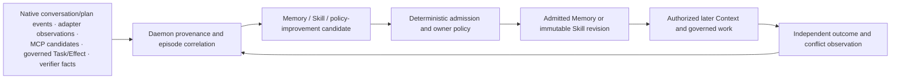

# Personal Learning Loop

- Status: informative current/target alignment
- Related:
  AXIOMS P3,
  [ADR-0042](../../../docs/adr/0042-personal-three-pillar-engineering.md),
  [Agent adapter architecture](agent-adapter-contract.md), and
  [Authority, data and recovery](authority-data-and-recovery.md)

## 1. Current delivered loop

### Now

P8-T06 delivered the first cross-episode learning path:

- verified success/failure experience can produce digest-bound Memory and
  Skill candidates;
- Memory candidates use the existing daemon admission path;
- Skill candidates use immutable import/bind/revoke governance;
- source identity and failure context remain attached;
- direct promotion and self-authorization fail closed; and
- forgetting/revocation remains explicit and non-resurrecting.

P8-T06 is delivered. Its current implementation scope remains candidate
planning and daemon admission, not autonomous self-modification or a
Gate/Profile claim.

## 2. Authority invariant

Agents, Shells, adapters, native conversations, MCP servers, harnesses, and
models may propose lessons. Only the daemon may:

- decide whether a candidate is admissible;
- create or revise durable Memory/Skill authority;
- bind admitted knowledge to scope and purpose;
- revoke, expire, forget, or tombstone it;
- make it eligible for later Context; and
- use independent evidence to decide whether the original work succeeded.

A fluent reflection, native "lesson learned," MCP prompt, Provider response, or
high reward is not an admission decision.

## 3. Personal 2.0 input model

### 2.0 target

The target broadens eligible **inputs**, not authority:

- origin-native conversation and native-plan observations;
- adapter capability, interruption, approval, and runtime observations;
- admitted Goal -> Plan revision -> Task -> Attempt, assignment, and handoff
  facts;
- Effect reconciliation and independent verification;
- MCP-advertised prompt/resource/tool candidates and their governed outcomes;
- federated conflict/writeback outcomes; and
- owner corrections and explicit feedback.

Every input keeps source identity, source position/coverage when available,
observation freshness, and links to governed work. Missing history or sequence
gaps remain explicit.

## 4. Native conversations remain origin-owned

Agent connection establishes the explicit observation scope. Automatic
observation of a native conversation is limited to that scope, with no
speculative/global scan or surprise per-session enrollment, and does not copy
history into Memory, Context, Skill, Goal, Plan, or Task. Existing Core
Conversation/ConversationBinding identities are reused/referenced where
applicable; vendor-native IDs remain opaque bindings and additional projection
state stays Personal-private (ADR-0058); it is not a public Core schema.

Before admission, the daemon evaluates:

- whether the source was authorized for this purpose;
- whether the observation is complete enough to support the lesson;
- whether the Task/Effect/verification outcome is current;
- whether the proposed scope is narrower than or equal to the source scope;
- whether sensitive content, secrets, or third-party data is excluded;
- whether an existing Memory/Skill conflicts;
- retention, expiry, revocation, and forget behavior; and
- whether the lesson is generalizable or should remain episode-local.

Native conversation close, fork, or deletion does not silently delete an
already admitted Personal object, but provenance and origin availability remain
visible. Origin deletion requests and Personal retention policy require an
explicit reconcile decision; no last-write-wins rule applies.

## 5. Goal, Plan, Task, and multi-Agent learning

In the 2.0 target, lessons may be scoped to:

- one native conversation;
- one Task or assignment;
- one Plan revision;
- one Goal;
- one Agent/vendor adapter;
- one MCP server/binding;
- one workspace; or
- owner-wide use where policy explicitly permits.

An Agent may propose a Plan improvement or reassignment lesson, but the learning
loop cannot revise the daemon Plan or multi-Agent graph. It produces a
candidate for a separate governed Plan/admission decision.

Handoff summaries are not automatically durable knowledge. The receiving
Agent's success does not validate the source Agent's lesson unless independent
evidence supports the claimed relationship.

Goal/Plan/Task/Attempt-scoped learning is **Requires-backend**. Only a new
public machine surface conditionally requires P10-T02/Lane-CTR.

## 6. MCP learning boundary

MCP advertisements and results can inform candidates, but:

- an advertised prompt is not automatically a Skill;
- an advertised resource is not automatically Memory or Context;
- an advertised tool is not automatically registered or authorized;
- a successful MCP call is not verification; and
- installation/config projection does not grant broader learning scope.

Personal may learn that a specific advertisement was useful, unavailable,
unsafe, stale, or conflict-prone. Any resulting Tool/Context/Memory/Skill or
binding change still follows its owning domain's admission and confirmation
rules.

## 7. Federated writeback and conflict

The default learning output is Personal-owned candidate/admitted authority, not
origin writeback. If the owner asks to write a learned rule, prompt, binding,
or configuration back to an Agent/MCP origin, that is a separate external
mutation:

- preview exact source, target, preimage, expected origin revision, and scope;
- persist Intent/Effect before dispatch;
- fail closed on concurrent origin change;
- verify the post-state;
- preserve rollback or compensation; and
- retain both the learning admission and writeback provenance.

There is no last-write-wins conflict resolution. Administrative
preauthorization may execute/reconcile automatically only within an unchanged
exact daemon grant/risk policy. Every write retains Intent/Effect. New, broader,
destructive, or conflicted capability, target, Provider, network, secret, or
retention scope requires preview and confirmation.

## 8. Secrets and privacy

Learning inputs and outputs exclude raw Provider/user/native tokens, Secret
Store material, browser credential data, resolvable secret references, and
credential-import source contents. Redaction after persistence is insufficient;
secret-bearing candidates are refused before durable admission.

The learning loop does not retain raw prompts/completions merely to improve
future behavior. Any retained content must have an explicit admitted purpose,
scope, provenance, retention, and forget/revoke path.

## 9. Evaluation and non-claims

Learning quality is judged against later independent outcomes, conflicts,
reuse, correction, and revocation—not self-reported usefulness. A candidate
count, admission rate, Agent preference, or local sample does not establish
benefit.

| Capability | Status |
|---|---|
| Memory/Skill failure-lesson candidates and daemon admission wiring | **Now** |
| Native conversation/adapter/MCP provenance ingestion | **Requires-backend** |
| Goal/Plan/Task/Attempt/assignment-scoped learning | **Requires-backend**; P10-T02/Lane-CTR only for new public semantics |
| Federated conflict-aware learning writeback | **Requires-backend** |
| Automatic self-authorizing learning | **Forbidden target** |

No learning metric automatically creates a Gate, release, Profile, or
Agent-benefit claim.
