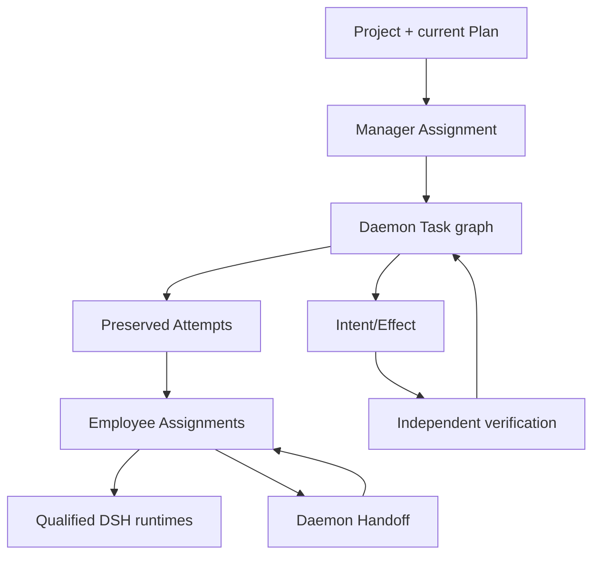

# Project manager and digital-employee orchestration

- Status: Personal 2.0 target; not a multi-engine benefit claim
- Preserved decision:
  [ADR-0044](../../../docs/adr/0044-personal-multi-agent-mainline.md)
- Current decision:
  [ADR-0059](../../../docs/adr/0059-personal-2-0-opc-project-runtime-and-memory-boundary.md)
- Project model: [Project, Role, and Employee](project-role-employee.md)

## 1. Current and target boundary

Current multiple adapters, Provider bindings, conversations, or processes do
not form a daemon-owned collaboration graph. Pi remains the only Linux 1.0
qualified Agent. Personal 2.0's first product path uses multiple digital
employees primarily over one qualified managed DSH Agent/runtime class.

"Multi-agent" here means manager/specialist work decomposition and explicit
daemon arbitration. It does not promise multiple external engines or better
outcomes.

## 2. Authority graph

The daemon owns Plan revisions, Tasks, Attempts, Assignment state, Handoffs,
Context/resource/Provider bindings, budgets, scheduling, fencing, Effects,
evidence, verification, and acceptance. Manager/employee/DSH output can propose
every fact but cannot commit it.

## 3. Manager-led work

The current manager decomposes approved goals into bounded Tasks and assigns
responsibility. Within the approved envelope, policy may admit changes to
subgoals, Task ordering/frequency, and member responsibility. Primary goal,
team, budget, Provider, tools, permissions, or external-action rules require a
new Plan/Project revision and Owner confirmation.

Each Task has exact criteria, scope, budget, Context, employee/runtime binding,
and current eligibility. Each retry/fork creates a new Attempt and preserves
earlier failures/evidence.

## 4. Handoff

A Handoff records:

- source and target employee/Assignment;
- Project/Goal/Plan/Task/Attempt;
- bounded work and current authority;
- artifacts and Context references;
- open/unknown Effects;
- remaining budget/capability;
- ready/blocked reason and verification obligation.

The destination receives only reauthorized references. Raw Conversation history
and secrets are not copied wholesale. Agent acknowledgement is an observation;
the daemon decides eligibility.

## 5. Failure containment

Upstream failure blocks dependent work rather than cascading. Reassignment
fences the prior runtime/Attempt. Unknown Effects reconcile before retry or
handoff. A replacement DSH process receives fresh bounded Context and cannot
claim prior authority.

Agent disagreement is a candidate set, not a vote. Manager agreement,
self-critique, process exit, DSH checkpoint, Provider success, and all employees
agreeing remain insufficient for completion.

## 6. Budgets and Provider binding

Project, member, and Task envelopes attenuate; child work cannot mint budget.
Each Attempt materializes the effective global/Project/employee/Task Provider
binding. Changes to defaults do not reroute running work without explicit
rebind/restart.

## 7. Future engines

Hermes, Codex, Cursor, and other adapter candidates can enter only after
independent qualification. DSH/Pi evidence does not transfer. A NO-GO for one
engine is legitimate and does not remove manager/employee architecture.

## 8. Non-claims

Project/employee orchestration, handoff, budgets, and UI remain
**Requires-backend**. This chapter creates no B11, support, Gate, release,
Profile, parallelism benefit, or business outcome claim.
