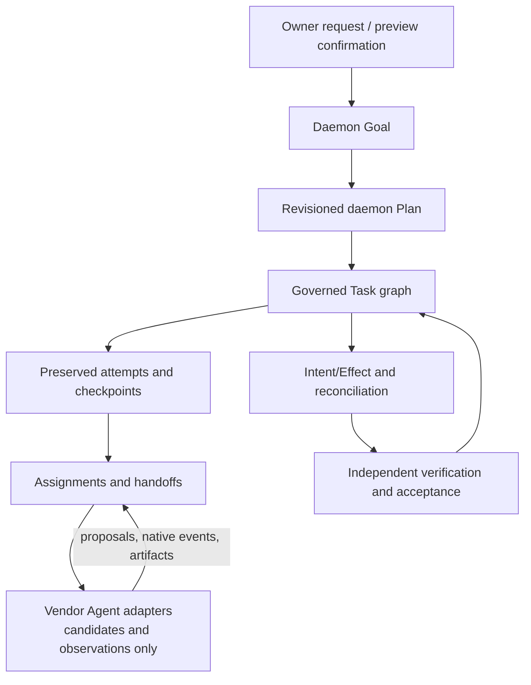

# Personal Multi-Agent Orchestration

- Status: informative current/target alignment
- Decision:
  [ADR-0044](../../../docs/adr/0044-personal-multi-agent-mainline.md)
- Adapter boundary:
  [Agent adapter architecture](agent-adapter-contract.md)
- Authority/recovery:
  [Authority, data and recovery](authority-data-and-recovery.md)

## 1. Current boundary

### Now

Multi-Agent orchestration is an adopted Personal design mainline, but it is not
a Linux 1.0 capability or claim. Pi remains the only Agent qualified for Linux
1.0. Delivered adapter registration, Codex fixture qualification, installed dsh
integration, multiple Provider bindings, or multiple native conversations do
not by themselves create a daemon-owned multi-Agent graph.

Current native sessions are origin-owned observations. No UI or adapter may
label concurrent Agent activity as one governed collaboration unless the daemon
has explicitly admitted and recorded that relationship.

## 2. Target authority model

### 2.0 target

The daemon owns:

- Goal identity and scope;
- every Plan revision and its relationship to the prior revision;
- the Task graph and dependency eligibility;
- preserved attempt/checkpoint lineage, including failed and superseded
  branches;
- assignment, reassignment, and handoff decisions;
- Agent/runtime/resource/Provider bindings;
- per-Goal, per-Plan, per-Task, per-attempt, and per-assignment budgets;
- scheduling, leases, fencing, and no-progress decisions;
- persisted Intent/Effect and reconciliation;
- evidence requests, verification, and acceptance; and
- the provenance-preserving progress projection.

Agents, native plans, Shell interpretations, and adapter events may propose any
of those facts. They may not commit them.

## 3. Native sessions and admission

A native conversation can exist before, during, or after governed work. It
remains the origin's content and lifecycle.

Owner request/confirmation followed by daemon admission is required to create
Personal work:

1. one or more native conversations are selected by opaque origin identity and
   lineage and linked to existing Core Conversation/ConversationBinding where
   applicable;
2. adapters provide bounded observations, capability conditions, native plans,
   attachments, history coverage, and unresolved gaps;
3. the daemon prepares an exact Goal and Plan candidate with resource,
   Provider, budget, and acceptance implications;
4. the daemon issues the preview and the owner confirms it; and
5. the daemon admits the Goal and Plan revision, creates Tasks and their
   attempts, then establishes initial assignments and handoff boundaries.

Agent connection establishes the observation scope used by the adapters.
Automatic native-session observation is limited to that exact scope; there is
no speculative/global scan or surprise per-session enrollment. Vendor-native
IDs remain opaque bindings, and extra projection state is Personal-private
until P10-T02 decides otherwise.

Subsequent native conversation forks do not automatically fork the Personal
Plan. Native steering does not reassign a Task. A native "done" does not
complete a Task.

Goal/Plan/Task/Attempt authority and native-conversation admission composition
are **Requires-backend**. Only a new public machine surface conditionally
requires P10-T02/Lane-CTR; a Personal-private projection may not.

## 4. Graph and assignment semantics

The target graph is governed work, not a chat topology:

- Plan revisions explain why the Task graph changed.
- Each Task has exact scope, resource bindings, budget, acceptance criteria,
  and current eligibility.
- Each attempt preserves the execution/recovery branch and evidence available
  at that point. Retry or fork from checkpoint creates a new attempt and never
  erases the prior attempt.
- An assignment names one governed Task/attempt, one Agent instance, one
  adapter/runtime attachment, current Context, and bounded capability.
- Reassignment fences the old assignment before a new one can dispatch.
- A handoff is daemon-issued and provenance-preserving; Agents do not transfer
  authority or leases to each other.
- Shared artifacts, Context, Memory, Skills, Tools, MCP candidates, and native
  attachments are reauthorized for the receiving assignment.
- Parallel proposals may coexist, but only a daemon-authorized Effect path can
  mutate an external target.

The exact Goal/Plan graph machine is intentionally not defined here. It
requires P10-T02/Lane-CTR only if selected as a new public machine surface.

## 5. Collaboration patterns

The architecture supports these product patterns without changing the authority
model:

| Pattern | Daemon responsibility | Agent responsibility |
|---|---|---|
| Primary plus helpers | create bounded helper Tasks, assign budget/scope, and decide which candidate advances | produce bounded proposals or artifacts |
| Parallel alternatives | isolate assignments and shared-effect keys; preserve all candidates and choose deterministically or through owner confirmation followed by daemon admission | explore alternatives without committing shared state |
| Sequential handoff | verify handoff prerequisites, reauthorize shared inputs, fence prior assignment, and issue the next assignment | summarize/propose handoff material with provenance |
| Specialist verification | isolate verifier inputs and writable surface from the actor | produce evidence or an independent disposition only |
| Recovery replacement | preserve Task/Effect authority, fence stale runtime, and attach a replacement Agent under a new assignment | resume from supplied governed Context without claiming prior authority |

Agent disagreement is a candidate set, not a vote that can override policy.
No Agent majority can authorize capability, expand budget, close an Effect, or
accept a Task.

## 6. Handoff contract

A conceptual handoff includes:

- source and destination assignment identity;
- Plan revision and Task dependency context;
- bounded Context/artifact/native-conversation references;
- explicit provenance, truncation, uncertainty, and unresolved questions;
- remaining budget and capability bounds;
- open or outcome-unknown Effects;
- verification obligations; and
- whether owner confirmation is required.

The destination Agent receives only the references and capabilities the daemon
reauthorizes. Conversation history is not copied wholesale by default. Raw
secrets never enter handoff content.

A handoff acknowledgement is an observation. The daemon decides whether the
handoff is current and whether the destination becomes eligible.

## 7. Provider and resource binding

Provider selection can be global, Agent-scoped, or conversation-scoped, but an
admitted assignment is pinned to its effective daemon proxy binding. Changing
the default does not reroute running work. Rebinding current work requires an
explicit daemon decision with current versions and impact review.

MCP is a target seventh resource family, not an orchestration bypass.
MCP-advertised tools, protocol resources, and prompts are candidates into Tool,
Context, and Skill respectively. Each assignment receives only daemon-admitted
bindings. Installing an MCP server or projecting its configuration into an
Agent grants no authority.

## 8. Budgets, Effects, and completion

The daemon allocates and enforces budgets across the graph. Child/helper work
cannot mint additional budget or capability. Inclusive ceilings stop new
dispatch and produce a governed blocker/escalation fact rather than an Agent
narrative.

Every external mutation remains persist-before-dispatch under a stable
Intent/Effect identity. Parallel Agents cannot race separate identities against
one logical operation. Unknown outcomes are reconciled before reassignment,
retry, compensation, or acceptance.

Completion remains criterion-specific and independently verified. Native Agent
completion, process exit, handoff acceptance, Provider success, MCP result, or
all Agents agreeing is insufficient.

## 9. Progress and recovery

The Control Plane composes:

- native events per conversation;
- adapter/process observations;
- daemon Goal -> Plan revision -> Task -> Attempt, assignment, and handoff authority;
- Effect reconciliation in the Governed lane; and
- independent verification/daemon acceptance in the Verified lane.

Each item keeps provenance. Missing cross-source order is explicit; no fake
single lifecycle is synthesized.

Detach, interrupt, cancel, pause, restart, fork, reassignment, and compensating
undo remain distinct. A failed Agent can be detached or replaced without
rewriting the Goal -> Plan revision -> Task -> Attempt history. Compensation
creates a new governed mutation and preserves the original Effect.

## 10. Isolation and enablement

- Multi-Agent collaboration is fail-closed and off until the owner enables the
  exact governed path.
- Every participating Agent is independently registered and qualified for its
  declared use; evidence does not transfer.
- Adapter sessions, native conversations, runtime attachments, assignments,
  caches, cursors, and retry identities remain separate.
- Shared Context and resources are reauthorized per receiving assignment.
- Capability expansion, new external target, new Provider scope, or broader MCP
  grant requires confirmation.
- A NO-GO for one Agent or campaign remains legitimate and does not remove the
  mainline architecture.

## 11. Current/target boundary

| Capability | Status |
|---|---|
| Adapter registration and candidate-only boundary | **Now** |
| Multiple independently observed Agent/native sessions | **Now where integrations expose them**, not orchestration |
| Daemon Goal/Plan/Task/Attempt graph | **Requires-backend**; P10-T02/Lane-CTR only for new public semantics |
| Assignment, handoff, graph budgets, and multi-Agent scheduling | **Requires-backend**; public shapes conditionally require Lane-CTR |
| Multi-Agent Control Plane progress and controls | **Requires-backend** |
| Linux 1.0 multi-Agent claim | **Not a target** |

This chapter creates no B11, Gate, release, Profile, or Agent-benefit claim.
