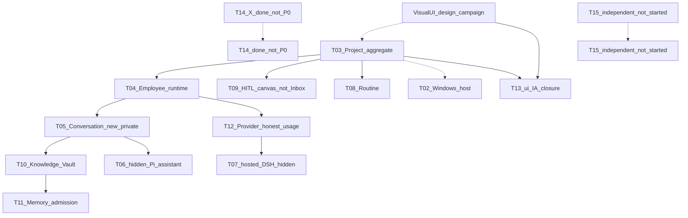

# CognitiveOS Personal 2.0.0 development-prep index

> Documentation-only index. Not implementation, not thaw, not Gate, not a P11 claim.
> Product name: **CognitiveOS Personal 2.0.0** (os-personal 2.0.0). **v9 is a
> historical canvas filename**, not a product version. Canvas v9 is the
> **frozen design prototype**, not the product. Product origin is daemon `/ui/`.
> HEAD at writing: see `PROGRESS.md` Current snapshot. Evaluation routing **OFF**.
> The overlapping `DOC-PERSONAL-2.0.0/dev-prep` lease is **closed** (2026-08-31).
> Phase 12 `P12-T01`–`T09` are **done** (merged PR [#302](https://github.com/agentkernel/cognitive-os/pull/302) at `main@3a563e7c`). P12 Remaining = 0.
> `P11-T15` remains independent / not-started. Do not auto-claim T15.

## Identity and sources

| Fact | Pointer |
|---|---|
| Chrome source | Frozen design prototype: `clients/docs/design/opc-2.0/personal-20-opc-e2e-optimized-v9.canvas.tsx` (not the product) |
| Product origin | daemon-served `/ui/` (`clients/pc/web/` same-origin). Vite is not the product origin |
| Scene → daemon map | [personal-2.0-opc-v9-implementation-mapping.md](personal-2.0-opc-v9-implementation-mapping.md) (historical path name contains v9; rewritten to post-P12 facts) |
| Design-Agent / journey assessment | [13-personal-20-agent-design-difficulty-and-journey-assessment.md](../../../clients/docs/design/opc-2.0/13-personal-20-agent-design-difficulty-and-journey-assessment.md) (2026-08-30; hypothesis; not a P11 claim) |
| Formal plan rewrite | `docs/plan/PERSONAL-DEVELOPMENT-PLAN.md` Phase 11 + **Phase 12** tables + typed deps + [plan.md](../../../docs/plan/plan.md) `P11-T02`…`T15` and `P12-T01`…`T09` cards |
| First implementation knife (Phase 11) | **`P11-T03` Project aggregate walking skeleton** — done; not a full `/ui/` page |
| First implementation knife (Phase 12) | **`P12-T01`–`T09` done**; merged PR [#302](https://github.com/agentkernel/cognitive-os/pull/302) at `main@3a563e7c`. Dual Track **Now / hypothesis chrome** on `/ui/`. Not T15; not pixel-replica; NVDA/200%/host-theme **not-run** |
| T02 host walking skeleton | **`P11-T02` done** (merged PR [#292](https://github.com/agentkernel/cognitive-os/pull/292)); native install/tray/sleep/SecretStore E2E remains `not-run` |
| T14 X connector walking skeleton | **`P11-T14` done** (merged PR [#293](https://github.com/agentkernel/cognitive-os/pull/293)); live X API E2E remains `not-run`; not P0 hero |
| Environment names | only [PERSONAL-TEST-ENVIRONMENTS.md](../../../docs/plan/PERSONAL-TEST-ENVIRONMENTS.md); do not invent environments |
| Authority order | [AXIOMS.md](../../../docs/governance/AXIOMS.md) A1–A8 → frozen product facts → core 1.0.0 contracts (this window does not change specs) → mapping → this index |

Design-frozen chrome: **Today / Projects / Knowledge** + bottom **Settings**;
five-step create wizard; members selected then configured; project four
sub-menus; HITL only on the center canvas + Today deep link; chat has no
Approve; `state-lab` = Settings → Advanced, hidden by default. Live `/ui/` L1
is Dual Track OPC chrome (`P11-T13` **done**); Linux 1.0 six-family pages
remain Advanced/secondary. Do not claim complete `/ui/` acceptance. Phase 12
**Remaining = 0**: frozen-prototype default walkable scenes are Dual Track
**Now / hypothesis chrome** on daemon `/ui/` (`P12-T01`–`T09` done). Not
canvas pixel-replica; not 2.1; not T15. Authority remains the P11 walking
skeleton: no authority → honest empty / Requires-backend; zero fake Create /
Activate / Approve.

Authority object English id = **Employee**. Product chrome may still say
**Member Runtime** until post-completion reconciliation.

## Forbidden parallel universes

Do not create or treat as product roots: `personal-v9/`, `os-personal3/`,
`clients/opc-v9/`, `dsh-product/`, `.cursor/rules-v9/`, `AXIOMS-v9.md`,
`V9-DEVELOPMENT-PLAN`, `PROGRESS-v9`, `History/`. Do not rewrite
`clients/pc/web`, canvas source, or `core/specs|crates|conformance` in this
window. Clones stay in ignored `/artifacts/`; never `git add` them.

## D2 — rules / AGENTS alignment (executed)

Full Grep of `.cursor/rules/*.mdc` and `AGENTS.md` for current-chrome six-family
IA, Team/Inbox as first-level destinations, or “v9” as the product name:
**no hits**. Adapter rules already route to Operating Model / axioms / handbook
sync. **No adapter rewrite.** Architecture README mermaid first-level nav is
Today / Projects / Knowledge (Team/Inbox removed in `DOC-P12-ALIGN`). Chapter
bodies that still presented Team/Inbox as 2.0.0 L1 were aligned in
`DOC-P12-DEBT`; Dual Track L1 is Today / Projects / Knowledge + Settings.

## Testing and environment (hard gates)

This prep window’s **only close gate** is documentation consistency
(`check:consistency`, handbook suite, docs-sync, `git diff --check`). No
runtime acceptance. A missing three-column block on any `P11-T02`…`T15` card
means this prep window is unfinished.

Every later implementation slice is **not done** unless all four hold:

1. It produces a user-visible path, a durable authority fact, a real
   integration, or a closable correctness property.
2. A focused failure-first or negative test plus the card’s registered
   supported validation **actually ran** in that environment.
3. The result is appended immediately to that task’s **single** running report
   (`TEST-REPORT-INCREMENTAL-01`: `pass` / `fail` / `partial` / `not-run` /
   `not_available` + environment ID + exact revision) before the next unit.
4. The next knife prefers a real caller or durable authority outcome; no
   consecutive helper-only stacking.

`DEV-WIN-GNU-01` linker exit 121 (`RUST-LINK-DEV-WIN-GNU-01`) and PowerShell
rejecting `&&`/`||` (`COMMAND-SHELL-PS51`) are environment / `not-run`, never
product failure. A6: do not weaken contracts or negatives to make a cell run.
A7: local / fixture / WSL / ordinary CI do not promote Gate / release /
Profile. **`not-run` is never pass.**

Every `P11-T02`…`T15` card must contain:

| Column | Must state |
|---|---|
| **validation environment** | Registered names only. Default: `DEV-WIN-GNU-01` (fmt/docs/TS only; no Rust link); authority/Rust: `CI-UBUNTU-01` and task-required `CI-WINDOWS-MSVC-01`; native daemon/store: pushed exact-revision `DEV-LINUX-NATIVE-01`. `B01-DESKTOP-002` / B01-W are **preregistered campaign only**, not 2.0 daily defaults. Unqualified `DEV-WINDOWS-NATIVE-OPC-01` ⇒ T02/T07 native E2E = `Requires-environment` / `not-run`. |
| **关闭门** | A decidable sentence for slice `done`: which 2.0.0 authority/surface was tested. Documentation-only must say so. |
| **漂移检测负例** | At least the card-relevant subset of: true Project/Employee not a Task-row impersonation; no authority ⇒ empty/unavailable, no fake buttons; completion ≠ model text / HTTP 200 / `agent_end`; chat has no Approve, HITL only on canvas; unknown cost ≠ 0; cross-project write fails; unconfirmed activate fails; secret never in logs/argv/SQLite/chat/DOM. T05/T10 also: projection/retrieval over-privilege and secret-shape. |

Stage defaults (do not invent environments):

- This prep window: consistency / contract; no runtime.
- **T03 / T04**: Project/Employee authority tests → `CI-UBUNTU-01` /
  `CI-WINDOWS-MSVC-01` (+ exact-revision `DEV-LINUX-NATIVE-01` when needed).
- **T05 / T10**: projection/retrieval negatives → CI; host E2E unqualified ⇒
  `not-run`.
- Dual Track UI: contract mock + no-authority empty states; product origin =
  daemon `/ui/`; Vite is not the product.
- **T13**: IA replacement; NVDA / 200% layout / host-theme contrast **hung**
  (`not-run`); full `/ui/` is not pre-accepted.
- **T02 / T07**: `Requires-environment`; unqualified native host ⇒ `not-run`.
  T02 walking skeleton (v34 + `host.*`) is on `main`; native E2E is still `not-run`.
- **T14**: walking skeleton (v35 + `connector/x.*`) is on `main`; live X API E2E is still `not-run`; not P0 hero.
- Gate / release / B01: independent campaign; not slice green.

### Owner local viewing (later implementation windows with guest `/ui/`)

Default: owner reviews in the **local** browser, not only the VM desktop.
Confirm the guest daemon port, then on `DEV-WIN-GNU-01` PowerShell (typical
owner-ops `48681`; use `cognitive daemon status` if different):

```powershell
ssh -J wuz@192.168.1.2 -L 48681:127.0.0.1:48681 -L 3080:127.0.0.1:3080 hal9001@192.168.123.160
```

Keep the session open. Open `http://127.0.0.1:48681/ui/` and
`http://127.0.0.1:3080/`. Paste the runtime management bootstrap secret from
the guest `local-bootstrap.secret` into the UI gate — never a Provider key,
never into this prompt, chat, logs, or evidence. After daemon restart, restart
`cognitive dsh web`. This prep window does not deploy a guest.

## In-repo foundation (name, do not rebuild)

Reuse: SessionGate; hash `/ui/`; Task / Intent / Effect / independent
verification; Provider Control Plane; Pi client; dsh Path B (hidden engine
path, not a visible Installed Agent chrome); SecretStore. **Do not conclude
“therefore heartbeat writes authority.”**

## D4 — transferable modules (cloned; not in Git)

Clones live only under ignored
`artifacts/personal-2.0.0-dev-prep/` (plus a duplicate `paperclipai-paperclip`
tree from an earlier probe; same HEAD). **Forbidden:** `git add`, unknown
installs, impersonating npm packages.
`https://github.com/getpaperclipai/paperclip` HEAD **404** — do not clone, do
not install.

| Repo | HEAD probe | Clone HEAD (short) | They do | Why not copy authority | Transferable **paths** | Use? |
|---|---|---|---|---|---|---|
| [deepseek-ai/deepseek-harness](https://github.com/deepseek-ai/deepseek-harness) | 200 | `cd5ef81` | Cordis plugin harness; `apps/web` product UI; sandbox/session plugins | Harness is not the daemon writer (A1). Session log ≠ Task completion (A4). Chat approval is Forbidden. | **Use ideas from:** `packages/sandbox/sandbox-policy`, `packages/sandbox/sandbox-local`, `packages/sandbox/sandbox-windows-acl`, `packages/subprocess/subprocess` + `subprocess-local` + `win32-process`, `packages/session/session-persistence-jsonl`, `packages/session/session-projection`. **Do not port:** `apps/web`, plugin store / `dsh-plugin` discovery, in-process loop as authority, harness approval as product HITL. | Narrow T07 isolation/event-log shape only |
| [openai/codex](https://github.com/openai/codex) | 200 | `4210c08` | Local CLI agent; `codex-rs/memories` read/write; `message-history`; sandboxes | Not an optional Member engine or store SKU | **Reference:** `codex-rs/memories/{read,write}`, `codex-rs/message-history`, `codex-rs/thread-store` (session layering). **Do not port:** `codex-rs/exec`, MCP-as-Member, CLI writing SQLite authority. | T05/T11 Memory/session layering reference |
| [paperclipai/paperclip](https://github.com/paperclipai/paperclip) | 200 | `4310b0c` | Company orchestration; `server/`, `packages/adapters`, heartbeat-style runner | RFC-0001 multi-tenant company. Heartbeat must not write authority. Codex/Claude as execution surface Forbidden for 2.0 | **Contrast only.** No path is a Personal authority module. Honest usage unknown≠0 is already in-repo. | **Do not use** as implementation |
| getpaperclipai/paperclip | **404** | not cloned | impersonator | — | — | **Forbidden** |
| [anthropics/claude-code](https://github.com/anthropics/claude-code) | 200 | `f1af9b1` | Terminal coding agent (`Script/`, `plugins/`) | Not Member engine, not store, not chat Approve | None for 2.0 chrome | Unused |
| [SWE-agent/SWE-agent](https://github.com/SWE-agent/SWE-agent) | 200 | `3ea751c` | Issue→patch loop (`sweagent/`) | Auto-fix ≠ independent verification (A4) | None | Unused |
| [All-Hands-AI/OpenHands](https://github.com/All-Hands-AI/OpenHands) | 200 | `f26d734` | Full agent product UI (`src/`, `electron/`, Vite) | Do not embed a third-party dev UI; Vite ≠ product origin | Sandbox **ideas** only if later isolated (`docker/`); not default chrome | Unused for chrome |

Card foundation rows repeat: in-repo SessionGate / hash `/ui/` / Task-Intent-Effect-verification / Provider CP / Pi client / dsh Path B / SecretStore, plus the harness sandbox/subprocess/session-log **ideas** for T07 and Codex memory **ideas** for T05/T11.

## Build order (implementation windows)



- T03 does **not** wait on T02.
- T09 does **not** wait on T08 (HITL is canvas + Today deep link, not a
  first-level Inbox).
- T12 does **not** wait on T07; no member-level budget stop as current chrome;
  unknown cost ≠ 0; member budgets = 2.1 / Deferred.
- T05: **new Personal private version**; do not reinterpret
  `conversation-projection/0.1`; do not open Lane-CTR first.
- T07: **hidden hosted engine**, not visible Installed Agents / native DSH UI /
  engine store.
- T13: Today / Projects / Knowledge + Settings + right assistant. Dual Track
  `clients/pc/web` only after T03 projection/HTTP is stable. Visual UI campaign
  (not a new `P11-T*`, Remaining unchanged) may run parallel with T03 and
  **must** produce visual spec before T13 coding; do not change IA; do not run
  `personal-20-prototype-review` phase 4 canvas regen.
- T06 stays after T05 (hidden Pi is a decided capability).
- T14 walking skeleton is **done** (not P0 hero). T15 remains
  **independent / not-started** and is not the P12 mutex.

## Parallel window path rule

Implementation window A (`P11-T03`) and Visual UI window B must not write the
same paths. T03 owns daemon Project authority / tests / plan evidence.
Visual UI owns design-spec documents only (not `clients/pc/web` product source
until T13 Dual Track is separately leased).

---

## D5 — paste-ready window prompts

Both prompts embed: the four hard gates; `TEST-REPORT-INCREMENTAL-01`;
registered environment names only; A7 / `not-run`≠pass; no fake buttons; owner
local SSH viewing when guest `/ui/` exists. Do **not** paste the bootstrap
secret into the prompt.

### Implementation window A — P11-T03

```text
你在 CognitiveOS Personal 仓库做实现窗口 A：P11-T03 Project 聚合 walking skeleton。

产品：CognitiveOS Personal 2.0.0（v9 只是 canvas 历史文件名）。权威顺序：AXIOMS A1–A8 → personal-2.0-scope + 已定档 chrome → core 1.0.0 合同（不改 specs）→ personal/docs/architecture/personal-2.0-opc-v9-implementation-mapping.md → personal/docs/architecture/personal-2.0.0-dev-prep-index.md。

领取前：读 PROGRESS.md Current snapshot、PARALLEL-LANES 活动表、正式计划 P11-T03 卡（含 validation environment / 关闭门 / 漂移检测负例三栏）。领取 `lease/personal/P11-T03/<purpose>`；一任务一 branch 一 Draft PR 一 lease。不要领取 T02。不要改 canvas。不要把完整 Today 页当本任务。

做：failure-first 负例 → 真 Project 聚合（不是改装 Task 行）。确认-before-activate。Charter/Goal/Metric/Plan revision。Task/Attempt 仍走 Intent/Effect persist-before-dispatch 与独立 verification。无权威则 empty/unavailable，禁止假按钮。

硬门（切片未同时满足不得标 done）：
1. 产出用户可见路径、durable 权威事实、真实集成，或可关闭的正确性性质。
2. focused failure-first/负例 + 卡上登记的 supported validation 已在该环境实际跑过。
3. 按 TEST-REPORT-INCREMENTAL-01 立刻追加进该任务单一 running report（pass/fail/partial/not-run/not_available + 环境 ID + exact revision），再开始下一单元。
4. 下一刀优先接真实 caller 或 durable 权威结果，禁止连续 helper-only。

validation environment：权威/Rust 用 CI-UBUNTU-01 与 CI-WINDOWS-MSVC-01；需要 native daemon/store 时用已 push 的 exact-revision DEV-LINUX-NATIVE-01。DEV-WIN-GNU-01 只做 fmt/docs/TS，禁止 Rust link（RUST-LINK-DEV-WIN-GNU-01；COMMAND-SHELL-PS51 禁止 &&/||）。B01-DESKTOP-002 不是日常开发默认机。A7：本地/fixture/WSL/ordinary CI 不升 Gate/release/Profile。not-run 永远不是 pass。A6：不得为跑通削弱合同或负例。

漂移：真 Project 不是 Task 行冒充；完成 ≠ 模型文本 / HTTP 200 / agent_end；未确认激活失败；跨项目写失败；secret 不进日志/argv/SQLite/聊天/DOM。不要把「本仓已有 heartbeat/dsh」写成「heartbeat 写权威」。可继续联网对照 artifacts/ 中的克隆，但不得漂移 2.0.0 IA 与公理。

有 guest /ui/ 时，owner 默认本机看：先确认 guest daemon 端口，再在 DEV-WIN-GNU-01：
ssh -J wuz@192.168.1.2 -L 48681:127.0.0.1:48681 -L 3080:127.0.0.1:3080 hal9001@192.168.123.160
打开 http://127.0.0.1:48681/ui/ 与 http://127.0.0.1:3080/。Bootstrap secret 只从 guest runtime 粘贴进 UI 门，禁止进入本提示词、聊天、日志、evidence。Daemon 重启后必须重启 cognitive dsh web。
```

### Implementation window B — Visual UI 精修

```text
你在 CognitiveOS Personal 仓库做实现窗口 B：Personal 2.0.0 Visual UI 精修（设计战役，不是新的 P11-T*，不改 Remaining）。

产品：CognitiveOS Personal 2.0.0。Chrome 源：clients/docs/design/opc-2.0/personal-20-opc-e2e-optimized-v9.canvas.tsx（v9 是文件名）。IA 已定档：Today / Projects / Knowledge + 底栏 Settings；HITL 只在中心画布 + Today 深链；聊天无 Approve；state-lab = Settings 高级默认隐藏。禁止改 IA。禁止开假功能。禁止跑 personal-20-prototype-review phase 4 重生 canvas。技能停在 control-plane-redesign-workflow 的 visual/component。

产出：T13 编码前必须交付的视觉规格（Apple-led）。可与 P11-T03 并行。T13 不得与「尚无 Project 权威」并行冒充完成。不要写 clients/pc/web 产品源，除非另有 T13 Dual Track lease；本窗口与 T03 窗口禁止写同一路径。产品源永远是 daemon /ui/，禁止 Vite 冒充。

硬门（文档/规格切片同样适用；文档-only 须在交付物上写明）：
1. 产出用户可见规格路径（不是假按钮清单）。
2. 若有任何验证，必须是卡/战役登记的 supported validation，实际跑过。
3. TEST-REPORT-INCREMENTAL-01：立刻记入单一 running report；not-run 不是 pass。
4. 禁止连续 helper-only 代替可判定视觉规格。

环境：只用登记名。本窗口默认 DEV-WIN-GNU-01 文档/静态；不跑 Rust link。NVDA / 200% 布局 / host-theme contrast 挂单 not-run，直到 T13 有资格环境。A7 与假按钮禁令同上。有 guest /ui/ 时 owner 本机 SSH 查看约定与窗口 A 相同；secret 不得进入提示词。
```
