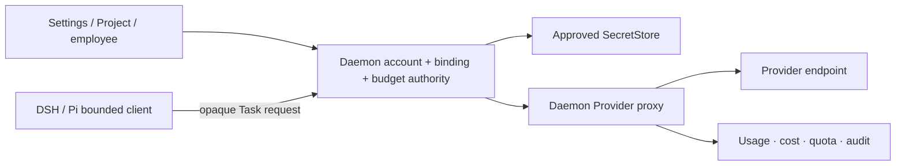

# Provider routing, SecretStore, budget, and usage architecture

- Status: current Provider authority plus OPC target
- Product: [Account Hub](../product/account-hub.md)
- Credential decision:
  [ADR-0055](../../../docs/adr/0055-personal-credential-import-boundary-and-a5-revision.md)
- Current product decision:
  [ADR-0059](../../../docs/adr/0059-personal-2-0-opc-project-runtime-and-memory-boundary.md)

## 1. Current foundation

Current daemon authority supports named Provider accounts, endpoint trust,
one-way SecretStore key operations, model catalog/pricing, fixed Agent binding,
daemon proxy, usage/cost provenance, advisory budgets/alerts, audit, and the
delivered Provider UI. Provider success is observation, not Task completion.

## 2. Target topology

DSH/Pi never receive secret material, SecretRef resolution, arbitrary headers,
or endpoint override.

## 3. Fact separation and binding

Consumer subscription, Provider account/auth, API billing/quota, model catalog,
binding, Personal budget, and usage/cost are separate records.

Effective binding:

`global -> Project -> employee -> Task`

The narrowest current admitted binding is materialized into Task/Attempt
dispatch. Role Blueprints hold capability requirements only. A default change
does not reroute running work; explicit rebind/restart reviews current identity,
Context, capability, budget, cost, and open Effects.

No ambient fallback, load balancing, or caller-selected credential exists.

## 4. Secret input and import

New secret input and ADR-0055 import terminate directly in an approved
SecretStore through a non-logging daemon path. Import is per-source consented,
defaults to retaining the source, and records only redacted metadata.

Raw secret material is excluded from browser, Agent/runtime, Conversation,
Vault, Context, Memory, SQLite authority, config, argv, env, logs, tests, and
evidence.

## 5. Budget and usage

Project, employee, and Task budgets attenuate. Enforcement evaluates current
envelopes before dispatch, stops new work at the boundary, retains unknown
Effects, and creates an Inbox adjustment request. It cannot mint budget or
silently reroute.

Quota, usage, and cost retain Provider/source/period/model/pricing/metering
basis. Unknown is not zero. Current advisory budgets remain labelled advisory
until enforcement is implemented.

## 6. Recovery

Credential, endpoint, catalog, binding, budget, and quota failures remain
distinct. Failed refresh preserves last-known catalog/binding with freshness.
Revocation/removal checks active Project/employee/Task bindings. Unknown
Provider outcomes reconcile before retry.

## 7. Contract and claim boundary

Binding hierarchy, subscription/OAuth observation, concrete importers, hard
budget enforcement, quota integration, and DSH/Pi OPC proxy composition are
**Requires-backend**. Public shapes require Lane-CTR. This chapter creates no
Provider-quality, support, qualification, cost-accuracy, Gate, release,
Profile, or business-outcome claim.
