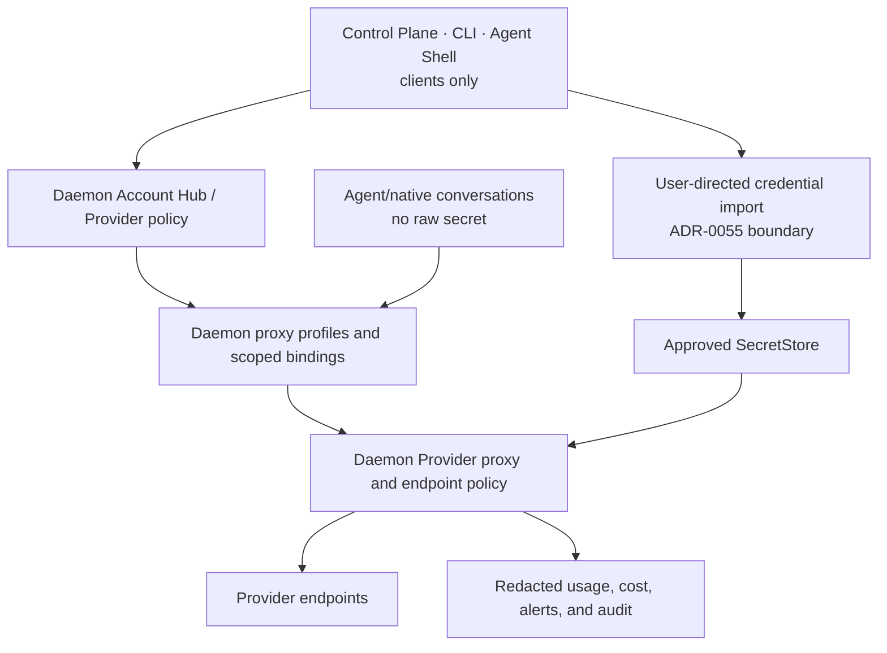

# Personal Provider Control Plane and Account Hub Architecture

- Status: informative current/target alignment
- Change class: `product-semantic + structural` documentation
- Product companions:
  [Provider Control Plane](../product/provider-control-plane.md) and
  [Account Hub](../product/account-hub.md)
- Credential-import decision:
  [ADR-0055](../../../docs/adr/0055-personal-credential-import-boundary-and-a5-revision.md)
- Desktop decision:
  [ADR-0056](../../../docs/adr/0056-personal-2-0-desktop-control-plane.md)
- Secret and recovery companion:
  [Authority, data and recovery](authority-data-and-recovery.md)

This chapter defines authority placement and target product composition. It
does not introduce a public account, profile, binding, or switching contract.

## 1. Current Provider Control Plane

### Now

P8-T13 delivered the daemon-owned Provider Control Plane:

- named Provider accounts and endpoint trust;
- current custom OpenAI-compatible account/endpoint support;
- approved Secret Store references and one-way key set/rotate/remove;
- model discovery/manual catalog and versioned pricing;
- fixed Agent-to-account/model bindings guarded by current revision;
- daemon-mediated Provider proxying;
- usage, cost provenance, advisory budgets, alerts, and redacted audit; and
- fail-closed endpoint, credential, and binding policy.

P7-T05 delivered the corresponding Control Plane account, binding, usage, and
audit experience. The daemon-served desktop panel is current product behavior.

Current bindings are Agent-scoped and fixed for dispatch. Current Provider
success remains an observation and never completes a Task. Current advisory
budgets do not silently become dispatch authority.

ADR-0053 currently permits one-time, memory-only browser key entry into the
daemon's approved management path. That accepted current behavior remains
truth until a separately implemented Account Hub input path supersedes it.

## 2. Authority topology

The daemon alone writes account metadata, import outcomes, proxy profiles,
bindings, usage, budgets, alerts, audit, and Secret Store references. The
browser, Shell, Agent, adapter, native conversation, and MCP server are never
secret custodians or Provider egress authorities.

## 3. Account Hub target

### 2.0 target

Account Hub is the Personal 2.0 **Settings** section that broadens the current
API-key account manager into an owner-local source and proxy-profile manager:

- import an account/subscription/API credential from an exact user-designated
  source under ADR-0055;
- show redacted source kind, account identity, auth health, expiry/freshness
  where safe, and import outcome;
- store material only in an approved `SecretStore`;
- create a non-secret daemon proxy profile that Agents can bind to;
- associate available models and Provider capabilities without exposing raw
  upstream responses;
- select Provider/profile scope for global defaults, Agents, or native
  conversations;
- show current effective binding and whether governed work is pinned to an
  older selection; and
- keep usage, pricing provenance, alerts, and audit attached to the exact
  effective profile revision.

Account Hub import is **Requires-backend**. ADR-0055 authorizes the boundary,
not an import mechanism.

## 4. Credential import and secret isolation

A user-directed import:

1. names the exact source and destination Secret Store before any read;
2. obtains per-source user consent;
3. is executed only by the daemon;
4. holds raw material only in daemon memory between source read and Secret Store
   write;
5. records only redacted source kind, target store, time, and outcome;
6. defaults to retaining the source, with secure deletion only by explicit
   per-import choice; and
7. never creates another plaintext copy.

Raw credential material never enters:

- browser state or DOM;
- Agent/native conversation/adapter/MCP wires;
- daemon authority database;
- ordinary configuration;
- environment, argv, service material, logs, tests, evidence, or chat; or
- Context, Memory, Skill, attachment, progress, or support output.

The common product projection carries redacted auth condition and an opaque
profile/login handle only. It never carries a client-resolvable secret
reference.

The exact secure flow for entering a brand-new credential that has no existing
import source remains a backend/security design decision. The 2.0 target must
not reintroduce raw browser or Agent custody merely for convenience.

## 5. Daemon proxy profile

A proxy profile is the non-secret authority relationship between:

- an Account Hub account;
- Provider kind and trusted endpoint policy;
- selected model/capability snapshot;
- the current Secret Store item referenced only inside the daemon;
- scope and purpose;
- profile/binding revision;
- usage/pricing provenance; and
- health, revocation, and recovery facts.

An Agent receives only the ability to use the daemon proxy within its current
binding. It does not receive the profile's secret reference, upstream token,
cookie, arbitrary header, or endpoint override.

Endpoint trust, DNS/address evaluation, redirect handling, transport bounds,
official endpoint rules, and Provider-native authentication remain daemon
decisions. Caller-provided arbitrary headers and implicit fallback remain
outside the architecture.

## 6. Scoped Provider selection

### 2.0 target

Provider selection has three explicit scopes:

| Scope | Meaning | Effect on current work |
|---|---|---|
| **Global** | default proxy profile for future eligible Agent/conversation bindings | does not rewrite existing Agent, conversation, assignment, or Task binding |
| **Agent** | default proxy profile for future work assigned to one Agent instance | does not rewrite a more specific conversation binding or current admitted work |
| **Conversation** | proxy profile selected for one exact opaque native lineage and its applicable Core ConversationBinding | does not change already admitted/running work without rebind |

The effective selection is materialized into governed work/assignment binding
at admission. There is no per-request browser override and no silent fallback.

Changing the global, Agent, or conversation default affects future eligible
work only. A current run requires explicit daemon **rebind**, or an explicit
runtime/session restart where the native adapter cannot rebind in place:

- exact current work, Agent, conversation, and profile identity;
- current expected binding/Plan/Task revision;
- impact on Context, budget, pricing, capabilities, and reproducibility;
- open Provider requests or Effects;
- owner confirmation where policy requires it; and
- a new durable binding/audit fact.

If safe rebind/restart cannot be proved, current work stays pinned or
pauses/blocks. The UI cannot emulate switching by changing a local preference.

Scoped selection and current-run rebind/restart are **Requires-backend**. Only
a new or changed public machine contract conditionally requires
P10-T02/Lane-CTR; a Personal-private projection may not.

## 7. Agent and conversation relationship

Native Agent login and Provider account login are distinct. A vendor adapter
may report native auth status through an opaque handle, but cannot pass native
or Provider tokens through the common conversation wire.

Conversation-scoped profiles reuse/reference existing Core
Conversation/ConversationBinding where applicable; vendor-native IDs remain
opaque origin bindings and do not create a second public Conversation model.

An Agent-scoped profile does not grant Tool, filesystem, network, MCP, Memory,
or Task authority. A conversation-scoped profile does not admit that
conversation into governed work. Profile use is one binding among the daemon's
Task/assignment policy facts.

When an Agent supports its own subscription/account path, Personal still
mediates the target product integration through Account Hub and the daemon
proxy profile. Direct Agent custody is not the 2.0 architecture.

## 8. Discovery, usage, and cost truth

Provider discovery and capability probing remain bounded foreground operations.
A failed refresh preserves the last known catalog and binding while marking
freshness and failure honestly. Reachability, authentication, model discovery,
and capability availability remain separate facts.

Usage records preserve source:

- Provider-reported;
- locally estimated with method;
- or unavailable.

Unknown values are not zero. Missing price remains unavailable rather than
free. Historical cost keeps the price/provenance used at calculation time.
Alerts and current advisory budgets remain observability unless a later
accepted product decision adds enforcement.

No prompt, completion, raw header, credential, imported source content, or
reversible secret derivative is required for the ledger or audit.

## 9. Mutation and recovery

Account, trust, catalog, profile, binding, import, and retention changes are
daemon-owned. External changes follow the same authority discipline:

- authenticate the exact owner/channel;
- resolve current identity and revision;
- preview scope, consequence, and rollback/reconciliation;
- persist Intent/Effect before external mutation;
- dispatch the minimum effect;
- verify and record a redacted outcome;
- preserve the prior usable catalog/binding when a refresh fails; and
- reconcile unknown outcomes with the original operation identity.

Deleting or revoking an account/profile is blocked or explicitly reconciled
when active bindings or work still depend on it. Provider success, account
health, native login, Agent output, and process exit remain insufficient for
Task acceptance.

## 10. Current/target boundary

| Capability | Status |
|---|---|
| Provider accounts, models, trust, fixed Agent binding, proxy, usage, budgets, alerts, audit | **Now** |
| Delivered Control Plane Provider/binding experience | **Now** |
| ADR-0055 user-directed credential-import permission boundary | **Now as governance**, no importer |
| Account Hub import implementations | **Requires-backend** |
| Daemon proxy profiles for imported subscription/account sources | **Requires-backend** |
| Global/Agent/conversation selection and current-run rebind/restart | **Requires-backend**; public shape conditionally requires P10-T02/Lane-CTR |
| Raw secrets in browser, Agent, adapter conversation, or MCP | **Forbidden target** |

This architecture creates no Provider-quality, Gate, release, Profile, or
Agent-benefit claim.
