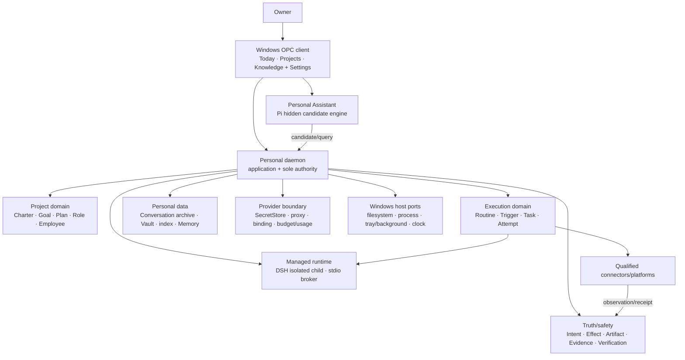

# CognitiveOS Personal system architecture

- Status: informative current/target alignment
- Change class: `product-semantic` architecture follow-through
- Current decision:
  [ADR-0059](../../../docs/adr/0059-personal-2-0-opc-project-runtime-and-memory-boundary.md)
- Preserved decisions: ADR-0035, ADR-0037, ADR-0043, ADR-0044, ADR-0053,
  ADR-0055, ADR-0057, and retained portions of ADR-0056/0058

## 1. Invariant and current system

Only the Rust daemon authorizes, writes authority, schedules, applies
version/epoch guards, persists/reconciles Effects, and accepts work. UI,
Personal Assistant, Pi, DSH, employees, adapters, engines, MCP servers, and
connectors are clients, candidate producers, observations, or bounded
executors.

Linux Personal 1.0 remains the current finalized six-family, Pi-qualified
system. Current Provider, Resource Manager, Task/Effect/verification, adapter,
dsh Path B, and daemon-served `/ui/` facts remain valid in their recorded
scope. They do not implement Windows OPC.

## 2. Target containers and dependency direction



Dependency direction is toward daemon-owned domain ports. Dual Track L1 on
the client is Today / Projects / Knowledge + Settings; Team and Inbox are
not first-level destinations. Windows, DSH, Pi,
Provider, Vault, and connector adapters implement those ports; they never
become authority owners.

## 3. Data ownership

| Data/fact | Owner |
|---|---|
| Project/Charter/Goal/Plan/Role/Assignment/Employee | daemon Project domain |
| Routine/Trigger/Task/Attempt/Handoff/Budget | daemon execution domain |
| Intent/Effect/reconciliation/evidence/acceptance | daemon truth/safety domains plus independent verifier |
| Personal Conversation archive/index and admitted Memory | Personal data domain |
| Project Markdown source files | Owner/Project Vault; indexed derivation is rebuildable |
| DSH artifact/installation/runtime/process facts | daemon-managed Agent/runtime authority; DSH output remains candidate |
| Provider credential | approved SecretStore only |
| Provider route/usage/budget facts | daemon Provider/budget authority |
| Windows process/filesystem/clock state | host observations behind daemon ports |

Project/Role/Employee/Routine/Attempt/Conversation/Vault are not generic
Resource families. Linux 1.0 families remain unchanged; MCP is an advanced
Personal-private family target.

## 4. Managed execution

DSH is a preinstalled managed Installed Agent and the default employee runtime.
The daemon admits an exact audited official artifact, starts an isolated child,
brokers bounded stdio, supplies bounded Context, proxies Provider traffic, and
owns health/update/rollback. DSH has no raw secret, authority store, ambient
tools, native MCP/base tools, HMR, home patch, native UI, or Conversation
ownership.

Pi supports the global Personal Assistant behind a default-deny client/sidecar
boundary. It remains hidden from ordinary Installed Agents and owns no archive,
Memory, Project/Task, secret, or completion.

An optional Attempt engine can supply checkpoint/interrupt/replay mechanics.
Its checkpoint is recovery input only. LangGraph may be evaluated behind that
port; it cannot own Task/Effect/scheduler state. Temporal remains behavior
reference only and no second scheduler is introduced.

## 5. Project activation and execution

```text
research candidate
  -> daemon draft
  -> Charter/Goal/Plan/Team/Permission/Budget/Trigger preview
  -> Owner confirmation
  -> active Project
  -> Routine/Task/Attempt dispatch
  -> Intent/Effect reconciliation
  -> independent verification
  -> daemon acceptance
```

Each Project has one current manager. Manager and member collaboration is
recorded as Tasks, artifacts, and handoffs. Within-boundary adjustments may be
admitted by policy; goal/team/budget/Provider/tool/permission/external-rule
changes require a new revision preview.

## 6. Recovery and failure behavior

External mutation is persisted before dispatch. Unknown outcome blocks blind
retry. Recovery reloads authority, establishes a fresh epoch, reconciles
Effects, re-observes host/runtime/origins, reauthorizes scope/budget/Provider,
rebuilds Context, and then chooses resume/pause/replace/quarantine.

Routine no-overlap and queue-latest remain daemon scheduler policy. Offline/
sleep produces missed facts. Consequential catch-up requires review. Closing
the client asks background/pause only when a Windows host backend can honor it.

## 7. Contract and claim boundary

ADR-0058's MCP private/fail-closed decisions remain. Its conversation envelope
`0.1` is not redefined as the Personal archive. A new private version or future
Lane-CTR is required before implementing the OPC conversation shape.

All target containers are **Requires-backend**; Windows host, DSH sandbox, and
connector acceptance also **Require-environment**. This architecture creates no
implementation, support, qualification, Gate, release, Profile, performance,
24/7, business-outcome, or Agent-benefit claim.
