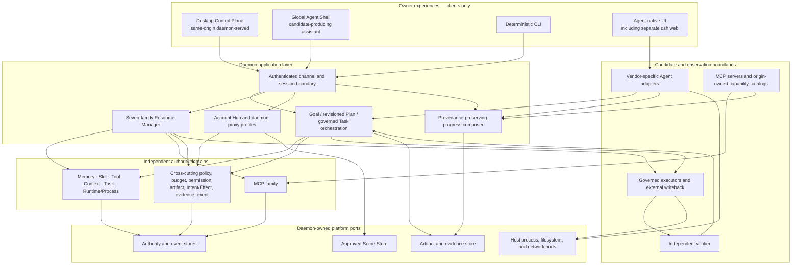
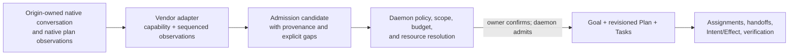

# CognitiveOS Personal System Architecture

- Status: informative current/target alignment
- Change class: owner-approved `product-semantic + structural` documentation
- Linux 1.0 decisions:
  [ADR-0035](../../../docs/adr/0035-personal-pi-shell-and-managed-agent-role-separation.md),
  [ADR-0036](../../../docs/adr/0036-personal-linux-1-0-and-official-pi-acquisition.md), and
  [ADR-0037](../../../docs/adr/0037-personal-unified-cognitive-resource-substrate.md)
- Personal 2.0 decisions:
  [ADR-0056](../../../docs/adr/0056-personal-2-0-desktop-control-plane.md) and
  [ADR-0057](../../../docs/adr/0057-personal-2-0-mcp-resource-family.md)

## 1. Purpose and invariant

Personal is the owner-local control plane for cognitive resources above the
host operating system. Linux still owns processes, filesystems, networking,
devices, and user isolation. Personal owns the higher-level authority facts
that make Agent work governed, inspectable, budgeted, recoverable, and
independently verifiable.

The architecture has one authority invariant:

> Agents, models, adapters, Shells, browsers, MCP servers, and origin systems
> produce requests, candidates, or observations. Only the deterministic Rust
> daemon authorizes, applies version and epoch guards, changes authority state,
> persists and reconciles Effects, and accepts work.

A unified control plane means a coherent owner experience over independent
domains. It never means a universal resource row, a shared lifecycle for
unrelated families, or a second writer beside the daemon.

## 2. Current system: Personal 1.0 plus delivered post-1.0 services

### Now

- Linux 1.0 retains six user-visible families: Memory, Skill, Tool, Context,
  Task, and Runtime/Process.
- One canonical daemon owns authority storage, scheduling, policy, Provider
  egress, Secret Store access, Effect reconciliation, and verification.
- The delivered Control Plane client is
  [`clients/pc/web/`](../../../clients/pc/web), statically served same-origin
  by the daemon. Native dsh web is a separate surface.
- The Resource Manager, Provider Control Plane, adapter
  registration/lifecycle boundary, and cross-episode learning admission path
  are delivered post-1.0 capabilities. Their presence creates no new Linux
  1.0 family or qualification transfer.
- The delivered P5 MCP Tool transport and bounded dynamic-Tool ecosystem remain
  Tool-family integration evidence. They do not implement the Personal 2.0 MCP
  family.
- Pi remains the only Agent covered by the Linux 1.0 qualification claim.
  Codex fixture qualification and the dsh integration path are not Pi evidence
  and are not a general multi-Agent runtime.
- The current Control Plane has no typed browser controls for Task
  cancel/pause/resume or Agent lifecycle, and no Goal, revisioned Plan, or
  common native-conversation projection service. Existing Core
  Conversation/ConversationBinding contracts do not make that product surface
  implemented. Those absences must remain visible.

## 3. Personal 2.0 layered composition

### 2.0 target

The boxes are responsibility boundaries, not deployment requirements. The
target still has one daemon authority. A sidecar, adapter, MCP process, native
Agent runtime, or browser can be separately supervised without becoming a
service authority.

## 4. Experience boundaries

### Desktop Control Plane

The Desktop Control Plane is the primary Personal 2.0 entry and remains a
same-origin, daemon-served client. It reads daemon projections and submits
conceptual typed actions through isolated channels. Its local cache, pending UI
state, optimistic feedback, and merged timeline are presentation state only.

The 2.0 information architecture has six spaces:

1. **Home** — readiness, attention, current governed work, health, and bounded
   alerts;
2. **Agents** — native identity, capabilities, conversations, Runtime/Process,
   bindings, lifecycle, and health;
3. **Work** — Goals, Plan revisions, Tasks, each Task's attempts/execution
   flows, Context, Effects, verification, and acceptance;
4. **Library** — Memory, Skills, Tools, MCP, and their federated bindings;
5. **Activity** — the time-ordered Native/Observed/Governed/Verified timeline
   with explicit audit coverage; and
6. **Settings** — Account Hub, Providers/models, System stewardship, sessions,
   workspace/permissions, and product configuration.

Navigation placement does not change family ownership: Context and Task belong
to Work, Runtime/Process belongs to Agents, and Providers/System are Settings
sections rather than families.

### Agent Shell

The Agent Shell is global assistance over the same daemon projections. It may
interpret intent, navigate, explain, and prepare a candidate admission. It may
not turn conversational fluency into authority state, claim native-session
control that an adapter does not support, or bypass exact confirmation and
typed daemon policy.

### Agent-native surfaces

An Agent-native UI remains the origin's own surface. In particular,
`cognitive dsh web` is not the Control Plane and does not share its authority
session. Native conversation and plan state observed there remains native
state until explicitly admitted.

## 5. Resource families

| Family | Now | Personal 2.0 responsibility |
|---|---|---|
| Memory | Linux 1.0 family | admitted durable knowledge; origin observations remain candidates until admission |
| Skill | Linux 1.0 family | immutable reusable content; content never implies capability |
| Tool | Linux 1.0 family | daemon-registered governed operations; MCP-advertised tools remain candidates |
| Context | Linux 1.0 family | authorized Task input with provenance and explicit loss; origin/MCP content remains source material |
| Task | Linux 1.0 family | current governed unit; target Tasks are created under an admitted Goal and revisioned Plan |
| Runtime/Process | Linux 1.0 family | strict package-to-process identities plus native conversation/runtime attachment observations |
| MCP | **Not a Linux 1.0 family** | target server, package, connection, capability, binding, health, and quarantine identities; config projection remains a governed external mutation |

Model, Provider profile, Budget, Permission, Artifact, Intent/Effect, Evidence,
Event, Goal, and Plan are cross-cutting or orchestration concepts. They do not
silently become extra resource families. Their implementation is
**Requires-backend**. Only a new or changed public Goal/Plan/MCP machine shape
conditionally requires P10-T02/Lane-CTR; a Personal-private projection may not.

## 6. Native conversation to governed work

### 2.0 target

Loading, resuming, forking, or closing a native conversation changes native
state only. A native plan is an observation and can inform a proposed Personal
Plan, but it is never the daemon's revisioned Plan. Admission records lineage
and provenance and creates new daemon authority; it does not rewrite the
origin's history.

Where applicable, the projection reuses or references existing Core
`Conversation` and `ConversationBinding`. Vendor-native conversation IDs remain
opaque origin bindings; any additional projection stays Personal-private until
P10-T02 decides otherwise.

The daemon owns the resulting Goal, Plan revisions, Task graph, Agent
assignments, handoffs, budget allocation, Effect lifecycle, verification, and
acceptance. Agents may propose every one of those decisions but cannot commit
them.

## 7. Vendor adapter fabric

The target uses one adapter per Agent/vendor integration rather than requiring
one vendor-neutral session protocol. Each adapter:

- uses the strongest safe native interface available, such as an Agent
  application server, RPC protocol, or native host integration;
- projects a minimal capability matrix and common conversation state;
- preserves adapter-specific detail in bounded render slots;
- reports sequenced native observations with source identity and provenance;
- exposes unsupported, unavailable, and unknown as different conditions;
- carries no Provider/user secret through its conversation wire; and
- emits only candidates or observations into daemon services.

ACP is optional interoperability, not an admission requirement. MCP plus
instructions/rules can exchange cooperative candidates where no native
integration exists, but cannot reliably impersonate login, conversation
lineage, interrupt, resume, fork, history, or runtime attachment.

The delivered P8 adapter manifest and private AKP boundary remain the current
registration and daemon-adaptation foundation. The richer conversation model
is **Requires-backend**. A new public machine contract conditionally requires
P10-T02/Lane-CTR; Personal-private projection state may not.

## 8. Federated resource and MCP boundary

Personal 2.0 is federated rather than copy-everything:

- the origin owns native conversation content, MCP-advertised content, and
  other source-native records;
- Personal owns policy, bindings, admission decisions, provenance,
  reconciliation facts, and the governed objects it explicitly creates;
- Agent connection establishes an explicit observation scope; observation may
  be automatic and non-mutating only inside it, with no speculative/global
  scan or surprise per-session enrollment;
- every writeback requires daemon authority, current expected origin revision,
  persisted Intent/Effect, verification, and a recoverable preimage. It may run
  automatically inside an unchanged exact daemon grant/risk policy; new,
  broader, destructive, or conflicted scope requires preview and confirmation;
- concurrent or ambiguous edits fail closed into an explicit reconcile path;
  timestamp order never silently chooses a winner.

Installing or connecting an MCP server grants no Tool authority. Advertised
tools, protocol resources, and prompts enter Tool, Context, and Skill
respectively as untrusted candidates. An administrator may preauthorize
reconciliation within an unchanged grant, but any capability, scope, target,
secret, or network expansion requires a new confirmation.

## 9. Control, data, and secret planes

| Plane | Content | Authority treatment |
|---|---|---|
| Control | exact identities, adapter/runtime attachment, capability status, epochs, policy and budget views | daemon validates current identity, version, scope, and channel |
| Candidate/observation | native conversation events, plans, history, MCP advertisements, progress, artifacts, bounded output | retained with provenance; never authority by shape |
| Governed data | admitted Context, Memory, Skill, Task, Goal/Plan references, bindings, Intent/Effect, evidence | daemon-owned and versioned under domain-specific rules |
| Secret | approved import/input path, `SecretStore`, daemon egress/proxy resolution | raw material is excluded from browser, Agent, adapter conversation, MCP, Context, logs, and evidence |

An external mutation permit exists only after the daemon has authorized the
exact operation and persisted its Intent/Effect and fencing identity. A native
or MCP receipt remains an observation until daemon reconciliation and
independent verification.

## 10. Progress and recovery composition

The target progress timeline merges four labeled lanes without erasing source:

- **Native** — origin conversation or native plan event;
- **Observed** — adapter/process/MCP observation;
- **Governed** — daemon Goal, Plan, Task, assignment, Intent/Effect,
  reconciliation, or policy fact;
- **Verified** — independent verification and daemon acceptance only.

Every item preserves source identity, sequence/cursor when available, observed
time, daemon record linkage, and confidence/coverage. Missing coverage remains
visible. The client must not manufacture a continuous lifecycle from gaps.

Detach, interrupt, cancel, pause, restart, fork, and compensating undo remain
different operations. Their exact ownership and recovery semantics are defined
in [Authority, data and recovery](authority-data-and-recovery.md).

## 11. Required future work

| Target capability | Status |
|---|---|
| Goal and revisioned Plan authority plus Goal/Plan/Task/Attempt graph | **Requires-backend**; P10-T02/Lane-CTR only if new public machine semantics are selected |
| Native Agent identity, capability, auth, conversation, turn, history, attachment, plan, and runtime projection | **Requires-backend**; reuse Core Conversation/ConversationBinding, with P10-T02 only for a public extension |
| Typed browser Task and Agent controls | **Requires-backend** |
| Browser session lifecycle/introspection beyond current issuance | **Requires-backend** |
| MCP seventh-family identities and lifecycle | **Requires-backend**; P10-T02/Lane-CTR only for a new/changed public machine surface |
| Federated origin observation, conflict records, and governed writeback | **Requires-backend**; shared public contract portions conditionally require Lane-CTR |
| Account Hub credential import and scoped Provider switching/rebinding | **Requires-backend** |
| Complete cross-domain progress projection | **Requires-backend** |

This architecture does not authorize those changes by itself. Current facts,
formal task status, and claim boundaries remain owned by
[PROGRESS.md](../../../docs/plan/PROGRESS.md) and the
[Personal development plan](../../../docs/plan/PERSONAL-DEVELOPMENT-PLAN.md).
