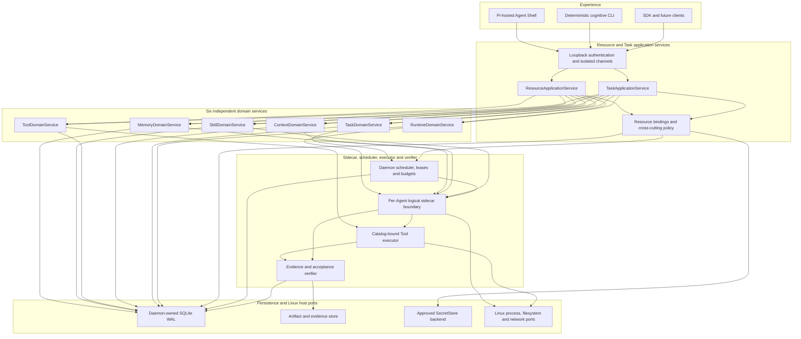
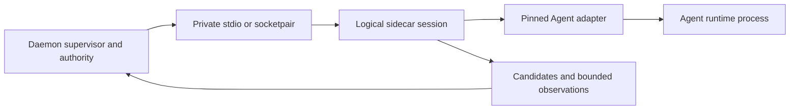
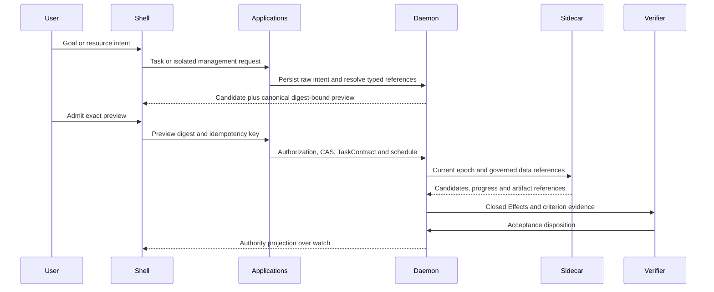

# CognitiveOS Personal System Architecture

- Status: informative target/design architecture
- Change class: owner-approved `product-semantic + structural` documentation
- Product release target: Linux 1.0 through `GMVP-LINUX`
- Existing decisions: [ADR-0035](../../../docs/adr/0035-personal-pi-shell-and-managed-agent-role-separation.md),
  [ADR-0036](../../../docs/adr/0036-personal-linux-1-0-and-official-pi-acquisition.md)

## 1. Architectural purpose and invariant

Personal is not a replacement for the Linux kernel. Linux owns hardware,
processes, filesystems, networking and user isolation. Personal is the local
control plane for the higher-level cognitive-resource facts that make Agent
work inspectable, bounded and recoverable.

The design has one authority invariant:

> A probabilistic component may produce a candidate or observation. Only the
> deterministic Rust daemon may authorize, apply CAS, advance lifecycle state,
> grant budget or capability, persist and reconcile an Effect, or accept a
> Task.

The unified control plane therefore means one discovery and management
projection over six domain services. It does not mean a universal persisted
resource object, one lifecycle enum or a second authority beside the daemon.

## 2. Layered model

The boxes describe responsibility, not one-process-per-box deployment. Linux
1.0 keeps one canonical daemon service. A sidecar may be a separately supervised
OS process, but it remains subordinate to that daemon and does not become a
service authority.

## 3. Experience and application services

Every experience component is a client. The Pi-hosted Shell and deterministic
CLI call the same application services; client-local caches, conversation text
and optimistic UI state never replace authority projections. Task and
management channels have separate credentials, retry identities, watch cursors,
projection caches and operation sets.

`TaskApplicationService` is the specialized command path for the Task family:
persist raw intent,
clarify, construct a digest-bound preview, admit the exact `TaskContract`,
control it under epoch CAS, and expose authority-backed Task/watch projections.
It composes typed references to Memory, Skill, Tool, Context and Runtime while
leaving every family lifecycle independent. Model, Budget, Permission,
Artifact, Intent/Effect, Evidence and Event bind across those families through
deterministic policy rather than becoming additional domains.

### 3.1 ResourceApplicationService

`ResourceApplicationService` is a narrow, versioned management projection. Its
common operation vocabulary is limited to:

| Operation | Common meaning | Domain responsibility |
|---|---|---|
| `list` | return a bounded family/scope page at a declared projection version | select and authorize domain records |
| `inspect` | return one exact stable ID and current projection version | supply domain-specific details and lifecycle state |
| `watch` | resume a bounded event projection from a versioned cursor | emit typed events and deduplicate delivery |
| `bind` | request a typed relationship under expected-version guards | validate relationship and run the domain transition |
| `unbind` | request removal of a typed relationship under guards | enforce safety, dependencies and domain transition |
| `enable` | request admission to domain-defined usable state | apply typed health, policy and lifecycle rules |
| `disable` | stop new use without fabricating removal or completion | quiesce/fence according to the domain lifecycle |
| `revoke` | invalidate a grant, binding or usable revision | fence affected use and expose consequences |

Every mutating request includes exact stable IDs, expected object/projection
versions, idempotency identity and the authenticated channel. The common
service does not expose generic `create`, `install`, `execute`, `complete` or
arbitrary state transitions. Acquisition, admission, execution, reconciliation,
retention and purge remain typed domain or Task workflows.

### 3.2 Common resource projection

Each list/inspect/watch item exposes a stable envelope with:

- stable ID;
- resource family;
- revision digest, or an explicit reason why the domain object has no immutable
  revision;
- scope and owner;
- health;
- typed bindings;
- current usage and bounded budget/lease facts when applicable;
- blocked reason;
- currently allowed actions;
- object version, projection version and watch cursor.

The envelope is assembled from domain authority facts. It is not a universal
SQLite row, does not normalize domain state names, and cannot be written back
as a generic resource object. Unknown or unavailable data stays explicit.

## 4. Six independent domain services

| Domain service | Own schema and lifecycle examples | Common projection examples |
|---|---|---|
| Memory | admitted records, provenance, conflict set and tombstone; propose/admit/retrieve/forget | admitted revision, owner/scope, retrieval use and conflicts |
| Skill | package/revision identity, provenance and Task pin; import/qualify/pin/deprecate/revoke | stable Skill ID, `SkillRevision` digest, Task bindings and reuse |
| Tool | immutable descriptor, operation candidate and availability; register/qualify/enable/quarantine/revoke | descriptor digest, effect class, capability and health |
| Context | source references, `ContextRequest`, `ContextView`, provenance, losses and delta; resolve/render/invalidate | view digest, source bindings, token usage and stale blockers |
| Task | raw intent, `TaskContract`, Task/Loop, checkpoint and verification binding; propose/preview/admit/control/accept | objective, current state, budget, resource bindings and acceptance blockers |
| Runtime/Process | package, installation, registration, instance, sidecar binding, `AgentExecution` and process observation; acquire/install/register/activate/suspend/replace/remove | exact package/adapter digests, instance health, execution/process usage |

Model, Budget, Permission, Artifact, Intent/Effect, Evidence and Event remain
cross-cutting authority concepts composed with these domains; they are not
silently promoted into a seventh generic resource lifecycle. Agent is the
user-facing Runtime projection, but package, installation, registration,
instance, sidecar, execution and process identities are not collapsed merely
because the Shell lists them together.

## 5. Per-Agent sidecar execution boundary

For every active `AgentInstance`, the daemon supervises exactly one logical
sidecar session. Linux 1.0 may realize that session as one separate OS process.
The daemon creates private stdio pipes or a socketpair and runs framed AKP over
that transport.

The sidecar has no public listener. This local parent-child boundary does not
require TLS PKI, service discovery or a service mesh. The transport carries no
daemon bootstrap or ambient management authority. On daemon restart, inherited
transport closure or parent-death supervision makes the old sidecar exit. The
daemon reloads authority state, establishes a higher epoch, then creates a new
sidecar session; it never adopts the old session as current.

The sidecar may translate Agent protocol, construct candidates and report
bounded process/progress observations. It cannot authorize a Tool, change a
budget, commit an Effect, reconcile an external mutation or complete a Task.

## 6. Control plane and data plane

The private AKP boundary separates two logical planes even if both use the same
framed transport:

| Plane | Allowed content | Rules |
|---|---|---|
| Control plane | handshake; package, adapter, instance and execution identities; protocol digest; lifecycle request/observation; budget/capability snapshot; current epoch | daemon validates exact digests and versions; stale epoch or adapter/protocol digest drift fails closed |
| Data plane | governed Context and Skill references; Memory and Tool candidates; progress; artifact references; bounded stdout/stderr or event streams; content-addressed references | references are scoped and digest-bound; sidecar output remains candidate/observation until deterministic validation |

Provider/user secret material belongs to neither plane. The daemon resolves it
only at an approved Secret Store/egress boundary.

A mutating Tool permit is issued only after the daemon has authorized the exact
operation and durably persisted its Intent, Effect, stable idempotency key,
dispatch identity and epoch. The permit is narrow, short-lived and bound to the
Task, execution, sidecar session, Tool descriptor, capability, budget and
Effect. A sidecar receipt is an observation: it is not an Effect commit,
reconciliation result, verification result or Task completion.

## 7. Core flows

### 7.1 Governed Task flow

The Shell cannot convert its proposal, Pi `agent_end`, sidecar output or an
optimistic display into authority state.

### 7.2 External mutation

```mermaid
flowchart LR
  operationCandidate["Tool operation candidate"] --> authorizeOperation["Daemon catalog, capability and budget checks"]
  authorizeOperation --> persistIntent["Persist Intent"]
  persistIntent --> persistEffect["Persist Effect and original key"]
  persistEffect --> issuePermit["Issue epoch-bound dispatch permit"]
  issuePermit --> externalDispatch["Executor dispatch"]
  externalDispatch --> receiptObservation["Receipt or unknown observation"]
  receiptObservation --> reconcileEffect["Daemon query and reconcile with original key"]
  reconcileEffect --> verifyOutcome["Artifact, evidence and acceptance"]
```

An unknown dispatch outcome is never retried under a new identity. External
success and receipt persistence are distinct from authoritative Effect closure,
which is distinct again from Task completion.

## 8. Future Linux and hardware evolution ports

The architecture preserves narrow ports so later product work can evolve
without moving authority out of the daemon:

| Port | Target responsibility |
|---|---|
| Identity/store | durable identity records, versions, CAS and migration |
| Scope/capability | owner, tenant/workspace scope, policy and revocation |
| Scheduler/lease/budget | eligibility, fencing, placement constraints and hard ceilings |
| Agent/sidecar execution | private protocol, lifecycle supervision and bounded observations |
| Tool executor | descriptor-bound execution, idempotency, query and reconciliation |
| Context/Memory source | authorized source resolution, provenance and content-addressed reads |
| Artifact/evidence | governed output, immutable evidence and verifier references |
| Secret | desktop Secret Service or headless encrypted-vault reference resolution at approved egress only |
| Event/watch/transport | bounded events, cursors, resumable projection and private framed transport |
| Placement description | declarative host/device requirements and observed compatibility, not a scheduling authority |

These are design ports, not current generalized infrastructure. The target does
not now implement a kernel module, eBPF policy system, cgroup orchestrator,
container or VM abstraction, device scheduler, TPM framework, shared-memory
protocol, device bus or distributed authority. Such work requires a separate
approved task, threat model and evidence plan; placement descriptions cannot
grant capability or dispatch work by themselves.

## 9. Current-versus-target boundary

This document defines target composition only. It does not assert that all six
domain services, the sidecar, UCR-01, managed Pi lifecycle, Task/Tool/recovery
closure, any Gate, Linux release or Profile are implemented or passed. Exact
current facts remain only in [PROGRESS.md](../../../docs/plan/PROGRESS.md); formal task
and Gate meaning remains in the
[Personal development plan](../../../docs/plan/PERSONAL-DEVELOPMENT-PLAN.md).
