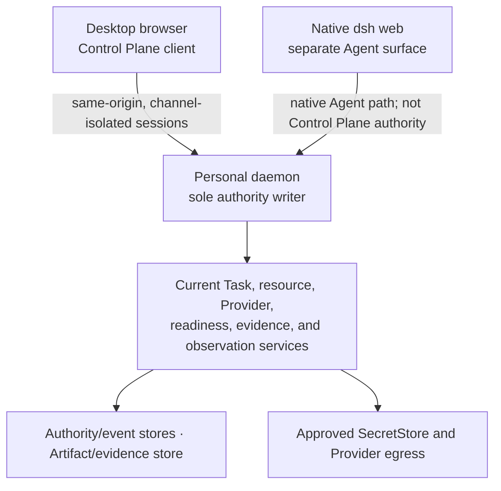

# CognitiveOS Personal Desktop Control Plane Architecture

- Status: informative current/target alignment
- Change class: `product-semantic + structural` documentation
- Current stack/security decision:
  [ADR-0053](../../../docs/adr/0053-personal-web-ui-stack.md)
- Repository location update:
  [ADR-0054](../../../docs/adr/0054-repository-subproject-structure-and-1.0.0-finalization.md)
- Personal 2.0 decision:
  [ADR-0056](../../../docs/adr/0056-personal-2-0-desktop-control-plane.md)
- Product companions:
  [Web UI design](../product/web-ui-design.md),
  [Agent integration and conversations](../product/agent-integration-and-conversations.md),
  and [Account Hub](../product/account-hub.md)
- Architecture companions:
  [System architecture](system-architecture.md),
  [Agent adapter architecture](agent-adapter-contract.md),
  [Resource Manager](resource-manager-architecture.md), and
  [Provider Control Plane](provider-control-plane.md)

This chapter defines client responsibility and conceptual product state. It
does not define a new public API, machine schema, error vocabulary, or
lifecycle.

## 1. Current product topology

### Now

The delivered Control Plane is the React/TypeScript client at
[`clients/pc/web/`](../../../clients/pc/web). The Personal daemon serves its
static bundle same-origin under `/ui/` on the daemon's loopback listener. A
separate development server is not the product origin.



P7-T05 delivered the current seven-space operator UI, governed Task creation
and observation, Provider/binding governance, Resource views, Activity,
System/readiness, a command layer, and reconnectable watch handling. That work
is no longer a design-only proposal.

Current limitations remain product facts:

- the browser has no typed Task cancel/pause/resume controls;
- the browser has no typed Agent lifecycle controls;
- the daemon exposes no Goal, revisioned Plan, or native-conversation product
  service to the Control Plane;
- Agent-native histories, plans, attachments, approvals, and turn steering are
  not a common Control Plane projection;
- live and cross-domain coverage remains bounded by the daemon projections; and
- native `cognitive dsh web` remains a separate UI with a separate session and
  lifecycle.

The UI must continue to say these capabilities are absent rather than render a
plausible but non-functional lifecycle.

## 2. Trust boundary

The browser is an untrusted client. Same-origin serving reduces deployment and
cross-origin risk; it does not make browser state authoritative.

- The daemon remains the only authority writer.
- Management and Task credentials, caches, retries, and cursors remain
  isolated.
- Session material is memory-only. It is excluded from browser persistence,
  URLs, history, telemetry, support data, and rendered content.
- Browser code has no direct authority-store, Secret Store, filesystem,
  process, shell, or Provider-network access.
- Returned Agent, MCP, Provider, event, attachment, and tool content is
  untrusted display data.
- Client-side redaction is defense in depth; the daemon boundary is responsible
  for preventing secret-bearing projections.
- A client acknowledgement is not an Effect result, verification result, or
  completion decision.

ADR-0053 remains authoritative for the current one-time, memory-only bootstrap
and key-entry behavior. The Personal 2.0 Account Hub target moves
user-directed credential import behind a daemon-owned, non-logging boundary so
raw imported material does not pass through the browser.

## 3. Personal 2.0 information architecture

### 2.0 target

The target reduces the current seven top-level spaces to six:

| Space | Product responsibility |
|---|---|
| **Home** | readiness, needs-attention queue, current governed work, blocked reconciliation, and entry to recovery |
| **Agents** | vendor/native identity, adapter capability, authentication readiness, conversations/history, Runtime/Process attachment, bindings, lifecycle, health, and current handoffs |
| **Work** | daemon-admitted Goal -> Plan revision -> Task -> Attempt hierarchy, execution flows, Context, assignments, Effects, evidence, and acceptance |
| **Library** | Memory, Skills, Tools, MCP, federated origin state, Personal bindings, and conflict/reconcile status |
| **Activity** | one source-labelled Native/Observed/Governed/Verified timeline with explicit ordering and coverage limits |
| **Settings** | Account Hub, Providers/models, System readiness/stewardship, sessions, workspace/permissions, backup/recovery, and product configuration |

The current Providers and System spaces become Settings sections. The current
Resources space becomes Library; Context moves to Work and Runtime/Process
moves to Agents without changing family ownership. Activity remains a
top-level timeline and also appears contextually on object detail. It is a
projection over preserved source identities, not an authority or resource
family.

The global Agent Shell may be available from the app shell as an assistant for
navigation, explanation, and candidate preparation. It does not become a
seventh space, a native Agent conversation controller, or an authority path.

## 4. Client composition

### 2.0 target

```text
desktop app shell
  -> session and channel boundary
  -> capability-aware navigation and command layer
  -> authority projection cache
  -> native Agent/conversation projection cache
  -> federated Library and Settings/Account Hub projections
  -> provenance-preserving progress composer
  -> confirmation, approval, and recovery surfaces
  -> redaction, escaping, and secret-shape rejection
```

These are client modules, not daemon domains. The client may derive
presentation groupings, sorting, and links. It may not derive authority state,
invent missing sequence, infer completion, decide policy, or resolve a
federated conflict.

The projection cache records source, observed version/cursor, freshness,
coverage, and the last authoritative snapshot. A gap, daemon restart, or
revision mismatch marks affected views stale until a fresh bounded snapshot is
accepted. Mutations are never replayed from browser memory after restart.

## 5. Conceptual product state

The Control Plane consumes conceptual projections rather than one universal
client DTO. Each projection preserves the owning source and uses the domain's
native identity.

### Common capability condition

For every action or adapter feature, the UI distinguishes:

| Condition | Meaning | Rendering consequence |
|---|---|---|
| **Supported** | the adapter/daemon declares the capability and current facts allow evaluation | render current state and only actions the authority projection allows |
| **Unsupported** | the integration declares that the capability does not exist | explain the permanent integration limit; do not show a temporarily disabled control |
| **Unavailable** | the capability exists but current auth, runtime, connection, policy, or dependency prevents use | show the blocking fact and recovery path |
| **Unknown** | Personal lacks enough current observation to decide | preserve uncertainty; never infer supported, unavailable, success, or failure |

Unsupported, unavailable, unknown, denied, stale, and not-yet-implemented are
not synonyms.

### Agent and conversation reading

The common Agent reading includes only concepts shared safely across adapters:

- adapter initialization and identity;
- declared capability conditions;
- authentication status plus an opaque login handle;
- native conversation identity, lineage, summary, and freshness;
- active turn and event sequence coverage;
- native plan, history, attachment, tool-approval, MCP-binding, and runtime
  attachment availability;
- Personal binding/admission links; and
- bounded adapter-specific render slots.

Where applicable, the reading reuses or references existing Core
`Conversation` and `ConversationBinding` identities. Vendor-native
conversation/thread IDs are opaque origin bindings, not a duplicate public
Conversation model. Additional projection state remains Personal-private
(ADR-0058); it is not a public Core schema.

Agent connection establishes an explicit observation scope. Conversation lists
and event updates may refresh automatically only inside that scope; the client
must not imply a speculative/global session scan or surprise per-session
enrollment.

Render slots are escaped, source-labeled views. They may expose native detail
without promoting vendor fields into a common public contract or authority
state.

### Work reading

The Work space keeps three things visibly separate:

1. origin-owned native conversation and native-plan observations;
2. daemon-owned Goal, Plan revision, Task graph, assignments, budgets,
   Intent/Effect, and policy facts; and
3. independent verification and acceptance.

Opening, loading, resuming, forking, steering, interrupting, or closing a
native conversation does not create or change a Personal Goal/Plan/Task.
The owner may request **Manage with Personal** and confirm the daemon preview;
only the daemon admits the Goal -> Plan revision -> Task -> Attempt hierarchy.

## 6. Progress timeline

The timeline is a presentation composition with four labeled provenance lanes:

| Lane | Examples | Claim boundary |
|---|---|---|
| **Native** | conversation messages, native plan updates, native tool/approval events | origin state only |
| **Observed** | adapter sequence, process/runtime status, MCP observation, bounded output | observation only |
| **Governed** | Goal -> Plan revision -> Task -> Attempt facts, assignments, policy decisions, Intent/Effect, reconciliation | daemon authority |
| **Verified** | evidence, verifier disposition, accepted outcome | completion authority only when the daemon records acceptance |

Each item preserves source identity, source sequence or cursor when available,
observation time, daemon linkage, and coverage. If ordering between sources
cannot be proven, the UI groups by provenance and states the ambiguity; it does
not sort timestamps and call the result authoritative.

No spinner, fluent Agent response, native "done", process exit, closed stream,
or Provider success becomes a synthetic lifecycle state.

## 7. Controls and recovery language

The UI offers a control only when a typed daemon or native-adapter capability
exists and the current projection says it is usable. It distinguishes:

- **detach** — stop this client observing;
- **interrupt** — request that the current native turn yield;
- **cancel** — request daemon-owned Task closure;
- **pause** — reach a governed safe point and fence new work;
- **restart** — replace runtime/session execution machinery;
- **native fork** — create a new native conversation lineage;
- **retry/fork from checkpoint** — create a preserved new governed attempt
  without erasing the prior attempt or evidence;
- **close** — close native conversation state without implying Task outcome;
- **undo** — request a compensating governed action, never erase history.

The current UI lacks typed Task and Agent controls, so those target slots remain
**Requires-backend**. A native adapter may support interrupt or fork while
daemon Task cancel remains unavailable; the UI must not merge those facts.

Tool approvals are likewise source-specific. A native approval is an Agent
runtime decision; an external mutation still requires Personal authorization,
persisted Intent/Effect, reconciliation, and verification.

## 8. Account Hub and secrets

### 2.0 target

The Account Hub displays redacted account identity, source, auth health, daemon
proxy profile, selected Provider/model, binding scope, usage provenance, and
recovery state. It never renders raw credential material or a client-resolvable
secret reference.

Current custom OpenAI-compatible account/endpoint support remains **Now**.
Broader subscription/OAuth, credential-import, preset-adapter, and
global/Agent/conversation override behavior is **Requires-backend**.

A user-directed import names the exact source and destination before the daemon
reads it. The daemon alone reads the source, stores material in an approved
`SecretStore`, creates or updates the non-secret proxy profile, and returns
redacted outcome metadata. Browser, Agent, adapter, native conversation, MCP,
Context, logs, and evidence never receive the material.

Provider selection may be scoped as a global default, Agent selection, or
conversation selection. Existing admitted/running work stays pinned. Changing
the effective selection for current work requires an explicit daemon rebind
with version and consequence review; a browser preference cannot reroute it.

Account import and the expanded selection/rebind model are
**Requires-backend**.

## 9. Federated resources and MCP presentation

The Library space distinguishes origin content from Personal governance:

- origin records show origin identity, current observed revision, and
  observation freshness;
- Personal bindings show admitted scope, policy revision, capability, and
  writeback/reconcile state;
- conflicts show both versions and the blocked operation;
- no client-side last-write-wins resolution is permitted.

Every writeback remains a daemon Intent/Effect operation. The UI may show
automatic application only inside an unchanged exact daemon grant/risk policy;
new, broader, destructive, or conflicted scope requires preview and
confirmation.

The target MCP family shows server, package, connection, capability, binding,
health, and quarantine identities plus external configuration projection
receipts. Advertised tools, protocol resources, and prompts are explicitly
untrusted candidates into Tool, Context, and Skill respectively. "Installed"
and "connected" never mean "authorized to run."

MCP family rendering is **Requires-backend**. Only a new or changed public
machine surface conditionally requires P10-T02/Lane-CTR; a Personal-private
projection may not. The current six-family UI remains truthful until the
backend exists.

## 10. Failure and restart behavior

The Control Plane remains useful as a diagnostic client when a Provider,
Secret Store, Agent, adapter, MCP server, native session, or Task worker is
unavailable. It preserves:

- last known state with age and source;
- current reachability/authentication separately from last known content;
- unsupported, unavailable, unknown, denied, stale, blocked, failed, and
  outcome-unknown distinctions; and
- one valid recovery action, or an honest statement that no product control
  currently exists.

On daemon restart, browser sessions and session-scoped caches are discarded or
marked stale and projections are reloaded. Native conversations may continue
at their origins; Personal does not claim continuity until adapters reattach,
sequence gaps are reconciled, and authority bindings are current.

## 11. Current versus target matrix

| Capability | Status |
|---|---|
| React/TypeScript client in `clients/pc/web`, daemon-served same-origin `/ui/` | **Now** |
| Current seven-space Control Plane and delivered P7 workflows | **Now** |
| Six-space Home/Agents/Work/Library/Activity/Settings IA | **2.0 target** |
| Native Agent identity/capability/conversation/history/plan/attachment projection | **Requires-backend** |
| Goal and revisioned Plan projections | **Requires-backend**; P10-T02/Lane-CTR only for new public machine semantics |
| Typed Task and Agent lifecycle controls | **Requires-backend** |
| Complete cross-domain progress stream | **Requires-backend** |
| Account Hub credential import and scoped Provider rebind | **Requires-backend** |
| MCP seventh-family UI | **Requires-backend**; P10-T02/Lane-CTR only for a new/changed public machine surface |
| Native dsh web merged into Control Plane | **Not a target**; remains separate |

This architecture creates no Gate, release, Profile, or Agent-benefit claim.
The [route inventory](web-ui-route-inventory.json) is a frozen P7-T05/D01 input
whose checkout metadata predates ADR-0054. It is not a current exhaustive
inventory and not permission to invent the target backend.
