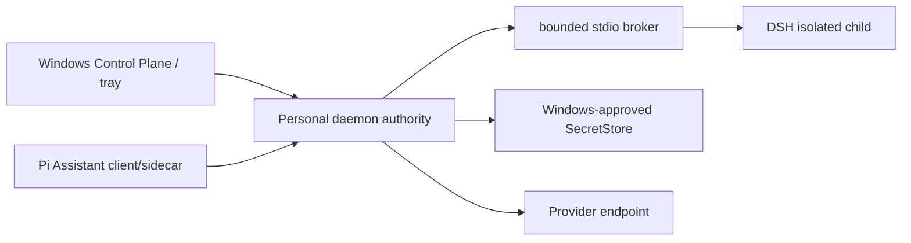

# Windows host, installation, background, and recovery architecture

- Status: Personal 2.0 target; `Requires-backend + Requires-environment`
- Decision: [ADR-0059](../../../docs/adr/0059-personal-2-0-opc-project-runtime-and-memory-boundary.md)
- Existing Windows boundary:
  [ADR-0052](../../../docs/adr/0052-personal-windows-install-surface.md)
- Environment registry:
  [PERSONAL-TEST-ENVIRONMENTS.md](../../../docs/plan/PERSONAL-TEST-ENVIRONMENTS.md)

## 1. Product host boundary

Personal 2.0 runs one owner-local daemon authority on Windows. UI, DSH child,
Pi Assistant engine, indexers, connectors, and host integration remain clients/
workers. No tray process, Windows service, Task Scheduler job, or child runtime
may write authority directly.

## 2. Personal Home

Target layout separates replaceable application bytes and retained user data:

```text
Personal Home/
  app/
  data/
```

Upgrades replace admitted `app/` content and preserve `data/`. Uninstall
defaults to retaining data. Project directories hold human-readable source/
Vault/artifact/export data; authority/SecretStore/index data retain their own
locations and access controls.

## 3. Process and isolation topology



DSH receives only bounded Context and brokered operations. It receives no raw
SecretStore material, env/plaintext credential, authority DB, native MCP/base
tools, HMR, or home patch. Windows ACL/job/process containment requires
independent qualification; ordinary MSVC CI is not containment evidence.

## 4. Tray, close, sleep, and offline

The UI/tray observes daemon state and requests typed lifecycle actions. Closing
the main window asks background/pause only if the daemon can honor it. A tray
icon is not authority or proof work continues.

Sleep, shutdown, daemon stop, network loss, locked SecretStore, and Provider
outage become explicit offline/missed facts. Wake/restart sequence:

1. reload authority and establish a fresh epoch;
2. reconcile pending/unknown Effects;
3. re-observe clock, filesystem, SecretStore, Provider, broker, and DSH;
4. reauthorize current Project/Task/budget/binding;
5. rebuild Context;
6. classify missed work and ask for consequential catch-up;
7. resume only eligible work.

No product component promises execution while the host is off.

## 5. Update, rollback, restore, export

Product and DSH updates use exact artifact identity, provenance/SBOM/signature
policy, staging, compatibility checks, active/rollback slots, health, and
durable receipts. Unknown activation is reconciled before retry.

Same-disk automatic versions are **local restore points**, not disaster
backups. Manual export is distinct and excludes secrets by default. Project
archive precedes permanent deletion.

## 6. Validation route

- Local `DEV-WIN-GNU-01`: documentation/TypeScript/non-linking checks only;
  never supported Rust/Windows evidence.
- `CI-WINDOWS-MSVC-01`: ordinary compile/test evidence only.
- Future qualified Windows development environment: native host/service/tray/
  filesystem/SecretStore/process behavior.
- Future `B01-W`: fixed clean-machine install/upgrade/recovery/first-project
  campaign; currently not provisioned.

No Linux, WSL, ordinary CI, Canvas, or local GNU result transfers into Windows
product support or release.

## 7. Non-claims

This chapter implements no Windows service/tray, Personal Home, installer,
Credential Manager, DSH sandbox, background execution, sleep recovery, update,
restore, or export. It does not establish B01-W, containment, support, release,
Profile, or 24/7 operation.
